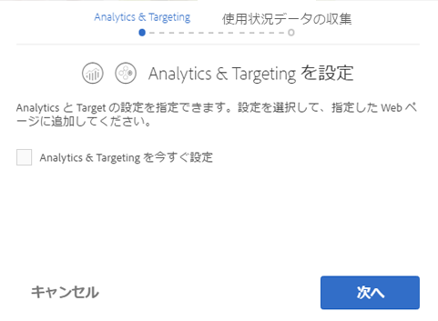

# Adobe Marketing Cloud との統合{#integrating-with-the-adobe-marketing-cloud}

[Adobe Marketing Cloud](https://www.adobe.com/solutions/digital-marketing.html) には、すぐに利用可能なリアルタイムのデータおよび情報を提供してオンラインビジネスを成功に導く、強力な Web 分析および Web サイト最適化製品が含まれています。Adobe Marketing Cloud は、オンラインビジネス最適化のための統合されたオープンプラットフォームを提供します。Adobe Marketing Cloud は、顧客のインサイトを収集してその力を解き放ち、顧客の獲得、コンバージョンおよび維持の取り組みやコンテンツの作成および配信を最適化する統合アプリケーションにより構成されます。

Adobe Experience Manager(AEM)では、Adobe Marketing Cloudの次の製品とシームレスに統合できます。

* Adobe Analytics：マーケティング担当者は、オンライン戦略やマーケティング戦略に関して、すぐに利用可能なリアルタイムの情報を入手できます。
* Adobe Target：オンラインコンテンツと顧客との関連性を継続的に高め、より多くのコンバージョンを生み出すための機能をマーケティング担当者に提供します。
* Adobe Scene7：メディア管理の自動化、Web 公開の効率化および Web エクスペリエンスの強化をホストされた環境内で自動化します。
* Adobe Dynamic Tag Management：無制限の数のアドビやサードパーティのタグをすばやく簡単に管理できる直感的なツールをマーケティング担当者に提供します。
* Adobe Search&amp;Promote：サイトの検索結果を管理および最適化できる機能をマーケティング担当者に提供します。
* Adobe Campaign では、電子メール配信コンテンツを Adobe Experience Manager で直接管理できます。

In addition, you can [integrate AEM with Creative Cloud](/help/assets/aem-cc-folder-sharing-best-practices.md) and with [third-party services](/help/sites-administering/third-party-services.md).

## Adobe Analytics との統合 {#integrating-with-adobe-analytics}

[Adobe Analytics](https://www.omniture.com/en/products/analytics/sitecatalyst) は、複数のマーケティングチャネルにわたるすべてのオンラインイニシアチブの統合データを、デジタルマーケターが1か所で測定、分析、最適化できる、業界トップクラスのソリューションです。 このソリューションを使用すると、マーケティング担当者は、デジタル戦略やマーケティング戦略に関して、すぐに利用可能なリアルタイムの Web 分析情報を入手できます。Adobe Analytics を使用すると、マーケティング担当者は Web サイト内で最も収益性に優れたパスの迅速な特定、価値の高い Web の訪問者を見分けるためのトラフィックの区分、訪問者がサイトを離れた経路の判断、およびオンラインマーケティングキャンペーンにとって重要な成功指標の特定をおこなうことができます。

Adobe Analytics は、サイトのデータを分析するために使用できます。

Adobe Analyticsとの統合により、次のことが可能になります。

* Analyticsユーザー追跡を有効にします。
* 実行モード（オーサー、パブリッシュなど）をそれぞれ異なるレポートスイートにマップする。
* ClientContext の変数をコンバージョン変数またはトラフィックプロパティとして送信する。
* 定義済みの変数マッピングを使用する。
* 完全なサイトセクションの設定を一度におこなう。
* カスタム定義のイベントを追跡する。

AEM と Analytics の統合について詳しくは、[Adobe Analytics との統合](/help/sites-administering/adobeanalytics.md)を参照してください。

また、[オプトインウィザード](/help/sites-administering/opt-in.md)を使用して簡単に統合を実行できます。

## Adobe Target との統合 {#integrating-with-adobe-target}

[Adobe Target はマーケター向けのツールで、オンラインテストを設計および実行し、その場で（行動に基づいた）オーディエンスセグメントを作成し、コンテンツとオンラインエクスペリエンスのターゲット設定を自動化するために使用されます。](https://www.omniture.com/en/products/conversion/test-and-target)

今日のオンラインユーザーは常にニーズを進化させてきており、幅広いサイトやコンテンツのソースから、関連性があり、パーソナライズまでされたコンテンツを選択できることを期待します。オンラインオーディエンスを引き付けるには、オンラインマーケティング担当者が、オーディエンスとの関連性がある魅力的なオファーやコンテンツをすぐに特定できることが不可欠です。この知識によって武装しながら、継続的にサイトを進化させ、様々なオーディエンスに対して適切なコンテンツをターゲティングできる必要があります。

[Adobe Target との統合](/help/sites-administering/target.md)では、サイトと Target の統合方法について説明しています。

また、[オプトインウィザード](/help/sites-administering/opt-in.md)を使用して簡単に統合を実行できます。

## Analytics および Target へのオプトイン {#opting-in-to-analytics-and-target}

AEM は、Adobe Analytics および Adobe Target と統合するための簡単なオプトイン手順を提供しています。管理者としてログインしてプロジェクトコンソールにアクセスすると、オプトインウィザードが表示されます。

Analytics や Target との統合をオプトインすれば、そのページ追跡機能や分析機能、およびパーソナライゼーション機能を利用できるようになります。オプトインするときに、ユーザーアカウント情報を入力して、追跡するページを指定する必要があります。

詳しくは、[Adobe Analytics および Adobe Target との統合のオプトイン](/help/sites-administering/opt-in.md)を参照してください。

## Scene7 との統合 {#integrating-with-scene}

[Adobe Scene7](https://www.adobe.com/products/scene7.html) は、ダイナミックマーケティングアセットやリッチビジュアルマーチャンダイジングを公開、管理、拡張したり、Web、モバイル、電子メール、ソーシャルメディア、インターネットに接続されたディスプレイやプリンターへ配信したりするためのホスト型ソリューションです。

AEM から Scene7 に直接デジタルアセットを公開できます。また、Scene7 から AEM にもデジタルアセットを公開できます。

さらに、Scene7 で公開された AEM アセットを次の様々なビューアで表示できます。

* ベーシックズーム
* DHTML フライアウトズーム
* Flash フライアウトズーム
* ビデオ
* Flash テンプレート
* 画像テンプレート

For more information on how AEM integrates with Scene7, see the [Integrating with Scene7 documentation](/help/sites-administering/scene7.md).

## Adobe Dynamic Tag Management との統合 {#integrating-with-adobe-dynamic-tag-management}

[Adobe Dynamic Tag Management：無制限の数のアドビやサードパーティのタグをすばやく簡単に管理できる直感的なツールをマーケティング担当者に提供します。](https://www.adobe.com/solutions/digital-marketing/dynamic-tag-management.html)ほぼすべてのオンラインアセットをより細かく、より柔軟に最適化でき、かつ IT リソースへの依存度を減らすことができます。

[Adobe Dynamic Tag Management](/help/sites-administering/dtm.md) と AEM を統合すると、Dynamic Tag Management Web プロパティを使用して AEM サイトを追跡できます。

## Adobe Audience Manager との統合 {#integrating-with-adobe-audience-manager}

Audience Manager 統合は AEM 6.3 では削除されています。

## Search&amp;Promote との統合 {#integrating-with-search-promote}

[Adobe Search&amp;Promote](https://www.omniture.com/en/products/conversion/search-and-promote) を使用すると、マーケティング担当者は、Web サイトおよびモバイルサイト上で、訪問者が関連商品やコンテンツを参照、検索、比較および選択する方法を最適化することができます。企業では、ビジネス目標と訪問者の意図に基づいて、優先度の高い項目のプロモーションを簡単に実施できます。また、KPI に基づくトリガーまたは指標を利用して、マーチャンダイジングとプロモーションのアクティビティを自動化できます。

Adobe Search&amp;Promote は、信頼性とスケーラビリティに優れたホスト型サイト検索アプリケーションです。数百万のページや商品の規模にまで拡張でき、小売サイトからニュースサイトまで、訪問者数の多いオンラインビジネスに対応できます。Adobe Search&amp;Promote は、マーケティング担当者による、かつてないレベルの管理性と指標ベースの関連性を実現します。

AEM と Search&amp;Promote の統合について詳しくは、[Adobe Search&amp;Promote との統合](/help/sites-administering/search-and-promote.md)を参照してください。

## Adobe Campaign との統合 {#integrating-with-adobe-campaign}

[Adobe Campaign](https://www.adobe.com/solutions/campaign-management.html) では、電子メール配信コンテンツを Adobe Experience Manager で直接管理できます。

For information on how AEM integrates with Adobe Campaign, see [Integrating with Adobe Campaign](/help/sites-administering/campaignstandard.md).

## Livefyre との統合 {#integrating-with-livefyre}

AEM と Livefyre については、次を参照してください。

* [Livefyre 使用の手引き](https://answers.livefyre.com/developers/getting-started)

* [Livefyre と AEM](https://answers.livefyre.com/product/livefyre-for-adobe-experience-manager-aem/livefyre-for-adobe-experience-manager/)

