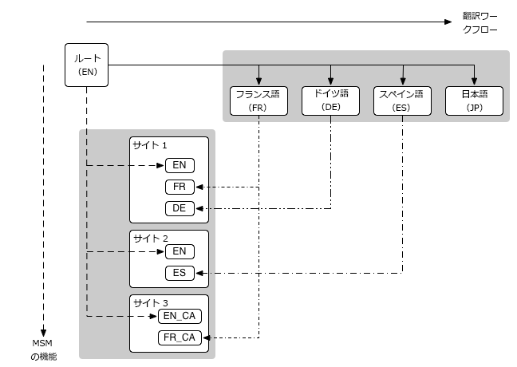

# Web サイト管理{#website-administration}

Web サイトとページを管理するための以下の管理ツールが用意されています。

* マルチサイトマネージャー(MSM)では、複数の場所で同じサイトコンテンツを使用できると同時に、次のようなバリエーションを作成できます。

   * [コンテンツの再利用：マルチサイトマネージャーとライブコピー](/help/sites-administering/msm.md)

* 翻訳を使用すると、ページコンテンツ、アセットおよびユーザー生成コンテンツの翻訳を自動化して、多言語の Web サイトを作成および管理できます。

   * [多言語サイトのコンテンツの翻訳](/help/sites-administering/translation.md)

* Web サイトを[多国籍化かつ多言語化](#multinational-and-multilingual-sites)するために、これらの 2 つの機能を組み合わせて使用できます。

## 多国籍な多言語サイト {#multinational-and-multilingual-sites}

マルチサイトマネージャーと翻訳ワークフローを併せて使用することで、多国籍な多言語サイトのコンテンツを効率的に作成できます。特定の国向けのマスターサイトを 1 つの言語で作成してから、そのコンテンツをベースに、必要に応じて翻訳を使用して他のサイトを作成します。

* [マスターサイトを異なる言語に翻訳します](/help/sites-administering/translation.md) 。

* [マルチサイトマネージャー](/help/sites-administering/msm.md)を次の用途で使用します。

   * マスターサイトのコンテンツと翻訳を再利用して、他の国や文化のサイトを作成します。
   * マルチサイトマネージャーの使用は、1 言語のコンテンツに限定してください（例：英語のマスターは英語圏の各国サイト、フランス語のマスターはフランス語圏の各国サイト）。
   * 必要に応じて、ライブコピーの要素を分離してローカリゼーションの詳細を追加します。

次の図に、主な概念がどのように関連するかを示します（関連するレベルや要素のすべては表示されません）。

>[!NOTE]
>
>このようなシナリオでは、MSM は様々な言語バージョンをそのように管理しません。
>
>* [MSM](/help/sites-administering/msm.md) は言語の境界内で、ブループリント（グローバルマスターなど）からライブコピー（ローカルサイトなど）への翻訳されたコンテンツのデプロイメントを管理します。
>* AEM の[翻訳](/help/sites-administering/translation.md)統合機能は、サードパーティの翻訳管理サービスと連係して、各言語およびそれらの言語へのコンテンツの翻訳を管理します。

>
>
より高度な使用事例の場合は、MSM を複数の言語マスターにまたがって使用することもできます。

>[!NOTE]
>
>いずれの使用例の場合も、次のベストプラクティスをお読みになることをお勧めします。
>
>* [MSM のベストプラクティス](/help/sites-administering/msm-best-practices.md)（特に次の事項）
   >
   >   
   * [サイトの作成](/help/sites-administering/msm-best-practices.md#create-site)
   >   * [MSM と多言語の Web サイト](/help/sites-administering/msm-best-practices.md#msm-and-multilingual-websites)
>
>* [翻訳のベストプラクティス](/help/sites-administering/tc-bp.md)

