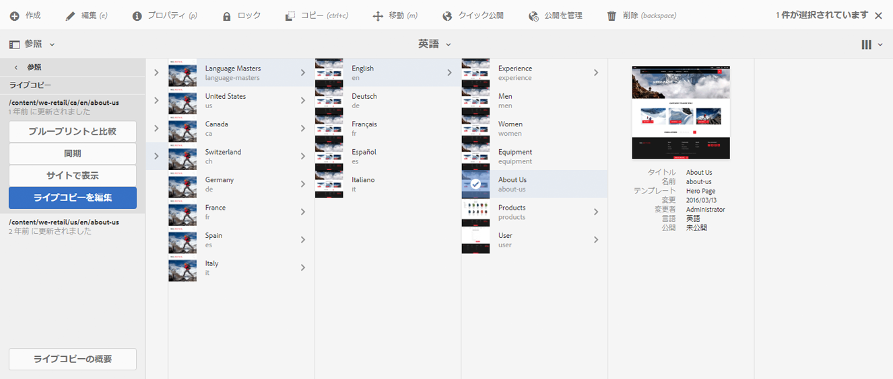
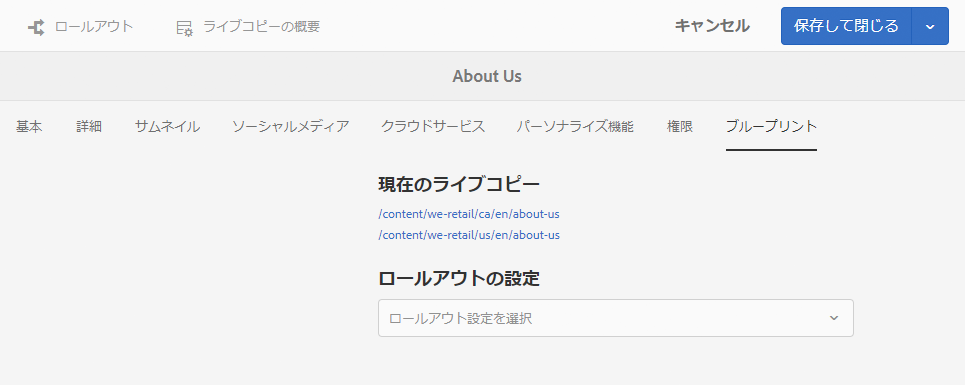
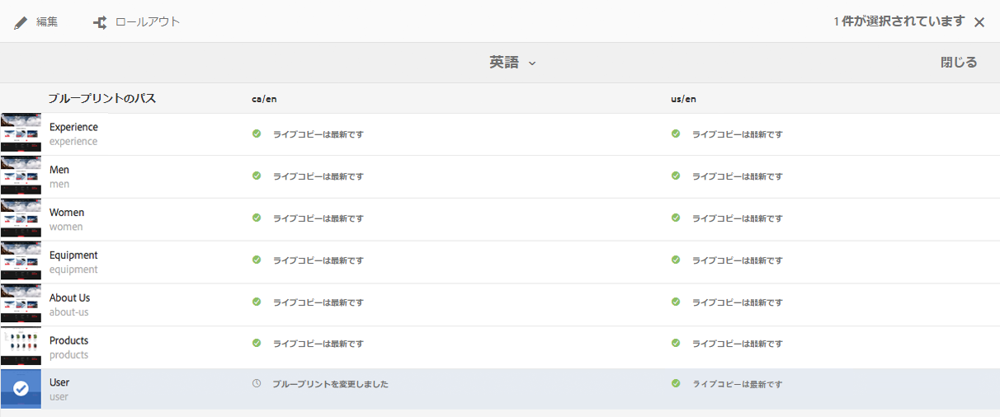
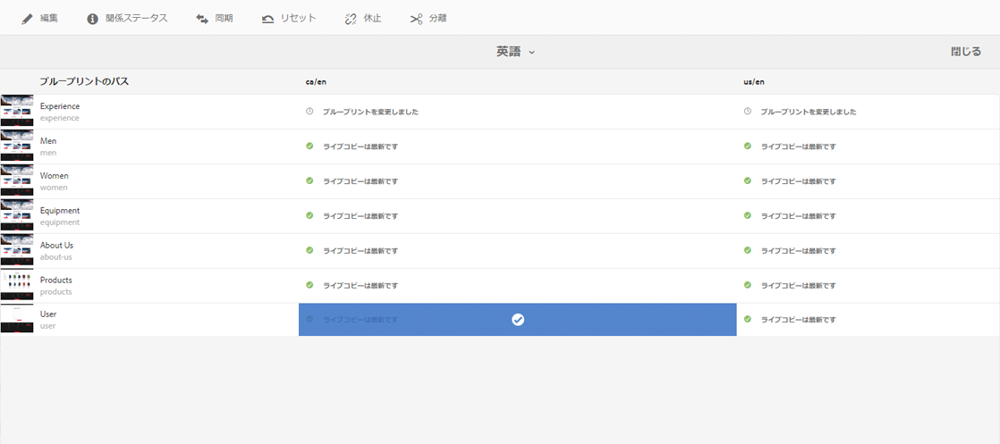
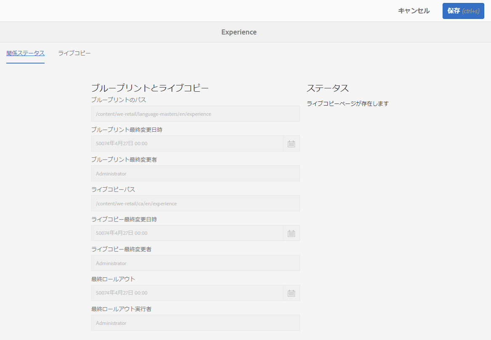
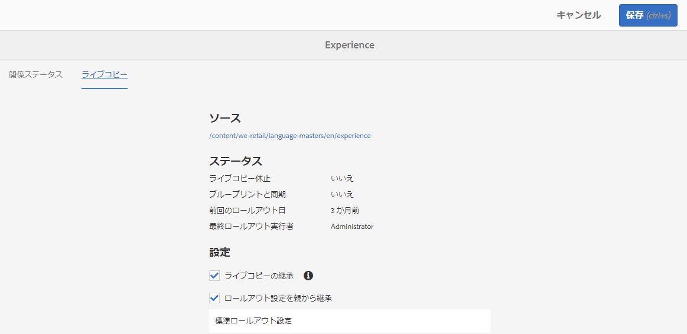

# ライブコピーの概要コンソール{#live-copy-overview-console}

**ライブコピーの概要**&#x200B;では、次のことが可能です。

* サイト全体での継承の表示／管理：

   * ブループリントツリーと対応するライブコピー構造、およびそれらの継承ステータスの表示
   * 継承ステータスの変更（休止、再開など）
   * ブループリントおよびライブコピーのプロパティの表示

* ロールアウトアクションの実行

## ライブコピーの概要を開く {#opening-the-live-copy-overview}

ライブコピーの概要は、以下から開くことができます。

* [ブループリントページの参照サイドパネル（サイトコンソール）](#opening-live-copy-overview-references-for-a-blueprint-page)
* [ブループリントページのプロパティ](#opening-live-copy-overview-properties-of-a-blueprint-page)

### ライブコピーの概要を開く - ブループリントページの参照 {#opening-live-copy-overview-references-for-a-blueprint-page}

The **Live Copy Overview** can be opened from the **References** side panel of the **Sites** console:

1. **サイト**&#x200B;コンソールで、[ブループリントページに移動して選択します](/help/sites-authoring/basic-handling.md#viewing-and-selecting-resources)。
1. **[参照](/help/sites-authoring/basic-handling.md#references)**&#x200B;パネルを開き、「**ライブコピー**」を選択します。

   

   >[!NOTE]
   >
   >先に参照を開いてからブループリントを選択することもできます。

1. 「**ライブコピーの概要**」を選択して、選択したブループリントに関連するすべてのライブコピーの概要を表示および使用します。
1. 「**閉じる**」を使用して終了し、**サイト**&#x200B;コンソールに戻ります。

### ライブコピーの概要を開く - ブループリントページのプロパティ {#opening-live-copy-overview-properties-of-a-blueprint-page}

**ライブコピーの概要**&#x200B;は、ブループリントページのプロパティを表示しているときに開くことができます。

1. 該当するブループリントページの&#x200B;**プロパティ**&#x200B;を開きます。
1. 「**ブループリント**」タブを開きます。「**ライブコピーの概要**」オプションが上部のツールバーに表示されます。

   

1. 「**ライブコピーの概要**」を選択して、現在のブループリントに関連するすべてのライブコピーの概要を表示および使用します。

   >[!NOTE]
   >
   >詳しくは、[ライブコピーのステータスのメッセージ - 最新／グリーン／同期中](https://helpx.adobe.com/jp/experience-manager/kb/livecopy-status-message---up-to-date-green-in-sync.html)に関するナレッジベースの記事も参照してください。

1. 「**閉じる**」を使用して終了し、**サイト**&#x200B;コンソールに戻ります。

## ライブコピーの概要の使用 {#using-the-live-copy-overview}

**ライブコピーの概要**&#x200B;を使用して、ライブコピーに対するアクションを実行することもできます。

1. **ライブコピーの概要**&#x200B;を開きます。
1. 必要なブループリントページまたはライブコピーページを選択します。ツールバーが更新され、使用できるアクションが表示されます。使用できる[アクション](/help/sites-administering/msm.md#terms-used)は、[ブループリント](#actions-for-a-blueprint-page)ページと[ライブコピー](#actions-for-a-live-copy-page)ページのどちらを選択したかによって異なります。

### ブループリントページのアクション {#actions-for-a-blueprint-page}

ブループリントページを選択した場合は、以下のアクションを使用できます。

* 編集

   * ブループリントページを編集用に開きます。

* [ロールアウト](/help/sites-administering/msm.md#rollout-and-synchronize)

   * ロールアウトを実行して、ソースからライブコピーに変更をプッシュします。

### ライブコピーページのアクション {#actions-for-a-live-copy-page}

ライブコピーページを選択した場合は、以下のアクションを使用できます。

* 編集

   * ライブコピーページを編集用に開きます。

* [関係ステータス](#relationship-status)

   * ステータスおよび継承に関する情報を表示します。

* [同期](/help/sites-administering/msm.md#rollout-and-synchronize)

   * ライブコピーを同期して、ソースからライブコピーに変更をプルします。

* [リセット](/help/sites-administering/msm-livecopy.md#resetting-a-live-copy-page)

   * ライブコピーページをリセットして、すべての継承のキャンセルを削除し、ソースページと同じ状態にページを戻します。

* [休止](/help/sites-administering/msm.md#suspending-and-cancelling-inheritance-and-synchronization)

   * ライブコピーとそのブループリントページの間のライブ関係を一時的にアクティベート解除します。

* [再開](/help/sites-administering/msm-livecopy.md#resuming-inheritance-for-a-page)

   * 再開によって、休止状態の関係を復帰できます。

* [分離](/help/sites-administering/msm.md#detaching-a-live-copy)

   * ライブコピーとそのブループリントページの間のライブ関係を永続的に削除します。

## 関係ステータス {#relationship-status}

**関係ステータス**&#x200B;コンソールには、様々な機能を提供する 2 つのタブがあります。

* [関係ステータス情報](#relationship-status-information)
* [ライブコピー情報](#live-copy-information)

### 関係ステータス情報 {#relationship-status-information}

このタブには、ブループリントとライブコピーの間の関係のステータスに関する詳細情報が表示されます。

### ライブコピー情報 {#live-copy-information}

このタブでは、ライブコピー設定を表示および編集できます。

