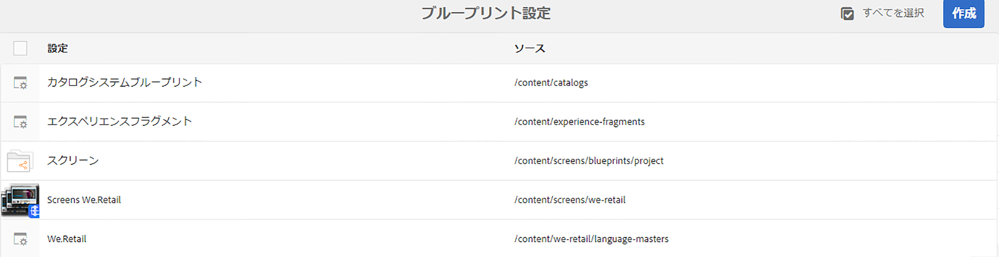
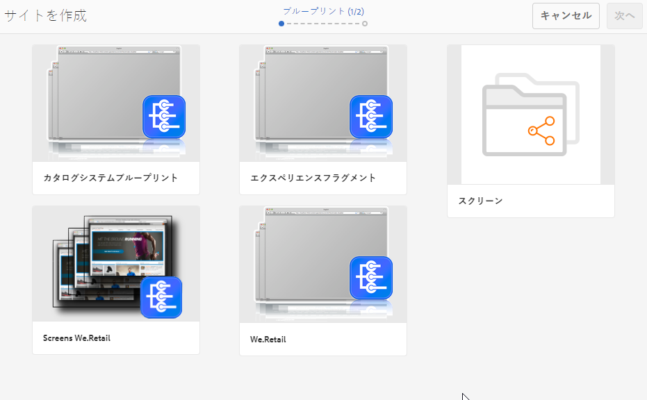

# ライブコピーの作成と同期{#creating-and-synchronizing-live-copies}

ページまたはブループリント設定からライブコピーを作成し、継承と同期を管理できます。

## ブループリント設定の管理 {#managing-blueprint-configurations}

ブループリント設定は、1 つ以上のライブコピーページのソースとして使用する既存の Web サイトを識別します。

>[!NOTE]
>
>ブループリント設定を使用すると、コンテンツの変更をライブコピーにプッシュできます。 [コンテンツの再利用：マルチサイトマネージャとライブコピー](/help/sites-administering/msm.md#source-blueprints-and-blueprint-configurations)を参照してください。

ブループリント設定を作成する場合は、ブループリントの内部構造を定義するテンプレートを選択します。デフォルトのブループリントテンプレートは、ソース web サイトに次の特性があることを前提としています。

* Web サイトにルートページがあります。
* ルートの直下の子ページが Web サイトの言語ブランチである。ライブコピーを作成する場合は、そのコピーに含めるオプションのコンテンツとして言語が指定されます。
* 各言語ブランチのルートに 1 つ以上の子ページがある。ライブコピーを作成する場合、子ページはライブコピーに含めることのできるチャプターとして表示されます。

>[!NOTE]
>
>構造が異なる場合は、別のブループリントテンプレートが必要です。

ブループリント設定を作成したら、次のプロパティを設定します。

* **名前**：ブループリント設定の名前。
* **ソースパス**：ソース（ブループリント）として使用するサイトのルートページのパス。
* **説明**。（オプション）ブループリント設定の説明。 この説明は、サイトの作成時にブループリント設定のリストに表示されます。

ブループリント設定を使用する場合、ソース/ブループリントのライブコピーを同期する方法を決定するロールアウト設定に関連付けることができます。 [使用するロールアウト設定の指定](/help/sites-administering/msm-sync.md#specifying-the-rollout-configurations-to-use)を参照してください。

### ブループリント設定の作成 {#creating-a-blueprint-configuration}

ブループリント設定を作成するには、以下を実行します。

1. **ツール**&#x200B;メニューに移動し、**Sites** メニューを選択します。
1. 「**ブループリント**」を選択し、**ブループリント設定**&#x200B;コンソールを開きます。

   

1. 「**作成**」を選択します。
1. ブループリントテンプレートを選択し、「**次へ**」をクリックして続行します。
1. ブループリントとして使用するソースページを選択し、「**次へ**」をクリックして続行します。
1. 定義：

   * **タイトル**：ブループリントの必須タイトル
   * **説明**：詳細を提供するオプションの説明。

1. **作成**&#x200B;では、仕様に基づいてブループリント設定を作成します。

### ブループリント設定の編集または削除 {#editing-or-deleting-a-blueprint-configuration}

以下の手順で、既存のブループリント設定を編集または削除できます。

1. **ツール**&#x200B;メニューに移動し、**Sites** メニューを選択します。
1. 「**ブループリント**」を選択し、**ブループリント設定**&#x200B;コンソールを開きます。

   

1. 必要なブループリント設定の選択 - ツールバーで適切なアクションが使用できるようになります。

   * **プロパティ**：設定のプロパティを表示して編集するために使用します。
   * **削除**

## ライブコピーの作成 {#creating-a-live-copy}

### ページのライブコピーの作成 {#creating-a-live-copy-of-a-page}

任意のページまたはブランチのライブコピーを作成できます。 ライブコピーを作成する際に、コンテンツの同期に使用するロールアウト設定を指定できます。

* 選択したロールアウト設定は、ライブコピーページとその子ページに適用されます。
* ロールアウト設定を指定しない場合に、MSM が使用するロールアウト設定を決定します。[使用するロールアウト設定の指定](/help/sites-administering/msm-sync.md#specifying-the-rollout-configurations-to-use)を参照してください。

任意のページのライブコピーを作成できます。

* [ブループリント設定](#creating-a-blueprint-configuration)によって参照されるページ。
* ブループリント設定に接続されていないページ.
* AEMでは、別のライブコピーのページ内でのライブコピーの作成もサポートしています。

唯一の違いは、ソースページやブループリントページの&#x200B;**ロールアウト**&#x200B;コマンドの使用可否が、ソースがブループリント設定によって参照されているかどうかで決まります。

* ソースページからライブコピーを作成する場合は、 **次に該当** ブループリント設定で参照されている場合、ロールアウトコマンドはソース/ブループリントページで使用できます。
* ソースページからライブコピーを作成する場合は、 **等しくない** ブループリント設定で参照されている場合、ロールアウトコマンドはソースページやブループリントページでは使用できません。

ライブコピーを作成するには：

1. **Sites** コンソールで「**作成**」、「**ライブコピー**」の順に選択します。

   

1. ソースページを選択して、「**次へ**」をクリックまたはタップします。次に例を示します。

   

1. （ライブコピーの親フォルダーまたはページを開いて）ライブコピーの宛先のパスを指定し、「**次へ**」をクリックまたはタップします。

   

   >[!NOTE]
   >
   >宛先のパスをソースパスに含めることはできません。

1. Enter:

   * ページの&#x200B;**タイトル**。
   * URL で使用される&#x200B;**名前**。

   

1. 「**サブページを除外**」チェックボックスを次のように使用します。

   * 選択済み：選択したページのみのライブコピーを作成（シャローライブコピー）
   * 未選択：選択したページとそのすべての子孫を含んだライブコピーを作成（ディープライブコピー）

1. （オプション）ライブコピーに使用する 1 つ以上のロールアウト設定を指定するには、 **ロールアウトの設定** ドロップダウンリストで選択できます。選択した設定がドロップダウンセレクターの下に表示されます。
1. 「**作成**」をクリックまたはタップします。確認メッセージが表示されます。ここで「**開く**」または「**完了**」のいずれかを選択できます。

### ブループリント設定からの Site のライブコピーの作成 {#creating-a-live-copy-of-a-site-from-a-blueprint-configuration}

ブループリント設定を使用してライブコピーを作成し、ブループリント（ソース）コンテンツに基づいてサイトを作成します。 ブループリント設定からライブコピーを作成する場合は、コピーするブループリントソースの 1 つ以上の言語ブランチを選択し、その後、言語ブランチからコピーする章を選択します。 [ブループリント設定の作成](/help/sites-administering/msm-livecopy.md#creating-a-blueprint-configuration)を参照してください。

一部の言語ブランチまたはチャプターをライブコピーから削除した場合は、後から追加できます（[ライブコピー内でのライブコピーの作成（ブループリント設定）](#creating-a-live-copy-inside-a-live-copy-blueprint-configuration)を参照）。

>[!CAUTION]
>
>別のブランチの段落をターゲットとするリンクと参照がブループリントのソースに含まれている場合、ライブコピーページではそのターゲットが更新されず、元の宛先を参照したままになります。

サイトを作成する場合は、以下のプロパティに値を指定します。

* **初期言語**：ライブコピーに含めるブループリントソースの言語ブランチ。
* **初期の章**：ライブコピーに含めるブループリント言語ブランチの子ページ。
* **宛先のパス**：ライブコピーサイトのルートページの場所。
* **タイトル**：ライブコピーサイトのルートページのタイトル。
* **名前**：（オプション）ライブコピーのルートページを格納する JCR ノードの名前。デフォルト値はタイトルに基づいて指定されます。
* **サイトの所有者**: （オプション）
* **ライブコピー**：ソースサイトとのライブ関係を確立するには、このオプションを選択します。このオプションを選択しない場合、ブループリントのコピーは作成されますが、その後ソースと同期されません。
* **ロールアウトの設定**：（オプション）ライブコピーの同期に使用するロールアウト設定を 1 つ以上選択します。デフォルトでは、ロールアウト設定はブループリントから継承されます。詳しくは、[使用するロールアウト設定の指定](/help/sites-administering/msm-sync.md#specifying-the-rollout-configurations-to-use)を参照してください。

ブループリント設定からサイトのライブコピーを作成するには：

1. **Sites** コンソールで「**作成**」を選択し、ドロップダウンセレクターから「**サイト**」を選択します。
1. ライブコピーのソースとして使用するブループリント設定を選択し、次に進みます。 **次へ**:

   

1. 以下を使用します。 **初期言語** セレクター：ライブコピーに使用するブループリントサイトの言語を指定します。

   デフォルトでは、使用可能なすべての言語が選択されます。言語を削除するには、言語の横に表示される **X** をクリックまたはタップします。

   次に例を示します。

   

1. 以下を使用します。 **初期の章** ドロップダウンを使用して、ライブコピーに含めるブループリントのセクションを選択します。 この場合も、使用可能なすべての章がデフォルトで含まれますが、削除できます。
1. 残りのプロパティの値を指定して「**作成**」を選択します。確認のダイアログボックスで、「**完了**」を選択して **Sites** コンソールに戻るか、「**サイトを開く**」を選択してサイトのルートページを開きます。

### ライブコピー内でのライブコピーの作成（ブループリント設定） {#creating-a-live-copy-inside-a-live-copy-blueprint-configuration}

（ブループリント設定を使用して作成された）既存のライブコピー内にライブコピーを作成する場合、ライブコピーが最初に作成されたときに含まれなかった任意の言語コピーまたはチャプターを挿入できます。

## ライブコピーの監視 {#monitoring-your-live-copy}

### ライブコピーのステータスの確認 {#seeing-the-status-of-a-live-copy}

ライブコピーページのプロパティには、ライブコピーに関する次の情報が表示されます。

* **ソース**：ライブコピーページのソースページ。
* **ステータス**：ライブコピーの同期ステータス。 ステータスには、ライブコピーがソースに関する最新の状態かどうか、最後の同期が発生した日時、および同期を実行したユーザーが含まれます。
* **設定**:

   * ページがライブコピーの継承の対象であるかどうか。
   * 設定が親ページから継承されるかどうか.
   * ライブコピーが使用するすべてのロールアウト設定。

プロパティを表示するには：

1. **サイト**&#x200B;コンソールで、ライブコピーページを選択してプロパティを開きます。
1. 「**ライブコピー**」タブを選択します。

   次に例を示します。

   

   >[!NOTE]
   >
   >詳しくは、ナレッジベースの記事も参照してください。 [ライブコピーのステータスメッセージ — 最新/緑/同期中](https://helpx.adobe.com/jp/experience-manager/kb/livecopy-status-message---up-to-date-green-in-sync.html).

### ブループリントページのライブコピーの確認 {#seeing-the-live-copies-of-a-blueprint-page}

ブループリントページ（ブループリント設定で参照）は、現在の（ブループリント）ページをソースとして使用するライブコピーページのリストを提供します。 このリストを使用して、ライブコピーを追跡します。 このリストは[ページプロパティ](/help/sites-authoring/editing-page-properties.md)の「**ブループリント**」タブに表示されます。

## ライブコピーの同期 {#synchronizing-your-live-copy}

### ブループリントのロールアウト {#rolling-out-a-blueprint}

ブループリントページをロールアウトして、コンテンツの変更をライブコピーにプッシュします。 **ロールアウト**&#x200B;アクションでは、「[ロールアウト時](/help/sites-administering/msm-sync.md#rollout-triggers)」のトリガーを使用するロールアウト設定が実行されます。

>[!NOTE]
>
>ブループリントのブランチと依存するライブコピーのブランチの両方で同じ名前の新しいページが作成されると、競合が発生することがあります。
>
>このような[競合は、ロールアウト時に処理および解決する必要があります](/help/sites-administering/msm-rollout-conflicts.md)。
>

#### ページプロパティからのブループリントのロールアウト {#rolling-out-a-blueprint-from-page-properties}

1. **Sites** コンソールで、ブループリント内のページを選択してプロパティを開きます。
1. 「**ブループリント**」タブを開きます。
1. 「**ロールアウト**」を選択します。

   

1. ページとサブページを指定し、チェックマークを付けて確定します。

   

1. ロールアウトジョブを直ちに実行するか（**今すぐ**）、別の日時に実行するか（**後で**）を指定します。

   

ロールアウトは非同期ジョブとして、[**非同期ジョブステータス**&#x200B;ダッシュボード](asynchronous-jobs.md#monitor-the-status-of-asynchronous-operations)（**グローバルナビゲーション**-／**ツール**-／**操作**-／**ジョブ**）で確認できます。

>[!NOTE]
>
>非同期ロールアウト処理には、AEM 6.5.3.0 以降が必要です。以前のバージョンでは、ページは即座に同期的に処理されていました。

#### 参照レールからのブループリントのロールアウト {#roll-out-a-blueprint-from-the-reference-rail}

1. **Sites** コンソールで、ライブコピー内のページを選択して（ツールバーの）**[参照](/help/sites-authoring/basic-handling.md#references)**&#x200B;パネルを開きます。
1. リストから「**ブループリント**」オプションを選択し、このページに関連付けられているブループリントを表示します。
1. リストから必要なブループリントを選択します。
1. 「**ロールアウト**」をクリックまたはタップします。
1. ロールアウトについて、次の詳細の確認が求められます。

   * **範囲をロールアウト**：

     選択したページのみを範囲にするか、サブページを含める必要があるかを指定します。

   * **スケジュール**：

     ロールアウトジョブをすぐに実行するか（**今すぐ**）、または後日実行するか（**後で**）を指定します。

     

1. これらの詳細を確認したら、「**ロールアウト**」を選択してアクションを実行します。

ロールアウトは非同期ジョブとして処理され、[**非同期ジョブステータス**&#x200B;ダッシュボード](asynchronous-jobs.md#monitor-the-status-of-asynchronous-operations)（**グローバルナビゲーション**-／**ツール**-／**操作**-／**ジョブ**）で確認できます。

>[!NOTE]
>
>非同期ロールアウト処理には、AEM 6.5.3.0 以降が必要です。以前のバージョンでは、「**背景ロールアウト** 」オプションがオンになっていない限り、ページは直ちに同期的に処理されていました。

#### ライブコピーの概要からのブループリントのロールアウト {#roll-out-a-blueprint-from-the-live-copy-overview}

ライブコピーの概要では、ブループリントページを選択して、[ロールアウトアクションを実行することもできます](/help/sites-administering/msm-livecopy-overview.md#using-the-live-copy-overview)。

1. [ライブコピーの概要](/help/sites-administering/msm-livecopy-overview.md#using-the-live-copy-overview)を開き、ブループリントページを選択します。
1. ツールバーの「**ロールアウト**」を選択します。
1. ページとサブページを指定し、チェックマークを付けて確定します。

   

1. ロールアウトジョブを直ちに実行するか（**今すぐ**）、別の日時に実行するか（**後で**）を指定します。

   

ロールアウトは非同期ジョブとして、[**非同期ジョブステータス**&#x200B;ダッシュボード](asynchronous-jobs.md#monitor-the-status-of-asynchronous-operations)（**グローバルナビゲーション**-／**ツール**-／**操作**-／**ジョブ**）で確認できます。

>[!NOTE]
>
>非同期ロールアウト処理には、AEM 6.5.3.0 以降が必要です。以前のバージョンでは、ページは即座に同期的に処理されていました。

### ライブコピーの同期 {#synchronizing-a-live-copy}

ライブコピーページを同期して、コンテンツの変更をソースからライブコピーにプルします。

#### ページプロパティからのライブコピーの同期 {#synchronize-a-live-copy-from-page-properties}

ライブコピーを同期して、ソースからライブコピーに変更内容をプルします。

>[!NOTE]
>
>同期では、「[ロールアウト時](/help/sites-administering/msm-sync.md#rollout-triggers)」のトリガーを使用するロールアウト設定が実行されます。

1. **サイト**&#x200B;コンソールで、ライブコピーページを選択してプロパティを開きます。
1. 「**ライブコピー**」タブを開きます。
1. 「**同期**」をクリックまたはタップします。

   

   確認が求められます。「**同期**」を使用して先に進みます。

#### ライブコピーの概要からのライブコピーの同期 {#synchronize-a-live-copy-from-the-live-copy-overview}

ライブコピーページが選択されている場合、[同期アクションは、ライブコピーの概要からも使用できます](/help/sites-administering/msm-livecopy-overview.md#using-the-live-copy-overview)。

1. [ライブコピーの概要](/help/sites-administering/msm-livecopy-overview.md#using-the-live-copy-overview)を開き、ライブコピーページを選択します。
1. ツールバーの「**同期**」を選択します。
1. ダイアログで次のどちらを含めるかを指定し、**ロールアウト**&#x200B;アクションを確定します。

   * **ページとサブページ**
   * **ページのみ**

   

## ライブコピーのコンテンツの変更 {#changing-live-copy-content}

ライブコピーのコンテンツを変更するには、次の操作を行います。

* ページを段落に追加します。
* 任意のページまたはコンポーネントのライブコピーの継承を解除して、既存のコンテンツを更新します。

>[!NOTE]
>
>ライブコピー内にページを手動で作成した場合、ライブコピーはローカルになります。つまり、関連付ける対応するソースページが存在しません。
>
>関係の一部となるローカルページを作成するベストプラクティスは、ソース内でページを作成し、（ディープ）ロールアウトをおこなうことです。 これにより、ページがライブコピーとしてローカルに作成されます。

>[!NOTE]
>
>ブループリントのブランチと依存するライブコピーのブランチの両方で同じ名前の新しいページが作成されると、競合が発生することがあります。
>
>このような[競合はロールアウト時に処理および解決する必要があります](/help/sites-administering/msm-rollout-conflicts.md)。
>

### ライブコピーページへのコンポーネントの追加 {#adding-components-to-a-live-copy-page}

ライブコピーページにいつでもコンポーネントを追加できます。 ライブコピーとその段落システムの継承ステータスは、コンポーネントを追加する機能を制御するものではありません。

ライブコピーページがソースページと同期されても、追加されたコンポーネントは変更されません。 関連トピック [ライブコピーページ上のコンポーネントの順序の変更](#changing-the-order-of-components-on-a-live-copy-page).

>[!NOTE]
>
>コンテナとしてマークされたコンポーネントへのローカルでの変更は、ロールアウト上のブループリントのコンテンツによって上書きされません。詳しくは、[MSM のベストプラクティス](/help/sites-administering/msm-best-practices.md#components-and-container-synchronization)を参照してください。

### ページの継承の休止 {#suspending-inheritance-for-a-page}

ライブコピーを作成する場合は、コピーされたページのルートページにライブコピー設定が保存されます。ルートページのすべての子ページがそのライブコピー設定を継承します。また、ライブコピーページ上のコンポーネントもライブコピー設定を継承します。

ライブコピーページのライブコピーの継承を休止して、ページのプロパティやコンポーネントを変更できます。 継承を休止すると、ページプロパティとコンポーネントがソースと同期されなくなります。

>[!NOTE]
>
>ブループリントから[ライブコピーを分離](#detaching-a-live-copy)してすべての関係を削除することもできます。分離アクションは永続的で元に戻すことはできません。

>[!NOTE]
>
>コンポーネントがコンテナとしてマークされている場合、キャンセルアクションおよび休止アクションはその子コンポーネントには適用されません。詳しくは、[MSM のベストプラクティス](/help/sites-administering/msm-best-practices.md#components-and-container-synchronization)も参照してください。

#### ページプロパティからの継承の休止 {#suspending-inheritance-from-page-properties}

ページの継承を休止するには：

1. ライブコピーページのプロパティを開くには、 **プロパティを表示** 指令 **Sites** コンソールまたは **ページ情報** をクリックします。
1. 「**ライブコピー**」タブをクリックまたはタップします。
1. ツールバーの「**休止**」を選択します。その後、次のいずれかを選択します。

   * **休止**：現在のページのみ
   * **子ページも休止**：現在のページとすべての子ページ

1. 確認ダイアログの「**休止**」を選択します。

#### ライブコピーの概要からの継承の休止 {#suspending-inheritance-from-the-live-copy-overview}

ライブコピーの概要では、ライブコピーページを選択して、[休止アクションを実行することもできます](/help/sites-administering/msm-livecopy-overview.md#using-the-live-copy-overview)。

1. [ライブコピーの概要](/help/sites-administering/msm-livecopy-overview.md#using-the-live-copy-overview)を開き、ライブコピーページを選択します。
1. ツールバーの「**休止**」を選択します。
1. 次のいずれかから適切なオプションを選択します。

   * **休止**
   * **子ページも休止**

   

1. **ライブコピーを休止**&#x200B;ダイアログで&#x200B;**休止**&#x200B;アクションを確定します。

   

### ページの継承の再開 {#resuming-inheritance-for-a-page}

ページのライブコピーの継承の休止は、一時的なアクションです。 休止すると、ライブ関係を元に戻すための&#x200B;**再開**&#x200B;アクションが使用可能になります。

継承を再度有効にしても、ページはソースと自動的には同期されません。必要に応じて、次のいずれかの方法で同期を要求できます。

* 次に示すような&#x200B;**再開**／**元に戻す**&#x200B;ダイアログを使用します。

  

* 後から、同期アクションを手動で選択します。

>[!CAUTION]
>
>継承を再度有効にしても、ページはソースと自動的には同期されません。必要に応じて、同期を手動でリクエストできます。再開時、または後でリクエストできます。

#### ページプロパティからの継承の再開 {#resuming-inheritance-from-page-properties}

[休止](#suspending-inheritance-from-page-properties)すると、ページプロパティのツールバーで&#x200B;**再開**&#x200B;アクションが使用可能になります。

選択すると、ダイアログが表示されます。 必要に応じて、同期を選択し、アクションを確定できます。

#### ライブコピーの概要からのライブコピーページの再開 {#resume-a-live-copy-page-from-the-live-copy-overview}

[ライブコピーの概要では、ライブコピーページを選択して、再開アクションを実行することもできます](/help/sites-administering/msm-livecopy-overview.md#using-the-live-copy-overview)。

1. を開きます。 [ライブコピーの概要](/help/sites-administering/msm-livecopy-overview.md#using-the-live-copy-overview) 休止されたライブコピーページを選択します。次のように表示されます。 **継承がキャンセルされました**.
1. ツールバーの「**再開**」を選択します。
1. 継承を元に戻した後にページを同期するかどうかを指定し、**ライブコピーを再開**&#x200B;ダイアログで&#x200B;**再開**&#x200B;アクションを確定します。

### 継承の深度の変更（シャロー／ディープ） {#changing-inheritance-depth-shallow-deep}

既存のライブコピーで、ページの深度（例：子ページが含まれるかどうか）を変更できます。

* シャローライブコピーに切り替える場合：

   * 効果は即座に現れ、元に戻すことはできません。

      * 子ページはライブコピーから明示的に分離されます。 元に戻した場合、子に対する追加の変更内容は保持されません。

      * ネストされた `LiveRelationships` がある場合でも、下位の `LiveCopies` はすべて削除されます。

* ディープライブコピーに切り替えた場合：

   * 子ページはそのまま残ります。
   * 切り替えの影響を確認するには、ロールアウトを実行します。コンテンツに対するすべての変更がロールアウト設定に従って適用されます。

* シャローライブコピーに切り替えてから、ディープに戻ります。

   * シャロー（であった）ライブコピーのすべての子は手動で作成されたものとして扱われるので、`[oldname]_msm_moved name` を使用して変更されます。

深度を指定または変更するには：

1. ライブコピーページのプロパティを開くには、 **プロパティを表示** 指令 **Sites** コンソールまたは **ページ情報** をクリックします。
1. 「**ライブコピー**」タブをクリックまたはタップします。
1. 「**設定**」セクションで、子ページが含まれているかどうかによって、「**ライブコピーの継承**」オプションをオンまたはオフにします。

   * チェック済み — ディープライブコピー（子ページが含まれます）
   * クリア — シャローライブコピー（子ページは除外）

   >[!CAUTION]
   >
   >シャローライブコピーに切り替えると、すぐに有効になり、元に戻すことはできません。
   >
   >詳しくは、[ライブコピー - 構成](/help/sites-administering/msm.md#live-copies-composition)を参照してください。

1. 「**保存**」をクリックまたはタップして更新内容を保持します。

### コンポーネントの継承のキャンセル {#cancelling-inheritance-for-a-component}

コンポーネントがソースコンポーネントと同期されなくなるように、コンポーネントのライブコピーの継承をキャンセルします。 必要な場合は後で継承を有効にすることができます。

>[!NOTE]
>
>コンポーネントがコンテナとしてマークされている場合、キャンセルアクションおよび休止アクションはその子コンポーネントには適用されません。詳しくは、[MSM のベストプラクティス](/help/sites-administering/msm-best-practices.md#components-and-container-synchronization)も参照してください。

>[!NOTE]
>
>継承を再度有効にしても、コンポーネントはソースと自動的には同期されません。必要な場合は、手動で同期をリクエストできます。

継承をキャンセルして、コンポーネントのコンテンツを変更するか、コンポーネントを削除するには：

1. 継承をキャンセルするコンポーネントをクリックまたはタップします。

   

1. コンポーネントツールバーの&#x200B;**継承をキャンセル**&#x200B;アイコンをクリックまたはタップします。

   

1. 継承をキャンセルダイアログボックスで、「**はい**」を使用してアクションを確定します。

   コンポーネントツールバーが更新されて、すべての（該当する）編集コマンドが表示されます。

### コンポーネントの継承の再有効化 {#re-enabling-inheritance-for-a-component}

コンポーネントの継承を有効にするには、コンポーネントツールバーの&#x200B;**継承を再度有効にする**&#x200B;アイコンをクリックまたはタップします。

### ライブコピーページ上のコンポーネントの順序の変更 {#changing-the-order-of-components-on-a-live-copy-page}

あるライブコピーに段落システムの一部であるコンポーネントが含まれている場合、段落システムの継承は次のルールに従います。

* 段落システム内のコンポーネントの順序は、継承が確立していても変更できます。
* ロールアウト時に、コンポーネントの順序はブループリントから復元されます。ロールアウト前に新しいコンポーネントがライブコピーに追加された場合、それらは追加先にあるコンポーネントと共に並べ替えられます。
* 段落システムの継承がキャンセルされた場合、コンポーネントの順序はロールアウト時に復元されず、ライブコピーにそのまま残ります。

>[!NOTE]
>
>段落システムでキャンセルされた継承を元に戻しても、コンポーネントの順序はブループリントから&#x200B;**自動的には復元されません**。必要な場合は、手動で同期をリクエストできます。

次の手順に従って、段落システムの継承をキャンセルします。

1. ライブコピーページを開きます。
1. 既存のコンポーネントをページの別の場所にドラッグします。
1. **継承をキャンセル**&#x200B;ダイアログボックスで、「**はい**」を使用してアクションを確定します。

### ライブコピーページのプロパティの上書き {#overriding-properties-of-a-live-copy-page}

デフォルトでは、ライブコピーページのページプロパティはソースページから継承されます（編集不可）。

ライブコピーのプロパティ値を変更する必要がある場合は、プロパティの継承をキャンセルできます。 リンクアイコンは、プロパティの継承が有効なことを示しています。

継承をキャンセルすると、プロパティ値を変更できます。リンク切れアイコンは、継承がキャンセルされたことを示しています。

必要に応じて、プロパティの継承を後から再度有効にすることができます。

>[!NOTE]
>
>継承を再度有効にしても、ライブコピーページのプロパティはソースのプロパティとは自動的には同期されません。必要な場合は、手動で同期をリクエストできます。

1. **サイト**&#x200B;コンソールの「**プロパティを表示**」オプションまたはページツールバーの「**ページ情報**」アイコンを使用して、ライブコピーページのプロパティを開きます。
1. プロパティの継承をキャンセルするには、プロパティの右側に表示されるリンクアイコンをクリックまたはタップします。

   

1. **継承をキャンセル**&#x200B;確認ダイアログで、「**はい**」をクリックまたはタップします。

### ライブコピーページのプロパティの復帰 {#revert-properties-of-a-live-copy-page}

プロパティの継承を有効にするには、プロパティの横に表示される&#x200B;**継承を復帰**&#x200B;アイコンをクリックまたはタップします。

### ライブコピーページのリセット {#resetting-a-live-copy-page}

ライブコピーページのリセット先：

* すべての継承のキャンセルが削除され、かつ
* ページをソースページと同じ状態に戻します。

リセットは、ページのプロパティ、段落システムおよびコンポーネントに対して行った変更に影響します。

#### ページプロパティからのライブコピーページのリセット {#reset-a-live-copy-page-from-the-page-properties}

1. Adobe Analytics の **Sites** コンソールで、ライブコピーページを選択し、「 **プロパティを表示**.
1. 「**ライブコピー**」タブを開きます。
1. ツールバーの「**リセット**」を選択します。

   

1. **ライブコピーをリセット**&#x200B;ダイアログボックスで、「**リセット**」を選択して確定します。

#### ライブコピーの概要からのライブコピーページをリセット {#reset-a-live-copy-page-from-the-live-copy-overview}

ライブコピーの概要では、ライブコピーページを選択して、[リセットアクションを実行することもできます](/help/sites-administering/msm-livecopy-overview.md#using-the-live-copy-overview)。

1. [ライブコピーの概要](/help/sites-administering/msm-livecopy-overview.md#using-the-live-copy-overview)を開き、ライブコピーページを選択します。
1. ツールバーの「**リセット**」を選択します。
1. **ライブコピーをリセット**&#x200B;ダイアログで&#x200B;**リセット**&#x200B;アクションを確定します。

   

## ライブコピーページとブループリントページの比較 {#comparing-a-live-copy-page-with-a-blueprint-page}

加えた変更を追跡するには、**参照**&#x200B;でブループリントページを確認し、ライブコピーページと比較します。

1. Adobe Analytics の **Sites** コンソール [ブループリントまたはライブコピーのページに移動して選択する](/help/sites-authoring/basic-handling.md#viewing-and-selecting-resources).
1. を開きます。 **[参照](/help/sites-authoring/basic-handling.md#references)** パネルと選択：

   * **ブループリント**（ライブコピーページを選択した場合）
   * **ライブコピー**（ブループリントページを選択した場合）

1. 特定のライブコピーを選択してから、次のいずれかを実行します。

   * **ブループリントと比較** （ライブコピーページを選択した場合）
   * **ライブコピーと比較**（ブループリントページを選択した場合）

   次に例を示します。

   

1. 2 つのページ（ライブコピーとブループリント）が並べて開きます。

   この機能の使用方法について詳しくは、[ページの差分](/help/sites-authoring/page-diff.md)を参照してください。

## ライブコピーの分離 {#detaching-a-live-copy}

分離すると、ライブコピーとそのソース/ブループリントページとのライブ関係が完全に削除されます。 ライブコピーから MSM に関連するすべてのプロパティが削除され、そのライブコピーページがスタンドアロンのコピーになります。

>[!CAUTION]
>
>ライブコピーを分離した後にライブ関係を元に戻すことはできません。
>
>ライブ関係を削除し、後で元に戻すオプションを指定するには、次の手順を実行します。 [ライブコピーの継承をキャンセル](#suspending-inheritance-for-a-page) を設定します。

ツリー内で&#x200B;**分離**&#x200B;を使用する場所によって異なる処理が行われます。

* **ライブコピーのルートページで分離する**

  ライブコピーのルートページでこの操作を実行すると、ブループリントのすべてのページとそのライブコピーとのライブ関係が削除されます。

  ブループリント内のページに対するその他の変更（従来どおり） **次の条件を満たさない** はライブコピーに影響を与えます（従来どおり）。

* **ライブコピーのサブページで分離する**

  ライブコピー内のサブページ（またはブランチ）に対してこの操作を実行する場合：

   * そのサブページ（またはブランチ）のライブ関係が削除されます
   * また、ライブコピーブランチの（サブ）ページは、手動で作成したものと同じように扱われます。

  *ただし、*&#x200B;サブページは、親ブランチのライブ関係の影響を受けるので、ブループリントページのさらなるロールアウトでは、次の両方がおこなわれます。

   1. 分離されたページの名前が変更されます。

      * これは、MSM が手動で作成したページを、作成しようとしているライブコピーページと同じ名前を持つ競合の原因と見なすからです。

   1. 元の名前で（ライブコピー）ページを作成し、ロールアウトの変更を含めます。

  >[!NOTE]
  >
  >このような状況について詳しくは、[MSM ロールアウトの競合](/help/sites-administering/msm-rollout-conflicts.md)を参照してください。

### ページプロパティからのライブコピーページの分離 {#detach-a-live-copy-page-from-the-page-properties}

ライブコピーを分離するには：

1. Adobe Analytics の **Sites** コンソールで、ライブコピーページを選択し、「 」をクリックまたはタップします。 **プロパティを表示**.
1. 「**ライブコピー**」タブを開きます。
1. ツールバーで「**分離**」を選択します。

   

1. 確認ダイアログが表示されます。「 」を選択します。 **分離** 」をクリックしてアクションを完了します。

### ライブコピーの概要からのライブコピーページの分離 {#detach-a-live-copy-page-from-the-live-copy-overview}

ライブコピーの概要では、ライブコピーページを選択して、[分離アクションを実行することもできます](/help/sites-administering/msm-livecopy-overview.md#using-the-live-copy-overview)。

1. [ライブコピーの概要](/help/sites-administering/msm-livecopy-overview.md#using-the-live-copy-overview)を開き、ライブコピーページを選択します。
1. ツールバーの「**分離**」を選択します。
1. **ライブコピーの分離**&#x200B;ダイアログで&#x200B;**分離**&#x200B;アクションを確定します。

   
