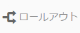

# ライブコピーの作成と同期{#creating-and-synchronizing-live-copies}

ページまたはブループリント設定からライブコピーを作成し、継承と同期を管理できます。

## ブループリント設定の管理 {#managing-blueprint-configurations}

ブループリント設定では、1 つ以上のライブコピーページのソースとして使用する既存の Web サイトを指定します。

>[!NOTE]
>
>ブループリント設定を使用すると、コンテンツの変更をライブコピーに適用できます。[コンテンツの再利用：マルチサイトマネージャーとライブコピー](/help/sites-administering/msm.md#source-blueprints-and-blueprint-configurations)を参照してください。

ブループリント設定を作成するには、ブループリントの内部構造を定義するテンプレートを選択します。デフォルトのブループリントテンプレートでは、ソースの Web サイトに以下の特徴があることを前提としています。

* Web サイトにルートページがある。
* ルートの直下の子ページが Web サイトの言語ブランチである。ライブコピーを作成する場合は、そのコピーに含めるオプションのコンテンツとして言語が指定されます。
* 各言語ブランチのルートに 1 つ以上の子ページがある。ライブコピーの作成時、子ページはライブコピーに含めることのできるチャプターとして表示されます。

>[!NOTE]
>
>構造ごとに別のブループリントテンプレートが必要です。

ブループリント設定を作成したら、次のプロパティを設定します。

* **名前**：ブループリント設定の名前。
* **ソースパス**：ソース（ブループリント）として使用するサイトのルートページのパス。
* **説明**. （オプション）ブループリント設定の説明。この説明は、サイトの作成時にブループリント設定をリストから選択するときに表示されます。

ブループリント設定が使用されると、それをソースやブループリントのライブコピーの同期方法を指定するロールアウト設定に関連付けることができます。[使用するロールアウト設定の指定](/help/sites-administering/msm-sync.md#specifying-the-rollout-configurations-to-use)を参照してください。

### ブループリント設定の作成 {#creating-a-blueprint-configuration}

ブループリント設定を作成するには：

1. **ツール**&#x200B;メニューに[移動](/help/sites-authoring/basic-handling.md#global-navigation)し、**サイト**&#x200B;メニューを選択します。
1. 「**ブループリント**」を選択して、**ブループリント設定**&#x200B;コンソールを開きます。

   

1. 「**作成**」を選択します。
1. ブループリントテンプレートを選択し、「**次へ**」を選択して先に進みます。
1. ブループリントとして使用するソースページを選択し、「**次へ**」を選択して先に進みます。
1. 次の項目を定義します。

   * **タイトル**：ブループリントのタイトル（必須）
   * **説明**：詳細を示す説明（オプション）

1. 「**作成**」を選択すると、指定した内容に基づいてブループリント設定が作成されます。

### ブループリント設定の編集または削除 {#editing-or-deleting-a-blueprint-configuration}

既存のブループリント設定を編集または削除できます。

1. **ツール**&#x200B;メニューに[移動](/help/sites-authoring/basic-handling.md#global-navigation)し、**サイト**&#x200B;メニューを選択します。
1. 「**ブループリント**」を選択して、**ブループリント設定**&#x200B;コンソールを開きます。

   

1. 必要なブループリント設定を選択します。ツールバー上の該当するアクションが使用可能になります。

   * **プロパティ**：設定のプロパティを表示して編集するために使用します。
   * **削除**

   

## ライブコピーの作成 {#creating-a-live-copy}

### ページのライブコピーの作成 {#creating-a-live-copy-of-a-page}

任意のページやブランチのライブコピーを作成できます。ライブコピーを作成する場合は、コンテンツの同期に使用するロールアウト設定を指定できます。

* 選択したロールアウト設定は、ライブコピーページとその子ページに適用されます。
* ロールアウト設定を指定しない場合は、使用するロールアウト設定を MSM が決定します。[使用するロールアウト設定の指定](/help/sites-administering/msm-sync.md#specifying-the-rollout-configurations-to-use)を参照してください。

以下のような任意のページのライブコピーを作成できます。

* [ブループリント設定](#creating-a-blueprint-configuration)によって参照されるページ。
* ブループリント設定に接続されていないページ。
* AEM では、ライブコピーを別のライブコピーのページ内に作成することもできます。

唯一の違いは、ソースページやブループリントページの&#x200B;**ロールアウト**&#x200B;コマンドの使用可否が、ソースがブループリント設定によって参照されているかどうかで決まります。

* ブループリント設定で参照&#x200B;**されている**&#x200B;ソースページからライブコピーを作成すると、ロールアウトコマンドをソースページやブループリントページで使用できます。
* ブループリント設定で参照&#x200B;**されていない**&#x200B;ソースページからライブコピーを作成すると、ロールアウトコマンドをソースページやブループリントページで使用できません。

ライブコピーを作成するには：

1. **サイト**&#x200B;コンソールで「**作成**」、「**ライブコピー**」の順に選択します。

   

1. ソースページを選択して、「**次へ**」をクリックまたはタップします。次に例を示します。

   

1. （ライブコピーの親フォルダーまたはページを開いて）ライブコピーの宛先のパスを指定し、「**次へ**」をクリックまたはタップします。

   

   >[!NOTE]
   >
   >宛先のパスをソースパスに含めることはできません。

1. 次の項目を入力します。

   * ページの&#x200B;**タイトル**。
   * URL で使用される&#x200B;**名前**。

   

1. 「**サブページを除外**」チェックボックスを次のように使用します。

   * オン：選択したページのライブコピーのみが作成されます（シャローライブコピー）
   * 未選択： 選択したページのすべての子孫を含むライブコピーの作成（ディープライブコピー）

1. （オプション）ライブコピーに使用する 1 つ以上のロールアウト設定を指定するには、「**ロールアウトの設定**」ドロップダウンリストで選択します。選択した設定がドロップダウンセレクターの下に表示されます。
1. 「**作成**」をクリックまたはタップします。確認メッセージが表示されます。ここで「**開く**」または「**完了**」のいずれかを選択します。

### ブループリント設定からのサイトのライブコピーの作成 {#creating-a-live-copy-of-a-site-from-a-blueprint-configuration}

ブループリント設定を使用してライブコピーを作成し、ブループリント（ソース）コンテンツに基づくサイトを作成します。ブループリント設定からライブコピーを作成する場合は、コピーするブループリントのソースの言語ブランチを 1 つ以上選択し、その言語ブランチからコピーするチャプターを選択します。See [Creating a Blueprint Configuration](/help/sites-administering/msm-livecopy.md#creating-a-blueprint-configuration).

If you omit some language branches or chapters from the live copy, you can add them later; see [Creating a Live Copy Inside a Live Copy (Blueprint Configuration)](#creating-a-live-copy-inside-a-live-copy-blueprint-configuration).

>[!CAUTION]
>
>別のブランチの段落をターゲットとするリンクと参照がブループリントのソースに含まれている場合、ライブコピーページではそのターゲットが更新されず、元の宛先を参照したままになります。

サイトを作成する場合は、以下のプロパティに値を指定します。

* **初期言語**: ライブコピーに含めるブループリントソースの言語ブランチ。
* **初期の章**：ライブコピーに含めるブループリントの言語ブランチの子ページ。
* **宛先のパス**：ライブコピーサイトのルートページの場所。
* **タイトル**：ライブコピーサイトのルートページのタイトル。
* **名前**: （オプション）ライブコピーのルートページを格納するJCRノードの名前。 デフォルト値はタイトルに基づいています。
* **サイトの所有者**：（オプション）
* **ライブコピー**：ソースサイトとのライブの関係を確立する場合にこのオプションを選択します。このオプションを選択しない場合、ブループリントのコピーは作成されますが、後でソースと同期されることはありません。
* **ロールアウトの設定**：（オプション）ライブコピーの同期に使用するロールアウト設定を 1 つ以上選択します。By default, the rollout configurations are inherited from the blueprint; see [Specifying the Rollout Configurations to Use](/help/sites-administering/msm-sync.md#specifying-the-rollout-configurations-to-use) for more details.

ブループリント設定からサイトのライブコピーを作成するには：

1. **サイト**&#x200B;コンソールで「**作成**」を選択し、ドロップダウンセレクターから「**ライブコピー**」を選択します。
1. ライブコピーのソースとして使用するブループリント設定を選択し、「**次へ**」で先に進みます。

   

1. **初期言語**&#x200B;セレクターを使用して、ライブコピーに使用するブループリントサイトの言語を選択します。

   デフォルトでは、使用可能なすべての言語が選択されます。言語を削除するには、言語の横に表示される **X** をクリックまたはタップします。

   次に例を示します。

   

1. 「**初期の章**」ドロップダウンを使用して、ライブコピーに含めるブループリントのセクションを選択します。ここでも、デフォルトでは使用可能なすべてのチャプターが含まれますが、削除できます。
1. 残りのプロパティの値を指定して「**作成**」を選択します。確認のダイアログボックスで、「**完了**」を選択して&#x200B;**サイト**&#x200B;コンソールに戻るか、「**サイトを開く**」を選択してサイトのルートページを開きます。

### ライブコピー内でのライブコピーの作成（ブループリント設定） {#creating-a-live-copy-inside-a-live-copy-blueprint-configuration}

ライブコピーを（ブループリント設定を使用して作成した）既存のライブコピー内に作成する場合は、ライブコピーが最初に作成されたときには含まれていなかった任意の言語コピーまたはチャプターを挿入できます。

## ライブコピーの監視 {#monitoring-your-live-copy}

### ライブコピーのステータスの確認 {#seeing-the-status-of-a-live-copy}

ライブコピーページのプロパティには、ライブコピーに関する以下の情報が表示されます。

* **ソース**：ライブコピーページのソースページ。
* **ステータス**：ライブコピーの同期のステータス。このステータスには、ライブコピーが最新の（ソースと同じ）状態であるかどうか、前回の同期が実行された日時および同期を実行したユーザーが含まれます。
* **設定**:

   * ページがまだライブコピーの継承の対象であるかどうか。
   * 設定が親ページから継承されるかどうか。
   * ライブコピーが使用するすべてのロールアウト設定。

プロパティを表示するには：

1. In the **Sites** console, select the live copy page and open the properties.
1. 「**ライブコピー**」タブを選択します。

   次に例を示します。

   

   >[!NOTE]
   >
   >詳しくは、[ライブコピーのステータスのメッセージ - 最新／グリーン／同期中](https://helpx.adobe.com/jp/experience-manager/kb/livecopy-status-message---up-to-date-green-in-sync.html)に関するナレッジベースの記事も参照してください。

### ブループリントページのライブコピーの確認 {#seeing-the-live-copies-of-a-blueprint-page}

（ブループリント設定で参照される）ブループリントのページには、現在の（ブループリント）ページをソースとして使用するライブコピーページのリストが表示されます。このリストを使用してライブコピーを追跡します。このリストは[ページプロパティ](/help/sites-authoring/editing-page-properties.md)の「**ブループリント**」タブに表示されます。

## ライブコピーの同期 {#synchronizing-your-live-copy}

### ブループリントのロールアウト {#rolling-out-a-blueprint}

ブループリントのページをロールアウトして、コンテンツの変更をライブコピーにプッシュします。**ロールアウト**&#x200B;アクションでは、「[ロールアウト時](/help/sites-administering/msm-sync.md#rollout-triggers)」のトリガーを使用するロールアウト設定が実行されます。

>[!NOTE]
>
>同じページ名を持つ新しいページがBlueprintブランチと依存ライブコピーブランチの両方に作成された場合、競合が発生する可能性があります。
>
>このような[競合はロールアウト時に処理および解決](/help/sites-administering/msm-rollout-conflicts.md)する必要があります。

#### ページプロパティからのブループリントのロールアウト {#rolling-out-a-blueprint-from-page-properties}

1. In the **Sites** console, select the page in the blueprint and open the properties.
1. 「**ブループリント**」タブを開きます。
1. 「**ロールアウト**」を選択します。

   

1. ページとサブページを指定し、次にチェックマークを付けて確認します。

   

1. ロールアウトジョブをすぐに実行するか(**今すぐ**)、別の日時に実行するか(**後で**)を指定します。

   

ロールアウトは非同期ジョブとして処理され、Async Jobs Statusダッシュボード [**(Async Jobs Status **](asynchronous-jobs.md#monitor-the-status-of-asynchronous-operations))でチェックできます。Global Navigation**->**tools**-> Tools **- Operations Operations - Operations****** Jobs **

>[!NOTE]
>
>非同期ロールアウト処理にはAEM 6.5.3.0以降が必要です。 以前のバージョンでは、ページは直ちに同期的に処理されていました。

#### 参照レールからのブループリントのロールアウト {#roll-out-a-blueprint-from-the-reference-rail}

1. **サイト** コンソールで、Blueprintのページを選択し、(ツールバーから **[)](/help/sites-authoring/basic-handling.md#references)**参照パネルを開きます。
1. リストから「**ブループリント**」オプションを選択し、このページに関連付けられているブループリントを表示します。
1. リストから必要なブループリントを選択します。
1. 「**ロールアウト**」をクリックまたはタップします。
1. ロールアウトについて、次の詳細の確認が求められます。

   * **スコープをロールアウト**:

      範囲を選択したページのみに適用するか、サブページを含めるかを指定します。

   * **スケジュール**：

      ロールアウトジョブを直ちに実行するか(**今すぐ**)、または後で実行するか(**後で**)を指定します。

      

1. これらの詳細を確認したら、「**ロールアウト**」を選択してアクションを実行します。

ロールアウトは非同期ジョブとして処理され、Async Jobs Statusダッシュボード [**(Async Jobs Status **](asynchronous-jobs.md#monitor-the-status-of-asynchronous-operations))でチェックできます。Global Navigation**->**tools**-> Tools **- Operations Operations - Operations****** Jobs **

>[!NOTE]
>
>非同期ロールアウト処理にはAEM 6.5.3.0以降が必要です。 以前のバージョンでは、[ **背景]ロールアウトオプションがオンになっていない限り、ページは直ちに同期的に処理されていました** 。

#### ライブコピーの概要からのブループリントのロールアウト {#roll-out-a-blueprint-from-the-live-copy-overview}

ライブコピーの概要では、ブループリントページを選択して、[ロールアウトアクションを実行することもできます](/help/sites-administering/msm-livecopy-overview.md#using-the-live-copy-overview)。

1. [ライブコピーの概要](/help/sites-administering/msm-livecopy-overview.md#using-the-live-copy-overview)を開き、ブループリントページを選択します。
1. ツールバーの「**ロールアウト**」を選択します。
1. ページとサブページを指定し、次にチェックマークを付けて確認します。

   

1. ロールアウトジョブをすぐに実行するか(**今すぐ**)、別の日時に実行するか(**後で**)を指定します。

   

ロールアウトは非同期ジョブとして処理され、Async Jobs Statusダッシュボード [**(Async Jobs Status **](asynchronous-jobs.md#monitor-the-status-of-asynchronous-operations))でチェックできます。Global Navigation**->**tools**-> Tools **- Operations Operations - Operations****** Jobs **

>[!NOTE]
>
>非同期ロールアウト処理にはAEM 6.5.3.0以降が必要です。 以前のバージョンでは、ページは直ちに同期的に処理されていました。

### ライブコピーの同期 {#synchronizing-a-live-copy}

ライブコピーページを同期して、ソースからライブコピーにコンテンツの変更をプルします。

#### ページプロパティからのライブコピーの同期 {#synchronize-a-live-copy-from-page-properties}

ライブコピーを同期して、ソースからライブコピーに変更をプルします。

>[!NOTE]
>
>同期では、「[ロールアウト時](/help/sites-administering/msm-sync.md#rollout-triggers)」のトリガーを使用するロールアウト設定が実行されます。

1. In the **Sites** console, select the live copy page and open the properties.
1. 「**ライブコピー**」タブを開きます。
1. 「**同期**」をクリックまたはタップします。

   

   確認が求められます。「**同期**」を使用して先に進みます。

#### ライブコピーの概要からのライブコピーの同期 {#synchronize-a-live-copy-from-the-live-copy-overview}

ライブコピーの概要では、ライブコピーページを選択して、[同期アクションを実行することもできます](/help/sites-administering/msm-livecopy-overview.md#using-the-live-copy-overview)。

1. [ライブコピーの概要](/help/sites-administering/msm-livecopy-overview.md#using-the-live-copy-overview)を開き、ライブコピーページを選択します。
1. ツールバーの「**同期**」を選択します。
1. Confirm the **Rollout** action in the dialog after specifying whether you want to include:

   * **ページとサブページ**
   * **ページのみ**

   

## ライブコピーのコンテンツの変更 {#changing-live-copy-content}

ライブコピーのコンテンツを変更するには、以下をおこないます。

* 追加段落を設定します。
* 任意のページやコンポーネントのライブコピーの継承を削除して既存のコンテンツを更新します。

>[!NOTE]
>
>ライブコピー内に新しいページを手動で作成すると、そのページはライブコピーのローカルに作成されます。つまり、関連付けるソースページがありません。
>
>ローカルページを関係の一部として作成するお勧めの方法は、ソース内に作成して（ディープ）ロールアウトを実行する方法です。これにより、ページがライブコピーとしてローカルに作成されます。

>[!NOTE]
>
>同じページ名を持つ新しいページがBlueprintブランチと依存ライブコピーブランチの両方に作成された場合、競合が発生する可能性があります。
>
>このような[競合はロールアウト時に処理および解決](/help/sites-administering/msm-rollout-conflicts.md)する必要があります。

### ライブコピーページへのコンポーネントの追加 {#adding-components-to-a-live-copy-page}

ライブコピーページにはいつでもコンポーネントを追加できます。ライブコピーとその段落システムの継承ステータスは、コンポーネントの追加機能を制御しません。

ライブコピーページがソースページに同期されても、追加されたコンポーネントは変わらず残ります。[ライブコピーページ上のコンポーネントの順序の変更](#changing-the-order-of-components-on-a-live-copy-page)も参照してください。

>[!NOTE]
>
>コンテナとしてマークされたコンポーネントへのローカルでの変更は、ロールアウト上のブループリントのコンテンツによって上書きされません。詳しくは、[MSM のベストプラクティス](/help/sites-administering/msm-best-practices.md#components-and-container-synchronization)を参照してください。

### ページの継承の休止 {#suspending-inheritance-for-a-page}

ライブコピーを作成する場合は、コピーされたページのルートページにライブコピー設定が保存されます。ルートページのすべての子ページがそのライブコピー設定を継承します。また、ライブコピーページ上のコンポーネントもライブコピー設定を継承します。

ライブコピーページのライブコピーの継承を休止して、ページのプロパティやコンポーネントを変更できます。継承を休止すると、ページプロパティとコンポーネントがソースと同期されなくなります。

>[!NOTE]
>
>ブループリントから[ライブコピーを分離](#detaching-a-live-copy)してすべての関係を削除することもできます。分離アクションは永続的で元に戻すことはできません。

#### ページプロパティからの継承の休止 {#suspending-inheritance-from-page-properties}

ページの継承を休止するには：

1. **サイト**&#x200B;コンソールの「**プロパティを表示**」コマンドまたはページツールバーの「**ページ情報**」を使用して、ライブコピーページのプロパティを開きます。
1. 「**ライブコピー**」タブをクリックまたはタップします。
1. ツールバーの「**休止**」を選択します。その後、次のいずれかを選択します。

   * **休止**：現在のページのみ
   * **子ページも休止**：現在のページとすべての子ページ

1. 確認ダイアログの「**休止**」を選択します。

#### ライブコピーの概要からの継承の休止 {#suspending-inheritance-from-the-live-copy-overview}

ライブコピーの概要では、ライブコピーページを選択して、[休止アクションを実行することもできます](/help/sites-administering/msm-livecopy-overview.md#using-the-live-copy-overview)。

1. [ライブコピーの概要](/help/sites-administering/msm-livecopy-overview.md#using-the-live-copy-overview)を開き、ライブコピーページを選択します。
1. ツールバーの「**休止**」を選択します。
1. 次のいずれかから適切なオプションを選択します。

   * **休止**
   * **子ページも休止**

   

1. Confirm the **Suspend** action in the **Suspend Live Copy** dialog:

   

### ページの継承の再開 {#resuming-inheritance-for-a-page}

ページのライブコピーの継承の休止は、一時的なアクションです。休止すると、ライブ関係を元に戻すための&#x200B;**再開**&#x200B;アクションが使用可能になります。

継承を再度有効にしても、ページはソースと自動的には同期されません。必要に応じて、次のいずれかの方法で同期を要求できます。

* 次に示すような&#x200B;**再開**／**元に戻す**&#x200B;ダイアログを使用します。

   

* 後の段階で同期アクションを手動で選択します。

>[!CAUTION]
>
>継承を再度有効にしても、ページはソースと自動的には同期されません。必要に応じて、再開時または後の段階で同期を手動で要求できます。

#### ページプロパティからの継承の再開 {#resuming-inheritance-from-page-properties}

[休止](#suspending-inheritance-from-page-properties)すると、ページプロパティのツールバーで&#x200B;**再開**&#x200B;アクションが使用可能になります。

これを選択すると、ダイアログが表示されます。必要に応じて、同期を選択し、操作を確認できます。

#### ライブコピーの概要からのライブコピーページの再開 {#resume-a-live-copy-page-from-the-live-copy-overview}

[ライブコピーの概要では、ライブコピーページを選択して、再開アクションを実行することもできます](/help/sites-administering/msm-livecopy-overview.md#using-the-live-copy-overview)。

1. [ライブコピーの概要](/help/sites-administering/msm-livecopy-overview.md#using-the-live-copy-overview)を開き、休止中のライブコピーページを選択します。こうすると、「**継承がキャンセルされました**」と表示されます。
1. ツールバーの「**再開**」を選択します。
1. Indicate whether you want to synchronize the page after reverting inheritance, then confirm the **Resume** action in the **Resume Live Copy** dialog.

### Changing Inheritance Depth (Shallow/Deep) {#changing-inheritance-depth-shallow-deep}

既存のライブコピーで、ページの深度（例：子ページが含まれるかどうか）を変更できます。

* シャローライブコピーに切り替えた場合：

   * 効果は即座に現れ、元に戻すことはできません。

      * 子ページはライブコピーから明示的に分離されます。元に戻した場合、子に対する追加の変更内容は保持されません。

      * ネストされた `LiveRelationships` がある場合でも、下位の `LiveCopies` はすべて削除されます。

* ディープライブコピーに切り替えた場合：

   * 子ページはそのまま残ります。
   * 切り替えの影響を確認するには、ロールアウトを実行します。コンテンツに対するすべての変更がロールアウト設定に従って適用されます。

* シャローライブコピーに切り替えた後、ディープライブコピーに戻した場合：

   * All children of the (formerly) shallow live copy are treated as if they had been created manually and are therefore moved away using `[oldname]_msm_moved name`.

深度を指定または変更するには：

1. **サイト**&#x200B;コンソールの「**プロパティを表示**」コマンドまたはページツールバーの「**ページ情報**」を使用して、ライブコピーページのプロパティを開きます。
1. 「**ライブコピー**」タブをクリックまたはタップします。
1. 「**設定**」セクションで、子ページが含まれているかどうかによって、「**ライブコピーの継承**」オプションをオンまたはオフにします。

   * オン：ディープライブコピー（子ページが含まれる）
   * オフ：シャローライブコピー（子ページが除外される）

   >[!CAUTION]
   >
   >シャローライブコピーへの切り替えは即座に反映され、元に戻すことはできません。
   >
   >詳しくは、[ライブコピー - 構成](/help/sites-administering/msm.md#live-copies-composition)を参照してください。

1. 「**保存**」をクリックまたはタップして更新内容を保持します。

### コンポーネントの継承のキャンセル {#cancelling-inheritance-for-a-component}

コンポーネントについてライブコピーの継承をキャンセルして、コンポーネントがソースコンポーネントと同期されないようにします。必要な場合は後で継承を有効にすることができます。

>[!NOTE]
>
>継承を再度有効にしても、コンポーネントはソースと自動的には同期されません。必要な場合は、手動で同期をリクエストできます。

継承をキャンセルして、コンポーネントのコンテンツを変更するか、コンポーネントを削除するには：

1. 継承をキャンセルするコンポーネントをクリックまたはタップします。

   

1. コンポーネントツールバーの&#x200B;**継承をキャンセル**&#x200B;アイコンをクリックまたはタップします。

   

1. 継承をキャンセルダイアログボックスで、「**はい**」を使用してアクションを確定します。

   コンポーネントツールバーが更新されて、すべての（該当する）編集コマンドが表示されます。

### コンポーネントの継承の再有効化 {#re-enabling-inheritance-for-a-component}

To enable inheritance for a component, click or tap the **Re-enable Inheritance** icon on the component toolbar.

### ライブコピーページ上のコンポーネントの順序の変更 {#changing-the-order-of-components-on-a-live-copy-page}

あるライブコピーに段落システムの一部であるコンポーネントが含まれている場合、段落システムの継承は次のルールに従います。

* 段落システム内のコンポーネントの順序は、継承が確立していても変更できます。
* ロールアウト時に、コンポーネントの順序はブループリントから復元されます。ロールアウト前に新しいコンポーネントがライブコピーに追加された場合は、追加されたコンポーネントと共に順序が変更されます。
* 段落システムの継承がキャンセルされた場合、コンポーネントの順序はロールアウト時に復元されず、ライブコピーにそのまま残ります。

>[!NOTE]
>
>段落システムでキャンセルされた継承を元に戻しても、コンポーネントの順序はブループリントから&#x200B;**自動的には復元されません**。必要な場合は、手動で同期をリクエストできます。

段落システムの継承をキャンセルするには、次の手順を実行します。

1. ライブコピーページを開きます。
1. 既存のコンポーネントをページの別の場所にドラッグします。
1. **継承をキャンセル**&#x200B;ダイアログボックスで、「**はい**」を使用してアクションを確定します。

### ライブコピーページのプロパティの上書き {#overriding-properties-of-a-live-copy-page}

デフォルトでは、ライブコピーページのページプロパティはソースページから継承されます（編集不可）。

ライブコピーのプロパティ値を変更する必要がある場合は、プロパティの継承をキャンセルします。リンクアイコンは、プロパティの継承が有効なことを示しています。

継承をキャンセルすると、プロパティ値を変更できます。リンク切れアイコンは、継承がキャンセルされたことを示しています。

必要に応じて、プロパティの継承を後から再度有効にすることができます。

>[!NOTE]
>
>継承を再度有効にしても、ライブコピーページのプロパティはソースのプロパティとは自動的には同期されません。必要な場合は、手動で同期をリクエストできます。

1. Open the properties of the live copy page using either the **View Properties** option of the **Sites** console or **Page Information** icon on the page toolbar.
1. プロパティの継承をキャンセルするには、プロパティの右側に表示されるリンクアイコンをクリックまたはタップします。

   

1. **継承をキャンセル**&#x200B;確認ダイアログで、「**はい**」をクリックまたはタップします。

### ライブコピーページのプロパティの復帰 {#revert-properties-of-a-live-copy-page}

To enable inheritance for a property, click or tap the **Revert Inheritance** icon that appears next to the property.

### ライブコピーページのリセット {#resetting-a-live-copy-page}

ライブコピーページをリセットすると、次のようになります。

* すべての継承のキャンセルが削除され、かつ
* ページをソースページと同じ状態に戻します。

リセットは、ページプロパティ、段落システムおよびコンポーネントに対しておこなった変更に適用されます。

#### ページプロパティからのライブコピーページのリセット {#reset-a-live-copy-page-from-the-page-properties}

1. **サイト**&#x200B;コンソールで、ライブコピーページを選択して「**プロパティを表示**」を選択します。
1. 「**ライブコピー**」タブを開きます。
1. ツールバーの「**リセット**」を選択します。

   

1. **ライブコピーをリセット**&#x200B;ダイアログボックスで、「**リセット**」を選択して確定します。

#### ライブコピーの概要からのライブコピーページのリセット {#reset-a-live-copy-page-from-the-live-copy-overview}

ライブコピーの概要では、ライブコピーページを選択して、[リセットアクションを実行することもできます](/help/sites-administering/msm-livecopy-overview.md#using-the-live-copy-overview)。

1. [ライブコピーの概要](/help/sites-administering/msm-livecopy-overview.md#using-the-live-copy-overview)を開き、ライブコピーページを選択します。
1. ツールバーの「**リセット**」を選択します。
1. Confirm the **Reset** action in the **Reset Live Copy** dialog:

   

## ライブコピーページとブループリントページの比較 {#comparing-a-live-copy-page-with-a-blueprint-page}

To track the changes you have made, you can view the blueprint page in **References** and compare it with its live copy page:

1. **サイト**&#x200B;コンソールで、[ブループリントページまたはライブコピーページに移動し、ページを選択します](/help/sites-authoring/basic-handling.md#viewing-and-selecting-resources)。
1. **[参照](/help/sites-authoring/basic-handling.md#references)**パネルを開き、次のいずれかを選択します。

   * **Blueprint** （ライブコピーページが選択された場合）
   * **ライブコピー** （BluePrintページが選択された場合）

1. 特定のライブコピーを選択してから、次のいずれかを選択します。

   * **ブループリントと比較**（ライブコピーページを選択した場合）
   * **ライブコピーと比較** （BluePrintページが選択された場合）

   次に例を示します。

   

1. 2 つのページ（ライブコピーとブループリント）が左右に並んで開きます。

   この機能の使用方法について詳しくは、[ページ差分](/help/sites-authoring/page-diff.md)を参照してください。

## ライブコピーの分離 {#detaching-a-live-copy}

分離は、ライブコピーとそのソースやブループリントページの間のライブ関係を永続的に削除します。ライブコピーから MSM に関連するすべてのプロパティが削除され、そのライブコピーページがスタンドアロンのコピーになります。

>[!CAUTION]
>
>ライブコピーを分離した後にライブ関係を元に戻すことはできません。
>
>ライブ関係を削除し、必要に応じて後で元に戻すには、ページの[ライブコピーの継承をキャンセル](#suspending-inheritance-for-a-page)します。

ツリー内で&#x200B;**分離**&#x200B;を使用する場所によって異なる処理がおこなわれます。

* **ライブコピーのルートページで分離する**

   ライブコピーのルートページでこの操作を実行した場合は、ブループリントとライブコピーのすべてのページのライブ関係が削除されます。

   ブループリントのページに対する今後の変更は、ライブコピーに反映&#x200B;**されなくなります**。

* **ライブコピーのサブページで分離する**

   ライブコピー内のサブページ（またはブランチ）でこの操作を実行した場合は、次のようになります。

   * そのサブページ（またはブランチ）のライブ関係が削除されます。
   * ライブコピーブランチの（サブ）ページは手動で作成されたかのように扱われます。

   *ただし*、サブページは引き続き親ブランチのライブ関係の対象であり、ブループリントページの今後のロールアウトでは、次のように処理されます。

   1. 分離されたページの名前が変更されます。

      * これは、手動で作成されたページは作成するライブコピーページと同じ名前を持つので、競合が発生すると MSM が判断するためです。
   1. ロールアウトからの変更を含む新しい（ライブコピー）ページが元の名前で作成されます。

   >[!NOTE]
   >
   >このような状況について詳しくは、[MSM ロールアウトの競合](/help/sites-administering/msm-rollout-conflicts.md)を参照してください。

### ページプロパティからのライブコピーページの分離 {#detach-a-live-copy-page-from-the-page-properties}

ライブコピーを分離するには：

1. **サイト**&#x200B;コンソールで、ライブコピーページを選択して、「**プロパティを表示**」をクリックまたはタップします。
1. 「**ライブコピー**」タブを開きます。
1. ツールバーで、「**分離**」を選択します。

   

1. 確認ダイアログが表示されたら、「**分離**」を選択してアクションを完了します。

### ライブコピーの概要からのライブコピーページの分離 {#detach-a-live-copy-page-from-the-live-copy-overview}

ライブコピーの概要では、ライブコピーページを選択して、[分離アクションを実行することもできます](/help/sites-administering/msm-livecopy-overview.md#using-the-live-copy-overview)。

1. [ライブコピーの概要](/help/sites-administering/msm-livecopy-overview.md#using-the-live-copy-overview)を開き、ライブコピーページを選択します。
1. ツールバーの「**分離**」を選択します。
1. Confirm the **Detach** action in the **Detach Live Copy** dialog:

   
