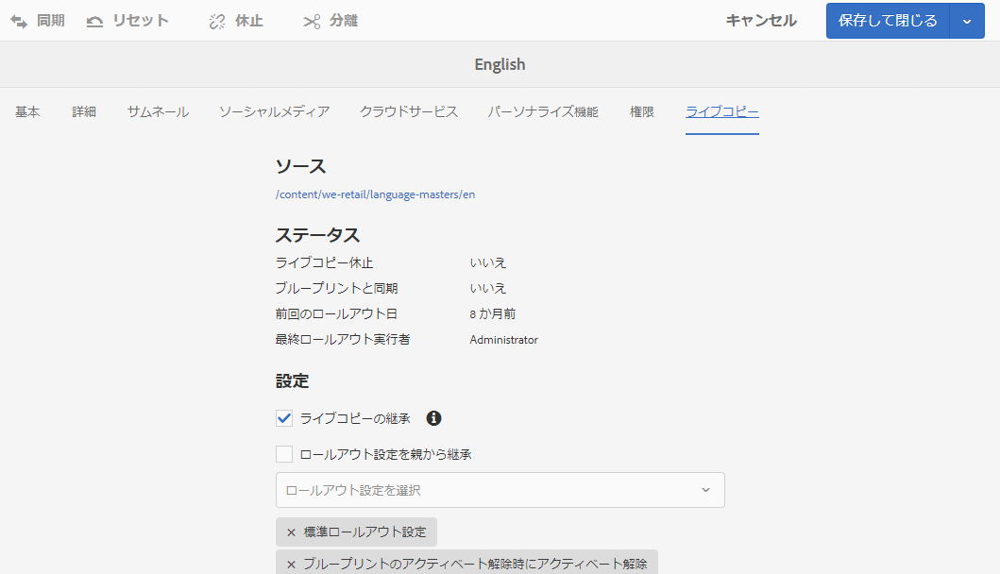
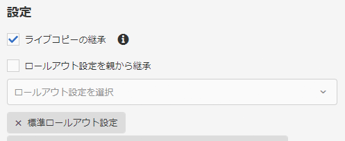

# ライブコピーの同期の設定{#configuring-live-copy-synchronization}

以下のタスクを実行して、ライブコピーとソースコンテンツを同期する方法およびタイミングを制御します。

* 既存のロールアウト設定が要件を満たしているかどうか、または 1 つ以上のロールアウト設定を作成する必要があるかどうかを判断します。
* ライブコピーに使用するロールアウト設定を指定します。

## インストールされるロールアウト設定とカスタムロールアウト設定 {#installed-and-custom-rollout-configurations}

ここでは、インストールされるロールアウト設定、それらの設定で使用する同期アクションおよびカスタム設定の作成方法（必要な場合）に関する情報を示します。

### ロールアウトトリガー {#rollout-triggers}

各ロールアウト設定では、ロールアウトトリガーを使用してロールアウトを発生させます。ロールアウト設定では、以下のいずれかのトリガーを使用できます。

* **ロールアウト時**：**ロールアウト**&#x200B;コマンドがブループリントページで使用されます。または&#x200B;**同期**&#x200B;コマンドがライブコピーページで使用されます。

* **変更時**:ソースページが変更された。

* **アクティベート時**：ソースページがアクティベートされます。

* **アクティベート解除時**：ソースページがアクティベート解除されます。

>[!NOTE]
>
>「変更時」トリガーの使用は、パフォーマンスに影響を及ぼす可能性があります。詳しくは、[MSM のベストプラクティス](/help/sites-administering/msm-best-practices.md#onmodify)を参照してください。

### インストールされるロールアウト設定 {#installed-rollout-configurations}

次の表に、AEM と共にインストールされるロールアウト設定のリストを示します。表には各ロールアウト設定のトリガーと同期アクションが含まれます。インストールされるロールアウト設定のアクションが要件を満たさない場合は、[新しいロールアウト設定を作成](#creating-a-rollout-configuration)できます。

<table>
 <tbody>
  <tr>
   <th>名前</th>
   <th>説明</th>
   <th>トリガー</th>
   <th>同期アクション  <a href="#installed-synchronization-actions">, 「インストールされた同期アクション」も参照</a></th>
  </tr>
  <tr>
   <td>標準のロールアウト設定</td>
   <td>標準のロールアウト設定では、ロールアウトトリガーに対してロールアウトプロセスを開始し、アクション（コンテンツの作成、更新、削除および子ノードの並べ替え）を実行できます。</td>
   <td>ロールアウト時</td>
   <td>contentUpdate  contentCopy  contentDelete  referencesUpdate  productUpdate  orderChildren</td>
  </tr>
  <tr>
   <td>ブループリントのアクティベート時にアクティベート</td>
   <td>ソースが公開された場合にライブコピーを公開します。</td>
   <td>アクティベート時</td>
   <td>targetActivate</td>
  </tr>
  <tr>
   <td>ブループリントのアクティベート解除時にアクティベート解除</td>
   <td>ソースがアクティベート解除された場合にライブコピーをアクティベート解除します。</td>
   <td>アクティベート解除時</td>
   <td>targetDeactivate  </td>
  </tr>
  <tr>
   <td>変更時にプッシュ</td>
   <td>
ソースが変更された場合に、コンテンツをライブコピーにプッシュします。
 
このロールアウト設定は慎重に使用してください（「変更時」トリガーを使用するため）。
 </td>
   <td>変更時</td>
   <td>contentUpdate  contentCopy  contentDelete  referencesUpdate  orderChildren  </td>
  </tr>
  <tr>
   <td>変更時にプッシュ (シャロー)</td>
   <td>
参照を更新せずにブループリントページが変更された場合（シャローコピーの場合など）に、コンテンツをライブコピーにプッシュします。
 
このロールアウト設定は慎重に使用してください（「変更時」トリガーを使用するため）。
 </td>
   <td>変更時</td>
   <td>contentUpdate  contentCopy  contentDelete  orderChildren</td>
  </tr>
  <tr>
   <td>ローンチを昇格</td>
   <td>ローンチページを昇格するための標準のロールアウト設定。</td>
   <td>ロールアウト時</td>
   <td>contentUpdate  contentCopy  contentDelete  referencesUpdate  orderChildren  markLiveRelationship</td>
  </tr>
  <tr>
   <td>カタログページコンテンツのロールアウト設定</td>
   <td>カタログのブループリントからページテンプレートを適用します。</td>
   <td>ロールアウト時</td>
   <td>contentUpdate  contentCopy  contentDelete  referencesUpdate  productCreateUpdate  orderChildren</td>
  </tr>
  <tr>
   <td>カタログページ更新のロールアウト設定</td>
   <td>カタログのブループリントからターゲットのプロパティを適用します。カタログページコンテンツのロールアウト設定の後に実行する必要があります。</td>
   <td>ロールアウト時</td>
   <td>catalogRolloutHooks</td>
  </tr>
  <tr>
   <td>DPS パブリケーションのロールアウト設定</td>
   <td>DPS パブリケーションのロールアウト設定では、ロールアウトトリガーに対してロールアウトプロセスを開始し、最初のロールアウト時に FolioProducer のバインドプロパティを除外できます。</td>
   <td>ロールアウト時</td>
   <td>contentUpdate  contentCopy  contentDelete  referencesUpdate  orderChildren  dpsMetadataFilter</td>
  </tr>
  <tr>
   <td>レガシー (5.6.0) カタログロールアウト設定</td>
   <td>使用されなくなりました。カタログロールアウトには、MSM ではなくカタログジェネレーターを使用してください。</td>
   <td>ロールアウト時</td>
   <td>editProperties</td>
  </tr>
 </tbody>
</table>

### インストールされる同期アクション {#installed-synchronization-actions}

次の表に、AEM と共にインストールされる同期アクションのリストを示します。If the installed actions do not meet your requirements, you can [Create a New Synchronization Action](/help/sites-developing/extending-msm.md#creating-a-new-synchronization-action).

<table>
 <tbody>
  <tr>
   <th>アクション名</th>
   <th>説明</th>
   <th>プロパティ  </th>
  </tr>
  <tr>
   <td>contentCopy</td>
   <td>ソースのノードがライブコピーに存在しない場合は、ライブコピーにノードをコピーします。<a href="#excluding-properties-and-node-types-from-synchronization">CQ MSM Content Copy Actionサービス</a> を設定して、除外するノードタイプ、段落項目、ページプロパティを指定します。   </td>
   <td> </td>
  </tr>
  <tr>
   <td>contentDelete</td>
   <td>
Deletes nodes of the live copy that do not exist on the source. <a href="#excluding-properties-and-node-types-from-synchronization">Configure the CQ MSM Content Delete Action service</a> to specify the node types, paragraph items, and page properties to exclude. 
 </td>
   <td> </td>
  </tr>
  <tr>
   <td>contentUpdate</td>
   <td>ソースからの変更を使用してライブコピーのコンテンツを更新します。<a href="#excluding-properties-and-node-types-from-synchronization">CQ MSM Content Update Actionサービス</a> を設定して、除外するノードタイプ、段落項目、ページプロパティを指定します。   </td>
   <td> </td>
  </tr>
  <tr>
   <td>editProperties</td>
   <td>
ライブコピーのプロパティを編集します。編集するプロパティとその値は editMap プロパティで指定します。editMap プロパティの値は次の形式にしてください。
 
<code>[property_name_1]#[current_value]#</code>[new_value],  [new_value], <code>[property_name_2]#[current_value]#</code>...,  <code>[property_name_n]#[current_value]#</code>[new_value]
 
The <code>current_value</code> and <code>new_value</code> items are regular expressions.   
 
例えば、editMap の次の値を検討してください。
 
<code>sling:resourceType#/</code>(contentpage|homepage)#/  mobilecontentpage,  cq:template#/contentpage#/mobilecontentpage
 
この値は、ライブコピーのノードのプロパティを次のように編集します。

    <ul>
     <li>The <code>sling:resourceType</code> properties that are either set to <code>contentpage</code> or to <code>homepage</code> are set to <code>mobilecontentpage.</code></li>
     <li>The <code>cq:template</code> properties that are set to <code>contentpage</code> are set to <code>mobilecontentpage.</code></li>
    </ul> </td>
   <td>
 
 
editMap：（文字列）プロパティ、現在の値および新しい値を識別します。説明を参照してください。  
 </td>
  </tr>
  <tr>
   <td>notify</td>
   <td>ページがロールアウトされたページイベントを送信します。通知が送信されるようにするには、最初にロールアウトイベントを購読する必要があります。</td>
   <td> </td>
  </tr>
  <tr>
   <td>orderChildren</td>
   <td>ライブコピーにおいて、ブループリント上の順序を基に子（ノード）を並べ替えます。  </td>
   <td> </td>
  </tr>
  <tr>
   <td>referencesUpdate</td>
   <td>
この同期アクションは、ライブコピーにおいて、リンクと同様に参照を更新します。 
ブループリント内の特定のリソースを指す、ライブコピーページ内のパスを検索します。パスが見つかったら、（ブループリントの代わりに）ライブコピー内の関連リソースを指すようにそのパスを更新します。ブループリント外のターゲットを持つ参照は変更されません。
 
<a href="#excluding-properties-and-node-types-from-synchronization">CQ MSM References Update Actionサービス</a> を設定して、除外するノードタイプ、段落項目、ページプロパティを指定します。 
 </td>
   <td> </td>
  </tr>
  <tr>
   <td>targetVersion</td>
   <td>
ライブコピーのバージョンを作成します。
 
このアクションは、ロールアウト設定に含まれる唯一の同期アクションである必要があります。
 </td>
   <td> </td>
  </tr>
  <tr>
   <td>targetActivate</td>
   <td>
ライブコピーをアクティベートします。
 
このアクションは、ロールアウト設定に含まれる唯一の同期アクションである必要があります。
 </td>
   <td> </td>
  </tr>
  <tr>
   <td>targetDeactivate</td>
   <td>
ライブコピーをアクティベート解除します。
 
このアクションは、ロールアウト設定に含まれる唯一の同期アクションである必要があります。
 </td>
   <td> </td>
  </tr>
  <tr>
   <td>workflow</td>
   <td>
target プロパティで定義されるワークフローを開始し（ページの場合のみ）、ライブコピーをペイロードと見なします。
 
ターゲットパスは、モデルノードのパスです。
 </td>
   <td>target：（文字列）ワークフローモデルのパス。  </td>
  </tr>
  <tr>
   <td>mandatory</td>
   <td>
ライブコピーページ上の複数の ACL の権限を、特定のユーザーグループに対して読み取り専用に設定します。以下の ACL が設定されます。

    <ul>
     <li>ActionSet.ACTION_NAME_REMOVE</li>
     <li>ActionSet.ACTION_NAME_SET_PROPERTY</li>
     <li>ActionSet.ACTION_NAME_ACL_MODIFY</li>
    </ul> 
このアクションはページにのみ使用してください。
 </td>
   <td>target: (String) The ID of the group for which you are setting permissions.   </td>
  </tr>
  <tr>
   <td>mandatoryContent</td>
   <td>
ライブコピーページ上の複数の ACL の権限を、特定のユーザーグループに対して読み取り専用に設定します。以下の ACL が設定されます。

    <ul>
     <li>ActionSet.ACTION_NAME_SET_PROPERTY</li>
     <li>ActionSet.ACTION_NAME_ACL_MODIFY</li>
    </ul> 
このアクションはページにのみ使用してください。
 </td>
   <td>target：（String）権限を設定するグループの ID。 </td>
  </tr>
  <tr>
   <td>mandatoryStructure</td>
   <td>ライブコピーページのActionSet.ACTION_NAME_REMOVE ACLの権限を、特定のユーザーグループに対して読み取り専用に設定します。このアクションはページに対してのみ使用します。</td>
   <td>target：（String）権限を設定するグループの ID。 </td>
  </tr>
  <tr>
   <td>VersionCopyAction</td>
   <td>ブループリント／ソースページが少なくとも 1 回公開された場合は、公開されたバージョンを使用してライブコピーページを作成します。メモ：このアクションは、公開されたソースページに基づくライブコピーページの作成でのみ使用できます。既存のライブコピーページの更新では使用できません。 </td>
   <td> </td>
  </tr>
  <tr>
   <td>PageMoveAction</td>
   <td>
PageMoveAction はページがブループリント内に移動されたときに適用されます。
 
（関連する）ライブコピーページは、移動前の場所から移動後の場所に、（移動ではなく）コピーされます。
 
PageMoveAction によって、移動前の場所にあるライブコピーページが変更されることはありません。このため、結果としてロールアウト設定では、ステータスはブループリントなしのライブ関係になります。
 
<a href="#excluding-properties-and-node-types-from-synchronization">CQ MSM Page Move Action サービスを設定</a>して、除外するノードタイプ、段落項目およびページプロパティを指定してください。 
 
このアクションは、ロールアウト設定に含まれる唯一の同期アクションである必要があります。
 </td>
   <td>
prop_referenceUpdate：（ブール値）参照を更新するには、true に設定します。デフォルト値は true です。
 
 
 </td>
  </tr>
  <tr>
   <td>productCreateUpdate</td>
   <td>カタログ内の Product リソースを作成または更新します。このアクションは次のどちらかの場合に使用してください。
    <ul>
     <li>カタログ（またはカタログのセクション）を生成またはロールアウトする。</li>
     <li>ユーザーが商品コンポーネントの同期の継承を復元する。</li>
    </ul> </td>
   <td> </td>
  </tr>
  <tr>
   <td>markLiveRelationship</td>
   <td>ローンチが作成したコンテンツ用のライブの関係が存在することを示します。</td>
   <td> </td>
  </tr>
  <tr>
   <td>catalogRolloutHooks</td>
   <td>カタログ生成特有のロールアウトフックを実行します。CatalogGenerator の executePageRolloutHooks メソッドと executeProductRolloutHooks メソッドを呼び出します。 AEM の Javadoc の com.adobe.cq.commerce.pim.api.CatalogGenerator を参照してください。</td>
   <td> </td>
  </tr>
  <tr>
   <td>productUpdate</td>
   <td>商品カタログのライブコピー内の商品ページを更新します。</td>
   <td> </td>
  </tr>
 </tbody>
</table>

### ロールアウト設定の作成 {#creating-a-rollout-configuration}

インストールされるロールアウト設定がアプリケーションの要件を満たさない場合は、[ロールアウト設定を作成](/help/sites-developing/extending-msm.md#creating-a-new-rollout-configuration)できます。

* [ロールアウト設定を作成](/help/sites-developing/extending-msm.md#create-the-rollout-configuration)します。
* [ロールアウト設定に同期アクションを追加](/help/sites-developing/extending-msm.md#add-synchronization-actions-to-the-rollout-configuration)します。

ブループリントまたはライブコピーページでロールアウト設定を指定すると、新しいロールアウト設定が使用可能になります。

### プロパティとノードタイプの同期からの除外 {#excluding-properties-and-node-types-from-synchronization}

対応する同期アクションをサポートする複数の OSGi サービスを設定して、特定のノードタイプやプロパティに影響を与えないようにすることができます。例えば、AEM の内部機能に関連する多くのプロパティとサブノードをライブコピーに含めることはできません。コピーする必要があるのは、ページのユーザーに関連するコンテンツだけです。

AEM を操作しているときは、このようなサービスの設定を管理する方法がいくつかあります。詳細および推奨事項については、[OSGi の設定](/help/sites-deploying/configuring-osgi.md)を参照してください。

以下の表は、除外するノードを指定できる同期アクションを示しています。この表には、Web コンソールを使用して設定する場合のサービスの名前とリポジトリノードを使用して設定する場合の PID が示されています。

| 同期アクション | Web コンソールでのサービス名 | サービス PID |
|---|---|---|
| contentCopy | CQ MSM Content Copy Action | com.day.cq.wcm.msm.impl.actions.ContentCopyActionFactory |
| contentDelete | CQ MSM Content Delete Action | com.day.cq.wcm.msm.impl.actions.ContentDeleteActionFactory |
| contentUpdate | CQ MSM Content Update Action | com.day.cq.wcm.msm.impl.actions.ContentUpdateActionFactory |
| PageMoveAction | CQ MSM Page Move Action | com.day.cq.wcm.msm.impl.actions.PageMoveActionFactory |
| referencesUpdate | CQ MSM References Update Action | com.day.cq.wcm.msm.impl.actions.ReferencesUpdateActionFactory |

次の表は、設定可能なプロパティを示しています。

<table>
 <tbody>
  <tr>
   <th>Web コンソールのプロパティ／OSGi のプロパティ</th>
   <th>説明</th>
  </tr>
  <tr>
   <td>
Excluded Nodetypes
 
cq.wcm.msm.action.excludednodetypes
 </td>
   <td>同期アクションから除外するノードタイプに一致する正規表現です。</td>
  </tr>
  <tr>
   <td>
Excluded Paragraph Items
 
cq.wcm.msm.action.excludedparagraphitems
 </td>
   <td>同期アクションから除外する段落項目に一致する正規表現です。</td>
  </tr>
  <tr>
   <td>
Excluded Page Properties
 
cq.wcm.msm.action.excludedprops
 </td>
   <td>同期アクションから除外するページプロパティに一致する正規表現です。</td>
  </tr>
  <tr>
   <td>
Ignored Mixin NodeTypes
 
cq.wcm.msm.action.ignoredMixin
 </td>
   <td>CQ MSMコンテンツ更新アクションでのみ使用できます。同期アクションから除外されるmixinノードタイプの名前と一致する正規式。</td>
  </tr>
 </tbody>
</table>

>[!NOTE]
>
>クラシック UI で、ライブコピーページのページのプロパティダイアログボックスに表示されるロックアイコンには、「Excluded Page Properties」プロパティの設定が反映されません。ロックアイコンは、同期アクションから除外されたプロパティについても表示されます。

>[!NOTE]
>
>タッチ操作向け UI の場合は、[ページプロパティの MSM ロックの設定（タッチ操作向け UI）](/help/sites-developing/extending-msm.md#configuring-msm-locks-on-pagep-roperties-touch-optimized-ui)も参照してください。

#### CQ MSM Content Update Action - 除外 {#cq-msm-content-update-action-exclusions}

いくつかのプロパティやノードタイプはデフォルトで除外されています。これらは **CQ MSM Content Update Action** の OSGi の設定の、**Excluded Page Properties** の下に定義されています。

デフォルトでは、次の正規表現に一致するプロパティがロールアウト時に除外されます（更新されません）。

必要に応じて、除外リストを定義する表現を変更できます。

例えば、ロールアウトで考慮される変更にページ&#x200B;**タイトル**&#x200B;を含めるには、除外から `jcr:title` を削除します。正規表現は次のようになります。

`jcr:(?!(title)$).*`

### 参照を更新するための同期の設定 {#configuring-synchronization-for-updating-references}

参照の更新に関連する、対応する同期アクションをサポートする複数の OSGi サービスを設定できます。

AEM を操作しているときは、このようなサービスの設定を管理する方法がいくつかあります。詳細および推奨事項については、[OSGi の設定](/help/sites-deploying/configuring-osgi.md)を参照してください。

次の表は、参照の更新を指定できる同期アクションを示します。この表には、Web コンソールを使用して設定する場合のサービスの名前とリポジトリノードを使用して設定する場合の PID が示されています。

<table>
 <tbody>
  <tr>
   <th>Web コンソールのプロパティ／OSGi のプロパティ</th>
   <th>説明</th>
  </tr>
  <tr>
   <td>
Update Reference across nested LiveCopies
 
cq.wcm.msm.impl.action.referencesupdate.prop_updateNested
 </td>
   <td>CQ MSM References Update Action でのみ使用できます。このオプション（Webコンソール）を選択するか、このブール値のプロパティをtrue（リポジトリ設定）に設定して、最上位のLiveCopyのブランチに含まれるターゲットの参照を置き換えます。</td>
  </tr>
  <tr>
   <td>
Update Referencing Pages
 
cq.wcm.msm.impl.actions.pagemove.prop_referenceUpdate
 </td>
   <td>CQ MSMページ移動アクションでのみ使用できます。 Select this option (Web Console) or set this boolean property to <code>true</code> (repository configuration) to update any references to use the original page to instead reference the LiveCopy page.</td>
  </tr>
 </tbody>
</table>

## 使用するロールアウト設定の指定 {#specifying-the-rollout-configurations-to-use}

MSM を使用すると、通常使用するロールアウト設定のセットを指定できます。必要に応じて、特定のライブコピー用にロールアウト設定を上書きすることもできます。MSM では、使用するロールアウト設定を複数の場所で指定できます。この場所では、特定のライブコピーに設定を適用するかどうかを指定します。

使用するロールアウト設定を指定できる場所を以下に示します。また、ライブコピーに使用するロールアウト設定を MSM がどのように決定するかについても説明します。

* **[ライブコピーページのプロパティ](/help/sites-administering/msm-sync.md#setting-the-rollout-configurations-for-a-live-copy-page)：** 1 つ以上のロールアウト設定を使用するようにライブコピーページが設定される場合、MSM ではそれらのロールアウト設定を使用します。
* **[ブループリントページのプロパティ](/help/sites-administering/msm-sync.md#setting-the-rollout-configuration-for-a-blueprint-page)：**&#x200B;ライブコピーがブループリントに基づいており、ライブコピーページがロールアウト設定を使用して設定されない場合は、ブループリントのソースページに関連付けられているロールアウト設定が使用されます。
* **ライブコピーの親ページのプロパティ：** ライブコピーページもブループリントソースページもロールアウト設定で設定されていない場合は、ライブコピーページの親ページに適用されるロールアウト設定が使用されます。
* **[システムのデフォルト](/help/sites-administering/msm-sync.md#setting-the-system-default-rollout-configuration):** ライブコピーの親ページのロールアウト設定を決定できない場合は、システムの既定のロールアウト設定が使用されます。

例えば、ブループリントが We.Retail 参照サイトをソースコンテンツとして使用するとします。サイトはブループリントから作成されます。次のリスト内の各項目は、ロールアウト設定の使用に関する様々なシナリオを示しています。

* どのブループリントページまたはライブコピーページもロールアウト設定を使用するように設定されていない。この場合、MSM では、システムのデフォルトのロールアウト設定をすべてのライブコピーページに使用します。
* We.Retail 参照サイトのルートページが複数のロールアウト設定を使用して設定されている。この場合、MSM では、これらのロールアウト設定をすべてのライブコピーページに使用します。
* Web.Retailリファレンスサイトのルートページは複数のロールアウト設定で構成され、ライブコピーサイトのルートページは別のロールアウト設定で構成されます。 この場合、MSM では、ライブコピーサイトのルートページで設定されたロールアウト設定を使用します。

### ライブコピーページ用のロールアウト設定の指定 {#setting-the-rollout-configurations-for-a-live-copy-page}

ソースページがロールアウトされる場合に使用するロールアウト設定を使用してライブコピーページを設定します。デフォルトでは、子ページは設定を継承します。使用するロールアウト設定を指定する場合は、ライブコピーページがその親から継承する設定を上書きします。

[ライブコピーの作成](/help/sites-administering/msm-livecopy.md#creating-a-live-copy-of-a-page)時に、ライブコピーページ用のロールアウト設定を指定することもできます。

1. **サイト**&#x200B;コンソールを使用してライブコピーページを選択します
1. ツールバーの「**プロパティ**」を選択します。
1. 「**ライブコピー**」タブを開きます。

   「**設定**」セクションには、ページが継承するロールアウト設定が表示されます。

   

1. 必要に応じて、「**ライブコピーの継承**」フラグを変更します。オンにした場合、ライブコピー設定がすべての子で有効になります。

1. 「**ロールアウト設定を親から継承**」プロパティをオフにして、1 つ以上のロールアウト設定をリストから選択します。

   選択したロールアウト設定がドロップダウンリストの下に表示されます。

   

1. 「**保存**」をクリックまたはタップします。

### ブループリントページ用のロールアウト設定の指定 {#setting-the-rollout-configuration-for-a-blueprint-page}

ブループリントページがロールアウトされる場合に使用するロールアウト設定を使用してブループリントページを設定します。

ブループリントページの子ページがその設定を継承します。使用するロールアウト設定を指定する場合は、ページがその親から継承する設定を上書きできます。

1. Use the **Sites** console to select the root page of the blueprint.
1. ツールバーの「**プロパティ**」を選択します。
1. 「**ブループリント**」タブを開きます。
1. ドロップダウンセレクターを使用して&#x200B;**ロールアウト設定**&#x200B;を 1 つ以上選択します。
1. 「**保存**」を選択して更新内容を保持します。

### システムのデフォルトのロールアウト設定の指定 {#setting-the-system-default-rollout-configuration}

システムのデフォルトとして使用するロールアウト設定を指定します。デフォルトを指定するには、OSGi サービスを次のように設定します。

* **Day CQ WCM Live Relationship Manager**  サービス PID は 
`com.day.cq.wcm.msm.impl.LiveRelationshipManagerImpl`

このサービスを設定するには、[Web コンソール](/help/sites-deploying/configuring-osgi.md#osgi-configuration-with-the-web-console)または[リポジトリノード](/help/sites-deploying/configuring-osgi.md#osgi-configuration-in-the-repository)を使用します。

* Web コンソールの場合、設定するプロパティの名前は「Default rollout config」です。
* Using a repository node, the name of the property to configure is `liverelationshipmgr.relationsconfig.default`.

このプロパティの値を、システムのデフォルトとして使用するロールアウト設定のパスに指定します。The default value is `/libs/msm/wcm/rolloutconfigs/default`, which is the **Standard Rollout Config**.
