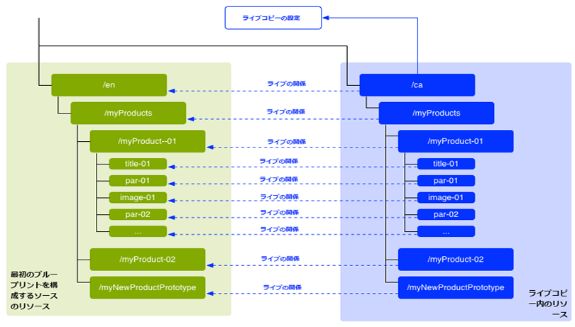
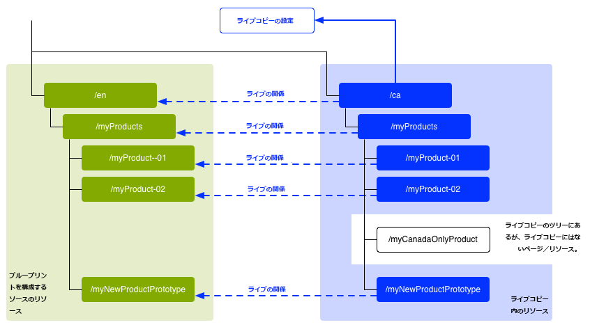
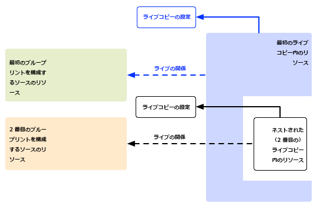
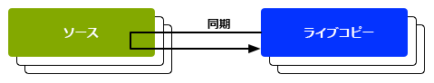

# コンテンツの再利用：マルチサイトマネージャーとライブコピー{#reusing-content-multi-site-manager-and-live-copy}

マルチサイトマネージャー（MSM）を使用すると、同じサイトコンテンツを複数の場所で使用できます。MSM ではライブコピー機能を使用してこれをおこないます。

* MSM では、次の操作を実行できます。

   * コンテンツの作成を何度も行う
   * このコンテンツをコピーして同じまたは別のサイトの他の領域で使用します（[ライブコピー](#live-copies)）。

* その後、MSM は次の目的でソースコンテンツとライブコピーの間の（ライブ）関係を維持します。

   * ソースコンテンツに変更を加えると、ソースとライブコピーが同期されます（変更がライブコピーにも適用されます）。
   * 個々のサブページやコンポーネントのライブ関係を解除することで、ライブコピーを微調整できます。これをおこなうと、ソースに対する変更がライブコピーに適用されなくなります。

これに関連する問題について、このページと後続のページで説明します。

* [ライブコピーの作成と同期](/help/sites-administering/msm-livecopy.md)
* [ライブコピーの概要コンソール](/help/sites-administering/msm-livecopy-overview.md)
* [ライブコピーの同期の設定](/help/sites-administering/msm-sync.md)
* [MSM ロールアウトの競合](/help/sites-administering/msm-rollout-conflicts.md)
* [MSM のベストプラクティス](/help/sites-administering/msm-best-practices.md)

## 考えられるシナリオ {#possible-scenarios}

MSM とライブコピーには数多くのユースケースがあります。次のようなシナリオが考えられます。

* **多国籍 - グローバル企業から現地企業**

   MSM がサポートする一般的な使用事例は、複数の多国籍かつ同一言語のサイトにおけるコンテンツの再利用です。これにより主要なコンテンツは再利用しつつ、国ごとに異なるコンテンツを作成できます。

   例えば、米国の顧客向けには、サンプルの We.Retail 参照サイトの「英語」セクションが作成されます。このサイト内のコンテンツのほとんどは、国や文化の異なる英語圏の顧客に対応した他の We.Retail サイトでも使用できます。主要なコンテンツは全サイトで同じになる一方で、地域ごとに調整を加えることができます。

   米国、英国、カナダ、オーストラリアのサイトでは、次の構造を使用できます。

   ```xml
   /content
       |- we.retail
           |- language-masters
               |- en
       |- we.retail
           |- us
               |- en
       |- we.retail
           |- gb
               |- en
       |- we.retail
           |- ca
               |- en
       |- we.retail
           |- au
               |- en
   ```

   >[!NOTE]
   >
   >MSM はコンテンツを翻訳しません。必要な構造を作成し、コンテンツをデプロイするために使用します。
   >
   >
   >See [Translating Content for Multilingual Sites](/help/sites-administering/translation.md) if you want to extend such an example.

* **国内 - 本社から地方支社**

   販売網が構築されている企業では、販売特約店によって Web サイトを分けたほうがよい場合があります。この場合、各サイトは本社によって提供される主要なサイトのバリエーションになります。これは、複数の支社を持つ単一の企業や、フランチャイズ本部と国内の複数のフランチャイズ加盟店で構成されるフランチャイズシステムに適してします。

   本社が中核となる情報を提供し、各地方の部門が問い合わせ先の詳細情報、営業時間、イベントなどのローカル情報を追加します。

   ```xml
   /content
       |- head-office-Berlin
       |- branch-Hamburg
       |- branch-Stuttgart
       |- branch-Munich
       |- branch-Frankfurt
   ```

* **複数バージョン**

   MSM を使用して、特定のサブブランチのバージョンを作成することもできます。例えば、ある商品の様々なバージョンの詳細情報を提供するサポート用のサブサイトでは、基本情報は一定に保ち、更新された機能のみを変更する必要があります。

   ```xml
   /content
       |- support
           |- product X
               |- v5.0
               |- v4.0
               |- v3.0
               |- v2.0
               |- v1.0
   ```

   >[!NOTE]
   >
   >そのようなシナリオでは常に、単純にコピーを作成するかライブコピーを使用するかどうかを判断する必要があります。
   >
   >ここでは、以下のバランスを考慮します。
   >
   >  * 複数のバージョンで更新する必要がある中核となるコンテンツの割合
   >
   >および
   >
   >  * 調整する必要がある個々のコピーの割合


## UI からの MSM {#msm-from-the-ui}

MSM は、該当するコンソールの UI から各種オプションを使用して直接アクセスできます。はじめに、主な場所のリストを次に示します。

* **サイトを作成**（**サイト**）

   * MSM は、コンテンツを共有する複数の Web サイトの管理をサポートします。例えば、多くの Web サイトの対象はグローバルであり、すべての国で共通の大多数のコンテンツと、国別に固有のコンテンツのサブセットで構成されています。MSM を使用すると、[ソースサイトをベースとする複数のサイトを自動的に更新するライブコピーを作成](/help/sites-administering/msm-livecopy.md#creating-a-live-copy-of-a-site-from-a-blueprint-configuration)できます。また、共通の基本構造が適用され、複数サイト全体で共通のコンテンツを使用し、共通のルックアンドフィールが保持されるので、サイト間で実際に異なるコンテンツの管理に注力することができます。
   * ソースの指定に事前に定義されたブループリント設定が必要です。
   * （事前に定義された）ソースのライブコピーを作成します。
   * 「**ロールアウト**」ボタンを使用してユーザーを指定します。

* **ライブコピーを作成**（**サイト**）

   * MSM を使用すると、[Web サイトの個々のページまたはサブブランチのアドホック（1 回限りの）ライブコピーを作成](/help/sites-administering/msm-livecopy.md#creating-a-live-copy-of-a-page)できます。例えば、サブブランチを複製して商品の新しいバージョンや更新されたバージョンに関する情報を提供することができます。
   * アドホックライブコピーを作成します（ブループリント設定は不要）。
   * 任意のページまたはブランチのライブコピーを（即座に）作成できます。
   * Requires **Synchronize** (does not provide the **Rollout** button).

* **プロパティを表示**（**サイト**）

   * Where appropriate, this option helps you [monitor your live copy](/help/sites-administering/msm-livecopy.md#monitoring-your-live-copy) by providing information on the related **Live Cop** y or **Blueprint**.

* **参照**（**サイト**）

   * [参照レールには](/help/sites-authoring/basic-handling.md#references)**** 、ライブコピーに関する情報と、該当するアクションへのアクセス権が表示されます。

* **ライブコピーの概要**（**サイト**）

   * このコンソールを使用すると、[ブループリントとそのライブコピーを表示して管理](/help/sites-administering/msm-livecopy-overview.md)できます。

* **ブループリント**（**ツール**／**サイト**）

   * このコンソールを使用すると、[ブループリント設定を作成して管理](/help/sites-administering/msm-livecopy.md#creating-a-blueprint-configuration)できます。

>[!NOTE]
>
>MSM の機能の様々な側面は、AEM のその他各種機能で使用されます（ローンチ、カタログなど）。これらのケースでは、ライブコピーはその機能によって管理されます。

### 使用されている用語 {#terms-used}

はじめに、MSM で使用されている主な用語の概要を次の表に示します。後の節やページでこれらについて詳しく説明します。

<table>
 <tbody>
  <tr>
   <td><strong>用語</strong></td>
   <td><strong>定義</strong></td>
   <td><strong>詳細</strong></td>
  </tr>
  <tr>
   <td><strong>ソース</strong></td>
   <td>元のページ。</td>
   <td>ブループリントやブループリントページとも呼ばれます。</td>
  </tr>
  <tr>
   <td><strong>ライブコピー</strong></td>
   <td>ロールアウト設定で定義されている通りに同期アクションで維持される（ソースの）コピー。 </td>
   <td> </td>
  </tr>
  <tr>
   <td><strong>ライブコピーの設定</strong></td>
   <td>ライブコピーの設定の詳細の定義。</td>
   <td> </td>
  </tr>
  <tr>
   <td><strong>ライブの関係</strong><br /> </td>
   <td>指定のリソースの継承についての効果の定義。ソースとライブコピーの間の関係です。<br /> </td>
   <td>ライブコピーを使用してソースに対する変更を同期できます。</td>
  </tr>
  <tr>
   <td><strong>ブループリント</strong></td>
   <td>ソースと同義。</td>
   <td>ブループリント設定で定義できます。</td>
  </tr>
  <tr>
   <td><strong>ブループリント設定</strong></td>
   <td>ソースパスを指定する事前に定義された設定。</td>
   <td>ブループリント設定でブループリントページが参照されていると、ロールアウトコマンドを使用できます。</td>
  </tr>
  <tr>
   <td><strong>同期化</strong></td>
   <td>The generic term for the synchronization of content between the source and the live copies (by both <strong>Rollout</strong> and <strong>Synchronize</strong>).</td>
   <td> </td>
  </tr>
  <tr>
   <td><strong>ロールアウト</strong><br /> </td>
   <td>ソースからライブコピーへの同期。<br /> （ブループリントページの）作成者によって、または（ロールアウト設定で定義された）システムイベントとしてトリガーされます。</td>
   <td> </td>
  </tr>
  <tr>
   <td><strong>ロールアウト設定</strong></td>
   <td>同期するプロパティ、および同期を実行する方法とタイミングを決定するルール。</td>
   <td> </td>
  </tr>
  <tr>
   <td><strong>同期</strong></td>
   <td>ライブコピーページから作成される、同期の手動リクエスト。</td>
   <td> </td>
  </tr>
  <tr>
   <td><strong>継承</strong></td>
   <td>同期が発生すると、ライブコピーのページやコンポーネントはそのソースページやソースコンポーネントからコンテンツを継承します。</td>
   <td> </td>
  </tr>
  <tr>
   <td><strong>休止</strong></td>
   <td>ライブコピーとそのブループリントページの間のライブ関係を一時的に削除します。</td>
   <td> </td>
  </tr>
  <tr>
   <td><strong>分離</strong></td>
   <td>ライブコピーとそのブループリントページの間のライブ関係を永続的に削除します。</td>
   <td> </td>
  </tr>
  <tr>
   <td><strong>リセット</strong></td>
   <td><p>ライブコピーページをリセットすると、次のようになります。</p>
    <ul>
     <li>すべての継承のキャンセルが削除され、かつ<br /> </li>
     <li>ページをソースページと同じ状態に戻します。</li>
    </ul> <p>「リセット」は、ページプロパティ、段落システムおよびコンポーネントに対して行った変更に影響します。</p> </td>
   <td> </td>
  </tr>
  <tr>
   <td><strong>シャロー</strong></td>
   <td>単一のページのライブコピー。</td>
   <td> </td>
  </tr>
  <tr>
   <td><strong>ディープ</strong></td>
   <td>ページのライブコピーとその子ページ。</td>
   <td> </td>
  </tr>
 </tbody>
</table>

>[!NOTE]
>
>See [Overview of the Java API](/help/sites-developing/extending-msm.md#overview-of-the-java-api) for the object names.

## ライブコピー {#live-copies}

MSM のライブコピーは、特定のサイトコンテンツのコピーです。このコピーについては、元のソースとのライブ関係が維持されます。

* ライブコピーはそのソースからコンテンツを継承します。
* ソースに対して変更が加えられると、同期化によってコンテンツが実際に転送されます。
* ライブコピーは、次のいずれかと見なされます。

   * シャロー：単一のページ
   * ディープ：ページとその子ページ

* ロールアウト設定と呼ばれる同期ルールによって、同期するプロパティおよび同期を行うタイミングが決定されます。

In the previous example, `/content/we-retail/language-masters/en` is the global master site in English. このサイトのコンテンツを再利用するために、MSM のライブコピーが作成されます。

* The content below `/content/we-retail/language-masters/en` is the source.

* The content below `/content/we-retail/language-masters/en` is copied below the `/content/we-retail/us/en/`, `/content/we-retail/gb/en`, `/content/we-retail/ca/en`, and `/content/we-retail/au/en` nodes. これらがライブコピーです。

* Authors make changes to pages below `/content/we-retail/language-masters/en`.
* トリガーされると、MSM はこれらの変更をライブコピーに同期します。

### ライブコピー - 構成 {#live-copies-composition}

>[!NOTE]
>
>この節の図と説明は、想定されるライブコピーのスナップショットを表しています。これらは包括的ではなく、特徴を説明するための概要を示しています。

ライブコピーを最初に作成すると、選択したソースページが 1:1 の対応でライブコピーに反映されます。その後、新しいリソース（ページまたは段落）をそのライブコピー内に直接作成することもできるので、これらのバリエーションと同期への影響を理解しておくと役に立ちます。使用可能な構成は次のとおりです。

* [ライブコピー以外のページのライブコピー](#live-copy-with-non-live-copy-pages)
* [ネストされたライブコピー](#nested-live-copies)

ライブコピーの基本形式は次のとおりです。

* 選択したソースページが 1:1 の対応で反映されたライブコピーページ。
* 1 つの設定定義。
* すべてのリソースに定義されているライブ関係。

   * ライブコピーのリソースをブループリントやソースにリンクします。
   * 継承とロールアウトを実現する際に使用されます。

* Changes can be [synchronized](/help/sites-administering/msm-livecopy.md#synchronizing-your-live-copy) according to requirements.



#### ライブコピー以外のページのライブコピー {#live-copy-with-non-live-copy-pages}

AEM にライブコピーを作成すると、ライブコピーのブランチを表示して移動できるほか、ライブコピーのブランチで AEM の通常の機能を使用できます。This means that you (or a process) can create new resources (pages and/or paragraphs) inside the live copy branch (e.g. `myCanadaOnlyProduct`).

* そのようなリソースにはソースやブループリントのページへのライブ関係がなく、同期されません。
* このシナリオは、MSM が特殊なケースを処理する場合に発生することがあります。例えば、ユーザー（またはプロセス）がソースやブループリントとライブコピーのブランチの両方で同じ位置に同じ名前のページを作成した場合です。For such situations see [MSM Rollout Conflicts](/help/sites-administering/msm-rollout-conflicts.md) for more information.



#### ネストされたライブコピー {#nested-live-copies}

When you (or a process) create a [new page within an existing live copy](#live-copy-with-non-live-copy-pages) this new page can also be set up as a live copy of a different blueprint. これはネストされたライブコピーと呼ばれ、2番目（内側）のライブコピーの動作は、次のように、最初（外側）のライブコピーの動作の影響を受けます。

* 最上位レベルのライブコピーに対してトリガーされたディープロールアウトは、ネストされたライブコピーで継続できます（例えば、トリガーが一致する場合）。
* ソース間のリンクは、ライブコピー内で書き直すことができます。

   例えば、2 番目のブループリントから最初のブループリントへのリンクは、ネストされた 2 番目のライブコピーから最初のライブコピーへのリンクとして書き直されます。



>[!NOTE]
>
>ライブコピーのブランチ内のページを移動または名前を変更すると、これは（内部的に）ネストされたライブコピーとして扱われ、AEM で関係を追跡できるようになります。

#### 積み重ねられたライブコピー {#stacked-live-copies}

ライブコピーは、シャローライブコピーの子として作成された場合、積み重ねられたライブコピーと呼ばれます。これは、[ネストされたライブコピー](#nested-live-copies)と同様に動作します。

### ソース、ブループリントおよびブループリント設定 {#source-blueprints-and-blueprint-configurations}

任意のページまたはページのブランチをライブコピーのソースとして使用できます。

ただし、MSM ではソースパスを指定するブループリント設定も定義できます。BluePrint設定を使用する利点は、次のとおりです。

* Allow the author to use the **Rollout** option on a blueprint - to (explicitly) push modifications to live copies that inherit from this blueprint.
* Allow the author to use **Create Site**; this allows the user to easily select languages and configure the structure of the live copy.
* ブループリントと関係があるライブコピーのデフォルトのロールアウト設定を定義できます。

ライブコピーのソースは、通常のページまたはブループリント設定に含まれるページのいずれかです。両方とも有効なユースケースです。

ソースはライブコピーのブループリントを構成します。ブループリントは次のいずれかをおこなうと定義されます。

* [Blueprint構成の作成](/help/sites-administering/msm-livecopy.md#creating-a-blueprint-configuration)

   この設定では、ライブコピーの作成に使用するページを事前に定義します。

* [ページのライブコピーの作成](/help/sites-administering/msm-livecopy.md#creating-a-live-copy-of-a-page)

   ライブコピー（ソースページ）の作成に使用されたページは、BluePrintページです。

    ソースページはブループリント設定によって参照されることも、参照されないこともあります。

### ロールアウトと同期 {#rollout-and-synchronize}

ロールアウトは、ライブコピーとソースを同期する MSM の重要なアクションです。ロールアウトは手動で、または自動で実行できます。

* [ロールアウト設定](#rollout-configurations)を定義して、特定の[イベント](/help/sites-administering/msm-sync.md#rollout-triggers)がルートのロールアウトを自動的に引き起こすように設定できます。
* ブループリントページを作成するときに、[ロールアウト](/help/sites-administering/msm-livecopy.md#rolling-out-a-blueprint)コマンドを使用してライブコピーの変更をプッシュできます。

   **ロールアウト**&#x200B;コマンドは、ブループリント設定によって参照されるブループリントページで使用できます。

   

* ライブコピーページをオーサリングするときに、[同期](/help/sites-administering/msm-livecopy.md#synchronizing-a-live-copy)コマンドを使用してソースからライブコピーに変更をプルします。

   **同期**&#x200B;コマンドは、（ソースやブループリントページがブループリント設定に含まれているかどうかに関係なく）ライブコピーページでいつでも使用できます。

   

### ロールアウト設定 {#rollout-configurations}

ロールアウト設定によって、ライブコピーとソースコンテンツの同期のタイミングおよび方法が定義されます。ロールアウト設定は、トリガーと 1 つ以上の同期アクションで構成されます。

* **トリガー**

   トリガーは、ライブアクションとしての同期を発生させるイベント（ソースページのアクティベートなど）です。MSM では、使用可能なトリガーを定義します。

* **同期アクション**

   ライブコピーで実行され、ライブコピーとソースを同期します。例えば、コンテンツのコピー、子ノードの並べ替え、ライブコピーページのアクティベートなどです。MSM には複数の同期アクションが用意されています。

   >[!NOTE]
   >
   >Java API を使用してお使いのインスタンスのカスタムアクションを作成できます。

ロールアウト設定は再利用可能なので、複数のライブコピーで同じロールアウト設定を使用できます。標準のインストールにいくつかの[ロールアウト設定](/help/sites-administering/msm-sync.md#installed-rollout-configurations)が含まれています。

### ロールアウトの競合 {#rollout-conflicts}

ロールアウトは、特に作成者がソースとライブコピーの両方を編集しているときに複雑になることがあります。そのため、[ロールアウト中に発生する可能性がある競合](/help/sites-administering/msm-rollout-conflicts.md)を AEM がどのように処理するかを把握しておくと便利です。

### 継承と同期の休止とキャンセル {#suspending-and-cancelling-inheritance-and-synchronization}

ライブコピー内の各ページおよびコンポーネントは、ライブの関係を通じてそのソースページおよびコンポーネントに関連付けられます。ライブ関係は、ソースからライブコピーコンテンツへの同期を設定します。

ライブコピーページのライブコピーの継承を&#x200B;**休止**&#x200B;して、ページのプロパティやコンポーネントを変更できます。継承を休止すると、ページプロパティとコンポーネントがソースと同期されなくなります。

個々のページの編集時に、作成者はコンポーネントの&#x200B;**継承をキャンセル**&#x200B;できます。継承がキャンセルされると、ライブの関係が休止状態になり、そのコンポーネントの同期はおこなわれません。継承と同期をキャンセルすると、コンテンツのサブセクションをカスタマイズする必要がある場合に役立ちます。

### ライブコピーの分離 {#detaching-a-live-copy}

ブループリントから[ライブコピーを分離](/help/sites-administering/msm-livecopy.md#detaching-a-live-copy)してすべての関係を削除することもできます。

>[!CAUTION]
>
>分離アクションは永続的で元に戻すことはできません。

分離は、ライブコピーとそのブループリントページの間のライブ関係を永続的に削除します。ライブコピーから MSM に関連するすべてのプロパティが削除され、そのライブコピーページがスタンドアロンのコピーになります。

>[!NOTE]
>
>サブページおよび親ページへの関連する影響も含め、詳しくは[ライブコピーの分離](/help/sites-administering/msm-livecopy.md#detaching-a-live-copy)を参照してください。

## MSM を使用するための標準的な手順 {#standard-steps-for-using-msm}

MSM を使用してコンテンツを再利用し、ライブコピーに対する変更を同期するための標準的な手順を次に示します。

1. ソースサイトのコンテンツを作成します。
1. 使用するロールアウト設定を決定します。

   1. MSM [installs several rollout configurations](/help/sites-administering/msm-sync.md#installed-rollout-configurations) that can satisfy a number of use cases.
   1. 必要に応じて、[ロールアウト設定を作成](/help/sites-administering/msm-sync.md#creating-a-rollout-configuration)できます。

1. [使用するロールアウト設定を指定する](/help/sites-administering/msm-sync.md#specifying-the-rollout-configurations-to-use)場所を決定し、必要に応じて設定をおこないます。
1. If required, [create a blueprint configuration](/help/sites-administering/msm-livecopy.md#creating-a-blueprint-configuration) that identifies the source content of the live copy.
1. [ライブコピーを作成](/help/sites-administering/msm-livecopy.md#creating-a-live-copy)します。
1. 必要に応じてソースコンテンツを変更します。組織で確立されている通常のコンテンツのレビュー／承認プロセスを採用してください。
1. [設計図をロールアウト](/help/sites-administering/msm-livecopy.md#rolling-out-a-blueprint) 、またはライブコピーを変更と [同期します](/help/sites-administering/msm-livecopy.md#synchronizing-a-live-copy) 。

## MSM のカスタマイズ {#customizing-msm}

MSM にはツールが用意されており、コンテンツの共有時に例外的に発生する問題に対しても実装が可能になっています。

* **カスタムロールアウト設定**
   インストール済みのロールアウト設定が要件を満たさない場合に[ロールアウト設定を作成](/help/sites-administering/msm-sync.md#creating-a-rollout-configuration)します。有効な任意のロールアウトトリガーおよび同期アクションを使用できます。

* **カスタム同期アクション**
   [インストールされたアクションが特定のアプリケーション要件を満たさない場合は](/help/sites-developing/extending-msm.md#creating-a-new-synchronization-action) 、カスタム同期アクションを作成します。 MSM には、カスタム同期アクションを作成するための Java API が用意されています。

## ベストプラクティス {#best-practices}

[MSM のベストプラクティス](/help/sites-administering/msm-best-practices.md)には、実装に関する重要な情報が記載されています。
