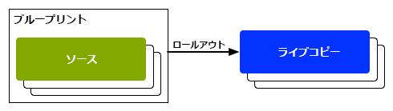

# コンテンツの再利用：マルチサイトマネージャーとライブコピー{#reusing-content-multi-site-manager-and-live-copy}

マルチサイトマネージャ (MSM) を使用すると、同じサイトコンテンツを複数の場所で使用できます。 MSM は、そのライブコピー機能を使用してこれを実現します。

* MSM では、次の操作を実行できます。

   * コンテンツを 1 回作成し、
   * このコンテンツを他の領域 ([ライブコピー](#live-copies)) を同じサイトまたは他のサイトの

* その後、MSM は、次の目的でソースコンテンツとそのライブコピーとの（ライブ）関係を維持します。

   * ソースコンテンツに変更を加えると、ソースとライブコピーが同期されます（変更内容がライブコピーに適用されます）。
   * 個々のサブページやコンポーネントのライブ関係を切断することで、ライブコピーのコンテンツを調整できます。 これにより、ソースに対する変更がライブコピーに適用されなくなります。

以下のページでは、関連する問題について説明します。

* [ライブコピーの作成と同期](/help/sites-administering/msm-livecopy.md)
* [ライブコピーの概要コンソール](/help/sites-administering/msm-livecopy-overview.md)
* [ライブコピーの同期の設定](/help/sites-administering/msm-sync.md)
* [MSM ロールアウトの競合](/help/sites-administering/msm-rollout-conflicts.md)
* [MSM のベストプラクティス](/help/sites-administering/msm-best-practices.md)

## 考えられるシナリオ {#possible-scenarios}

MSM およびライブコピーの使用例は多数ありますが、シナリオには次のものがあります。

* **多国籍企業 — グローバル企業から現地企業へ**

  MSM がサポートする典型的な使用例の 1 つは、複数の多国籍の同言語サイトでコンテンツを再利用する場合です。 これにより、コアコンテンツを再利用しながら、各国語のバリエーションも可能になります。

  例えば、We.Retail 参照サイトサンプルの英語セクションは、米国のお客様向けに作成されます。 このサイトのコンテンツのほとんどは、様々な国や文化の英語を話す顧客に対応する他の We.Retail サイトにも使用できます。 主要なコンテンツは全サイトで同じになる一方で、地域ごとに調整を加えることができます。

  次の構造は、米国、英国、カナダおよびオーストラリアのサイトで使用できます。

  ```xml
  /content
      |- we.retail
          |- language-masters
              |- en
      |- we.retail
          |- us
              |- en
      |- we.retail
          |- gb
              |- en
      |- we.retail
          |- ca
              |- en
      |- we.retail
          |- au
              |- en
  ```

  >[!NOTE]
  >
  >MSM はコンテンツを翻訳しません。必要な構造の作成とコンテンツの導入に使用します。
  >
  >
  >このサンプルを拡張する方法について詳しくは、[多言語サイトのコンテンツの翻訳](/help/sites-administering/translation.md)を参照してください。

* **国内 - 本社から地方支社**

  また、ディーラーのネットワークを持つ会社は、個々の販売店向けに別々の Web サイトを必要とする場合があります。各 Web サイトは、本社が提供するメインサイトのバリエーションです。 複数の地域オフィスを持つ単一の会社や、中央フランチャイザーと複数の地域フランチャイジーで構成される国内フランチャイズシステムの場合も考えられます。

  本社はコア情報を提供できるのに対して、地域のエンティティは連絡先の詳細、営業時間、イベントなどのローカル情報を追加できます。

  ```xml
  /content
      |- head-office-Berlin
      |- branch-Hamburg
      |- branch-Stuttgart
      |- branch-Munich
      |- branch-Frankfurt
  ```

* **複数のバージョン**

  MSM を使用して、特定のサブブランチのバージョンを作成することもできます。例えば、特定の製品の異なるバージョンの詳細を保持するサポートサブサイトでは、ベース情報が一定で、更新された機能のみを変更する必要があります。

  ```xml
  /content
      |- support
          |- product X
              |- v5.0
              |- v4.0
              |- v3.0
              |- v2.0
              |- v1.0
  ```

  >[!NOTE]
  >
  >このようなシナリオでは、常に、簡単なコピーを作成するか、ライブコピーを使用するかの問題が発生します。
  >
  >残りは次のとおりです。
  >
  >  * 複数のバージョンで更新が必要になるコアコンテンツの量。
  >
  >および
  >
  >  * 調整が必要な個々のコピーの量。

## UI からの MSM {#msm-from-the-ui}

MSM は、該当するコンソールの UI から各種オプションを使用して直接アクセスできます。概要を説明するには、主な場所を次に示します。

* **サイトを作成**（**Sites**）

   * MSM は、共通のコンテンツを共有する複数の Web サイトを管理するのに役立ちます。例えば、web サイトは、多くの場合、すべての国で共通のコンテンツを持ち、個々の国に固有のコンテンツのサブセットを持つように、国際的なオーディエンス向けに提供されます。 MSM では次のことが可能です。 [ソースサイトに基づいて 1 つ以上のサイトを自動的に更新するライブコピーを作成する](/help/sites-administering/msm-livecopy.md#creating-a-live-copy-of-a-site-from-a-blueprint-configuration). また、共通の基本構造が適用され、複数サイト全体で共通のコンテンツを使用し、共通のルックアンドフィールが保持されるので、サイト間で実際に異なるコンテンツの管理に注力することができます。
   * ソースの指定に事前に定義されたブループリント設定が必要です。
   * （定義済みの）ソースのライブコピーを作成します。
   * 「**ロールアウト**」ボタンを使用してユーザーを指定します。

* **ライブコピーを作成**（**Sites**）

   * MSM では次のことが可能です。 [Web サイトの個々のページまたはサブブランチのアドホック（1 回限りの）ライブコピーを作成する](/help/sites-administering/msm-livecopy.md#creating-a-live-copy-of-a-page);例えば、新しい/更新されたバージョンの製品に関する情報を提供するためにサブブランチを複製する場合などです。
   * アドホックライブコピーを作成します（ブループリント設定は不要）。
   * 任意のページ/ブランチのライブコピーを（即座に）作成するために使用できます。
   * **同期**&#x200B;が必要です（**ロールアウト**&#x200B;ボタンは提供されません）。

* **プロパティを表示**（**Sites**）

   * 該当する場合、このオプションを使用すると、関連する&#x200B;**ライブコピー**&#x200B;や&#x200B;**ブループリント**&#x200B;の情報を提供することで、[ライブコピーを監視](/help/sites-administering/msm-livecopy.md#monitoring-your-live-copy)するのに役立ちます。

* **参照**（**Sites**）

   * [参照](/help/sites-authoring/basic-handling.md#references)レールには、**ライブコピー**&#x200B;に関する情報が適切なアクションへのアクセスと共に提供されます。

* **ライブコピーの概要**（**Sites**）

   * このコンソールでは、次の操作を実行できます。 [ブループリントとそのライブコピーの表示と管理](/help/sites-administering/msm-livecopy-overview.md).

* **ブループリント**（**ツール**／**Sites**）

   * このコンソールでは、次の操作を実行できます。 [ブループリント設定の作成と管理](/help/sites-administering/msm-livecopy.md#creating-a-blueprint-configuration).

>[!NOTE]
>
>MSM 機能の側面は、その他のAEMの複数の機能（ローンチ、カタログなど）で使用されます。この場合、ライブコピーはその機能で管理されます。

### 使用されている用語 {#terms-used}

はじめに、次の表に、MSM で使用される主な用語の概要を示します。これらの詳細については、以降の節およびページで説明します。

<table>
 <tbody>
  <tr>
   <td><strong>用語</strong></td>
   <td><strong>定義</strong></td>
   <td><strong>詳細</strong></td>
  </tr>
  <tr>
   <td><strong>ソース</strong></td>
   <td>元のページ。</td>
   <td>ブループリントやブループリントページと同義。</td>
  </tr>
  <tr>
   <td><strong>ライブコピー</strong></td>
   <td>ロールアウト設定で定義されているとおりに同期アクションで維持される（ソースの）コピー。 </td>
   <td> </td>
  </tr>
  <tr>
   <td><strong>ライブコピー設定</strong></td>
   <td>ライブコピー用の設定の詳細の定義。</td>
   <td> </td>
  </tr>
  <tr>
   <td><strong>ライブの関係</strong><br /> </td>
   <td>特定のリソースの継承の有効な定義ソースとライブコピーの間の接続。<br /> </td>
   <td>ソースに対する変更をライブコピーと同期できるようにします。</td>
  </tr>
  <tr>
   <td><strong>ブループリント</strong></td>
   <td>ソースと同義。</td>
   <td>ブループリント設定で定義できます。</td>
  </tr>
  <tr>
   <td><strong>ブループリント設定</strong></td>
   <td>ソースパスを指定する事前に定義された設定。</td>
   <td>ブループリント設定でブループリントページが参照されていると、「ロールアウト」コマンドを使用できます。</td>
  </tr>
  <tr>
   <td><strong>同期化</strong></td>
   <td>（<strong>ロールアウト</strong>と<strong>同期</strong>の両方で）ソースとライブコピーの間のコンテンツの同期を表す汎用的な用語。</td>
   <td> </td>
  </tr>
  <tr>
   <td><strong>ロールアウト</strong><br /> </td>
   <td>ソースからライブコピーに同期します。<br /> 作成者（ブループリントページ上）またはシステムイベント（ロールアウト設定で定義）によってトリガーされます。</td>
   <td> </td>
  </tr>
  <tr>
   <td><strong>ロールアウト設定</strong></td>
   <td>同期するプロパティ、および同期を実行する方法とタイミングを決定するルール。</td>
   <td> </td>
  </tr>
  <tr>
   <td><strong>同期</strong></td>
   <td>ライブコピーページから作成される、同期の手動リクエスト。</td>
   <td> </td>
  </tr>
  <tr>
   <td><strong>継承</strong></td>
   <td>同期が発生すると、ライブコピーページ／コンポーネントは、そのソースページ／コンポーネントからコンテンツを継承します。</td>
   <td> </td>
  </tr>
  <tr>
   <td><strong>休止</strong></td>
   <td>ライブコピーとそのブループリントページの間のライブ関係を一時的に削除します。</td>
   <td> </td>
  </tr>
  <tr>
   <td><strong>分離</strong></td>
   <td>ライブコピーとそのブループリントページの間のライブ関係を永続的に削除します。</td>
   <td> </td>
  </tr>
  <tr>
   <td><strong>リセット</strong></td>
   <td><p>ライブコピーページのリセット先：</p>
    <ul>
     <li>すべての継承のキャンセルを削除し、<br /> </li>
     <li>ページをソースページと同じ状態に戻します。</li>
    </ul> <p>リセットは、ページのプロパティ、段落システムおよびコンポーネントに対して行った変更に影響します。</p> </td>
   <td> </td>
  </tr>
  <tr>
   <td><strong>シャロー</strong></td>
   <td>単一ページのライブコピー。</td>
   <td> </td>
  </tr>
  <tr>
   <td><strong>ディープ</strong></td>
   <td>ページのライブコピーとその子ページ。</td>
   <td> </td>
  </tr>
 </tbody>
</table>

>[!NOTE]
>
>オブジェクトの名前については、[Java API の概要](/help/sites-developing/extending-msm.md#overview-of-the-java-api)を参照してください。

## ライブコピー {#live-copies}

MSM ライブコピーは、特定のサイトコンテンツのコピーです。このコピーについては、元のソースとのライブ関係が維持されます。

* ライブコピーは、ソースからコンテンツを継承します。
* ソースに対して変更が加えられると、同期によってコンテンツが実際に転送されます。
* ライブコピーは、次のいずれかと見なすことができます。

   * シャロー：単一のページ
   * ディープ：ページとその子ページ

* 同期ルール（ロールアウト設定と呼ばれる）によって、同期するプロパティおよび同期を行うタイミングが決定されます。

前述の例では、`/content/we-retail/language-masters/en` が英語のグローバルマスターサイトです。このサイトのコンテンツを再利用するために、MSM のライブコピーが作成されます。

* `/content/we-retail/language-masters/en` の下のコンテンツがソースです。

* `/content/we-retail/language-masters/en` の下のコンテンツが、`/content/we-retail/us/en/`、`/content/we-retail/gb/en`、`/content/we-retail/ca/en` および `/content/we-retail/au/en` の各ノードの下にコピーされます。これらがライブコピーです。

* 作成者は、`/content/we-retail/language-masters/en` の下のページを変更します。
* MSM は、トリガーされると、これらの変更をライブコピーに同期します。

### ライブコピー - 構成 {#live-copies-composition}

>[!NOTE]
>
>この節の図と説明は、潜在的なライブコピーのスナップショットを表しています。 これらは包括的なものではなく、特徴を説明するための概要を示しています。

ライブコピーを最初に作成した場合、選択したソースページはライブコピーに 1:1 単位で反映されます。 その後、新しいリソース（ページや段落）をライブコピー内に直接作成することもできるので、これらのバリエーションと、それらが同期に与える影響を把握しておくと便利です。 使用可能な構成は次のとおりです。

* [ライブコピー以外のページを使用したライブコピー](#live-copy-with-non-live-copy-pages)
* [ネストされたライブコピー](#nested-live-copies)

ライブコピーの基本的な形式は次のとおりです。

* 選択したソースページを 1 対 1 で反映するライブコピーページ。
* 1 つの設定定義。
* すべてのリソースに定義されたライブの関係：

   * ライブコピーリソースをそのブループリント/ソースとリンクします。
   * 継承およびロールアウトの実現時に使用されます。

* 変更は要件に従って[同期](/help/sites-administering/msm-livecopy.md#synchronizing-your-live-copy)できます。


#### ライブコピー以外のページを使用したライブコピー {#live-copy-with-non-live-copy-pages}

AEMでライブコピーを作成すると、ライブコピーのブランチを確認して移動でき、ライブコピーのブランチで通常のAEM機能を使用できます。 これはつまり、ユーザー（またはプロセス）がライブコピーのブランチ（例：`myCanadaOnlyProduct`）内に新しいリソース（ページまたは段落）を作成できることを意味します。

* そのようなリソースにはソースやブループリントのページへのライブ関係がなく、同期されません。
* このシナリオは、MSM が特殊なケースを処理する場合に発生することがあります。例えば、ユーザー（またはプロセス）がソース/ブループリントとライブコピーのブランチの両方で、同じ位置と名前のページを作成したときなどです。 そのような状況について詳しくは、[MSM ロールアウトの競合](/help/sites-administering/msm-rollout-conflicts.md)を参照してください。


#### ネストされたライブコピー {#nested-live-copies}

ユーザー（またはプロセス）が[既存のライブコピー内に新しいページ](#live-copy-with-non-live-copy-pages)を作成する場合、この新しいページは別のブループリントのライブコピーとして設定することもできます。これはネストされたライブコピーと呼ばれ、2 番目（内側）のライブコピーの動作は次のように、最初（外側）のライブコピーの影響を受けます。

* 最上位レベルのライブコピーに対してトリガーされたディープロールアウトは、ネストされたライブコピーで継続できます（例えば、トリガーが一致する場合）。
* ソース間のリンクは、ライブコピー内で書き直すことができます。

  例えば、2 番目のブループリントから最初のブループリントへのリンクは、ネストされた 2 番目のライブコピーから最初のライブコピーへのリンクとして書き直されます。


>[!NOTE]
>
>ライブコピーブランチ内でページを移動または名前変更すると、（内部的に）これはネストされたライブコピーとして扱われ、AEMが関係を追跡できるようになります。

#### 積み重ねられたライブコピー {#stacked-live-copies}

ライブコピーは、シャローライブコピーの子として作成される場合、積み重ねられたライブコピーと呼ばれます。 これは、 [ネストされたライブコピー](#nested-live-copies).

### ソース、ブループリントおよびブループリント設定 {#source-blueprints-and-blueprint-configurations}

任意のページまたはページのブランチをライブコピーのソースとして使用できます。

ただし、MSM ではソースパスを指定するブループリント設定も定義できます。ブループリント設定を使用する利点は次のとおりです。

* 作成者がブループリントで「**ロールアウト**」オプションを使用して、このブループリントから継承されるライブコピーに変更を（明示的に）プッシュできます。
* 作成者が&#x200B;**サイトを作成**&#x200B;を使用して、ユーザーが簡単に言語を選択してライブコピーの構造を設定できます。
* ブループリントと関係のあるライブコピーのデフォルトのロールアウト設定を定義します。

ライブコピーのソースは、通常のページでも、ブループリント設定に含まれるページでもかまいません。両方とも有効な使用例です。

ソースがライブコピーのブループリントを形成します。 ブループリントは次のいずれかを行うと定義されます。

* [ブループリント設定の作成](/help/sites-administering/msm-livecopy.md#creating-a-blueprint-configuration)

  この設定は、ライブコピーを作成するために使用するページを（事前に）定義します。

* [ページのライブコピーの作成](/help/sites-administering/msm-livecopy.md#creating-a-live-copy-of-a-page)

  ライブコピー（ソースページ）の作成に使用するページは、ブループリントページです。

  ソースページはブループリント設定によって参照されることも、参照されないこともあります。

### ロールアウトと同期 {#rollout-and-synchronize}

ロールアウトは、ライブコピーをソースと同期する中央の MSM アクションです。 ロールアウトは手動で実行することも、自動的に実行することもできます。

* [ロールアウト設定](#rollout-configurations)を定義して、特定の[イベント](/help/sites-administering/msm-sync.md#rollout-triggers)がロールアウトを自動的に引き起こすように設定できます。
* ブループリントページのオーサリング時に、 [ロールアウト](/help/sites-administering/msm-livecopy.md#rolling-out-a-blueprint) コマンドを使用して、変更をライブコピーにプッシュします。

  **ロールアウト**&#x200B;コマンドは、ブループリント設定によって参照されるブループリントページで使用できます。

  

* ライブコピーページをオーサリングする際に、 [同期](/help/sites-administering/msm-livecopy.md#synchronizing-a-live-copy) コマンドを使用して、変更内容をソースからライブコピーに取り込むことができます。

  この **同期** コマンドは、（ソース/ブループリントページがブループリント設定に含まれているかどうかに関係なく）ライブコピーページで常に使用できます。

  

### ロールアウト設定 {#rollout-configurations}

ロールアウト設定は、ライブコピーをソースコンテンツと同期するタイミングと方法を定義します。 ロールアウト設定は、1 つのトリガーと 1 つ以上の同期アクションで構成されます。

* **トリガー**

  トリガーとは、ソースページのアクティベーションなど、ライブアクションの同期を発生させるイベントです。 MSM では、使用可能なトリガーを定義します。

* **同期アクション**

  ライブコピーで実行され、ソースと同期されます。 アクションの例としては、コンテンツのコピー、子ノードの並べ替え、ライブコピーページのアクティベートがあります。 MSM には、多数の同期アクションが用意されています。

  >[!NOTE]
  >
  >Java API を使用してお使いのインスタンスのカスタムアクションを作成できます。

ロールアウト設定を再利用できるので、複数のライブコピーで同じロールアウト設定を使用できます。 標準のインストールにいくつかの[ロールアウト設定](/help/sites-administering/msm-sync.md#installed-rollout-configurations)が含まれています。

### ロールアウトの競合 {#rollout-conflicts}

ロールアウトは、特に作成者がソースとライブコピーの両方でコンテンツを編集している場合に複雑になる可能性があるので、AEMによる処理方法を把握しておくと便利です [ロールアウト中に発生する可能性のある競合](/help/sites-administering/msm-rollout-conflicts.md).

### 継承と同期の休止とキャンセル {#suspending-and-cancelling-inheritance-and-synchronization}

ライブコピー内の各ページとコンポーネントは、ライブ関係を介してソースページとコンポーネントに関連付けられます。 ライブ関係は、ソースからのライブコピーコンテンツの同期を設定します。

以下が可能です。 **休止** ライブコピーページのライブコピーの継承により、ページのプロパティやコンポーネントを変更できます。 継承を休止すると、ページプロパティとコンポーネントがソースと同期されなくなります。

個々のページの編集時に、作成者はコンポーネントの&#x200B;**継承をキャンセル**&#x200B;できます。継承がキャンセルされると、ライブの関係が休止状態になり、そのコンポーネントの同期は行われません。継承と同期のキャンセルは、コンテンツのサブセクションをカスタマイズする必要があるときに便利です。

### ライブコピーの分離 {#detaching-a-live-copy}

ブループリントから[ライブコピーを分離](/help/sites-administering/msm-livecopy.md#detaching-a-live-copy)してすべての関係を削除することもできます。

>[!CAUTION]
>
>分離アクションは永続的で元に戻すことはできません。

分離すると、ライブコピーとそのブループリントページとのライブ関係が完全に削除されます。 ライブコピーから MSM に関連するすべてのプロパティが削除され、そのライブコピーページがスタンドアロンのコピーになります。

>[!NOTE]
>
>詳しくは、 [ライブコピーの分離](/help/sites-administering/msm-livecopy.md#detaching-a-live-copy) 詳細はサブページと親ページに対する関連する影響を含めます。

## MSM を使用するための標準的な手順 {#standard-steps-for-using-msm}

以下の手順では、MSM を使用してコンテンツを再利用し、変更をライブコピーに同期する標準的な手順を説明します。

1. ソースサイトのコンテンツを作成します。
1. 使用するロールアウト設定を決定します。

   1. MSM では、複数の使用事例に対応する[複数のロールアウト設定をインストール](/help/sites-administering/msm-sync.md#installed-rollout-configurations)します。
   1. 必要に応じて、 [ロールアウト設定の作成](/help/sites-administering/msm-sync.md#creating-a-rollout-configuration) （必要に応じて）

1. [使用するロールアウト設定を指定する](/help/sites-administering/msm-sync.md#specifying-the-rollout-configurations-to-use)場所を決定し、必要に応じて設定を行います。
1. 必要に応じて、ライブコピーのソースコンテンツを識別する[ブループリント設定を作成](/help/sites-administering/msm-livecopy.md#creating-a-blueprint-configuration)できます。
1. [ライブコピーを作成](/help/sites-administering/msm-livecopy.md#creating-a-live-copy)します。
1. 必要に応じてソースコンテンツを変更します。 組織が確立した通常のコンテンツレビューおよび承認プロセスを採用する必要があります。
1. ブループリントを[ロールアウト](/help/sites-administering/msm-livecopy.md#rolling-out-a-blueprint)するか、変更内容と[ライブコピーを同期](/help/sites-administering/msm-livecopy.md#synchronizing-a-live-copy)します。

## MSM のカスタマイズ {#customizing-msm}

MSM には、コンテンツを共有する際に発生する可能性のある例外的な複雑さに実装が対応できるようにするツールが用意されています。

* **カスタムロールアウト設定**
  インストール済みのロールアウト設定が要件を満たさない場合に[ロールアウト設定を作成](/help/sites-administering/msm-sync.md#creating-a-rollout-configuration)します。有効な任意のロールアウトトリガーおよび同期アクションを使用できます。

* **カスタム同期アクション**
  インストール済みのアクションが特定のアプリケーション要件を満たさない場合に[カスタム同期アクションを作成](/help/sites-developing/extending-msm.md#creating-a-new-synchronization-action)します。MSM には、カスタム同期アクションを作成するための Java API が用意されています。

## ベストプラクティス {#best-practices}

[MSM のベストプラクティス](/help/sites-administering/msm-best-practices.md)には、実装に関する重要な情報が記載されています。
