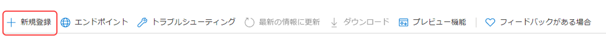

# 電子メール通知の設定{#configuring-email-notification}

AEM は、次のようなユーザーに電子メール通知を送信します。

* 変更やレプリケーションなど、ページイベントを購読したことがある。[通知インボックス](/help/sites-classic-ui-authoring/author-env-inbox.md#subscribing-to-notifications)では、このようなイベントを購読する方法について説明します。

* フォーラムイベントを購読したことがある
* ワークフローで手順を実行する必要がある。[参加者ステップ](/help/sites-developing/workflows-step-ref.md#participant-step)では、ワークフローで電子メール通知を実行する方法について説明します。

前提条件：

* ユーザーのプロファイルで有効な電子メールアドレスが定義されている必要があります。
* **Day CQ Mail Service**&#x200B;を正しく設定する必要があります。

ユーザーへの通知は、各自がプロファイルで定義している言語の電子メールで送信されます。言語ごとに、独自のカスタマイズ可能なテンプレートがあります。新しい言語用には新しい電子メールテンプレートを追加できます。

>[!NOTE]
>
>AEM を操作しているときは、このようなサービスの設定を管理する方法がいくつかあります。詳細および推奨事項については、[OSGi の設定](/help/sites-deploying/configuring-osgi.md)を参照してください。

## メールサービスの設定 {#configuring-the-mail-service}

AEM で電子メールを送信できるようにするために、**Day CQ Mail Service** を適切に設定する必要があります。設定は、Web コンソールで表示できます。AEM を操作しているときは、このようなサービスの設定を管理する方法がいくつかあります。詳細および推奨事項については、[OSGi の設定](/help/sites-deploying/configuring-osgi.md)を参照してください。

以下の制約が適用されます。

* **SMTP サーバーポート**&#x200B;は 25 以上にする必要があります。

* **SMTPサーバーのホスト名**&#x200B;は空白にできません。
* **「送信元」アドレス**&#x200B;は空白にしてはなりません。

**Day CQ Mail Service** の問題をデバッグしやすくするために、サービスのログを監視できます。

`com.day.cq.mailer.DefaultMailService`

設定は、Web コンソールに次のように表示されます。


## 電子メール通知チャネルの設定 {#configuring-the-email-notification-channel}

ページまたはフォーラムのイベント通知を購読するとき、送信元の電子メールアドレスは、デフォルトで `no-reply@acme.com` に設定されます。この値は、Web コンソールで **Notification Email Channel** サービスを設定することで変更できます。

差出人の電子メールアドレスを設定するには、リポジトリに`sling:OsgiConfig`ノードを追加します。 次の手順を実行し、ノードを直接CRXDE Liteします。

1. CRXDE Lite で、`config` という名前のノードを、アプリケーションフォルダーの下に追加します。
1. configフォルダーに、次の名前のノードを追加します。

   `com.day.cq.wcm.notification.email.impl.EmailChannel`リソースのタイプは次のとおりとします。`sling:OsgiConfig`

1. `String`プロパティを`email.from`という名前のノードに追加します。 値には、使用する電子メールアドレスを指定します。

1. 「**すべて保存**」をクリックします。

次の手順を使用して、コンテンツパッケージソースフォルダーでノードを定義します。

1. `jcr_root/apps/*app_name*/config folder`に、`com.day.cq.wcm.notification.email.impl.EmailChannel.xml`という名前のファイルを作成します。

1. このノードを表現する次の XML を追加します。

   `<?xml version="1.0" encoding="UTF-8"?> <jcr:root xmlns:sling="https://sling.apache.org/jcr/sling/1.0" xmlns:jcr="https://www.jcp.org/jcr/1.0" jcr:primaryType="sling:OsgiConfig" email.from="name@server.com"/>`
1. `email.from` 属性の値（`name@server.com`）を、実際の電子メールアドレスに置き換えます。

1.  ファイルを保存します。

## ワークフロー電子メール通知サービスの設定 {#configuring-the-workflow-email-notification-service}

ワークフロー電子メール通知を受信したとき、送信元電子メールアドレスとホスト URL プレフィックスはいずれもデフォルトに設定されています。これらの値は、Web コンソールで **Day CQ Workflow Email Notification Service** を設定することによって変更できます。その場合は、変更をリポジトリに保持することをお勧めします。

デフォルト設定は、Web コンソールに次のように表示されます。


### ページ通知用の電子メールテンプレート {#email-templates-for-page-notification}

ページ通知用の電子メールテンプレートは次の場所にあります。

`/libs/settings/notification-templates/com.day.cq.wcm.core.page`

デフォルトの英語のテンプレート（`en.txt`）は次のように定義されています。

```xml
subject=[CQ Page Event Notification]: Page Event

header=-------------------------------------------------------------------------------------\n \
Time: ${time}\n \
User: ${userFullName} (${userId})\n \
-------------------------------------------------------------------------------------\n\n

message=The following pages were affected by the event: \n \
 \n \
${modifications} \n \
 \n\n
footer=\n \
-------------------------------------------------------------------------------------\n \
This is an automatically generated message. Please do not reply.
```

#### ページ通知用の電子メールテンプレートのカスタマイズ {#customizing-email-templates-for-page-notification}

ページ通知用の英語の電子メールテンプレートをカスタマイズするには：

1. CRXDEで、次のファイルを開きます。

   `/libs/settings/notification-templates/com.day.cq.wcm.core.page/en.txt`

1. ニーズに合わせてファイルを変更します。
1. 変更内容を保存します。

テンプレートには以下の書式が必要です。

```
 subject=<text_1>
 header=<text_2>
 message=<text_3>
 footer=<text_4>
```

&lt;text_x> には、静的テキストと動的文字列変数を混在させることができます。ページ通知用の電子メールテンプレート内では次の変数を使用できます。

* `${time}`、イベントの日時。

* `${userFullName}`：イベントをトリガーしたユーザーの完全名。

* `${userId}`：イベントをトリガーしたユーザーのID。
* `${modifications}`は、ページイベントのタイプとページパスを次の形式で表します。

   &lt;page event=&quot;&quot; type=&quot;&quot;> =>  &lt;page path=&quot;&quot;>

   例えば、次の操作が可能です。

   PageModified => /content/geometrixx/en/products

### フォーラム通知用の電子メールテンプレート {#email-templates-for-forum-notification}

フォーラム通知用の電子メールテンプレートは次の場所にあります。

`/etc/notification/email/default/com.day.cq.collab.forum`

デフォルトの英語のテンプレート（`en.txt`）は次のように定義されています。

```xml
subject=[CQ Forum Notification]

header=-------------------------------------------------------------------------------------\n \
Time: Time: ${time}\n \
Forum Page Path: ${forum.path}\n \
-------------------------------------------------------------------------------------\n\n

message=Page: ${host.prefix}${forum.path}.html\n

footer=\n \
-------------------------------------------------------------------------------------\n \
This is an automatically generated message. Please do not reply.
```

#### フォーラム通知用の電子メールテンプレートのカスタマイズ {#customizing-email-templates-for-forum-notification}

フォーラム通知用の英語の電子メールテンプレートをカスタマイズするには：

1. CRXDEで、次のファイルを開きます。

   `/etc/notification/email/default/com.day.cq.collab.forum/en.txt`

1. ニーズに合わせてファイルを変更します。
1. 変更内容を保存します。

テンプレートには以下の書式が必要です。

```
 subject=<text_1>
 header=<text_2>
 message=<text_3>
 footer=<text_4>
```

`<text_x>`は、静的テキストと動的文字列変数を組み合わせた値にすることができます。

フォーラム通知用の電子メールテンプレート内では次の変数を使用できます。

* `${time}`、イベントの日時。

* `${forum.path}`：フォーラムページへのパス。

### ワークフロー通知用の電子メールテンプレート {#email-templates-for-workflow-notification}

ワークフロー通知用の電子メールテンプレート（英語）は次の場所にあります。

`/libs/settings/workflow/notification/email/default/en.txt`

次のように定義されています。

```xml
subject=Workflow notification: ${event.EventType}

header=-------------------------------------------------------------------------------------\n \
Time: ${event.TimeStamp}\n \
Step: ${item.node.title}\n \
User: ${participant.name} (${participant.id})\n \
Workflow: ${model.title}\n \
-------------------------------------------------------------------------------------\n\n

message=Content: ${host.prefix}${payload.path.open}\n

footer=\n \
-------------------------------------------------------------------------------------\n \
View the overview in your ${host.prefix}/aem/inbox\n \
-------------------------------------------------------------------------------------\n \
This is an automatically generated message. Please do not reply.
```

#### ワークフロー通知用の電子メールテンプレートのカスタマイズ {#customizing-email-templates-for-workflow-notification}

ワークフローイベント通知用の英語の電子メールテンプレートをカスタマイズするには：

1. CRXDEで、次のファイルを開きます。

   `/libs/settings/workflow/notification/email/default/en.txt`

1. ニーズに合わせてファイルを変更します。
1. 変更内容を保存します。

テンプレートには以下の書式が必要です。

```
subject=<text_1>
 header=<text_2>
 message=<text_3>
 footer=<text_4>
```

>[!NOTE]
>
>`<text_x>`は、静的テキストと動的文字列変数を組み合わせた値にすることができます。 `<text_x>`項目の各行は、最後のインスタンスを除き、バックスラッシュ(`\`)で終わる必要があります。バックスラッシュがない場合、`<text_x>`文字列変数の終わりを示します。
>
>テンプレート形式について詳しくは、[Properties.load() メソッドの javadocs](https://docs.oracle.com/javase/8/docs/api/java/util/Properties.html#load-java.io.InputStream-) を参照してください。

メソッド`${payload.path.open}`は、作業項目のペイロードへのパスを表示します。 例えば、Sitesのページの場合、`payload.path.open`は`/bin/wcmcommand?cmd=open&path=…`に似ています。;これはサーバー名が付いていないので、テンプレートでは`${host.prefix}`が先頭に追加されます。

電子メールテンプレート内では以下の変数を使用できます。

* `${event.EventType}`、イベントのタイプ
* `${event.TimeStamp}`、イベントの日時
* `${event.User}`：イベントをトリガーしたユーザー
* `${initiator.home}`、イニシエータノードパス

* `${initiator.name}`、イニシエータ名

* `${initiator.email}`（イニシエーターのEメールアドレス）
* `${item.id}`（作業項目のID）
* `${item.node.id}`（この作業項目に関連付けられたワークフローモデル内のノードのid）
* `${item.node.title}`（作業項目のタイトル）
* `${participant.email}`（参加者の電子メールアドレス）
* `${participant.name}`、参加者の名前
* `${participant.familyName}`（参加者の姓）
* `${participant.id}`、参加者のid
* `${participant.language}`、参加者の言語
* `${instance.id}`、ワークフローID
* `${instance.state}`（ワークフローの状態）
* `${model.title}`（ワークフローモデルのタイトル）
* `${model.id}`（ワークフローモデルのid）

* `${model.version}`（ワークフローモデルのバージョン）
* `${payload.data}`、ペイロード

* `${payload.type}`、ペイロードタイプ
* `${payload.path}`（ペイロードのパス）
* `${host.prefix}`、ホストプレフィックス。例：http://localhost:4502

### 新しい言語用の電子メールテンプレートの追加 {#adding-an-email-template-for-a-new-language}

新しい言語用のテンプレートを追加するには：

1. CRXDEで、以下に`<language-code>.txt`ファイルを追加します。

   * `/libs/settings/notification-templates/com.day.cq.wcm.core.page` :（ページ通知の場合）
   * `/etc/notification/email/default/com.day.cq.collab.forum` :フォーラム通知
   * `/libs/settings/workflow/notification/email/default` :ワークフロー通知の場合

1. 言語に合わせてファイルを調整します。
1. 変更内容を保存します。

>[!NOTE]
>
>電子メールテンプレートのファイル名として使用される`<language-code>`は、AEMで認識される2文字の小文字の言語コードにする必要があります。 言語コードについては、AEM は ISO-639-1 に依存しています。

## AEM Assets の電子メール通知の設定 {#assetsconfig}

AEM Assets のコレクションが共有されている場合も共有されていない場合も、AEM から電子メール通知を受信できます。電子メール通知を設定するには、次の手順に従います。

1. [メールサービスの設定](/help/sites-administering/notification.md#configuring-the-mail-service)で説明したように、電子メールサービスを設定します。
1. AEM に管理者としてログインします。**ツール**／**操作**／**Web コンソール**&#x200B;をクリックして、Web コンソール設定を開きます。
1. **Day CQ DAM Resource Collection Servlet** を編集します。「**send email**」を選択します。「**保存**」をクリックします。

## OAuthの設定 {#setting-up-oauth}

AEMは、組織が安全な電子メール要件に準拠できるように、OAuth2の統合メーラーサービスをサポートしています。

以下に示すように、複数のEメールプロバイダーに対してOAuthを設定できます。

### Gmail {#gmail}

1. `https://console.developers.google.com/projectcreate`にプロジェクトを作成します。
1. プロジェクトを選択し、**APIとサービス** - **ダッシュボード — 資格情報**&#x200B;に移動します。
1. 必要に応じてOAuth同意画面を設定する
1. 次の[更新]画面で、次の2つのスコープを追加します。
   * `https://mail.google.com/`
   * `https://www.googleapis.com//auth/gmail.send`
1. スコープを追加したら、左側のメニューの「**資格情報**」に戻り、「**資格情報を作成** - **OAuthクライアントID** - **デスクトップアプリ**」に戻ります。
1. 新しいウィンドウが開き、クライアントIDとクライアント秘密鍵が表示されます。
1. これらの資格情報を保存します。

**AEM側の設定**

>[!NOTE]
>
>Adobe管理サービスのお客様は、カスタマーサービスエンジニアと協力して、これらの変更を実稼動環境に加えることができます。

最初に、メールサービスを設定します。

1. `http://serveraddress:serverport/system/console/configMgr`に移動して、AEM Webコンソールを開きます。
1. を探して、「**Day CQ Mail Service**」をクリックします。
1. 次の設定を追加します。
   * SMTP サーバーのホスト名: `smtp.gmail.com`
   * SMTPサーバーポート：`25`または`587`（要件に応じて）
   * **SMPTでStarTLS**&#x200B;を使用し、**SMTPでStarTLS**&#x200B;が必要になるかどうかを確認します。
   * **OAuth flow**&#x200B;を確認し、「**保存**」をクリックします。

次に、以下の手順に従って、SMTP OAuthプロバイダーを設定します。

1. `http://serveraddress:serverport/system/console/configMgr`に移動して、AEM Webコンソールを開きます。
1. を探して、**CQ Mailer SMTP OAuth2 Provider**&#x200B;をクリックします。
1. 必要な情報を次のように入力します。
   * 認証URL:`https://accounts.google.com/o/oauth2/auth`
   * トークンURL:`https://accounts.google.com/o/oauth2/token`
   * スコープ：`https://www.googleapis.com/auth/gmail.send`と`https://mail.google.com/`が表示されます。 設定済みの各スコープの右側にある&#x200B;**+**&#x200B;ボタンを押すと、複数のスコープを追加できます。
   * クライアントIDとクライアント秘密鍵：上記の段落で説明したように取得した値を使用して、これらのフィールドを設定します。
   * 更新トークン URL: `https://accounts.google.com/o/oauth2/token`
   * 更新トークンの有効期限：never
1. 「**保存**」をクリックします。

<!-- clarify refresh token expiry, currrently not present in the UI -->

設定が完了すると、設定は次のようになります。


次に、OAuthコンポーネントをアクティブ化します。 手順は次のとおりです。

1. 次のURLにアクセスして、コンポーネントコンソールに移動します。`http://serveraddress:serverport/system/console/components`
1. 次のコンポーネントを探します。
   * `com.day.cq.mailer.oauth.servlets.handler.OAuthCodeGenerateServlet`
   * `com.day.cq.mailer.oauth.servlets.handler.OAuthCodeAccessTokenGenerator`
1. コンポーネントの左側にある再生アイコンを押します。

   

最後に、次の手順で設定を確認します。

1. パブリッシュインスタンスのアドレスに移動し、管理者としてログインします。
1. ブラウザーで新しいタブを開き、`http://serveraddress:serverport/services/mailer/oauth2/authorize`に移動します。 これにより、SMTPプロバイダー（この場合はGmail）のページにリダイレクトされます。
1. ログインと、必要な権限の付与に対する同意
1. 同意した後、トークンはリポジトリに保存されます。 `accessToken`の下でこのURLに直接アクセスするには、パブリッシュインスタンスで次のURLに直接アクセスします。`http://serveraddress:serverport/crx/de/index.jsp#/conf/global/settings/mailer/oauth2 `
1. パブリッシュインスタンスごとに上記を繰り返します。

<!-- clarify if the ip/server address in the last procedure is that of the publish instance -->

### Microsoft Outlook {#microsoft-outlook}

1. [https://portal.azure.com/](https://portal.azure.com/)に移動し、ログインします。
1. 検索バーで&#x200B;**Azure Active Directory**&#x200B;を検索し、結果をクリックします。 または、[https://portal.azure.com/#blade/Microsoft_AAD_IAM/ActiveDirectoryMenuBlade/Overview](https://portal.azure.com/#blade/Microsoft_AAD_IAM/ActiveDirectoryMenuBlade/Overview)を直接参照することもできます。
1. **アプリの登録** - **新しい登録**&#x200B;をクリックします。

   

1. 必要に応じて情報を入力し、**登録**&#x200B;をクリックします。
1. 新しく作成されたアプリに移動し、**API権限**&#x200B;を選択します。
1. **権限**&#x200B;を追加 — **グラフ権限** - **委任権限**&#x200B;に移動します。
1. アプリに対して以下の権限を選択し、「**権限を追加**」をクリックします。
   * `SMTP.Send`
   * `Mail.Read`
   * `Mail.Send`
   * `openid`
   * `offline_access`
1. **認証** - **プラットフォーム** - **Web**&#x200B;を追加し、「**リダイレクトURL**」セクションに次のURLを追加してOAuthコードをリダイレクトし、**設定**&#x200B;を押します。
   * `http://localhost:4503/services/mailer/oauth2/token`
1. パブリッシュインスタンスごとに上記を繰り返します。
1. 要件に従って設定を指定します
1. 次に、「**証明書とシークレット**」に移動し、「**新しいクライアントシークレット**」をクリックし、画面の手順に従ってシークレットを作成します。 後で使用するために、必ずこの秘密を書き留めてください
1. 左側のウィンドウで&#x200B;**Overview**&#x200B;を押し、後で使用するために、**Application (client) ID**&#x200B;および&#x200B;**Directory (tenant) ID**&#x200B;の値をコピーします。

要約すると、AEM側でMailerサービスのOAuth2を設定するには、次の情報が必要です。

* 認証URL。テナントIDを使用して構築されます。 次の形式になります。`https://login.microsoftonline.com/<tenantID>/oauth2/v2.0/authorize`
* トークンURL。テナントIDを使用して構築されます。 次の形式になります。`https://login.microsoftonline.com/<tenantID>/oauth2/v2.0/token`
* 更新URL。テナントIDを使用して構築されます。 次の形式になります。`https://login.microsoftonline.com/<tenantID>/oauth2/v2.0/token`
* クライアントID
* クライアント秘密鍵

**AEM側の設定**

次に、OAuth2設定をAEMと統合します。

1. `http://serveraddress:serverport/system/console/configMgr`を参照して、ローカルインスタンスのWebコンソールに移動します。
1. **Day CQ Mail Service**&#x200B;を探してクリックします。
1. 次の設定を追加します。
   * SMTP サーバーのホスト名: `smtp.office365.com`
   * SMTPユーザー：電子メール形式のユーザー名
   * &quot;差出人&quot;アドレス：メーラーから送信されるメッセージの「差出人：」フィールドで使用する電子メールアドレス
   * SMTPサーバーポート：要件に応じて`25`または`587`
   * **SMPTでStarTLS**&#x200B;を使用し、**SMTPでStarTLS**&#x200B;が必要になるかどうかを確認します。
   * **OAuth flow**&#x200B;を確認し、「**保存**」をクリックします。
1. を探して、**CQ Mailer SMTP OAuth2 Provider**&#x200B;をクリックします。
1. 必要な情報を次のように入力します。
   * [この手順の最後](#microsoft-outlook)で説明したように、認証URL、トークンURL、更新トークンURLを作成して入力します。
   * クライアントIDとクライアント秘密鍵：これらのフィールドに、前述のように取得した値を設定します。
   * 次のスコープを構成に追加します。
      * openid
      * offline_access
      * `https://outlook.office365.com/Mail.Send`
      * `https://outlook.office365.com/Mail.Read`
      * `https://outlook.office365.com/SMTP.Send`
   * AuthCodeリダイレクトUrl:`http://localhost:4503/services/mailer/oauth2/token`
   * 更新トークンURL:これは、上記のトークンURLと同じ値にする必要があります
1. 「**保存**」をクリックします。

設定が完了すると、設定は次のようになります。


次に、OAuthコンポーネントをアクティブ化します。 手順は次のとおりです。

1. 次のURLにアクセスして、コンポーネントコンソールに移動します。`http://serveraddress:serverport/system/console/components`
1. 次のコンポーネントを探します。
   * `com.day.cq.mailer.oauth.servlets.handler.OAuthCodeGenerateServlet`
   * `com.day.cq.mailer.oauth.servlets.handler.OAuthCodeAccessTokenGenerator`
1. コンポーネントの左側にある再生アイコンを押します。


最後に、次の手順で設定を確認します。

1. パブリッシュインスタンスのアドレスに移動し、管理者としてログインします。
1. ブラウザーで新しいタブを開き、`http://serveraddress:serverport/services/mailer/oauth2/authorize`に移動します。 これにより、SMTPプロバイダー（この場合はGmail）のページにリダイレクトされます。
1. ログインと、必要な権限の付与に対する同意
1. 同意した後、トークンはリポジトリに保存されます。 `accessToken`の下でこのURLに直接アクセスするには、パブリッシュインスタンスで次のURLに直接アクセスします。`http://serveraddress:serverport/crx/de/index.jsp#/conf/global/settings/mailer/oauth2 `