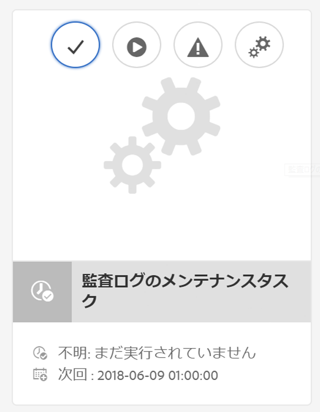

# AEM 6 での監査ログのメンテナンス{#audit-log-maintenance-in-aem}

監査ログの対象となる AEM イベントが発生すると、多くのアーカイブデータが生成されます。このデータは、レプリケーション、アセットのアップロード、およびその他のシステムアクティビティによって、短期間で増大する可能性があります。

「監査ログのメンテナンス」に用意されているいくつかの機能要素を使用すると、特定のポリシー条件に基づいて監査ログのメンテナンスを自動化できます。

設定可能な週別メンテナンスタスクとして実装し、操作ダッシュボード監視コンソールからアクセスできます。

詳しくは、[操作ダッシュボードのドキュメント](/help/sites-administering/operations-dashboard.md)を参照してください。

監査ログのパージオプションには 3 つのタイプがあります。

1. [ページ監査ログのパージの設定](/help/sites-administering/operations-audit-log.md#configure-page-audit-log-purging)
1. [DAM 監査ログのパージの設定](/help/sites-administering/operations-audit-log.md#configure-dam-audit-log-purging)
1. [レプリケーション監査ログのパージの設定](/help/sites-administering/operations-audit-log.md#configure-replication-audit-log-purging)

それぞれ AEM Web コンソールでルールを作成して設定できます。設定後、**ツール／操作／メンテナンス／週別メンテナンスウィンドウ**&#x200B;に移動して、**監査ログのメンテナンスタスク**&#x200B;でそれらを実行することができます。

## ページ監査ログのパージの設定 {#configure-page-audit-log-purging}

監査ログのパージを設定するには、次の手順に従います。

1. Go to the Web Console Admin by pointing your browser to `http://localhost:4502/system/console/configMgr/`

1. Search for an item called **Pages audit Log Purge rule** and click it.

   

1. 次に、要件に従ってパージスケジューラーを設定します。使用できるオプションは以下のとおりです。

   * **Rule name：**&#x200B;監査ポリシールールの名前。
   * **Content path：**&#x200B;ルールが適用されるコンテンツのパス。
   * **Minimum age：**&#x200B;監査ログを保持しておく必要がある日数。
   * **Audit log type：**&#x200B;パージする必要がある監査ログのタイプ。

   >[!NOTE]
   >
   >The content path only applies to children of the `/var/audit/com.day.cq.wcm.core.page` node in the repository.

1. ルールを保存します。
1. 作成したルールを実行するためには、操作ダッシュボードに公開する必要があります。そのためには、AEM のようこそ画面から&#x200B;**ツール／操作／メンテナンス**&#x200B;に移動します。

1. **週別メンテナンスウィンドウ**&#x200B;カードをクリックします。

1. You will find the maintenance task already present under the **AuditLog Maintenance Task** card.

   

1. 次回実行の日付を調べて設定するか、再生ボタンをクリックして手動で実行できます。

AEM 6.3では、監査ログの削除タスクが完了する前にスケジュールされたメンテナンスウィンドウが閉じると、タスクが自動的に停止します。 次回のメンテナンスウィンドウを開くと、タスクは再開されます。

**AEM 6.5では**、「停止 **** 」アイコンをクリックして、実行中の監査ログの削除タスクを手動で停止できます。 次回の実行時に、タスクは安全に再開されます。

>[!NOTE]
>
>メンテナンスタスクを停止すると、タスクの実行は休止されますが、既に進行しているジョブの監視が途切れることはありません。

## DAM 監査ログのパージの設定 {#configure-dam-audit-log-purging}

1. Navigate to the System Console at *https://&lt;serveraddress>:&lt;serverport>/system/console/configMgr*
1. **DAM 監査ログのパージ** ルールを探して結果をクリックします。
1. それに従って、次のウィンドウでルールを設定します。オプションは以下のとおりです。

   * **Rule name：**&#x200B;監査ポリシールールの名前。
   * **Content path：**&#x200B;ルールが適用されるコンテンツのパス。
   * **Minimum age：**&#x200B;監査ログを保持しておく必要がある日数。
   * **Audit Log Dam event types：** パージする必要がある DAM 監査イベントの種類。

1. 「**保存**」をクリックして設定を保存します。

## レプリケーション監査ログのパージの設定  {#configure-replication-audit-log-purging}

1. Navigate to the System Console at *https://&lt;serveraddress>:&lt;serverport>/system/console/configMgr*
1. **レプリケーション監査ログのパージスケジューラー** を探して結果をクリックします。
1. それに従って、次のウィンドウでルールを設定します。オプションは以下のとおりです。

   * **Rule name：**&#x200B;監査ポリシールールの名前。
   * **Content path：**&#x200B;ルールが適用されるコンテンツのパス。
   * **Minimum age：**&#x200B;監査ログを保持しておく必要がある日数。
   * **Audit log Replication event types：**&#x200B;パージする必要があるレプリケーション監査イベントのタイプ。

1. 「**保存**」をクリックして設定を保存します。

