# 操作ダッシュボード {#operations-dashboard}

## 概要 {#introduction}

AEM 6 の操作ダッシュボードは、システムオペレーターが AEM のシステムヘルスを一目で監視するために役立ちます。また、AEMの関連性に関する自動生成された診断情報も提供し、自己完結型のメンテナンス自動化を設定および実行して、プロジェクトの運用やサポートケースを大幅に削減できます。 操作ダッシュボードは、カスタムのヘルスチェックおよびメンテナンスタスクによって拡張できます。さらに、外部監視ツールから JMX を使用して操作ダッシュボードのデータにアクセスできます。

**操作ダッシュボードの特徴は次のとおりです。**

* ワンクリックのシステムステータスで、運営部門の効率向上に役立ちます。
* システムヘルスの概要を、1 つの場所で一元的に提供します。
* 問題の発見、分析および修正にかかる時間を短縮します。
* 自己完結型のメンテナンス自動化により、プロジェクトの運用コストを大幅に削減します。

It can be accessed by going to **Tools** - **Operations** from the AEM Welcome screen.

>[!NOTE]
>
>操作ダッシュボードにアクセスするには、「オペレーター」ユーザーグループの一員としてログインする必要があります。詳しくは、[ユーザー、グループおよびアクセス権限の管理](/help/sites-administering/user-group-ac-admin.md)に関するドキュメントを参照してください。

## ヘルスレポート {#health-reports}

ヘルスレポートシステムは、Sling ヘルスチェックを使用して AEM インスタンスのヘルスに関する情報を提供します。これには、OSGI、JMX、HTTP のいずれかの要求（JSON 経由）またはタッチ UI を使用します。設定可能なカウンターの測定値やしきい値を提供し、場合によっては、問題の解決方法に関する情報も提供します。

以下で説明するような、様々な機能があります。

## ヘルスチェック {#health-checks}

**ヘルスレポート**&#x200B;は、特定の製品領域に関するヘルスの良好または不良を示すカードのシステムです。これらのカードは、Sling ヘルスチェックのビジュアライゼーションで、JMX および他のソースからデータを集計し、処理した情報を MBean として再公開します。これらの MBean は、**org.apache.sling.healthcheck** ドメイン以下にある [JMX Web コンソール](/help/sites-administering/jmx-console.md)で検査できます。

The Health Reports interface can be accessed through the **Tools** - **Operations** - **Health Reports** menu on the AEM Welcome screen, or directly through the following URL:

`https://<serveraddress>:port/libs/granite/operations/content/healthreports/healthreportlist.html`

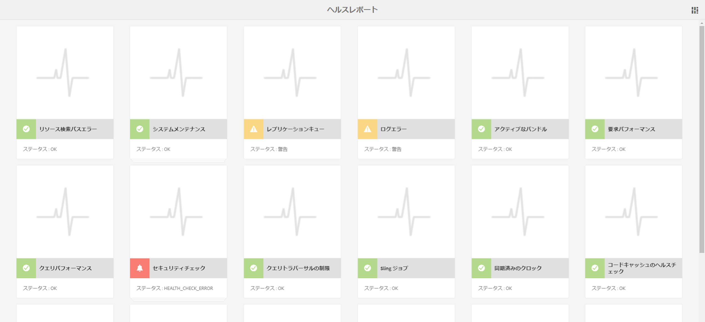

カードシステムが表示する状態は、**OK**、**警告**&#x200B;および&#x200B;**重要**&#x200B;の 3 つです。この状態は、ルールおよびしきい値の結果です。ルールおよびしきい値は、カードの上にマウスポインターを置いてアクションバーのギアアイコンをクリックすることで設定できます。

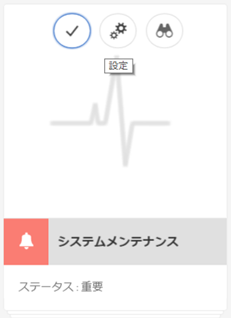

### ヘルスチェックの種類 {#health-check-types}

AEM 6 には次の 2 種類のヘルスチェックがあります。

1. 個別ヘルスチェック
1. 複合ヘルスチェック

**個別ヘルスチェック**&#x200B;は、状態カードに対応する単一のヘルスチェックです。個別ヘルスチェックは、ルールまたはしきい値で設定でき、特定されたヘルスの問題を解決するための 1 つ以上のヒントおよびリンクを提供できます。「ログエラー」チェックを例に説明します。インスタンスログにエラーエントリがある場合、ヘルスチェックの詳細ページに表示されます。ページ上部の「診断ツール」セクションに、「ログメッセージ」アナライザーがあります。これにより、これらのエラーをより詳細に分析してロガーを再設定できます。

**複合ヘルスチェック**&#x200B;は、複数の個別チェックから情報を集約するチェックです。

複合ヘルスチェックは、**フィルタータグ**&#x200B;を使用して設定します。基本的に、同じフィルタータグを持つ単一チェックはすべて、複合ヘルスチェックとしてグループ化されます。複合ヘルスチェックは、集約した単一チェックのステータスがすべて OK である場合にのみ OK ステータスとなります。

### ヘルスチェックを作成する方法 {#how-to-create-health-checks}

操作ダッシュボードで、個別および複合ヘルスチェックの両方の結果を視覚化できます。

### 個別ヘルスチェックの作成 {#creating-an-individual-health-check}

個別ヘルスチェックは、2 段階の手順で作成します。Sling ヘルスチェックを実装し、ヘルスチェックのエントリをダッシュボードの設定ノードに追加します。

1. Sling ヘルスチェックを作成するには、Sling ヘルスチェックインターフェイスを実装する OSGI コンポーネントを作成する必要があります。このコンポーネントをバンドル内に追加します。コンポーネントのプロパティにより、ヘルスチェックが完全に特定されます。コンポーネントがインストールされると、ヘルスチェック用の JMX MBean が自動的に作成されます。詳しくは、[Sling ヘルスチェックドキュメント](https://sling.apache.org/documentation/bundles/sling-health-check-tool.html)を参照してください。

    OSGI サービスコンポーネントの注釈を含む、Sling ヘルスチェックコンポーネントの例：

   ```java
   @Component(service = HealthCheck.class,
   property = {
       HealthCheck.NAME + "=Example Check",
       HealthCheck.TAGS + "=example",
       HealthCheck.TAGS + "=test",
       HealthCheck.MBEAN_NAME + "=exampleHealthCheckMBean"
   })
    public class ExampleHealthCheck implements HealthCheck {
       @Override
       public Result execute() {
           // health check code
       }
    }
   ```

   >[!NOTE]
   >
   >`MBEAN_NAME` プロパティは、このヘルスチェック用に生成される Mbean の名前を定義します。

1. ヘルスチェックの作成後、操作ダッシュボードインターフェイスでアクセスできるようにするために、新しい設定ノードを作成する必要があります。この手順では、ヘルスチェックの JMX MBean 名を知っておく必要があります（`MBEAN_NAME` プロパティ）。To create a configuration for the Health Check, open CRXDE and add a new node (of type **nt:unstructured**) under the following path: `/apps/settings/granite/operations/hc`

   新しいノードに次のプロパティを設定する必要があります。

   * **名前:** `sling:resourceType`

      * **型:** `String`
      * **値:** `granite/operations/components/mbean`
   * **名前:** `resource`

      * **型:** `String`
      * **値:** `/system/sling/monitoring/mbeans/org/apache/sling/healthcheck/HealthCheck/exampleHealthCheck`

   >[!NOTE]
   >
   >The resource path above is created as follows: if the mbean name of your Health Check is &quot;test&quot;, add &quot;test&quot; to the end of the path `/system/sling/monitoring/mbeans/org/apache/sling/healthcheck/HealthCheck`
   >
   >最終的なパスは次のようになります。
   >
   >`/system/sling/monitoring/mbeans/org/apache/sling/healthcheck/HealthCheck/test`

   >[!NOTE]
   >
   >Make sure that the `/apps/settings/granite/operations/hc` path has the following properties set to true:
   >
   >
   >`sling:configCollectionInherit`
   >
   >`sling:configPropertyInherit`
   >
   >
   >This will tell the configuration manager to merge the new configurations with the existing ones from `/libs`.

### 複合ヘルスチェックの作成 {#creating-a-composite-health-check}

複合ヘルスチェックの役割は、一般的な機能のセットを共有する個別ヘルスチェックの数を集計することです。例えば、セキュリティ複合ヘルスチェックは、セキュリティ関連の検証を実行するすべての個別ヘルスチェックをグループ化します。複合チェックを作成するには、まず、新しい OSGI 設定を追加します。操作ダッシュボードに表示するために、シンプルなチェックでおこなったのと同じように、新しい設定ノードを追加する必要があります。

1. Go to the Web Configuration Manager in the OSGI Console. You can do this by accessing `https://serveraddress:port/system/console/configMgr`
1. **Apache Sling Composite Health Check** というエントリを検索します。見つかったら、システムチェック用とセキュリティチェック用の 2 つの設定が既に使用可能なことを確認します。
1. 設定の右側にある「+」ボタンを押して新しい設定を作成します。以下のような新しいウィンドウが表示されます。

   

1. 設定を作成し、保存します。新しい設定で MBean が作成されます。

   各設定プロパティの目的は次のとおりです。

   * **Name（hc.name）：**&#x200B;複合ヘルスチェックの名前。意味のある名前を推奨します。
   * **Tags（hc.tags）：**&#x200B;このヘルスチェックのタグ。この複合ヘルスチェックを別の複合ヘルスチェックの一部とする場合（ヘルスチェックの階層内など）は、この複合が関連付けられているタグを追加します。
   * **MBean Name（hc.mbean.name）：**&#x200B;この複合ヘルスチェックの JMX MBean に付けられる Mbean の名前。
   * **Filter Tags（filter.tags）：**&#x200B;これは複合ヘルスチェック専用のプロパティです。複合が集約するタグを指定します。複合ヘルスチェックは、そのグループの下に、この複合のいずれかのフィルタータグに一致するタグを持つすべてのヘルスチェックを集約します。例えば、**test** および **check** というフィルタータグを持つ複合ヘルスチェックは、タグプロパティ（**）に** test **タグと** check`hc.tags` タグのいずれかが含まれているすべての個別および複合ヘルスチェックを集約します。

   >[!NOTE]
   >
   >Apache Sling 複合ヘルスチェックの新しい設定ごとに、新しい JMX Mbean が 1 つずつ作成されます。**

1. Finally, the entry of the composite health check that has just been created needs to be added in the Operations Dashboard configuration nodes. The procedure for this is the same as with individual health checks: a node of type **nt:unstructured** needs to be created under `/apps/settings/granite/operations/hc`. The resource property of the node will be defined by the value of **hc.mean.name** in the OSGI configuration.

   例えば、設定を作成して **hc.mbean.name** 値を **diskusage** に設定した場合、設定ノードは次のようになります。

   * **名前:** `Composite Health Check`

      * **型:** `nt:unstructured`

   次のようにプロパティを定義します。

   * **名前:** `sling:resourceType`

      * **型:** `String`
      * **値:** `granite/operations/components/mbean`
   * **名前:** `resource`

      * **型:** `String`
      * **値:** `/system/sling/monitoring/mbeans/org/apache/sling/healthcheck/HealthCheck/diskusage`

   >[!NOTE]
   >
   >既にデフォルトでダッシュボードに存在する複合チェックに論理的に属する個別ヘルスチェックを作成する場合、ヘルスチェックは自動的にキャプチャされ、各複合チェックの下にグループ化されます。このため、これらのチェック用に新しい設定ノードを作成する必要はありません。
   >
   >例えば、個別セキュリティヘルスチェックを作成する場合は、「**security**」タグを割り当ててインストールするだけで、操作ダッシュボードのセキュリティチェック複合チェックの下にヘルスチェックが自動的に表示されます。

### AEM で提供されているヘルスチェック {#health-checks-provided-with-aem}

<table>
 <tbody>
  <tr>
   <td><strong>ヘルスチェック名</strong></td>
   <td><strong>説明</strong></td>
  </tr>
  <tr>
   <td>クエリパフォーマンス</td>
   <td><p>このヘルスチェックは <strong>AEM 6.4</strong> で簡素化され、最近リファクタリングされた <code>Oak QueryStats</code> MBean（具体的には <code>SlowQueries </code> 属性）をチェックするようになりました。処理に時間のかかるクエリが統計に含まれる場合、ヘルスチェックは警告を返します。それ以外の場合は、OK ステータスを返します。<br /> </p> <p>The MBean for this health check is <a href="http://localhost:4502/system/console/jmx/org.apache.sling.healthcheck%3Aname%3DqueriesStatus%2Ctype%3DHealthCheck">org.apache.sling.healthcheck:name=queriesStatus,type=HealthCheck</a>.</p> </td>
  </tr>
  <tr>
   <td>監視キューの長さ</td>
   <td><p>Observation Queue Length iterates over all Event Listeners and Background Observers, compares their <code>queueSize </code>to their <code>maxQueueSize</code> and:</p>
    <ul>
     <li>returns Critical status if the <code>queueSize</code> value exceeds the <code>maxQueueSize</code> value (that is when events would be dropped)</li>
     <li>returns Warn if the <code>queueSize</code> value is over the <code>maxQueueSize * WARN_THRESHOLD</code> (the default value is 0.75) </li>
    </ul> <p>各キューの最大長は個別の設定（Oak と AEM）から取得され、このヘルスチェックからは設定できません。The MBean for this health check is <a href="http://localhost:4502/system/console/jmx/org.apache.sling.healthcheck%3Aname%3DObservationQueueLengthHealthCheck%2Ctype%3DHealthCheck">org.apache.sling.healthcheck:name=ObservationQueueLengthHealthCheck,type=HealthCheck</a>.</p> </td>
  </tr>
  <tr>
   <td>クエリトラバーサルの制限</td>
   <td><p>クエリトラバーサルの制限は、<code>QueryEngineSettings</code> MBean（具体的には <code>LimitInMemory</code> 属性と <code>LimitReads</code> 属性）をチェックし、次のステータスを返します。</p>
    <ul>
     <li>いずれかの制限が   以上の場合、警告ステータスを返します。 <code>Integer.MAX_VALUE</code></li>
     <li>いずれかの制限が 10,000（Oak の推奨設定）より低い場合、警告ステータスを返します。</li>
     <li><code>QueryEngineSettings</code> またはいずれかの制限を取得できない場合、重要ステータスを返します。</li>
    </ul> <p>The Mbean for this health check is <a href="http://localhost:4502/system/console/jmx/org.apache.sling.healthcheck%3Aname%3DqueryTraversalLimitsBundle%2Ctype%3DHealthCheck">org.apache.sling.healthcheck:name=queryTraversalLimitsBundle,type=HealthCheck</a>.</p> </td>
  </tr>
  <tr>
   <td>同期済みのクロック</td>
   <td><p>このチェックは、<a href="https://github.com/apache/sling-old-svn-mirror/blob/4df9ab2d6592422889c71fa13afd453a10a5a626/bundles/extensions/discovery/oak/src/main/java/org/apache/sling/discovery/oak/SynchronizedClocksHealthCheck.java">ドキュメントノードストアクラスター</a>にのみ関連しています。次のステータスを返します。</p>
    <ul>
     <li>インスタンスクロックが同期しなくなり、事前定義された低しきい値を超えると、警告ステータスを返します。</li>
     <li>インスタンスクロックが同期しなくなり、事前定義された高しきい値を超えると、重要ステータスを返します。</li>
    </ul> <p>The Mbean for this health check is <a href="http://localhost:4502/system/console/jmx/org.apache.sling.healthcheck%3Aname%3DslingDiscoveryOakSynchronizedClocks%2Ctype%3DHealthCheck">org.apache.sling.healthcheck:name=slingDiscoveryOakSynchronizedClocks,type=HealthCheck</a>.</p> </td>
  </tr>
  <tr>
   <td>非同期インデックス</td>
   <td><p>非同期インデックスチェック：</p>
    <ul>
     <li>少なくとも 1 つのインデックス作成レーンが失敗する場合、重要ステータスを返します。</li>
     <li>checks the <code>lastIndexedTime</code> for all indexing lanes and:
      <ul>
       <li>2時間以上前の場合は、重大ステータスを返します。 </li>
       <li>2時間から45分前の場合に警告ステータスを返します </li>
       <li>45分未満の場合はOKステータスを返す </li>
      </ul> </li>
     <li>いずれの条件も満たさない場合は、OK ステータスを返します。</li>
    </ul> <p>重要および警告ステータスのしきい値は、どちらも設定可能です。The Mbean for this health check is <a href="http://localhost:4502/system/console/jmx/org.apache.sling.healthcheck%3Aname%3DasyncIndexHealthCheck%2Ctype%3DHealthCheck">org.apache.sling.healthcheck:name=asyncIndexHealthCheck,type=HealthCheck</a>.</p> <p><strong>注意： </strong>このヘルスチェックはAEM 6.4で利用可能で、AEM 6.3.0.1にバックポートされています。</p> </td>
  </tr>
  <tr>
   <td>大きい Lucene インデックス</td>
   <td><p>This check uses the data exposed by the <code>Lucene Index Statistics</code> MBean to identify large indexes and returns:</p>
    <ul>
     <li>10 億を超えるドキュメントを含むインデックスがある場合は、警告ステータス</li>
     <li>15 億を超えるドキュメントを含むインデックスがある場合は、重要ステータス</li>
    </ul> <p>The thresholds are configurable and the MBean for the health check is <a href="http://localhost:4502/system/console/jmx/org.apache.sling.healthcheck%3Aname%3DlargeIndexHealthCheck%2Ctype%3DHealthCheck">org.apache.sling.healthcheck:name=largeIndexHealthCheck,type=HealthCheck.</a></p> <p><strong>注意：</strong>このチェックは、AEM 6.4 で使用でき、AEM 6.3.2.0 に移植されています。</p> </td>
  </tr>
  <tr>
   <td>システムメンテナンス</td>
   <td><p>システムメンテナンスは複合チェックです。すべてのメンテナンスタスクが設定どおりに実行されている場合に、OK を返します。次の点に注意してください。</p>
    <ul>
     <li>各メンテナンスタスクには、関連するヘルスチェックが付属しています</li>
     <li>タスクがメンテナンスウィンドウに追加されていない場合、そのヘルスチェックは重要ステータスを返します</li>
     <li>監査ログおよびワークフローのパージのメンテナンスタスクを設定するか、メンテナンスウィンドウからこれらのメンテナンスタスクを削除する必要があります。設定しなかった場合、これらのタスクは最初に実行しようとしたときに失敗します。したがって、システムメンテナンスチェックは重要ステータスを返します。</li>
     <li><strong>AEM 6.4 では</strong>、<a href="/help/sites-administering/operations-dashboard.md#automated-maintenance-tasks">Lucene バイナリメンテナンスタスク</a> のチェックもあります。</li>
     <li>タスクが実行されないので、AEM 6.2 以前では、システムメンテナンスチェックは起動直後に警告ステータスを返します。6.3 から、最初のメンテナンスウィンドウに到達していない場合は OK を返します。</li>
    </ul> <p>このヘルスチェックの MBean は、<a href="http://localhost:4502/system/console/jmx/org.apache.sling.healthcheck%3Aname%3Dsystemchecks%2Ctype%3DHealthCheck">org.apache.sling.healthcheck:name=systemchecks,type=HealthCheck</a> です。</p> </td>
  </tr>
  <tr>
   <td>レプリケーションキュー</td>
   <td><p>このチェックは、レプリケーションエージェントに対して繰り返され、そのキューを確認します。キューの上位にある項目について、チェックはエージェントがレプリケーションを試行した回数を確認します。エージェントが <code>numberOfRetriesAllowed</code> パラメーターの値より多くレプリケーションを試行した場合、警告を返します。The <code>numberOfRetriesAllowed</code> parameter is configurable. </p> <p>The MBean for this health check is <a href="http://localhost:4502/system/console/jmx/org.apache.sling.healthcheck%3Aname%3DreplicationQueue%2Ctype%3DHealthCheck" target="_blank">org.apache.sling.healthcheck:name=replicationQueue,type=HealthCheck</a>.</p> </td>
  </tr>
  <tr>
   <td>Sling ジョブ</td>
   <td>
    <div>
      Sling Jobs checks the number of jobs queued in the JobManager, compares it to the
     <code>maxNumQueueJobs</code> threshold, and:
    </div>
    <ul>
     <li>returns Critical if more than the <code>maxNumQueueJobs</code> are in the queue</li>
     <li>1 時間より古い長時間のアクティブジョブがある場合、重要ステータスを返します</li>
     <li>キューに登録されたジョブがあり、最後に完了したジョブ時間が 1 時間より古い場合、重要ステータスを返します</li>
    </ul> <p>キューに登録されたジョブの最大数のパラメーターのみが設定可能で、デフォルト値は 1000 です。</p> <p>The MBean for this health check is <a href="http://localhost:4502/system/console/jmx/org.apache.sling.healthcheck%3Aname%3DslingJobs%2Ctype%3DHealthCheck" target="_blank">org.apache.sling.healthcheck:name=slingJobs,type=HealthCheck</a>.</p> </td>
  </tr>
  <tr>
   <td>要求パフォーマンス</td>
   <td><p>This check looks at the <code>granite.request.metrics.timer</code> <a href="http://localhost:4502/system/console/slingmetrics" target="_blank">Sling metric </a>and:</p>
    <ul>
     <li>75 パーセンタイルの値が重要ステータスのしきい値を超過した場合（デフォルト値は 500 ミリ秒）は、重要ステータスを返します</li>
     <li>75 パーセンタイルの値が警告ステータスのしきい値を超過した場合（デフォルト値は 200 ミリ秒）は、警告ステータスを返します</li>
    </ul> <p>The MBean for this health check is<em> </em><a href="http://localhost:4502/system/console/jmx/org.apache.sling.healthcheck%3Aname%3DrequestsStatus%2Ctype%3DHealthCheck" target="_blank">org.apache.sling.healthcheck:name=requestsStatus,type=HealthCheck</a>.</p> </td>
  </tr>
  <tr>
   <td>ログエラー</td>
   <td><p>このチェックは、ログにエラーがある場合、警告ステータスを返します。</p> <p>The MBean for this health check is <a href="http://localhost:4502/system/console/jmx/org.apache.sling.healthcheck%3Aname%3DlogErrorHealthCheck%2Ctype%3DHealthCheck" target="_blank">org.apache.sling.healthcheck:name=logErrorHealthCheck,type=HealthCheck</a>.</p> </td>
  </tr>
  <tr>
   <td>ディスク容量</td>
   <td><p>The Disk Space check looks at the <code>FileStoreStats</code> MBean, retrieves the size of the Node Store and the amount of usable disk space on the Node Store partition, and:</p>
    <ul>
     <li>リポジトリサイズに対する使用可能なディスク容量の割合が警告ステータスのしきい値より少ない場合（デフォルト値は 10）、警告ステータスを返します</li>
     <li>リポジトリサイズに対する使用可能なディスク容量の割合が重要ステータスのしきい値より少ない場合（デフォルト値は 2）、重要ステータスを返します</li>
    </ul> <p>どちらのしきい値も設定可能です。このチェックは、セグメントストアを含むインスタンスでのみ機能します。</p> <p>The MBean for this health check is <a href="http://localhost:4502/system/console/jmx/org.apache.sling.healthcheck%3Aname%3DDiskSpaceHealthCheck%2Ctype%3DHealthCheck" target="_blank">org.apache.sling.healthcheck:name=DiskSpaceHealthCheck,type=HealthCheck</a>.</p> </td>
  </tr>
  <tr>
   <td>スケジューラーヘルスチェック</td>
   <td><p>このチェックは、インスタンスが 60 秒を超えて実行している Quartz ジョブを持つ場合、警告を返します。許容される期間のしきい値は、設定可能です。</p> <p>The MBean for this health check is <a href="http://localhost:4502/system/console/jmx/org.apache.sling.healthcheck%3Aname%3DslingCommonsSchedulerHealthCheck%2Ctype%3DHealthCheck" target="_blank">org.apache.sling.healthcheck:name=slingCommonsSchedulerHealthCheck,type=HealthCheck</a><em>.</em></p> </td>
  </tr>
  <tr>
   <td>セキュリティチェック</td>
   <td><p>セキュリティチェックは、複数のセキュリティ関連チェックを集計する複合チェックです。These individual health checks address different concerns from the security checklist available at the <a href="/help/sites-administering/security-checklist.md">Security Checklist documentation page.</a> このチェックは、インスタンスの起動時のセキュリティ煙テストとして役立ちます。 </p> <p>The MBean for this health check is <a href="http://localhost:4502/system/console/jmx/org.apache.sling.healthcheck%3Aname%3Dsecuritychecks%2Ctype%3DHealthCheck" target="_blank">org.apache.sling.healthcheck:name=securitych</a><a href="http://localhost:4502/system/console/jmx/org.apache.sling.healthcheck%3Aname%3Dsecuritychecks%2Ctype%3DHealthCheck" target="_blank"></a><a href="http://localhost:4502/system/console/jmx/org.apache.sling.healthcheck%3Aname%3Dsecuritychecks%2Ctype%3DHealthCheck" target="_blank"></a><a href="http://localhost:4502/system/console/jmx/org.apache.sling.healthcheck%3Aname%3Dsecuritychecks%2Ctype%3DHealthCheck" target="_blank">ecks,type=HealthCheck</a></p> </td>
  </tr>
  <tr>
   <td>アクティブなバンドル</td>
   <td><p>アクティブなバンドルは、すべてのバンドルの状態をチェックします。</p>
    <ul>
     <li>いずれかのバンドルがアクティブでないか（レイジーアクティベーションで始まる）場合、警告ステータスを返します</li>
     <li>無視リストのバンドルの状態を無視します</li>
    </ul> <p>無視リストパラメーターは設定可能です。</p> <p>The MBean for this health check is <a href="http://localhost:4502/system/console/jmx/org.apache.sling.healthcheck%3Aname%3DinactiveBundles%2Ctype%3DHealthCheck" target="_blank">org.apache.sling.healthcheck:name=inactiveBundles,type=HealthCheck</a>.</p> </td>
  </tr>
  <tr>
   <td>コードキャッシュのチェック</td>
   <td><p>これは、Java 7 に存在する CodeCache バグをトリガーできるいくつかの JVM 条件を検証するヘルスチェックです。</p>
    <ul>
     <li>コードキャッシュのフラッシュが有効な Java 7 でインスタンスが実行されている場合、警告ステータスを返します</li>
     <li>Java 7 でインスタンスが実行されていて、予約済みコードキャッシュのサイズが最小しきい値よりも少ない（デフォルト値は 90MB）場合、警告ステータスを返します</li>
    </ul> <p>The <code>minimum.code.cache.size</code> threshold is configurable. For more information about the bug, <a href="https://bugs.java.com/bugdatabase/view_bug.do?bug_id=8012547">check</a><a href="https://bugs.java.com/bugdatabase/view_bug.do?bug_id=8012547"></a><a href="https://bugs.java.com/bugdatabase/view_bug.do?bug_id=8012547"></a><a href="https://bugs.java.com/bugdatabase/view_bug.do?bug_id=8012547"> this page</a>.</p> <p>このヘルスチェックの MBean は、<a href="http://localhost:4502/system/console/jmx/org.apache.sling.healthcheck%3Aname%3DcodeCacheHealthCheck%2Ctype%3DHealthCheck" target="_blank">org.apache.sling.healthcheck:name=codeCacheHealthCheck,type=HealthCheck</a> です。</p> </td>
  </tr>
  <tr>
   <td>リソース検索パスエラー</td>
   <td><p>Checks if there are any resources in the path <code>/apps/foundation/components/primary</code> and:</p>
    <ul>
     <li>は、 <code>/apps/foundation/components/primary</code></li>
    </ul> <p>このヘルスチェックの MBean は、<a href="http://localhost:4502/system/console/jmx/org.apache.sling.healthcheck%3Aname%3DresourceSearchPathErrorHealthCheck%2Ctype%3DHealthCheck" target="_blank">org.apache.sling.healthcheck:name=resourceSearchPathErrorHealthCheck,type=HealthCheck</a> です。</p> </td>
  </tr>
 </tbody>
</table>

## Nagios での監視 {#monitoring-with-nagios}

ヘルスチェックダッシュボードは、Granite JMX Mbean 経由で Nagios と統合できます。以下の例では、AEM を実行しているサーバー上で使用されているメモリを表示するチェックの追加方法を説明します。

1. 監視サーバーで Nagios を設定してインストールします。
1. 次に、Nagios Remote Plugin Executor（NRPE）をインストールします。

   >[!NOTE]
   >
   >Nagios および NRPE をシステムにインストールする方法について詳しくは、[Nagios のドキュメント](https://library.nagios.com/library/products/nagioscore/manuals/)を参照してください。

1. AEM サーバーのホスト定義を追加します。これは、設定マネージャーを使用して、Nagios XI Web インターフェイス経由で実行できます。

   1. ブラウザーを開いて Nagios サーバーにアクセスします。
   1. トップメニューの「**Configure**」ボタンをクリックします。
   1. 左側のウィンドウで、「**Advanced Configuration**」の下の「**Core Config Manager**」をクリックします。
   1. Press the **Hosts** link under the **Monitoring** section.
   1. ホスト定義を追加します。

   

   以下は、Nagios Core を使用している場合のホスト設定ファイルの例です。

   ```xml
   define host {
      address 192.168.0.5
      max_check_attempts 3
      check_period 24x7
      check-command check-host-alive
      contacts admin
      notification_interval 60
      notification_period 24x7
   }
   ```

1. Nagios と NRPE を AEM サーバーにインストールします。
1. [check_http_json](https://github.com/phrawzty/check_http_json) プラグインを両方のサーバーにインストールします。
1. 両方のサーバーで、汎用の JSON チェックコマンドを定義します。

   ```xml
   define command{
   
       command_name    check_http_json-int
   
       command_line    /usr/lib/nagios/plugins/check_http_json --user "$ARG1$" --pass "$ARG2$" -u 'https://$HOSTNAME$:$ARG3$/$ARG4$' -e '$ARG5$' -w '$ARG6$' -c '$ARG7$'
   
   }
   ```

1. AEM サーバー上の使用メモリのためのサービスを追加します。

   ```xml
   define service {
   
       use generic-service
   
       host_name my.remote.host
   
       service_description AEM Author Used Memory
   
       check_command  check_http_json-int!<cq-user>!<cq-password>!<cq-port>!system/sling/monitoring/mbeans/java/lang/Memory.infinity.json!{noname}.mbean:attributes.HeapMemoryUsage.mbean:attributes.used.mbean:value!<warn-threshold-in-bytes>!<critical-threshold-in-bytes>
   
       }
   ```

1. Nagios ダッシュボードで新しく作成されたサービスを確認します。

   

## 診断ツール {#diagnosis-tools}

操作ダッシュボードからは、診断ツールにもアクセスできます。診断ツールは、ヘルスチェックダッシュボードからの警告の根本原因の発見やトラブルシューティングに役立つほか、システムオペレーターに重要なデバッグ情報を提供することもできます。

最も重要な機能は以下のとおりです。

* ログメッセージ分析
* ヒープおよびスレッドダンプにアクセスする機能
* 要求およびクエリパフォーマンスの分析

「診断ツール」画面を開くには、AEM のようこそ画面から&#x200B;**ツール／操作／診断**&#x200B;を選択します。You can also access the screen by directly accessing the following URL: `https://serveraddress:port/libs/granite/operations/content/diagnosis.html`

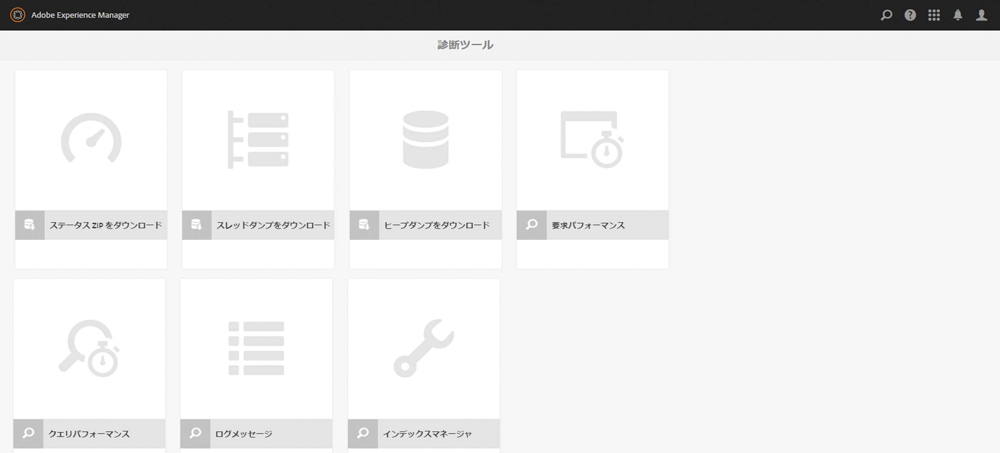

### ログメッセージ {#log-messages}

ログメッセージユーザーインターフェイスには、デフォルトですべてのエラーメッセージが表示されます。表示されるログメッセージを増やす場合は、該当するログレベルでロガーを設定する必要があります。

ログメッセージはメモリ内ログアペンダーを使用するので、ログファイルとは関係しません。 もう1つの結果として、このUIでログレベルを変更しても、従来のログファイルに記録される情報は変更されません。 このUIでロガーを追加および削除すると、メモリ内ロガーにのみ影響します。 また、ロガー設定の変更はメモリ内ロガーの将来に反映されます。既にログに記録され、関連しなくなったエントリは削除されませんが、今後同様のエントリはログに記録されません。

ログに記録する内容を設定するには、UI の左上にあるギアボタンから、ロガーを設定します。そこで、ロガーの設定を追加、削除または更新できます。ロガーの設定は、**ログレベル**（警告／情報／デバッグ）と&#x200B;**フィルター名**&#x200B;で構成されます。**フィルター名**&#x200B;には、記録されるログメッセージのソースをフィルター処理する役割があります。また、指定したレベルのすべてのログメッセージをロガーで取り込む必要がある場合は、フィルター名を「**root**」とします。ロガーのレベルを設定すると、指定したレベル以上のすべてのメッセージの取り込みがトリガーされます。

例：

* すべての&#x200B;**エラー**&#x200B;メッセージを取り込む計画をしている場合は、設定は不要です。エラーメッセージはすべてデフォルトで取り込まれます。
* **エラー**、**警告**、**情報**&#x200B;のすべてのメッセージを取り込む計画をしている場合は、ロガー名を「**root**」に、ロガーレベルを&#x200B;**情報**&#x200B;に設定します。

* 特定のパッケージ（com.adobe.granite など）からのすべてのメッセージを取り込む計画をしている場合は、ロガー名を「com.adobe.granite」に、ロガーレベルを&#x200B;**デバッグ**&#x200B;に設定します（**エラー**、**警告**、**情報**、**デバッグ**&#x200B;のすべてのメッセージが取り込まれます）。以下の図を参照してください。

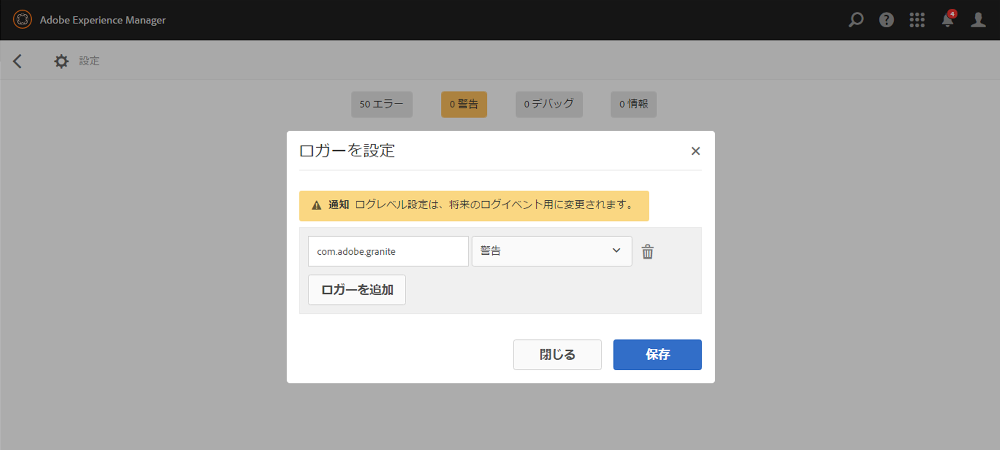

>[!NOTE]
>
>指定したフィルター経由でエラーメッセージのみを取り込むロガー名は設定できません。デフォルトで、すべてのエラーメッセージが取り込まれます。

>[!NOTE]
>
>ログメッセージユーザーインターフェイスには、実際のエラーログは反映されません。UI で他のタイプのログメッセージを設定しない限り、エラーメッセージのみが表示されます。特定のログメッセージを表示する方法については、上記の説明を参照してください。

>[!NOTE]
>
>診断ページの設定はログファイルへの記録内容には影響せず、その逆も同様です。したがって、エラーログで情報メッセージが見つかったとしても、ログメッセージの UI には表示されない場合があります。また、エラーログに影響を与えずに、特定のパッケージからのデバッグメッセージを UI を通して見つけることもできます。ログファイルの設定方法について詳しくは、[ログ](/help/sites-deploying/configure-logging.md)を参照してください。

>[!NOTE]
>
>**AEM 6.4**&#x200B;では、メンテナンスタスクは、INFOレベルでより詳細な情報を豊富な形式で初期設定の状態でログアウトされます。 これにより、メンテナンスタスクの状態がよりわかりやすくなっています。
>
>メンテナンスタスクのアクティビティを監視し、対処するためにサードパーティツール（Splunk など）を使用している場合、次のログステートメントを使用できます。

```
Log level: INFO
DATE+TIME [MaintanceLogger] Name=<MT_NAME>, Status=<MT_STATUS>, Time=<MT_TIME>, Error=<MT_ERROR>, Details=<MT_DETAILS>
```

### 要求パフォーマンス {#request-performance}

要求パフォーマンスページでは、処理時間が最も長いページ要求を分析できます。このページではコンテンツ要求のみが登録されます。具体的には、以下の要求が取り込まれます。

1. Requests accessing resources under `/content`
1. Requests accessing resources under `/etc/design`
1. Requests having the `".html"` extension

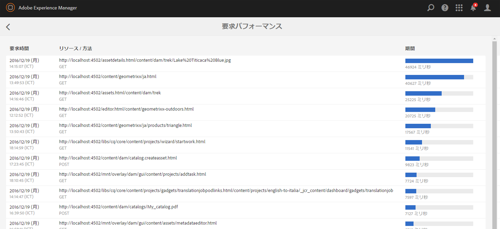

このページには以下の項目が表示されます。

* 要求がおこなわれた時刻
* URL と要求のメソッド
* 所要時間（ミリ秒単位）

デフォルトでは、所要時間が長いほうから 20 個のページ要求が取り込まれますが、この制限は設定マネージャーで変更できます。

### クエリパフォーマンス {#query-performance}

[クエリのパフォーマンス]ページでは、システムが実行する最も遅いクエリを分析できます。 この情報は、JMX Mbeanのリポジトリによって提供されます。 Jackrabbitでは、 `com.adobe.granite.QueryStat` JMX Mbeanがこの情報を提供し、Oakリポジトリでは、 `org.apache.jackrabbit.oak.QueryStats.`

このページには以下の項目が表示されます。

* クエリがおこなわれた時刻
* クエリの言語
* クエリの発行回数
* クエリのステートメント
* 所要時間（ミリ秒単位）

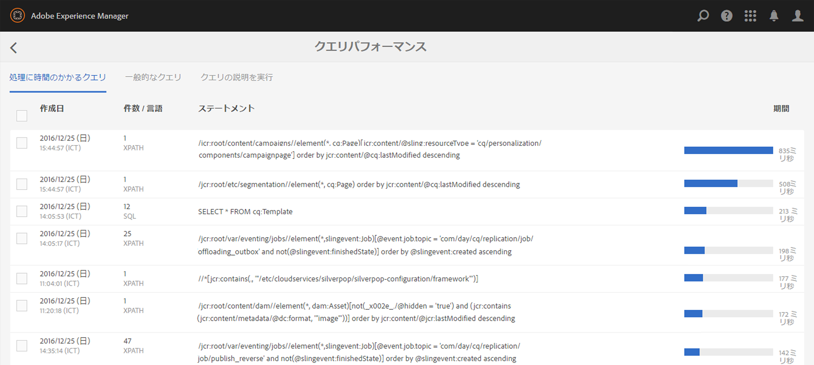

### クエリの説明を実行 {#explain-query}

どのようなクエリでも、Oak は、リポジトリ内の **oak:index** ノードの下で定義されている Oak インデックスに基づいて最適な実行方法の計算を試みます。クエリごとに異なるインデックスが Oak によって選択されます。Oak によるクエリの実行方法を把握することが、クエリを最適化するための第一歩です。

クエリの説明を実行は、Oak によるクエリの実行方法を説明するツールです。これには、AEM のようこそ画面から&#x200B;**ツール／操作／診断**&#x200B;を選択し、「**クエリパフォーマンス**」をクリックして「**クエリの説明を実行**」タブに切り替えることでアクセスできます。

**特長**

* Xpath、JCR-SQL および JCR-SQL2 クエリ言語をサポート
* 指定したクエリの実際の実行時間をレポート
* 時間のかかるクエリーを検出し、潜在的に時間のかかる可能性のあるクエリーに関する警告を表示
* クエリ実行に使用された Oak インデックスをレポート
* 実際の Oak クエリエンジンの説明を表示
* 時間のかかるクエリおよびよく使用されるクエリのリストをクリックで表示

クエリの説明を実行の UI では、クエリを入力して「**説明**」ボタンを押すだけで使用できます。


「クエリの説明」セクションの最初のエントリが実際の説明です。この説明には、クエリの実行に使用されたインデックスのタイプが示されます。

2 つ目のエントリは実行計画です。

クエリを実行する前に「**実行時間を含める**」ボックスをチェックすると、このクエリが実行された時間も示され、アプリケーションやデプロイメントでインデックスを最適化するために使用できる詳細情報が得られます。

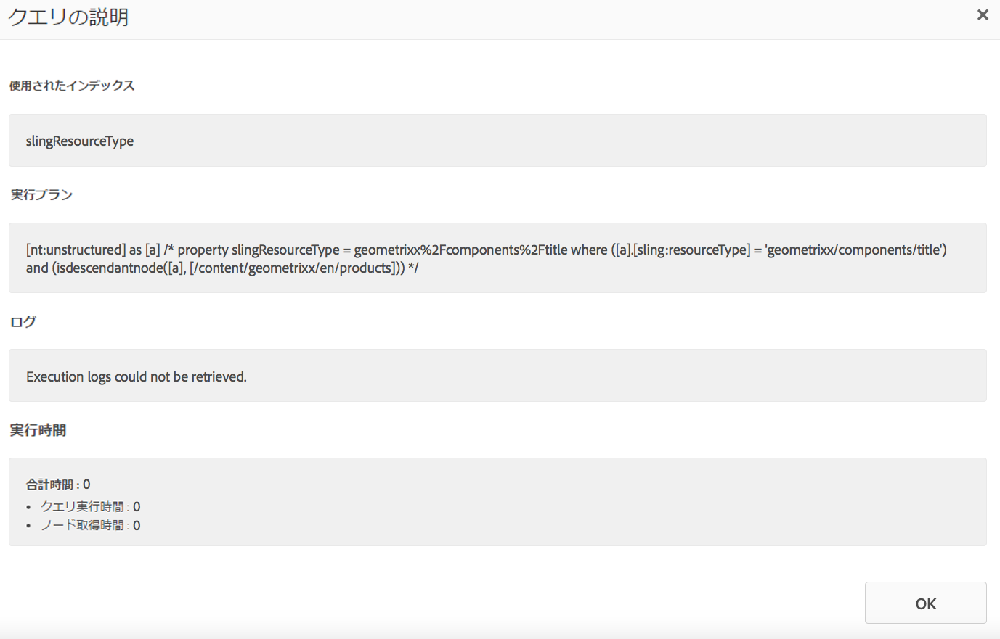

### インデックスマネージャ {#the-index-manager}

インデックスマネージャの目的は、インデックスのメンテナンスや、ステータスの表示などのインデックス管理を容易にすることです。

It can be accessed by going to **Tools - Operations - Diagnosis **from the Welcome Screen, and then clicking the **Index Manager** button.

It can also be accessed directly at this URL: `https://serveraddress:port/libs/granite/operations/content/diagnosistools/indexManager.html`

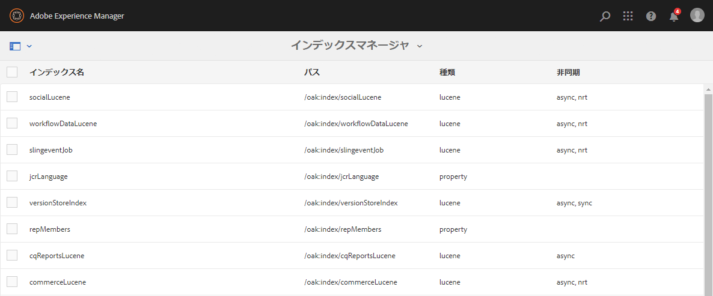

この UI で、画面左上隅の検索ボックスにフィルター条件を入力して、テーブル内のインデックスにフィルターを適用することができます。

### ステータス ZIP をダウンロード {#download-status-zip}

これは、システムステータスおよび設定に関する有益な情報を含む zip のダウンロードをトリガーします。アーカイブには、インスタンス設定、バンドルのリスト、OSGI、Sling指標および統計情報が含まれており、これにより大きなファイルが作成される場合があります。 You can reduce the impact of large status files by using the **Download Status ZIP** window. The window can be accessed from:**AEM > Tools > Operations > Diagnosis > Download Status ZIP.**

このウィンドウでは、エクスポートするもの（ログファイルやスレッドダンプ）および現在の日付を基準にしてダウンロードに含めるログの日数を選択できます。

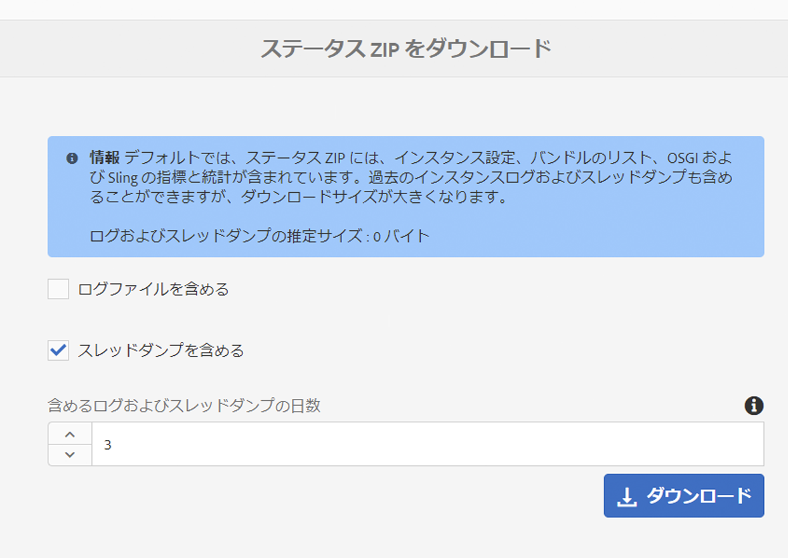

### スレッドダンプのダウンロード {#download-thread-dump}

システム内に存在するスレッドに関する情報を含む zip ファイルをダウンロードします。ステータス、クラスローダー、スタックトレースなど、各スレッドに関する情報が提供されます。

### ヒープダンプのダウンロード {#download-heap-dump}

後から分析するために、ヒープのスナップショットをダウンロードすることもできます。数百メガバイトものサイズの大きいファイルがダウンロードされることに注意してください。

## 自動メンテナンスタスク {#automated-maintenance-tasks}

自動メンテナンスタスクページでは、定期的な実行がスケジュールされている、推奨されるメンテナンスタスクを表示および追跡できます。タスクはヘルスチェックシステムに統合されています。タスクはインターフェイスから手動で実行することもできます。

操作ダッシュボードのメンテナンスページを開くには、AEM のようこそ画面から&#x200B;**ツール／操作／ダッシュボード／メンテナンス**&#x200B;を選択するか、次のリンクに直接アクセスします。

`https://serveraddress:port/libs/granite/operations/content/maintenance.html`

操作ダッシュボードでは、次のタスクを使用できます。

1. **日別メンテナンスウィンドウ**&#x200B;メニューの下の&#x200B;**リビジョンのクリーンアップ**&#x200B;タスク。
1. The **Lucene Binaries Cleanup** task, located under the **Daily Maintenance Window** menu.
1. **週別メンテナンスウィンドウ**&#x200B;メニューの下の&#x200B;**ワークフローのパージ**&#x200B;タスク。
1. The **Data Store Garbage Collection** task, located under the **Weekly Maintenance Window** menu.
1. The **Audit Log Maintenance** task, located under the **Weekly Maintenance Window** menu.
1. The **Version Purge Maintenance** task, located under the **Weekly Maintenance Window** menu.

日別メンテナンスウィンドウのデフォルトのタイミングは、午前 2 時から 5 時までです。週別メンテナンスウィンドウで実行するように設定されているタスクは、土曜日の午前 1 時から 2 時までに実行されます。

2 つのメンテナンスカードの歯車アイコンをクリックすることによって、タイミングを設定することもできます。

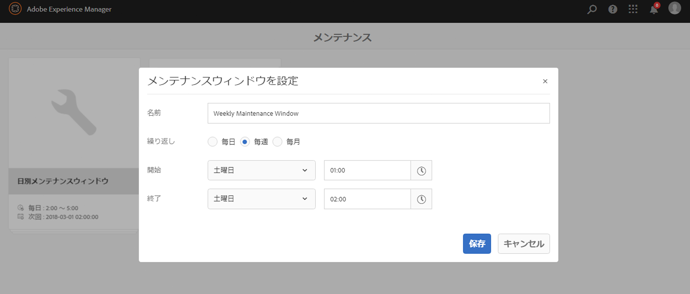

>[!NOTE]
>
>AEM 6.1 以降では、既存のメンテナンスウィンドウを月別で実行するように設定することもできます。

### リビジョンのクリーンアップ {#revision-clean-up}

リビジョンのクリーンアップの実行について詳しくは、[この記事を参照してください](/help/sites-deploying/revision-cleanup.md)。

### Lucene バイナリクリーンアップ {#lucene-binaries-cleanup}

Lucene バイナリクリーンアップタスクを使用することで、Lucene バイナリをパージして、実行中のデータストアのサイズ要件を減らすことができます。This is because the lucene&#39;s binary churn will be re-claimed daily instead of the earlier dependency on a successful [data store garbage collection](/help/sites-administering/data-store-garbage-collection.md) run.

メンテナンスタスクは Lucene に関連したリビジョンガベージを減らすために開発されましたが、このタスクを実行すると、次のように全般的に効率が向上します。

* データストアのガベージコレクションタスクの毎週の実行は、より迅速に完了します。
* また、AEM全体のパフォーマンスがわずかに向上する可能性があります

You can access the Lucene Binaries Cleanup task from: **AEM > Tools > Operations > Maintenance > Daily Maintenance Window > Lucene Binaries Cleanup**.

### データストアのガベージコレクション {#data-store-garbage-collection}

データストアのガベージコレクションについて詳しくは、専用の[ドキュメントページ](/help/sites-administering/data-store-garbage-collection.md)を参照してください。

### ワークフローのパージ {#workflow-purge}

ワークフローをメンテナンスダッシュボードからパージすることもできます。ワークフローのパージタスクを実行するには、次の手順が必要です。

1. **週別メンテナンスウィンドウ**&#x200B;ページをクリックします。
1. 次のページで、**ワークフローのパージ**&#x200B;カードの&#x200B;**再生**&#x200B;ボタンをクリックします。

>[!NOTE]
>
>ワークフローメンテナンスの詳細については、[このページ](/help/sites-administering/workflows-administering.md#regular-purging-of-workflow-instances)を参照してください。

### 監査ログのメンテナンス {#audit-log-maintenance}

監査ログのメンテナンスについて詳しくは、[別個のドキュメントページ](/help/sites-administering/operations-audit-log.md)を参照してください。

### バージョンのパージ {#version-purge}

バージョンのパージメンテナンスタスクをスケジュールして、古いバージョンを自動的に削除できます。As a result, this minimizes the need to manually use the [Version Purge tools](/help/sites-deploying/version-purging.md). You can schedule and configure the Version Purge task by accessing **Tools > Operations > Maintenance > Weekly Maintenance Window** and following these steps:

1. **** 追加ボタンをクリックします。
1. Choose **Version Purge** from the drop-down menu.

   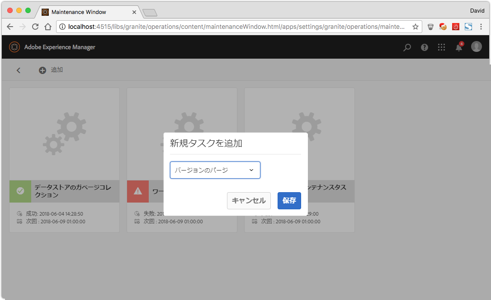

1. To configure the Version Purge task, click on the **gears** icon on the newly created Version Purge maintenance card.

   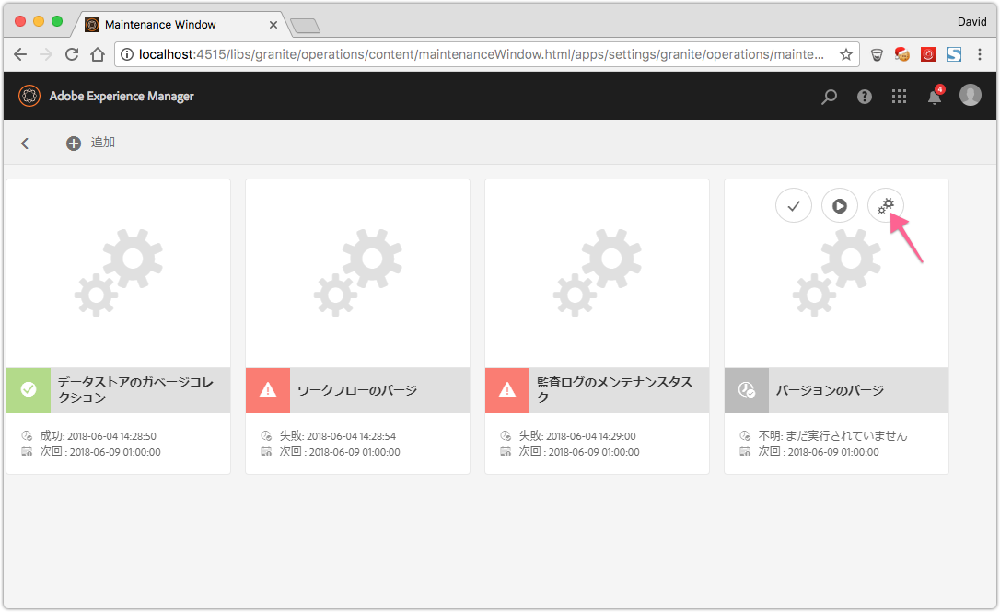

**AEM 6.4 では**、次のようにバージョンのパージメンテナンスタスクを停止できるようになりました。

* 自動 - タスクが完了する前に、スケジュールされたメンテナンスウィンドウを閉じると、タスクは自動的に停止します。次回のメンテナンスウィンドウを開くと、タスクは再開されます。
* 手動 - タスクを手動で停止するには、バージョンのパージメンテナンスカードの「**停止**」アイコンをクリックします。次回の実行時に、タスクは安全に再開されます。

>[!NOTE]
>
>メンテナンスタスクを停止すると、タスクの実行は休止されますが、既に進行しているジョブの監視が途切れることはありません。

>[!CAUTION]
>
>リポジトリサイズを最適化するためには、バージョン削除タスクを頻繁に実行する必要があります。トラフィックが限られている場合は、営業時間外にタスクをスケジュールする必要があります。

## カスタムメンテナンスタスク {#custom-maintenance-tasks}

カスタムメンテナンスタスクは OSGi サービスとして実装できます。メンテナンスタスクのインフラストラクチャは Apache Sling のジョブ処理に基づいているので、メンテナンスタスクでは Java インターフェイス ` [org.apache.sling.event.jobs.consumer.JobExecutor](https://sling.apache.org/apidocs/sling7/org/apache/sling/event/jobs/consumer/JobExecutor.html)` を実装する必要があります。さらに、以下に示すいくつかのサービス登録プロパティがメンテナンスタスクとして検出されることを宣言する必要があります。

<table>
 <tbody>
  <tr>
   <td><strong>サービスプロパティ名</strong><br /> </td>
   <td><strong>説明</strong></td>
   <td><strong>例</strong><br /> </td>
   <td><strong>型</strong></td>
  </tr>
  <tr>
   <td>granite.maintenance.isStoppable</td>
   <td>タスクをユーザーが停止できるかどうかを定義するブール値属性。停止可能と宣言する場合は、タスクを実行中に、停止されたかどうかを確認し、適宜処理をおこなう必要があります。デフォルトは false です。</td>
   <td>true</td>
   <td>オプション</td>
  </tr>
  <tr>
   <td>granite.maintenance.mandatory</td>
   <td>タスクが必須であり、定期的に実行する必要があるかどうかを定義するブール値属性。タスクが必須であるものの、現時点でアクティブなスケジュールウィンドウに存在しない場合は、ヘルスチェックによってエラーとして報告されます。デフォルトは false です。</td>
   <td>true</td>
   <td>オプション</td>
  </tr>
  <tr>
   <td>granite.maintenance.name</td>
   <td>タスクの一意の名前 —タスクを参照するために使用します。 これは通常、単純な名前です。</td>
   <td>MyMaintenanceTask</td>
   <td>必須</td>
  </tr>
  <tr>
   <td>granite.maintenance.title</td>
   <td>このタスクに表示されるタイトル。</td>
   <td>My Special Maintenance Task</td>
   <td>必須</td>
  </tr>
  <tr>
   <td>job.topics</td>
   <td>メンテナンスタスクの一意なトピック。<br />
Apache Sling のジョブ処理では、このトピックからジョブを開始してメンテナンスタスクを実行し、このトピック用にタスクが登録されるとタスクが実行されます。<br />
トピック名は <i>com/adobe/granite/maintenance/job/</i> から始める必要があります。</td>
   <td>com/adobe/granite/maintenance/job/MyMaintenanceTask</td>
   <td>必須</td>
  </tr>
 </tbody>
</table>

上記のサービスプロパティ以外に、インター `process()` フェイスの `JobConsumer` メソッドは、メンテナンスタスクに対して実行する必要があるコードを追加することで実装する必要があります。 提供されたは、ステータス情報を出力するために `JobExecutionContext` 使用したり、ジョブがユーザーによって停止されているかどうかを確認したり、結果（成功または失敗）を作成したりできます。

For situations where a maintenance task should not be run on all installations (for example, run only on the publish instance), you can make the service require a configuration in order to be active by adding `@Component(policy=ConfigurationPolicy.REQUIRE)`. You can then mark the according configuration as being run mode dependent in the repository. 詳しくは、「OSGiの [設定](/help/sites-deploying/configuring-osgi.md#creating-the-configuration-in-the-repository)」を参照してください。

以下のカスタムメンテナンスタスクの例では、設定可能な一時ディレクトリから、過去 24 時間以内に変更されたファイルを削除します。

src/main/java/com/adobe/granite/samples/maintenance/impl/DeleteTempFilesTask.java

<table>
 <tbody>
  <tr>
   <td><p> </p> <p><code>/*</code></p> <p><code> * #%L</code></p> <p><code> * sample-maintenance-task</code></p> <p><code> * %%</code></p> <p><code> * Copyright (C) 2014 Adobe</code></p> <p><code> * %%</code></p> <p><code> * Licensed under the Apache License, Version 2.0 (the "License");</code></p> <p><code> * you may not use this file except in compliance with the License.</code></p> <p><code> * You may obtain a copy of the License at</code></p> <p><code> * </code></p> <p><code> * <a href="https://www.apache.org/licenses/LICENSE-2.0">https://www.apache.org/licenses/LICENSE-2.0</a></code></p> <p><code> * </code></p> <p><code> * Unless required by applicable law or agreed to in writing, software</code></p> <p><code> * distributed under the License is distributed on an "AS IS" BASIS,</code></p> <p><code> * WITHOUT WARRANTIES OR CONDITIONS OF ANY KIND, either express or implied.</code></p> <p><code> * See the License for the specific language governing permissions and</code></p> <p><code> * limitations under the License.</code></p> <p><code> * #L%</code></p> <p><code> */</code></p> <p><code> </code></p> <p><code>package com.adobe.granite.samples.maintenance.impl;</code></p> <p><code> </code></p> <p><code>import java.io.File;</code></p> <p><code>import java.util.Calendar;</code></p> <p><code>import java.util.Collection;</code></p> <p><code>import java.util.Map;</code></p> <p><code> </code></p> <p><code>import org.apache.commons.io.FileUtils;</code></p> <p><code>import org.apache.commons.io.filefilter.IOFileFilter;</code></p> <p><code>import org.apache.commons.io.filefilter.TrueFileFilter;</code></p> <p><code>import org.apache.felix.scr.annotations.Activate;</code></p> <p><code>import org.apache.felix.scr.annotations.Component;</code></p> <p><code>import org.apache.felix.scr.annotations.Properties;</code></p> <p><code>import org.apache.felix.scr.annotations.Property;</code></p> <p><code>import org.apache.felix.scr.annotations.Service;</code></p> <p><code>import org.apache.sling.commons.osgi.PropertiesUtil;</code></p> <p><code>import org.apache.sling.event.jobs.Job;</code></p> <p><code>import org.apache.sling.event.jobs.consumer.JobConsumer;</code></p> <p><code>import org.apache.sling.event.jobs.consumer.JobExecutionContext;</code></p> <p><code>import org.apache.sling.event.jobs.consumer.JobExecutionResult;</code></p> <p><code>import org.apache.sling.event.jobs.consumer.JobExecutor;</code></p> <p><code>import org.slf4j.Logger;</code></p> <p><code>import org.slf4j.LoggerFactory;</code></p> <p><code> </code></p> <p><code>import com.adobe.granite.maintenance.MaintenanceConstants;</code></p> <p><code> </code></p> <p><code>@Component(metatype = true,</code></p> <p><code> label = "Delete Temp Files Maintenance Task",</code></p> <p><code> description = "Maintatence Task which deletes files from a configurable temporary directory which have been modified in the last 24 hours.")</code></p> <p><code>@Service</code></p> <p><code>@Properties({</code></p> <p><code> @Property(name = MaintenanceConstants.PROPERTY_TASK_NAME, value = "DeleteTempFilesTask", propertyPrivate = true),</code></p> <p><code> @Property(name = MaintenanceConstants.PROPERTY_TASK_TITLE, value = "Delete Temp Files", propertyPrivate = true),</code></p> <p><code> @Property(name = JobConsumer.PROPERTY_TOPICS, value = MaintenanceConstants.TASK_TOPIC_PREFIX</code></p> <p><code> + "DeleteTempFilesTask", propertyPrivate = true) })</code></p> <p><code>public class DeleteTempFilesTask implements JobExecutor {</code></p> <p><code> </code></p> <p><code> private static final Logger log = LoggerFactory.getLogger(DeleteTempFilesTask.class);</code></p> <p><code> </code></p> <p><code> @Property(label = "Temporary Directory", description="Temporary Directory. Defaults to the java.io.tmpdir system property.")</code></p> <p><code> private static final String PROP_TEMP_DIR = "temp.dir";</code></p> <p><code> </code></p> <p><code> private File tempDir;</code></p> <p><code> </code></p> <p><code> @Activate</code></p> <p><code> private void activate(Map&lt;string, object=""&gt; properties) {</code></p> <p><code> this.tempDir = new File(PropertiesUtil.toString(properties.get(PROP_TEMP_DIR),</code></p> <p><code> System.getProperty("java.io.tmpdir")));</code></p> <p><code> }</code></p> <p><code> </code></p> <p><code> @Override</code></p> <p><code> public JobExecutionResult process(Job job, JobExecutionContext context) {</code></p> <p><code> log.info("Deleting old temp files from {}.", tempDir.getAbsolutePath());</code></p> <p><code> Collection&lt;file&gt; files = FileUtils.listFiles(tempDir, new LastModifiedBeforeYesterdayFilter(),</code></p> <p><code> TrueFileFilter.INSTANCE);</code></p> <p><code> int counter = 0;</code></p> <p><code> for (File file : files) {</code></p> <p><code> log.debug("Deleting file {}.", file.getAbsolutePath());</code></p> <p><code> counter++;</code></p> <p><code> file.delete();</code></p> <p><code> // TODO - capture the output of delete() and do something useful with it</code></p> <p><code> }</code></p> <p><code> return context.result().message(String.format("Deleted %s files.", counter)).succeeded();</code></p> <p><code> }</code></p> <p><code> </code></p> <p><code> /**</code></p> <p><code> * IOFileFilter which filters out files which have been modified in the last 24 hours.</code></p> <p><code> *</code></p> <p><code> */</code></p> <p><code> private static class LastModifiedBeforeYesterdayFilter implements IOFileFilter {</code></p> <p><code> </code></p> <p><code> private final long minTime;</code></p> <p><code> </code></p> <p><code> private LastModifiedBeforeYesterdayFilter() {</code></p> <p><code> Calendar cal = Calendar.getInstance();</code></p> <p><code> cal.add(Calendar.DATE, -1);</code></p> <p><code> this.minTime = cal.getTimeInMillis();</code></p> <p><code> }</code></p> <p><code> </code></p> <p><code> @Override</code></p> <p><code> public boolean accept(File dir, String name) {</code></p> <p><code> // this method is never actually called.</code></p> <p><code> return false;</code></p> <p><code> }</code></p> <p><code> </code></p> <p><code> @Override</code></p> <p><code> public boolean accept(File file) {</code></p> <p><code> return file.lastModified() <= this.minTime;</code></p> <p><code> }</code></p> <p><code> }</code></p> <p><code> </code></p> <p><code>}</code></p> <p><code>&lt;file&gt;&lt;/string,&gt;</code></p> <p> </p> </td>
  </tr>
 </tbody>
</table>

[experiencemanager-java-maintenancetask-sample](https://github.com/Adobe-Marketing-Cloud/experiencemanager-java-maintenancetask-sample)- [src/main/java/com/adobe/granite/samples/maintenance/impl/DeleteTempFilesTask.java](https://github.com/Adobe-Marketing-Cloud/experiencemanager-java-maintenancetask-sample/blob/master/src/main/java/com/adobe/granite/samples/maintenance/impl/DeleteTempFilesTask.java)

サービスがデプロイされると、操作ダッシュボードのUIに表示されます。 このファイルは、次のいずれかの使用可能なメンテナンススケジュールに追加できます。

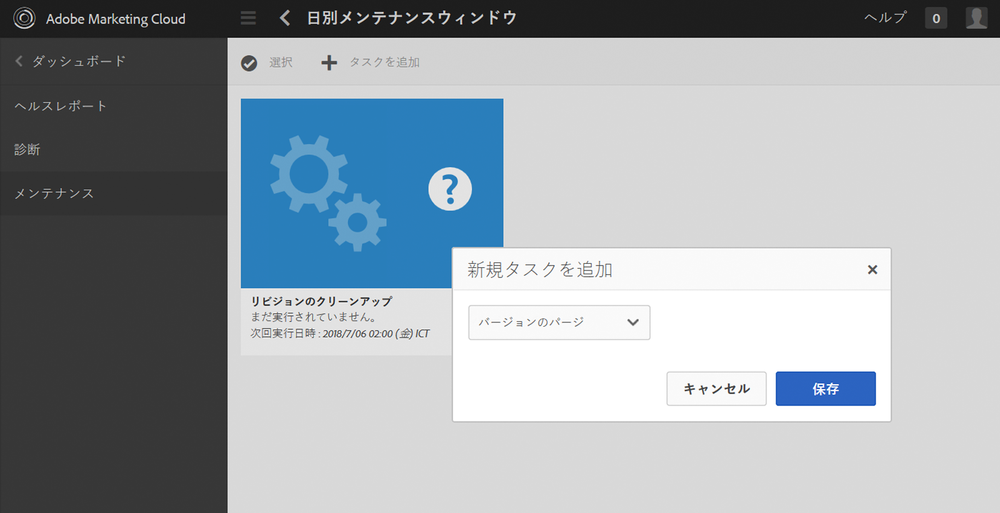

This will add a corresponding resource at /apps/granite/operations/config/maintenance/`schedule`/`taskname`. If the task is run mode dependent, the property granite.operations.conditions.runmode needs to be set on that node with the values of the runmodes which need to be active for this maintenance task.

## システム概要 {#system-overview}

**システム概要ダッシュボード** には、AEMインスタンスの設定、ハードウェア、正常性の概要が表示されます。 つまり、システムヘルスのステータスが明白になり、すべての情報が 1 つのダッシュボードに集約されます。

>[!NOTE]
>
>システム概要ダッシュボードの概要については、[このビデオを参照](https://video.tv.adobe.com/v/21340?captions=jpn)してください。

### アクセス方法 {#how-to-access}

To access the System Overview Dashboard, navigate to **Tools > Operations > System Overview**.

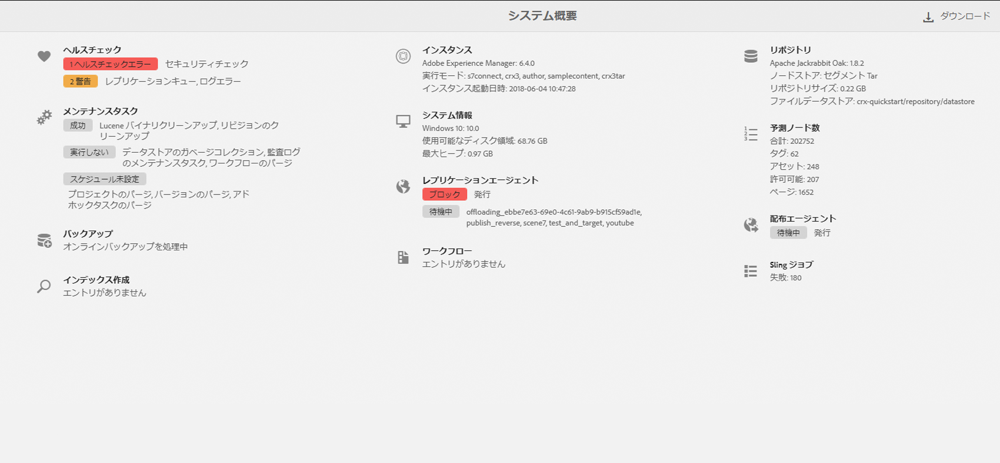

### システム概要ダッシュボードの説明 {#system-overview-dashboard-explained}

次の表では、システム概要ダッシュボードに表示されるすべての情報について説明します。表示する関連情報がない場合（バックアップが進行中ではない、重要なヘルスチェックはないなど）は、それぞれのセクションに「エントリがありません」というメッセージが表示されます。

You can also download a `JSON` file summarizing the dashboard information by clicking the **Download** button in the upper right-hand corner of the dashboard.The `JSON` endpoint is `/libs/granite/operations/content/systemoverview/export.json` and it can be used in a `curl` script for external monitoring.

<table>
 <tbody>
  <tr>
   <td><strong>セクション</strong></td>
   <td><strong>表示される情報</strong></td>
   <td><strong>これが重要になる状況</strong></td>
   <td><strong>リンク先</strong></td>
  </tr>
  <tr>
   <td>ヘルスチェック</td>
   <td>
    <ul>
     <li>重要ステータスのチェックのリスト</li>
     <li>警告ステータスのチェックのリスト</li>
    </ul> </td>
   <td>色の意味：<br />
    <ul>
     <li>赤色のタグは重要なチェック</li>
     <li>オレンジ色のタグは警告のチェック</li>
    </ul> </td>
   <td>
    <ul>
     <li>ヘルスレポートページ</li>
    </ul> </td>
  </tr>
  <tr>
   <td>メンテナンスタスク</td>
   <td>
    <ul>
     <li>失敗したタスクのリスト</li>
     <li>現在実行中のタスクのリスト</li>
     <li>前回の実行で成功したタスクのリスト</li>
     <li>実行しなかったタスクのリスト</li>
     <li>スケジュールが未設定のタスクのリスト</li>
    </ul> </td>
   <td><p>色の意味：</p>
    <ul>
     <li>赤色のタグは失敗したタスク</li>
     <li>オレンジ色のタグは実行中のタスク（これらはパフォーマンスに影響する可能性があります）</li>
     <li>灰色のタグはその他のすべてのステータス</li>
    </ul> </td>
   <td>
    <ul>
     <li>メンテナンスタスクページ</li>
    </ul> </td>
  </tr>
  <tr>
   <td>システム</td>
   <td>
    <ul>
     <li>オペレーティングシステム（OS）および OS バージョン（Mac OS X など）</li>
     <li>システム負荷平均（<a href="https://docs.oracle.com/javase/8/docs/api/java/lang/management/OperatingSystemMXBean.html#getSystemLoadAverage--">OperatingSystemMXBeanusable</a> から取得されます）</li>
     <li>ディスク領域（ホームディレクトリがあるパーティション）</li>
     <li>maximum heap, as returned by <a href="https://docs.oracle.com/javase/8/docs/api/java/lang/management/MemoryMXBean.html#getHeapMemoryUsage--">MemoryMXBean</a></li>
    </ul> </td>
   <td>該当なし</td>
   <td>該当なし</td>
  </tr>
  <tr>
   <td>インスタンス</td>
   <td>
    <ul>
     <li>AEM のバージョン</li>
     <li>実行モードのリスト</li>
     <li>インスタンスが開始された日付</li>
    </ul> </td>
   <td>該当なし</td>
   <td>該当なし</td>
  </tr>
  <tr>
   <td>リポジトリ</td>
   <td>
    <ul>
     <li>Oak のバージョン</li>
     <li>ノードストアのタイプ（セグメント Tar またはドキュメント）
      <ul>
       <li>タイプがドキュメントの場合は、ドキュメントストアのタイプが表示されます（RDB または Mongo）。</li>
      </ul> </li>
     <li>カスタムデータストアがある場合：
      <ul>
       <li>ファイルデータストアの場合は、パスが表示されます。</li>
       <li>S3 データストアの場合は、S3 バケットの名前が表示されます。</li>
       <li>共有 S3 データストアの場合は、S3 バケットの名前が表示されます。</li>
       <li>Azure データストアの場合は、コンテナが表示されます。</li>
      </ul> </li>
     <li>カスタムの外部データストアがない場合は、このことを示すメッセージが表示されます。</li>
    </ul> </td>
   <td>該当なし</td>
   <td>該当なし</td>
  </tr>
  <tr>
   <td>配布エージェント</td>
   <td>
    <ul>
     <li>キューがブロックされているエージェントのリスト</li>
     <li>設定が正しくないエージェントのリスト（「設定エラー」）</li>
     <li>キューの処理が一時停止されているエージェントのリスト</li>
     <li>待機中エージェントのリスト</li>
     <li>実行中エージェントのリスト（現在エントリを処理中）</li>
    </ul> </td>
   <td><p>色の意味：</p>
    <ul>
     <li>赤色のタグはブロックされているエージェントまたは設定エラー</li>
     <li>オレンジ色のタグは一時停止中のエージェント</li>
     <li>灰色のタグは一時停止中、待機中または実行中のエージェント<br /> </li>
    </ul> </td>
   <td>配布版ページ<br /> </td>
  </tr>
  <tr>
   <td>レプリケーションエージェント</td>
   <td>
    <ul>
     <li>キューがブロックされているエージェントのリスト</li>
     <li>待機中エージェントのリスト</li>
     <li>実行中エージェントのリスト（現在エントリを処理中）</li>
    </ul> </td>
   <td><p>色の意味：<br /> </p>
    <ul>
     <li>赤色のタグはブロックされているエージェント</li>
     <li>灰色のタグは一時停止中のエージェント</li>
    </ul> </td>
   <td>レプリケーションページ</td>
  </tr>
  <tr>
   <td>ワークフロー</td>
   <td>
    <ul>
     <li>ワークフロージョブ：
      <ul>
       <li>失敗したワークフロージョブの数（ある場合）</li>
       <li>取り消されたワークフロージョブの数（存在する場合）</li>
      </ul> </li>
    </ul>
    <ul>
     <li>ワークフロー数 — 特定のステータスのワークフロー数（存在する場合）:
      <ul>
       <li>実行中</li>
       <li>失敗</li>
       <li>保留中</li>
       <li>中止</li>
      </ul> </li>
    </ul> <p>前述のステータスごとにクエリが実行されます（400 ミリ秒以内）。400 ミリ秒の時点で、その時点までに取得されたエントリ数が表示されます。</p> </td>
   <td><p>判断なし：</p>
    <ul>
     <li>予期しないステータスのワークフローとジョブがある場合は、調査する必要があります。</li>
    </ul> </td>
   <td>ワークフローエラーページ</td>
  </tr>
  <tr>
   <td>Sling ジョブ</td>
   <td><p>Sling ジョブ数 - 特定のステータスのジョブの数（ある場合）：</p>
    <ul>
     <li>失敗</li>
     <li>待機中</li>
     <li>キャンセル済み</li>
     <li>アクティブ</li>
    </ul> </td>
   <td><p>判断なし：</p>
    <ul>
     <li>予期しないステータスまたは数が大きいジョブがある場合は、調査する必要があります。</li>
    </ul> </td>
   <td>該当なし</td>
  </tr>
  <tr>
   <td>予測ノード数</td>
   <td><p>予測数：</p>
    <ul>
     <li>ページ</li>
     <li>アセット</li>
     <li>タグ</li>
     <li>許可可能</li>
     <li>ノードの合計数<br /> </li>
    </ul> <p>ノードの合計数はnodeCounterMBeanから取得され、残りの統計はIndexInfoServiceから取得されます。</p> </td>
   <td>該当なし</td>
   <td>該当なし</td>
  </tr>
  <tr>
   <td>バックアップ</td>
   <td>この場合は、「オンラインバックアップを処理中」と表示されます。</td>
   <td>該当なし</td>
   <td>該当なし</td>
  </tr>
  <tr>
   <td>インデックス作成</td>
   <td><p>ディスプレイ:</p>
    <ul>
     <li>「インデックスを処理中」</li>
     <li>「クエリを処理中」</li>
    </ul> <p>インデックスまたはクエリスレッドがスレッドダンプに存在する場合。</p> </td>
   <td>該当なし</td>
   <td>該当なし</td>
  </tr>
 </tbody>
</table>

