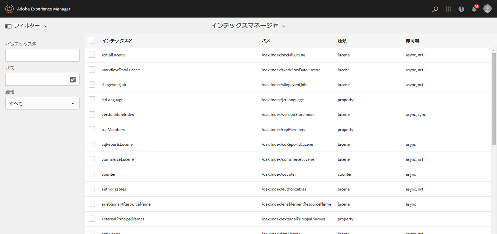

# 操作ダッシュボード {#operations-dashboard}

## はじめに {#introduction}

AEM 6 の操作ダッシュボードは、システムオペレーターがAEMシステムの正常性を一目で監視するのに役立ちます。 また、AEMの関連する側面に関する自動生成診断情報を提供し、自己完結型のメンテナンス自動化を設定および実行して、プロジェクトの運用やサポートケースを大幅に削減できます。 操作ダッシュボードは、カスタムヘルスチェックおよびメンテナンスタスクを使用して拡張できます。 また、操作ダッシュボードのデータは、JMX を介して外部の監視ツールからアクセスできます。

**操作ダッシュボード：**

* ワンクリックでのシステムステータスで、運用部門の効率化を支援
* システムヘルスの概要を、1 つの場所で一元的に提供します。
* 問題の検出、分析、修正に要する時間を短縮
* 自己完結型のメンテナンスを自動化し、プロジェクト運用コストを大幅に削減

AEM のようこそ画面から&#x200B;**ツール**／**操作**&#x200B;に移動してアクセスできます。

>[!NOTE]
>
>操作ダッシュボードにアクセスするには、ログインしたユーザーが「オペレーター」ユーザーグループに属している必要があります。 詳しくは、 [ユーザー、グループ、アクセス権の管理](/help/sites-administering/user-group-ac-admin.md).

## ヘルスレポート {#health-reports}

ヘルスレポートシステムは、Sling ヘルスチェックを通じてAEMインスタンスのヘルスに関する情報を提供します。 この操作は、OSGI、JMX、HTTP リクエスト（JSON を介する）またはタッチ UI を介して実行します。 設定可能な特定のカウンターの測定値としきい値を提供し、場合によっては問題の解決方法に関する情報を提供します。

以下で説明するような、様々な機能があります。

## ヘルスチェック {#health-checks}

この **ヘルスレポート** は、特定の製品領域に関する良い状態または悪い状態を示すカードのシステムです。 これらのカードは、Sling ヘルスチェックのビジュアライゼーションで、JMX や他のソースからのデータを集計し、処理された情報を MBean として再び公開します。 これらの MBean は、 [JMX Web コンソール](/help/sites-administering/jmx-console.md)、 **org.apache.sling.healthcheck** ドメイン。

ヘルスレポートインターフェイスには、AEM のようこそ画面の&#x200B;**ツール**／**運用**／**ヘルスレポート**&#x200B;メニューからアクセスするか、次の URL から直接アクセスできます。

`https://<serveraddress>:port/libs/granite/operations/content/healthreports/healthreportlist.html`


カードシステムが表示する状態は、**OK**、**警告**、**重要**&#x200B;の 3 つです。この状態は、ルールおよびしきい値の結果です。ルールおよびしきい値は、カードの上にマウスポインターを置いてアクションバーのギアアイコンをクリックすることで設定できます。


### ヘルスチェックのタイプ {#health-check-types}

AEM 6 には、次の 2 種類のヘルスチェックがあります。

1. 個々のヘルスチェック
1. 複合ヘルスチェック

An **個別ヘルスチェック** は、ステータスカードに対応する単一のヘルスチェックです。 個々のヘルスチェックは、ルールやしきい値を使用して設定でき、特定されたヘルスの問題を解決するための 1 つ以上のヒントやリンクを提供できます。 次に、「エラーをログに記録」チェックの例を示します。インスタンスログに ERROR エントリがある場合は、ヘルスチェックの詳細ページでそれらを見つけます。 ページ上部の「診断ツール」セクションに「ログメッセージ」アナライザーへのリンクが表示され、これらのエラーをより詳細に分析し、ロガーを再設定できます。

A **複合ヘルスチェック** は、複数の個々のチェックから情報を集計するチェックです。

複合ヘルスチェックは次の手順で設定します。 **タグのフィルター**. 基本的に、同じフィルタータグを持つすべての単一のチェックは、複合ヘルスチェックとしてグループ化されます。 複合ヘルスチェックは、集計するすべてのチェックに OK ステータスがある場合にのみ OK ステータスになります。

### ヘルスチェックを作成する方法 {#how-to-create-health-checks}

操作ダッシュボードで、個々のヘルスチェックと複合ヘルスチェックの両方の結果を視覚化できます。

### 個々のヘルスチェックの作成 {#creating-an-individual-health-check}

個々のヘルスチェックの作成には、次の 2 つの手順が含まれます。Sling ヘルスチェックを実装し、ダッシュボードの設定ノードにヘルスチェックのエントリを追加します。

1. Sling ヘルスチェックを作成するには、Sling HealthCheck インターフェイスを実装する OSGi コンポーネントを作成します。 このコンポーネントをバンドル内に追加します。 コンポーネントのプロパティによってヘルスチェックが完全に識別されます。 コンポーネントをインストールすると、ヘルスチェック用の JMX MBean が自動的に作成されます。 詳しくは、 [Sling ヘルスチェックドキュメント](https://sling.apache.org/documentation/bundles/sling-health-check-tool.html) を参照してください。

   OSGI サービスコンポーネントの注釈を含む、Sling ヘルスチェックコンポーネントの例：

   ```java
   @Component(service = HealthCheck.class,
   property = {
       HealthCheck.NAME + "=Example Check",
       HealthCheck.TAGS + "=example",
       HealthCheck.TAGS + "=test",
       HealthCheck.MBEAN_NAME + "=exampleHealthCheckMBean"
   })
    public class ExampleHealthCheck implements HealthCheck {
       @Override
       public Result execute() {
           // health check code
       }
    }
   ```

   >[!NOTE]
   >
   >この `MBEAN_NAME` プロパティは、このヘルスチェック用に生成される mbean の名前を定義します。

1. ヘルスチェックを作成した後、操作ダッシュボードインターフェイスでアクセスできるように、新しい設定ノードを作成する必要があります。 この手順では、ヘルスチェックの JMX MBean 名を確認しておく必要があります（`MBEAN_NAME` プロパティ）。ヘルスチェックの設定を作成するには、CRXDE を開き、（タイプの）ノードを追加します **nt:unstructured**) を次のパスの下に置きます。 `/apps/settings/granite/operations/hc`

   新しいノードに次のプロパティを設定する必要があります。

   * **名前：** `sling:resourceType`

      * **タイプ：** `String`
      * **値：** `granite/operations/components/mbean`
   * **名前：** `resource`

      * **タイプ：** `String`
      * **値：** `/system/sling/monitoring/mbeans/org/apache/sling/healthcheck/HealthCheck/exampleHealthCheck`

   >[!NOTE]
   >
   >上記のリソースパスを作成するには、ヘルスチェックの MBean 名が「test」の場合、パス `/system/sling/monitoring/mbeans/org/apache/sling/healthcheck/HealthCheck` の末尾に「test」を追加します。
   >
   >最後のパスは次のようになります。
   >
   >`/system/sling/monitoring/mbeans/org/apache/sling/healthcheck/HealthCheck/test`

   >[!NOTE]
   >
   >`/apps/settings/granite/operations/hc` パスに、true に設定された次のプロパティがあることを確認します。
   >
   >
   >`sling:configCollectionInherit`
   >
   >`sling:configPropertyInherit`
   >
   >
   >このプロセスは、新しい設定を既存の設定と結合するよう設定マネージャーに指示します。 `/libs`.

### 複合ヘルスチェックの作成 {#creating-a-composite-health-check}

複合ヘルスチェックの役割は、共通の機能のセットを共有する複数の個々のヘルスチェックを集計することです。 たとえば、セキュリティ複合ヘルスチェックは、セキュリティ関連の検証を実行する個々のヘルスチェックをすべてグループ化します。 複合チェックを作成する最初の手順は、OSGi 設定を追加することです。 操作ダッシュボードに表示するには、簡単なチェックと同じ方法で、新しい設定ノードを追加する必要があります。

1. OSGI コンソールで web 設定マネージャーに移動します。これを行うには、`https://serveraddress:port/system/console/configMgr` にアクセスします。
1. **Apache Sling Composite Health Check** というエントリを検索します。見つかったら、システムチェック用とセキュリティチェック用の 2 つの設定が既に使用可能であることを確認します。
1. 設定の右側にある「+」ボタンを押して、設定を作成します。 次に示すように、新しいウィンドウが表示されます。

   

1. 設定を作成して保存します。 新しい設定で Mbean が作成されます。

   各設定プロパティの目的は次のとおりです。

   * **名前 (hc.name):** 複合ヘルスチェックの名前。 意味のある名前を付けることをお勧めします。
   * **タグ (hc.tags):** このヘルスチェックのタグ。 この複合ヘルスチェックが別の複合ヘルスチェックの一部を目的とする場合（ヘルスチェックの階層など）、この複合が関連するタグを追加します。
   * **MBean 名 (hc.mbean.name):** この複合ヘルスチェックの JMX MBean に与えられる Mbean の名前。
   * **タグをフィルター (filter.tags):** 複合ヘルスチェックに固有のプロパティ。 これらは、複合で集計するタグです。 複合ヘルスチェックは、この複合のフィルタタグのいずれかに一致するタグを持つすべてのヘルスチェックをグループの下に集計します。 例えば、フィルタータグを持つ複合ヘルスチェック **テスト** および **check**&#x200B;は、 **テスト** および **check** タグプロパティ ( `hc.tags`) をクリックします。

   >[!NOTE]
   >
   >Apache Sling 複合ヘルスチェックの新しい設定ごとに、新しい JMX Mbean が 1 つずつ作成されます。**

1. 最後に、作成した複合ヘルスチェックのエントリを操作ダッシュボードの構成ノードに追加する必要があります。 手順は、個々のヘルスチェックの場合と同じです。タイプのノード **nt:unstructured** は以下の下に作成する必要があります。 `/apps/settings/granite/operations/hc`. ノードのリソースプロパティは、 **hc.mean.name** （OSGi 設定内）

   例えば、設定を作成し、 **hc.mbean.name** 値 **diskusage**&#x200B;設定ノードは次のようになります。

   * **名前：** `Composite Health Check`

      * **タイプ：** `nt:unstructured`

   次のプロパティを使用します。

   * **名前：** `sling:resourceType`

      * **タイプ：** `String`
      * **値：** `granite/operations/components/mbean`
   * **名前：** `resource`

      * **タイプ：** `String`
      * **値：** `/system/sling/monitoring/mbeans/org/apache/sling/healthcheck/HealthCheck/diskusage`

   >[!NOTE]
   >
   >デフォルトでダッシュボードに既に存在する複合チェックの下に論理的に属する個々のヘルスチェックを作成すると、自動的にキャプチャされ、それぞれの複合チェックの下にグループ化されます。 このため、これらのチェック用に設定ノードを作成する必要はありません。
   >
   >例えば、個々のセキュリティヘルスチェックを作成する場合は、「**セキュリティ**」タグが付いている必要があります。 これは、[ 操作 ] ダッシュボードの [ セキュリティチェック ] 複合チェックの下に自動的に表示されます。

### AEM で提供されているヘルスチェック {#health-checks-provided-with-aem}

<table>
 <tbody>
  <tr>
   <td><strong>ヘルスチェック名</strong></td>
   <td><strong>説明</strong></td>
  </tr>
  <tr>
   <td>クエリパフォーマンス</td>
   <td><p>このヘルスチェックは簡略化されました <strong>AEM 6.4 の場合</strong>最近リファクタリングされたを確認します。 <code>Oak QueryStats</code> MBean、具体的には <code>SlowQueries </code>属性。 統計に処理に時間のかかるクエリが含まれている場合、ヘルスチェックは警告を返します。 それ以外の場合は、OK ステータスを返します。<br /> </p> <p>このヘルスチェックの MBean は、<a href="http://localhost:4502/system/console/jmx/org.apache.sling.healthcheck%3Aname%3DqueriesStatus%2Ctype%3DHealthCheck">org.apache.sling.healthcheck:name=queriesStatus,type=HealthCheck</a> です。</p> </td>
  </tr>
  <tr>
   <td>監視キューの長さ</td>
   <td><p>監視キューの長さは、すべてのイベントリスナーとバックグラウンドオブザーバーを繰り返し処理し、それらの <code>queueSize </code> を <code>maxQueueSize</code> と比較します。</p>
    <ul>
     <li><code>queueSize</code> 値が <code>maxQueueSize</code> 値を超えた場合（つまり、イベントがドロップされた場合）、重要ステータスを返します。</li>
     <li><code>queueSize</code> 値が <code>maxQueueSize * WARN_THRESHOLD</code> を超えた場合、警告を返します（デフォルト値は 0.75）。 </li>
    </ul> <p>各キューの最大長は別々の設定 (Oak とAEM) から取得され、このヘルスチェックからは設定できません。 このヘルスチェックの MBean は、<a href="http://localhost:4502/system/console/jmx/org.apache.sling.healthcheck%3Aname%3DObservationQueueLengthHealthCheck%2Ctype%3DHealthCheck">org.apache.sling.healthcheck:name=ObservationQueueLengthHealthCheck,type=HealthCheck</a> です。</p> </td>
  </tr>
  <tr>
   <td>クエリトラバーサルの制限</td>
   <td><p>クエリトラバーサルの制限は、<code>QueryEngineSettings</code> MBean（具体的には <code>LimitInMemory</code> 属性と <code>LimitReads</code> 属性）をチェックし、次のステータスを返します。</p>
    <ul>
     <li>いずれかの制限が 以上の場合、警告ステータスを返します。 <code>Integer.MAX_VALUE</code></li>
     <li>いずれかの制限が 10,000（Oak の推奨設定）より低い場合、警告ステータスを返します。</li>
     <li><code>QueryEngineSettings</code> またはいずれかの制限を取得できない場合、重要ステータスを返します。</li>
    </ul> <p>このヘルスチェックの Mbean は、<a href="http://localhost:4502/system/console/jmx/org.apache.sling.healthcheck%3Aname%3DqueryTraversalLimitsBundle%2Ctype%3DHealthCheck">org.apache.sling.healthcheck:name=queryTraversalLimitsBundle,type=HealthCheck</a> です。</p> </td>
  </tr>
  <tr>
   <td>同期済みのクロック</td>
   <td><p>このチェックは、 <a href="https://github.com/apache/sling-old-svn-mirror/blob/4df9ab2d6592422889c71fa13afd453a10a5a626/bundles/extensions/discovery/oak/src/main/java/org/apache/sling/discovery/oak/SynchronizedClocksHealthCheck.java">document nodestore クラスター</a>. 次のステータスを返します。</p>
    <ul>
     <li>インスタンスクロックが同期しなくなり、事前に定義された低しきい値を超えた場合、警告ステータスを返します</li>
     <li>インスタンスクロックが同期しなくなり、事前に定義された高しきい値を超えた場合、重要ステータスを返します</li>
    </ul> <p>このヘルスチェックの Mbean は、<a href="http://localhost:4502/system/console/jmx/org.apache.sling.healthcheck%3Aname%3DslingDiscoveryOakSynchronizedClocks%2Ctype%3DHealthCheck">org.apache.sling.healthcheck:name=slingDiscoveryOakSynchronizedClocks,type=HealthCheck</a> です。</p> </td>
  </tr>
  <tr>
   <td>非同期インデックス</td>
   <td><p>非同期インデックスのチェック：</p>
    <ul>
     <li>少なくとも 1 つのインデックス作成レーンが失敗した場合に、重要ステータスを返します。</li>
     <li>すべてのインデックス作成レーンについて <code>lastIndexedTime</code> をチェックし、次のことを行います。
      <ul>
       <li>2 時間以上前である場合は、重要ステータスを返します。 </li>
       <li>2 時間～ 45 分前の場合は、警告ステータスを返します。 </li>
       <li>45 分前以内の場合は、OK ステータスを返します。 </li>
      </ul> </li>
     <li>これらの条件がいずれも満たされない場合は、OK ステータスを返します。</li>
    </ul> <p>Critical ステータスと Warn ステータスの両方のしきい値を設定できます。 このヘルスチェックの Mbean は、<a href="http://localhost:4502/system/console/jmx/org.apache.sling.healthcheck%3Aname%3DasyncIndexHealthCheck%2Ctype%3DHealthCheck">org.apache.sling.healthcheck:name=asyncIndexHealthCheck,type=HealthCheck</a> です。</p> <p><strong>注意：</strong>このヘルスチェックは、AEM 6.4 で使用でき、AEM 6.3.0.1 に移植されています。</p> </td>
  </tr>
  <tr>
   <td>大きい Lucene インデックス</td>
   <td><p>このチェックは、<code>Lucene Index Statistics</code> MBean によって公開されたデータを使用して大きいインデックスを識別し、次のステータスを返します。</p>
    <ul>
     <li>10 億を超えるドキュメントを含むインデックスがある場合の警告ステータス</li>
     <li>15 億を超えるドキュメントを含むインデックスがある場合の重大なステータス</li>
    </ul> <p>しきい値は設定可能で、このヘルスチェックの MBean は <a href="http://localhost:4502/system/console/jmx/org.apache.sling.healthcheck%3Aname%3DlargeIndexHealthCheck%2Ctype%3DHealthCheck">org.apache.sling.healthcheck:name=largeIndexHealthCheck,type=HealthCheck</a> です。</p> <p><strong>注意： </strong>このチェックはAEM 6.4 で利用でき、AEM 6.3.2.0 に移植されています。</p> </td>
  </tr>
  <tr>
   <td>システムメンテナンス</td>
   <td><p>システムメンテナンスは複合チェックで、すべてのメンテナンスタスクが設定どおりに実行されている場合は OK を返します。 次の点に注意してください。</p>
    <ul>
     <li>各メンテナンスタスクは、関連するヘルスチェックを伴います。</li>
     <li>タスクがメンテナンスウィンドウに追加されていない場合、ヘルスチェックは「重大」を返します</li>
     <li>監査ログとワークフローのパージのメンテナンスタスクを設定するか、メンテナンスウィンドウから削除します。 未構成のままにした場合、最初の試行時にこれらのタスクは失敗するので、システムメンテナンスチェックは重大ステータスを返します。</li>
     <li><strong>AEM 6.4 を使用</strong>、 <a href="/help/sites-administering/operations-dashboard.md#automated-maintenance-tasks">Lucene バイナリメンテナンス</a> タスク</li>
     <li>AEM 6.2 以前では、タスクが実行されないので、システムメンテナンスチェックは起動直後に警告ステータスを返します。 6.3 以降では、最初のメンテナンスウィンドウにまだ到達していない場合は OK が返されます。</li>
    </ul> <p>このヘルスチェックの MBean は次のとおりです。 <a href="http://localhost:4502/system/console/jmx/org.apache.sling.healthcheck%3Aname%3Dsystemchecks%2Ctype%3DHealthCheck">org.apache.sling.healthcheck:name=systemchecks,type=HealthCheck</a>.</p> </td>
  </tr>
  <tr>
   <td>レプリケーションキュー</td>
   <td><p>このチェックは、レプリケーションエージェントを反復し、そのキューを確認します。 キューの最上部にある項目について、エージェントがレプリケーションを再試行した回数がチェックされます。 エージェントが <code>numberOfRetriesAllowed</code> パラメーターの値より多くレプリケーションを試行した場合、警告を返します。<code>numberOfRetriesAllowed</code> パラメーターは設定可能です。 </p> <p>このヘルスチェックの MBean は、<a href="http://localhost:4502/system/console/jmx/org.apache.sling.healthcheck%3Aname%3DreplicationQueue%2Ctype%3DHealthCheck" target="_blank">org.apache.sling.healthcheck:name=replicationQueue,type=HealthCheck</a> です。</p> </td>
  </tr>
  <tr>
   <td>Sling ジョブ</td>
   <td>
    <div>
      Sling ジョブは、JobManager でのキューに登録されたジョブ数をチェックし、<code>maxNumQueueJobs</code> しきい値と比較します。
    </div>
    <ul>
     <li>キューに <code>maxNumQueueJobs</code> より多くある場合、重要ステータスを返します</li>
     <li>1 時間より古い長時間実行されるアクティブジョブがある場合に重要を返します</li>
     <li>キュー内のジョブがあり、最後に完了したジョブ時間が 1 時間より古い場合は、重要を返します</li>
    </ul> <p>設定できるのは、queued jobs パラメーターの最大数のみで、デフォルト値は 1000 です。</p> <p>このヘルスチェックの MBean は、<a href="http://localhost:4502/system/console/jmx/org.apache.sling.healthcheck%3Aname%3DslingJobs%2Ctype%3DHealthCheck" target="_blank">org.apache.sling.healthcheck:name=slingJobs,type=HealthCheck</a> です。</p> </td>
  </tr>
  <tr>
   <td>要求パフォーマンス</td>
   <td><p>このチェックは、<code>granite.request.metrics.timer</code> <a href="http://localhost:4502/system/console/slingmetrics" target="_blank">Sling 指標</a>を確認します。</p>
    <ul>
     <li>第 75 百分位値が重要のしきい値（デフォルト値は 500 ミリ秒）を超える場合、重要を返します</li>
     <li>75 番目のパーセンタイル値が警告しきい値を超えた場合（デフォルト値は 200 ミリ秒）、警告を返します</li>
    </ul> <p>このヘルスチェックの MBean は、<em> </em><a href="http://localhost:4502/system/console/jmx/org.apache.sling.healthcheck%3Aname%3DrequestsStatus%2Ctype%3DHealthCheck" target="_blank">org.apache.sling.healthcheck:name=requestsStatus,type=HealthCheck</a> です。</p> </td>
  </tr>
  <tr>
   <td>ログエラー</td>
   <td><p>このチェックは、ログにエラーがある場合、警告ステータスを返します。</p> <p>このヘルスチェックの MBean は、<a href="http://localhost:4502/system/console/jmx/org.apache.sling.healthcheck%3Aname%3DlogErrorHealthCheck%2Ctype%3DHealthCheck" target="_blank">org.apache.sling.healthcheck:name=logErrorHealthCheck,type=HealthCheck</a> です。</p> </td>
  </tr>
  <tr>
   <td>ディスク容量</td>
   <td><p>ディスク容量チェックは、<code>FileStoreStats</code> MBean を確認し、ノードストアのサイズおよびノードストアパーティション上の使用可能なディスク容量を取得します。</p>
    <ul>
     <li>使用可能なディスク容量とリポジトリのサイズの比率が警告しきい値（デフォルト値は 10）未満の場合、警告を返します</li>
     <li>使用可能なディスク容量とリポジトリのサイズの比率が、重大のしきい値（デフォルト値は 2）未満の場合、重大を返します</li>
    </ul> <p>どちらのしきい値も設定可能です。このチェックは、セグメントストアを含むインスタンスに対してのみ機能します。</p> <p>このヘルスチェックの MBean は、<a href="http://localhost:4502/system/console/jmx/org.apache.sling.healthcheck%3Aname%3DDiskSpaceHealthCheck%2Ctype%3DHealthCheck" target="_blank">org.apache.sling.healthcheck:name=DiskSpaceHealthCheck,type=HealthCheck</a> です。</p> </td>
  </tr>
  <tr>
   <td>スケジューラーヘルスチェック</td>
   <td><p>このチェックは、インスタンスで Quartz ジョブが 60 秒以上実行されている場合に警告を返します。 許容可能な期間しきい値は設定できます。</p> <p>このヘルスチェックの MBean は、<a href="http://localhost:4502/system/console/jmx/org.apache.sling.healthcheck%3Aname%3DslingCommonsSchedulerHealthCheck%2Ctype%3DHealthCheck" target="_blank">org.apache.sling.healthcheck:name=slingCommonsSchedulerHealthCheck,type=HealthCheck</a><em> です。</em></p> </td>
  </tr>
  <tr>
   <td>セキュリティチェック</td>
   <td><p>セキュリティチェックは、複数のセキュリティ関連チェックの結果を集計する複合です。 これらの個別ヘルスチェックは、<a href="/help/sites-administering/security-checklist.md">セキュリティチェックリストドキュメントページで利用できるセキュリティチェックリストの様々な問題に対処します。</a>このチェックは、インスタンス開始時のセキュリティスモークテストとして役立ちます。 </p> <p>このヘルスチェックの MBean は、<a href="http://localhost:4502/system/console/jmx/org.apache.sling.healthcheck%3Aname%3Dsecuritychecks%2Ctype%3DHealthCheck" target="_blank">org.apache.sling.healthcheck:name=codeCacheHealthCheck,type=HealthCheck</a> です。</p> </td>
  </tr>
  <tr>
   <td>アクティブなバンドル</td>
   <td><p>アクティブなバンドルは、すべてのバンドルの状態をチェックし、以下を実行します。</p>
    <ul>
     <li>いずれかのバンドルがアクティブでない場合、または（遅延アクティベーションで開始）、警告ステータスを返します</li>
     <li>無視リスト内のバンドルのステータスを無視します。</li>
    </ul> <p>無視リストのパラメーターは設定可能です。</p> <p>このヘルスチェックの MBean は、<a href="http://localhost:4502/system/console/jmx/org.apache.sling.healthcheck%3Aname%3DinactiveBundles%2Ctype%3DHealthCheck" target="_blank">org.apache.sling.healthcheck:name=inactiveBundles,type=HealthCheck</a> です。</p> </td>
  </tr>
  <tr>
   <td>コードキャッシュチェック</td>
   <td><p>これは、Java 7 に存在する CodeCache バグをトリガーする可能性のある複数の JVM 条件を検証するヘルスチェックです。</p>
    <ul>
     <li>インスタンスが Java 7 上で実行され、コードキャッシュのフラッシュが有効な場合、警告を返します</li>
     <li>インスタンスが Java 7 上で実行され、予約済みコードキャッシュのサイズが最小しきい値（デフォルト値は 90 MB）未満の場合、警告を返します</li>
    </ul> <p><code>minimum.code.cache.size</code> しきい値は設定可能です。<a href="https://bugs.java.com/bugdatabase/view_bug.do?bug_id=8012547">バグについて詳しくは、このページ</a>を参照してください。</p> <p>このヘルスチェックの MBean は次のとおりです。 <a href="http://localhost:4502/system/console/jmx/org.apache.sling.healthcheck%3Aname%3DcodeCacheHealthCheck%2Ctype%3DHealthCheck" target="_blank">org.apache.sling.healthcheck:name=codeCacheHealthCheck,type=HealthCheck</a>.</p> </td>
  </tr>
  <tr>
   <td>リソース検索パスエラー</td>
   <td><p>パス <code>/apps/foundation/components/primary</code> にリソースがあるかどうかをチェックします。</p>
    <ul>
     <li>は、次の下に子ノードがある場合、警告ステータスを返します <code>/apps/foundation/components/primary</code></li>
    </ul> <p>このヘルスチェックの MBean は次のとおりです。 <a href="http://localhost:4502/system/console/jmx/org.apache.sling.healthcheck%3Aname%3DresourceSearchPathErrorHealthCheck%2Ctype%3DHealthCheck" target="_blank">org.apache.sling.healthcheck:name=resourceSearchPathErrorHealthCheck,type=HealthCheck</a>.</p> </td>
  </tr>
 </tbody>
</table>

### ヘルスチェック設定 {#health-check-configuration}

デフォルトでは、標準の AEM インスタンスの場合、ヘルスチェックは 60 秒ごとに実行されます。

[OSGi 設定](/help/sites-deploying/configuring-osgi.md)の&#x200B;**クエリヘルスチェック設定**（com.adobe.granite.queries.impl.hc.QueryHealthCheckMetrics）で&#x200B;**期間**&#x200B;を設定できます。

## Nagios での監視 {#monitoring-with-nagios}

ヘルスチェックダッシュボードは、Granite JMX Mbean 経由で Nagios と統合できます。以下の例では、AEM を実行しているサーバー上で使用されているメモリを表示するチェックの追加方法を説明します。

1. 監視サーバーで Nagios をセットアップしてインストールします。
1. 次に、Nagios Remote Plugin Executor（NRPE）をインストールします。

   >[!NOTE]
   >
   >Nagios と NRPE をシステムにインストールする方法について詳しくは、 [Nagios ドキュメント](https://library.nagios.com/library/products/nagios-core/manuals//).

1. AEMサーバーのホスト定義を追加します。 このタスクは、Configuration Manager を使用して Nagios XI Web インターフェイスを介して実行できます。

   1. ブラウザーを開き、Nagios サーバーを指します。
   1. トップメニューの「**Configure**」ボタンをクリックします。
   1. 左側のウィンドウで、「**Advanced Configuration**」の下の「**Core Config Manager**」をクリックします。
   1. 「**Monitoring**」セクションの下の「**Hosts**」リンクをクリックします。
   1. ホスト定義を追加します。

   

   以下は、Nagios Core を使用している場合のホスト設定ファイルの例です。

   ```xml
   define host {
      address 192.168.0.5
      max_check_attempts 3
      check_period 24x7
      check-command check-host-alive
      contacts admin
      notification_interval 60
      notification_period 24x7
   }
   ```

1. Nagios と NRPE を AEM サーバーにインストールします。
1. のインストール [check_http_json](https://github.com/phrawzty/check_http_json) プラグインを両方のサーバーで使用できます。
1. 両方のサーバーに汎用の JSON チェックコマンドを定義します。

   ```xml
   define command{
   
       command_name    check_http_json-int
   
       command_line    /usr/lib/nagios/plugins/check_http_json --user "$ARG1$" --pass "$ARG2$" -u 'https://$HOSTNAME$:$ARG3$/$ARG4$' -e '$ARG5$' -w '$ARG6$' -c '$ARG7$'
   
   }
   ```

1. AEM サーバー上の使用メモリのためのサービスを追加します。

   ```xml
   define service {
   
       use generic-service
   
       host_name my.remote.host
   
       service_description AEM Author Used Memory
   
       check_command  check_http_json-int!<cq-user>!<cq-password>!<cq-port>!system/sling/monitoring/mbeans/java/lang/Memory.infinity.json!{noname}.mbean:attributes.HeapMemoryUsage.mbean:attributes.used.mbean:value!<warn-threshold-in-bytes>!<critical-threshold-in-bytes>
   
       }
   ```

1. Nagios ダッシュボードで新しく作成されたサービスを確認します。

   

## 診断ツール {#diagnosis-tools}

また、Operation Dashboard では、Health Check Dashboard からの警告の根本原因の特定とトラブルシューティングに役立つ診断ツールにアクセスし、システムオペレーターに重要なデバッグ情報を提供できます。

最も重要な機能は次のとおりです。

* ログメッセージアナライザ
* ヒープとスレッドダンプにアクセスする機能
* 要求およびクエリーパフォーマンスの分析

「診断ツール」画面を開くには、AEM のようこそ画面から&#x200B;**ツール／操作／診断**&#x200B;を選択します。次の URL に直接アクセスして画面にアクセスすることもできます：`https://serveraddress:port/libs/granite/operations/content/diagnosis.html`


### ログメッセージ {#log-messages}

ログメッセージユーザーインターフェイスには、デフォルトですべての ERROR メッセージが表示されます。 さらにログメッセージを表示する場合は、適切なログレベルでロガーを設定します。

ログメッセージはメモリログアペンダーを使用するので、ログファイルとは関係ありません。 もう 1 つの結果として、この UI でログレベルを変更しても、従来のログファイルに記録される情報は変更されません。 この UI でのロガーの追加と削除は、メモリロガーにのみ影響します。 また、ロガー設定の変更は、in memory logger の将来に反映されます。 既にログに記録され、関連性がなくなったエントリは削除されませんが、類似したエントリは今後ログに記録されません。

UI の左上の歯車ボタンからロガー設定を指定することで、ログに記録する内容を設定できます。 ここで、ロガー設定を追加、削除または更新できます。 ロガー設定は、 **ログレベル** (WARN / INFO / DEBUG) と **フィルター名**. この **フィルター名** には、ログに記録されるログメッセージのソースをフィルタリングする役割があります。 または、ロガーが指定されたレベルのすべてのログメッセージを取り込む場合、フィルター名は「**root**&quot;. ロガーのレベルを設定すると、指定したレベル以上のすべてのトリガーがキャプチャされます。

例：

* すべての **エラー** messages — 設定は不要です。 デフォルトでは、すべての ERROR メッセージが取り込まれます。
* すべての **エラー**, **警告** および **情報** messages — ロガー名は次のように設定する必要があります。&quot;**root**」、およびロガーレベルは次の場所に設定します。 **情報**.

* 特定のパッケージ（com.adobe.granite など）からのすべてのメッセージをキャプチャする予定がある場合は、ロガー名を次のように設定する必要があります。&quot;com.adobe.granite&quot;と入力します。 また、ロガーレベルは次のように設定されます。 **デバッグ** ( これにより、 **エラー**, **警告**, **情報**、および **デバッグ** メッセージ ) に含まれます。


>[!NOTE]
>
>指定したフィルタを介して ERROR メッセージのみを取り込むロガー名を設定することはできません。 デフォルトでは、すべての ERROR メッセージが取り込まれます。

>[!NOTE]
>
>ログメッセージのユーザーインターフェイスには、実際のエラーログは反映されていません。 UI で他のタイプのログメッセージを設定しない限り、ERROR メッセージのみが表示されます。 特定のログメッセージを表示する方法については、上記の手順を参照してください。

>[!NOTE]
>
>診断ページの設定は、ログファイルの記録内容に影響しません。逆に、ログファイルの記録内容にも影響しません。 したがって、エラーログが INFO メッセージを取得する場合がありますが、ログメッセージ UI に表示されないことがあります。 また、UI を使用すると、エラーログに影響を与えることなく、特定のパッケージから DEBUG メッセージを取得できます。 ログファイルの設定方法について詳しくは、 [ログ](/help/sites-deploying/configure-logging.md).

>[!NOTE]
>
>**AEM 6.4 では**、メンテナンスタスクが、より情報の多い形式の標準のログに情報レベルで記録されるようになりました。このワークフローにより、メンテナンスタスクの状態をより明確に把握できます。
>
>サードパーティツール（Splunk など）を使用してメンテナンスタスクアクティビティを監視および反応する場合は、次のログステートメントを使用できます。

```
Log level: INFO
DATE+TIME [MaintanceLogger] Name=<MT_NAME>, Status=<MT_STATUS>, Time=<MT_TIME>, Error=<MT_ERROR>, Details=<MT_DETAILS>
```

### リクエストのパフォーマンス {#request-performance}

リクエストのパフォーマンスページを使用すると、処理されるページリクエストの処理速度が最も遅いものを分析できます。 このページに登録されるのはコンテンツリクエストのみです。 具体的には、次のリクエストが取り込まれます。

1. `/content` の下のリソースにアクセスする要求
1. `/etc/design` の下のリソースにアクセスする要求
1. `".html"` 拡張子を持つ要求


ページには次の情報が表示されます。

* リクエストがおこなわれた時刻
* リクエストの URL とメソッド
* 時間（ミリ秒）

デフォルトでは、最も遅い 20 件のページリクエストが取り込まれますが、この制限は設定マネージャーで変更できます。

### クエリーパフォーマンス {#query-performance}

「クエリーパフォーマンス」ページでは、システムで実行される最も遅いクエリーを分析できます。この情報は、JMX Mbean のリポジトリから提供されます。Jackrabbit では、`com.adobe.granite.QueryStat` JMX Mbean がこの情報を提供し、Oak リポジトリでは、`org.apache.jackrabbit.oak.QueryStats.` が提供します。

ページには次の情報が表示されます。

* クエリが実行された時刻
* クエリの言語
* クエリが発行された回数
* クエリの文
* 時間（ミリ秒）


### クエリの説明を実行 {#explain-query}

Oak は、任意のクエリに対して、リポジトリ内の **oak:index** ノード。 クエリに応じて、Oak で異なるインデックスが選択される場合があります。 Oak がクエリを実行する方法を理解することは、クエリを最適化する最初の手順です。

クエリの説明を実行は、Oak がクエリを実行する方法を説明するツールです。 アクセスするには、 **ツール/運営/診断** AEMのようこそ画面から 次に、「 **クエリパフォーマンス** そして、 **クエリの説明を実行** タブをクリックします。

**機能**

* Xpath、JCR-SQL、JCR-SQL2 クエリ言語をサポート
* 指定したクエリの実際の実行時間をレポート
* 時間のかかるクエリを検出し、潜在的に時間のかかる可能性のあるクエリに関する警告を表示
* クエリの実行に使用された Oak インデックスをレポートします
* 実際の Oak クエリエンジンの説明を表示
* クリックして読み込むことができる、遅いクエリと人気の高いクエリのリストを提供します

「クエリの説明を実行」UI を表示したら、クエリを入力し、 **説明** ボタン：


「クエリの説明」セクションの最初のエントリは、実際の説明です。 この説明は、クエリの実行に使用されたインデックスのタイプを示します。

2 つ目のエントリは実行プランです。

ティック **実行時間を含める** ボックスを開いてからクエリを実行すると、そのクエリが実行された時間も表示されます。 この **ノード数を含める** オプションは、ノード数をレポートします。 レポートでは、アプリケーションやデプロイメントのインデックスの最適化に使用できる詳細情報を確認できます。


### インデックスマネージャ {#the-index-manager}

インデックスマネージャの目的は、インデックスの管理や、インデックスのステータスの表示など、インデックスの管理を容易にすることです。

これには、AEM のようこそ画面から**ツール／操作／診断を選択し、「**インデックスマネージャー**」ボタンをクリックしてアクセスできます。

この URL から直接アクセスすることもできます。`https://serveraddress:port/libs/granite/operations/content/diagnosistools/indexManager.html`



UI を使用して、画面の左上隅にある検索ボックスにフィルター条件を入力することで、テーブル内のインデックスをフィルタリングできます。

### ステータス ZIP をダウンロード {#download-status-zip}

このアクションは、トリガーのステータスと設定に関する有用な情報を含む zip のダウンロードを行います。 アーカイブには、インスタンス設定、バンドルのリスト、OSGI、Sling 指標および統計が含まれています。これにより、大きなファイルが生成される場合があります。 サイズの大きいステータスファイルの影響を減らすには、**ステータス ZIP をダウンロード**&#x200B;ウィンドウを使用します。このウィンドウには、**AEM／ツール／操作／診断／ステータス ZIP をダウンロード**&#x200B;からアクセスできます。

このウィンドウから、エクスポートする対象（ログファイルおよびスレッドダンプ）と、現在の日付を基準にしたダウンロードに含まれるログの日数を選択できます。


### スレッドダンプをダウンロード {#download-thread-dump}

このアクションは、トリガーに存在するスレッドに関する情報を含む zip のダウンロードを行います。 各スレッドに関する情報（ステータス、クラスローダ、スタックトレースなど）が提供されます。

### ヒープダンプをダウンロード {#download-heap-dump}

ヒープのスナップショットをダウンロードして、後で分析できます。 このアクションは、大きな（数百 MB の）ファイルのダウンロードをトリガーします。

## 自動メンテナンスタスク {#automated-maintenance-tasks}

自動メンテナンスタスクページでは、定期的な実行がスケジュールされている推奨メンテナンスタスクを表示および追跡できます。 タスクはヘルスチェックシステムと統合されています。 タスクは、インターフェイスから手動で実行することもできます。

運用ダッシュボードのメンテナンスページに移動するには、AEMのようこそ画面からに移動します。 **ツール/運営/ダッシュボード/メンテナンス**&#x200B;またはこのリンクを直接クリックしてください。

`https://serveraddress:port/libs/granite/operations/content/maintenance.html`

操作ダッシュボードでは、次のタスクを使用できます。

1. **日別メンテナンスウィンドウ**&#x200B;メニューの下の&#x200B;**リビジョンのクリーンアップ**&#x200B;タスク。
1. **日別メンテナンスウィンドウ**&#x200B;メニューの下の **Lucene バイナリクリーンアップ**&#x200B;タスク。
1. **週別メンテナンスウィンドウ**&#x200B;メニューの下の&#x200B;**ワークフローのパージ**&#x200B;タスク。
1. **週別メンテナンスウィンドウ**&#x200B;メニューの下の&#x200B;**データストアのガベージコレクション**&#x200B;タスク。
1. **週別メンテナンスウィンドウ**&#x200B;メニューの下の&#x200B;**監査ログのメンテナンス**&#x200B;タスク。
1. **週別メンテナンスウィンドウ**&#x200B;メニューの下の&#x200B;**バージョンのパージのメンテナンス**&#x200B;タスク。

日別メンテナンスウィンドウのデフォルトのタイミングは、午前 2:00～午前 5:00 です。週別メンテナンスウィンドウで実行するように設定されたタスクは、土曜日の午前 1:00～午前 2:00 に実行されます。

また、2 つのメンテナンスカードのギアアイコンを押すことで、タイミングを設定することもできます。


>[!NOTE]
>
>AEM 6.1 以降では、既存のメンテナンスウィンドウを月に実行するように設定することもできます。

### リビジョンのクリーンアップ {#revision-clean-up}

リビジョンのクリーンアップの実行の詳細は、 [この専用記事を参照してください](/help/sites-deploying/revision-cleanup.md).

### Lucene バイナリクリーンアップ {#lucene-binaries-cleanup}

Lucene バイナリクリーンアップタスクを使用すると、Lucene バイナリをパージし、実行中のデータストアのサイズ要件を減らすことができます。 Lucene のバイナリチャーンは、成功への以前の依存関係の代わりに、毎日再利用されます。 [データストアのガベージコレクション](/help/sites-administering/data-store-garbage-collection.md) 実行

メンテナンスタスクは Lucene 関連のリビジョンガベージを減らすために開発されましたが、タスクを実行すると、次のような一般的な効率の向上が得られます。

* データストアのガベージコレクションタスクを毎週実行すると、より迅速に完了できます。
* また、AEM全体のパフォーマンスが少し向上する場合があります。

Lucene バイナリクリーンアップタスクには、**AEM／ツール／操作／メンテナンス／日別メンテナンスウィンドウ／Lucene バイナリクリーンアップ**&#x200B;からアクセスできます。

### データストアのガベージコレクション {#data-store-garbage-collection}

データストアのガベージコレクションについて詳しくは、 [ドキュメントページ](/help/sites-administering/data-store-garbage-collection.md).

### ワークフローのパージ {#workflow-purge}

ワークフローは、メンテナンスダッシュボードからパージすることもできます。 ワークフローのパージタスクを実行するには、次の手順を実行します。

1. 次をクリック： **週別メンテナンスウィンドウ** ページ。
1. 次のページで、 **再生** 内 **ワークフローのパージ** カード。

>[!NOTE]
>
>ワークフローメンテナンスについて詳しくは、 [このページ](/help/sites-administering/workflows-administering.md#regular-purging-of-workflow-instances).

### 監査ログのメンテナンス {#audit-log-maintenance}

監査ログのメンテナンスについては、[別のドキュメントページ](/help/sites-administering/operations-audit-log.md)を参照してください。

### バージョンのパージ {#version-purge}

バージョンのパージメンテナンスタスクをスケジュールして、古いバージョンを自動的に削除できます。この操作により、 [バージョンパージツール](/help/sites-deploying/version-purging.md). バージョンのパージタスクをスケジュールおよび設定するには、次にアクセスします **ツール/運営/メンテナンス/週別メンテナンスウィンドウ** 次の手順に従います。

1. 「**追加**」をクリックします。
1. ドロップダウンメニューから「**バージョンのパージ**」を選択します。

   

1. バージョンのパージタスクを設定するには、 **歯車** 新しく作成されたバージョンのパージメンテナンスカードのアイコン。

   

**AEM 6.4 を使用**&#x200B;を使用する場合、次の手順でバージョンのパージメンテナンスタスクを停止できます。

* 自動 — タスクが完了する前にスケジュールされたメンテナンスウィンドウが閉じると、タスクは自動的に停止します。 次回のメンテナンスウィンドウを開くと、タスクは再開されます。
* 手動 — タスクを手動で停止するには、バージョンのパージメンテナンスカードで、 **停止** アイコン 次回の実行時に、タスクは安全に再開されます。

>[!NOTE]
>
>メンテナンスタスクを停止すると、既に進行中のジョブの追跡を失うことなく、実行を中断できます。

>[!CAUTION]
>
>バージョンのパージタスクを頻繁に実行する必要があるリポジトリサイズを最適化するには、次の手順に従います。 トラフィック量が限られている場合、タスクは営業時間外にスケジュールする必要があります。

## カスタムメンテナンスタスク {#custom-maintenance-tasks}

カスタムメンテナンスタスクは OSGi サービスとして実装できます。メンテナンスタスクのインフラストラクチャは Apache Sling のジョブ処理に基づいているので、メンテナンスタスクでは Java インターフェイス ` [org.apache.sling.event.jobs.consumer.JobExecutor](https://sling.apache.org/apidocs/sling7/org/apache/sling/event/jobs/consumer/JobExecutor.html)` を実装する必要があります。さらに、以下に示すいくつかのサービス登録プロパティがメンテナンスタスクとして検出されることを宣言する必要があります。

<table>
 <tbody>
  <tr>
   <td><strong>サービスプロパティ名</strong><br /> </td>
   <td><strong>説明</strong></td>
   <td><strong>例</strong><br /> </td>
   <td><strong>タイプ</strong></td>
  </tr>
  <tr>
   <td>granite.maintenance.isStoppable</td>
   <td>ユーザーがタスクを停止できるかどうかを定義するブール属性。 タスクが停止可能と宣言された場合は、実行中に停止しているかどうかを確認し、その状況に応じて操作を行う必要があります。 デフォルトは false です。</td>
   <td>true</td>
   <td>オプション</td>
  </tr>
  <tr>
   <td>granite.maintenance.mandatory</td>
   <td>タスクが必須で、定期的に実行する必要があるかどうかを定義するブール属性。 タスクが必須で、現在どのアクティブなスケジュールウィンドウにもない場合、ヘルスチェックはこのエラーを報告します。 デフォルトは false です。</td>
   <td>true</td>
   <td>オプション</td>
  </tr>
  <tr>
   <td>granite.maintenance.name</td>
   <td>タスクの一意の名前 — 名前はタスクを参照するために使用され、単純な名前です。</td>
   <td>MyMaintenanceTask</td>
   <td>必須</td>
  </tr>
  <tr>
   <td>granite.maintenance.title</td>
   <td>このタスクに表示されるタイトル</td>
   <td>特別メンテナンスタスク</td>
   <td>必須</td>
  </tr>
  <tr>
   <td>job.topics</td>
   <td>メンテナンスタスクの一意のトピックです。<br /> Apache Sling ジョブ処理は、メンテナンスタスクを実行するためにこのトピックでジョブを開始します。タスクがこのトピックに登録されているので、実行されます。<br /> トピックはで始める必要があります <i>com/adobe/granite/maintenance/job/</i></td>
   <td>com/adobe/granite/maintenance/job/MyMaintenanceTask</td>
   <td>必須</td>
  </tr>
 </tbody>
</table>

上記のサービスプロパティとは別に、 `process()` メソッド `JobConsumer` インターフェイスは、メンテナンスタスクに実行する必要があるコードを追加して実装する必要があります。 指定された `JobExecutionContext` を使用して、ステータス情報を出力したり、ジョブがユーザーによって停止されたかどうかを確認したり、結果（成功または失敗）を作成したりできます。

すべてのインストールでメンテナンスタスクを実行しない場合（例えば、パブリッシュインスタンスでのみ実行する場合）、 `@Component(policy=ConfigurationPolicy.REQUIRE)`. その後、リポジトリ内で、該当する設定を実行モードとしてマークできます。 詳しくは、[OSGi の設定](/help/sites-deploying/configuring-osgi.md#creating-the-configuration-in-the-repository)を参照してください。

以下のカスタムメンテナンスタスクの例では、設定可能な一時ディレクトリから、過去 24 時間以内に変更されたファイルを削除します。

src/main/java/com/adobe/granite/samples/maintenance/impl/DeleteTempFilesTask.java

<table>
 <tbody>
  <tr>
   <td><p> </p> <p><code>/*</code></p> <p><code> * #%L</code></p> <p><code> * sample-maintenance-task</code></p> <p><code> * %%</code></p> <p><code> * Copyright (C) 2014 Adobe</code></p> <p><code> * %%</code></p> <p><code> * Licensed under the Apache License, Version 2.0 (the "License");</code></p> <p><code> * you may not use this file except in compliance with the License.</code></p> <p><code> * You may obtain a copy of the License at</code></p> <p><code> * </code></p> <p><code> * <a href="https://www.apache.org/licenses/LICENSE-2.0">https://www.apache.org/licenses/LICENSE-2.0</a></code></p> <p><code> * </code></p> <p><code> * Unless required by applicable law or agreed to in writing, software</code></p> <p><code> * distributed under the License is distributed on an "AS IS" BASIS,</code></p> <p><code> * WITHOUT WARRANTIES OR CONDITIONS OF ANY KIND, either express or implied.</code></p> <p><code> * See the License for the specific language governing permissions and</code></p> <p><code> * limitations under the License.</code></p> <p><code> * #L%</code></p> <p><code> */</code></p> <p><code> </code></p> <p><code>package com.adobe.granite.samples.maintenance.impl;</code></p> <p><code> </code></p> <p><code>import java.io.File;</code></p> <p><code>import java.util.Calendar;</code></p> <p><code>import java.util.Collection;</code></p> <p><code>import java.util.Map;</code></p> <p><code> </code></p> <p><code>import org.apache.commons.io.FileUtils;</code></p> <p><code>import org.apache.commons.io.filefilter.IOFileFilter;</code></p> <p><code>import org.apache.commons.io.filefilter.TrueFileFilter;</code></p> <p><code>import org.apache.felix.scr.annotations.Activate;</code></p> <p><code>import org.apache.felix.scr.annotations.Component;</code></p> <p><code>import org.apache.felix.scr.annotations.Properties;</code></p> <p><code>import org.apache.felix.scr.annotations.Property;</code></p> <p><code>import org.apache.felix.scr.annotations.Service;</code></p> <p><code>import org.apache.sling.commons.osgi.PropertiesUtil;</code></p> <p><code>import org.apache.sling.event.jobs.Job;</code></p> <p><code>import org.apache.sling.event.jobs.consumer.JobConsumer;</code></p> <p><code>import org.apache.sling.event.jobs.consumer.JobExecutionContext;</code></p> <p><code>import org.apache.sling.event.jobs.consumer.JobExecutionResult;</code></p> <p><code>import org.apache.sling.event.jobs.consumer.JobExecutor;</code></p> <p><code>import org.slf4j.Logger;</code></p> <p><code>import org.slf4j.LoggerFactory;</code></p> <p><code> </code></p> <p><code>import com.adobe.granite.maintenance.MaintenanceConstants;</code></p> <p><code> </code></p> <p><code>@Component(metatype = true,</code></p> <p><code> label = "Delete Temp Files Maintenance Task",</code></p> <p><code> description = "Maintatence Task which deletes files from a configurable temporary directory which have been modified in the last 24 hours.")</code></p> <p><code>@Service</code></p> <p><code>@Properties({</code></p> <p><code> @Property(name = MaintenanceConstants.PROPERTY_TASK_NAME, value = "DeleteTempFilesTask", propertyPrivate = true),</code></p> <p><code> @Property(name = MaintenanceConstants.PROPERTY_TASK_TITLE, value = "Delete Temp Files", propertyPrivate = true),</code></p> <p><code> @Property(name = JobConsumer.PROPERTY_TOPICS, value = MaintenanceConstants.TASK_TOPIC_PREFIX</code></p> <p><code> + "DeleteTempFilesTask", propertyPrivate = true) })</code></p> <p><code>public class DeleteTempFilesTask implements JobExecutor {</code></p> <p><code> </code></p> <p><code> private static final Logger log = LoggerFactory.getLogger(DeleteTempFilesTask.class);</code></p> <p><code> </code></p> <p><code> @Property(label = "Temporary Directory", description="Temporary Directory. Defaults to the java.io.tmpdir system property.")</code></p> <p><code> private static final String PROP_TEMP_DIR = "temp.dir";</code></p> <p><code> </code></p> <p><code> private File tempDir;</code></p> <p><code> </code></p> <p><code> @Activate</code></p> <p><code> private void activate(Map&lt;string, object=""&gt; properties) {</code></p> <p><code> this.tempDir = new File(PropertiesUtil.toString(properties.get(PROP_TEMP_DIR),</code></p> <p><code> System.getProperty("java.io.tmpdir")));</code></p> <p><code> }</code></p> <p><code> </code></p> <p><code> @Override</code></p> <p><code> public JobExecutionResult process(Job job, JobExecutionContext context) {</code></p> <p><code> log.info("Deleting old temp files from {}.", tempDir.getAbsolutePath());</code></p> <p><code> Collection&lt;file&gt; files = FileUtils.listFiles(tempDir, new LastModifiedBeforeYesterdayFilter(),</code></p> <p><code> TrueFileFilter.INSTANCE);</code></p> <p><code> int counter = 0;</code></p> <p><code> for (File file : files) {</code></p> <p><code> log.debug("Deleting file {}.", file.getAbsolutePath());</code></p> <p><code> counter++;</code></p> <p><code> file.delete();</code></p> <p><code> // TODO - capture the output of delete() and do something useful with it</code></p> <p><code> }</code></p> <p><code> return context.result().message(String.format("Deleted %s files.", counter)).succeeded();</code></p> <p><code> }</code></p> <p><code> </code></p> <p><code> /**</code></p> <p><code> * IOFileFilter which filters out files which have been modified in the last 24 hours.</code></p> <p><code> *</code></p> <p><code> */</code></p> <p><code> private static class LastModifiedBeforeYesterdayFilter implements IOFileFilter {</code></p> <p><code> </code></p> <p><code> private final long minTime;</code></p> <p><code> </code></p> <p><code> private LastModifiedBeforeYesterdayFilter() {</code></p> <p><code> Calendar cal = Calendar.getInstance();</code></p> <p><code> cal.add(Calendar.DATE, -1);</code></p> <p><code> this.minTime = cal.getTimeInMillis();</code></p> <p><code> }</code></p> <p><code> </code></p> <p><code> @Override</code></p> <p><code> public boolean accept(File dir, String name) {</code></p> <p><code> // this method is never actually called.</code></p> <p><code> return false;</code></p> <p><code> }</code></p> <p><code> </code></p> <p><code> @Override</code></p> <p><code> public boolean accept(File file) {</code></p> <p><code> return file.lastModified() <= this.minTime;</code></p> <p><code> }</code></p> <p><code> }</code></p> <p><code> </code></p> <p><code>}</code></p> <p><code>&lt;file&gt;&lt;/string,&gt;</code></p> <p> </p> </td>
  </tr>
 </tbody>
</table>

[experiencemanager-java-maintenancetask-sample](https://github.com/Adobe-Marketing-Cloud/experiencemanager-java-maintenancetask-sample)- [src/main/java/com/adobe/granite/samples/maintenance/impl/DeleteTempFilesTask.java](https://github.com/Adobe-Marketing-Cloud/experiencemanager-java-maintenancetask-sample/blob/master/src/main/java/com/adobe/granite/samples/maintenance/impl/DeleteTempFilesTask.java)

サービスをデプロイすると、操作ダッシュボード UI に表示されます。利用可能なメンテナンススケジュールの 1 つに追加できます。


この操作により、対応するリソースが/apps/granite/operations/config/maintenance/に追加されます。`schedule`/`taskname`. タスクが実行モードに依存する場合は、このメンテナンスタスクで有効にする必要がある実行モードの値を使用して、そのノードにプロパティ granite.operations.conditions.runmode を設定する必要があります。

## システム概要 {#system-overview}

この **システム概要ダッシュボード** AEMインスタンスの設定、ハードウェア、ヘルスの概要を表示します。 システムのヘルスステータスは透過的で、すべての情報が単一のダッシュボードに集計されます。

>[!NOTE]
>
>システム概要ダッシュボードの概要については、[このビデオを参照](https://video.tv.adobe.com/v/21340)してください。

### アクセス方法 {#how-to-access}

システム概要ダッシュボードにアクセスするには、**ツール／操作／システム概要**&#x200B;に移動します。


### システム概要ダッシュボードの説明 {#system-overview-dashboard-explained}

次の表に、「システム概要」ダッシュボードに表示されるすべての情報を示します。 表示する関連情報がない場合（バックアップが進行中でない場合など、重要なヘルスチェックがない場合など）は、各セクションに「エントリなし」メッセージが表示されます。

また、 `JSON` ファイルをクリックしてダッシュボード情報を要約する **ダウンロード** 」ボタンをクリックします。 この `JSON` endpoint is `/libs/granite/operations/content/systemoverview/export.json` また、 `curl` 外部監視用のスクリプト。

<table>
 <tbody>
  <tr>
   <td><strong>セクション</strong></td>
   <td><strong>表示される情報</strong></td>
   <td><strong>これが重要になる状況</strong></td>
   <td><strong>リンク先</strong></td>
  </tr>
  <tr>
   <td>ヘルスチェック</td>
   <td>
    <ul>
     <li>「重大」ステータスのチェックのリスト</li>
     <li>警告ステータスのチェックのリスト</li>
    </ul> </td>
   <td>視覚的に示す：<br />
    <ul>
     <li>クリティカルチェックの赤いタグ</li>
     <li>警告チェック用のオレンジ色のタグ</li>
    </ul> </td>
   <td>
    <ul>
     <li>ヘルスレポートページ</li>
    </ul> </td>
  </tr>
  <tr>
   <td>メンテナンスタスク</td>
   <td>
    <ul>
     <li>失敗したタスクのリスト</li>
     <li>現在実行中のタスクのリスト</li>
     <li>前回の実行で成功したタスクのリスト</li>
     <li>一度も実行していないタスクのリスト</li>
     <li>スケジュールされていないタスクのリスト</li>
    </ul> </td>
   <td><p>視覚的に示す：</p>
    <ul>
     <li>失敗したタスクの赤いタグ</li>
     <li>タスクを実行するためのオレンジ色のタグ（パフォーマンスに影響を与える可能性があるため）</li>
     <li>他のすべてのステータスのグレータグ</li>
    </ul> </td>
   <td>
    <ul>
     <li>メンテナンスタスクページ</li>
    </ul> </td>
  </tr>
  <tr>
   <td>システム</td>
   <td>
    <ul>
     <li>オペレーティングシステムと OS のバージョン ( 例：Mac OS X)</li>
     <li>から取得したシステム負荷平均 <a href="https://docs.oracle.com/javase/8/docs/api/java/lang/management/OperatingSystemMXBean.html#getSystemLoadAverage--">OperatingSystemMXBeanusable</a></li>
     <li>ディスク容量（ホームディレクトリがあるパーティション上）</li>
     <li>最大ヒープ（<a href="https://docs.oracle.com/javase/8/docs/api/java/lang/management/MemoryMXBean.html#getHeapMemoryUsage--">MemoryMXBean</a> によって返されます）</li>
    </ul> </td>
   <td>該当なし</td>
   <td>該当なし</td>
  </tr>
  <tr>
   <td>インスタンス</td>
   <td>
    <ul>
     <li>AEM版</li>
     <li>実行モードのリスト</li>
     <li>インスタンスが開始された日付</li>
    </ul> </td>
   <td>該当なし</td>
   <td>該当なし</td>
  </tr>
  <tr>
   <td>リポジトリ</td>
   <td>
    <ul>
     <li>Oak バージョン</li>
     <li>ノードストアのタイプ（セグメント Tar またはドキュメント）
      <ul>
       <li>タイプが document の場合は、ドキュメントストアのタイプが表示されます（RDB または Mongo）</li>
      </ul> </li>
     <li>カスタムデータストアがある場合：
      <ul>
       <li>ファイルデータストアの場合、パスが表示されます</li>
       <li>S3 データストアの場合は、S3 バケットの名前が表示されます</li>
       <li>共有 S3 データストアの場合は、S3 バケットの名前が表示されます</li>
       <li>Azure データストアの場合は、コンテナが表示されます</li>
      </ul> </li>
     <li>カスタムの外部データストアがない場合は、この事実を示すメッセージが表示されます</li>
    </ul> </td>
   <td>該当なし</td>
   <td>該当なし</td>
  </tr>
  <tr>
   <td>配布エージェント</td>
   <td>
    <ul>
     <li>ブロックされたキューを持つエージェントのリスト</li>
     <li>誤って設定されたエージェントのリスト（「設定エラー」）</li>
     <li>キューの処理が一時停止されたエージェントのリスト</li>
     <li>アイドルエージェントのリスト</li>
     <li>実行中のエージェント（現在エントリを処理中）のリスト</li>
    </ul> </td>
   <td><p>視覚的に示す：</p>
    <ul>
     <li>ブロックされたエージェントまたは設定エラーの赤いタグ</li>
     <li>一時停止したエージェントのオレンジ色のタグ</li>
     <li>一時停止、アイドル、または実行中のエージェントの灰色のタグ<br /> </li>
    </ul> </td>
   <td>配布ページ<br /> </td>
  </tr>
  <tr>
   <td>レプリケーションエージェント</td>
   <td>
    <ul>
     <li>ブロックされたキューを持つエージェントのリスト</li>
     <li>アイドルエージェントのリスト</li>
     <li>実行中のエージェント（現在エントリを処理中）のリスト</li>
    </ul> </td>
   <td><p>視覚的に示す：<br /> </p>
    <ul>
     <li>ブロックされたエージェントの赤いタグ</li>
     <li>一時停止中のエージェント用の灰色のタグ</li>
    </ul> </td>
   <td>レプリケーションページ</td>
  </tr>
  <tr>
   <td>ワークフロー</td>
   <td>
    <ul>
     <li>ワークフロージョブ：
      <ul>
       <li>失敗したワークフロージョブの数（存在する場合）</li>
       <li>キャンセルされたワークフロージョブの数（ある場合）</li>
      </ul> </li>
    </ul>
    <ul>
     <li>ワークフロー数 - 特定のステータスのワークフローの数（ある場合）：
      <ul>
       <li>実行中</li>
       <li>失敗</li>
       <li>停止中</li>
       <li>中止</li>
      </ul> </li>
    </ul> <p>上記に示した各ステータスに対して、クエリが実行されます（制限は 400 ミリ秒）。 400 ミリ秒で、その時点までに取得されたエントリ数が表示されます。</p> </td>
   <td><p>未解釈：</p>
    <ul>
     <li>予期しないステータスのワークフローとジョブがある場合は、調査する必要があります。</li>
    </ul> </td>
   <td>ワークフローエラーページ</td>
  </tr>
  <tr>
   <td>Sling ジョブ</td>
   <td><p>Sling ジョブ数 — 特定のステータスのジョブの数（存在する場合）:</p>
    <ul>
     <li>失敗</li>
     <li>キュー</li>
     <li>キャンセル</li>
     <li>アクティブ</li>
    </ul> </td>
   <td><p>未解釈：</p>
    <ul>
     <li>予期しないステータスのジョブや、カウントが高いジョブがある場合は、調査する必要があります。</li>
    </ul> </td>
   <td>該当なし</td>
  </tr>
  <tr>
   <td>予測ノード数</td>
   <td><p>推定数：</p>
    <ul>
     <li>ページ</li>
     <li>アセット</li>
     <li>タグ</li>
     <li>許可可能</li>
     <li>ノードの総数<br /> </li>
    </ul> <p>ノードの合計数は nodeCounterMBean から取得しますが、残りの統計は IndexInfoService から取得します。</p> </td>
   <td>該当なし</td>
   <td>該当なし</td>
  </tr>
  <tr>
   <td>バックアップ</td>
   <td>[ オンラインバックアップ中 ] が表示された場合は、[ オンラインバックアップ中 ] と表示されます。</td>
   <td>該当なし</td>
   <td>該当なし</td>
  </tr>
  <tr>
   <td>インデックス作成</td>
   <td><p>表示：</p>
    <ul>
     <li>"インデックスを処理中"</li>
     <li>"クエリを処理中"</li>
    </ul> <p>インデックス作成またはクエリスレッドがスレッドダンプに存在する場合。</p> </td>
   <td>該当なし</td>
   <td>該当なし</td>
  </tr>
 </tbody>
</table>
