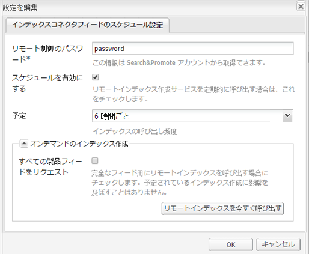

# 製品フィード {#product-feed}

AEM integrates with [Search&amp;Promote](https://www.adobe.com/solutions/testing-targeting/searchandpromote.html) and allows you to:

* 基になるリポジトリ構造やコマースプラットフォームと関係なく、e コマース API を使用する。
* Search&amp;Promote のインデックスコネクタ機能を利用して、XML 形式で製品フィードを提供する。
* Search&amp;Promote のリモート制御機能を利用して、製品フィードのオンデマンドリクエストまたはスケジュール済みリクエストを実行する。
* クラウドサービス設定として指定された、様々な Search&amp;Promote アカウント用のフィードを生成する。

You need to have a valid account and to [configure the connection to Search&amp;Promote](/help/sites-administering/search-and-promote.md#configuring-the-connection-to-search-promote). You also have to verify that you are using the correct [data center](/help/sites-administering/search-and-promote.md#configuring-the-data-center) and make sure that the **Remote server URI **is configured.

## 製品フィードの設定 {#set-up-the-product-feed}

まず、Web サイトのルートと、識別子属性を入力する必要があります。次の手順を実行します。

1. Search&amp;Promote 設定に移動します。
1. 「**[!UICONTROL 編集]**」をクリックします。
1. 「**[!UICONTROL インデックスコネクターフィード設定]**」タブをクリックします。
1. Enter the **[!UICONTROL Web site root]** and **[!UICONTROL Identifier attribute]**.

   >[!NOTE]
   >
   >The **[!UICONTROL Web site root]** is the root of your eCommerce website, for example `/content/geometrixx-outdoors/en`.
   >
   >The **[!UICONTROL Identifier attribute]** is a JCR property that uniquely identifies the product: `identifier`.

1. 「**[!UICONTROL OK]**」をクリックします。

また、製品フィードを生成するには、Web コンソールで 2 つの設定を編集する必要があります。

### Geometrixx 用 Day CQ Search&amp;Promote 製品クローラ実装の設定 {#configuring-the-day-cq-search-promote-products-crawler-implementation-for-geometrixx}

1. [http://localhost:4502/system/console/configMgr](http://localhost:4502/system/console/configMgr) に移動します。
1. 「**[!UICONTROL Day CQ Search&amp;Promote products crawler implementation for Geometrixx]**」をクリックします。
1. このクローラをリンクする Search&amp;Promote アカウント番号を指定します。アカウント番号は、このクローラが使用するクラウドサービス設定の検索に使用されます。
1. 「**[!UICONTROL Save]**」をクリックします。

### Geometrixx 用 Day CQ Search&amp;Promote 製品フィードジェネレーターの設定 {#configuring-the-day-cq-search-promote-products-feed-generator-for-geometrixx}

1. [http://localhost:4502/system/console/configMgr](http://localhost:4502/system/console/configMgr) に移動します。
1. 「**[!UICONTROL Day CQ Search&amp;Promote products feed generator for Geometrixx]**」をクリックします。
1. このジェネレーターをリンクする Search&amp;Promote アカウント番号を指定します。アカウント番号は、このジェネレーターが使用するクラウドサービス設定の検索に使用されます。
1. 「**[!UICONTROL Save]**」をクリックします。

## 製品フィードのスケジュール設定 {#schedule-the-product-feed}

スケジュール済みフィード生成を有効にするには、そのためのスケジューラーを設定する必要があります。スケジューラーは、特定の Search&amp;Promote クラウドサービス設定の子設定として設定されます。

1. Search&amp;Promote 設定に移動します。
1. 「**[!UICONTROL スケジューラー設定]**」の横の「**[!UICONTROL +]**」をクリックします。
1. Enter a **[!UICONTROL Title]** that is recognizable to page authors, and a unique **[!UICONTROL Name]**.
1. 「**[!UICONTROL 作成]**」をクリックします。ダイアログが表示されます。

   

1. Enter the **[!UICONTROL Remote Control Password]**. これは、Search&amp;Promote アカウントで設定したパスワードです。

   >[!NOTE]
   >
   >Search&amp;Promote アカウントのパスワードではありません。You can find and change this password by logging into your Search&amp;Promote account and going to **[!UICONTROL Index]** and then to **[!UICONTROL Remote control]**.

1. 「**[!UICONTROL スケジュールを有効にする]**」ボックスをオンにします。
1. **[!UICONTROL スケジュール]**&#x200B;を選択します。これは、実際のフィード生成スケジュールです。
1. 「**[!UICONTROL オンデマンドのインデックス作成]**」を有効にします（または有効にしません）。この機能は、Search&amp;Promote のインデックスを手動で呼び出すために使用されます。If **[!UICONTROL Request full products feed]** is checked, Search&amp;Promote will request a full products feed. それ以外の場合は、増分製品フィードがリクエストされます。

   >[!NOTE]
   >
   >オンデマンドのインデックス作成機能は、Search&amp;Promote のリモート制御機能を利用します。リモートインデックス作成が呼び出されると、インデックス作成がただちに開始されるわけではありませんが、リモート制御機能を使用して、インデックス作成リクエストが Search&amp;Promote に送信されます。

1. 「**[!UICONTROL OK]**」をクリックします。

Now that you configured everything, you can see an XML page containing all the products under the configured web site root: [http://localhost:4502/etc/commerce/searchpromote/feed/full](http://localhost:4502/etc/commerce/searchpromote/feed/full).
