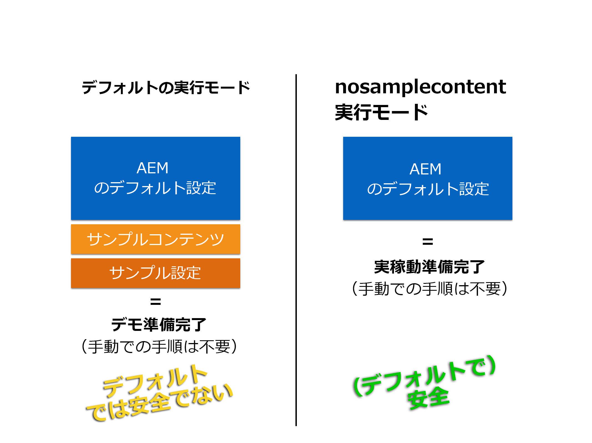

# 実稼動準備モードでの AEM の実行{#running-aem-in-production-ready-mode}

With AEM 6.1, Adobe introduces the new `"nosamplecontent"` runmode aimed at automating the steps required to prepare an AEM instance for deployment in a production environment.

この新しい実行モードは、セキュリティチェックリストに記載されているセキュリティのベストプラクティスに従うようにインスタンスを自動的に設定するだけでなく、サンプルの Geometrixx アプリケーションと設定をプロセスですべて削除します。

>[!NOTE]
>
>実用的な理由から、AEM の実稼動準備モードはインスタンスの保護に必要な大部分のタスクにのみ対応しているので、実稼動環境で運用を開始する前に[セキュリティチェックリスト](/help/sites-administering/security-checklist.md)を確認しておくことを強くお勧めします。
>
>また、AEM を実稼動準備モードを実行すると CRXDE Lite へのアクセスが無効になります。デバッグのためにアクセスする必要がある場合は、[AEM での CRXDE Lite の有効化](/help/sites-administering/enabling-crxde-lite.md)を参照してください。



In order to run AEM in production ready mode all you need to do is add the `nosamplecontent` via the `-r` runmode switch to your existing startup arguments:

```shell
java -jar aem-quickstart.jar -r nosamplecontent
```

例えば次に示すように、実稼動準備モードを使用して、MongoDB 永続性を備えたオーサーインスタンスを起動できます。

```shell
java -jar aem-quickstart.jar -r author,crx3,crx3mongo,nosamplecontent -Doak.mongo.uri=mongodb://remoteserver:27017 -Doak.mongo.db=aem-author
```

## 実稼動準備モードによる変更点 {#changes-part-of-the-production-ready-mode}

具体的には、AEM を実稼動準備モードで実行すると、次の設定が変更されます。

1. 実稼動準備モードでは、**CRXDE サポートバンドル**（`com.adobe.granite.crxde-support`）がデフォルトで無効になります。このバンドルは、アドビの Maven 公開リポジトリからいつでもインストールできます。AEM 6.1 に必要なバージョンは 3.0.0 です。

1. **Apache Sling Simple WebDAV Access To Repositories**（`org.apache.sling.jcr.webdav`）バンドルはオーサーインスタンスでのみ使用できます。****

1. 新しく作成されたユーザーは、初回ログイン時にパスワードを変更する必要があります。これは admin ユーザーには適用されません。
1. **Apache Java Script Handler** では、「**Generate Debug Info**」が無効になります。

1. **Apache Sling JSP Script Handler** では、「**Mapped Content**」と「**Generate Debug Info**」が無効になります。

1. **Day CQ WCM Filter** は、`edit`オーサー&#x200B;**インスタンスでは**   に設定され、`disabled`パブリッシュ&#x200B;**インスタンスでは** に設定されます。

1. **Adobe Granite HTML ライブラリマネージャー**&#x200B;は次のように設定されます。

   1. **縮小：** `enabled`
   1. **デバッグ:** `disabled`
   1. **Gzip:** `enabled`
   1. **タイミング：** `disabled`

1. **Apache Sling GET Servlet** は、次に示すセキュアな設定をサポートするようにデフォルトで設定されます。

| **設定** | **オーサー** | **パブリッシュ** |
|---|---|---|
| TXT rendition | disabled | disabled |
| HTML rendition | disabled | disabled |
| JSON rendition | enabled | enabled |
| XML rendition | disabled | disabled |
| json.maximumresults | 1000 | 100 |
| Auto Index | disabled | disabled |

