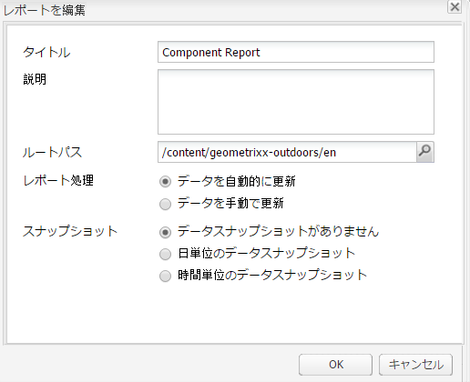

# レポート {#reporting}

インスタンスの状態を監視および分析しやすいように、AEM ではデフォルトのレポートが提供されており、個々の要件に合わせて設定できます。

* [コンポーネントのレポート](#component-report)
* [ディスク使用量](#disk-usage)
* [ヘルスチェック](#health-check)
* [ページアクティビティレポート](#page-activity-report)
* [ユーザー生成コンテンツレポート](#user-generated-content-report)
* [ユーザーレポート](#user-report)
* [ワークフローインスタンスレポート](#workflow-instance-report)
* [ワークフローレポート](#workflow-report)

レポートはすべて&#x200B;**ツール**&#x200B;コンソールからアクセスできます。左側のウィンドウで「**レポート**」を選択し、右側のウィンドウで必要なレポートをダブルクリックして、表示用や設定用に開きます。

レポートの新しいインスタンスも、**ツール**&#x200B;コンソールから作成できます。左側のウィンドウで「**レポート**」を選択し、ツールバーから「**新規**」を選択します。「**タイトル**」と「**名前**」を定義し、必要なレポートタイプを選択して、「**作成**」をクリックします。新しいレポートインスタンスがリストに表示されます。これをダブルクリックして開き、サイドキックからコンポーネントをドラッグして最初の列を作成し、レポートの定義を開始します。

>[!NOTE]
>
>標準で用意されている AEM のレポートに加えて、[独自の（まったく新しい）レポートを開発](/help/sites-developing/dev-reports.md)できます。

## レポートのカスタマイズの基本 {#the-basics-of-report-customization}

様々な書式のレポートを使用できます。次のレポートはすべて、以下の節の説明に従ってカスタマイズできる列を使用します。

* [コンポーネントのレポート](#component-report)
* [ページアクティビティレポート](#page-activity-report)
* [ユーザー生成コンテンツレポート](#user-generated-content-report)
* [ユーザーレポート](#user-report)
* [ワークフローインスタンスレポート](#workflow-instance-report)

>[!NOTE]
>
>以下のレポートにはそれぞれ、独自の書式とカスタマイズがあります。
>
>
>* [ヘルスチェック](#health-check)は、選択フィールドを使用してレポート対象のデータを指定します。
>* [ディスク使用量](#disk-usage)は、リンクを使用してリポジトリ構造をドリルダウンします。
>* [ワークフローレポート](/help/sites-administering/reporting.md#workflow-report)は、インスタンスで実行中のワークフローの概要を示します。

>
>
したがって、列の設定に関する以下の手順は該当しません。詳しくは、個々のレポートの説明を参照してください。

### データ列の選択と配置 {#selecting-and-positioning-the-data-columns}

標準レポートでもカスタマイズしたレポートでも、列の追加や再配置、削除が可能です。

サイドキックの「**コンポーネント**」タブ（レポートページで使用可能）に、列として選択可能なデータのすべてのカテゴリがリストされています。

データの選択を変更するには：

* 新しい列を追加するには、必要なコンポーネントをサイドキックからドラッグして、必要な場所にドロップします。

   * 緑のチェックマークは位置が有効である場合を示し、矢印のペアは正確にどこに配置されるかを示します。
   * 赤のバツ印は、位置が無効である場合を示します。

* 列を移動するには、ヘッダーをクリックし、マウスボタンを押したまま新しい場所までドラッグします。
* 列を削除するには、列のタイトルをクリックし、マウスボタンを押したまま上のレポートヘッダー領域までドラッグします（赤のマイナス記号は位置が有効でないことを示します）。マウスボタンを放すと、列を本当に削除するかどうかの確認を要求するコンポーネントを削除ダイアログが表示されます。

### 列のドロップダウンメニュー {#column-drop-down-menu}

レポート内の列にはそれぞれドロップダウンメニューがあります。これは、列のタイトルセル上にマウスカーソルを移動すると表示されます。

タイトルセルの右端に矢印が表示されます（タイトルテキストのすぐ右側にある、[現在の並べ替えメカニズム](#sorting-the-data)を示す矢印と混同しないでください）。

メニューで使用可能なオプションは、列の設定（プロジェクト開発時におこなったもの）によって異なり、無効なオプションはグレー表示されます。

### Sorting the Data {#sorting-the-data}

データは、特定の列に従って、以下のいずれかの方法で並べ替えできます。

* 該当する列ヘッダーをクリック。クリックするたびに昇順と降順が切り替わり、タイトルテキストのすぐ横にある矢印で示されます。
* [列のドロップダウンメニュー](#column-drop-down-menu)を使用して「**昇順に並べ替え**」または「**降順に並べ替え**」を選択。この場合も、タイトルテキストのすぐ横にある矢印で示されます。

### グループと現在のデータチャート {#groups-and-the-current-data-chart}

適切な列で、**列のドロップダウンメニュー**&#x200B;から「[この列でグループ化](#column-drop-down-menu)」を選択できます。これにより、対象の列内のそれぞれの値に従ってデータがグループ化されます。グループ化する列は複数選択できます。列内のデータが不適切な場合は、このオプションがグレーアウトされます。各エントリがまったく別個のものであり、一意である場合は、グループを形成できません。例えば、ユーザーレポートの「ユーザー ID」列などがこれに該当します。

少なくとも 1 つの列がグループ化されたら、**現在のデータ**&#x200B;の円グラフがこのグループ化に基づいて生成されます。複数の列がグループ化される場合は、そのことがグラフにも示されます。

円グラフの上にカーソルを移動すると、該当するセグメントの集計値が表示されます。ここでは、数、最小、平均など、列に関して現在定義されている集計が使用されます。

### フィルターと集計 {#filters-and-aggregates}

該当する列では、[列のドロップダウンメニュー](#column-drop-down-menu)から、**フィルター設定**&#x200B;や&#x200B;**集計**&#x200B;も設定できます。

#### フィルター {#filters}

フィルター設定では、表示するエントリの条件を指定できます。使用可能な演算子は次のとおりです。

* `contains`
* `equals`

フィルターを設定するには：

1. 必要な演算子をドロップダウンリストから選択します。
1. フィルター条件とするテキストを入力します。
1. 「**適用**」をクリックします。

フィルターをアクティベート解除するには：

1. フィルターテキストを削除します。
1. 「**適用**」をクリックします。

#### 集計 {#aggregates}

集計方法（選択している列によって異なる）も選択できます。

### 列のプロパティ {#column-properties}

このオプションは、[ユーザーレポート](#generic-column)で[汎用列](#user-report)が使用されたことがある場合にのみ使用できます。

### Historic data {#historic-data}

時間の経過に伴うデータの変化のチャートを、**履歴データ**&#x200B;で確認できます。これは、一定間隔で作成されたスナップショットから得られます。

データは次のように処理されます。

* 使用可能であれば最初に並べ替えられた列、または最初の（グループ化されていない）列によって収集されます。
* 該当する列を基準としてグループ化されます。

レポートは次の手順で生成できます。

1. 必要な列で&#x200B;**グループ化**&#x200B;を設定します。
1. 設定を&#x200B;**編集**&#x200B;して、スナップショット作成の頻度（時間単位または日単位）を定義します。
1. **完了…** スナップショットのコレクションを開始する定義。

   左上の赤/緑のスライダ・ボタンは、スナップショットが収集されるタイミングを示します。

結果のチャートが右下に表示されます。

データ収集が開始されたら、以下を選択できます。

* **期間**

   表示するレポートデータの開始日と終了日を選択できます。

* **間隔**

   月、週、日、時間を選択して、レポートの規模と集計を行うことができます。

   例えば、2011年2月に日別スナップショットが使用可能な場合：

   * If the interval is set to `Day`, each snapshot is shown as a single value in the chart.
   * If the interval is set to `Month`, all snapshots for February are aggregated into a single value (displayed as a single &quot;dot&quot; in the chart).

要件を選択し、「**設定**」をクリックしてレポートに適用します。スナップショットがさらに作成された後に表示を更新するには、「**設定**」を再度クリックします。

スナップショットを収集中に、以下の処理が可能です。

* コレクションを再初期化するには、 **「完了」を再度使用し** ます。

   **レポートの構造を** 「フリーズ」する（レポートに割り当てられ、グループ化、並べ替え、フィルタリングなどが行われる列） 開始がスナップショットを作成

* 「 **Edit** 」ダイアログを開き、「 **No data snapshots** 」を選択して必要な時間までコレクションを終了します。

   **編集** ：スナップショットの作成のオン/オフのみを切り替えます。 スナップショットの作成が再び有効になった場合は、最後に完了したレポートの状態が使用され、さらにスナップショットを作成できます。

>[!NOTE]
>
>Snapshots are stored under `/var/reports/...` where the remainder of the path mirrors the path of the respective report and ID created when the report was finished.
>
>
>今後必要ないと確信できる場合は、古いスナップショットを手動でパージできます。

>[!NOTE]
>
>事前設定済みのレポートは、パフォーマンスを集中的に消費するわけではありませんが、実稼働環境では毎日のスナップショットを使用することをお勧めします。 可能であれば、Webサイトにあまりアクティビティがない時間帯に毎日のスナップショットを実行します。これは、 `Daily snapshots (repconf.hourofday)` Day CQレポート設定の **パラメーターを使用して定義できます**。この設定方法の詳細は、 [OSGI設定](/help/sites-deploying/configuring-osgi.md) (OSGI Configuration)を参照してください。

#### 表示の制限 {#display-limits}

履歴データレポートは、設定可能な制限により、選択した期間の結果数に従って、外観が少々変わる場合もあります。

水平方向の線はそれぞれシリーズと呼ばれ（チャート凡例の各エントリに対応）、垂直方向のドットの列はそれぞれ集計されたスナップショットを表します。

チャートをより長期間にわたってクリーンに保つために、設定可能な制限があります。標準レポートの場合の制限は次のとおりです。

* 水平方向のシリーズ - デフォルトも、システムの最大値も `9`

* 垂直方向の集計スナップショット - デフォルトは `35`（水平方向のシリーズ 1 つあたり）

該当する制限を超えた場合は、

* ドットは表示されません。
* 履歴データチャートの凡例に、現在のデータチャートとは異なる数のエントリが表示される場合があります。

カスタマイズされたレポートでは、すべてのシリーズの&#x200B;**合計**&#x200B;値も表示できます。これはシリーズ（水平方向の線および凡例のエントリ）として表示されます。

>[!NOTE]
>
>カスタマイズされたレポートの場合は、別の方法で制限を設定できます。

### Edit (Report) {#edit-report}

「**編集**」ボタンをクリックすると、**レポートを編集**&#x200B;ダイアログが開きます。

これは、[履歴データ](#historic-data)のスナップショットを収集する期間を定義する場所の 1 つですが、その他様々な設定も定義できます。

* **タイトル**

   独自のタイトルを定義できます。

* **説明**

   独自の説明を定義できます。

* **ルートパス** (特定のレポート&#x200B;*に対してのみアクティブ*)

   レポートをリポジトリの（サブ）セクションに制限する場合に使用します。

* **レポート処理**

   * **データを自動的に更新**

      レポートデータは、レポート定義を更新するたびに更新されます。

   * **データを手動で更新**

      このオプションは、大量のデータがある場合の自動更新操作による遅延を防ぐために使用できます。

      これを選択した場合、レポート設定の一部が変更された場合にレポートデータを手動で更新する必要があります。 また、設定の一部を変更するとすぐに、レポート表が非表示になります。

      このオプションを選択すると、「 **[データを読み込み](#load-data)** 」ボタンが表示されます(レポートの「 **編集** 」の横)。 **データの読み込み** ：データを読み込み、表示されているレポートデータを更新します。

* **スナップショット**
スナップショットの作成頻度として、日単位、時間単位、まったく作成しない、のいずれかを定義できます。

### Load data {#load-data}

「**データを読み込み**」ボタンは、「**編集**」で「**[データを手動で更新](#edit-report)**」を選択している場合にのみ表示されます。

「**データを読み込み**」をクリックすると、データが再読み込みされ、レポートの表示が更新されます。

データを手動で更新することを選択すると、

1. レポート設定を変更するとすぐに、レポートデータの表が非表示になります。

   例えば、列の並べ替え方法を変更した場合、データは表示されません。

1. レポートデータを再度表示するには、「**データを読み込み**」をクリックしてデータを再読み込みする必要があります。

### 完了（レポート） {#finish-report}

レポートを&#x200B;**完了**&#x200B;すると、

* *その時点*&#x200B;のレポート定義を使用してスナップショットが作成されます（その後、スナップショットから分離されたレポート定義で作業を続行できます）。
* 既存のスナップショットはすべて削除されます。
* [履歴データ](#historic-data)用に新しいスナップショットが収集されます。

このダイアログで、生成されるレポートの独自のタイトルおよび説明を定義または更新できます。

## レポートのタイプ {#report-types}

### コンポーネントのレポート {#component-report}

コンポーネントのレポートは、Web サイトでのコンポーネントの使用方法に関する情報を提供します。

次の内容に関する[情報の列](#selecting-and-positioning-the-data-columns)があります。

* 作成者
* コンポーネントのパス
* コンポーネントの種類
* 最終変更日
* ページ

これはつまり、以下のような情報を確認できるということです。

* どのコンポーネントがどこで使用されるか。

   例えば、テスト時に役立ちます。

* 特定のコンポーネントのインスタンスの分散方法。

   これは、特定のページ(「ヘビーページ」など)でパフォーマンスの問題が発生している。

* サイトの中で、変更が頻繁におこなわれる部分とそうでない部分を特定。
* 時間の経過に伴ってページコンテンツがどのように発展するかを確認。

コンポーネントはすべて組み込み型で、製品の標準であり、プロジェクト専用です。**編集**&#x200B;ダイアログを使用すると、ユーザーはレポートの開始点を定義する&#x200B;**ルートパス**&#x200B;も設定できます。そのルートの下のすべてのコンポーネントがレポート用に考慮されます。

 

### ディスク使用量 {#disk-usage}

ディスク使用量レポートは、リポジトリ内に格納されているデータに関する情報を表示します。

レポートはリポジトリのルート（/）で始まります。特定のブランチをクリックすると、リポジトリ内をドリルダウンできます（現在のパスがレポートタイトルに反映されます）。

### ヘルスチェック {#health-check}

このレポートは、現在のリクエストログを分析します。

`<cq-installation-dir>/crx-quickstart/logs/request.log`
を使用すると、特定の期間内で最も高価なリクエストを特定できます。

レポートを生成するには、以下を指定できます。

* **期間（時間）**

   分析する時間数（過去）。

   デフォルト: `24`

* **max. 結果**

   出力行の最大数。

   デフォルト: `50`

* **max. リクエスト**

   分析する要求の最大数。

   デフォルト： `-1` (all)

* **電子メールアドレス**

   結果を電子メールアドレスに送信します。

   オプション；デフォルト：空白

* **毎日(hh:mm)に実行**

   レポートを毎日自動的に実行する時間を指定します。

   オプション；デフォルト：空白

### ページアクティビティレポート {#page-activity-report}

ページアクティビティレポートは、ページおよびそこで実行されたアクションをリストします。

次の内容に関する[情報の列](#selecting-and-positioning-the-data-columns)があります。

* ページ
* 時刻
* 型
* User

これはつまり、以下を監視できるということです。

* 最新の変更内容。
* 特定のページで作業をしている作成者。
* 最近変更されていないので、アクションが必要と思われるページ。
* 変更頻度が最大／最小のページ。
* アクティビティが最大／最小のユーザー。

The page activity report takes all its information from the audit log. By default the root path is configured to the audit log at `/var/audit/com.day.cq.wcm.core.page`.

### ユーザー生成コンテンツレポート {#user-generated-content-report}

このレポートは、コンポーネント、評価、フォーラムなど、ユーザーが生成したコンテンツに関する情報を提供します。

次の内容に関する[情報の列](#selecting-and-positioning-the-data-columns)があります。

* 日付
* IP アドレス
* ページ
* リファラー
* 型
* ユーザー識別子

次のことが可能です。

* 最もコメントの多いページを確認。
* 特定のサイト訪問者が残しているすべてのコメントの概要を把握（問題が関係している可能性あり）。
* ページにコメントが残された時期を監視することにより、新しいコンテンツがコメントを誘発しているかどうかを判断。

### ユーザーレポート {#user-report}

このレポートは、アカウントやプロファイルを登録済みのすべてのユーザーに関する情報を提供します。これには組織内の作成者と外部訪問者の両方が含まれます。

次の内容に関する[情報の列](#selecting-and-positioning-the-data-columns)（適宜）があります。

* 年齢
* 国
* ドメイン
* 電子メール
* 姓
* 性別
* [汎用](#generic-column)
* 名
* 情報
* 興味
* 言葉遣い
* NTLM ハッシュコード
* ユーザー ID

次のことが可能です。

* ユーザーの人口統計上の分布を確認。
* プロファイルに追加したカスタマイズフィールドに関して報告。

#### Generic Column {#generic-column}

**汎用**&#x200B;列は、ユーザーレポート内で、通常は[ユーザープロファイル](/help/sites-administering/identity-management.md#profiles-and-user-accounts)からカスタマイズされた情報にアクセスするために使用できます。例えば、[「プロファイル定義へのフィールドの追加」で説明されている「好きな色」](/help/sites-administering/identity-management.md#adding-fields-to-the-profile-definition)などです。

汎用列ダイアログは、次のいずれかの操作で開きます。

* 汎用コンポーネントをサイドキックからレポートへドラッグ。
* 既存の汎用列の「列のプロパティ」を選択。

「**定義**」タブから、以下を定義できます。

* **タイトル**

   汎用列の独自のタイトル。

* **プロパティ**

   リポジトリに格納されるプロパティ名(通常はユーザーのプロファイル内)。

* **パス**

   Usually the property is taken from the `profile`.

* **型**

   、、 `String`、からフィールドタイプを選択し `Number`ま `Integer``Date`す。

* **デフォルト集計**

   これは、少なくとも1つの列がグループ化されたレポートで列のグループが解除された場合にデフォルトで使用される集計を定義します。 必要な集計を、、、、、 `Count`から選択し `Minimum`ま `Average``Maximum``Sum`す。

   例えば、フ *ィールドの* カウント `String` ( `String` Count)とは、集計状態の列に対して個別の値の数が表示されることを意味します。

「**拡張**」タブでは、使用可能な集計およびフィルターも定義できます。

### ワークフローインスタンスレポート {#workflow-instance-report}

実行中と完了済みの両方のワークフローの個々のインスタンスに関する情報を提供することにより、簡潔な概要を提供します。

次の内容に関する[情報の列](#selecting-and-positioning-the-data-columns)があります。

* 完了
* デュレーション
* イニシエーター
* モデル
* ペイロード
* 開始済み
* ステータス

これはつまり、次のことが可能ということです。

* ワークフローの平均の期間を監視。定期的に発生する場合は、ワークフローに問題がある可能性があります。

### ワークフローレポート {#workflow-report}

現在のインスタンスで実行されているワークフローに関する重要な統計を提供します。

## パブリッシュ環境でのレポートの使用 {#using-reports-in-a-publish-environment}

特定の要件に合わせてレポートの設定を完了したら、レポートをアクティベートして、設定をパブリッシュ環境に転送できます。

>[!CAUTION]
>
>パブリッシュ環境用に&#x200B;**履歴データ**&#x200B;が必要な場合は、オーサー環境でレポートを&#x200B;**完了**&#x200B;してからページをアクティベートします。

該当するレポートは次の場所でアクセス可能になります。

`/etc/reports`

例えば、ユーザー生成コンテンツレポートは次の場所で見つかります。

`http://localhost:4503/etc/reports/ugcreport.html`

これは今後、パブリッシュ環境から収集されたデータに関するレポートとなります。

パブリッシュ環境ではレポートの設定はできないので、「**編集**」ボタンと「**完了**」ボタンは使用できません。ただし、スナップショットが収集されている場合は、**履歴データ**&#x200B;レポート用に「**期間**」と「**間隔**」を選択できます。

>[!CAUTION]
>
>これらのレポートへのアクセスはセキュリティ上の問題となる場合があります。したがって、外部訪問者が使用できないようにディスパッチャーを設定するこ `/etc/reports` とをお勧めします。 詳しくは、[セキュリティチェックリスト](security-checklist.md)を参照してください。

## レポートの実行に必要な権限 {#permissions-needed-for-running-reports}

必要な権限はアクションによって異なります。

* レポートデータは基本的に、現在のユーザーの権限を使用して収集されます。
* 履歴データは、レポートを完了したユーザーの権限を使用して収集されます。

標準の AEM インストールでは、レポートごとに以下の権限がプリセットされています。

* **ユーザーレポート**

   `user administrators`  — 読み取りと書き込み

* **ページアクティビティレポート**

   `contributors`  — 読み取りと書き込み

* **コンポーネントのレポート**

   `contributors`  — 読み取りと書き込み

* **ユーザー生成コンテンツレポート**

   `contributors`  — 読み取りと書き込み

* **ワークフローインスタンスレポート**

   `workflow-users`  — 読み取りと書き込み

`administrators` グループのメンバーは全員が、新しいレポートの作成に必要な権限を持っています。
