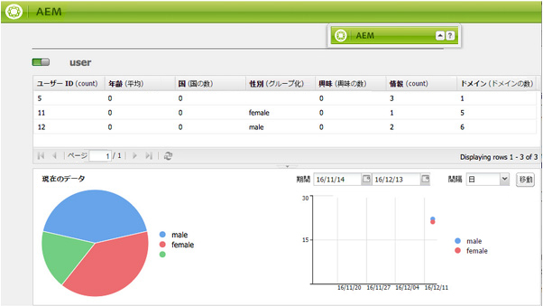

# レポート {#reporting}

インスタンスの状態を監視および分析しやすいように、Adobe Experience Manager（AEM）にはデフォルトのレポートが用意されており、個々の要件に合わせて設定できます。

* [コンポーネントのレポート](#component-report)
* [ディスク使用量](#disk-usage)
* [ヘルスチェック](#health-check)
* [ページアクティビティレポート](#page-activity-report)
* [ユーザー作成コンテンツレポート](#user-generated-content-report)
* [ユーザーレポート](#user-report)
* [ワークフローインスタンスレポート](#workflow-instance-report)
* [ワークフローレポート](#workflow-report)

>[!NOTE]
>
>これらのレポートは、クラシック UI でのみ使用できます。最新の UI でのシステム監視とレポートについては、[操作ダッシュボード](/help/sites-administering/operations-dashboard.md)を参照してください。

すべてのレポートには、**ツール**&#x200B;コンソールからアクセスできます。左側のパネルで「**レポート**」を選択し、右側のパネルで必要なレポートをダブルクリックすると、レポートを開いて表示、設定、またはその両方を行うことができます。

レポートの新しいインスタンスは、**ツール**&#x200B;コンソールから作成することもできます。左側のパネルで「**レポート**」を選択し、ツールバーから「**新規...**」を選択します。「**タイトル**」および「**名前**」を定義して、必要なレポートタイプを選択し、「**作成**」をクリックします。新しいレポートインスタンスがリストに表示されます。これをダブルクリックして開き、サイドキックからコンポーネントをドラッグすると、最初の列を作成してレポート定義を開始できます。

>[!NOTE]
>
>標準で用意されている AEM のレポートに加えて、[独自の（新規）レポートを開発](/help/sites-developing/dev-reports.md)できます。

## レポートのカスタマイズの基本 {#the-basics-of-report-customization}

様々な書式のレポートを使用できます。次のレポートはすべて、以下の節の説明に従ってカスタマイズできる列を使用します。

* [コンポーネントのレポート](#component-report)
* [ページアクティビティレポート](#page-activity-report)
* [ユーザー作成コンテンツレポート](#user-generated-content-report)
* [ユーザーレポート](#user-report)
* [ワークフローインスタンスレポート](#workflow-instance-report)

>[!NOTE]
>
>以下のレポートにはそれぞれ独自の形式とカスタマイズがあります。
>
>
>* [ヘルスチェック](#health-check)は、選択フィールドを使用してレポート対象のデータを指定します。
>* [ディスク使用状況](#disk-usage)は、リンクを使用してリポジトリ構造をドリルダウンします。
>* [ワークフロー](/help/sites-administering/reporting.md#workflow-report)は、インスタンスで実行中のワークフローの概要を表示します。
>
>したがって、以下の列設定の手順は適切ではありません。詳しくは、個々のレポートの説明を参照してください。

### データ列の選択と配置 {#selecting-and-positioning-the-data-columns}

標準レポートでもカスタマイズしたレポートでも、列の追加や再配置、削除が可能です。

サイドキックの「**コンポーネント**」タブ（レポートページで使用可能）に、列として選択可能なデータのすべてのカテゴリがリストされています。

データの選択を変更するには、以下の手順を実行します。

* 新しい列を追加するには、必要なコンポーネントをサイドキックからドラッグして、必要な場所にドロップします

   * 緑のチェックマークは位置が有効である場合を示し、矢印のペアは正確にどこに配置されるかを示します
   * 赤のバツ印は、位置が無効である場合を示します

* 列を移動するには、ヘッダーをクリックし、マウスボタンを押したまま新しい位置までドラッグします
* 列を削除するには、列タイトルをクリックし、押したまま、レポートのヘッダー領域までドラッグします（赤いマイナス記号は位置が有効でないことを示します）。マウスボタンを放すと、コンポーネントを削除ダイアログボックスに、列を削除することを確認するメッセージが表示されます。

### 列のドロップダウンメニュー {#column-drop-down-menu}

レポート内の列にはそれぞれドロップダウンメニューがあります。これは、列のタイトルセル上にマウスカーソルを移動すると表示されます。

タイトルセルの右端に矢印が表示されます（タイトルテキストのすぐ右側にある、[現在の並べ替えメカニズム](#sorting-the-data)を示す矢印と混同しないでください）。

メニューで使用可能なオプションは、列の設定（プロジェクト開発時に行ったもの）によって異なり、無効なオプションは暗く表示（グレー表示）されます。

### データの並べ替え {#sorting-the-data}

データは、特定の列に従って、以下のいずれかの方法で並べ替えできます。

* 該当する列ヘッダーをクリック。クリックするたびに昇順と降順が切り替わり、タイトルテキストのすぐ横にある矢印で示されます。
* [列のドロップダウンメニュー](#column-drop-down-menu)を使用して「**昇順に並べ替え**」または「**降順に並べ替え**」を選択します。この場合も、タイトルテキストのすぐ横にある矢印で示されます。

### グループと現在のデータチャート {#groups-and-the-current-data-chart}

適切な列で、[列のドロップダウンメニュー](#column-drop-down-menu)から「**この列でグループ化**」を選択できます。これにより、対象の列内のそれぞれの値に従ってデータがグループ化されます。グループ化する列は複数選択できます。列内のデータが不適切な場合、オプションは暗く（グレー表示）表示されます。つまり、すべてのエントリは個別で一意なので、グループを形成できません。例えば、ユーザーレポートの「ユーザー ID」列などです。

少なくとも 1 つの列がグループ化されると、このグループ化に基づいて&#x200B;**現在のデータ**&#x200B;の円グラフが生成されます。複数の列がグループ化される場合は、そのことがグラフに示されます。

円グラフ上にカーソルを移動すると、該当するセグメントの集計値が表示されます。この場合は、列に対して現在定義されている集計（カウント、最小、平均など）が使用されます。

### フィルターと集計 {#filters-and-aggregates}

該当する列では、[列のドロップダウンメニュー](#column-drop-down-menu)から、「**フィルター設定**」や「**集計**」も設定できます。

#### フィルター {#filters}

フィルター設定では、表示するエントリの条件を指定できます。使用可能な演算子は次のとおりです。

* `contains`
* `equals`

フィルターを設定するには：

1. 必要な演算子をドロップダウンリストから選択します。
1. フィルター条件とするテキストを入力します。
1. 「**適用**」をクリックします。

フィルターをアクティベート解除するには：

1. フィルターテキストを削除します。
1. 「**適用**」をクリックします。

#### 集計 {#aggregates}

集計方法（選択している列によって異なる）も選択できます。

### 列のプロパティ {#column-properties}

このオプションは、[ユーザーレポート](#user-report)で[汎用列](#generic-column)が使用されたことがある場合にのみ使用できます。

### 履歴データ {#historic-data}

時間の経過に伴うデータの変化を示すグラフは&#x200B;**履歴データ**&#x200B;にあります。これは、一定の間隔で作成されたスナップショットから得られます。

データは次のように処理されます。

* 使用可能であれば最初に並べ替えられた列、または最初の（グループ化されていない）列によって収集されます。
* 該当する列を基準としてグループ化されます。

レポートは次の手順で生成できます。

1. 必要な列で&#x200B;**グループ化**&#x200B;を設定します。
1. 時間別または日別のスナップショットを定義できるように設定を&#x200B;**編集**&#x200B;します。
1. **完了…** スナップショットの収集を開始する定義。

   左上の赤と緑のスライダーボタンは、スナップショットが収集されるタイミングを示します。

結果のチャートが右下に表示されます。

データ収集が開始されたら、以下を選択できます。

* **期間**

  レポートデータを表示する開始日と終了日を選択できます。

* **間隔**

  レポートの目盛りと集計には、月、週、日、時間を選択できます。

  例えば、2011年2月に日別のスナップショットを利用できる場合は、次のようになります。

   * 間隔が `Day` に設定されている場合、各スナップショットが単一の値としてチャートに表示されます。
   * 間隔が `Month` に設定されている場合、2月のすべてのスナップショットが単一の値に集計（チャートに単一の「ドット」として表示）されます。

要件を選択し、「**設定**」をクリックしてレポートに適用します。スナップショットがさらに作成された後に表示を更新するには、「**設定**」を再度クリックします。

スナップショットを収集中に、以下の処理が可能です。

* コレクションを再初期化するには、「**完了**」を再度使用します。

  「**完了**」では、レポートの構造（レポートに割り当てられ、グループ化、並べ替え、フィルタリングなどが行われた列）を「フリーズ」し、スナップショットの作成を開始します。

* **編集**&#x200B;ダイアログボックスが開くので、「**データスナップショットがありません**」を選択して、必要になるまでコレクションを停止します。

  **編集**&#x200B;は、スナップショットの取得のオンやオフを切り替えるだけです。スナップショットの取得が再度オンになった場合は、さらにスナップショットを取得するために最後に完了した時点のレポートの状態が使用されます。

>[!NOTE]
>
>スナップショットは `/var/reports/...` に格納されます。パスの残りの部分は、レポート完了時に作成されたそれぞれのレポートと ID のパスを反映しています。
>
>
>古いスナップショットは、今後必要ないと確信できる場合は、手動でパージできます。

>[!NOTE]
>
>事前設定済みのレポートはパフォーマンスを集中的に消費しませんが、実稼動環境では毎日のスナップショットを使用することをお勧めします。可能であれば、Web サイト上でのアクティビティが少ない時間帯に、これらの毎日のスナップショットを実行します。これは **Day CQ Reporting Configuration**&#x200B;の `Daily snapshots (repconf.hourofday)` パラメータで定義できます。OSGi を設定する方法の詳細に関しては [OSGi 設定](/help/sites-deploying/configuring-osgi.md)を参照してください。

#### 表示の制限 {#display-limits}

履歴データレポートの表示方法には、制限が設定される場合があるので、選択した期間の結果数に応じて表示方法が若干変わることがあります。

水平方向の各線はシリーズと呼ばれ（チャート凡例の各エントリに対応）、垂直方向のドットの列はそれぞれ集計されたスナップショットを表します。

チャートをより長期間にわたってクリーンに保つために、制限が設定される場合があります。標準レポートの場合の制限は次のとおりです。

* 水平方向のシリーズ - デフォルトも、システムの最大値も `9`

* 垂直方向の集計スナップショット - デフォルトは `35`（水平方向のシリーズあたり）

したがって、（適切な）制限を超えた場合は次のようになります。

* ドットは表示されません。
* 履歴データグラフの凡例には、現在のデータグラフとは異なる数のエントリが表示される場合があります。

カスタマイズされたレポートでは、すべてのシリーズの&#x200B;**合計**&#x200B;値も表示できます。これはシリーズ（水平方向の線および凡例のエントリ）として表示されます。

>[!NOTE]
>
>カスタマイズされたレポートの場合は、別の制限が設定される場合があります。

### 編集（レポート） {#edit-report}

「**編集**」ボタンをクリックすると、**レポートを編集**&#x200B;ダイアログが開きます。

これは、[履歴データ](#historic-data)のスナップショットを収集する期間を定義する場所の 1 つですが、その他様々な設定も定義できます。

* **タイトル**

  独自のタイトルを定義できます。

* **説明**

  独自の説明を定義できます。

* **ルートパス**（*特定のレポートでのみ有効*）

  レポートをリポジトリの（サブ）セクションに制限する場合に使用します。

* **レポート処理**

   * **データを自動的に更新**

     レポート定義を更新するたびに、レポートデータが更新されます。

   * **データを手動で更新**

     このオプションは、大量のデータがある場合の自動更新操作による遅延を防ぐために使用できます。

     これを選択すると、レポート設定のいずれかの側面が変更された場合に、レポートデータを手動で更新する必要があることを示します。また、設定の任意の要素を変更すると、レポートテーブルは空白になります。

     これを選択するとレポートの「**編集**」の横に「**[データを読み込み](#load-data)**」ボタンが表示されます。「**データを読み込み**」によってデータを読み込み、表示されているレポートデータを更新します。

* **スナップショット**
スナップショットの作成頻度として、日単位、時間単位、まったく作成しない、のいずれかを定義できます。

### データを読み込み {#load-data}

「**データを読み込み**」ボタンは、「**[編集](#edit-report)**」で「**データを手動で更新**」を選択している場合にのみ表示されます。

「**データを読み込み**」をクリックすると、データが再読み込みされ、レポートの表示が更新されます。

データを手動で更新することを選択すると、

1. レポート設定を変更したときに、レポートデータのテーブルが空白になります。

   例えば、列の並べ替えメカニズムを変更した場合、データは表示されません。

1. レポートデータを再度表示する場合は、「**データを読み込み**」をクリックして、データを再読み込みします。

### 完了（レポート） {#finish-report}

レポートを&#x200B;**完了**&#x200B;すると、

* *その時点での*&#x200B;レポート定義は、スナップショットの取得に使用されます。その後、レポート定義の作業を継続できます。レポート定義はスナップショットとは独立しているためです。
* 既存のスナップショットはすべて削除されます。
* [履歴データ](#historic-data)用に新しいスナップショットが収集されます。

このダイアログボックスで、生成されるレポートの独自のタイトルおよび説明を定義したり、更新したりできます。

## レポートのタイプ {#report-types}

### コンポーネントレポート {#component-report}

コンポーネントのレポートは、web サイトでのコンポーネントの使用方法に関する情報を提供します。

次の内容に関する[情報の列](#selecting-and-positioning-the-data-columns)があります。

* 作成者
* コンポーネントのパス
* コンポーネントのタイプ
* 最終変更日
* ページ

次のような情報が表示されます。

* どのコンポーネントが使用され、どこで使用されているか。

  例えば、テスト時に役立ちます。

* 特定のコンポーネントのインスタンスの配布方法。

  これは、特定のページ（「重いページ」など）で、パフォーマンスの問題が発生している場合に興味深い点となることがあります。

* サイトの中で、変更が頻繁に行われる部分とそうでない部分を特定。
* 時間の経過と共にページコンテンツがどのように発展するかを確認。

すべてのコンポーネントは含まれ、製品の標準であり、プロジェクト固有のものです。**編集**&#x200B;ダイアログを使用すると、ユーザーはレポートの開始点を定義する&#x200B;**ルートパス**&#x200B;も設定できます。そのルートの下のすべてのコンポーネントがレポート用に考慮されます。

 

### ディスク使用量 {#disk-usage}

ディスク使用量レポートは、リポジトリ内に格納されているデータに関する情報を表示します。

レポートはリポジトリのルート（/）で始まります。特定のブランチをクリックすると、リポジトリ内をドリルダウンできます（現在のパスがレポートタイトルに反映されます）。

### ヘルスチェック {#health-check}

このレポートは、現在のリクエストログを分析します。

`<cq-installation-dir>/crx-quickstart/logs/request.log`

指定された期間内で最も高価なリクエストを特定するのに役立ちます。

レポートを生成するには、以下を指定できます。

* **期間（時間）**

  分析する時間数（過去）。

  デフォルト：`24`

* **max.結果**

  出力行の最大数。

  デフォルト：`50`

* **max.リクエスト**

  分析するリクエストの最大数。

  デフォルト：`-1`（すべて）

* **メールアドレス**

  結果をメールアドレスに送信します。

  （オプション）デフォルト：空白

* **毎日（hh:mm）に実行**

  レポートを毎日自動的に実行する時間を指定します。

  （オプション）デフォルト：空白

### ページアクティビティレポート {#page-activity-report}

ページアクティビティレポートは、ページおよびそこで実行されたアクションをリストします。

次の内容に関する[情報の列](#selecting-and-positioning-the-data-columns)があります。

* ページ
* 時刻
* タイプ
* ユーザー

これはつまり、以下を監視できるということです。

* 最新の変更内容。
* 特定のページで作業をしている作成者。
* 最近変更されていないので、アクションが必要と思われるページ。
* 変更頻度が最大／最小のページ。
* アクティビティが最大／最小のユーザー。

ページアクティビティレポートは、すべての情報を監査ログから取得します。デフォルトでは、ルートパスは `/var/audit/com.day.cq.wcm.core.page` にある監査ログに設定されています。

### ユーザー作成コンテンツレポート {#user-generated-content-report}

このレポートは、コンポーネント、評価、フォーラムなど、ユーザーが生成したコンテンツに関する情報を提供します。

次の内容に関する[情報の列](#selecting-and-positioning-the-data-columns)があります。

* 日付
* IP アドレス
* ページ
* リファラー
* タイプ
* ユーザー識別子

以下のように利用できます。

* 最もコメントの多いページを確認。
* 特定のサイト訪問者が残しているすべてのコメントの概要を把握（問題が関係している可能性あり）。
* ページにコメントが残された時期を監視することにより、新しいコンテンツがコメントを誘発しているかどうかを判断。

### ユーザーレポート {#user-report}

このレポートは、アカウントやプロファイルを登録済みのすべてのユーザーに関する情報を提供します。これには組織内の作成者と外部訪問者の両方が含まれます。

次の内容に関する[情報の列](#selecting-and-positioning-the-data-columns)（適宜）があります。

* 年齢
* 国
* ドメイン
* メール
* 姓
* 性別
* [一般](#generic-column)
* 名
* 情報
* 興味
* 言語
* NTLM ハッシュコード
* ユーザー ID

以下のように利用できます。

* ユーザーの人口統計上の分布を確認。
* プロファイルに追加したカスタムフィールドに関して報告。

#### 汎用列 {#generic-column}

**汎用**&#x200B;列は、ユーザーレポート内で、通常は[ユーザープロファイル](/help/sites-administering/identity-management.md#profiles-and-user-accounts)からカスタマイズされた情報にアクセスするために使用できます。例えば、[「プロファイル定義へのフィールドの追加」で説明されている「好きな色」](/help/sites-administering/identity-management.md#adding-fields-to-the-profile-definition)などです。

汎用列ダイアログは、次のいずれかの操作で開きます。

* 汎用コンポーネントをサイドキックからレポートへドラッグ。
* 既存の汎用列の「列のプロパティ」を選択。

「**定義**」タブから、以下を定義できます。

* **タイトル**

  汎用列の、独自のタイトル。

* **プロパティ**

  リポジトリに格納されているプロパティ名（通常はユーザーのプロファイル内）。

* **パス**

  通常、プロパティは `profile` から取得されます。

* **タイプ**

   `String`、`Number`、`Integer`、`Date` の中からフィールドタイプを選択します。

* **デフォルトの集計**

  これは、少なくとも 1 つのグループ化された列を含むレポートで列のグループ化が解除された場合に、デフォルトで使用される集計を定義します。`Count`、`Minimum`、`Average`、`Maximum`、`Sum` の中から必要な集計を選択します。

  例えば、`String` フィールドの&#x200B;*カウント*&#x200B;は、集約された状態の列に個別の `String` 値の数が表示されることを意味します。

「**拡張**」タブでは、使用可能な集計およびフィルターも定義できます。

### ワークフローインスタンスレポート {#workflow-instance-report}

実行中と完了済みの両方のワークフローの個々のインスタンスに関する情報を提供することにより、わかりやすい概要を提供します。

次の内容に関する[情報の列](#selecting-and-positioning-the-data-columns)があります。

* 完了
* 期間
* イニシエーター
* モデル
* ペイロード
* 開始済み
* ステータス

次のことが可能になります。

* ワークフローの平均の期間を監視。定期的に発生する場合は、ワークフローに問題がある可能性があります。

### ワークフローレポート {#workflow-report}

現在のインスタンスで実行されているワークフローに関する重要な統計を提供します。

## パブリッシュ環境でのレポートの使用 {#using-reports-in-a-publish-environment}

特定の要件に合わせてレポートの設定を完了したら、レポートをアクティブ化して、設定をパブリッシュ環境に転送できます。

>[!CAUTION]
>
>パブリッシュ環境用に&#x200B;**履歴データ**&#x200B;が必要な場合は、オーサー環境でレポートを&#x200B;**完了**&#x200B;してからページをアクティベートします。

該当するレポートは次の場所でアクセス可能になります。

`/etc/reports`

例えば、ユーザー作成コンテンツレポートは次の場所で見つかります。

`http://localhost:4503/etc/reports/ugcreport.html`

これは今後、パブリッシュ環境から収集されたデータに関するレポートとなります。

パブリッシュ環境ではレポートの設定はできないので、「**編集**」ボタンと「**完了**」ボタンは使用できません。ただし、スナップショットが収集されている場合は、**履歴データ**&#x200B;レポート用に「**期間**」と「**間隔**」を選択できます。

>[!CAUTION]
>
>これらのレポートへのアクセスは、セキュリティ上の問題となる場合があります。したがって、外部の訪問者が `/etc/reports` を使用できないように Dispatcher を設定することをお勧めします。詳しくは、[セキュリティチェックリスト](security-checklist.md)を参照してください。

## レポートの実行に必要な権限 {#permissions-needed-for-running-reports}

必要な権限はアクションによって異なります。

* レポートデータは、現在のユーザーの権限を使用して収集されます。
* 履歴データは、レポートを完了したユーザーの権限を使用して収集されます。

標準の AEM インストールでは、レポートごとに以下の権限がプリセットされています。

* **ユーザーレポート**

  `user administrators` - 読み取りおよび書き込み

* **ページアクティビティレポート**

  `contributors` - 読み取りおよび書き込み

* **コンポーネントのレポート**

  `contributors` - 読み取りおよび書き込み

* **ユーザー作成コンテンツレポート**

  `contributors` - 読み取りおよび書き込み

* **ワークフローインスタンスレポート**

  `workflow-users` - 読み取りおよび書き込み

`administrators` グループのメンバーは全員が、レポートの作成に必要な権限を持っています。
