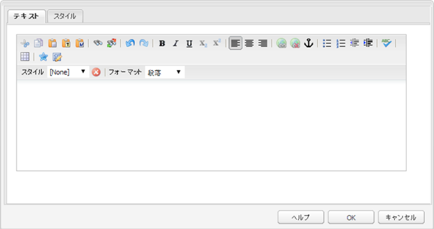

# アクセス可能なWebページとサイトを作成するためのRTEの設定 {#configure-rte-for-accessibility}

Adobe Experience Managerは、様々なアクセシビリティ標準に従って、人間標準のアクセシビリティ機能をサポートしています。 また、開発者は、リッチテキストエディター(RTE)を使用するExperience Managerコンポーネントを使用して、アクセシブルなコンテンツの作成に役立つ機能をカスタマイズまたは拡張できます。

Webページをデザインし、ページにコンテンツを追加する場合、コンテンツ開発者および作成者はRTEの機能を使用してアクセシビリティ関連の情報を提供できます。 例えば、見出しや段落要素から構造情報を追加します。

これらの機能を設定およびカスタマイズするには、コンポーネントのRTEプラグイン [を](#configure-the-plugin-features) 設定します。 例えば、このプラグインを使用すると、 `paraformat` ブロックレベルのセマンティック要素を追加できます。例えば、基本的なレベルを超えてサポートされる見出しレベルの数を拡張したり、デフォルトで `H1``H2``H3` 提供される見出しレベルの数を拡張したりできます。

RTEは、タッチ対応ユーザーインターフェイスおよびクラシックユーザーインターフェイス用の様々なコンポーネントで利用できます。 ただし、RTEを使用する主なコンポーネントは、両方のインターフェイスで使用できる **Text** コンポーネントです。 次の画像は、以下を含む様々なプラグインが有効になっているRTEを示していま `paraformat`す。


*図： タッチ対応ユーザーインターフェイスのテキストコンポーネント。*



*図： クラシックユーザーインターフェイスのテキストコンポーネント*

様々なインターフェイスで使用できるRTE機能の違いについては、「 [プラグインとその機能」を参照してください](/help/sites-administering/rich-text-editor.md#aboutplugins)。

## Configure the plugin features {#configure-the-plugin-features}

RTEを設定する詳しい手順については、「リッチテキストエディターの [設定](/help/sites-administering/rich-text-editor.md) 」ページを参照してください。 ここでは、主な手順を含むすべての問題について説明します。

* [プラグインと機能](/help/sites-administering/rich-text-editor.md#aboutplugins)。
* [設定の場所](/help/sites-administering/rich-text-editor.md#understand-the-configuration-paths-and-locations)。
* [プラグインをアクティブ化し、featuresプロパティを設定します](/help/sites-administering/rich-text-editor.md#enable-rte-functionalities-by-activating-plug-ins)。
* [RTEの他の機能を設定します](/help/sites-administering/rich-text-editor.md#enable-rte-functionalities-by-activating-plug-ins)。

By configuring a plugin within the appropriate `rtePlugins` sub-branch in CRXDE Lite, you can activate either all or specific features for that plugin.


### Example - specify paragraph formats available in RTE selection field {#example-specifying-paragraph-formats-available-in-rte-selection-field}

意味的ブロックの新しい書式を選択可能にするには、次の手順を実行します。

1. 使用している RTE によって、[設定場所](/help/sites-administering/rich-text-editor.md#understand-the-configuration-paths-and-locations)を特定し、移動します。
1. [プラグインをアクティベート](/help/sites-administering/rich-text-editor.md#enable-rte-functionalities-by-activating-plug-ins)することにより、[段落選択フィールドを有効](/help/sites-administering/rich-text-editor.md)にします。
1. [段落選択フィールドで使用可能にする書式を指定](/help/sites-administering/rich-text-editor.md)します。
1. これにより、コンテンツ作成者は、指定した段落書式を RTE の選択フィールドから選択できます。アクセス方法は次のとおりです。

   * タッチ対応UIでの段落ピルクローアイコンの使用
   * Using the **Format** field (pop-up selector) in the Classic UI.

段落書式オプションを介して RTE で構造要素を使用できるので、AEM はアクセス可能なコンテンツの開発に適した基礎を提供します。コンテンツ作成者は、RTE を使用してフォントのサイズや色、その他の関連する属性を書式設定できないので、インライン書式設定は作成できません。代わりに、見出しなどの該当する構造要素を選択し、「スタイル」オプションから選択されたグローバルスタイルを使用する必要があります。これにより、独自のスタイルシートで閲覧するユーザーにとってはマークアップがクリーンになり、オプションも多くなるほか、コンテンツの構造が正確になります。

## Use of the source edit feature {#use-of-the-source-edit-feature}

In some cases, content authors will find it necessary to examine and adjust the HTML source code created using the RTE. For example, a piece of content created within the RTE may require additional markup to ensure compliance with WCAG 2.0. This can be done with the [source edit](/help/sites-administering/rich-text-editor.md#aboutplugins) option of the RTE. プラグインで [ 機能を指定でき `sourceedit` ます `misctools`](/help/sites-administering/rich-text-editor.md#aboutplugins)。

>[!CAUTION]
>
>Use the `sourceedit` feature carefully. タイピングの誤りやサポート対象外の機能は、問題を大きくする可能性があります。

## その他のHTML要素追加と属性のサポート {#add-support-for-more-html-elements-and-attributes}

AEM のアクセシビリティ機能をさらに拡張するには、RTE に基づく既存のコンポーネント（**テキスト**&#x200B;コンポーネントや&#x200B;**テーブル**&#x200B;コンポーネント）を、要素や属性を追加して拡張することができます。

The following procedure illustrates how to extend the **Table** component with a **Caption** element that provides information about a data table to assistive technology users:

### Example - add the caption to the Table Properties dialog {#example-adding-the-caption-to-the-table-properties-dialog}

のコンストラクターで、キャプションの編集に使用するテキスト入力フィールドを追加 `TablePropertiesDialog`します。 コンテンツ `itemId` を自動的に処理するには、 `caption` （DOM属性の名前など）に設定する必要があります。

**表で**、DOM要素に対して属性を明示的に設定または削除します。 値は、 `config` オブジェクトのダイアログによって渡されます。 DOM属性は、ブラウザー実装での一般的な問題を回避するために、対応する `CQ.form.rte.Common` メソッド( `com` のショートカット `CQ.form.rte.Common`)を使用して設定または削除する必要があります。

>[!NOTE]
>
>この手順は、Classicユーザーインターフェイスにのみ適しています。

### 例 — テキストに強調を使用する場合に、アクセシブルなHTMLを作成する {#create-accessible-html-for-text}

RTEでは、およびの代わりに `strong` および `em` タグを使用でき `b` ま `i`す。 次追加のノードは、ダイアログ内の `uiSettings` およびノードの兄弟として `rtePlugins` 使用します。

```HTML
<htmlRules jcr:primaryType="nt:unstructured">
    <docType jcr:primaryType="nt:unstructured">
        <typeConfig jcr:primaryType="nt:unstructured"
                useSemanticMarkup="{Boolean}true">
            <semanticMarkupMap
                    b="strong"
                    i="em"/>
        </typeConfig>
    </docType>
</htmlRules>
```

### 詳しい手順 {#step-by-step-instructions}

1. 開始CRXDE Lite。 For example: [http://localhost:4502/crx/de/](http://localhost:4502/crx/de/)
1. コピー：

   `/libs/cq/ui/widgets/source/widgets/form/rte/commands/Table.js`

   リダイレクト先は次のとおりです。

   `/apps/cq/ui/widgets/source/widgets/form/rte/commands/Table.js`

   >[!NOTE]
   >
   >中間フォルダーが存在しない場合は、作成する必要があります。

1. コピー：

   `/libs/cq/ui/widgets/source/widgets/form/rte/plugins/TablePropertiesDialog.js`

   リダイレクト先は次のとおりです。

   `/apps/cq/ui/widgets/source/widgets/form/rte/plugins/TablePropertiesDialog.js`。

1. 次のファイルを編集用に開きます（ダブルクリックで開く）。

   `/apps/cq/ui/widgets/source/widgets/form/rte/plugins/TablePropertiesDialog.js`

1. `constructor` メソッドで、

   ```
   var dialogRef = this;
   ```

   次のコードを追加します。

   ```
   editItems.push({
       "itemId": "caption",
       "name": "caption",
       "xtype": "textfield",
       "fieldLabel": CQ.I18n.getMessage("Caption"),
       "value": (this.table && this.table.caption ? this.table.caption.textContent : "")
   });
   ```

1. 次のファイルを開きます。

   `/apps/cq/ui/widgets/source/widgets/form/rte/commands/Table.js`。

1. Add the following code at the end of the `transferConfigToTable` method:

   ```
   /**
    * Adds Caption Element
   */
   var captionElement;
   if (dom.firstChild && dom.firstChild.tagName.toLowerCase() == "caption")
   {
      captionElement = dom.firstChild;
   }
   if (config.caption)
   {
       var captionTextNode = document.createTextNode(config.caption)
       if (captionElement)
       {
          dom.replaceNode(captionElement.firstChild,captionTextNode);
       } else
       {
           captionElement = document.createElement("caption");
           captionElement.appendChild(captionTextNode);
           if (dom.childNodes.length>0)
           {
              dom.insertBefore(captionElement, dom.firstChild);
           } else
           {
              dom.appendChild(captionElement);
           }
       }
   } else if (captionElement)
   {
     dom.removeChild(captionElement);
   }
   ```

1. Save your changes using **Save All…**

>[!NOTE]
>
>プレーンテキストフィールドは、キャプション要素の値に対して許可される入力の種類ではありません。 ExtJSウィジェットを使用できます。ExtJSウィジェットは、その `getValue()` メソッドを通してキャプションの値を提供します。
>
>追加の要素および属性用に編集機能を追加するには、以下の両方を確認します。
>
>* The `itemId` property for each corresponding field is set to the name of the appropriate DOM attribute (`TablePropertiesDialog`).
>* DOM 要素で属性が設定／削除されていること（`Table`）。


>[!MORELIKETHIS]
>
>* [WCAG 2.0 クイックガイド](/help/managing/qg-wcag.md)
>* [アクセシブルなコンテンツを作成する（WCAG 2.0準拠）](/help/sites-authoring/creating-accessible-content.md)

