# Salesforce との統合 {#integrating-with-salesforce}

Salesforce と AEM を統合すると、リード管理機能を実現でき、Salesforce が標準提供している既存の機能を利用できます。AEM からリード情報を Salesforce に送信するように設定したり、Salesforce から直接データにアクセスするコンポーネントを作成できます。

AEM と Salesforce との双方向で拡張可能な統合により、次のことが可能になります。

* 組織のデータを十分に活用、更新して、カスタマーエクスペリエンスを強化する。
* マーケティングとセールスアクティビティを結び付ける。
* 組織の Salesforce データストアのデータを自動的に送受信する。

このドキュメントは次の内容について説明します。

* Salesforce クラウドサービスを設定する方法（AEM を Salesforce と連携するよう設定）
* Salesforce のリード情報や連絡先情報を ClientContext やパーソナライゼーションで使用する方法
* Salesforce のワークフローモデルを使用して、AEM ユーザーをリードとして Salesforce に送信する方法
* Salesforce のデータを表示するコンポーネントを作成する方法

## AEM を Salesforce と連携するよう設定 {#configuring-aem-to-integrate-with-salesforce}

AEM を Salesforce と連携するよう設定するには、まず Salesforce でリモートアクセスアプリケーションを設定する必要があります。次に、このリモートアクセスアプリケーションを指すように Salesforce クラウドサービスを設定します。

>[!NOTE]
>
>Salesforce に無料の開発者アカウントを作成できます。

AEM を Salesforce と連携するよう設定するには、次の手順を実行します。

>[!CAUTION]
>
>You need to install the [Salesforce Force API](https://www.adobeaemcloud.com/content/marketplace/marketplaceProxy.html?packagePath=/content/companies/public/adobe/packages/cq650/featurepack/com.adobe.cq.mcm.salesforce.content#) integration package before you continue with the procedure. For more details on how to work with packages see the [How to Work with Packages](/help/sites-administering/package-manager.md#package-share) page.

1. AEM で「**クラウドサービス**」に移動します。「サードパーティのサービス」で、「**Salesforce**」の「**今すぐ設定**」をクリックします。

   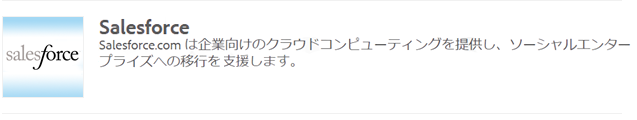

1. 新しい設定（例：**developer**）を作成します。

   >[!NOTE]
   >
   >新しい設定は、新しいページ（**http://localhost:4502/etc/cloudservices/salesforce/developer.html**）にリダイレクトします。これは、Salesforceでリモートアクセスアプリケーションを作成する際に、コールバックURLで指定する必要があるのと完全に同じ値です。 これらの値が一致しなければなりません。

1. Log in to your salesforce account (or if you do not have one, create one at [https://developer.force.com](https://developer.force.com).)
1. In Salesforce, navigate to **Create** > **Apps** to get to **Connected Apps** (in former versions of salesforce, the workflow was **Deploy** > **Remote Access**).
1. 「**New**」をクリックして、AEM と Salesforce を接続します。

   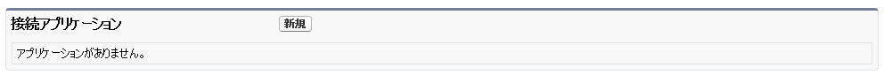

1. 「**Connected App Name**」、「**API Name**」および「**Contact Email**」を入力します。「**Enable OAuth Settings**」チェックボックスをオンにして、「**Callback URL**」を入力し、OAuth 範囲（フルアクセスなど）を追加します。The callback URL looks similar to this: `http://localhost:4502/etc/cloudservices/salesforce/developer.html`

   設定に合わせてサーバー名／ポート番号およびページ名を変更します。

   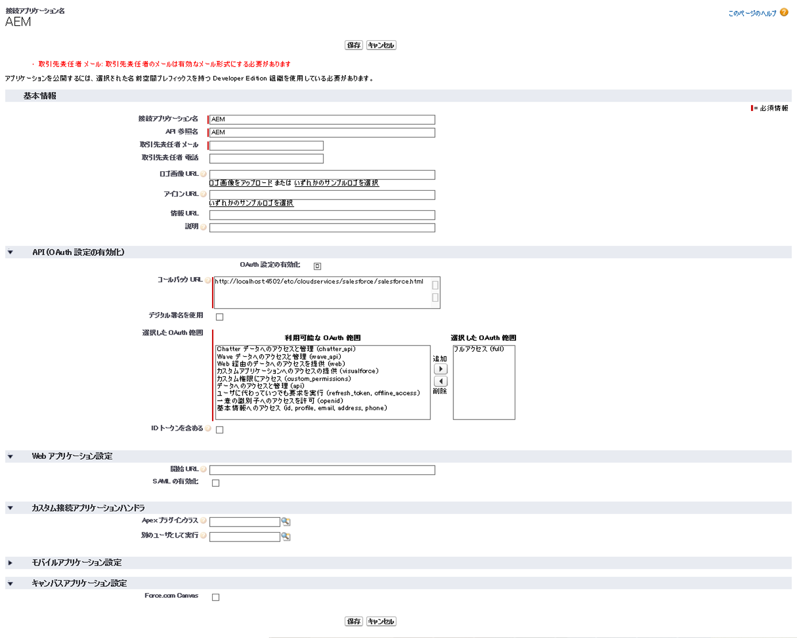

1. 「**Save**」をクリックして、Salesforce 設定を保存します。Salesforce が、AEM 設定に必要な&#x200B;**消費者キー**&#x200B;と&#x200B;**消費者の秘密鍵**&#x200B;を作成します。

   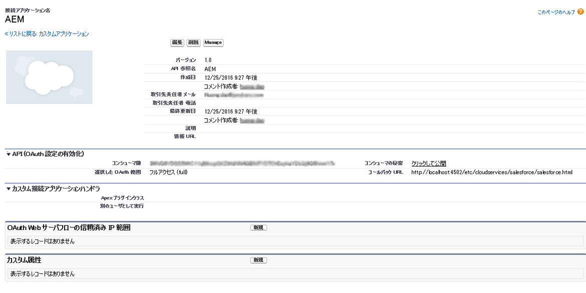

   >[!NOTE]
   >
   >Salesforce でリモートアクセスアプリケーションがアクティベートされるまで、数分（最大 15 分）待たなければならないことがあります。

1. AEM で「**クラウドサービス**」に移動し、前の手順で作成した Salesforce 設定（例：**developer**）に移動します。「**編集**」をクリックし、salesforce.com から顧客鍵と顧客秘密鍵を入力します。

   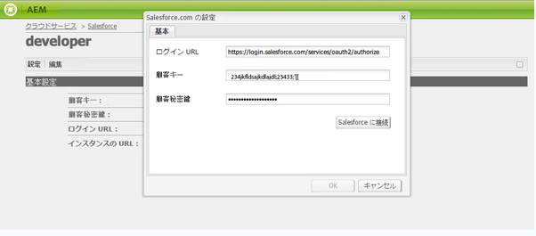

   | ログイン URL | Salesforce の認証エンドポイントです。この値はあらかじめ設定されており、ほとんどの場合に役に立ちます。 |
   |---|---|
   | 顧客鍵 | salesforce.com のリモートアクセスアプリケーション登録ページから取得した値を入力します。 |
   | 顧客秘密鍵 | salesforce.com のリモートアクセスアプリケーション登録ページから取得した値を入力します。 |

1. 「**Salesforce に接続**」をクリックして接続します。Salesforce から、この環境が Salesforce に接続することを許可するように求められます。

   

   AEM に、正常に接続されたことを示す確認ダイアログが表示されます。

1. Web サイトのルートページに移動して、「**ページプロパティ**」をクリックします。Then select **Cloud Services** and add **Salesforce** and select the correct configuration (for example, **developer**).

   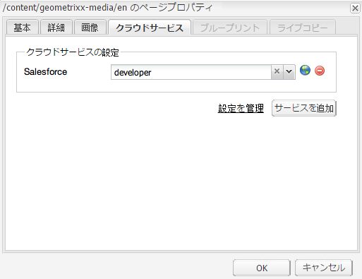

   これで、リード情報を Salesforce に送信するワークフローモデルを使用したり、Salesforce のデータにアクセスするコンポーネントを作成できるようになりました。

## AEM ユーザーを Salesforce のリードとして書き出し {#exporting-aem-users-as-salesforce-leads}

AEM ユーザーを Salesforce のリードとして書き出す場合は、リードを Salesforce に送信するようにワークフローを設定する必要があります。

AEM ユーザーを Salesforce のリードとして書き出すには、次の手順を実行します。

1. Navigate to the Salesforce workflow at `http://localhost:4502/workflow` by right-clicking the workflow **Salesforce.com Export** and clicking **Start**.

   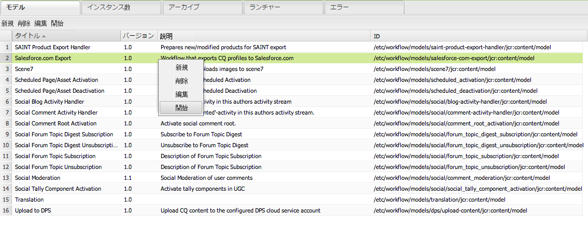

1. リードとして作成する AEM ユーザーをこのワークフローの「**ペイロード**」として選択します（ホーム／ユーザー）。**givenName**、**familyName** などの情報を格納しているユーザーのプロファイルノードを選択してください。これらの情報は、Salesforce のリードの **FirstName** フィールドと **LastName** フィールドにマッピングされます。

   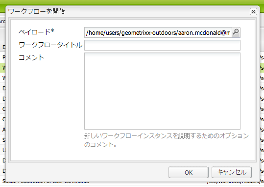

   >[!NOTE]
   >
   >このワークフローを開始する前に、必須フィールドを設定します。AEM のリードノードには、Salesforce に公開する前に設定しておく必要がある必須フィールドがいくつかあります。These are **givenName**, **familyName**, **company** and **email**. AEM ユーザーと Salesforce のリードのマッピングの詳細なリストは、[AEM ユーザーと Salesforce のリードのマッピング設定](#mapping-configuration-between-aem-user-and-salesforce-lead)を参照してください。

1. 「**OK**」をクリックします。ユーザー情報が salesforce.com に書き出されます。書き出されたユーザー情報は、salesforce.com で確認できます。

   >[!NOTE]
   >
   >リードが読み込まれたかどうかがエラーログに記録されます。詳細については、エラーログを確認してください。

### Salesforce.com での書き出しワークフローの設定 {#configuring-the-salesforce-com-export-workflow}

正しい Salesforce.com の設定に合わせたり、その他の変更をおこなうために、Salesforce.com での書き出しワークフローを設定しなければならないことがあります。

Salesforce.com での書き出しワークフローを設定するには、次の手順を実行します。

1. `http://localhost:4502/cf#/etc/workflow/models/salesforce-com-export.html.` に移動します。

   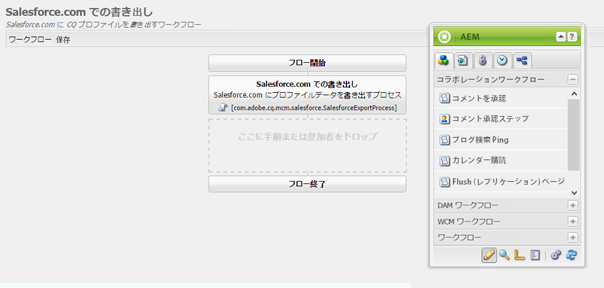

1. Open the Salesforce.com Export step, select the **Arguments** tab, and select the correct configuration is selected and click **OK**. さらに、Salesforce で削除されたリードをワークフローで再作成する場合は、このチェックボックスをオンにします。

   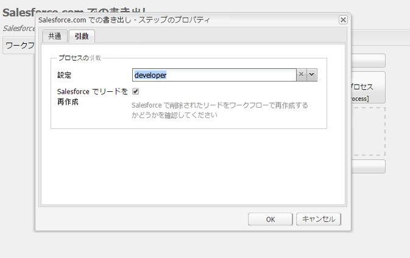

1. 「**保存**」をクリックして変更を保存します。

   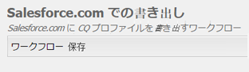

### AEM ユーザーと Salesforce のリードのマッピング設定 {#mapping-configuration-between-aem-user-and-salesforce-lead}

To view or edit the current mapping configuration between an AEM user and a Salesforce lead, open the Configuration Manager: `https://<hostname>:<port>/system/console/configMgr` and search for **Salesforce Lead Mapping Configuration**.

1. 「 **Web Console** 」をクリックするか、 `https://<hostname>:<port>/system/console/configMgr.`
1. Search for **Salesforce Lead Mapping Configuration**.

   

1. 必要に応じてマッピングを変更します。The default mapping follows the pattern **aemUserAttribute=sfLeadAttribute**. 「**Save**」をクリックして変更を保存します。

## Salesforce ClientContext Store の設定 {#configuring-salesforce-client-context-store}

Salesforce ClientContext Store には、AEM で既に使用可能な情報ではなく、現在ログインしているユーザーに関する追加情報が表示されます。この追加情報は、ユーザーと Salesforce の接続に基づいて、Salesforce から取得されます。

この情報を取得するには、次の設定をおこなう必要があります。

1. Salesforce Connect コンポーネントを使用して、AEM ユーザーと Salesforce ID をリンクします。
1. Salesforce プロフィールデータを ClientContext ページに追加して、表示するプロパティを設定します。
1. （オプション）Salesforce ClientContext Store のデータを使用するセグメントを作成します。

### AEM ユーザーと Salesforce ID のリンク {#linking-an-aem-user-with-a-salesforce-id}

AEM ユーザーを ClientContext に読み込むには、AEM ユーザーと Salesforce ID をマッピングする必要があります。実際のシナリオでは、検証済みの既知のユーザーデータに基づいてリンクをおこないます。デモンストレーションのために、この手順では **Salesforce Connect** コンポーネントを使用します。

1. AEM で Web サイトに移動してログインし、サイドキックから **Salesforce Connect** コンポーネントをドラッグアンドドロップします。

   >[!NOTE]
   >
   >**Salesforce Connect** コンポーネントを使用できない場合は、**デザイン**&#x200B;ビューに切り替えてこのコンポーネントを選択し、**編集**&#x200B;ビューで使用できるようにします。

   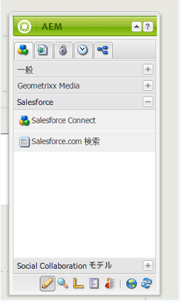

   コンポーネントをページにドラッグすると、「**Salesforce へのリンク**」が「オフ」と表示されます。

   

   >[!NOTE]
   >
   >このコンポーネントはデモンストレーション専用です。実際のシナリオでは、ユーザーとリードをリンクまたは照合する別のプロセスがあります。

1. コンポーネントをページにドラッグしたら、開いて設定します。設定、連絡先のタイプ、Salesforce のリードまたは連絡先を選択して、「**OK**」をクリックします。

   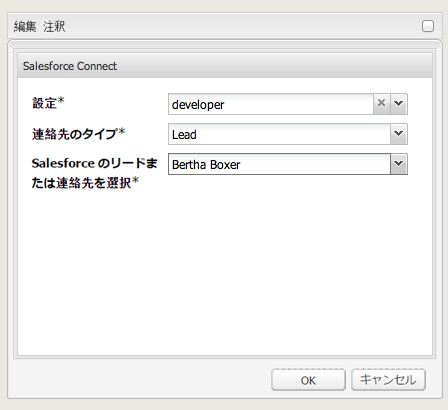

   AEM がユーザーと Salesforce の連絡先またはリードをリンクします。

   

### Salesforce データの ClientContext への追加 {#adding-salesforce-data-to-client-context}

Salesforce のユーザーデータを ClientContext に読み込んで、パーソナライゼーションに使用できます。

1. Open the client context you want to extend by navigating there, for example, `http://localhost:4502/etc/clientcontext/default/content.html.`

   

1. **Salesforce プロフィールデータ**&#x200B;コンポーネントを ClientContext にドラッグします。

   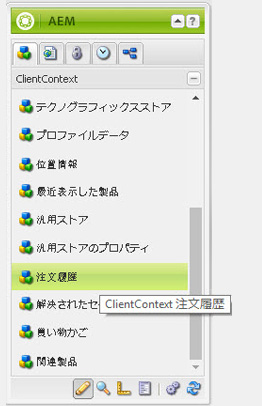

1. コンポーネントをダブルクリックして開きます。「**項目を追加**」を選択し、ドロップダウンリストからプロパティを選択します。必要なプロパティを追加して、「**OK**」を選択します。

   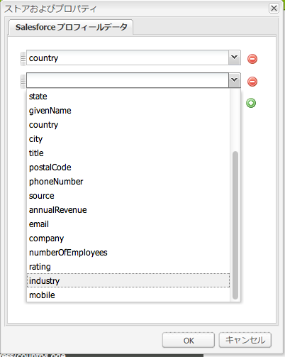

1. これで、Salesforce 固有のプロパティが ClientContext に表示されます。

   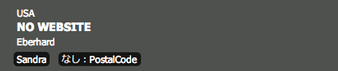

### Salesforce ClientContext Store のデータを使用するセグメントの作成 {#building-a-segment-using-data-from-salesforce-client-context-store}

Salesforce ClientContext Store のデータを使用するセグメントを作成できます。次の手順を実行します。

1. Navigate to segmentation in AEM either by going to **Tools** > **Segmentation** or going to [http://localhost:4502/miscadmin#/etc/segmentation](http://localhost:4502/miscadmin#/etc/segmentation).
1. Salesforce のデータを含めるようにセグメントを作成または更新します。詳しくは、[セグメント化](/help/sites-administering/campaign-segmentation.md)を参照してください。

## リードの検索 {#searching-leads}

AEM には、特定の条件に従って Salesforce のリードを検索する、サンプルの検索コンポーネントが付属しています。このコンポーネントは、Salesforce REST API を使用して Salesforce オブジェクトを検索する方法を説明するものです。ページを Salesforce 設定にリンクして、salesforce.com への呼び出しをトリガーする必要があります。

>[!NOTE]
>
>これは、Salesforce REST API を使用して Salesforce オブジェクトをクエリする方法を説明するサンプルコンポーネントです。これをサンプルとして使用し、ニーズに基づいてさらに複雑なコンポーネントを作成します。

このコンポーネントを使用するには、次の手順を実行します。

1. この設定を使用するページに移動します。ページプロパティを開き、「**クラウドサービス」を選択します。**「**サービスを追加**」をクリックし、「**Salesforce**」および適切な設定を選択して、「**OK**」をクリックします。

   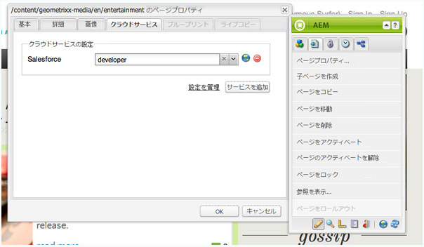

1. Salesforce 検索コンポーネントをページにドラッグします（コンポーネントは有効になっているものとします。コンポーネントを有効にするには、デザインモードに切り替えて、適切な領域に追加します）。

   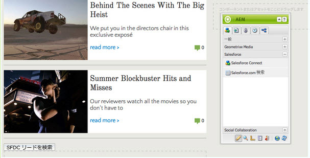

1. 検索コンポーネントを開き、検索パラメーターを指定して、「**OK**」をクリックします。

   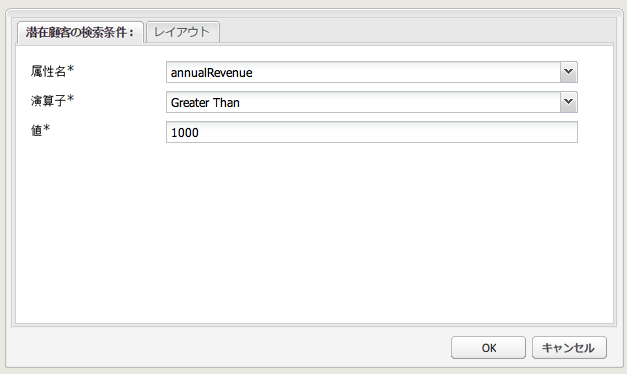

1. 検索コンポーネントで指定した条件に一致するリードが表示されます。

   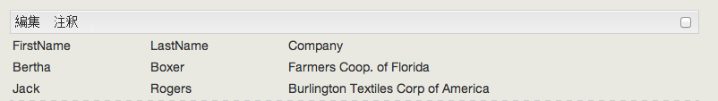

