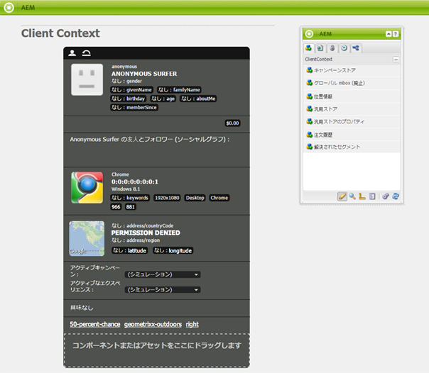

# Salesforce との統合 {#integrating-with-salesforce}

Salesforce とAdobe Experience Manager（AEM）を統合すると、リード管理機能が提供され、Salesforce が標準で提供する既存の機能を使用できます。AEM からリード情報を Salesforce に送信するように設定したり、Salesforce データに直接アクセスするコンポーネントを作成したりできます。

AEMと Salesforce の双方向で拡張可能な統合により、以下のことが可能になります。

* 組織のデータを十分に活用、変更して、カスタマーエクスペリエンスを強化。
* マーケティングからセールス活動へのエンゲージメント。
* 組織の Salesforce データストアのデータを自動的に送受信。

このドキュメントでは次の内容について説明します。

* Salesforce クラウドサービスを設定する方法（AEM を Salesforce と統合するよう設定）
* Salesforce のリード情報や連絡先情報を ClientContext やパーソナライズ機能で使用する方法
* Salesforce ワークフローモデルを使用して、AEM ユーザーをリードとして Salesforce に送信する方法
* Salesforce のデータを表示するコンポーネントの作成方法

## AEM を Salesforce と統合するよう設定 {#configuring-aem-to-integrate-with-salesforce}

AEM を Salesforce と統合するよう設定するには、まず Salesforce でリモートアクセスアプリケーションを設定します。次に、このリモートアクセスアプリケーションを示すように Salesforce クラウドサービスを設定します。

>[!NOTE]
>
>Salesforce に無料の開発者アカウントを作成できます。

AEM を Salesforce と統合するよう設定するには、以下のように行います。

>[!CAUTION]
>
>手順を続行する前に、[Salesforce Force API](https://experience.adobe.com/#/downloads/content/software-distribution/en/aem.html?fulltext=salesforce*&amp;orderby=%40jcr%3Acontent%2Fjcr%3AlastModified&amp;orderby.sort=desc&amp;layout=list&amp;p.offset=0&amp;p.limit=2&amp;package=%2Fcontent%2Fsoftware-distribution%2Fen%2Fdetails.html%2Fcontent%2Fdam%2Faem%2Fpublic%2Fadobe%2Fpackages%2Fcq650%2Ffeaturepack%2Fcom.adobe.cq.mcm.salesforce.content-1.0.4.zip) 統合パッケージをインストールします。パッケージの操作方法について詳しくは、[パッケージの使用方法](/help/sites-administering/package-manager.md#package-share)ページを参照してください。

1. AEM で「**クラウドサービス**」に移動します。「サードパーティのサービス」で、「**Salesforce**」の「**今すぐ設定**」をクリックします。

   

1. 設定を作成します（例：**developer**）。

   >[!NOTE]
   >
   >新しい設定は、新しいページ（**http://localhost:4502/etc/cloudservices/salesforce/developer.html**）にリダイレクトされます。これは、Salesforce でリモートアクセスアプリケーションを作成するときに「Callback URL」で指定する必要がある値とまったく同じ値です。これらの値が一致しなければなりません。

1. Salesforce アカウントにログインします（アカウントがない場合は [https://developer.salesforce.com](https://developer.salesforce.com) で作成します）。
1. Salesforce で、**Create**／**Apps** に移動して、「**Connected Apps**」に移動します（以前のバージョンの Salesforce のワークフローは **Deploy**／**Remote Access**）。
1. 「**New**」をクリックすると、AEMと Salesforce を接続できます。

   

1. 「**Connected App Name**」、「**API Name**」および「**Contact Email**」を入力します。「**Enable OAuth Settings**」チェックボックスを選択して、「**Callback URL**」を入力し、OAuth 範囲（フルアクセスなど）を追加します。コールバック URL は以下のようになります。`http://localhost:4502/etc/cloudservices/salesforce/developer.html`

   設定に合わせてサーバー名／ポート番号およびページ名を変更します。

   

1. 「**Save**」をクリックして、Salesforce 設定を保存します。Salesforce が、AEM 設定に必要な&#x200B;**消費者キー**&#x200B;と&#x200B;**消費者の秘密鍵**&#x200B;を作成します。

   

   >[!NOTE]
   >
   >Salesforce のリモートアクセスアプリケーションがアクティベートされるまで、数分（最大 15 分）待ちます。

1. AEM で&#x200B;**クラウドサービス**&#x200B;に移動し、前の手順で作成した Salesforce 設定（例：**developer**）に移動します。「**編集**」をクリックし、salesforce.com から、顧客鍵および顧客秘密鍵を入力します。

   

   | ログイン URL | これは Salesforce の認証エンドポイントです。この値は事前入力されており、ほとんどの場合に役に立ちます |
   |---|---|
   | 顧客鍵 | salesforce.com のリモートアクセスアプリケーションの登録ページから取得した値を入力します。 |
   | 顧客秘密鍵 | salesforce.com のリモートアクセスアプリケーションの登録ページから取得した値を入力します。 |

1. 「**Salesforce に接続**」をクリックして接続します。Salesforce は、Salesforce への接続を許可するように設定にリクエストします。

   

   AEM に、正常に接続されたことを示す確認ダイアログが表示されます。

1. Web サイトのルートページに移動して、「**ページプロパティ**」をクリックします。「**クラウドサービス**」を選択し、「**Salesforce**」を追加して、正しい設定（例：**developer**）を選択します。

   

   これで、ワークフローモデルを使用してリードを Salesforce に送信したり、Salesforce のデータにアクセスするコンポーネントを作成したりできます。

## AEM ユーザーを Salesforce リードとして書き出し {#exporting-aem-users-as-salesforce-leads}

AEM ユーザーを Salesforce リードとして書き出す場合は、リードを Salesforce に送信するようにワークフローを設定します。

AEM ユーザーを Salesforce リードとして書き出すには、次の手順に従います。

1. `http://localhost:4502/workflow` で、「**Salesforce.com でのエクスポート**」ワークフローを右クリックし、「**開始**」をクリックして、この Salesforce ワークフローに移動します。

   

1. リードとして作成する AEM ユーザーを、このワークフロー（ホーム／ユーザー）の「**ペイロード**」として選択します。**givenName**、**familyName** などの情報を格納しているユーザーのプロファイルノードを選択してください。これらの情報は、Salesforce リードの **FirstName** フィールドと **LastName** フィールドにマッピングされます。

   

   >[!NOTE]
   >
   >このワークフローを開始する前に、必須フィールドを設定します。AEM のリードノードには、Salesforce に公開する前に設定しておく必要がある必須フィールドがいくつかあります。**givenName**、**familyName**、**company** および **email** です。AEM ユーザーと Salesforce リードのマッピングの完全なリストについては、[AEM ユーザーと Salesforce リードのマッピング設定](#mapping-configuration-between-aem-user-and-salesforce-lead)を参照してください。

1. 「**OK**」をクリックします。ユーザー情報は salesforce.com に書き出されます。書き出されたユーザー情報は、salesforce.com で確認できます。

   >[!NOTE]
   >
   >エラーログには、リードが読み込まれたかどうかが示されます。詳しくは、エラーログを参照してください。

### Salesforce.com の書き出しワークフローの設定 {#configuring-the-salesforce-com-export-workflow}

必要に応じて、適切な Salesforce.com の設定に合わせたり、その他の変更を行うために、Salesforce.com の書き出しワークフローを設定します。

Salesforce.com の書き出しワークフローを設定するには、次の手順に従います。

1. `http://localhost:4502/cf#/etc/workflow/models/salesforce-com-export.html.` に移動します。

   

1. 「Salesforce.com でのエクスポート」ステップを開き、「**引数**」タブを選択し、正しい設定を選択して「**OK**」をクリックします。さらに、Salesforce で削除されたリードをワークフローで再作成する場合は、このチェックボックスをオンにします。

   

1. 「**保存**」をクリックして変更を保存します。

   

### AEM ユーザーと Salesforce のリードのマッピング設定 {#mapping-configuration-between-aem-user-and-salesforce-lead}

AEM ユーザーと Salesforce リードの現在のマッピング設定を表示または編集するには、Configuration Manager（`https://<hostname>:<port>/system/console/configMgr`）を開いて「**Salesforce Lead Mapping Configuration**」を検索します。

1. 「**Web コンソール**」をクリックするか、直接 `https://<hostname>:<port>/system/console/configMgr.` にアクセスして Configuration Manager を開きます。
1. 「**Salesforce Lead Mapping Configuration**」を検索します。

   

1. 必要に応じてマッピングを変更します。デフォルトのマッピングは、**aemUserAttribute=sfLeadAttribute** というパターンになります。「**保存**」をクリックして変更を保存します。

## Salesforce Client Context Store の設定 {#configuring-salesforce-client-context-store}

Salesforce Client Context Store には、AEM 内で既に利用可能な情報よりも、現在ログインしているユーザーに関するより多くの情報が表示されます。ユーザーと Salesforce の接続状況に応じて、この追加情報を Salesforce から取り込みます。

これを行うには、次の設定を行います。

1. Salesforce Connect コンポーネント経由で、AEM ユーザーと Salesforce ID をリンクします。
1. Salesforce プロフィールデータをクライアントコンテキストページに追加して、表示するプロパティを設定できるようにします。
1. （オプション）Salesforce Client Context Store のデータを使用するセグメントを作成します。

### AEM ユーザーと Salesforce ID のリンク {#linking-an-aem-user-with-a-salesforce-id}

AEM ユーザーを Salesforce ID にマッピングして、クライアントコンテキストに AEM ユーザーを読み込めるようにします。実際のシナリオでは、検証済みの既知のユーザーデータに基づいてリンクを行います。デモンストレーションのために、この手順では **Salesforce Connect** コンポーネントを使用します。

1. AEMで web サイトに移動してログインし、サイドキックから **Salesforce Connect** コンポーネントをドラッグ＆ドロップします。

   >[!NOTE]
   >
   >**Salesforce Connect** コンポーネントを使用できない場合は、**デザイン**&#x200B;ビューに切り替えてこのコンポーネントを選択し、**編集**&#x200B;ビューで使用できるようにします。

   

   コンポーネントをページにドラッグすると、「**Salesforce へのリンク**」が「オフ」と表示されます。

   

   >[!NOTE]
   >
   >このコンポーネントは、デモンストレーション専用です。実際のシナリオでは、ユーザーとリードをリンクまたは照合する別のプロセスがあります。

1. ページにコンポーネントをドラッグしたら、開いて設定します。設定、連絡先のタイプ、Salesforce のリードまたは連絡先を選択して、「**OK**」をクリックします。

   

   AEM がユーザーと Salesforce の連絡先またはリードをリンクします。

   

### クライアントコンテキストへの Salesforce データの追加 {#adding-salesforce-data-to-client-context}

クライアントコンテキストに Salesforce のユーザーデータを読み込んで、パーソナライズ機能を使用できます。

1. 例えば `http://localhost:4502/etc/clientcontext/default/content.html.` に移動して、拡張したいクライアントコンテキストを開きます。

   

1. **Salesforce プロフィールデータ**&#x200B;コンポーネントを ClientContext にドラッグします。

   

1. コンポーネントをダブルクリックして開きます。「**項目の追加**」を選択し、ドロップダウンリストからプロパティを選択します。必要なだけプロパティを追加して、「**OK**」を選択します。

   

1. これで、Salesforce 固有のプロパティが ClientContext に表示されます。

   

### Salesforce Client Context Store のデータを使用するセグメントの作成 {#building-a-segment-using-data-from-salesforce-client-context-store}

Salesforce Client Context Store のデータを使用するセグメントを作成できます。次の手順を実行します。

1. **ツール**／**セグメント化**&#x200B;に移動するか、[http://localhost:4502/miscadmin#/etc/segmentation](http://localhost:4502/miscadmin#/etc/segmentation) に移動して、AEM のセグメント化に移動します。
1. Salesforce のデータを含めるように、セグメントを作成または更新します。詳しくは、[セグメント化](/help/sites-administering/campaign-segmentation.md)を参照してください。

## リードの検索 {#searching-leads}

AEM には、指定した条件に従って Salesforce 内のリードを検索する、サンプルの検索コンポーネントが付属しています。このコンポーネントでは、Salesforce REST API を使用して Salesforce オブジェクトを検索する方法が示されています。salesforce.com への呼び出しをトリガーするには、Salesforce 設定にページをリンクします。

>[!NOTE]
>
>これは、Salesforce REST API を使用して Salesforce オブジェクトに対してクエリを実行する方法を説明するサンプルコンポーネントです。これを例として使用し、ニーズに基づいてより複雑なコンポーネントを作成します。

このコンポーネントを使用するには、次の手順を実行します。

1. この設定を使用するページに移動します。ページプロパティを開き、「**クラウドサービス」を選択します。**「**サービスを追加**」をクリックし、「**Salesforce**」および適切な設定を選択して、「**OK**」をクリックします。

   

1. そのページに Salesforce 検索コンポーネントをドラッグします（有効になっている場合。有効にするには、デザインモードに移動し、適切な領域に追加します）。

   

1. 検索コンポーネントを開き、検索パラメーターを指定して、「**OK**」をクリックします。

   

1. 検索コンポーネントで指定した条件に一致するリードが表示されます。

   
