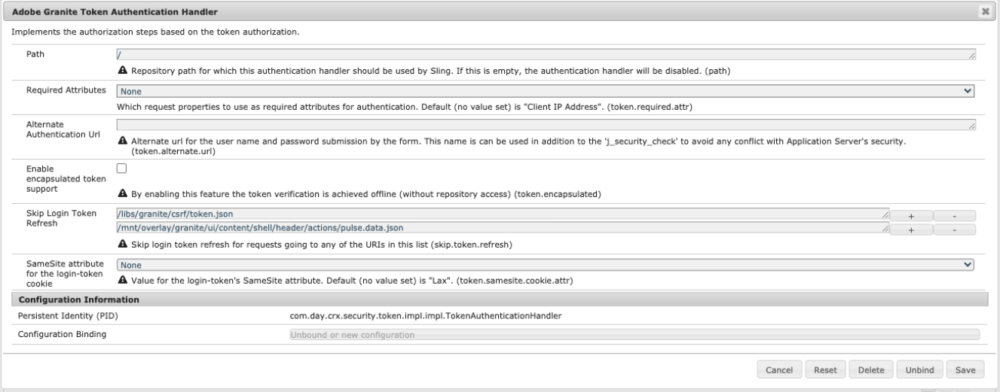

# AEM 6.5 {#same-site-cookie-support-for-aem-65}と同じサイトのcookieサポート

バージョン80以降、Chromeおよびそれ以降のSafariでは、cookieセキュリティの新しいモデルが導入されました。 このモードは、`SameSite`と呼ばれる設定を通じて、サードパーティサイトにcookieの利用に関するセキュリティ制御を導入するように設計されています。 詳しくは、[記事](https://web.dev/samesite-cookies-explained/)を参照してください。

この設定のデフォルト値(`SameSite=Lax`)は、AEMインスタンスまたはサービス間の認証が機能しない原因になる場合があります。 これは、これらのサービスのドメインやURL構造が、このcookieポリシーの制約に該当しない可能性があるからです。

この問題を回避するには、ログイントークンのSameSite cookieを`None`に設定する必要があります。

これを行うには、次の手順に従います。

1. `http://serveraddress:serverport/system/console/configMgr`のWebコンソールに移動
1. **AdobeGranite Token Authentication Handler**&#x200B;を検索してクリックします。
1. 次の図に示すように、login-token cookie **の** SameSite属性を`None`に設定します
   
1. 「保存」をクリックします。
1. この設定が更新され、ユーザーがログアウトしてから再度ログインすると、`login-token` cookieには`None`属性が設定され、クロスサイトリクエストに含められます。
