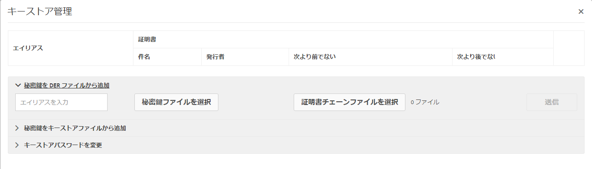

# SAML 2.0 認証ハンドラー{#saml-authentication-handler}

AEM には、[SAML](http://saml.xml.org/saml-specifications) 認証ハンドラーが付属しています。このハンドラーによって、[ バインディングを使用した ](http://saml.xml.org/saml-specifications)SAML`HTTP POST` 2.0 認証要求プロトコル（Web-SSO プロファイル）のサポートが提供されます。

サポート対象は次のとおりです。

* メッセージの署名と暗号化
* ユーザーの自動作成
* AEM でグループを既存のグループに同期させる
* サービスプロバイダーおよびIDプロバイダーが認証を開始しました

このハンドラーは、暗号化された SAML 応答メッセージをユーザーノード（`usernode/samlResponse`）に格納して、サードパーティのサービスプロバイダーとの通信を容易にします。

>[!NOTE]
>
>[AEM と SAML の統合のデモンストレーション](https://helpx.adobe.com/experience-manager/kb/simple-saml-demo.html)を参照してください。
>
>エンドツーエンドのコミュニティの記事については、[Integrating SAML with Adobe Experience Manager](https://helpx.adobe.com/jp/experience-manager/using/aem63_saml.html)を参照してください。

## SAML 2.0 認証ハンドラーの設定 {#configuring-the-saml-authentication-handler}

[Web コンソール](/help/sites-deploying/configuring-osgi.md)を使用すると、[SAML](http://saml.xml.org/saml-specifications) 2.0 認証ハンドラーの設定（**Adobe Granite SAML 2.0 Authentication Handler**）にアクセスできます。設定可能なプロパティを以下に示します。

>[!NOTE]
>
>SAML 2.0 認証ハンドラーはデフォルトでは無効になっています。このハンドラーを有効にするには、次のどちらかのプロパティを設定する必要があります。
>
>* ID プロバイダーの POST の URL
>* サービスプロバイダーのエンティティ ID

>

>[!NOTE]
>
>SAML アサーションは署名されます。オプションとして暗号化することもできます。そのためには、少なくとも TrustStore の ID プロバイダーの公開証明書を指定する必要があります。詳しくは、[TrustStore への IdP 証明書の追加](/help/sites-administering/saml-2-0-authenticationhandler.md#add-the-idp-certificate-to-the-aem-truststore)の節を参照してください。

**Path** Repositoryパス。Slingでこの認証ハンドラーを使用する必要があります。 このプロパティが空の場合は、認証ハンドラーが無効になります。

**サービスのランク付け** OSGiフレームワークサービスのランクの値。このサービスを呼び出す順序を示します。 これは整数値で、値が大きいほど優先順位が高くなります。

**IDP証明書エイリアス** ：グローバル信頼ストア内のIdP証明書のエイリアス。 このプロパティが空の場合は、認証ハンドラーが無効になります。設定方法は、以下の「AEM TrustStore への IdP 証明書の追加」を参照してください。

**IDプロバイダーURL** SAML認証要求の送信先のIDPのURLです。 このプロパティが空の場合は、認証ハンドラーが無効になります。

>[!CAUTION]
>
>ID プロバイダーのホスト名は **Apache Sling Referrer Filter** の OSGi 設定に追加する必要があります。詳しくは、[Web コンソール](/help/sites-deploying/configuring-osgi.md)に関する節を参照してください。

**IDプロバイダーでこのサービスプロバイダーを一意に識別するサービスプロバイダーエンティティID** 。 このプロパティが空の場合は、認証ハンドラーが無効になります。

**デフォルトのリダイレクト** ：認証が成功した後にリダイレクトされるデフォルトの場所です。

>[!NOTE]
>
>この場所は、 `request-path` cookieが設定されていない場合にのみ使用されます。 有効なログイントークンを持たないで、設定されたパスより下のページをリクエストした場合、リクエストされたパスはcookieに保存されます
>認証が成功すると、ブラウザーは再度この場所にリダイレクトされます。

**User-ID Attribute** :CRXリポジトリでユーザーを認証および作成するために使用されるユーザーIDを含む属性の名前。

>[!NOTE]
>
>ユーザー ID は SAML アサーションの `saml:Subject` ノードではなく、この `saml:Attribute` から取得されます。

**Use Encryption** Whether or not this authentication handler werquise encrypted SAML assertions.

**CRXユーザーの自動作成** ：認証が成功した後、リポジトリ内に存在しないユーザーを自動的に作成するかどうかを指定します。

>[!CAUTION]
>
>CRX ユーザーの自動作成が無効な場合は、ユーザーを手動で作成する必要があります。

**グループ追加への追加** ：認証が成功した後、ユーザーをCRXグループに自動的に追加する必要があるかどうかを示します。

**Group Membership** ：このユーザーを追加するCRXグループのリストを含むsaml:Attributeの名前。

## AEM TrustStore への IdP 証明書の追加 {#add-the-idp-certificate-to-the-aem-truststore}

SAML アサーションは署名されます。オプションとして暗号化することもできます。そのためには、少なくともリポジトリ内の IDP の公開証明書を指定する必要があります。これをおこなうには、次の手順を実行する必要があります。

1. http:/serveraddress:serverport/libs/granite/security/content/truststore.htmlに移動し *ます。*
1. 「TrustStoreを **[!UICONTROL 作成」リンクを押します。]**
1. TrustStore のパスワードを入力して「**[!UICONTROL 保存]**」を押します。
1. 「**[!UICONTROL TrustStore を管理]**」をクリックします。
1. IdP 証明書をアップロードします。
1. 証明書エイリアスを記録します。以下の例では、エイリアスは **[!UICONTROL admin#1436172864930]** です。

   

## AEM キーストアへのサービスプロバイダーキーと証明書チェーンの追加 {#add-the-service-provider-key-and-certificate-chain-to-the-aem-keystore}

>[!NOTE]
>
>The below steps are mandatory, otherwise the following exception will be thrown: `com.adobe.granite.keystore.KeyStoreNotInitialisedException: Uninitialised system trust store`

1. Go to: [http://localhost:4502/libs/granite/security/content/useradmin.html](http://localhost:4502/libs/granite/security/content/useradmin.html)
1. Edit the `authentication-service` user.
1. 「**アカウント設定**」の「**キーストアを作成**」をクリックしてキーストアを作成します。

>[!NOTE]
>
>以下の手順は、ハンドラがメッセージの署名または復号化を可能にする必要がある場合にのみ必要です。

1. 「**秘密鍵ファイルを選択**」をクリックして秘密鍵ファイルをアップロードします。キーは、DERエンコードを使用したPKCS#8形式にする必要があります。
1. 「**証明書チェーンファイルを選択**」をクリックして証明書ファイルをアップロードします。
1. 以下のようにエイリアスを割り当てます。

   

## SAML 用のロガーの設定 {#configure-a-logger-for-saml}

SAML の設定ミスにより発生する可能性があるすべての問題をデバッグするようにロガーを設定することができます。手順は次のとおりです。

1. Going to the Web Console, at *http://localhost:4502/system/console/configMgr*
1. Search for and click on the entry called **Apache Sling Logging Logger Configuration**
1. 次の設定でロガーを作成します。

   * **Log Level：** Debug
   * **Log File：** logs/saml.log
   * **Logger：** com.adobe.granite.auth.saml

