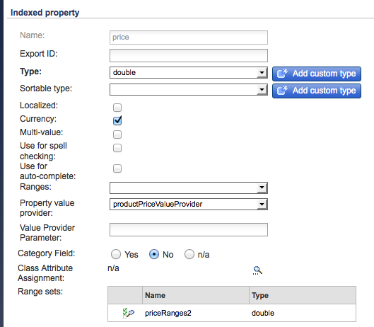

# SAP Commerce Cloud{#sap-commerce-cloud}

インストール後、次のようにしてインスタンスを設定します。

1. [Geometrixx Outdoors 用にファセット検索を設定する](#configure-the-facetted-search-for-geometrixx-outdoors)
1. [カタログバージョンを設定する](#configure-the-catalog-version)
1. [読み込み構造を設定する](#configure-the-import-structure)
1. [読み込む商品属性を設定する](#configure-the-product-attributes-to-load)
1. [商品データを読み込む](#importing-the-product-data)
1. [カタログインポーターを設定する](#configure-the-catalog-importer)
1. [インポーターを使用して、カタログを AEM 内の特定の場所に読み込む](#catalog-import)

## Geometrixx Outdoors 用のファセット検索の設定 {#configure-the-facetted-search-for-geometrixx-outdoors}

>[!NOTE]
>
>この設定は、hybris 5.3.0.1 以降には必要ありません。

1. ブラウザーで次の URL にアクセスし、**hybris 管理コンソール**&#x200B;を表示します。

   [http://localhost:9001/hmc/hybris](http://localhost:9001/hmc/hybris)

1. サイドバーから「**System**」、「**Facet search**」、「**Facet Search Config**」の順に選択します。
1. **Sample Solr Configuration for clothescatalog** 用に&#x200B;**エディターを開きます**。

1. 「**Catalog versions**」の下の「**Add Catalog version**」を使用して、リストに `outdoors-Staged` と `outdoors-Online` を追加します。
1. **設定を保存します。**
1. 「**SOLR Item types**」を開き、次の **SOLR Sort** を `ClothesVariantProduct` に追加します。

   * relevance (&quot;Relevance&quot;, score)
   * name-asc (&quot;Name (ascending)&quot;, name)
   * name-desc (&quot;Name (descending)&quot;, name)
   * price-asc (&quot;Price (ascending)&quot;, priceValue)
   * price-desc (&quot;Price (descending)&quot;, priceValue)

   >[!NOTE]
   >
   >Use the context menu (usually right-button click) to select `Create Solr sort`.
   >
   >For Hybris 5.0.0 open the `Indexed Types` tab, double-click on `ClothesVariantProduct`, then the tab `SOLR Sort`.

   

1. 「**Indexed Types**」タブで、「**Composed Type**」を次のように設定します。

   `Product - Product`

1. 「**Indexed Types**」タブで、「**」の「** Indexer queries`full`」を次のように変更します。

   ```shell
   SELECT {pk} FROM {Product} WHERE {pk} NOT IN ({{SELECT {baseProductpk} FROM {variantproduct}}})
   ```

1. 「**Indexed Types**」タブで、「**」の「** Indexer queries`incremental`」を次のように変更します。

   ```shell
   SELECT {pk} FROM {Product} WHERE {pk} NOT IN ({{SELECT {baseProductpk} FROM {variantproduct}}}) AND {modifiedtime} <= ?lastIndexTime
   ```

1. 「**Indexed Types**」タブで、`category` ファセットを変更します。カテゴリリストの最後のエントリをダブルクリックすると、「**Indexed property**」タブが表示されます。

   >[!NOTE]
   >
   >hybris 5.2 の場合は、「Properties」テーブルの `Facet` 属性が以下のスクリーンショットに従って選択されていることを確認します。

    

1. 「**Facet Settings**」タブを開き、フィールドの値を変更します。

   

1. **変更内容を保存します。**
1. 再び「**SOLR Item types**」から、以下のスクリーンショットに従って、`price` ファセットを変更します。`category` と同様に、`price` をダブルクリックすると、「**Indexed property**」タブが表示されます。

   

1. 「**Facet Settings**」タブを開き、フィールドの値を変更します。

   

1. **変更内容を保存します。**
1. 「**System**」、「**Facet search**」の順に選択すると、**Indexer operation ウィザード**&#x200B;が表示されます。cron ジョブを開始します。

   * **Indexer操作**: `full`
   * **Solr設定**: `Sample Solr Config for Clothes`

## カタログバージョンの設定 {#configure-the-catalog-version}

読み込まれた&#x200B;**カタログバージョン**（`hybris.catalog.version`）を OSGi サービス用に設定できます。

**Day CQ Commerce Hybris Configuration**( `com.adobe.cq.commerce.hybris.common.DefaultHybrisConfigurationService`)

**カタログバージョン** は、通常、 `Online` または `Staged` （デフォルト）に設定されます。

>[!NOTE]
>
>AEM と連携する場合は、いくつかの方法でこのようなサービスの設定を管理できます。詳しくは、[OSGi の設定](/help/sites-deploying/configuring-osgi.md)を参照してください。設定可能なパラメーターとそのデフォルト値の詳細については、コンソールも参照してください。

ログ出力は、作成されたページとコンポーネントに関するフィードバックを提供し、潜在的なエラーを報告します。

## 読み込み構造の設定 {#configure-the-import-structure}

デフォルトで作成される（アセット、ページおよびコンポーネントの）サンプル構造を以下に示します。

```shell
+ /content/dam/path/to/images
  + 12345.jpg (dam:Asset)
    + ...
  + ...
+ /content/site/en
  - cq:commerceProvider = "hybris"
  - cq:hybrisBaseStore = "basestore"
  - cq:hybrisCatalogId = "catalog"
  + category1 (cq:Page)
    + jcr:content (cq:PageContent)
      - jcr:title = "Category 1"
    + category11 (cq:Page)
      + jcr:content (cq:PageContent)
        - jcr:title = "Category 1.1"
      + 12345 (cq:Page)
        + jcr:content (cq:PageContent)
          + par
            + product (nt:unstructured)
              - cq:hybrisProductId = "12345"
              - sling:resourceType = "commerce/components/product"
              + image (nt:unstructured)
                - sling:resourceType = "commerce/components/product/image"
                - fileReference = "/content/dam/path/to/images/12345.jpg"
              + 12345.1-S (nt:unstructured)
                - cq:hybrisProductId = "12345.1-S"
                - sling:resourceType = "commerce/components/product"
                + image (nt:unstructured)
                  - sling:resourceType = "commerce/components/product/image"
                  - fileReference = "/content/dam/path/to/images/12345.1-S.jpg"
              + ...
```

`DefaultImportHandler` インターフェイスを実装する OSGi サービス `ImportHandler` によって、このような構造が作成されます。商品、商品バリエーション、カテゴリ、アセットなどを作成するために、実際のインポーターによって読み込みハンドラーが呼び出されます。

>[!NOTE]
>
>[独自の読み込みハンドラーを実装することによって、この処理をカスタマイズできます](#configure-the-import-structure)。

読み込み時に生成される構造を、以下に合わせて設定できます。

``**Day CQ Commerce Hybris Default Import Handler**
`(com.adobe.cq.commerce.hybris.importer.DefaultImportHandler`)

AEM と連携する場合は、いくつかの方法でこのようなサービスの設定を管理できます。詳しくは、[OSGi の設定](/help/sites-deploying/configuring-osgi.md)を参照してください。設定可能なパラメーターとそのデフォルト値の詳細については、コンソールも参照してください。

## 読み込む商品属性の設定 {#configure-the-product-attributes-to-load}

商品（バリアント）用に読み込むプロパティと属性を定義するように、応答パーサーを設定できます。

1. OSGi バンドルの設定：

   **Day CQ Commerce Hybrisデフォルト応答パーサー**(`com.adobe.cq.commerce.hybris.impl.importer.DefaultResponseParser`)

   ここで、読み込みとマップに必要な、様々なオプションと属性を定義できます。

   >[!NOTE]
   >
   >AEM と連携する場合は、いくつかの方法でこのようなサービスの設定を管理できます。詳しくは、[OSGi の設定](/help/sites-deploying/configuring-osgi.md)を参照してください。設定可能なパラメーターとそのデフォルト値の詳細については、コンソールも参照してください。

## 商品データの読み込み {#importing-the-product-data}

商品データは様々な方法で読み込むことができます。商品データは、環境の初期設定時や、hybris データを変更した後に、次の方法で読み込むことができます。

* [完全読み込み](#full-import)
* [増分読み込み](#incremental-import)
* [高速更新](#express-update)

hybris から読み込まれた実際の商品情報は、次の場所にあるリポジトリに保持されます。

`/etc/commerce/products`

次のプロパティは、hybris とのリンクを示します。

* `commerceProvider`
* `cq:hybrisCatalogId`
* `cq:hybrisProductID`

>[!NOTE]
>
>The hybris implementation (i.e. `geometrixx-outdoors/en_US`) only stores product IDs and other basic information under `/etc/commerce`.
>
>商品に関する情報を要求されるたびに、hybris サーバーが参照されます。

### 完全読み込み {#full-import}

1. 必要に応じて、CRXDE Lite を使用して既存の商品データをすべて削除します。

   1. 製品データを保持するサブツリーに移動します。

      `/etc/commerce/products`

      次に例を示します。

      [`http://localhost:4502/crx/de/index.jsp#/etc/commerce/products`](http://localhost:4502/crx/de/index.jsp#/etc/commerce/products)

   1. 商品データを保持しているノード（例：`outdoors`）を削除します。
   1. 「**すべて保存**」をクリックして、変更内容を保存します。

1. AEM で hybris インポーターを開きます。

   `/etc/importers/hybris.html`

   次に例を示します。

   [http://localhost:4502/etc/importers/hybris.html](http://localhost:4502/etc/importers/hybris.html)

1. 必要なパラメーターを設定します。次に例を示します。

   

1. 「**Import Catalog**」をクリックして読み込みを開始します。

   完了したら、次の URL で読み込んだデータを検証できます。

   ```
       /etc/commerce/products/outdoors
   ```

   これをCRXDE Liteで開ける。例：

   `[http://localhost:4502/crx/de/index.jsp#/etc/commerce/products](http://localhost:4502/crx/de/index.jsp#/etc/commerce/products)`

### 増分読み込み {#incremental-import}

1. AEM で、次の場所の適切なサブツリーに保持されている、関連商品の情報を確認します。

   `/etc/commerce/products`

   これをCRXDE Liteで開ける。例：

   [http://localhost:4502/crx/de/index.jsp#/etc/commerce/products](http://localhost:4502/crx/de/index.jsp#/etc/commerce/products)

1. hybris で、関連商品に関して保持している情報を更新します。

1. AEM で hybris インポーターを開きます。

   `/etc/importers/hybris.html`

   次に例を示します。

   [http://localhost:4502/etc/importers/hybris.html](http://localhost:4502/etc/importers/hybris.html)

1. 「**Incremental Import**」チェックボックスを選択します。
1. 「**Import Catalog**」をクリックして読み込みを開始します。

   完了したら、AEMで次の場所で更新されたデータを確認できます。

   ```
       /etc/commerce/products
   ```


### 高速更新 {#express-update}

読み込み処理には長い時間がかかることがあるので、商品同期の拡張として、カタログの特定の領域を選択して手動で呼び出される高速更新を実行できます。この機能では、書き出しフィードと標準の属性設定を使用しています。

1. AEM で、次の場所の適切なサブツリーに保持されている、関連商品の情報を確認します。

   `/etc/commerce/products`

   これをCRXDE Liteで開ける。例：

   [http://localhost:4502/crx/de/index.jsp#/etc/commerce/products](http://localhost:4502/crx/de/index.jsp#/etc/commerce/products)

1. hybris で、関連商品に関して保持している情報を更新します。

1. hybris で、商品を Express Queue に追加します。次に例を示します。

   

1. AEM で hybris インポーターを開きます。

   `/etc/importers/hybris.html`

   次に例を示します。

   [http://localhost:4502/etc/importers/hybris.html](http://localhost:4502/etc/importers/hybris.html)

1. 「**Express Update**」チェックボックスを選択します。
1. 「**Import Catalog**」をクリックして読み込みを開始します。

   完了したら、AEMで次の場所で更新されたデータを確認できます。

   ```
       /etc/commerce/products
   ```

   ` [](http://localhost:4502/crx/de/index.jsp#/etc/commerce/products)`

## Configure the Catalog Importer {#configure-the-catalog-importer}

hybris カタログは、hybris カタログ、カテゴリおよび商品用のバッチインポーターを使用して AEM に読み込むことができます。

インポーターが使用するパラメーターは、以下に合わせて設定できます。

**Day CQコマースハイブリスカタログインポーター**( `com.adobe.cq.commerce.hybris.impl.importer.DefaultHybrisImporter`)

AEM と連携する場合は、いくつかの方法でこのようなサービスの設定を管理できます。詳しくは、[OSGi の設定](/help/sites-deploying/configuring-osgi.md)を参照してください。設定可能なパラメーターとそのデフォルト値の詳細については、コンソールも参照してください。

## Catalog Import {#catalog-import}

hybris パッケージには、初期ページ構造を設定するためのカタログインポーターが付属しています。

次の場所から使用できます。

`http://localhost:4502/etc/importers/hybris.html`


以下の情報を指定する必要があります。

* **基本ストア** hybris で設定された基本ストアの識別子。

* **カタログ** 読み込むカタログの識別子。

* **ルートパス** カタログを読み込むパス。

## カタログからの商品の削除 {#removing-a-product-from-the-catalog}

1 つまたは複数の商品をカタログから削除するには：

1. [OSGi サービス](/help/sites-deploying/configuring-osgi.md) **Day CQ Commerce Hybris Catalog Importer** を設定します。[カタログインポーターの設定](#configure-the-catalog-importer)も参照してください。

   以下のプロパティをアクティベートします。

   * **Enable product removal**
   * **Enable product asset removal**

   >[!NOTE]
   >
   >AEM と連携する場合は、いくつかの方法でこのようなサービスの設定を管理できます。詳しくは、[OSGi の設定](/help/sites-deploying/configuring-osgi.md)を参照してください。設定可能なパラメーターとそのデフォルト値の詳細については、コンソールも参照してください。

1. 増分更新を 2 回実行して、インポーターを初期化します（[カタログの読み込み](#catalog-import)を参照）。

   * 1 回目の実行では、変更された商品セットがログリストに表示されます。
   * 2 回目の実行では、更新される商品はありません。

   >[!NOTE]
   >
   >1 回目の読み込みは、商品情報を初期化するためのものです。2 回目の読み込みでは、すべてが問題なく機能していることと、商品セットの準備が完了していることを確認します。

1. 削除する商品を含むカテゴリページを確認します。商品の詳細が表示されています。

   例えば、次のカテゴリには Cajamara 商品の詳細が表示されます。

   [http://localhost:4502/editor.html/content/geometrixx-outdoors/en_US/equipment/biking.html](http://localhost:4502/editor.html/content/geometrixx-outdoors/en_US/equipment/biking.html)

1. hybris コンソールで商品を削除します。「**Change approval status**」オプションを使用して、ステータスを「`unapproved`」に設定します。商品がライブフィードから削除されます。

   次に例を示します。

   * [http://localhost:9001/productcockpit](http://localhost:9001/productcockpit) ページを開きます。
   * カタログを選択 `Outdoors Staged`
   * Search for `Cajamara`
   * この商品を選択し、承認ステータスを「`unapproved`」に変更します。

1. もう一度増分更新を実行します（[カタログの読み込み](#catalog-import)を参照）。削除された商品がログに記録されます。
1. 該当するカタログを[ロールアウト](/help/sites-administering/generic.md#rolling-out-a-catalog)します。商品と商品ページが AEM 内から削除されます。

   次に例を示します。

   * 次のファイルを開きます。

      [http://localhost:4502/aem/catalogs.html/content/catalogs/geometrixx-outdoors-hybris](http://localhost:4502/aem/catalogs.html/content/catalogs/geometrixx-outdoors-hybris)

   * Rollout the `Hybris Base` catalog
   * 次のファイルを開きます。

      [http://localhost:4502/editor.html/content/geometrixx-outdoors/en_US/equipment/biking.html](http://localhost:4502/editor.html/content/geometrixx-outdoors/en_US/equipment/biking.html)

   * The `Cajamara` product will have been removed from the `Bike` category

1. 製品を再インストールするには：

   1. hybris で、承認ステータスを「**approved**」に戻します。
   1. AEM では、

      1. 増分更新を実行します。
      1. 該当するカタログを再度ロールアウトします。
      1. 該当するカテゴリページを更新します。

## 注文履歴特性の ClientContext への追加 {#add-order-history-trait-to-the-client-context}

注文履歴を [ClientContext](/help/sites-developing/client-context.md) に追加するには：

1. 次のどちらかの方法で、[ClientContext のデザインページ](/help/sites-administering/client-context.md)を開きます。

   * Open a page for editing, then open the client context using **Ctrl-Alt-c** (windows) or **control-option-c** (Mac). ClientContext の左上隅にある鉛筆アイコンを使用して、**ClientContext のデザインページを開きます**。
   * [http://localhost:4502/etc/clientcontext/default/content.html](http://localhost:4502/etc/clientcontext/default/content.html) に直接移動します。

1. [**注文履歴**&#x200B;コンポーネント](/help/sites-administering/client-context.md#adding-a-property-component)を ClientContext の&#x200B;**買い物かご**&#x200B;コンポーネントに追加します。
1. ClientContext に注文履歴の詳細が表示されていることを確認できます。次に例を示します。

   1. [ClientContext](/help/sites-administering/client-context.md) を開きます。
   1. アイテムを買い物かごに追加します。
   1. チェックアウトを完了します。
   1. ClientContext を確認します。
   1. 別のアイテムを買い物かごに追加します。
   1. チェックアウトページに移動します。

      * ClientContext に注文履歴の概要が表示されます。
      * 「以前買い物されたお客様です」というメッセージが表示されます。

   >[!NOTE]
   >
   >このメッセージは、次の方法で実現されています。
   >
   >* http://localhost:4502/content/campaigns/geometrixx-outdoors/hybris-returning-customer.htmlに移動し [ます。](http://localhost:4502/content/campaigns/geometrixx-outdoors/hybris-returning-customer.html)
   >
   >  キャンペーンは、1つのエクスペリエンスで構成されます。
   >
   >* Click on the segment ([http://localhost:4502/etc/segmentation/geometrixx-outdoors/returning-customer.html](http://localhost:4502/etc/segmentation/geometrixx-outdoors/returning-customer.html))
      >
      >
   * **注文履歴プロパティ**&#x200B;特性を使用してセグメントが作成されます。

