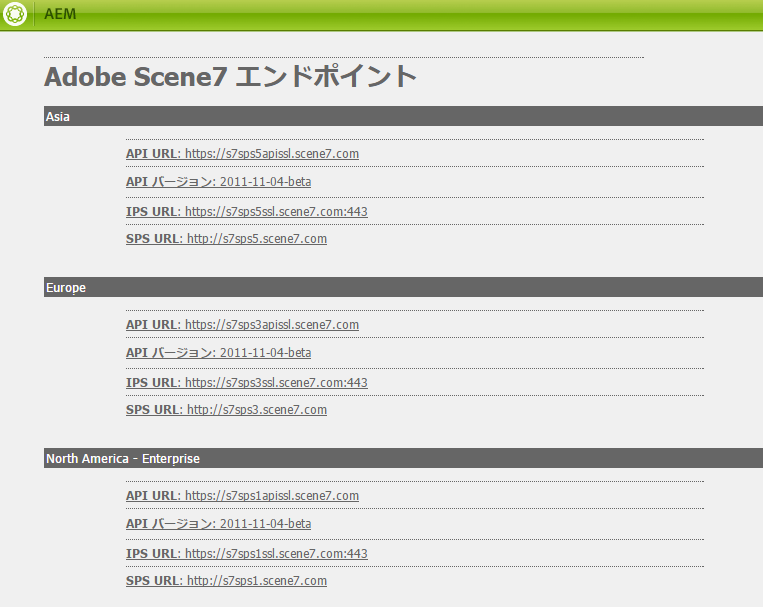
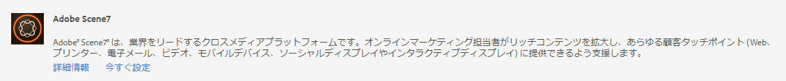
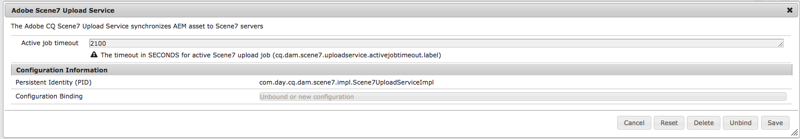
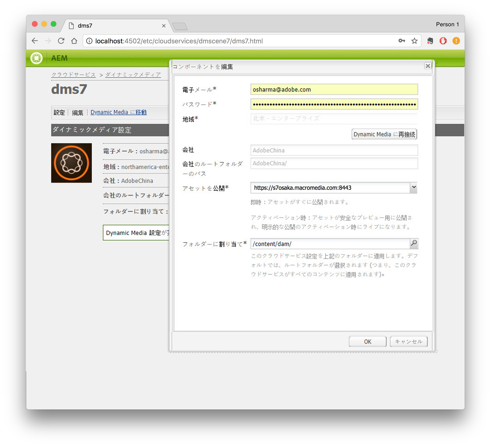
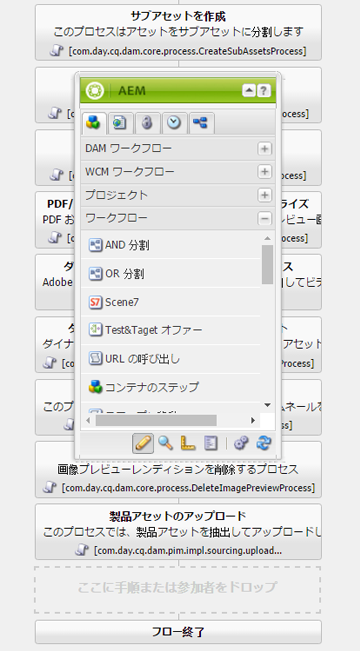
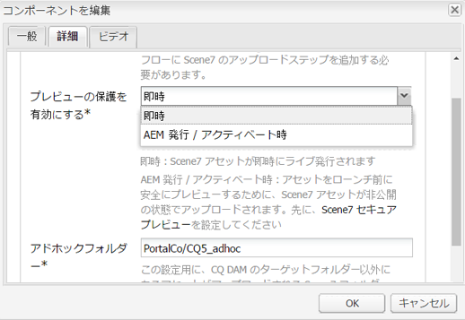
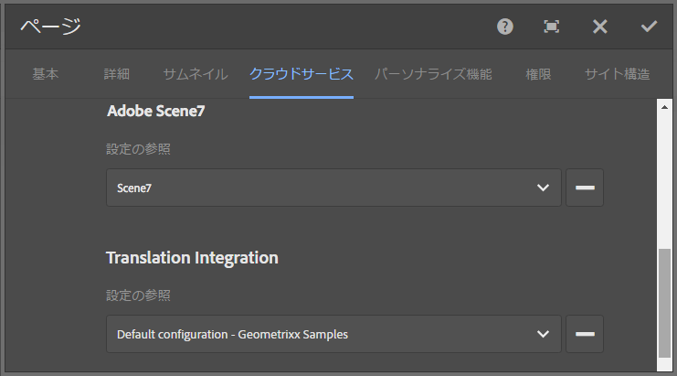
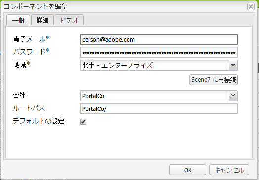
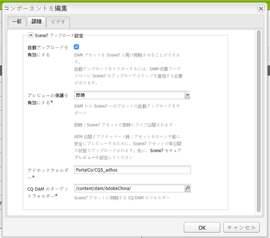

# Dynamic Media Classic（Scene7）との統合{#integrating-with-dynamic-media-classic-scene}

[Adobeダイナミックメディアクラシック](https://help.adobe.com/en_US/scene7/using/WS26AB0D9A-F51C-464e-88C8-580A5A82F810.html) は、リッチメディアアセットを管理、強化、公開、およびWeb、モバイル、電子メール、インターネットに接続されたディスプレイや印刷に配信するためのホストソリューションです。

Dynamic Media Classicを使用するには、Dynamic Media ClassicとAEM Assetsが相互にやり取りできるように、クラウド設定を設定する必要があります。 このドキュメントでは、AEMおよびDynamic Media Classicの設定方法を説明します。

すべてのダイナミックメディアクラシックコンポーネントのページでの使用、およびビデオの操作について詳しくは、ダイナミックメディアクラシック [の使用](../assets/scene7.md)を参照してください。

>[!NOTE]
>
>* Dynamic Media ClassicのDHTMLビューアプラットフォームは、2014年1月31日に正式に提供終了となりました。 詳しくは、[DHTML ビューアのサポート終了 FAQ](../sites-administering/dhtml-viewer-endoflifefaqs.md) を参照してください。
>* AEMで動作するようにDynamic Media Classicを設定する前に、Dynamic Media ClassicとAEMを統合するための [ベストプラクティス](#best-practices-for-integrating-scene-with-aem) を参照してください。
>* Dynamic Media Classicをカスタムプロキシ設定と共に使用する場合は、AEMの一部の機能で3.x APIを使用している場合と4.x APIを使用している場合で、両方のHTTPクライアントプロキシ設定を設定する必要があります。 3.x is configured with [http://localhost:4502/system/console/configMgr/com.day.commons.httpclient](http://localhost:4502/system/console/configMgr/com.day.commons.httpclient) and 4.x is configured with [http://localhost:4502/system/console/configMgr/org.apache.http.proxyconfigurator](http://localhost:4502/system/console/configMgr/org.apache.http.proxyconfigurator).

>

## AEM/Dynamic Media Classicの統合とダイナミックメディアの統合 {#aem-scene-integration-versus-dynamic-media}

AEMユーザーは、ダイナミックメディアを操作する2つのソリューションから選択できます。AEMのインスタンスとDynamic Media Classicの統合、またはAEMに統合されたダイナミックメディアソリューションの使用のいずれかです。

次の条件を使用して、どちらのソリューションを選択するかを決定します。

* If you are an **existing** Dynamic Media Classic customer whose rich media assets reside in Dynamic Media Classic for publishing and delivery, but you want to integrate those assets with Sites (WCM) authoring and/or AEM Assets for management, then use the [AEM/Dynamic Media Classic point-to-point integration](#aem-scene-point-to-point-integration) described in this document.

* リッチメディア配信を必要とする&#x200B;**新しい** AEM のお客様の場合、[ダイナミックメディアオプション](#aem-dynamic-media)を選択します。このオプションは、既存の S7 アカウントを持たず、システムに多くのアセットを保存している場合に最も有用です。

* 両方のソリューションを使用する必要がある場合もあります。The [dual-use scenario](/help/sites-administering/scene7.md#dual-use-scenario) describes that scenario.

### AEM/Dynamic Media Classicのポイントツーポイント統合 {#aem-scene-point-to-point-integration}

このソリューションのアセットを使用して作業する場合、次のいずれかの操作をおこないます。

* アセットを直接Dynamic Media Classicにアップロードし、 **** Dynamic Media Classicコンテンツブラウザーを介してアクセスして、ページオーサリングや
* Upload to AEM Assets and then enable automatic publishing to Dynamic Media Classic; you access via **Assets** content browser for page authoring

The components you use for this integration are found in the **Dynamic Media Classic** component area in [Design mode.](/help/sites-authoring/author-environment-tools.md#page-modes)

### AEM Dynamic Media {#aem-dynamic-media}

AEMダイナミックメディアは、AEMプラットフォーム内で直接Dynamic Media Classic機能を統合したものです。

このソリューションのアセットを使用して作業する場合、次のワークフローに従います。

1. 1 つの画像およびビデオアセットを直接 AEM にアップロードする。
1. AEM 内で直接ビデオをエンコードする。
1. AEM 内で画像ベースのセットを直接構築する。
1. 必要に応じて、画像やビデオにインタラクティブ機能を追加する。

ダイナミックメディア用に使用するコンポーネントは、**[!UICONTROL デザインモード]**&#x200B;の[ダイナミックメディア](/help/sites-authoring/author-environment-tools.md#page-modes)コンポーネント領域にあります。これらには、次が含まれます。

* **[!UICONTROL ダイナミックメディア]** - **[!UICONTROL ダイナミックメディア]**&#x200B;コンポーネントでは、追加しているアセットが画像であるかビデオであるかに応じて、様々なオプションを使用できます。このコンポーネントは画像プリセット、画像ベースのビューア（画像セット、スピンセット、混在メディアセットなど）およびビデオをサポートします。さらに、レスポンシブビューアであるので、ビューアのサイズは画面サイズに合わせて自動的に変化します。すべてのビューアは HTML5 ビューアです。

* **[!UICONTROL インタラクティブなメディア]** - **[!UICONTROL インタラクティブなメディア]**&#x200B;コンポーネントは、ホットスポットや画像マップなどのインタラクティブ機能が備わったカルーセルバナー、インタラクティブな画像、インタラクティブなビデオなどのアセットで使用します。このコンポーネントはスマートであり、追加しているアセットが画像であるかビデオであるかに応じて、様々なオプションを使用できます。さらに、レスポンシブビューアであるので、ビューアのサイズは画面サイズに合わせて自動的に変化します。すべてのビューアは HTML5 ビューアです。

### 両方を利用するシナリオ {#dual-use-scenario}

初期設定では、AEMのダイナミックメディアとダイナミックメディアクラシックの両方の統合機能を同時に使用できます。 次の使用例の表では、特定の領域のオン/オフを切り替えた場合について説明します。

ダイナミックメディアとダイナミックメディアクラシックを同時に使用するには：

1. クラウドサービスで [Dynamic Media Classic](#creating-a-cloud-configuration-for-scene) を設定します。
1. 次の中からお使いのユースケースに合致する手順を実行します。

   <table>
    <tbody>
    <tr>
    <td> </td>
    <td> </td>
    <td><strong>Dynamic Media</strong></td>
    <td> </td>
    <td><strong>Dynamic Media Classic統合</strong></td>
    <td> </td>
    </tr>
    <tr>
    <td><strong>実行する操作...</strong></td>
    <td><strong>ユースケースのワークフロー</strong></td>
    <td><strong>画像／ビデオ</strong></td>
    <td><strong>ダイナミックメディアコンポーネント</strong></td>
    <td><strong>S7 コンテンツブラウザーとコンポーネント</strong></td>
    <td><strong>Assets から S7 への自動アップロード</strong></td>
    </tr>
    <tr>
    <td>Sites とダイナミックメディアを初めて使用する</td>
    <td>アセットを AEM にアップロードし、AEM ダイナミックメディアコンポーネントを使用して Sites ページにアセットを作成する</td>
    <td>
オン
 
（手順 3 を参照）
 </td>
    <td><a href="/help/assets/adding-dynamic-media-assets-to-pages.md">オン</a></td>
    <td>オフ</td>
    <td>オフ</td>
    </tr>
    <tr>
    <td>小売業界で Sites とダイナミックメディアを初めて使用する</td>
    <td>商品以外のアセットは AEM にアップロードして管理および配信する。製品アセットをDynamic Media Classicにアップロードし、AEMおよびコンポーネントでDynamic Media Classicコンテンツブラウザーを使用して、サイトに製品の詳細ページを作成します。</td>
    <td>
オン
 
（手順 3 を参照）
 </td>
    <td><a href="/help/assets/adding-dynamic-media-assets-to-pages.md">オン</a></td>
    <td><a href="/help/assets/scene7.md#scene-content-browser">オン</a></td>
    <td>オフ</td>
    </tr>
    <tr>
    <td>Assets とダイナミックメディアを初めて使用する</td>
    <td>アセットを AEM Assets にアップロードし、ダイナミックメディアで公開済み URL を使用またはコードを埋め込む</td>
    <td>
オン
 
（手順 3 を参照）
 </td>
    <td>オフ</td>
    <td>オフ</td>
    <td>オフ</td>
    </tr>
    <tr>
    <td>ダイナミックメディアを使用して初めてテンプレートを作成する</td>
    <td>Dyamic Media を使用して画像とビデオを作成する。Dynamic Media Classicで画像テンプレートを作成し、Dynamic Media Classicコンテンツファインダーを使用して、サイトページにテンプレートを含めます。</td>
    <td>
オン
 
（手順 3 を参照）
 </td>
    <td><a href="/help/assets/adding-dynamic-media-assets-to-pages.md">オン</a></td>
    <td><a href="/help/assets/scene7.md#scene-content-browser">オン</a></td>
    <td>オフ</td>
    </tr>
    <tr>
    <td>既存のDynamic Media Classicのお客様で、Sitesを初めて使用する場合</td>
    <td>アセットをDynamic Media Classicにアップロードし、AEM Dynamic Media Classicコンテンツブラウザーを使用して、サイトページ上のアセットを検索し、オーサリングする</td>
    <td>オフ</td>
    <td>オフ</td>
    <td><a href="/help/assets/scene7.md#scene-content-browser">オン</a></td>
    <td>オフ</td>
    </tr>
    <tr>
    <td>既存のDynamic Media Classicのお客様で、サイトとアセットを初めてお使いになる場合</td>
    <td>DAMにアセットをアップロードし、配信用にDynamic Media Classicに自動的に公開します。 AEM Dynamic Media Classicコンテンツブラウザーを使用して、サイトページでアセットを検索し、オーサリングします。</td>
    <td>オフ</td>
    <td>オフ</td>
    <td><a href="/help/assets/scene7.md#scene-content-browser">オン</a></td>
    <td>
<a href="#configuringautouploadingfromaemassets">オン</a>
 
（手順 4 を参照）
 </td>
    </tr>
    <tr>
    <td>既存のDynamic Media Classicのお客様で、アセットを初めて使用する場合</td>
    <td>
アセットを AEM にアップロードし、ダイナミックメディアを使用してダウンロードや共有のレンディションを生成する。AEMアセットを配信用にDynamic Media Classicに自動的に公開します。
 
<strong>重要：</strong> AEMで生成された重複処理とレンディションは、Dynamic Media Classicと同期されません
 </td>
    <td>
オン
 
（手順 3 を参照）
 </td>
    <td>オフ</td>
    <td>オフ</td>
    <td>
<a href="#configuringautouploadingfromaemassets">オン</a>
 
（手順 4 を参照）
 </td>
    </tr>
    </tbody>
    </table>

1. (Optional; see use case table) - Set up the [Dynamic Media cloud configuration](/help/assets/config-dynamic.md) and [enable the Dynamic Media server](/help/assets/config-dynamic.md).
1. (オプション、（使用事例の表を参照） — 「アセットからDynamic Media Classicへの自動アップロード」を有効にする場合は、次を追加する必要があります。

   1. Dynamic Media Classicへの自動アップロードを設定します。
   1. ********** Dam更新アセットワークフロー( `https://<server>:<host>/cf#/etc/workflow/models/dam/update_asset.html)`
   1. (Optional) Restrict Dynamic Media Classic asset upload by MIME type in [https://&lt;server>:&lt;port>/system/console/configMgr/com.day.cq.dam.scene7.impl.Scene7AssetMimeTypeServiceImpl](http://localhost:4502/system/console/configMgr/com.day.cq.dam.scene7.impl.Scene7AssetMimeTypeServiceImpl). このリストにないアセットのMIMEタイプは、Dynamic Media Classicサーバーにアップロードされません。
   1. （オプション）ダイナミックMedia Classic設定でビデオを設定します。 ビデオエンコーディングは、ダイナミックメディアとダイナミックメディアクラシックのどちらかまたは両方で同時に有効にすることができます。 ダイナミックレンディションは、AEMインスタンスでのローカルでのプレビューおよび再生に使用されますが、ダイナミックMedia Classicビデオレンディションは、Dynamic Media Classicサーバーで生成および保存されます。 When setting up video encoding services for both Dynamic Media and Dynamic Media Classic, apply a [video processing profile](/help/assets/video-profiles.md) to the Dynamic Media Classic asset folder.
   1. （オプション）Dynamic Media Classicでセキュアプレビューを [設定します](/help/sites-administering/scene7.md#configuring-the-state-published-unpublished-of-assets-pushed-to-scene)。

#### 制限事項 {#limitations}

ダイナミックメディアクラシックとダイナミックメディアの両方を有効にしている場合、次の制限があります。

* アセットを選択し、AEMページのDynamic Media Classicコンポーネントにドラッグして、手動でDynamic Media Classicにアップロードしても機能しません。
* AEM-Dynamic Media Classicの同期アセットは、アセットでアセットを編集すると自動的にDynamic Media Classicに更新されますが、ロールバック操作では新しいアップロードがトリガーされないので、ロールバックの直後にDynamic Media Classicは最新バージョンを取得しません。 ロールバック完了後に再度編集する必要があります。
* ある使用例にダイナミックメディアを、別の使用例にダイナミックメディアクラシック統合を使用する必要がある場合は、ダイナミックメディアクラシック設定をダイナミックメディアプロファイルまたはダイナミックメディア設定（処理フォルダ）に適用しないでください。

## Dynamic Media ClassicとAEMの統合のベストプラクティス {#best-practices-for-integrating-scene-with-aem}

Dynamic Media ClassicをAEMと統合する場合、次の領域で監視する必要がある重要なベストプラクティスがいくつかあります。

* 統合のテストドライブ
* 特定のシナリオで推奨されるDynamic Media Classicからアセットを直接アップロードする

「 [既知の制限事項](#known-limitations-and-design-implications)」を参照してください。

### 統合のテストドライブ {#test-driving-your-integration}

Adobeでは、ルート会社ーがフォルダー全体ではなく、サブフォルダーのみを参照することで、統合をテスト駆動することをお勧めします。

>[!CAUTION]
>
>既存のDynamic Media Classic会社アカウントからアセットを読み込むと、AEMで表示するのに時間がかかる場合があります。 アセット数が多すぎない（例えば、ルートフォルダーに含まれるアセットが多すぎる場合が多く、システムがクラッシュする場合がある）、Dynamic Media Classicでフォルダーを指定していることを確認してください。

### AEM AssetsからのアセットのアップロードとDynamic Media Classicからのアセットのアップロード {#uploading-assets-from-aem-assets-versus-from-scene}

アセットのアップロードは、アセット機能（デジタルアセット管理）を使用するか、Dynamic Media Classicコンテンツブラウザーを使用してAEMで直接Dynamic Media Classicにアクセスする方法で行うことができます。 どちらを選択するかは、次の要素によって異なります。

* AEM Assetsがまだサポートしていないダイナミックメディアクラシックアセットタイプは、Dynamic Media Classicのコンテンツブラウザ（例えば、画像テンプレート）を介して、直接AEM Webサイトに追加する必要があります。
* AEM Assetsとダイナミックメディアクラシックの両方でサポートされるアセットタイプの場合、アセットタイプのアップロード方法は次のとおりです。

   * アセットが現在ある場所、および
   * 共有リポジトリでのそれらの管理の重要度

アセットが既にDynamic Media Classicに存在し、共通リポジトリで管理することがそれほど重要でない場合は、配信のためにDynamic Media Classicに同期するためにのみAEM Assetsに書き出すことは、不要なラウンドトリップです。 アセットを単一のリポジトリに保持し、配信の目的でのみDynamic Media Classicに同期することをお勧めします。

## Configuring Dynamic Media Classic integration {#configuring-scene-integration}

アセットをDynamic Media ClassicにアップロードするようにAEMを設定できます。 CQターゲットフォルダーのアセットは、AEMからDynamic Media Classic会社アカウントに（自動または手動で）アップロードできます。

>[!NOTE]
>
>Adobeでは、指定したターゲットフォルダーのみを使用して、Dynamic Media Classicアセットを読み込むことをお勧めします。 ターゲットフォルダーの外部にあるデジタルアセットは、ダイナミックメディアクラシック設定が有効になっているページのダイナミックメディアクラシックコンポーネントでのみ使用できます。 また、Dynamic Media Classicのアドホックフォルダーにも配置されます。 アドホックフォルダーはAEMと同期されません（ただし、アセットは、Dynamic Media Classicコンテンツブラウザーで検出可能です）。

AEMとの統合用にDynamic Media Classicを設定するには、次の手順を実行する必要があります。

1. [クラウド設定の定義](#creating-a-cloud-configuration-for-scene) - Dynamic Media ClassicフォルダーとAssetsフォルダーの対応付けを定義します。 一方向(AEM Assetsからダイナミックメディアクラシック)の同期だけを行う場合でも、この手順を完了する必要があります。
1. [OSGi **コンソールで**](#enabling-the-adobe-cq-scene-dam-listener) Adobe CQs7dam Dam Listener  - Doneを有効にします。
1. If you want AEM assets to automatically upload to Dynamic Media Classic, you need to turn that option on and add Dynamic Media Classic to the [!UICONTROL DAM Update Asset] workflow. また、手動でアセットをアップロードできます。
1. サイドキックへのDynamic Media Classicコンポーネントの追加 これにより、ユーザーはAEMページでDynamic Media Classicコンポーネントを使用できます。
1. [AEM](#enabling-scene-for-wcm) — この手順は、Dynamic Media Classicで作成したビデオプリセットを表示する場合に必要です。 また、CQターゲットフォルダー外からDynamic Media Classicにアセットを公開する必要がある場合にも必要です。

ここでは、これらのすべての手順の実行方法を説明し、重要な制限を示します。

### Dynamic Media ClassicとAEM Assetsの同期の仕組み {#how-synchronization-between-scene-and-aem-assets-works}

AEM AssetsとダイナミックMedia Classicの同期を設定する場合は、次の点を理解する必要があります。

#### AEM AssetsからDynamic Media Classicにアップロード {#uploading-to-scene-from-aem-assets}

* AEMには、Dynamic Media Classicのアップロード用に指定された同期フォルダーがあります。
* デジタルアセットが指定された同期フォルダーに配置されている場合は、Dynamic Media Classicへのアップロードを自動化できます。
* AEMのフォルダーとサブフォルダー構造は、Dynamic Media Classicに複製されます。

>[!NOTE]
>
>AEMでは、すべてのメタデータをXMPとして埋め込んでからDynamic Media Classicにアップロードするので、メタデータノードのすべてのプロパティは、Dynamic Media ClassicでXMPとして使用できます。

#### Known limitations and design implications {#known-limitations-and-design-implications}

AEM AssetsとDynamic Media Classicの間の同期では、現在、次の制限事項/デザイン上の意味があります。

<table>
 <tbody>
  <tr>
   <td><strong>制限／設計の意味</strong></td>
   <td><strong>説明</strong></td>
  </tr>
  <tr>
   <td>指定された1つの同期(ターゲット)フォルダ</td>
   <td>AEMの各会社ーに指定できるフォルダーは、ダイナミックMedia Classicのアップロード用に1つだけです。 Dynamic Media Classicの複数の会社アカウントにアクセスする必要がある場合は、複数の設定を作成できます。</td>
  </tr>
  <tr>
   <td>フォルダー構造</td>
   <td>アセットを含む同期フォルダーを削除すると、すべてのDynamic Media Classicリモートアセットは削除されますが、フォルダーは残ります。</td>
  </tr>
  <tr>
   <td>アドホックフォルダー</td>
   <td>WCMのダイナミックメディアクラシックに手動でアップロードするターゲットフォルダー外のアセットは、Dynamic Media Classicの別のアドホックフォルダーに自動的に配置されます。 AEM のクラウド設定でこれを設定します。</td>
  </tr>
  <tr>
   <td>混在メディア</td>
   <td>混在メディアセットは、AEM ではサポートされませんが、AEM に表示されます。</td>
  </tr>
  <tr>
   <td>PDF</td>
   <td>Dynamic Media ClassicのeCatalogから生成されたPDFは、CQターゲットーに読み込まれます。</td>
  </tr>
  <tr>
   <td>UI 更新</td>
   <td>AEMとDynamic Media Classicの間で同期を行う場合は、ユーザーインターフェイスを表示の変更に合わせて更新してください。 </td>
  </tr>
  <tr>
   <td>ビデオサムネール</td>
   <td>ビデオをDynamic Media Classic経由でエンコードするためにAEM Assetsにアップロードする場合、ビデオの処理時間に応じて、ビデオサムネールとエンコードされたビデオがAEM Assetsで使用可能になるまでにしばらく時間がかかる場合があります。</td>
  </tr>
  <tr>
   <td>ターゲットサブフォルダー</td>
   <td>
ターゲットフォルダー内のサブフォルダーを使用する場合は、場所に関係なく、各アセットに一意の名前を使用するか、設定領域でDynamic Media Classicを設定して、場所に関係なくアセットを上書きしないようにします。
 
それ以外の場合は、Dynamic Media Classicターゲットーサブフォルダーにアップロードされる同じ名前のアセットがアップロードされますが、ターゲットフォルダー内の同じ名前のアセットは削除されます。 
 </td>
  </tr>
 </tbody>
</table>

### Configuring Dynamic Media Classic servers {#configuring-scene-servers}

プロキシの背後でAEMを実行している場合、または特別なファイアウォール設定を行っている場合は、異なる地域のホストを明示的に有効にする必要がある場合があります。 Servers are managed in content in `/etc/cloudservices/scene7/endpoints` and can be customized as required. URLをタップし、必要に応じて編集してURLを変更します。 AEM の以前のバージョンでは、これらの値はハードコードされていました。

If you navigate to `/etc/cloudservices/scene7/endpoints.html`, you see the servers listed (and can edit them by clicking on the URL):

### Dynamic Media Classicのクラウド設定の作成 {#creating-a-cloud-configuration-for-scene}

クラウド設定では、Dynamic Media ClassicフォルダーとAEM Assetsフォルダーのマッピングを定義します。 AEM AssetsをDynamic Media Classicと同期するように設定する必要があります。 詳しくは、同期の仕組みを参照してください。

>[!CAUTION]
>
>既存のDynamic Media Classic会社アカウントからアセットを読み込むと、AEMで表示するのに時間がかかる場合があります。 アセット数が多すぎない（例えば、ルートフォルダーに含まれるアセットが多すぎる）フォルダーをダイナミックMedia Classicで指定していることを確認します。
>
>統合をテストドライブしたい場合、会社全体ではなく、サブフォルダーのみを指すルートフォルダーを用意してもよいでしょう。

>[!NOTE]
>
>複数の設定を指定できます。クラウド設定の1つは、Dynamic Media Classic会社の1人のユーザーを表します。 その他のダイナミックMedia Classic会社またはユーザーにアクセスする場合は、複数の設定を作成する必要があります。

Dynamic Media Classicにアセットを公開できるようにAEMを設定するには：

1. AEMアイコンをタップし、 **[!UICONTROL デプロイメント/Cloud Services]** に移動して、AdobeDynamic Media Classicにアクセスします。

1. 「今すぐ **[!UICONTROL 設定」をタップします。]**

   

1. 「**[!UICONTROL タイトル]**」フィールド、およびオプションで「**[!UICONTROL 名前]**」フィールドで、適切な情報を入力します。Tap **[!UICONTROL Create.]**

   >[!NOTE]
   >
   >追加の設定を作成する場合は、「**[!UICONTROL 親設定]**」フィールドが表示されます。
   >
   >親設定は&#x200B;**変更しない**&#x200B;でください。親設定の変更は、統合を解除する可能性があります。

1. Dynamic Media Classicアカウントの電子メールアドレス、パスワードおよび地域を入力し、「Dynamic Media Classicに **[!UICONTROL 接続」をタップします。]** Dynamic Media Classicサーバーに接続している場合は、ダイアログが拡張され、その他のオプションが表示されます。

1. **[!UICONTROL 会社]** 名と **** ルートパスを入力します(これは、指定するパスと共に公開されたサーバ名です。公開済みのサーバー名がわからない場合は、Dynamic Media Classicで、 **[!UICONTROL 設定/アプリケーション設定に移動します]**)。

   >[!NOTE]
   >
   >ダイナミックメディアクラシックのルートパスは、AEMが接続するダイナミックメディアクラシックフォルダです。 特定のフォルダーに絞り込むことができます。

   >[!CAUTION]
   >
   >Dynamic Media Classicフォルダーのサイズによっては、ルートフォルダーの読み込みに時間がかかる場合があります。 さらに、Dynamic Media ClassicデータはAEMストレージを超える可能性があります。 正しいフォルダーを読み込んでいることを確認してください。読み込むデータが多すぎると、システムが停止する可能性があります。

   

1. 「**[!UICONTROL OK」をクリックします。]** AEM で設定が保存されます。

>[!NOTE]
>
>再接続する場合：
>
>* 公開時にDynamic Media Classicに再接続する場合、公開時にパスワードのリセットが必要になる場合や、再接続が機能しない場合があります。 これは、オーサーインスタンスの問題ではありません。
>* 地域、会社名などの値を変更した場合は、Dynamic Media Classicに再接続する必要があります。 設定オプションが変更されているが保存されていない場合、AEM は、設定が有効であると誤って示し続けます。必ず再接続するようにします。

>

### Adobe CQダイナミックメディアクラシックDamリスナーの有効化 {#enabling-the-adobe-cq-scene-dam-listener}

デフォルトで無効になっている、Adobe CQダイナミックメディアクラシックDamリスナーを有効にする必要があります。

有効にするには：

1. [!UICONTROL ツール] アイコンをタップし、 **[!UICONTROL 操作/Webコンソールに移動します。]** Web コンソールが開きます。
1. Navigate to **[!UICONTROL Adobe CQ Dynamic Media Classic Dam Listener]** and select the **[!UICONTROL Enabled]** check box.

   

1. Tap  **[!UICONTROL Save.]**

### Dynamic Media Classicアップロードワークフローへの設定可能なタイムアウトの追加 {#adding-configurable-timeout-to-scene-upload-workflow}

Dynamic Media Classic（Scene7）を使用してビデオエンコーディングを処理するように AEM インスタンスが設定されている場合、アップロードジョブのタイムアウトはデフォルトで 35 分になります。ビデオエンコーディングジョブの実行時間がこれよりも長くなる可能性を考慮して、この設定を変更できます。

1. Navigate to **http://localhost:4502/system/console/configMgr/com.day.cq.dam.scene7.impl.Scene7UploadServiceImpl**.

   

1. 「**[!UICONTROL Active job timeout]**」フィールドの数値を目的の値に変更します。負以外の数値であれば、任意の数値を指定できます。単位は秒です。デフォルトでは 2100 に設定されています。

   >[!NOTE]
   >
   >ベストプラクティス：ほとんどのアセットが長くても数分以内に収集されます（画像など）。ただし、長編ビデオを扱う場合など、状況によっては、タイムアウト値を 7200 秒（2 時間）まで増やし、長い処理時間にも対応できるようにする必要があります。Otherwise, this Dynamic Media Classic upload job is marked as **[!UICONTROL UploadFailed]** in the JCR metadata.

1. Tap **[!UICONTROL Save.]**

### AEM Assets からの自動アップロード {#autouploading-from-aem-assets}

AEM 6.3.2以降では、AEM Assetsが自動的に設定され、デジタルアセットマネージャーにアップロードするデジタルアセットがCQターゲットー内にある場合、そのデジタルアセットはすべて自動的にDynamic Media Classicに更新されるようになりました。

アセットがAEM Assetsに追加されると、自動的にアップロードされ、Dynamic Media Classicに公開されます。

>[!NOTE]
>
>AEM AssetsからDynamic Media Classicに自動アップロードするファイルの最大サイズは500 MBです。

AEM Assets からの自動アップロードを設定するには：

1. Tap the AEM icon and navigate to **[!UICONTROL Deployment > Cloud Services]** then, under the Dynamic Media heading, under Available Configurations, tap **[!UICONTROL dms7 (Dynamic Media]**)
1. Tap the **[!UICONTROL Advanced]** tab, select the **[!UICONTROL Enable Automatic Upload]** check box, then tap **[!UICONTROL OK.]** 次に、Dynamic Media Classicへのアップロードを含めるようにDAM Assetワークフローを設定する必要があります。

   >[!NOTE]
   >
   >See [Configuring the state (published/unpublished) of assets pushed to Dynamic Media Classic](#configuring-the-state-published-unpublished-of-assets-pushed-to-scene) for information on pushing assets to Dynamic Media Classic in an unpublished state.

   

1. Navigate back to the AEM welcome page and tap **[!UICONTROL Workflows.]**「**DAM アセットの更新**」ワークフローをダブルクリックして開きます。
1. In the sidekick, navigate to the **[!UICONTROL Workflow]** components, and select **[!UICONTROL Dynamic Media Classic.]** Dynamic Media Classic **[!UICONTROL をワークフローにドラッグし]** 、「 **[!UICONTROL 保存」をタップします。]** ターゲットフォルダー内のAEM Assetsに追加されたアセットは、自動的にDynamic Media Classicにアップロードされます。

   

   >[!NOTE]
   >
   >* 自動化後にアセットを追加する場合、アセットがCQターゲットフォルダーに配置されていないと、Dynamic Media Classicにアップロードされません。
   >* AEMでは、すべてのメタデータをXMPとして埋め込んでからDynamic Media Classicにアップロードするので、メタデータノードのすべてのプロパティは、Dynamic Media ClassicでXMPとして使用できます。

### Dynamic Media Classicにプッシュされるアセットの状態（公開済み/未公開）の設定 {#configuring-the-state-published-unpublished-of-assets-pushed-to-scene}

アセットをAEM Assetsからダイナミックメディアクラシックにプッシュする場合は、自動的に公開する（初期設定の動作）か、非公開状態のDynamic Media Classicに公開します。

アセットを実稼動に移る前にステージング環境でテストする場合は、アセットを直ちにDynamic Media Classicに公開しないでください。 Dynamic Media Classicのセキュアテスト環境でAEMを使用すると、アセットを非公開状態のDynamic Media Classicに直接アセットをプッシュできます。

ダイナミックMedia Classicアセットは、セキュアプレビューを通じて引き続き使用できます。 AEM内でアセットが公開されている場合にのみ、Dynamic Media Classicアセットも実稼動環境で稼働します。

ダイナミックメディアクラシックにアセットをプッシュしたときに、すぐにアセットを公開する場合は、オプションを設定する必要はありません。 これはデフォルトの動作です。

ただし、Dynamic Media Classicにプッシュされたアセットを自動的に公開しないようにするには、AEMおよびDynamic Media Classicで自動公開を設定する方法を説明します。

#### アセットを非公開のDynamic Media Classicにプッシュするための前提条件 {#prerequisites-to-push-assets-to-scene-unpublished}

アセットを公開せずにDynamic Media Classicにプッシュするには、次の設定を行う必要があります。

1. [Admin Consoleを使用して、サポートケースを作成します。](https://helpx.adobe.com/enterprise/admin-guide.html/enterprise/using/support-for-experience-cloud.ug.html) サポートケースで、Dynamic Media Classicアカウントに対してセキュリティで保護されたプレビューを有効にするように要求します。
1. Follow directions to [setup secure preview for your Dynamic Media Classic account.](https://help.adobe.com/en_US/scene7/using/WSd968ca97bf00cf72-5eeee3a113268dc80f5-8000.html)

以下は、Dynamic Media Classicでセキュリティで保護されたテストの設定を作成する場合と同じ手順です。

>[!NOTE]
>
>If your installation environment is a Unix 64-bit operating system, see [https://helpx.adobe.com/experience-manager/kb/enable-xmp-write-back-64-bit-redhat.html](https://helpx.adobe.com/experience-manager/kb/enable-xmp-write-back-64-bit-redhat.html) regarding additional configuration options you need to set.

#### 非公開状態でのアセットのプッシュに関する既知の制限  {#known-limitations-for-pushing-assets-in-unpublished-state}

この機能を使用する場合、次の制限に注意してください。

* バージョン管理のサポートはありません。
* アセットが既に AEM で公開されていて、後続バージョンが作成されている場合、その新しいバージョンは、即座に実稼動環境に公開されます。アクティベーションに対する公開は、アセットの最初の公開でのみ動作します。

>[!NOTE]
>
>If you want to publish assets instantly, best practice is to keep **[!UICONTROL Enable Secure Preview]** set to **[!UICONTROL Immediately]** and use the **[!UICONTROL Enable Automatic Upload]** feature.

### Dynamic Media Classicにプッシュされたアセットの状態を非公開として設定 {#setting-the-state-of-assets-pushed-to-scene-as-unpublished}

>[!NOTE]
>
>ユーザーが AEM でアセットを公開する場合、S7 アセットが実稼動／ライブアセットに自動的にトリガーされます（そのアセットは、セキュアプレビュー／非公開ではなくなります）。

Dynamic Media Classicにプッシュされるアセットの状態を非公開に設定するには：

1. AEMアイコンをタップし、 **[!UICONTROL デプロイメント/Cloud Services]**&#x200B;に移動し、「 **[!UICONTROL ダイナミックメディアクラシック]**」をタップし、Dynamic Media Classicで設定を選択します。
1. 「**[!UICONTROL 詳細]**」タブをタップします。In the **[!UICONTROL Enable Secure View]** drop-down menu, select **[!UICONTROL Upon AEM Publish Activation]** to push assets to Dynamic Media Classic without publishing. (By default, this value is set to **[!UICONTROL Immediately]**, where Dynamic Media Classic assets are published immediately.)

   See [Dynamic Media Classic documentation](https://help.adobe.com/en_US/scene7/using/WSd968ca97bf00cf72-5eeee3a113268dc80f5-8000.html) for more information on testing assets before making them public.

   

1. Tap **[!UICONTROL OK.]**

「セキュアビューを有効にする」は、アセットが非公開のセキュアプレビューサーバーにプッシュされることを意味します。

You can check this by navigating to a Dynamic Media Classic component on a page in AEM and tapping **[!UICONTROL Edit.]**&#x200B;アセットには、セキュアプレビューサーバーが URL にリストされます。AEM で公開したら、ファイル参照のサーバードメインは、プレビュー URL から実稼動 URL にアップロードされます。

### WCMに対するDynamic Media Classicの有効化 {#enabling-scene-for-wcm}

WCMに対してDynamic Media Classicを有効にする必要があるのは、次の2つの理由によります。

* ページオーサリング用のユニバーサルビデオプロファイルのドロップダウンリストを有効にするため。Without this, the **[!UICONTROL Universal Video Preset]** drop-down is empty and cannot be set.
* デジタルアセットがターゲットフォルダーにない場合は、ページプロパティでそのページに対してDynamic Media Classicを有効にし、アセットをDynamic Media Classicコンポーネントにドラッグ&amp;ドロップすると、アセットをDynamic Media Classicにアップロードできます。 通常の継承ルールが適用されます（つまり、子ページがその親ページから設定を継承します）。

WCMに対してDynamic Media Classicを有効にする場合、他の設定と同様に、継承ルールが適用されることに注意してください。 タッチ操作向けまたは従来のユーザーインターフェイスで、WCM用のDynamic Media Classicを有効にすることができます。

#### タッチ操作向けユーザーインターフェイスでのWCMに対するDynamic Media Classicの有効化 {#enabling-scene-for-wcm-in-the-touch-optimized-user-interface}

タッチ操作向けUIでWCMに対してDynamic Media Classicを有効にするには：

1. Tap the AEM icon and navigate to **[!UICONTROL Sites]** and then the root page of your web site (not language specific).

1. In the toolbar, select the [!UICONTROL settings] icon and tap **[!UICONTROL Open Properties.]**

1. 「 **[!UICONTROL Cloud Services]** 」をタップし、「設定 **[!UICONTROL 」をタップして]** 、「 **[!UICONTROL ダイナミックメディアクラシック」を選択します。]**
1. 「 **[!UICONTROL Adobeダイナミックメディアクラシック]** 」ドロップダウンリストで、必要な設定を選択し、「 **[!UICONTROL OK」をタップします。]**

   

   その設定のビデオプリセットは、AEMのそのページと子ページにDynamic Media Classicビデオコンポーネントを含むで使用できます。

#### クラシックユーザーインターフェイスでのWCM用のDynamic Media Classicの有効化 {#enabling-scene-for-wcm-in-the-classic-user-interface}

クラシックUIでWCM用のDynamic Media Classicを有効にするには：

1. In AEM, tap **[!UICONTROL Websites]** and navigate to the root page of your web site (not language specific).

1. In the sidekick, tap the **[!UICONTROL Page]** icon and tap **[!UICONTROL Page Properties.]**

1. **[!UICONTROL Cloud Services/追加サービス/Dynamic Media Classicをタップします。]**
1. 「 **[!UICONTROL Adobeダイナミックメディアクラシック]** 」ドロップダウンリストで、必要な設定を選択し、「 **[!UICONTROL OK」をタップします。]**

   その設定のビデオプリセットは、AEMのそのページと子ページにDynamic Media Classicビデオコンポーネントを含むで使用できます。

### デフォルト設定の設定 {#configuring-a-default-configuration}

複数のDynamic Media Classic設定がある場合は、いずれかをDynamic Media Classicコンテンツブラウザーのデフォルトとして指定できます。

特定の時点で、デフォルトとしてマークできるDynamic Media Classic設定は1つだけです。 デフォルト設定は、ダイナミックメディアクラシックコンテンツブラウザーにデフォルトで表示される会社アセットです。

デフォルト設定を設定するには：

1. AEMアイコンをタップし、 **[!UICONTROL デプロイメント/Cloud Services]**&#x200B;に移動し、「 **[!UICONTROL ダイナミックメディアクラシック]**」をタップし、Dynamic Media Classicで設定を選択します。
1. Tap **[!UICONTROL Edit]** to open the configuration.

1. In the **[!UICONTROL General]** tab, select the **[!UICONTROL Default Configuration]** check box to make this the default company and root path that appears in the Dynamic Media Classic content browser.

   

   >[!NOTE]
   >
   >1 つの設定しかない場合、「**[!UICONTROL デフォルト設定]**」チェックボックスを選択しても、効果はありません。

### アドホックフォルダーの設定 {#configuring-the-ad-hoc-folder}

アセットがCQターゲットーにない場合に、Dynamic Media Classicでアセットをアップロードするフォルダーを設定できます。 CQターゲットーフォルダー外からのアセットの公開を参照してください。

アドホックフォルダーを設定するには：

1. AEMアイコンをタップし、 **[!UICONTROL デプロイメント/Cloud Services]**&#x200B;に移動し、「 **[!UICONTROL ダイナミックメディアクラシック]**」をタップし、Dynamic Media Classicで設定を選択します。
1. Tap **[!UICONTROL Edit]** to open the configuration.

1. 「**[!UICONTROL 詳細]**」タブをタップします。「**[!UICONTROL アドホックフォルダー]**」フィールドで、**アドホック**&#x200B;フォルダーを変更できます。デフォルトでは、**name_of_the_company/CQ5_adhoc** です。

   

### ユニバーサルプリセットの設定 {#configuring-universal-presets}

ビデオコンポーネント用のユニバーサルプリセットを設定するには、[ビデオ](/help/assets/s7-video.md)を参照してください。

## MIMEタイプベースのアセット/ダイナミックメディアクラシックアップロードジョブパラメーターのサポートの有効化 {#enabling-mime-type-based-assets-scene-upload-job-parameter-support}

Digital Asset Manager/Dynamic Media Classicアセットの同期によってトリガーされる、設定可能なDynamic Media Classicアップロードジョブパラメーターを有効にすることができます。

特に、AEM Web コンソール設定パネルの OSGi（Open Service Gateway initiative）領域にある MIME タイプで、受け入れられるファイル形式を設定します。次に、JCR(Java Content Repository)の各MIMEタイプで使用される個々のアップロードジョブのパラメータをカスタマイズできます。

**MIME タイプベースのアセットを有効にするには：**

1. Tap the AEM icon and navigate to **[!UICONTROL Tools > Operations > Web Console.]**
1. In the Adobe Experience Manager Web Console Configuration panel, on the **[!UICONTROL OSGi]** menu, tap **[!UICONTROL Configuration.]**
1. Under the Name column, find and tap **[!UICONTROL Adobe CQ Dynamic Media Classic Asset MIME type Service]** to edit the configuration.
1. 「MIMEタイプのマッピング」領域で、任意のプラス記号(+)をタップして、MIMEタイプを追加します。

   See [Supported MIME types](/help/assets/assets-formats.md#supported-mime-types).

1. テキストフィールドに、新しいMIMEタイプ名を入力します。

   例えば、「OR」に「a」 `<file_extension>=<mime_type>` と入力し `EPS=application/postscript` ま `PSD=image/vnd.adobe.photoshop`す。

1. In the lower-right corner of the configuration window, tap **[!UICONTROL Save.]**
1. AEM に戻り、左側のレールで、CRXDE Lite をタップします。
1. On the CRXDE Lite page, in the left rail, navigate to `/etc/cloudservices/scene7/<environment>` (substitute `<environment>` for the actual name).
1. Expand `<environment>` (substitute `<environment>` for the actual name) to reveal the `mimeTypes` node.
1. 先ほど追加したmimeTypeをタップします。

   For example, `mimeTypes > application_postscript` OR `mimeTypes > image_vnd.adobe.photoshop`.

1. CRXDE Lite ページの右側で、「**[!UICONTROL プロパティ]**」タブをタップします。
1. Specify a Dynamic Media Classic upload job parameter in the **[!UICONTROL jobParam]** value field.

   例： `psprocess="rasterize"&psresolution=120`

   See the [Adobe Dynamic Media Classic Image Production System API](https://docs.adobe.com/content/help/en/dynamic-media-developer-resources/image-production-api/c-overview.html) for additional upload job parameters you can use.

   >[!NOTE]
   >
   >PSDファイルをアップロードし、レイヤー抽出を使用してテンプレートとして処理する場合は、 **[!UICONTROL jobParam]** 値フィールドに次の値を入力します。
   >
   >`process=MaintainLayers&createTemplate=true`
   >
   >PSDファイルに「レイヤー」が含まれていることを確認します。 厳密に1つの画像、またはマスクを含む画像の場合、処理するレイヤーがないので、画像として処理されます。

1. In the upper-left corner of the CRXDE Lite page, tap **[!UICONTROL Save All.]**

## Dynamic Media ClassicとAEMの統合のトラブルシューティング {#troubleshooting-scene-and-aem-integration}

AEMとDynamic Media Classicの統合で問題が発生する場合は、次の解決策のシナリオを参照してください。

**Dynamic Media Classicへのデジタルアセットの公開に失敗する場合：**

* アップロードしようとしているアセットが **[!UICONTROL CQターゲット]** （Dynamic Media Classicクラウド設定で指定）内にあることを確認します。
* ない場合、**[!UICONTROL CQ アドホックフォルダー]**&#x200B;にアップロードできるように、そのページの&#x200B;**[!UICONTROL ページプロパティ]**&#x200B;でクラウド設定を設定する必要があります。

* ログの情報を確認します。

**ビデオプリセットが表示されない場合：**

* **[!UICONTROL ページのプロパティで、そのページのクラウド設定が設定されていることを確認します。]** ビデオプリセットは、Dynamic Media Classicビデオコンポーネントで使用できます。

**AEM でビデオアセットが再生されない場合：**

* 正しいビデオコンポーネントを使用していることを確認します。ダイナミックMedia Classicビデオコンポーネントは、foundation Videoコンポーネントとは異なります。 詳しくは、 [FoundationビデオコンポーネントとDynamic Media Classicビデオコンポーネント](/help/assets/s7-video.md)を参照してください。

**AEMで新規に作成した、または変更したアセットがDynamic Media Classicに自動的にアップロードされない場合：**

* アセットが CQ ターゲットフォルダーにあることを確認します。CQ ターゲットフォルダーにあるアセットだけが自動的に更新されます（アセットを自動的にアップロードするように AEM Assets を設定した場合）。
* Cloud Servicesの設定で「自動アップロードを有効にする」が設定されていること、およびDAM Assetワークフローが更新され、保存されていて、Dynamic Media Classicのアップロードが含まれていることを確認してください。
* 画像をDynamic Media Classicターゲットフォルダーのサブフォルダーにアップロードする場合は、次のいずれかの操作を行います。

   * 場所に関係なく、すべてのアセットの名前が一意であることを確認します。そうしないと、メインターゲットフォルダーのアセットが削除され、サブフォルダーのアセットだけが残ります。
   * Dynamic Media Classicアカウントの「設定」領域で、Dynamic Media Classicによってアセットが上書きされる方法を変更します。 サブフォルダー内の同じ名前のアセットを使用する場合、場所に関係なくアセットを上書きするようにDynamic Media Classicを設定しないでください。

**削除したアセットまたはフォルダーがDynamic Media ClassicとAEMの間で同期されない場合：**

* AEM Assetsで削除されたアセットとフォルダーは、Dynamic Media Classicの同期フォルダーに引き続き表示されます。 それらを手動で削除する必要があります。

**ビデオのアップロードに失敗した場合**

* If your video upload fails and you are using AEM to encode video through the Dynamic Media Classic integration, see [Adding configurable timeout to Dynamic Media Classic Upload workflow](#adding-configurable-timeout-to-scene-upload-workflow).

>[!CAUTION]
>
>既存のDynamic Media Classic会社アカウントからアセットを読み込むと、AEMで表示するのに時間がかかる場合があります。 アセット数が多すぎない（例えば、ルートフォルダーに含まれるアセットが多すぎる）フォルダーをダイナミックMedia Classicで指定していることを確認します。
>
>統合をテストドライブしたい場合、会社全体ではなく、サブフォルダーのみを指すルートフォルダーを用意してもよいでしょう。

