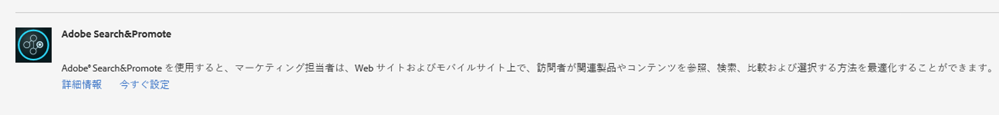
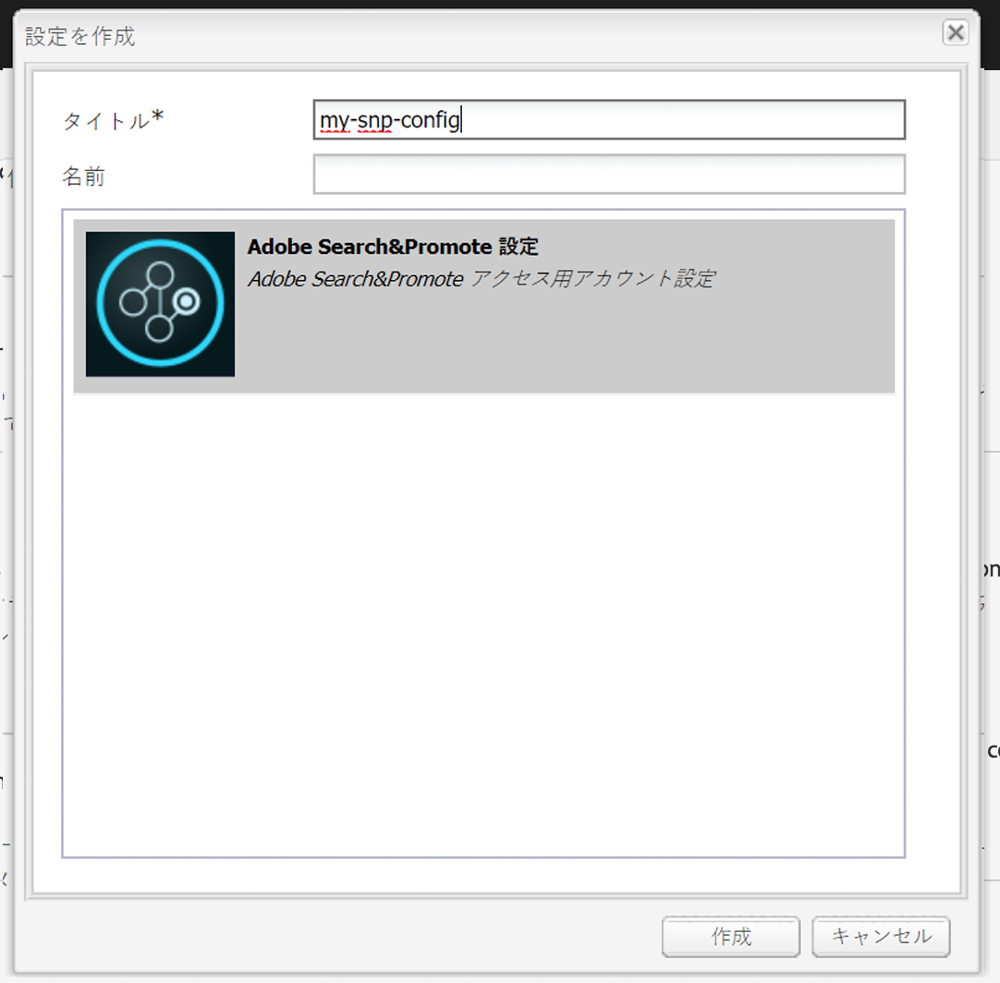

# Adobe Search&amp;Promote との統合{#integrating-with-adobe-search-promote}

Web サイトから Adobe Search&amp;Promote サービスを呼び出すには、次のタスクを実行します。

1. クラウドの URL を指定します。
1. Search&amp;Promote サービスへの接続を設定します。
1. Search&amp;Promote コンポーネントをサイドキックに追加します。
1. コンポーネントを使用して、コンテンツを作成します（[Web ページへの Search&amp;Promote 機能の追加](/help/sites-authoring/search-and-promote.md)を参照）。
1. バナーをページに追加します。バナー画像は、Search&amp;Promote データの影響を受けます。
1. Search&amp;Promote サービスが使用するサイトマップを生成します。

>[!NOTE]
>
>カスタムプロキシ設定で Search&amp;Promote を使用している場合、AEM には 3.x API を使用する機能と 4.x API を使用する機能があるので、両方の HTTP クライアントプロキシを設定する必要があります。
>
>* 3.xは[https://localhost:4502/system/console/configMgr/com.day.commons.httpclient](https://localhost:4502/system/console/configMgr/com.day.commons.httpclient)で設定します。
>* 4.xは[https://localhost:4502/system/console/configMgr/org.apache.http.proxyconfigurator](https://localhost:4502/system/console/configMgr/org.apache.http.proxyconfigurator)で設定します。

>

## Search&amp;Promote サービス URL の変更 {#changing-the-search-promote-service-url}

Search&amp;Promoteサービスに設定されるデフォルトのURLは`https://searchandpromote.omniture.com/px/`です。 別のサービスを使用するには、OSGi コンソールを使用して別の URL を指定します。

1. OSGi コンソールを開いて「Configuration」タブをクリックします([https://localhost:4502/system/console/configMgr.](https://localhost:4502/system/console/configMgr))
1. Day CQ Search&amp;Promote 設定項目をクリックします。
1. 「Remote Server URI」ボックスに URL を入力して、「Save」をクリックします。

## Search&amp;Promote への接続の設定 {#configuring-the-connection-to-search-promote}

Search&amp;Promote への 1 つ以上の接続を設定して、Web ページがサービスとやり取りできるようにします。接続するには、Search&amp;Promote アカウントのメンバー ID とアカウント番号が必要です。

1. **ツール**&#x200B;アイコン/**デプロイメント**&#x200B;から、**Cloud Services**&#x200B;を選択します。

   これにより、クラウドサービスダッシュボードが表示されます。ローカルマシンの場合、ダッシュボードの URI は、次のようになります。

   [https://localhost:4502/libs/cq/core/content/tools/cloudservices.html](https://localhost:4502/libs/cq/core/content/tools/cloudservices.html)

1. クラウドサービスページで、Adobe Search&amp;Promote リンクまたは Search&amp;Promote アイコンをクリックします。

1. 初めてAdobeSearch&amp;Promoteを設定する場合は、「**今すぐ設定**」をクリックして設定を作成パネルを開きます。

   Search&amp;Promoteの詳細を表示するには、[**詳細情報**]をクリックしてください。

   

1. ページ作成者が認識可能な&#x200B;**タイトル**&#x200B;を入力し、一意の&#x200B;**名前**&#x200B;を入力したら、「**作成**」をクリックします。

   **コンポーネントを編集**&#x200B;ウィンドウが開きます。

   また、新しく作成した設定が、**クラウドサービスダッシュボード**&#x200B;の Adobe Search&amp;Promote リスト項目の「**利用可能な設定**」の下に表示されます。

   

1. **コンポーネントを編集**&#x200B;ダイアログボックスのフィールドに次を追加します。

   * **メンバー ID**
   * **アカウント番号**

   >[!NOTE]
   >
   >**自分でこの情報を得るには、**&#x200B;まずログインする必要があります
   >
   >[https://searchandpromote.omniture.com/center/](https://searchandpromote.omniture.com/center/)
   >
   >
   >有効な Seach&amp;Promote 資格情報（電子メール／パスワード）を使用します。
   >次に、ブラウザーのアドレスバーにある URI を調べる必要があります。次のようになります。
   >
   >
   >[https://searchandpromote.omniture.com/px/home/?sp_id=XXXXXXXX-spYYYYYYYY](https://searchandpromote.omniture.com/px/home/?sp_id=XXXXXXXX-spYYYYYYYY)
   >
   >**この場合：**
   >
   >    * **XXXXXXXXXXXX** は、お使いの**メンバid**に対応します
   >    * **spYYYYYYYYは、使用する**  **アカウント番号に対応します**

1. 「**Search&amp;Promote に接続**」をクリックします。

   接続成功メッセージが表示されたら、「**OK**」をクリックします。

   (接続後、ボタンのテキストは「**Search&amp;Promoteに再接続**」に変わります)。

1. 「**OK**」をクリックします。今作成した設定の Search&amp;Promote 設定ページが表示されます。

## データセンターの設定 {#configuring-the-data-center}

Search&amp;Promote アカウントがアジアまたはヨーロッパのものである場合、正しいデータセンターを指せるように、デフォルトデータセンターを変更する必要があります（デフォルトデータセンターは、北米アカウント向けです）。

データセンター：

1. `https://localhost:4502/system/console/configMgr/com.day.cq.searchpromote.impl.SearchPromoteServiceImpl`のWebコンソールに移動します。

   

1. サーバーの場所に応じて、URI を次のいずれかに変更します。

   * 北米：[https://center.atomz.com/px/](https://center.atomz.com/px/)
   * EMEA:[https://center.lon5.atomz.com/px/](https://center.lon5.atomz.com/px/)
   * APAC:[https://center.sin2.atomz.com/px/](https://center.sin2.atomz.com/px/)

1. 「**Save**」をクリックします。

## Search&amp;Promote コンポーネントのサイドキックへの追加  {#adding-search-promote-components-to-sidekick}

デザインモードで、コンポーネント&#x200B;**ごとに**&#x200B;編集して、サイドキックの Search&amp;Promote コンポーネントを許可します（詳しくは、[コンポーネント](/help/sites-developing/components.md#addinganewcomponenttotheparagraphsystemdesignmode)のドキュメントを参照）。

コンポーネントの使用について詳しくは、「[WebページへのSearch&amp;Promote機能の追加](/help/sites-authoring/search-and-promote.md)」を参照してください。

## ページで使用する Search&amp;Promote サービスの指定 {#specifying-the-search-promote-service-that-your-pages-use}

特定の Search&amp;Promote サービスを使用できるように、Web ページを設定します。Search&amp;Promote コンポーネントは、自動的にホストページのサービスを使用します。

ページの Search&amp;Promote プロパティを設定すると、すべての子ページが設定を継承します。必要に応じて、継承された設定を上書きするように子ページを設定できます。

>[!NOTE]
>
>サービス接続は、既に設定されている必要があります（[Search&amp;Promote への接続の設定](#connection)を参照）。

1. **ページプロパティ**&#x200B;ダイアログボックスを開きます。例えば、** Webサイト**ページで、ページを右クリックし、**プロパティ**&#x200B;をクリックします。
1. 「**クラウドサービス**」タブをクリックします。
1. 親ページからのクラウドサービス設定の継承を無効にするには、継承パスの横にある南京錠アイコンをクリックします。

   

1. 「**サービスを追加**」をクリックし、「**Adobe Search&amp;Promote**」を選択して、「**OK**」をクリックします。
1. Search&amp;Promote アカウントの接続設定を選択して、「**OK**」をクリックします。

## 製品フィード {#product-feed}

Search&amp;Promote 統合を使用すると、次のことができます。

* 基になるリポジトリ構造やコマースプラットフォームと関係なく、e コマース API を使用する。
* Search&amp;Promote のインデックスコネクタ機能を利用して、XML 形式で製品フィードを提供する。
* Search&amp;Promote のリモート制御機能を利用して、製品フィードのオンデマンドリクエストまたはスケジュール済みリクエストを実行する。
* クラウドサービス設定として指定された、様々な Search&amp;Promote アカウント用のフィードを生成する。

詳しくは、[製品フィード](/help/sites-administering/product-feed.md)を参照してください。
