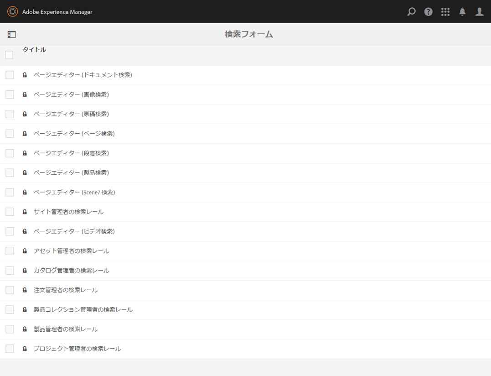
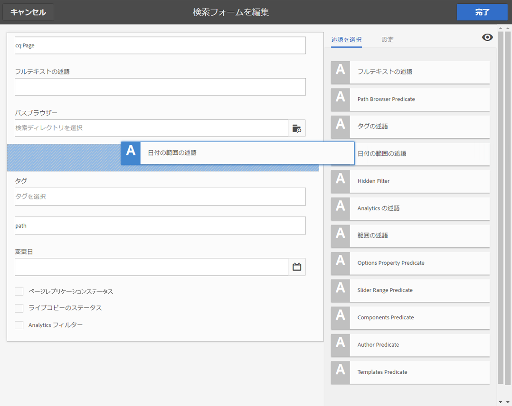
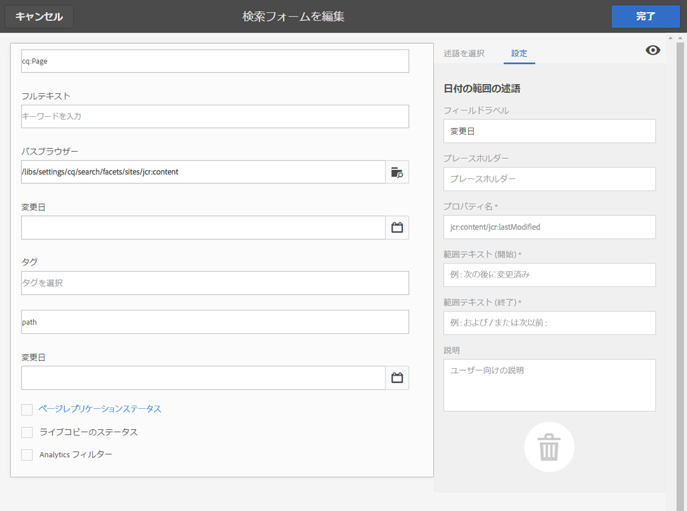
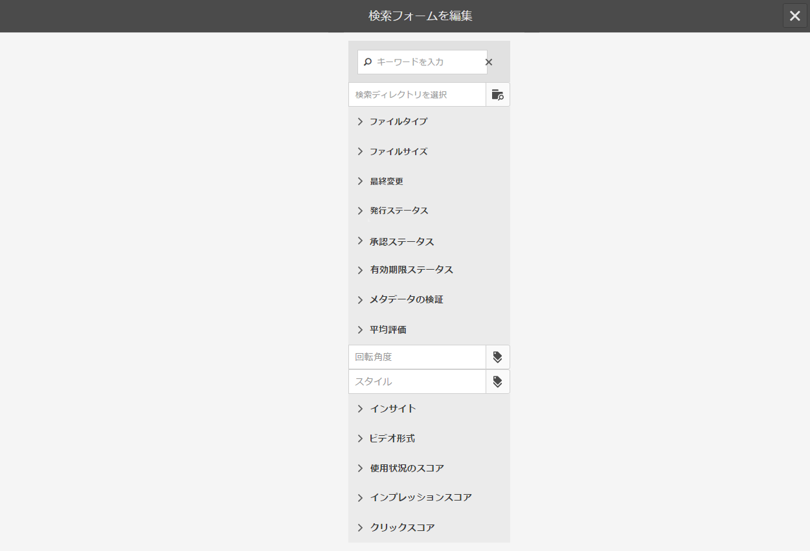
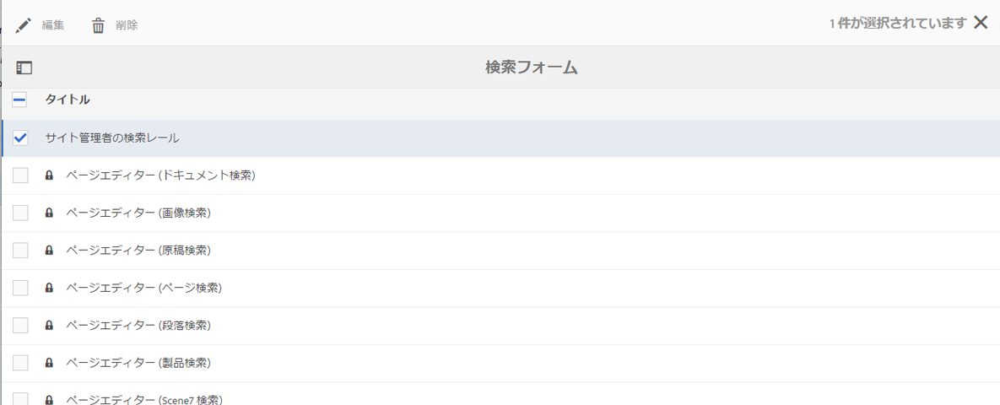
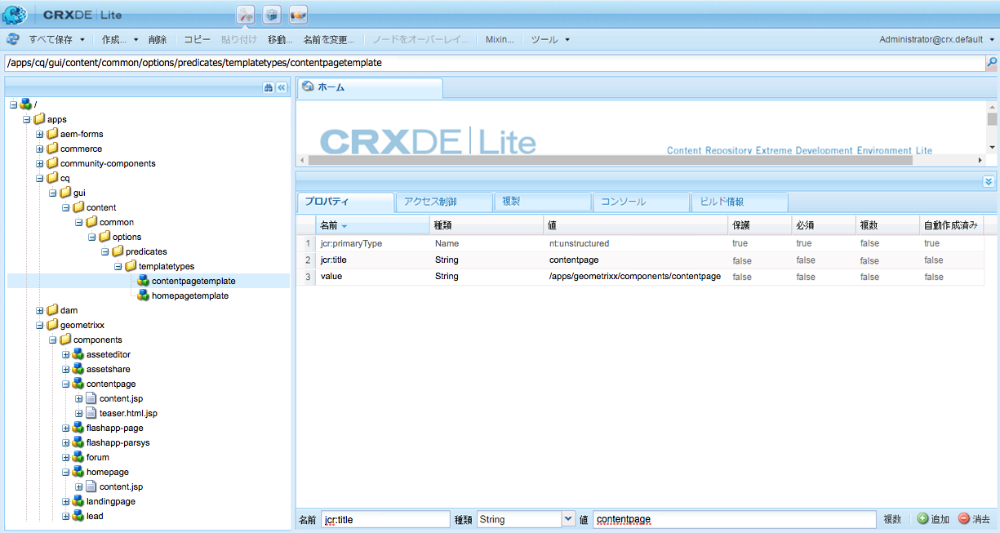
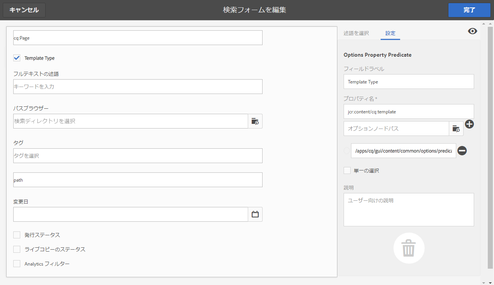
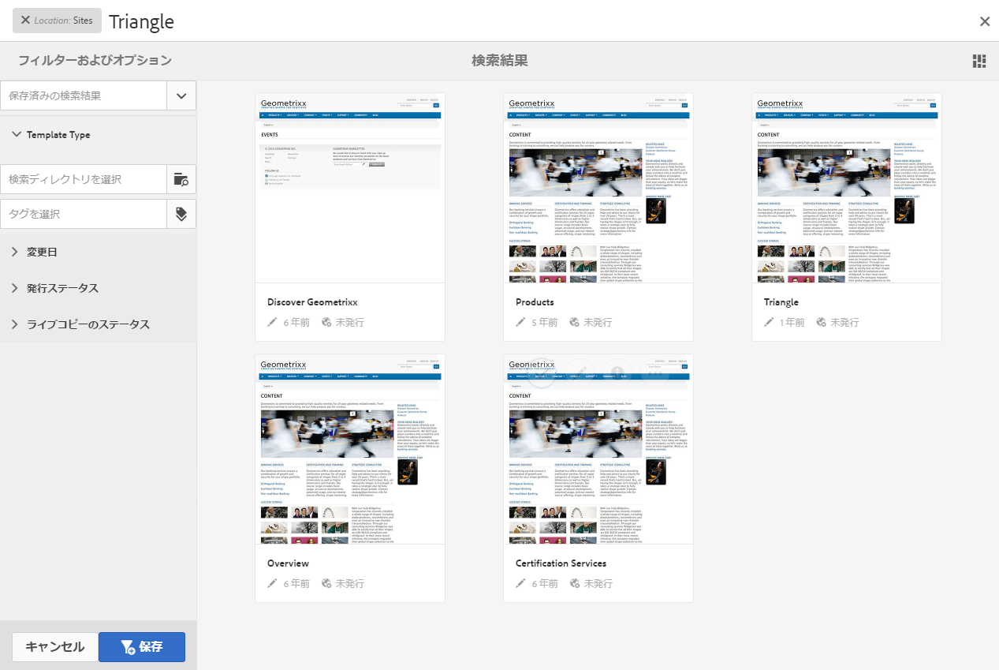

# 検索フォームの設定{#configuring-search-forms}

**検索フォーム**&#x200B;を使用して、オーサー環境の様々な AEM コンソール／パネルの検索パネルで使用する検索の述語の選択をカスタマイズできます。これらのパネルをカスタマイズすると、特定のニーズに合わせて検索機能の用途を拡大できます。

標準で、[様々な述語](#predicates-and-their-settings)が用意されています。フルテキスト検索用のフルテキストの述語、指定した単一のプロパティに一致するアセットを検索するプロパティの述語、特定のプロパティ用に指定した 1 つまたは複数の値に一致するアセットを検索するオプションの述語など、複数の述語を追加できます。

様々なコンソール内およびアセットブラウザー（ページ編集時）で使用する[検索フォームを設定](#configuring-your-search-forms)できます。[これらのフォームを設定するためのダイアログ](#configuring-your-search-forms)には、次の手順でアクセスできます。

* **ツール**

   * **一般**

      * **検索フォーム**

このコンソールに初めてアクセスすると、すべての設定に鍵アイコンが表示されます。これは、該当する設定はデフォルト（標準）の設定であり、削除できないことを示します。設定をカスタマイズすると、鍵アイコンは非表示になります。ただし、[カスタマイズした設定を削除](#deleting-a-configuration-to-reinstate-the-default)した場合は、デフォルトの設定（および鍵アイコン）が復帰します。

## 設定 {#configurations}

使用可能なデフォルト設定は次のとおりです。

* **ページエディター（ドキュメント検索）：**

   この設定は、（ページの編集時に）アセットブラウザーでドキュメントを検索する場合に使用できるオプションを定義します。

* **ページエディター（画像検索）：**

   この設定は、（ページの編集時に）アセットブラウザーで画像を検索する場合に使用できるオプションを定義します。

* **ページエディター（原稿検索）：**

   この設定は、（ページの編集時に）アセットブラウザーで原稿を検索する場合に使用できるオプションを定義します。

* **ページエディター（ページ検索）：**

   次の設定は、（ページの編集時に）アセットブラウザーでページを検索する場合に使用できるオプションを定義します。

* **ページエディター（段落検索）：**

   この設定は、（ページの編集時に）アセットブラウザーで段落を検索する場合に使用できるオプションを定義します。

* **ページエディター（製品検索）：**

   この設定は、（ページの編集時に）アセットブラウザー内の製品を検索する場合に使用できるオプションを定義します。

* **ページエディター（Scene7 検索）：**

   次の設定は、（ページの編集時に）アセットブラウザーでScene7リソースを検索する場合に使用できるオプションを定義します。

* **Sites 管理者の検索レール：**

   この設定では、サイトコンソールの検索レールを使用する場合にユーザーが使用できる検索オプションを定義します。

* **ページエディター (ビデオ検索):**

   この設定は、（ページの編集時に）アセットブラウザーでビデオを検索する場合に使用できるオプションを定義します。

* **アセット管理者の検索レール：**

   この設定は、アセットコンソールを使用する場合にユーザーが使用できる検索オプションを定義します。

* **カタログ管理者の検索レール:**

   この設定は、コマースカタログを検索する際にユーザーが使用できる検索オプションを定義します。

* **注文管理者の検索レール:**

   この設定は、コマース注文を検索する際にユーザーが使用できる検索オプションを定義します。

* **製品コレクション管理者の検索レール:**

   この設定は、コマース製品コレクションを検索する際にユーザーが使用できる検索オプションを定義します。

* **製品管理者の検索レール:**

   この設定は、コマース製品を検索する際にユーザーが使用できる検索オプションを定義します。

* **プロジェクト管理者の検索レール：**

   この設定は、プロジェクトを検索する際にユーザーが使用できる検索オプションを定義します。

## 述語とその設定 {#predicates-and-their-settings}

### 述語 {#predicates}

設定によって、次の述語が使用可能です。

<table>
 <tbody>
  <tr>
   <th>述語</th>
   <th>目的</th>
   <th>設定</th>
  </tr>
  <tr>
   <td>分析 </td>
   <td>Analytics データを表示する際の、Sites ブラウザーの検索／フィルター機能。Analytics の検索フィルターは、マッピングされ、カスタマイズされた Analytics 列に一致するまで読み込みます。</td>
   <td>
    <ul>
     <li>フィールドラベル</li>
     <li>説明</li>
    </ul> </td>
  </tr>
  <tr>
   <td>最終変更アセット </td>
   <td>アセットが最後に変更された日付。  </td>
   <td>日付の述語に基づくカスタマイズされた述語。</td>
  </tr>
  <tr>
   <td>コンポーネント </td>
   <td>作成者が、特定のコンポーネントを持つページを検索／フィルターできます。例えば、画像ギャラリーなどです。  </td>
   <td>
    <ul>
     <li>フィールドラベル</li>
     <li>プレースホルダー</li>
     <li>プロパティ名*</li>
     <li>プロパティの深さ</li>
     <li>説明</li>
    </ul> </td>
  </tr>
  <tr>
   <td>日付 </td>
   <td>日付のプロパティに基づく、アセットのスライダーベースの検索。</td>
   <td>
    <ul>
     <li>フィールドラベル</li>
     <li>プロパティ名*</li>
     <li>説明</li>
    </ul> </td>
  </tr>
  <tr>
   <td>日付範囲 </td>
   <td>日付プロパティに指定した範囲内に作成されたアセットを検索します。検索パネルで、開始日と終了日を指定できます。</td>
   <td>
    <ul>
     <li>フィールドラベル</li>
     <li>プレースホルダー</li>
     <li>プロパティ名*</li>
     <li>範囲のテキスト（開始）*</li>
     <li>範囲のテキスト（終了）*</li>
     <li>説明</li>
    </ul> </td>
  </tr>
  <tr>
   <td>有効期限ステータス </td>
   <td>有効期限ステータスに基づいてアセットを検索します。</td>
   <td>
    <ul>
     <li>フィールドラベル</li>
     <li>プロパティ名*</li>
     <li>説明</li>
    </ul> </td>
  </tr>
  <tr>
   <td>ファイルサイズ </td>
   <td>サイズに基づいてアセットを検索します。</td>
   <td>
    <ul>
     <li>フィールドラベル</li>
     <li>プロパティ名*</li>
     <li>オプションパス</li>
     <li>説明</li>
    </ul> </td>
  </tr>
  <tr>
   <td>フルテキスト </td>
   <td>フルテキスト検索用の検索述語。</td>
   <td>
    <ul>
     <li>フィールドラベル</li>
     <li>プレースホルダー</li>
     <li>プロパティ名</li>
     <li>説明</li>
    </ul> </td>
  </tr>
  <tr>
   <td>非表示フィルター</td>
   <td>プロパティおよび値のフィルターで、ユーザーには表示されません。</td>
   <td>
    <ul>
     <li>プロパティ名</li>
     <li>プロパティの値</li>
     <li>説明</li>
    </ul> </td>
  </tr>
  <tr>
   <td>オプション </td>
   <td>
オプションは、ユーザーが作成したコンテンツノードです。
 
詳しくは、<a href="#addinganoptionspredicate">オプションの述語の追加</a>を参照してください。
 </td>
   <td>
    <ul>
     <li>フィールドラベル</li>
     <li>JSON パス</li>
     <li>プロパティ名*</li>
     <li>単一の選択</li>
     <li>オプションパス</li>
     <li>説明</li>
    </ul> </td>
  </tr>
  <tr>
   <td>オプションプロパティ </td>
   <td>オプションのプロパティで検索します。</td>
   <td>
    <ul>
     <li>フィールドラベル</li>
     <li>プロパティ名*</li>
     <li>オプションノードパス  </li>
     <li>単一の選択</li>
     <li>説明</li>
    </ul> </td>
  </tr>
  <tr>
   <td>ページステータス </td>
   <td>ステータスに従ってページを検索します。</td>
   <td>
    <ul>
     <li>フィールドラベル</li>
     <li>プロパティ名を公開</li>
     <li>ライブコピーのプロパティ名</li>
     <li>説明</li>
    </ul> </td>
  </tr>
  <tr>
   <td>パス </td>
   <td>特定のパスに配置されているアセットを検索します。</td>
   <td>
    <ul>
     <li>フィールドラベル</li>
     <li>検索パスを追加</li>
     <li>説明</li>
    </ul> </td>
  </tr>
  <tr>
   <td>プロパティ </td>
   <td>指定したプロパティで検索します。</td>
   <td>なし</td>
  </tr>
  <tr>
   <td>公開ステータス </td>
   <td>公開ステータスに基づいてアセットを検索します。</td>
   <td>
    <ul>
     <li>フィールドラベル</li>
     <li>プロパティ名*</li>
     <li>説明</li>
    </ul> </td>
  </tr>
  <tr>
   <td>範囲 </td>
   <td>指定した範囲内にあるリソースを検索します。検索パネルで、範囲の最小値と最大値を指定できます。</td>
   <td>
    <ul>
     <li>フィールドラベル</li>
     <li>プロパティ名</li>
     <li>説明</li>
    </ul> </td>
  </tr>
  <tr>
   <td>範囲 オプション </td>
   <td>アセット専用の検索述語であり、共通のスライダーの述語と同じです。下位互換性の問題により、現在も使用可能です。</td>
   <td>
    <ul>
     <li>フィールドラベル</li>
     <li>プロパティ名*</li>
     <li>オプションパス</li>
     <li>説明</li>
    </ul> </td>
  </tr>
  <tr>
   <td>評価 </td>
   <td>評価に従ってアセットを検索します。  </td>
   <td>
    <ul>
     <li>フィールドラベル</li>
     <li>プロパティ名*</li>
     <li>オプションパス</li>
     <li>説明</li>
    </ul> </td>
  </tr>
  <tr>
   <td>相対的な日付 </td>
   <td>相対的な作成日に基づいてアセットを検索します。  </td>
   <td>
    <ul>
     <li>フィールドラベル</li>
     <li>プロパティ名*</li>
     <li>相対的な日付</li>
     <li>説明</li>
    </ul> </td>
  </tr>
  <tr>
   <td>スライダー範囲 </td>
   <td>範囲の述語をスライダー機能で拡張する共通の検索述語。検索対象のプロパティの値は、スライダーの制限内とする必要があります。</td>
   <td>
    <ul>
     <li>フィールドラベル</li>
     <li>プロパティ名*</li>
     <li>説明</li>
    </ul> </td>
  </tr>
  <tr>
   <td>タグ </td>
   <td>タグに基づいてアセットを検索します。タグリストに様々なタグを入力するように、パスプロパティを設定できます。</td>
   <td>
    <ul>
     <li>フィールドラベル</li>
     <li>プロパティ名*</li>
     <li>オプションパス</li>
     <li>説明</li>
    </ul> </td>
  </tr>
  <tr>
   <td>タグ </td>
   <td>タグに基づいて検索します。</td>
   <td>
    <ul>
     <li>プレースホルダー</li>
     <li>プロパティ名*</li>
     <li>説明</li>
    </ul> </td>
  </tr>
 </tbody>
</table>

>[!NOTE]
>
>* 一般的な検索述語は、次の場所で定義されます。
   >  `/libs/cq/gui/components/common/admin/customsearch/searchpredicates`
   >
   >
   >

* siteadmin（クラシックUI）にのみ関連する検索述語は、次の場所にあります。
   > `/libs/cq/gui/components/siteadmin/admin/searchpanel/searchpredicates`
   >   * これらは廃止され、下位互換性のためにのみ使用できます。

>
>
この情報は参照用です。`/libs` には変更を加えないでください。

### 述語の設定 {#predicate-settings}

述語によって、以下のような設定が可能です。

* **フィールドラベル**

   述語の折りたたみ可能なヘッダーまたはフィールドラベルとして表示されるラベル。

* **説明**

   ユーザーのための詳細な説明。

* **プレースホルダー**

   フィルターテキストを入力しない場合は、空のテキストまたは述語のプレースホルダー。

* **プロパティ名**

   検索対象のプロパティ。相対パスとワイルドカード `*/*/*` を使用して、`jcr:content` ノードを基準とするプロパティの深さを指定します（各アスタリスクは 1 つのノードレベルを表します）。

   `jcr:content` ノード上の `x` プロパティを持つリソースの第 1 レベルの子ノードでのみ検索する場合は、`*/jcr:content/x` を使用してください。

* **プロパティの深さ**

   リソース内でそのプロパティを検索する最大の深さです。そのため、子のレベルが指定の深さに等しくなるまで、そのプロパティの検索をリソースと再帰的な子に対して実行できます。

* **プロパティの値**

   プロパティの値は、絶対文字列または式言語です。例えば、`cq:Page` または

   `${empty requestPathInfo.suffix ? "/content" : requestPathInfo.suffix}` です。

* **範囲テキスト**

   **日付の範囲**&#x200B;の述語の範囲フィールドのラベル。

* **オプションパス**

   ユーザーは、「述語の設定」タブのパスブラウザーを使用してパスを選択できます。選択した後、**+** アイコンを使用して、有効なオプションのリストに選択を追加します（必要に応じて、**-** アイコンを削除します）。

   オプションは、ユーザーが作成したコンテンツノードで、次の構造を持ちます。

   `(jcr:primaryType = nt:unstructured, value (String), jcr:title (String))`

* **オプションノードのパス**
実質的に 
**オプションパス**&#x200B;と同じ。前者は共通の述語フィールドにのみ存在し、後者はアセットに固有です。

* **単一の選択**&#x200B;オンにすると、オプションは単一の選択のみを許可するチェックボックスとしてレンダリングされます。チェックボックスを誤って選択した場合は、選択を解除できます。

* **公開とライブコピーのプロパティ名**
Sites 専用の述語の、公開およびライブコピーのチェックボックスのラベル。

* The &amp;ast; on the field labels in the **Settings** tab means the fields are required and if left blank an error message will appear

## 検索フォームの設定 {#configuring-your-search-forms}

### カスタマイズされた設定を作成／開く {#creating-opening-a-customized-configuration}

1. **ツール**／**操作**／**検索フォーム**&#x200B;に移動します。

1. カスタマイズする設定を選択します。
1. 「**編集**」アイコンを使用して、更新用に設定を開きます。
1. 新規のカスタマイズの場合は、必要に応じて[新しい述語フィールドを追加して設定を定義](#add-edit-a-predicate-field-and-define-field-settings)します。既存のカスタマイズの場合は、既存のフィールドを選択して[設定を更新](#add-edit-a-predicate-field-and-define-field-settings)できます。
1. 「**完了**」を選択して設定を保存します。

   >[!NOTE]
   >
   >カスタマイズした設定は（必要に応じて）以下の場所に保存されます。
   >
   >* `/apps/cq/gui/content/facets/<option>`
   >* `/apps/commerce/gui/content/facets/<option>`

### 述語フィールドの追加／編集とフィールド設定の定義 {#add-edit-a-predicate-field-and-define-field-settings}

フィールドを追加または編集して、その設定を定義／更新できます。

1. 更新する[カスタマイズ設定を開きます](#creating-opening-a-customized-configuration)。
1. 新しいフィールドを追加する場合は、「**述語を選択**」タブを開いて、必要な述語を必要な場所にドラッグします。**日付の範囲の述語**&#x200B;の例を以下に示します。

   

1. 状況に応じて、以下の手順を実行します。

   * 新しいフィールドを追加する場合：

      述語を追加すると、「**設定**」タブが開き、定義可能なプロパティが表示されます。

   * 既存の述語を更新する場合：

      右側の述語フィールドを選択し、「**設定**」タブを開きます。
   **日付の範囲の述語**&#x200B;の設定例を以下に示します。

   

1. 必要に応じて変更を加え、「**完了**」を選択して確定します。

### 検索設定のプレビュー {#previewing-the-search-configuration}

1. プレビューアイコンを選択します。

   

1. 検索フォームが、該当するコンソールの検索列に表示されるとおりに、すべて展開された状態で表示されます。

   

1. プレビューを&#x200B;**閉じて**&#x200B;戻り、設定を完了します。

### 述語フィールドの削除 {#deleting-a-predicate-field}

1. 更新する[カスタマイズ設定を開きます](#creating-opening-a-customized-configuration)。
1. 述語フィールド（右側）を選択し、「**設定**」タブを開いて、**削除**&#x200B;アイコン（左下）を選択します。

   

1. 削除の確認を要求するダイアログが表示されます。

1. 「**完了**」ボタンで削除およびその他の変更を確認します。

### 設定の削除（デフォルト復帰のため）{#deleting-a-configuration-to-reinstate-the-default}

設定のカスタマイズが完了すると、デフォルトが上書きされます。カスタマイズした設定を削除することにより、デフォルトの設定を復帰させることができます。

>[!NOTE]
>
>デフォルトの設定は削除できません。

カスタマイズした設定の削除は、コンソールからおこないます。

1. 必要な設定（**ページエディター（段落検索）**&#x200B;など）を選択して、ツールバーの「**削除**」アイコンを選択します。

   

1. カスタマイズした設定が削除され、デフォルトが復帰します（このことは、コンソールに鍵アイコンが再度表示されることで確認できます）。

### オプションの述語の追加 {#adding-options-predicates}

オプションの述語（オプション、オプションプロパティ）を使用すると、検索対象の項目を設定できます。通常は、ページノード上のプロパティなど、ページの直下にあるものを検索するために使用します。

以下の例（ページの作成に使用するテンプレートに従った検索）で、必要な手順を説明します。

1. 検索対象のプロパティを定義するノードを作成します。

   ユーザーに提示される個々のオプションの定義を格納するルートノードが必要になります。

   個々のオプションのノードには、次のプロパティが必要です。

   * `jcr:title` - 検索レールに表示されるフィールドラベル
   * `value` - 検索対象のプロパティ値

   

   >[!NOTE]
   >
   >`/libs` パス内の設定は&#x200B;***一切***&#x200B;変更しないでください。
   >
   >`/libs` コンテンツは、インスタンスを次回アップグレードするとき（場合によってはホットフィックスまたは機能パックを適用したとき）に上書きされるからです。
   >
   >設定およびその他の変更に推奨される方法は次のとおりです。
   >
   >1. 必要な項目（`/libs` 内に存在）を、`/apps` の下で再作成します。この場合、次の場所から選択します。
   >1. `/libs/cq/gui/content/common/options/predicates`
   >1. `/apps.` 内で変更作業をおこないます。

1. **検索フォーム**&#x200B;コンソールを開いて、更新する設定を選択します。例えば、「**Sites 管理者の検索レール**」を選択します。

   次に、「**検索フォームを編集**」アイコンをクリック／タップします。

1. 設定により、**オプション**&#x200B;または&#x200B;**オプションプロパティ**&#x200B;を設定に追加します。
1. フィールドを更新します。具体的には次のフィールドです。

   * **プロパティ名**

      ターゲットノードで検索するノードプロパティを指定します。次に例を示します。

      `jcr:content/cq:template`

   * **オプションノードパス**

      オプションを保持するパスを選択します。次に例を示します。

      `/apps/cq/gui/content/common/options/predicates/templatetype`
   

1. 「**完了**」を選択して設定を保存します。
1. 該当するコンソール（この例では&#x200B;**サイト**）に移動し、**検索**&#x200B;レールを開きます。新しく定義された検索フォームと各種オプションが表示されます。必要なオプションを選択して検索結果を確認します。

   

## ユーザーの権限 {#user-permissions}

次の表に、検索フォームで編集、削除およびプレビューのアクションを実行するために必要な権限を示します。

<table>
 <tbody>
  <tr>
   <td><strong>アクション</strong></td>
   <td><strong>権限</strong></td>
  </tr>
  <tr>
   <td>編集 </td>
   <td><code>/apps </code> ノード上の読み取り、書き込み権限。</td>
  </tr>
  <tr>
   <td>削除</td>
   <td><code>/apps</code> ノード上の読み取り、書き込み、削除権限。</td>
  </tr>
  <tr>
   <td>プレビュー</td>
   <td><code>/var/dam/content</code> ノード上の読み取り、書き込み、削除権限。 <code>/apps</code> ノード上の読み取り、書き込み権限。</td>
  </tr>
 </tbody>
</table>

