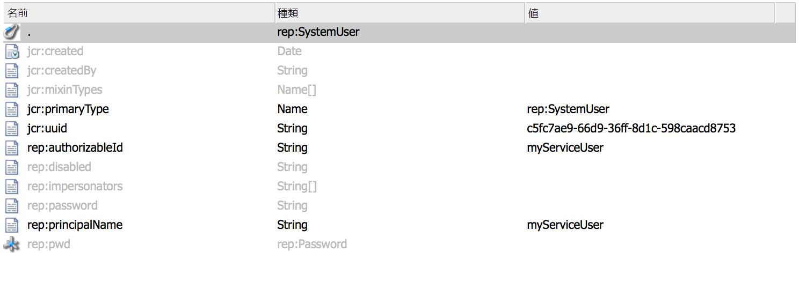

# AEM のサービスユーザー{#service-users-in-aem}

## 概要 {#overview}

これまで、AEM で管理セッションやリソースリゾルバーを取得する主な方法は、Sling に用意されている `SlingRepository.loginAdministrative()` および `ResourceResolverFactory.getAdministrativeResourceResolver()` メソッドを使用することでした。

ただし、これらのメソッドはいずれも[最小権限の原則](https://ja.wikipedia.org/wiki/%E6%9C%80%E5%B0%8F%E6%A8%A9%E9%99%90%E3%81%AE%E5%8E%9F%E5%89%87)に基づいて設計されておらず、開発者がコンテンツの構造や対応するアクセス制御レベル（ACL）を早期に適切に計画しないことがよくあります。そのため、このようなサービスに脆弱性があると、コード自体を動作させるのに管理者権限が不要であっても、`admin` ユーザーへの権限のエスカレーションが発生することがよくあります。

## 管理セッションの廃止方法 {#how-to-phase-out-admin-sessions}

### 優先度 0：機能がアクティブであるか、必要であるか、放置されているかの確認 {#priority-is-the-feature-active-needed-derelict}

管理セッションが使用されていなかったり、機能が完全に無効化されている場合があります。現在の実装環境がこれに当てはまる場合は、機能を削除するか、[NOP コード](https://ja.wikipedia.org/wiki/NOP)を埋め込んでください。

### 優先度 1：要求セッションの使用 {#priority-use-the-request-session}

可能な限り、機能のリファクタリングをおこなって、コンテンツの読み取りや書き込みに特定の認証済み要求セッションを使用できるようにしてください。それが可能でなくても、ほとんどの場合は、以降で説明する方法に従って優先度を適用することによって対応できます。

### 優先度 2：コンテンツの再構築 {#priority-restructure-content}

問題の多くは、コンテンツを再構築することによって解決できます。再構築する際には、次の単純なルールに留意してください。

* **アクセス制御を変更する**

   * 本当にアクセスを必要とするユーザーまたはグループに実際にアクセス権を付与するようにします。

* **コンテンツ構造を調整する**

   * コンテンツを他の場所（使用可能な要求セッションとアクセス制御が一致する場所など）に移動します。
   * コンテンツの精度を変更します。

* **コードのリファクタリングを行って適切なサービスになるようにする**

   * JSP コードからサービスにビジネスロジックを移動します。こうすると、様々なコンテンツモデリングが可能になります。

また、新機能を開発する場合は、次の原則に従ってください。

* **セキュリティ要件に従ってコンテンツ構造を決定する**

   * アクセス制御の管理は自然な形でおこなう必要があります。
   * アクセス制御はアプリケーションではなくリポジトリによって適用する必要があります。

* **ノードタイプを使用する**

   * 設定可能なプロパティセットを制限します。

* **プライバシー設定に配慮する**

   * 非公開プロファイルを例に挙げると、非公開の `/profile` ノードにあるプロファイル画像、電子メールまたは氏名を公開しないようにします。

## 厳格なアクセス制御 {#strict-access-control}

コンテンツの再構築時にアクセス制御を適用したり、新しいサービスユーザーに対してアクセス制御を適用する場合には、可能な限り厳格な ACL を適用する必要があります。考えられるすべてのアクセス制御機能を使用してください。

* 例えば、`jcr:read` を `/apps` に適用するのではなく、`/apps/*/components/*/analytics` にのみ適用します。

* [制限](https://jackrabbit.apache.org/oak/docs/security/authorization/restriction.html)を使用します。

* ノードタイプに ACL を適用します。
* 権限を制限します。

   * 例えば、プロパティの書き込みのみが必要な場合は、`jcr:write` 権限を付与するのではなく、代わりに `jcr:modifyProperties` を使用してください。

## サービスユーザーとマッピング {#service-users-and-mappings}

前述の方法がうまくいかない場合は、Sling 7 に用意されているサービスユーザーマッピングサービスを使用して、バンドルとユーザーのマッピングを設定したり、2 つの対応する API メソッド（` [SlingRepository.loginService()](https://sling.apache.org/apidocs/sling7/org/apache/sling/jcr/api/SlingRepository.html#loginService-java.lang.String-java.lang.String-)` および ` [ResourceResolverFactory.getServiceResourceResolver()](https://sling.apache.org/apidocs/sling7/org/apache/sling/api/resource/ResourceResolverFactory.html#getServiceResourceResolver-java.util.Map-)`）を設定したりすることができます。これらのメソッドは、設定されたユーザーの権限に限定してセッション／リソースリゾルバーを返します。これらのメソッドの特徴は次のとおりです。

* サービスをユーザーにマッピングできます。
* サブサービスユーザーを定義できます。
* 中央設定ポイントは `org.apache.sling.serviceusermapping.impl.ServiceUserMapperImpl` です。
* `service-id` = `service-name` [ “:” subservice-name ]


* `service-id` は、認証用にリソースリゾルバーまたは JCR リポジトリユーザー ID（あるいはその両方）にマッピングされます。
* `service-name` は、サービスを提供するバンドルの記号名です。

## その他の推奨事項 {#other-recommendations}

### admin-session を service-user に置き換える {#replacing-the-admin-session-with-a-service-user}

サービスユーザーとは、パスワードを設定しておらず、特定のタスクを実行するために必要な最小限の権限を持つ JCR ユーザーのことです。パスワードを設定していないということは、サービスユーザーとしてはログインできないことを意味します。

管理セッションを廃止するには、管理セッションをサービスユーザーセッションに置き換えます。必要に応じて、複数のサブサービスユーザーに置き換えることもできます。

管理セッションをサービスユーザーに置き換えるには、次の手順を実行します。

1. 最小権限の原則を念頭に置いて、サービスに必要な権限を特定します。
1. 必要な権限が正確に設定されたユーザーが既に存在するかどうかをチェックします。既存のユーザーがニーズを満たさない場合は、新しいシステムサービスユーザーを作成します。新しいサービスユーザーを作成するには、RTC が必要です。場合によっては、複数のサブサービスユーザー（例えば、書き込み用と読み取り用にそれぞれ 1 つ）を作成して、アクセスをさらに区分化します。
1. ユーザーに対する ACE を設定してテストします。
1. サービスおよび `user/sub-users` に `service-user` マッピングを追加します。

1. サービスユーザーの sling 機能をバンドルから使用できるようにします。つまり、`org.apache.sling.api` を最新バージョンに更新します。

1. コード内の `admin-session` を `loginService` API または `getServiceResourceResolver` API に置き換えます。

## 新しいサービスユーザーの作成 {#creating-a-new-service-user}

ユースケースに適したユーザーが AEM サービスユーザーのリストに存在せず、対応する RTC の発行が承認されていることを確認したら、デフォルトコンテンツに新しいユーザーを追加できます。

推奨されるアプローチは、リポジトリエクスプローラー（*https://&lt;server>:&lt;port>/crx/explorer/index.jsp*）を使用するサービスユーザーを作成することです。

目的は、有効な `jcr:uuid` プロパティを取得することです。このプロパティは、コンテンツパッケージのインストール環境を使用してユーザーを作成する場合に必須です。

サービスユーザーは次の方法で作成できます。

1. *https://&lt;server>:&lt;port>/crx/explorer/index.jsp* のリポジトリエクスプローラーにアクセスします。
1. 画面の左上隅にある「**ログイン**」リンクをクリックして、admin としてログインします。
1. 次に、システムユーザーを作成して名前を付けます。ユーザーをシステムユーザーとして作成するには、中間パスとして `system` を設定し、ニーズに合わせてオプションのサブフォルダーを追加します。

   

1. システムユーザーノードが次のようになっていることを確認します。

   

   >[!NOTE]
   >
   >サービスユーザーに mixin タイプが関連付けられていないことに注意してください。これは、システムユーザーに対するアクセス制御ポリシーが存在しないことを意味します。

対応する .content.xml をバンドルのコンテンツに追加する際には、`rep:authorizableId` を設定し、プライマリタイプを `rep:SystemUser` にしてください。次のようになります。

```xml
<?xml version="1.0" encoding="UTF-8"?>
<jcr:root xmlns:jcr="https://www.jcp.org/jcr/1.0" xmlns:rep="internal"
    jcr:primaryType="rep:SystemUser"
    jcr:uuid="4917dd68-a0c1-3021-b5b7-435d0044b0dd"
    rep:principalName="authentication-service"
    rep:authorizableId="authentication-service"/>
```

## ServiceUserMapper 設定への修正の追加 {#adding-a-configuration-amendment-to-the-serviceusermapper-configuration}

サービスから対応するシステムユーザーへのマッピングを追加するには、` [ServiceUserMapper](https://sling.apache.org/apidocs/sling7/org/apache/sling/serviceusermapping/ServiceUserMapper.html)` サービスのファクトリ設定を作成する必要があります。この操作をモジュール化するには、[Sling 修正メカニズム](https://issues.apache.org/jira/browse/SLING-3578)を使用してこのような設定をおこなうことができます。このような設定をバンドルと共にインストールする場合は、[Sling の初期コンテンツ読み込み機能](https://sling.apache.org/documentation/bundles/content-loading-jcr-contentloader.html)を使用することをお勧めします。

1. バンドルの src/main/resources フォルダーの下にサブフォルダー SLING-INF/content を作成します。
1. このフォルダーに、ファクトリ設定の内容（すべてのサブサービスユーザーマッピングを含む）を定義した org.apache.sling.serviceusermapping.impl.ServiceUserMapperImpl.amended-&lt;ファクトリ設定の一意の名前>.xml という名前のファイルを作成します。例：

1. バンドルの `src/main/resources` フォルダーの下に `SLING-INF/content` フォルダーを作成します。
1. このフォルダーに、ファクトリ設定の内容（すべてのサブサービスユーザーマッピングを含む）を定義した `named org.apache.sling.serviceusermapping.impl.ServiceUserMapperImpl.amended-<a unique name for your factory configuration>.xml` というファイルを作成します。

   例として、ファイル名は `org.apache.sling.serviceusermapping.impl.ServiceUserMapperImpl.amended-com.adobe.granite.auth.saml.xml` としています。

   ```xml
   <?xml version="1.0" encoding="UTF-8"?>
   <node>
       <primaryNodeType>sling:OsgiConfig</primaryNodeType>
       <property>
           <name>user.default</name>
           <value></value>
       </property>
       <property>
           <name>user.mapping</name>
           <values>
               <value>com.adobe.granite.auth.saml=authentication-service</value>
           </values>
       </property>
   </node>
   ```

1. バンドルの `pom.xml` 内の `maven-bundle-plugin` 設定で Sling の初期コンテンツを参照します。例：

   ```xml
   <Sling-Initial-Content>
      SLING-INF/content;path:=/libs/system/config;overwrite:=true;
   </Sling-Initial-Content>
   ```

1. バンドルをインストールし、ファクトリ設定がインストールされていることを確認します。手順は次のとおりです。

   * Web コンソール（*https://serverhost:serveraddress/system/console/configMgr*）にアクセスします。
   * **Apache Sling Service User Mapper Service Amendment** を探します。
   * リンクをクリックして、設定が適切に行われていることを確認します。

## サービスでの共有セッションの処理 {#dealing-with-shared-sessions-in-services}

`loginAdministrative()` を呼び出すと、多くの場合、共有セッションも表示されます。これらのセッションはサービスのアクティベート時に取得され、サービスが停止された場合にのみログアウトされます。これは一般的な動作ですが、次の 2 つの問題を伴います。

* **セキュリティ：**&#x200B;このような管理セッションは、共有セッションにバインドされているリソースやその他のオブジェクトをキャッシュしたり、返したりする目的で使用されます。その後、呼び出しスタックではこれらのオブジェクトが昇格された権限でセッションまたはリソースリゾルバーに適応される可能性があり、それが操作中の管理セッションであるかどうかを呼び出し元が判別できなくなることがよくあります。
* **パフォーマンス：** Oak では、共有セッションはパフォーマンス問題の原因となることがあるので、現在使用は推奨されていません。

このセキュリティリスクに対する最も明白な解決策は、`loginAdministrative()` の呼び出しを `loginService()` に置き換え、権限が制限されたユーザーを対象とすることです。ただし、この方法は潜在的なパフォーマンスの低下には効果がありません。代わりに、セッションに関連しないオブジェクトに要求されたすべての情報をラップすることによって、パフォーマンスの低下を軽減できる可能性があります。その後、要求に応じてセッションを作成（または破棄）します。

推奨されるアプローチは、サービスの API のリファクタリングをおこなって、呼び出し元がセッションの作成と破棄を制御できるようにすることです。

## JSP の管理セッション {#administrative-sessions-in-jsps}

JSP では、関連するサービスがないので `loginService()` を使用できません。ただし、JSP の管理セッションは、通常、MVC パラダイムの違反の兆候を示しています。

これは次の 2 つの方法で解決できます。

1. ユーザーセッションで操作できるようにコンテンツを再構築します。
1. JSP で使用できる API を備えたサービスにロジックを抽出します。

推奨される方法は前者です。

## イベント、レプリケーション、プリプロセッサーおよびジョブの処理 {#processing-events-replication-preprocessors-and-jobs}

イベントやジョブ、場合によってはワークフローを処理する際には、そのイベントのトリガーとなった該当セッションは通常失われます。その結果、イベントハンドラーやジョブプロセッサーでは、多くの場合、管理セッションを使用して処理がおこなわれます。様々なアプローチによってこの問題を解決できますが、それぞれ利点と欠点があります。

1. `user-id` をイベントペイロードに渡し、代理実行を使用します。

    **メリット：**&#x200B;容易に使用できます。

   **デメリット：** `loginAdministrative()` を使用する必要があります。認証済みの要求が再認証されます。

1. データへのアクセス権限を持つサービスユーザーを作成または再利用します。

   **メリット：**&#x200B;現在の設計と一貫しています。変更が最小限で済みます。

   **デメリット：**&#x200B;非常に強力なサービスユーザーに柔軟性を持たせる必要があり、権限のエスカレーションが必要になる可能性が高くなります。セキュリティモデルに抜け道ができます。

1. `Subject` のシリアル化をイベントペイロードに渡し、そのサブジェクトに基づいて `ResourceResolver` を作成します。例えば、`ResourceResolverFactory` で JAAS `doAsPrivileged` を使用します。

   **メリット：**&#x200B;セキュリティの観点からクリーンな実装が行えます。再認証は回避し、元の権限で動作します。セキュリティ関連のコードはイベントの消費者に対して透過的です。

   **デメリット：**&#x200B;リファクタリングが必要です。セキュリティ関連のコードがイベントの消費者に対して透過的であることから、問題に発展する可能性があります。

3 番目のアプローチが現在推奨されている処理手法です。

## ワークフロープロセス {#workflow-processes}

ワークフロープロセス実装では、ワークフローのトリガーとなった該当ユーザーセッションは通常失われます。その結果、ワークフロープロセスでは、多くの場合、管理セッションを使用して処理がおこなわれます。

このような問題を修正するには、[イベント、レプリケーション、プリプロセッサーおよびジョブの処理](/help/sites-administering/security-service-users.md#processing-events-replication-preprocessors-and-jobs)で説明したものと同じアプローチを使用することをお勧めします。

## Sling POST プロセッサーと削除されたページ {#sling-post-processors-and-deleted-pages}

Sling POST プロセッサーの実装では、いくつかの管理セッションが使用されます。通常、管理セッションは、処理中の POST 内で削除待ちになっているノードにアクセスするために使用されます。そのため、要求セッションからは使用できません。削除待ちのノードにアクセスすると、本来アクセスできないメタデータを取得できます。
