# ユーザー管理とセキュリティ{#user-administration-and-security}

この章では、ユーザー認証を設定して管理する方法を説明します。また、AEM における認証と承認の機能の背後にある理論についても説明します。

## AEM のユーザーとグループ {#users-and-groups-in-aem}

この節では、管理しやすいユーザー管理概念の設定に役立つ様々なエンティティと、関連する概念について詳しく取り上げます。

### ユーザー {#users}

ユーザーはアカウントを使用して AEM にログインします。各ユーザーアカウントは一意であり、基本的なアカウントの詳細情報と、割り当てられている権限を保持します。

多くの場合、ユーザーはグループのメンバーです。権限の割り当てをグループに対しておこなうことで簡略化できます。

### グループ {#groups}

グループはユーザーおよび他のグループの集合です。これらはすべてグループのメンバーと呼ばれます。

グループの主な目的は、更新するエンティティの数を減らしてメンテナンスプロセスを簡略化することです。これは、グループに対する変更がそのグループのすべてのメンバーに適用されるという機能を利用したものです。多くの場合、グループには次の項目が反映されます。

* アプリケーション内の役割：コンテンツの閲覧を許可されているユーザー、コンテンツの寄稿を許可されているユーザーなど
* 自身の組織：寄稿者がコンテンツツリー内の別のブランチに制限されている場合、役割を拡張して、別の部門からの寄稿者を区別できます。

したがって、グループは固定される傾向にありますが、ユーザーはより頻繁に追加／削除されます。

構造がよく計画され、整理されていれば、その構造に合わせてグループを使用できます。これにより、全体を把握しやすくなり、効率的な方法で更新をおこなえるようになります。

### 組み込みのユーザーとグループ {#built-in-users-and-groups}

AEM WCM では複数のユーザーとグループがインストールされます。インストール後に初めてセキュリティコンソールにアクセスすると、表示されます。

以下の表は、組み込みのユーザーおよびグループと、次の項目を示しています。

* 簡単な説明
* 必要な変更に関する推奨事項

**（特定の事情によりアカウント自体を削除しない場合、）デフォルトのパスワードはすべて変更してください。

<table>
 <tbody>
  <tr>
   <td>ユーザー ID</td>
   <td>型</td>
   <td>説明</td>
   <td>推奨事項</td>
  </tr>
  <tr>
   <td>
admin
 
デフォルトのパスワード：admin
 </td>
   <td>User</td>
   <td>
フルアクセス権限を持つシステム管理者アカウント
 
このアカウントは、AEM WCM と CRX 間の接続に使用します。
 
このアカウントを誤って削除した場合は、リポジトリを再起動すると（デフォルト設定で）再作成されます。
 
admin アカウントは AEM プラットフォームに必須です。つまり、このアカウントは削除できません。
 </td>
   <td>
このユーザーアカウントのデフォルトのパスワードを変更することを強くお勧めします。
 
可能な場合はインストール時に変更してください。後から変更することもできます。
 
注意：このアカウントを CQ Servlet Engine の admin アカウントと混同しないでください。
 </td>
  </tr>
  <tr>
   <td>
anonymous
 
 
 </td>
   <td>User</td>
   <td>
インスタンスに対する未認証のアクセスのデフォルトの権限を保持します。デフォルトでは、最小限のアクセス権限が保持されます。
 
このアカウントを誤って削除した場合は、起動時に再作成されます。このアカウントを完全に削除することはできませんが、無効にすることは可能です。
 </td>
   <td>オーサーインスタンスの機能に悪影響を及ぼす可能性があるため、このアカウントを削除または無効にしないでください。削除することを義務付けているセキュリティ要件がある場合は、まずシステムに与える影響をテストするようにしてください。</td>
  </tr>
  <tr>
   <td>
作成者
 
デフォルトのパスワード：author
 </td>
   <td>User</td>
   <td>
/content への書き込みが許可されている author アカウント。寄稿者と閲覧者の権限が含まれます。
 
/content ツリー全体へのアクセスが許可されているので、Web マスターとして使用できます。
 
これは組み込みのユーザーではなく、別の Geometrixx Demo のユーザーです。
 </td>
   <td>
このアカウントを完全に削除するか、デフォルトのパスワードを変更することをお勧めします。
 
可能な場合はインストール時に変更してください。後から変更することもできます。
 </td>
  </tr>
  <tr>
   <td>administrators</td>
   <td>グループ</td>
   <td>
すべてのメンバーに管理者権限が付与されているグループ。このグループを編集できるのは admin だけです。
 
フルアクセス権限が割り当てられています。
 </td>
   <td>ノードに対して「deny-everyone」を設定すると、ノードがこのグループで再び有効になった場合に、administrators にのみアクセス権限が割り当てられます。</td>
  </tr>
  <tr>
   <td>content-authors</td>
   <td>グループ</td>
   <td>
コンテンツ編集を担当するグループ。読み取り、変更、作成および削除の権限が必要です。
 </td>
   <td>読み取り、変更、作成および削除の権限を追加する場合は、プロジェクト固有のアクセス権を持つ独自のコンテンツ作成者グループを作成できます。</td>
  </tr>
  <tr>
   <td>contributor</td>
   <td>グループ</td>
   <td>
ユーザーが（機能としてのみ）コンテンツを書き込めるようにするための基本的な権限。
 
/content ツリーに対する権限が割り当てられることはありません。このような権限は個々のグループまたはユーザーに対して割り当てる必要があります。
 </td>
   <td> </td>
  </tr>
  <tr>
   <td>dam-users</td>
   <td>グループ</td>
   <td>一般的な AEM Assets ユーザーのための初期設定済みの参照グループ。このグループのメンバーは、アセットやコレクションのアップロードまたは共有を有効にするための適切な権限を持ちます。</td>
   <td> </td>
  </tr>
  <tr>
   <td>everyone</td>
   <td>グループ</td>
   <td>
グループまたはメンバーシップの関係をすべてのツールで確認することはできませんが、AEM の各ユーザーは everyone グループのメンバーです。
 
このグループはすべてのユーザー（今後作成されるユーザーも含む）に権限を適用するために使用できるので、デフォルトの権限と見なすことができます。
 </td>
   <td>
このグループを変更または削除しないでください。
 
このアカウントを変更すると、セキュリティに影響が生じる可能性があります。
 </td>
  </tr>
  <tr>
   <td>tag-administrators</td>
   <td>グループ</td>
   <td>タグの編集が許可されているグループ。</td>
   <td> </td>
  </tr>
  <tr>
   <td>user-administrators</td>
   <td>グループ</td>
   <td>ユーザー管理をおこなうことができます。つまり、ユーザーとグループを作成する権限が与えられます。</td>
   <td> </td>
  </tr>
  <tr>
   <td>workflow-editors</td>
   <td>グループ</td>
   <td>ワークフローモデルの作成と変更が許可されているグループ。</td>
   <td> </td>
  </tr>
  <tr>
   <td>workflow-users</td>
   <td>グループ</td>
   <td>
ワークフローに参加するユーザーは、workflow-users グループのメンバーである必要があります。このグループのメンバーには /etc/workflow/instances へのフルアクセスが付与されるので、メンバーはワークフローインスタンスを更新できます。
 
このグループは標準インストールに含まれていますが、ユーザーを手動でグループに追加する必要があります。
 </td>
  </tr>
 </tbody>
</table>

## Permissions in AEM {#permissions-in-aem}

AEM では、ACL を使用して、ユーザーまたはグループが実行できるアクションとそのアクションを実行できる場所を決定します。

### 権限と ACL {#permissions-and-acls}

権限では、リソースに対してどのユーザーがどのようなアクションを実行できるかを定義します。権限は、[アクセス制御](#access-control-lists-and-how-they-are-evaluated)の評価の結果です。

You can change the permissions granted/denied to a given user by selecting or clearing the checkboxes for the individual AEM [actions](security.md#actions). A check mark indicates that an action is allowed. No checkmark indicates that an action is denied.

また、グリッド内のチェックマークは、AEM 内のどの場所（パス）でどのような権限がユーザーに付与されているかを示します。

### アクション {#actions}

アクションはページ（リソース）に対して実行できます。階層内のページごとに、ユーザーがそのページに対して実行できるアクションを指定できます。[アクションを許可または拒否できる権限](#permissions-and-acls) 。

<table>
 <tbody>
  <tr>
   <td><strong>アクション </strong></td>
   <td><strong>説明 </strong></td>
  </tr>
  <tr>
   <td>読み取り</td>
   <td>ユーザーはページおよびその子ページを読み取ることができます。</td>
  </tr>
  <tr>
   <td>変更</td>
   <td>
ユーザーは次の処理をおこなうことができます。

    <ul>
     <li>ページ上およびその子ページ上の既存のコンテンツを変更する。</li>
     <li>ページまたはその子ページに新しい段落を作成する。</li>
    </ul> 
JCR レベルでは、ユーザーはプロパティの変更、ロック、バージョン管理、nt の変更によってリソースを変更できます。また、jcr:content 子ノードを定義するノード（cq:Page、nt:file、cq:Asset など）に対する完全な書き込み権限がユーザーに割り当てられます。
 </td>
  </tr>
  <tr>
   <td>作成</td>
   <td>
ユーザーは次の処理をおこなうことができます。

    <ul>
     <li>新しいページまたは子ページを作成する。</li>
    </ul> 
<strong>変更</strong>が拒否されると、jcr:content およびその子ノードの作成がページの変更と見なされるので、jcr:content の下のサブツリーが明確に除外されます。これは、jcr:content 子ノードを定義するノードにのみ適用されます。
 </td>
  </tr>
  <tr>
   <td>削除</td>
   <td>
ユーザーは次の処理をおこなうことができます。

    <ul>
     <li>ページまたはその子ページから既存の段落を削除する。</li>
     <li>ページまたは子ページを削除する。</li>
    </ul> 
<strong>modifyが拒否された場合</strong> 、jcr:contentの下のサブツリーは、jcr:contentの削除として特に除外され、その子ノードはページの変更と見なされます。これは、jcr:content子ノードを定義するノードにのみ適用されます。
 </td>
  </tr>
  <tr>
   <td>ACL 読み取り</td>
   <td>ユーザーはページまたはその子ページのアクセス制御リストを読み取ることができます。</td>
  </tr>
  <tr>
   <td>ACL 編集</td>
   <td>ユーザーはページまたはその子ページのアクセス制御リストを変更できます。</td>
  </tr>
  <tr>
   <td>レプリケーション</td>
   <td>ユーザーはコンテンツを別の環境（パブリッシュ環境など）にレプリケーションできます。この権限は子ページにも適用されます。</td>
  </tr>
 </tbody>
</table>

>[!NOTE]
>
>AEM automatically generates user groups for role-assignment (Owner, Editor, Viewer) in [Collections](/help/assets/manage-collections.md). ただし、それらのグループに ACL を手動で追加すると、AEM 内にセキュリティ上の脆弱性をもたらす恐れがあります。ACL を手動で追加することはお勧めしません。

### アクセス制御リストとその評価方法 {#access-control-lists-and-how-they-are-evaluated}

AEM WCM では、アクセス制御リスト（ACL）を使用して、様々なページに適用される権限を整理します。

アクセス制御リストは個々の権限で構成され、その権限を実際に適用する順序を決定するために使用されます。このリストは、検討中のページの階層に従って作成されます。ページへの適用に適した最初の権限が見つかるまで、作成されたリストが下から上にスキャンされます。

>[!NOTE]
>
>ACL はサンプルに付属しています。アプリケーションに適した ACL を確認し、決定しておくことをお勧めします。To review the ACLs that are included, go to **CRXDE **and select the **Access Control** tab for the following nodes:
>
>`/etc/cloudservices/facebookconnect/geometrixx-outdoorsfacebookapp`:全員に読み取りアクセスを許可します。
>`/etc/cloudservices/twitterconnect/geometrixx-outdoors-twitter-app`:全員に読み取りアクセスを許可します。
>`/home/users/geometrixx-outdoors`:すべてのユーザーが読み取りアクセスを許可し `*/profile*` 、
>`*/social/relationships/following/*`。
>
>カスタムアプリケーションで、またはなど、他の関係のアクセス権を設定でき `*/social/relationships/friend/*` ま `*/social/relationships/pending-following/*`す。
>
>コミュニティに固有のACLを作成する場合、それらのコミュニティに参加するメンバーに追加の権限が与えられる場合があります。 例えば、 `/content/geometrixx-outdoors/en/community/hiking` またはでユーザーがコミュニティに参加する場合などで `/content/geometrixx-outdoors/en/community/winter-sports`す。

### 権限の状態 {#permission-states}

>[!NOTE]
>
>CQ 5.3 ユーザーの場合：
>
>以前のバージョンの CQ とは異なり、ユーザーがページの変更だけをおこなう必要がある場合は、**作成**&#x200B;および&#x200B;**削除**&#x200B;のアクションを許可することができなくなりました。代わりに、既存のページ上のコンポーネントをユーザーが作成、変更または削除できるようにする場合にのみ、**変更**&#x200B;アクションを許可します。
>
>後方互換性を確保するために、アクションのテストでは、**jcr:content** を定義するノードの特別な処理を考慮しません。

| **アクション** | **説明** |
|---|---|
| 許可（チェックマーク） | AEM WCM がこのページまたはその子ページに対するアクションの実行をユーザーに許可します。 |
| 拒否（チェックマークなし） | AEM WCM がこのページまたはその子ページに対するアクションの実行をユーザーに許可しません。 |

この権限は子ページにも適用されます。

親ノードから権限が継承されず、その権限の対象となるローカルエントリが 1 つ以上ある場合は、次の記号がチェックボックスに表示されます。ローカルエントリは CRX 2.2 インターフェイスで作成されたものです（現時点では、ワイルドカード ACL は CRX でのみ作成できます）。

特定のパスにおけるアクションには次の記号が表示されます。

<table>
 <tbody>
  <tr>
   <td>*（アスタリスク）</td>
   <td>1 つ以上の（有効または無効な）ローカルエントリがあります。このようなワイルドカード ACL は CRX で定義されます。</td>
  </tr>
  <tr>
   <td>!（感嘆符）</td>
   <td>現在は無効なエントリが 1 つ以上あります。</td>
  </tr>
 </tbody>
</table>

アスタリスクまたは感嘆符の上にマウスポインターを置くと、宣言されたエントリの詳細を示すツールチップが表示されます。このツールチップは 2 つの部分に分かれています。

<table>
 <tbody>
  <tr>
   <td>上部</td>
   <td>
有効なエントリを示します。
 </td>
  </tr>
  <tr>
   <td>下部</td>
   <td>無効なエントリを示します。このエントリは、ツリー内の別の場所では有効である可能性があります（エントリの範囲を限定するための、対応する ACE を示す特殊な属性が表示されます）。また、これは特定のパスまたは先祖ノードで定義された別のエントリによって無効化されたエントリです。</td>
  </tr>
 </tbody>
</table>

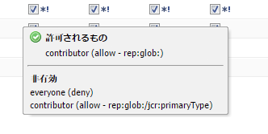

>[!NOTE]
>
>ページの権限が定義されない場合は、すべてのアクションが拒否されます。

アクセス制御リストの管理に関する推奨事項を以下に示します。

* 権限を直接ユーザーに割り当てないでください。権限はグループにのみ割り当てます。

   これにより、グループ数がユーザー数より少なくなり、変更の回数も減るので、メンテナンスが簡略化されます。

* グループまたはユーザーがページの変更だけをおこなえるようにするには、作成または拒否の権限を付与しないでください。付与するのは、変更と読み取りの権限のみです。
* 「拒否」の使用は慎重におこなってください。可能な限り、「許可」のみを使用します。

   「拒否」を使用すると、想定された順序とは異なる順序で権限が適用される場合に、予想外の影響が生じる可能性があります。ユーザーが複数のグループのメンバーである場合は、あるグループからの「拒否」ステートメントによって、別のグループからの「許可」ステートメントが取り消される可能性があります（逆の場合も同様です）。この問題がいつ発生するかを常に把握することは困難であり、予想外の結果が生じやすくなります。一方、「許可」を割り当てておけば、このような不一致は生じません。

   そのため、「拒否」ではなく「許可」を使用することをお勧めします。[ベストプラクティス](#best-practices)を参照してください。

権限を変更する前に、その権限の役割と相互関係について理解しておいてください。AEM WCM における[アクセス権限の評価](/help/sites-administering/user-group-ac-admin.md#how-access-rights-are-evaluated)方法とアクセス制御リストの設定例については、CRX のドキュメントを参照してください。

### 権限 {#permissions}

権限を付与すると、ユーザーやグループが AEM ページ上の AEM 機能にアクセスできるようになります。

パス別の権限を参照するには、ノードを展開したり折りたたんだりします。権限の継承はルートノードまで追跡できます。

権限を許可または拒否するには、対応するチェックボックスをオンまたはオフにします。

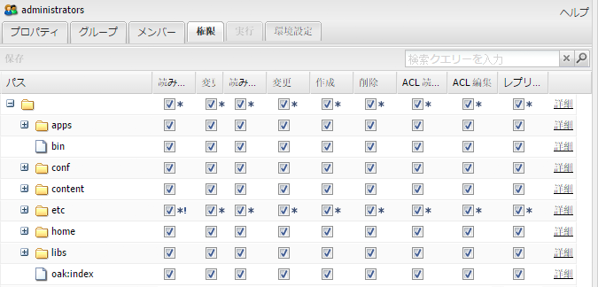

### 権限の詳細情報の表示 {#viewing-detailed-permission-information}

AEM には、グリッド表示の他にも、特定のパスにおける選択したユーザー／グループの権限の詳細表示が用意されています。この詳細表示には追加情報が示されます。

In addition to viewing information, you can also include or exclude the current user or group from a group. See [Adding Users or Groups while Adding Permissions](#adding-users-or-groups-while-adding-permissions). Changes made here are immediately reflected in the upper portion of the detailed view.

詳細表示にアクセスするには、「**権限**」タブで、選択したグループ／ユーザーおよびパスの「**詳細**」をクリックします。

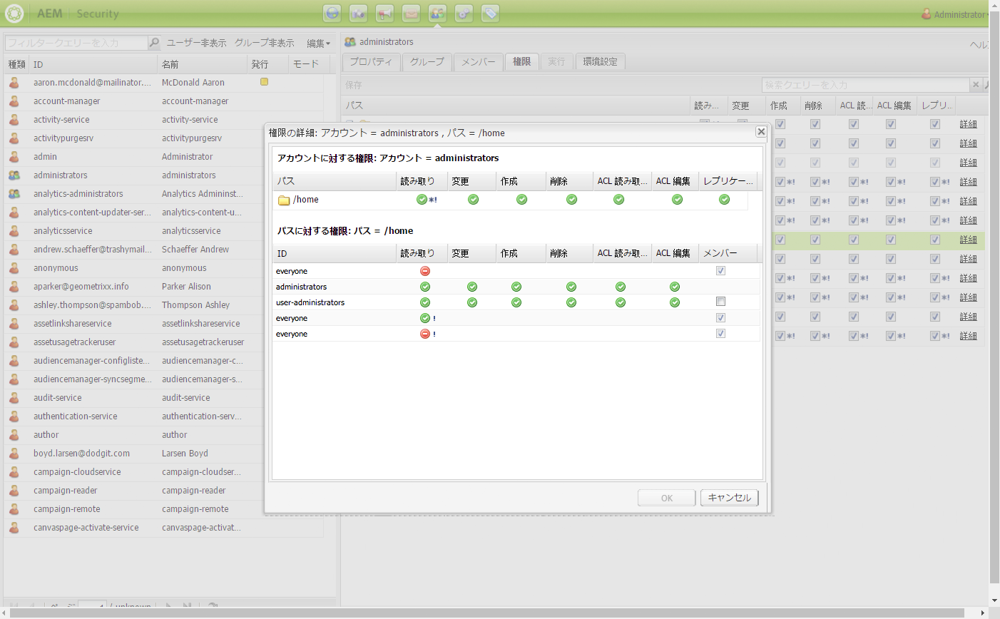

詳細は 2 つの部分に分かれています。

<table>
 <tbody>
  <tr>
   <td>上部</td>
   <td>
ツリーグリッドに表示される情報と同じです。アクションごとに、そのアクションが許可されているか拒否されているかを示すアイコンが表示されます。

    <ul>
     <li>アイコンなし = 宣言されたエントリはない</li>
     <li>(tick) =宣言済みのアクション(allow)</li>
     <li>(-) =宣言済みのアクション（拒否）</li>
    </ul> </td>
  </tr>
  <tr>
   <td>下部</td>
   <td>
次をおこなうユーザーとグループのグリッドが表示されます。

    <ul>
     <li>特定のパスのエントリを宣言する</li>
     <li>特定の許可可能なものまたはグループ</li>
    </ul> </td>
  </tr>
 </tbody>
</table>

### 別のユーザーとしての実行 {#impersonating-another-user}

[別のユーザーとして実行する機能](/help/sites-authoring/user-properties.md#user-settings)では、ユーザーは別のユーザーに成り代わって作業をおこなうことができます。

これは、あるユーザーアカウントが操作をおこなうための他のアカウントを指定できることを意味します。つまり、ユーザー B がユーザー A として実行することを許可されている場合、ユーザー B はユーザー A のアカウントの詳細をすべて使用してアクションを実行できます。

これにより、別のユーザーのアカウントを使用しているかのようにタスクを完了できます。例えば、ユーザーの不在時や過剰な量の作業を短期間だけ分担する場合などに便利です。

>[!NOTE]
>
>In order for impersonating to work for non-admin users, the impersonator (in the above case user-B) is required to have READ permissions in the `/home/users` path.
>
>これを実現する方法の詳細については、[AEM の権限](/help/sites-administering/security.md#permissions-in-aem)を参照してください。

>[!CAUTION]
>
>あるアカウントが別のアカウントとして実行する場合、その判別は非常に困難です。別のユーザーとして実行する機能の開始時と終了時には監査ログにエントリが記録されますが、その他のログファイル（アクセスログなど）には、その機能がイベントに対して実行されたという事実に関する情報が保持されません。そのため、ユーザー B がユーザー A として実行している場合は、ユーザー A がすべてのイベントを実行しているように見えます。

>[!CAUTION]
>
>ページのロックは、別のユーザーとして実行している場合にも実行できます。ただし、この方法でロックされたページをロック解除できるのは、成り代わられたユーザーまたは管理者権限を持つユーザーのみです。
>
>実際にページのロック作業をおこなったユーザーに成り代わっても、ページをロック解除できません。

### ベストプラクティス {#best-practices}

次の表は、権限と特権を使用する場合のベストプラクティスを示しています。

| ルール | 理由 |
|--- |--- |
| **&#x200B;グループを使用する | アクセス権限をユーザー単位で割り当てることは避けてください。これには以下の理由があります。<ul><li>グループ数よりもユーザー数の方がはるかに多いので、グループを使用すると構造が簡略化されます。</li><li>グループはアカウント全体の概要を確認するために役立ちます。</li> <li>グループを使用する方が継承がシンプルになります。</li><li>ユーザーは頻繁に追加／削除されます。グループは長期的に使用されます。</li></ul> |
| **&#x200B;ポジティブに | 常に「許可」ステートメントを使用してグループの権限を指定します（可能な限り）。「拒否」ステートメントの使用は避けてください。グループは順番に評価されます。この順番はユーザーごとに異なる方法で定義される可能性があります。つまり、ステートメントが実装および評価される順番をほとんど制御できない可能性があります。「許可」ステートメントだけを使用すれば、この順番は問題になりません。 |
| *シンプルに* | 新しいインストールの設定時に時間を費やし、入念な検討をおこなうと、効果があります。わかりやすい構造を適用することで、継続的なメンテナンスや管理が簡略化され、現在の担当者と今後の後任の担当者が実装されている内容を容易に把握できます。 |
| **&#x200B;テスト | 練習のためのテストインストールを利用して、様々なユーザーとグループ間の関係を把握してください。 |
| *デフォルトのユーザー／グループ* | セキュリティの問題を回避するために、インストール直後にデフォルトのユーザーとグループを必ず更新してください。 |

## ユーザーとグループの管理 {#managing-users-and-groups}

ユーザーには、システムおよびそのシステムに対する要求をおこなう外部システムを使用する人々が含まれます。

グループはユーザーの集合です。

ユーザーとグループは、セキュリティコンソール内のユーザー管理機能を使用して設定できます。

### セキュリティコンソールを使用したユーザー管理へのアクセス {#accessing-user-administration-with-the-security-console}

すべてのユーザー、グループおよび関連付けられている権限にアクセスするには、セキュリティコンソールを使用します。ここで説明する手順はすべて、このウィンドウで実行されます。

AEM WCM セキュリティにアクセスするには、次のいずれかの操作をおこないます。

* ようこそ画面または AEM の様々な場所で、セキュリティアイコンをクリックします。

* Navigate directly to `https://<server>:<port>/useradmin`. Be sure you log into AEM as an administrator.

次のウィンドウが表示されます。

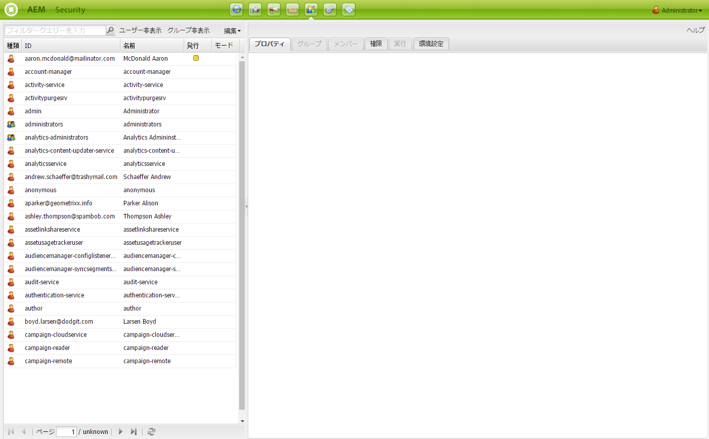

システム内の現在のユーザーとグループがすべて左側のツリーに表示されます。表示する列を選択したり、列の内容を並べ替えたりできます。また、列ヘッダーを新しい位置にドラッグして列の表示順序を変更することもできます。

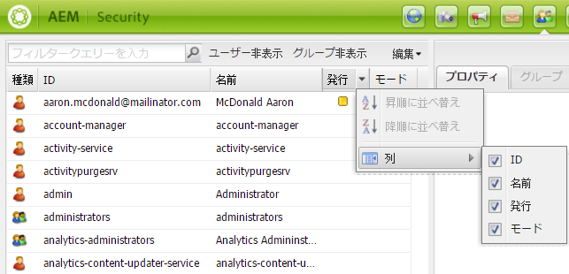

タブを使用すると、様々な設定にアクセスできます。

<!-- ??? in table below. -->

| タブ | 説明 |
|--- |--- |
| フィルターボックス | 表示されているユーザーとグループをフィルタリングするためのメカニズムです。[ユーザーとグループのフィルタリング](#filtering-users-and-groups)を参照してください。 |
| ユーザー非表示 | 表示されているすべてのユーザーを非表示にして、グループだけを残すための切り替えスイッチです。[ユーザーとグループの非表示](#hiding-users-and-groups)を参照してください。 |
| グループ非表示 | 表示されているすべてのグループを非表示にして、ユーザーだけを残すための切り替えスイッチです。[ユーザーとグループの非表示](#hiding-users-and-groups)を参照してください。 |
| 編集 | A menu allowing you to create and delete as well activate and deactivate users or groups. See [Creating Users and Groups](#creating-users-and-groups) and [Deleting Users and Groups](#deleting-users-and-groups). |
| プロパティ | 電子メールの情報、説明および名前の情報を含めることができるユーザーまたはグループの情報が表示されます。ユーザーのパスワードを変更することもできます。See [Creating Users and Groups](#creating-users-and-groups), [Modifying User and Group Properties](#modifying-user-and-group-properties) and [Changing a User Password](#changing-a-user-password). |
| グループ | 選択したユーザーまたはグループが属するすべてのグループが表示されます。選択したユーザーまたはグループを他のグループに割り当てたり、グループから削除したりできます。[グループ](#adding-users-or-groups-to-a-group)を参照してください。 |
| メンバー | グループについてのみ使用できます。特定のグループのメンバーが表示されます。[メンバー](#members-adding-users-or-groups-to-a-group)を参照してください。 |
| 権限 | ユーザーまたはグループに権限を割り当てることができます。以下の権限を制御できます。<ul><li>特定のページ／ノードに関連する権限。See [Setting Permissions](#setting-permissions). </li><li>ページの作成と削除および階層の変更に関連する権限。??? を使用すると、ページを作成および削除するための[権限を割り当てる](#settingprivileges)ことができます（階層の変更など）。</li><li>（通常は作成者から公開への）パスに従った[レプリケーション権限](#setting-replication-privileges)に関連する権限。</li></ul> |
| 実行 | 別のユーザーのアカウントを実行できます。あるユーザーが別のユーザーの代理として操作をおこなう必要がある場合に役立ちます。「 [ユーザーとしての動作](#impersonating-another-user)」を参照してください。 |
| 環境設定 | [グループまたはユーザーの環境設定](#setting-user-and-group-preferences)を指定します。例えば、言語の環境設定などです。 |

### ユーザーとグループのフィルタリング {#filtering-users-and-groups}

フィルター式を入力してリストをフィルタリングできます。これにより、式に一致しないすべてのユーザーとグループが非表示になります。また、[ユーザー非表示とグループ非表示](#hiding-users-and-groups)の各ボタンを使用してユーザーとグループを非表示にすることもできます。

ユーザーまたはグループをフィルタリングするには：

1. 左側のツリーリストの指定されたスペースにフィルター式を入力します。例えば、**admin** と入力すると、この文字列を含むすべてのユーザーとグループが表示されます。
1. 虫眼鏡をクリックしてリストをフィルタリングします。

   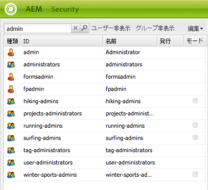

1. すべてのフィルターを削除する場合は、**x** をクリックします。

### Hiding Users and Groups {#hiding-users-and-groups}

システム内のすべてのユーザーとグループのリストをフィルタリングする方法として、ユーザーまたはグループを非表示にすることもできます。切り替えのメカニズムは 2 つあります。「ユーザー非表示」をクリックすると、すべてのユーザーが非表示になります。「グループ非表示」をクリックすると、すべてのグループが非表示になります（ユーザーとグループの両方を同時に非表示にすることはできません）。フィルター式を使用してリストをフィルタリングするには、[ユーザーとグループのフィルタリング](#filtering-users-and-groups)を参照してください。

ユーザーとグループを非表示にするには：

1. **セキュリティ**&#x200B;コンソールで、「**ユーザー非表示**」または「**グループ非表示**」をクリックします。選択したボタンがハイライト表示されます。

   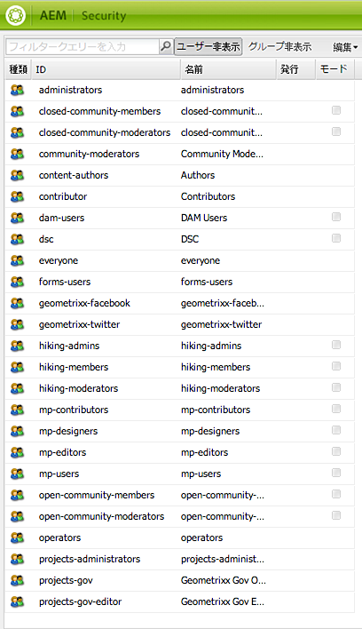

1. ユーザーまたはグループを再度表示するには、対応するボタンをもう一度クリックします。

### ユーザーとグループの作成 {#creating-users-and-groups}

新しいユーザーまたはグループを作成するには：

1. **セキュリティ**&#x200B;コンソールのツリーリストで、「**編集**」をクリックし、「**ユーザーを作成**」または「**グループを作成**」をクリックします。

   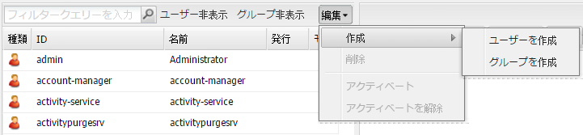

1. ユーザーとグループのどちらを作成するかに従って、必要な詳細を入力します。

   * 「**ユーザーを作成**」を選択した場合は、ログイン ID、姓名、電子メールアドレスおよびパスワードを入力します。デフォルトでは、AEM は姓の最初の文字に基づいてパスを作成しますが、別のパスを選択することもできます。

   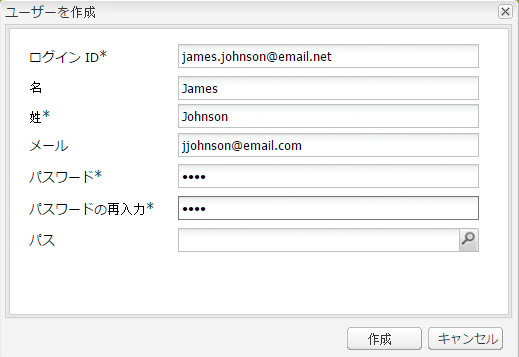

   * 「**グループを作成**」を選択した場合は、グループ ID と説明（オプション）を入力します。

   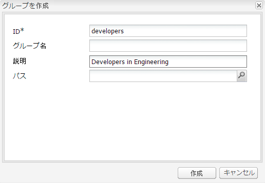

1. 「**作成**」をクリックします。作成したユーザーまたはグループがツリーリストに表示されます。

### ユーザーとグループの削除 {#deleting-users-and-groups}

ユーザーまたはグループを削除するには：

1. **セキュリティ**&#x200B;コンソールで、削除するユーザーまたはグループを選択します。複数の項目を削除する場合は、Shift キーまたは Ctrl キーを押しながらクリックして項目を選択します。
1. 「**編集**」をクリックし、「削除」を選択します。ユーザーまたはグループを削除するかどうかを確認するメッセージが AEM WCM に表示されます。
1. 「**OK**」をクリックして確定するか、「キャンセル」をクリックしてアクションをキャンセルします。

### ユーザーとグループのプロパティの変更 {#modifying-user-and-group-properties}

ユーザーとグループのプロパティを変更するには：

1. **セキュリティ**&#x200B;コンソールで、変更するユーザーまたはグループの名前をダブルクリックします。

1. 「**プロパティ**」タブをクリックし、必要な変更をおこなって「**保存**」をクリックします。

   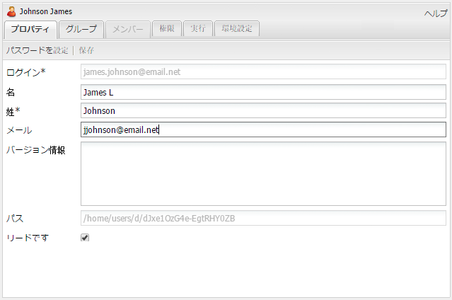

>[!NOTE]
>
>ユーザーのプロパティの一番下にユーザーのパスが表示されます。このパスは変更できません。

### Changing a User Password {#changing-a-user-password}

以下の手順を使用して、ユーザーのパスワードを変更します。

>[!NOTE]
>
>You cannot use the Security console to change the admin password. To change the password for the admin account, use the [Users console](/help/sites-administering/granite-user-group-admin.md#changing-the-password-for-an-existing-user) that Granite Operations provides.
>
>JEEでAEM Formsを使用している場合は、次の手順に従ってパスワードを変更しないでください。JEE上のAEM Forms管理コンソール(/adminui)を使用してパスワードを変更します。

1. **セキュリティ**&#x200B;コンソールで、パスワードを変更するユーザーの名前をダブルクリックします。
1. 「**プロパティ**」タブをクリックします（まだアクティブでない場合）。
1. 「**パスワードを設定**」をクリックします。パスワードを設定ウィンドウが開きます。このウィンドウでパスワードを変更できます。

   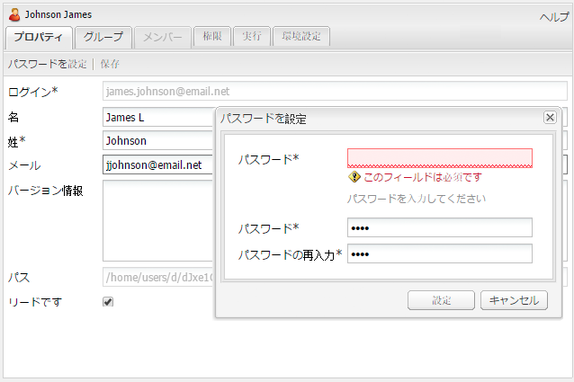

1. 新しいパスワードを 2 回入力します。パスワードはクリアテキストとして表示されないので、確認のために 2 回入力する必要があります。2 つのパスワードが一致しない場合は、エラーが表示されます。
1. 「**設定**」をクリックして、アカウントの新しいパスワードを有効にします。

### グループへのユーザーまたはグループの追加 {#adding-users-or-groups-to-a-group}

AEM には、ユーザーまたはグループを既存のグループに追加するための方法が 3 つ用意されています。

* グループに属している場合は、メンバー（ユーザーまたはグループ）を追加できます。
* メンバーである場合は、グループにメンバーを追加できます。
* 権限を使用する場合は、グループにメンバーを追加できます。

### グループ - グループへのユーザーまたはグループの追加 {#groups-adding-users-or-groups-to-a-group}

「**グループ**」タブには、現在のアカウントが属するグループが表示されます。このタブを使用して、選択したアカウントをグループに追加できます。

1. グループに割り当てるアカウント（ユーザーまたはグループ）の名前をダブルクリックします。
1. 「**グループ**」タブをクリックします。アカウントが既に属しているグループのリストが表示されます。
1. ツリーリストで、アカウントに追加するグループの名前をクリックし、**グループ**&#x200B;ウィンドウにドラッグします（複数のユーザーを追加する場合は、Shift キーまたは Ctrl キーを押しながら名前をクリックしてドラッグします）。

   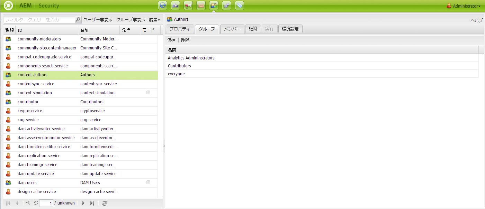

1. 「**保存**」をクリックして変更を保存します。

### Members - Adding Users or Groups to a Group {#members-adding-users-or-groups-to-a-group}

「**メンバー**」タブはグループについてのみ使用できます。このタブには、現在のグループに属しているユーザーとグループが表示されます。このタブを使用して、アカウントをグループに追加できます。

1. メンバーを追加するグループの名前をダブルクリックします。
1. 「**メンバー**」タブをクリックします。このグループに既に属しているメンバーのリストが表示されます。
1. ツリーリストで、グループに追加するメンバーの名前をクリックし、**メンバー**&#x200B;ウィンドウにドラッグします（複数のユーザーを追加する場合は、Shift キーまたは Ctrl キーを押しながら名前をクリックしてドラッグします）。

   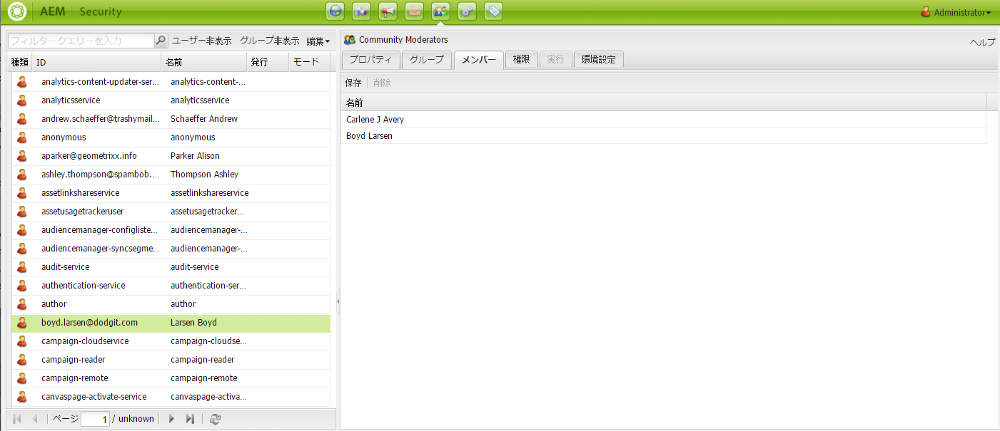

1. 「**保存**」をクリックして変更を保存します。

### Adding Users or Groups while Adding Permissions {#adding-users-or-groups-while-adding-permissions}

特定のパスにあるグループにメンバーを追加するには：

1. ユーザーを追加するグループまたはユーザーの名前をダブルクリックします。

1. 「**権限**」タブをクリックします。

1. 権限を追加するパスに移動して、「**詳細**」をクリックします。詳細ウィンドウの下部には、対象のページに対する権限を持つユーザーの情報が表示されます。

   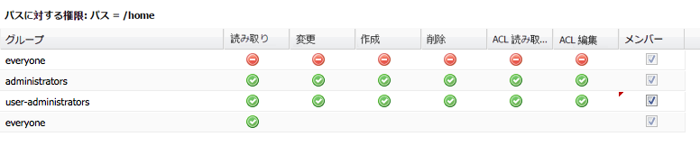

1. 対象のパスに対する権限を追加するメンバーの「**メンバー**」列のチェックボックスをオンにします。権限を削除するメンバーのチェックボックスはオフにしてください。変更をおこなったセルには赤い三角形が表示されます。
1. 「**OK**」をクリックして、変更を保存します。

### グループからのユーザーまたはグループの削除 {#removing-users-or-groups-from-groups}

AEM には、ユーザーまたはグループをグループから削除するための方法が 3 つ用意されています。

* グループプロファイルに属している場合は、メンバー（ユーザーまたはグループ）を削除できます。
* メンバープロファイルに属している場合は、グループからメンバーを削除できます。
* 権限を使用する場合は、グループからメンバーを削除できます。

### グループ - グループからのユーザーまたはグループの削除 {#groups-removing-users-or-groups-from-groups}

グループからユーザーまたはグループアカウントを削除するには：

1. グループから削除するグループまたはユーザーアカウントの名前をダブルクリックします。
1. 「**グループ**」タブをクリックします。選択したアカウントが属しているグループが表示されます。
1. **グループ**&#x200B;ウィンドウで、グループから削除するユーザーまたはグループの名前をクリックして、「**削除**」をクリックします（複数のアカウントを削除する場合は、Shift キーまたは Ctrl キーを押しながら名前をクリックして、「**削除**」をクリックします）。

   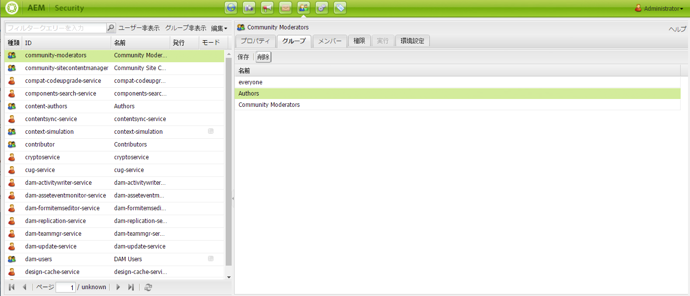

1. 「**保存**」をクリックして変更を保存します。

### メンバー - グループからのユーザーまたはグループの削除 {#members-removing-users-or-groups-from-groups}

グループからアカウントを削除するには：

1. メンバーを削除するグループの名前をダブルクリックします。
1. 「**メンバー**」タブをクリックします。このグループに既に属しているメンバーのリストが表示されます。
1. **メンバー**&#x200B;ウィンドウで、グループから削除するメンバーの名前をクリックして、「**削除**」をクリックします（複数のユーザーを削除する場合は、Shift キーまたは Ctrl キーを押しながら名前をクリックして、「**削除**」をクリックします）。

   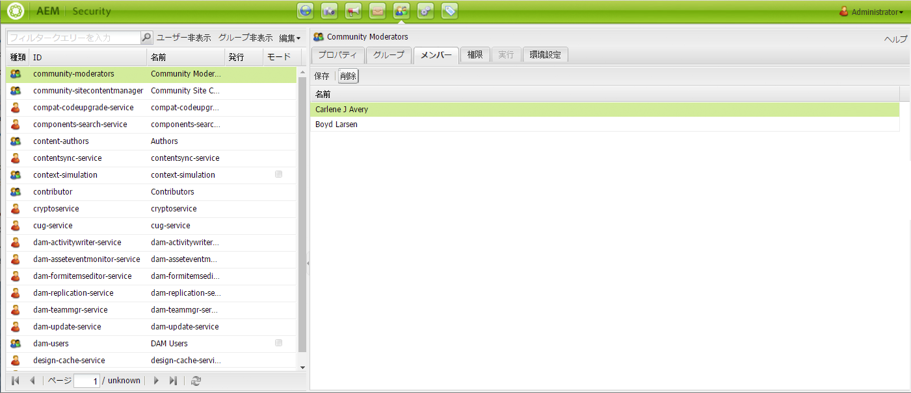

1. 「**保存**」をクリックして変更を保存します。

### 権限を追加する際のユーザーまたはグループの削除 {#removing-users-or-groups-while-adding-permissions}

特定のパスにあるグループからメンバーを削除するには：

1. ユーザーを削除するグループまたはユーザーの名前をダブルクリックします。

1. 「**権限**」タブをクリックします。

1. 権限を削除するパスに移動して、「**詳細**」をクリックします。詳細ウィンドウの下部には、対象のページに対する権限を持つユーザーの情報が表示されます。

   

1. 対象のパスに対する権限を追加するメンバーの「**メンバー**」列のチェックボックスをオンにします。権限を削除するメンバーのチェックボックスはオフにしてください。変更をおこなったセルには赤い三角形が表示されます。
1. 「**OK**」をクリックして、変更を保存します。

### ユーザーの同期 {#user-synchronization}

When the deployment is a [publish farm](/help/sites-deploying/recommended-deploys.md#tarmk-farm), users and groups need to be synchronized among all publish nodes.

ユーザー同期の概要とそれを有効にする方法について詳しくは、[ユーザー同期](/help/sites-administering/sync.md)を参照してください。

## 権限の管理 {#managing-permissions}

>[!NOTE]
>
>Adobe は、権限管理のための新しいタッチ UI ベースのプリンシパルビューを導入しました。使い方の詳細については、[このページ](/help/sites-administering/touch-ui-principal-view.md)を参照してください。

ここでは、権限（レプリケーション権限を含む）を設定する方法について説明します。

### 権限の設定 {#setting-permissions}

ユーザーは権限を使用して、特定のパスにあるリソースに対して特定のアクションを実行できます。権限にはページを作成または削除する機能も含まれます。

権限を追加、変更または削除するには：

1. **セキュリティ**&#x200B;コンソールで、権限を設定するユーザーまたはグループの名前をダブルクリックするか、[ノードを検索](#searching-for-nodes)します。

1. 「**権限**」タブをクリックします。

   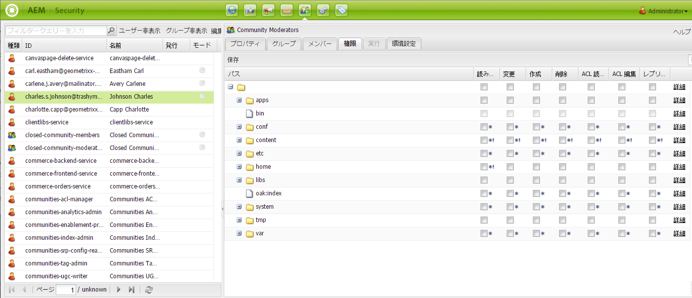

1. ツリーグリッドで、チェックボックスをオンにして、選択したユーザーまたはグループによるアクションの実行を許可します。または、チェックボックスをオフにして、選択したユーザーまたはグループによるアクションの実行を拒否します。詳細を確認するには、「**詳細**」をクリックします。

1. 完了したら、「**保存**」をクリックします。

### レプリケーション権限の設定 {#setting-replication-privileges}

レプリケーション権限はコンテンツを公開する権限です。グループとユーザーに対してこの権限を設定できます。

>[!NOTE]
>
>* グループに適用されたレプリケーション権限は、そのグループ内のすべてのユーザーに適用されます。
>* ユーザーのレプリケーション権限はグループのレプリケーション権限に優先します。
>* The Allow replication rights have a higher precedence than the Deny replication rights. See [Permissions in AEM](#permissions-in-aem) for more information.

>

レプリケーション権限を設定するには：

1. リストからユーザーまたはグループを選択し、ダブルクリックして開きます。「**権限**」をクリックします。
1. グリッドで、ユーザーにレプリケーション権限を設定するパスに移動するか、[、ノードを検索](#searching-for-nodes)します。。

1. 選択したパスの「**レプリケーション**」列で、チェックボックスをオンにして、対象のユーザーまたはグループのレプリケーション権限を追加します。または、チェックボックスをオフにして、レプリケーション権限を削除します。AEM では、変更を行った（未保存の）項目に赤い三角形が表示されます。

   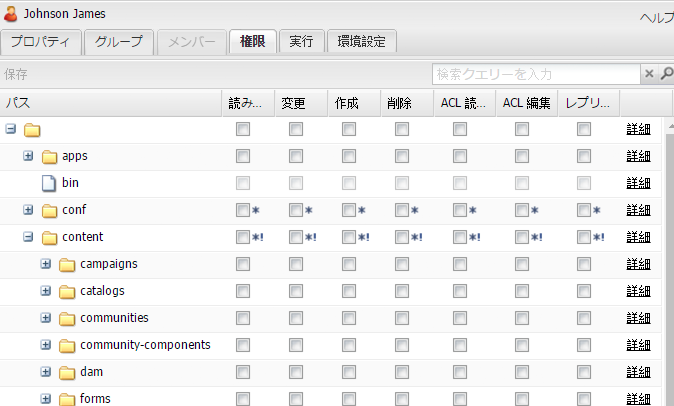

1. 「**保存**」をクリックして変更を保存します。

### ノードの検索 {#searching-for-nodes}

権限を追加または削除する場合に、ノードを参照または検索できます。

パス検索には 2 種類の方法があります。

* パス検索 - 検索文字列が「/」で始まる場合は、特定のパスの直下のサブノードが検索されます。

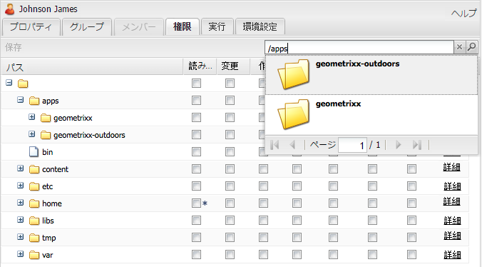

検索ボックスでは以下の操作をおこなうことができます。

| アクション | 動作 |
|--- |--- |
| 右向き矢印キー | 検索結果内のサブノードを選択します。 |
| 下向き矢印キー | 検索をもう一度開始します。 |
| Enter（Return）キー | サブノードを選択してツリーグリッドに読み込みます。 |

* フルテキスト検索 - 検索文字列が「/」で始まらない場合は、パス「/content」の下にあるすべてのノードに対してフルテキスト検索が実行されます。

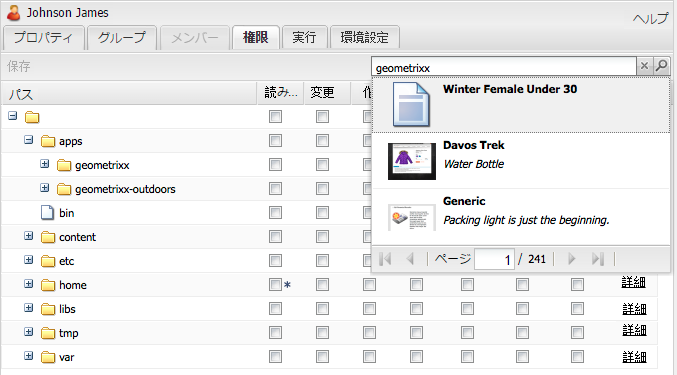

パス検索またはフルテキスト検索を実行するには：

1. セキュリティコンソールで、ユーザーまたはグループを選択して、「**権限**」タブをクリックします。

1. 「検索」ボックスに検索する用語を入力します。

### 別のユーザーとしての実行 {#impersonating-users}

現在のユーザーとしての実行を許可する 1 人以上のユーザーを指定できます。つまり、指定されたユーザーは現在のユーザーのアカウント設定に切り替えて、そのユーザーの代理として操作をおこなうことができます。

元のユーザーが実行できないアクションが許可される可能性があるので、この機能を使用する際は注意が必要です。別のユーザーとして実行する場合は、元のユーザーとしてログインしていないと通知されます。

以下に示す様々なシナリオでこの機能を使用できます。

* あなたがオフィスにいない場合に、別の担当者があなたの代理として操作をおこなうことができます。この機能を使用すると、別の担当者があなたのアクセス権限を引き継ぐことができます。ユーザープロファイルを変更したり、パスワードを公開したりする必要はありません。
* デバッグの目的でこの機能を使用できます。例えば、アクセス権限が制限されているユーザーを Web サイトで検索する方法を確認できます。また、あるユーザーが技術的な問題を訴える場合は、そのユーザーとして実行し、問題を診断して修正できます。

既存のユーザーとして実行するには：

1. ツリーリストで、他のユーザーが操作を代理するユーザーの名前を選択します。ダブルクリックして開きます。
1. 「**実行**」タブをクリックします。
1. 選択したユーザーとして実行することのできるユーザーをクリックします。ユーザーをリストから実行ウィンドウにドラッグします。リストに名前が表示されます。

   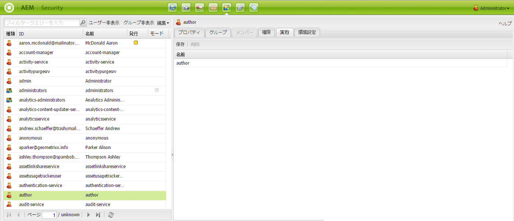

1. 「**保存**」をクリックします。

### ユーザーとグループの環境設定の指定 {#setting-user-and-group-preferences}

ユーザーとグループの環境設定（言語、ウィンドウ管理、ツールバーの環境設定を含む）を指定するには：

1. 環境設定を変更するユーザーまたはグループを左側のツリーで選択します。複数のユーザーまたはグループを選択するには、Ctrl キーまたは Shift キーを押しながら選択項目をクリックします。
1. 「**環境設定**」タブをクリックします。

   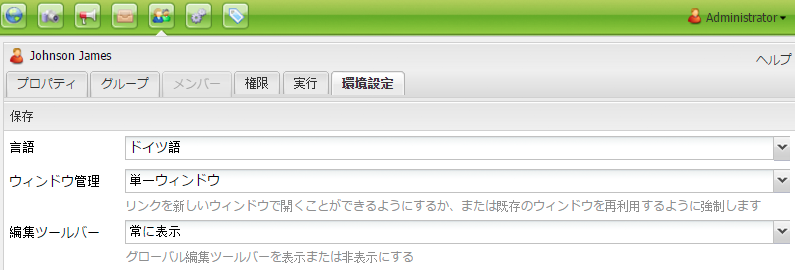

1. 必要に応じて、グループまたはユーザーの環境設定を変更し、完了したら「**保存**」をクリックします。

### ユーザーまたは管理者に他のユーザーの管理権限を付与するための設定 {#setting-users-or-administrators-to-have-the-privilege-to-manage-other-users}

ユーザーまたは管理者が他のユーザーを削除／アクティベート／アクティベート解除する権限を付与するための設定をおこなうには：

1. 他のユーザーを管理する権限を付与するユーザーを administrators グループに追加して、変更を保存します。

   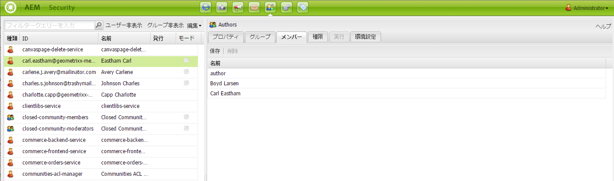

1. ユーザーの「**権限**」タブで、「/」に移動します。「レプリケーション」列で、チェックボックスをオンにして「/」におけるレプリケーションを許可し、「**保存**」をクリックします。

   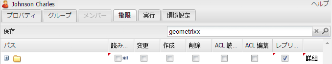

   これで、選択したユーザーがユーザーのアクティベート解除、アクティベート、削除および作成をおこなうことができます。

### プロジェクトレベルでの権限の拡張 {#extending-privileges-on-a-project-level}

アプリケーション専用の権限を実装する場合に、カスタム権限を実装するために確認しておく必要のある情報および CQ 全体でその権限を適用する方法を以下に示します。

The hierarchy-modification privilege is covered by a combination of jcr-privileges. The replication privilege is named **crx:replicate** that is stored/evaluated along with other privileges on the jcr repository. It is, however, not enforced on the jcr level.

The definition and registration of custom privileges is officially part of the [Jackrabbit API](https://jackrabbit.apache.org/api/2.8/org/apache/jackrabbit/api/security/authorization/PrivilegeManager.html) as of version 2.4 (see also [JCR-2887](https://issues.apache.org/jira/browse/JCR-2887)). Further usage is covered by JCR Access Control Management such as definedby [JSR 283](https://jcp.org/en/jsr/detail?id=283) (section 16). In addition, the Jackrabbit API defines a couple of extensions.

The privilege registration mechanism is reflected in the UI under **Repository Configuration**.

The registration of new (custom) privileges is itself protected by a built-in privilege that must be granted on the repository level (in JCR: passing &#39;null&#39; as the &#39;absPath&#39; parameter in the ac mgt api, see jsr 333 for details). By default, **admin** and all members of administrators have that privilege granted.

>[!NOTE]
>
>カスタム権限の検証と評価を実装でおこなう場合は、その権限が組み込みの権限の集合でない限り適用できません。
