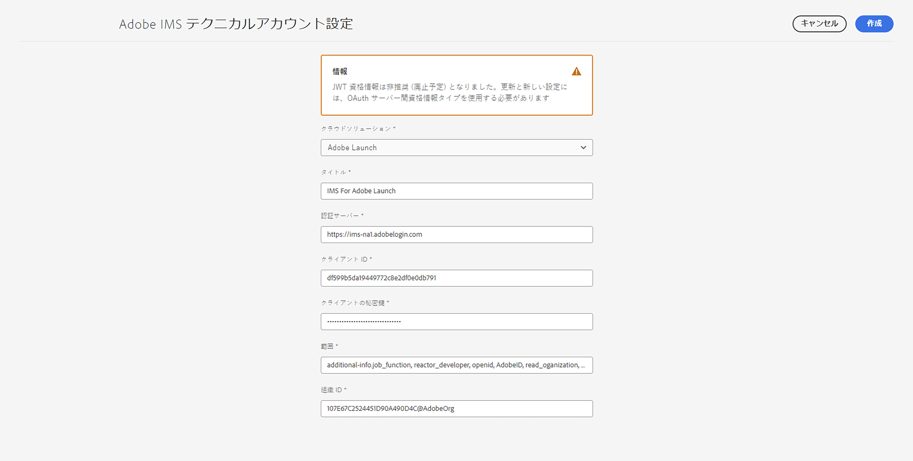
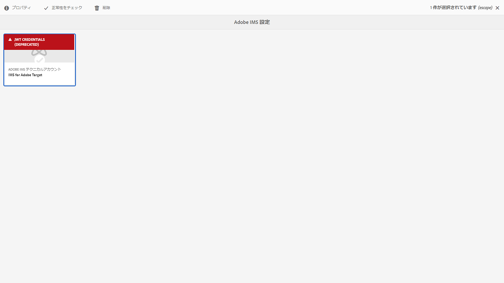
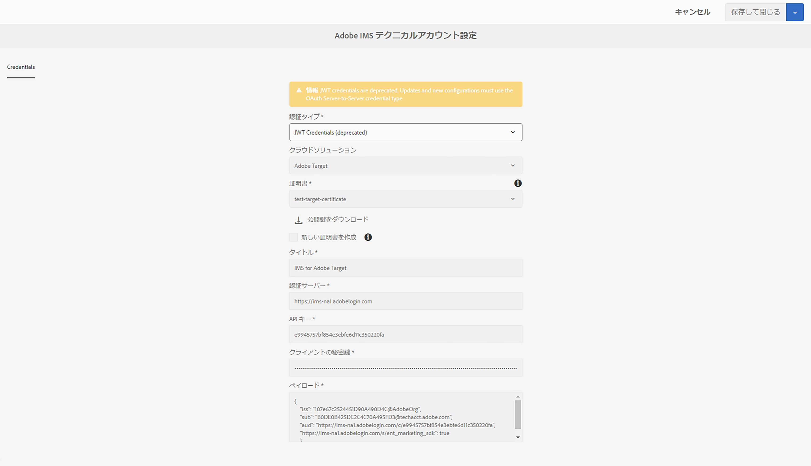

# AEM用の IMS 統合のセットアップ {#setting-up-ims-integrations-for-aem}

>[!NOTE]
>
>アドビのお客様は、[Adobe Developer Console](https://developer.adobe.com/console) を使用すると、様々な API へのアクセスを可能にする資格情報を生成できます。お客様は、OAuth サーバー間からシングルページアプリまで、様々な資格情報タイプから選択できます。これらの資格情報タイプの 1 つであるサービスアカウント（JWT）資格情報は、サービスパック 20 の OAuth サーバー間資格情報に置き換わるために非推奨になりました。 この変更は、ここからダウンロードできるホットフィックスを使用して、Service Pack 11 から Service Pack 20 まで、古い Service Pack に移植できます。

Adobe Experience Manager（AEM）は、他の多くのAdobeソリューションと統合できます。 例えば、Adobe Target、Adobe Analytics などです。

統合では、S2S OAuth で設定された IMS 統合を使用します。

* まず、以下を作成します。

   * [Developer Console の資格情報](#credentials-in-the-developer-console)

* その後、次の操作を実行できます。

   * （新しい）[OAuth 設定](#creating-oauth-configuration)の作成

   * [既存の JWT 設定の OAuth 設定への移行](#migrating-existing-JWT-configuration-to-oauth)

>[!CAUTION]
>
>以前は、[JWT 資格情報を使用して設定が行われていましたが、現在 Adobe Developer Console では廃止予定](/help/sites-administering/jwt-credentials-deprecation-in-adobe-developer-console.md)です。
>
>このような設定は作成または更新できなくなりますが、OAuth 設定に移行することはできます。

## Developer Console の資格情報 {#credentials-in-the-developer-console}

最初の手順として、Adobe Developer Console で OAuth 資格情報を設定する必要があります。

これを行う方法について詳しくは、要件に応じて、Developer Console のドキュメントを参照してください。

* 概要：

   * [サーバー間認証](https://developer.adobe.com/developer-console/docs/guides/authentication/ServerToServerAuthentication/)

* 新しい OAuth 資格情報の作成：

   * [OAuth サーバー間資格情報実装ガイド](https://developer.adobe.com/developer-console/docs/guides/authentication/ServerToServerAuthentication/implementation/)

* 既存の JWT 資格情報の OAuth 資格情報への移行：

   * [サービスアカウント（JWT）資格情報から OAuth サーバー間資格情報への移行](https://developer.adobe.com/developer-console/docs/guides/authentication/ServerToServerAuthentication/migration/)

次に例を示します。

## OAuth 設定の作成 {#creating-oauth-configuration}

OAuth を使用して新しい Adobe IMS 統合を作成するには：

1. AEM で、**ツール**／**セキュリティ**／**Adobe IMS 統合**&#x200B;に移動します。

1. 「**作成**」を選択します。

1. [Developer Console](https://developer.adobe.com/developer-console/docs/guides/authentication/ServerToServerAuthentication/implementation/) の詳細に基づいて設定を完了します。次に例を示します。

   

1. 変更を&#x200B;**保存**&#x200B;します。

## 既存の JWT 設定の OAuth 設定への移行 {#migrating-existing-JWT-configuration-to-oauth}

JWT 資格情報に基づいて既存の Adobe IMS 統合を移行するには：

>[!NOTE]
>
>この例では、IMS の起動設定を示します。

1. AEM で、**ツール**／**セキュリティ**／**Adobe IMS 統合**&#x200B;に移動します。

1. 移行する必要がある JWT 設定を選択します。JWT 設定には、「**JWT 資格情報 （非推奨）**」という警告がマークされます。

1. 次の&#x200B;**プロパティ**&#x200B;を選択します。

   

1. 設定は読み取り専用として開きます。

   

1. **認証タイプ**&#x200B;ドロップダウンから「**OAuth**」を選択します。

   

1. 使用可能なプロパティが更新されます。Developer Console の詳細を使用して、次の手順を実行します。

   

1. 「**保存して閉じる**」を使用して更新内容を保持します。
コンソールに戻ると、**JWT 資格情報（非推奨）**&#x200B;の警告が消えます。