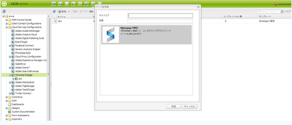
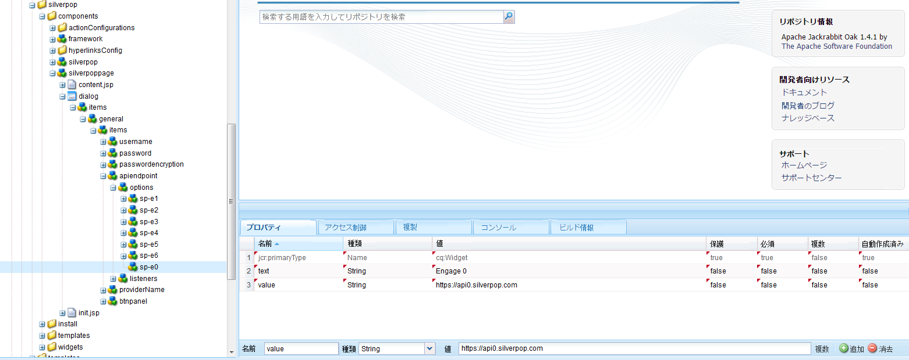
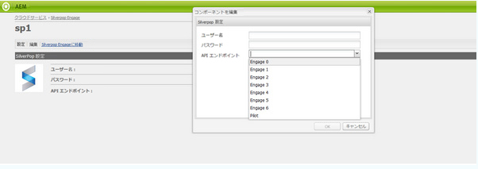

# Silverpop Engage との統合{#integrating-with-silverpop-engage}

>[!NOTE]
>
>既製の AEM は Silverpop と&#x200B;**統合できません**。[Silverpop の統合パッケージ](https://www.adobeaemcloud.com/content/marketplace/marketplaceProxy.html?packagePath=/content/companies/public/adobe/packages/aem620/product/cq-mcm-integrations-silverpop-content)をパッケージ共有からダウンロードしてインスタンスにインストールする必要があります。パッケージをインストールしたら、このドキュメントの説明に従って設定してください。

AEMとSilverpop Engageを統合すると、AEMで作成された電子メールをSilverpopで管理および送信できます。 また、AEMページ上のAEMフォームを介したSilverpopのリード管理機能を使用することもできます。

この統合によって次の機能を使用できるようになります。

* AEM で電子メールを作成し、配信用に Silverpop に公開する機能。
* AEM フォームのアクションを設定して、Silverpop サブスクライバーを作成する機能。

Silverpop Engage が設定されると、Silverpop Engage にニュースレターまたは電子メールを発行できます。

## Silverpop 設定の作成 {#creating-a-silverpop-configuration}

Silverpop 設定は、**クラウドサービス**、**ツール**&#x200B;または **API エンドポイント**&#x200B;で追加できます。すべての方法をここで説明します。

### クラウドサービスを使用した Silverpop の設定 {#configuring-silverpop-via-cloudservices}

Silverpop 設定をクラウドサービスで設定するには：

1. AEM で、**ツール**／**デプロイメント**／**クラウドサービス**&#x200B;をタップまたはクリックします。(Or directly access at `https://<hostname>:<port>/etc/cloudservices.html`.)
1. Under third-party services, click **Silverop Engage** and then **Configure**. Silverpop 設定ウィンドウが開きます。

   >[!NOTE]
   >
   >Silverpop Engage のパッケージをパッケージ共有からダウンロードしない限り、Silverpop Engage をサードパーティのサービスのオプションとして使用できません。

1. タイトルを入力し、オプションで名前を入力して、「**作成**」をクリックします。[** Silverpop Settings**]設定ウィンドウが開きます。
1. ユーザー名、パスワードを入力し、API エンドポイントをドロップダウンリストから選択します。
1. 「**Silverpop に接続」をクリックします。**&#x200B;接続に成功したら、成功ダイアログが表示されます。「**OK**」をクリックしてウィンドウを閉じます。You can go to Silverpop by clicking **Go to Silverpop Engage**.
1. Silverpop が設定されました。「**編集**」をクリックして、この設定を編集できます。
1. また、Silverpop Engage フレームワークは、タイトルおよび名前（オプション）を提供することで、パーソナライズされたアクション用に設定できます。「作成」をクリックすると、既に設定された Silverpop 接続のフレームワークを作成します。

   読み込まれたデータ拡張列は、後で AEM コンポーネントの「**テキストおよびパーソナライゼーション**」で使用できます。

### ツールを使用した Silverpop の設定 {#configuring-silverpop-via-tools}

Silverpop 設定をツールで設定するには：

1. AEM で、**ツール**／**デプロイメント**／**クラウドサービス**&#x200B;をタップまたはクリックします。または、に移動して直接移動し `https://<hostname>:<port>/misadmin#/etc`ます。
1. **ツール**／**クラウドサービス設定**／**Silverpop Engage** を選択します。
1. 「**新規**」をクリックして、**ページを作成**&#x200B;ウィンドウを開きます。

   

1. **タイトル**&#x200B;を入力し、オプションで&#x200B;**名前**&#x200B;を入力して、「**作成**」をクリックします。
1. 前述の手順 4 で示した設定情報を入力します。その手順に従って、Silverpop の設定を完了します。

### 複数の設定の追加 {#adding-multiple-configurations}

複数の設定を追加するには：

1. ようこそページで、「**クラウドサービス**」をクリックし、「**Silverpop Engage**」をクリックします。Click on **Show Configurations** button which appears if one or more Silverpop configurations is available. 利用可能なすべての設定が一覧表示されます。
1. 「利用可能な設定」の横にある「**+**」記号をクリックします。**設定を作成**&#x200B;ウィンドウが開きます。前述の設定手順に従って新しい設定を作成します。

### Silverpop に接続するための API エンドポイントの設定 {#configuring-api-end-points-for-connecting-to-silverpop}

現在、AEM には 6 つの保護されていないエンドポイント（Engage 1～6）があります。Silverpop は、2 つの新しいエンドポイントと、既存のものを変更した接続エンドポイントを提供します。

API エンドポイントを設定するには：

1. 先に進 `/libs/mcm/silverpop/components/silverpoppage/dialog/items/general/items/apiendpoint/options node` む `https://<hostname>:<port>/crxde.`
1. 右クリックして、**Create**／**Create Node**&#x200B;を選択します。
1. Enter the **Name** as `sp-e0` and choose **Type** as `cq:Widget`.
1. 新しく追加したノードに 2 つのプロパティを追加します。

   1. **名前**: `text`, **Type**: `String`、 **値**: `Engage 0`
   1. **名前**: `value`, **Type**: `String`、 **値**: `https://api0.silverpop.com`

   

   「すべて保存」ボタンをクリックします。

1. Create one more node with **Name** as `sp-e7` and **Type** as `cq:Widget`.

   新しく追加したノードに 2 つのプロパティを追加します。

   1. **名前**: `text`, **Type**: `String`、 **値**: `Pilot`
   1. **名前**: `value`, **Type**: `String`、 **値**: `https://apipilot.silverpop.com/XMLAPI`

1. 既存の API エンドポイント（Engage 1～6）を変更するには、それぞれを 1 つずつクリックして、値を次のように置き換えます。

   | **ノード名** | **既存の終点の値** | **新しいエンドポイント値** |
   |---|---|---|
   | sp-e1 | https://api.engage1.silverpop.com/XMLAPI | https://api1.silverpop.com |
   | sp-e2 | https://api.engage2.silverpop.com/XMLAPI | https://api2.silverpop.com |
   | sp-e3 | https://api.engage3.silverpop.com/XMLAPI | https://api3.silverpop.com |
   | sp-e4 | https://api.engage4.silverpop.com/XMLAPI | https://api4.silverpop.com |
   | sp-e5 | https://api.engage5.silverpop.com/XMLAPI | https://api5.silverpop.com |
   | sp-e6 | https://api.pilot.silverpop.com/XMLAPI | https://api6.silverpop.com |

1. 「**すべて保存**」をクリックします。これで、AEM は、保護されたエンドポイントで Silverpop と接続する準備ができました。

   

