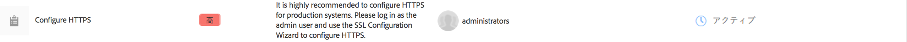
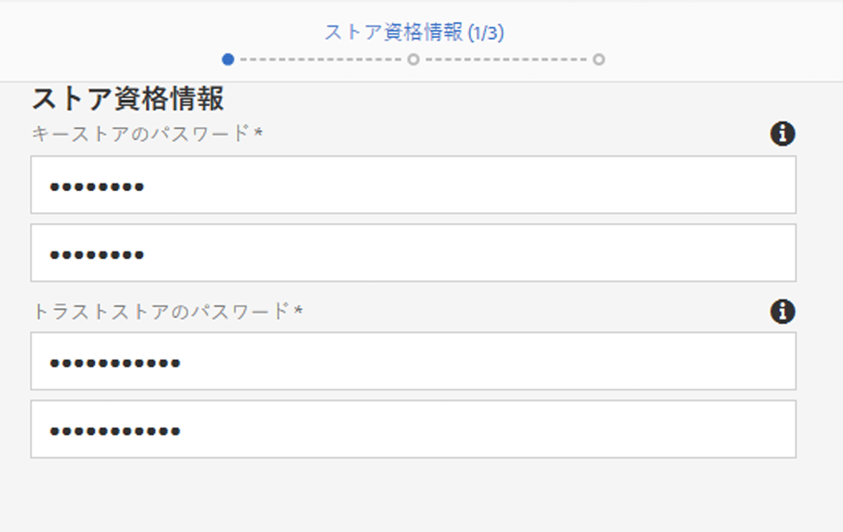
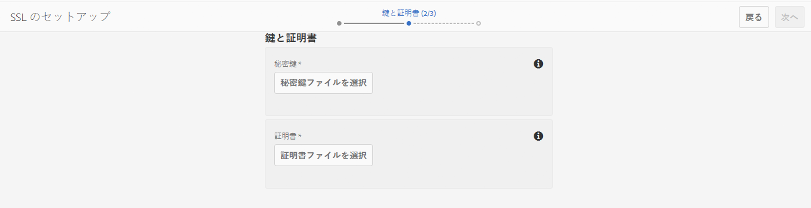
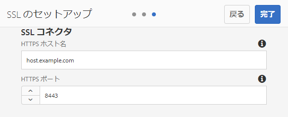

# デフォルトの SSL{#ssl-by-default}

AEMのセキュリティを継続的に強化するため、AdobeではデフォルトでSSLと呼ばれる機能が導入されています。 AEM インスタンスへの接続で HTTPS の使用を促すことがその目的です。

## デフォルトの SSL の有効化 {#enabling-ssl-by-default}

AEM ホーム画面から該当するインボックスメッセージをクリックすることによって、デフォルトの SSL の設定を開始できます。インボックスを表示するには、画面の右上隅にあるベルのアイコンを押します。次に、「**すべて表示**」をクリックします。すべてのアラートのリストが順序付けられてリストビューで表示されます。

リストで、**HTTPS を設定**&#x200B;アラートを選択して開きます。



>[!NOTE]
>
>If the **Configure HTTPS** alert is not present in the Inbox, you can navigate directly to the HTTPS Wizard by going to *<http://serveraddress:serverport/libs/granite/security/content/sslConfig.html?item=configuration%2fconfiguressl&_charset_=utf-8>*

**ssl-service** というサービスユーザーが、この機能のために作成されています。アラートを開くと、次の設定ウィザードに従って操作します。

1. 最初に、「ストア資格情報」を設定します。These are the credentials for the **ssl-service** system user&#39;s key store that will contain the private key and trust store for the HTTPS listener.

   

1. 資格情報を入力したら、ページの右上隅にある「**次へ**」をクリックします。次に、関連する秘密鍵および SSL 接続用の証明書をアップロードします。

   

   >[!NOTE]
   >
   >ウィザードで使用する秘密鍵および証明書の生成方法について詳しくは、以下の[この手順](/help/sites-administering/ssl-by-default.md#generating-a-private-key-certificate-pair-to-use-with-the-wizard)を参照してください。

1. 最後に、HTTPS リスナーの HTTPS ホスト名と TCP ポートを指定します。

   

## デフォルトの SSL の自動化 {#automating-ssl-by-default}

デフォルトの SSL の自動化には 3 つの方法があります。

### HTTP POST の使用 {#via-http-post}

最初の方法には、設定ウィザードで使用される SSLSetup サーバーへの送信が含まれます。

```shell
POST /libs/granite/security/post/sslSetup.html
```

以下のペイロードを POST で使用して設定を自動化できます。

```xml
------WebKitFormBoundaryyBO4ArmGlcfdGDbs
Content-Disposition: form-data; name="keystorePassword"

test
------WebKitFormBoundaryyBO4ArmGlcfdGDbs
Content-Disposition: form-data; name="keystorePasswordConfirm"
test
------WebKitFormBoundaryyBO4ArmGlcfdGDbs
Content-Disposition: form-data; name="truststorePassword"
test
------WebKitFormBoundaryyBO4ArmGlcfdGDbs
Content-Disposition: form-data; name="truststorePasswordConfirm"
test
------WebKitFormBoundaryyBO4ArmGlcfdGDbs
Content-Disposition: form-data; name="privatekeyFile"; filename="server.der"
Content-Type: application/x-x509-ca-cert

------WebKitFormBoundaryyBO4ArmGlcfdGDbs
Content-Disposition: form-data; name="certificateFile"; filename="server.crt"
Content-Type: application/x-x509-ca-cert

------WebKitFormBoundaryyBO4ArmGlcfdGDbs
Content-Disposition: form-data; name="httpsPort"
8443
```

サーブレットは、Sling のすべての POST サーブレットと同様に、200 OK またはエラーの HTTP ステータスコードで応答します。ステータスの詳細は、応答の HTML 本文にあります。

成功の応答とエラーの応答の両方の例を次に示します。

**成功の例** (status = 200):

```xml
<!DOCTYPE html>
<html lang='en'>
<head>
<title>OK</title>
</head>
<body>
<h1>OK</h1>
<dl>
<dt class='foundation-form-response-status-code'>Status</dt>
<dd>200</dd>
<dt class='foundation-form-response-status-message'>Message</dt>
<dd>SSL successfully configured</dd>
<dt class='foundation-form-response-title'>Title</dt>
<dd>OK</dd>
<dt class='foundation-form-response-description'>Description</dt>
<dd>HTTPS has been configured on port 8443. The private key and
certificate were stored in the key store of the user ssl-service.
Please take note of the key store password you provided. You will need
it for any subsequent updating of the private key or certificate.</dd>
</dl>
<h2>Links</h2>
<ul class='foundation-form-response-links'>
<li><a class='foundation-form-response-redirect' href='/'>Done</a></li>
</ul>
</body>
</html>
```

**エラーの例** （ステータス= 500）:

```xml
<!DOCTYPE html>
<html lang='en'>
<head>
<title>Error</title>
</head>
<body>
<h1>Error</h1>
<dl>
<dt class='foundation-form-response-status-code'>Status</dt>
<dd>500</dd>
<dt class='foundation-form-response-status-message'>Message</dt>
<dd>The provided file is not a valid key, DER format expected</dd>
<dt class='foundation-form-response-title'>Title</dt>
<dd>Error</dd>
</dl>
</body>
</html>
```

### パッケージの使用 {#via-package}

または、以下の必要な項目が既に含まれているパッケージをアップロードすることにより、SSL 設定を自動化できます。

* ssl-service ユーザーのキーストア。これは、リポジトリの */home/users/system/security/ssl-service/keystore* にあります。
* 設定 `GraniteSslConnectorFactory`

### ウィザードで使用する秘密鍵／証明書ペアの生成 {#generating-a-private-key-certificate-pair-to-use-with-the-wizard}

以下は、SSL ウィザードで使用できる DER 形式の自己署名証明書を作成する例です。

>[!NOTE]
>
>自己署名証明書は例を示すためにのみ使用しており、実稼動では使用しないでください。

1. 最初に、秘密鍵を作成します。

   ```shell
   openssl genrsa -aes256 -out localhostprivate.key 4096
   openssl rsa -in localhostprivate.key -out localhostprivate.key
   ```

1. 次に、秘密鍵を使用して証明書署名要求(CSR)を生成します。

   ```shell
   openssl req -sha256 -new -key localhostprivate.key -out localhost.csr -subj '/CN=localhost'
   ```

1. SSL 証明書を生成し、秘密鍵を使用してそれに署名します。この例では、1 年後に期限切れになります。

   ```shell
   openssl x509 -req -days 365 -in localhost.csr -signkey localhostprivate.key -out localhost.crt
   ```

秘密鍵を DER 形式に変換します。SSL ウィザードでは鍵は DER 形式である必要があるので、このようにします。

```shell
openssl pkcs8 -topk8 -inform PEM -outform DER -in localhostprivate.key -out localhostprivate.der -nocrypt
```

最後に、このページで最初に説明したグラフィカルな SSL ウィザードの手順 2 で、**localhostprivate.der** を秘密鍵としてアップロードし、**localhost.crt** を SSL 証明書としてアップロードします。

### cURL での SSL 設定の更新 {#updating-the-ssl-configuration-via-curl}

>[!NOTE]
>
>See [Using cURL with AEM](https://helpx.adobe.com/jp/experience-manager/6-4/sites/administering/using/curl.html) for a centralized list of useful cURL commands in AEM.

cURL ツールを使用して SSL 設定を自動化することもできます。そのためには、設定パラメーターを次の URL に送信します。

*https://&lt;serveraddress>:&lt;serverport>/libs/granite/security/post/sslSetup.html*

以下は、設定ウィザードの様々な設定を変更するために使用できるパラメーターです。

* `-F "keystorePassword=password"`  — キーストアパスワード；

* `-F "keystorePasswordConfirm=password"`  — キーストアのパスワードの確認；

* `-F "truststorePassword=password"` - truststoreのパスワード；

* `-F "truststorePasswordConfirm=password"` - truststoreのパスワードを確認します。

* `-F "privatekeyFile=@localhostprivate.der"`  — 秘密鍵を指定します。

* `-F "certificateFile=@localhost.crt"`  — 証明書を指定します。

* `-F "httpsHostname=host.example.com"`— ホスト名を指定します。
* `-F "httpsPort=8443"` - HTTPSリスナーが動作するポート。

>[!NOTE]
>
>SSL 設定を自動化するための cURL は、DER および CRT ファイルが存在するフォルダーから実行すると最も速く実行されます。または、`privatekeyFile` および certificateFile 引数でフルパスを指定できます。
>
>You also need to be authenticated in order to perform the update, so make sure you append the cURL command with the `-u user:passeword` parameter.
>
>正しい cURL POST コマンドは、次のようになります。

```shell
curl -u user:password -F "keystorePassword=password" -F "keystorePasswordConfirm=password" -F "truststorePassword=password" -F "truststorePasswordConfirm=password" -F "privatekeyFile=@localhostprivate.der" -F "certificateFile=@localhost.crt" -F "httpsHostname=host.example.com" -F "httpsPort=8443" https://host:port/libs/granite/security/post/sslSetup.html
```

#### cURL を使用した複数の証明書 {#multiple-certificates-using-curl}

次のように certificateFile パラメーターを繰り返すことで、サーブレットに一連の証明書を送信できます。

`-F "certificateFile=@root.crt" -F "certificateFile=@localhost.crt"..`

コマンドを実行したら、すべての証明書がキーストアに送信されたことを確認します。以下からキーストアを確認してください。[ http://localhost:4502/libs/granite/security/content/userEditor.html/home/users/system/security/ssl-service](http://localhost:4502/libs/granite/security/content/userEditor.html/home/users/system/security/ssl-service)
