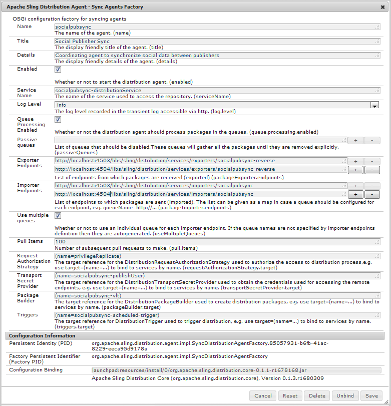
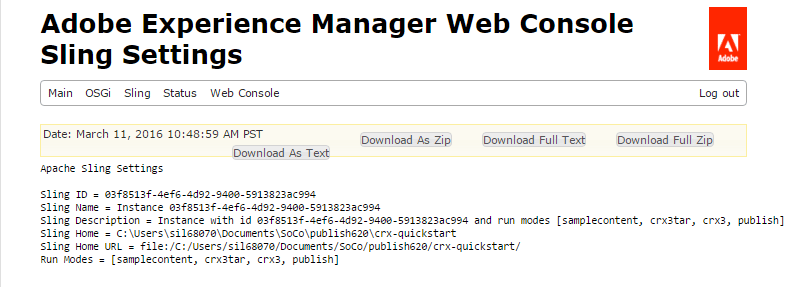

# ユーザーの同期{#user-synchronization}

## 概要 {#introduction}

When the deployment is a [publish farm](/help/sites-deploying/recommended-deploys.md#tarmk-farm), members need to be able to log in and see their data on any publish node.

パブリッシュ環境で作成されたユーザーとユーザーグループ（ユーザーデータ）は、オーサー環境では必要ありません。

オーサー環境で作成されたほとんどのユーザーデータはオーサー環境に残るものと想定されており、パブリッシュインスタンスにはコピーされません。

他のパブリッシュインスタンスが同じユーザーデータにアクセスするには、1 つのパブリッシュインスタンスに加えられた登録と変更をそれらのパブリッシュインスタンスに同期する必要があります。

AEM 6.1以降、ユーザー同期が有効になっている場合、ユーザーデータはファーム内の発行インスタンス間で自動的に同期され、作成者には作成されません。

## Sling 配布 {#sling-distribution}

The user data, along with their [ACLs](/help/sites-administering/security.md), are stored in the [Oak Core](/help/sites-deploying/platform.md), the layer below Oak JCR, and are accessed using the [Oak API](https://helpx.adobe.com/experience-manager/6-5/sites/developing/using/reference-materials/javadoc/org/apache/jackrabbit/oak/api/package-tree.html). With infrequent updates, it is reasonable for user data to be synchronized with other publish instances using [Sling Content Distribution](https://github.com/apache/sling/blob/trunk/contrib/extensions/distribution/README.md) (Sling distribution).

従来のレプリケーションと比較して、Sling配布を使用したユーザー同期のメリットは次のとおりです。

* パブリッシュインスタンスで作成されたユーザー&#x200B;**、ユーザープロファイル&#x200B;**&#x200B;およびユーザーグループ&#x200B;**&#x200B;がオーサー環境に作成されません

* Sling 配布により JCR イベントにプロパティが設定されることで、レプリケーションが無限に繰り返されることなく、パブリッシュ側のイベントリスナーで実行できます
* Sling 配布は派生元でないパブリッシュインスタンスにのみユーザーデータを送信するので、不要なトラフィックが発生しません
* [ユーザーノードに設定されたACL](/help/sites-administering/security.md) 、同期に含まれる

>[!NOTE]
>
>セッションが必要な場合は、SSOソリューションを使用するか、スティッキーセッションを使用して、ユーザーが別のパブリッシャーに切り替わった場合にログインするように設定することをお勧めします。

>[!CAUTION]
>
>ユーザー同期が有効化されている場合でも、***administrators*** グループの同期はサポートされません。代わりに、「diffをインポート」できない場合は、エラーログに記録されます。
>
>Therefore, when the deployment is a publish farm, if a user is added to or removed from the ***administrators** group, the modification must be manually made on each publish instance.

## ユーザー同期の有効化 {#enable-user-sync}

>[!NOTE]
>
>By default, user sync is `disabled`.
>
>ユーザー同期を有効にするには、OSGi の既存の&#x200B;**&#x200B;設定を変更する必要があります。
>
>ユーザー同期を有効にした結果、新しい設定が追加されることはありません。

ユーザー同期では、オーサー環境で作成されていないユーザーデータでもその配布の管理はオーサー環境に依存します。すべての設定は作成者環境で行われるわけではありませんが、各手順では、作成者と公開のどちらで行うかが明確に示されます。

次にユーザー同期の有効化に必要な手順と、[トラブルシューティング](#troubleshooting)の節を示します。

### 前提条件 {#prerequisites}

1. If users and user groups have already been created on one publisher, it is recommended to [manually sync](#manually-syncing-users-and-user-groups) the user data to all publishers prior to configuring and enabling user sync.

ユーザー同期を有効にすると、新規に作成されたユーザーおよびグループのみが同期されるようになります。

1. 最新のコードがインストールされていることを確認します。

* [AEM プラットフォームの更新](https://helpx.adobe.com/jp/experience-manager/kb/aem62-available-hotfixes.html)
* [AEM Communities の更新](/help/communities/deploy-communities.md#latestfeaturepack)

### 1. Apache Sling Distribution Agent - Sync Agents Factory {#apache-sling-distribution-agent-sync-agents-factory}

**ユーザー同期の有効化**

* **オーサー環境で**

   * 管理者権限でログインします
   * [Web コンソール](/help/sites-deploying/configuring-osgi.md)にアクセスします

      * 例：[https://localhost:4502/system/console/configMgr](https://localhost:4502/system/console/configMgr)
   * locate `Apache Sling Distribution Agent - Sync Agents Factory`

      * select the existing configuration to open for edit (pencil icon)
Verify `name`: **`socialpubsync`**

      * select the `Enabled` checkbox
      * select `Save`


### 2. 承認済みユーザーの作成 {#createauthuser}

**権限の設定**&#x200B;この許可されたユーザーは、手順3で作成者のSling配布を設定するために使用されます。

* **各パブリッシュインスタンスで**

   * 管理者権限でログインします
   * [セキュリティコンソール](/help/sites-administering/security.md)にアクセスします

      * for example, [https://localhost:4503/useradmin](https://localhost:4503/useradmin)
   * 新しいユーザーを作成します

      * for example, `usersync-admin`
   * add this user to the **`administrators`** user group
   * [このユーザーのACLを/homeに追加](#howtoaddacl)

      * `Allow jcr:all` 制限を加えて `rep:glob=*/activities/*`


>[!CAUTION]
>
>新しいユーザーを作成する必要があります。
>
>* デフォルトで割り当てられるユーザーは **`admin`** です。
>* コンテンツに `communities-user-admin user.`

>


#### ACL の追加方法 {#addacls}

* CRXDE Lite にアクセスします

   * for example, [https://localhost:4503/crx/de](https://localhost:4503/crx/de)

* ノードを選択 `/home`
* 右側のウィンドウで、 `Access Control` タブを選択します
* select the `+` button to add an ACL entry

   * **プリンシパル**：ユーザー同期用に作成されたユーザーを検索&#x200B;**
   * **型**：`Allow`
   * **権限**: `jcr:all`
   * **制限** :rep:glob: `*/activities/*`
   * 「**OK**」を選択します。

* 「**すべて保存**」を選択します。


関連トピック

* [アクセス権限の管理](/help/sites-administering/user-group-ac-admin.md#access-right-management)
* Troubleshooting section [Modify Operation Exception During Response Processing](#modify-operation-exception-during-response-processing).

### 3. Adobe Granite Distribution - Encrypted Password Transport Secret Provider {#adobegraniteencpasswrd}

**権限の設定**

Once an authorized user, a member of the **`administrators`**user group, has been created on all publish instances, that authorized user must be identified on author as having permission to sync user data from author to publish.

* **オーサー環境で**

   * 管理者権限でログインします
   * [Web コンソール](/help/sites-deploying/configuring-osgi.md)にアクセスします

      * 例：[https://localhost:4502/system/console/configMgr](https://localhost:4502/system/console/configMgr)
   * locate `com.adobe.granite.distribution.core.impl.CryptoDistributionTransportSecretProvider.name`
   * select the existing configuration to open for edit (pencil icon)
Verify `property name`: **`socialpubsync-publishUser`**

   * 手順 2 でパブリッシュ環境で作成した[承認済みユーザー](#createauthuser)のユーザー名とパスワードを設定します

      * for example, `usersync-admin`


### 4. Apache Sling Distribution Agent - Queue Agents Factory {#apache-sling-distribution-agent-queue-agents-factory}

**ユーザー同期の有効化**

* **パブリッシュ環境で**:

   * 管理者権限でサインインします。
   * [Web コンソール](/help/sites-deploying/configuring-osgi.md)にアクセスします

      * 例：[https://localhost:4503/system/console/configMgr](https://localhost:4503/system/console/configMgr)
   * locate `Apache Sling Distribution Agent - Queue Agents Factory`

      * select the existing configuration to open for edit (pencil icon)
Verify `Name`: `socialpubsync-reverse`

      * select the `Enabled` checkbox
      * select `Save`
   * **発行インスタンスごとに**繰り返し


### 5. Adobe Social Sync  -  Diff Observer Factory {#diffobserver}

**グループ同期の有効化**

* **各パブリッシュインスタンスで**:

   * 管理者権限でサインインします。
   * [Web コンソール](/help/sites-deploying/configuring-osgi.md)にアクセスします

      * 例：[https://localhost:4503/system/console/configMgr](https://localhost:4503/system/console/configMgr)
   * locate **`Adobe Social Sync - Diff Observer Factory`**

      * 編集する既存の設定を選択します（鉛筆アイコン）

         検証 `agent name`: `socialpubsync-reverse`

      * select the `Enabled` checkbox
      * select `Save`


### 6. Apache Sling Distribution Trigger - Scheduled Triggers Factory {#apache-sling-distribution-trigger-scheduled-triggers-factory}

**（オプション）ポーリング間隔の変更**

デフォルトでは、オーサー環境では 30 秒ごとに変更をポーリングします。この間隔を変更するには：

* **オーサー環境で**

   * 管理者権限でログインします
   * [Web コンソール](/help/sites-deploying/configuring-osgi.md)にアクセスします

      * 例：[https://localhost:4502/system/console/configMgr](https://localhost:4502/system/console/configMgr)
   * locate `Apache Sling Distribution Trigger - Scheduled Triggers Factory`

      * 編集する既存の設定を選択します（鉛筆アイコン）

         * 検証 `Name`: `socialpubsync-scheduled-trigger`
      * set the `Interval in Seconds` to the desired interval
      * select `Save`


## 複数のパブリッシュインスタンスの設定 {#configure-for-multiple-publish-instances}

デフォルトの設定は、単一のパブリッシュインスタンス用の設定です。ユーザーの同期を有効にする理由は、発行ファームなど、複数の発行インスタンスを同期することです。そのため、追加の発行インスタンスを同期エージェントファクトリに追加する必要があります。

### 7. Apache Sling Distribution Agent - Sync Agents Factory {#apache-sling-distribution-agent-sync-agents-factory-1}

**パブリッシュインスタンスを追加するには：**

* **オーサー環境で**

   * 管理者権限でログインします
   * [Web コンソール](/help/sites-deploying/configuring-osgi.md)にアクセスします

      * 例：[https://localhost:4502/system/console/configMgr](https://localhost:4502/system/console/configMgr)
   * locate `Apache Sling Distribution Agent - Sync Agents Factory`

      * select the existing configuration to open for edit (pencil icon)
Verify `Name`: `socialpubsync`




* **Exporter Endpoints** 各パブリッシャーにエクスポーターエンドポイントが必要です。例えば、パブリッシャーが localhost:4503 と 4504 の 2 つの場合、次の 2 つのエントリが必要です。

   * `https://localhost:4503/libs/sling/distribution/services/exporters/socialpubsync-reverse`
   * `https://localhost:4504/libs/sling/distribution/services/exporters/socialpubsync-reverse`

* **インポーターエンドポイント**&#x200B;各発行者にはインポーターエンドポイントが必要です。 例えば、パブリッシャーが localhost:4503 と 4504 の 2 つの場合、次の 2 つのエントリが必要です。

   * `https://localhost:4503/libs/sling/distribution/services/importers/socialpubsync`
   * `https://localhost:4504/libs/sling/distribution/services/importers/socialpubsync`

* select `Save`

### 8. AEM Communities User Sync Listener {#aem-communities-user-sync-listener}

**（オプション）追加の JCR ノードの同期**

複数のパブリッシュインスタンス間で同期するカスタムデータがある場合は、次のようにします。

* **各パブリッシュインスタンスで**:

   * 管理者権限でサインインします。
   * [Web コンソール](/help/sites-deploying/configuring-osgi.md)にアクセスします

      * for example, `https://localhost:4503/system/console/configMgr`
   * locate `AEM Communities User Sync Listener`
   * select the existing configuration to open for edit (pencil icon)
Verify `Name`: `socialpubsync-scheduled-trigger`


* **Node Types** 同期するノードタイプのリストです。sling:Folder 以外のすべてのノードタイプがここにリストされます（sling:folder は別個に処理されます）。 同期されるノードタイプのデフォルトのリストは次のとおりです。

   * rep:User
   * nt:unstructured
   * nt:resource

* **Ignorable Properties** 何らかの変更が検出された場合に無視されるプロパティのリストです。これらのプロパティに対する変更は、他の変更の副作用として同期される場合がありますが（同期は常にノードレベルでおこなわれるので）、これらのプロパティに対する変更そのものが同期をトリガーすることはありません。 無視されるデフォルトのプロパティは次のとおりです。

   * cq:lastModified

* **Ignorable Nodes** 同期中に完全に無視されるサブパスです。このサブパスの下にあるものはどのタイミングでも同期されません。 無視されるデフォルトのノードは次のとおりです。

   * .tokens
   * system

* **Distributed Folders** 同期が不要であるのでほとんどの sling:Folders は無視されます。数少ない例外を次に示します。 同期されるデフォルトのフォルダーは次のとおりです。

   * segments/scoring
   * social/relationships
   * activities

### 9. 一意の Sling ID {#unique-sling-id}

>[!CAUTION]
>
>2 つ以上のパブリッシュインスタンスで Sling ID が一致すると、ユーザーグループの同期が失敗します。

Sling ID がパブリッシュファームの複数のパブリッシュインスタンスで同じである場合、ユーザーグループは同期されません。

すべての Sling ID の値が異なることを確認するには、各パブリッシュインスタンスで次の手順を実行します。

1. 参照 `http://<host>:<port>/system/console/status-slingsettings`
1. **Sling ID** の値を確認する



あるパブリッシュインスタンスの Sling ID が他のパブリッシュインスタンスの Sling ID と一致する場合は、次のようにします。

1. Sling ID が一致するパブリッシュインスタンスの一方を停止する
1. crx-quickstart/launchpad/felix ディレクトリで

   * *sling.id.file* という名前のファイルを検索して削除する

      * 例えば、Linuxシステムでは：
         `rm -i $(find . -type f -name sling.id.file)`

      * 例えば、Windowsシステムでは、次の操作を行います。
         `use windows explorer and search for *sling.id.file*`

1. 発行インスタンスの開始

   * スタートアップ時に新しい Sling ID が割り当てられる

1. **Sling ID** が一意であることを確認する

すべてのパブリッシュインスタンスの Sling ID が一意になるまでこの手順を繰り返します。

## Vault Package Builder Factory {#vault-package-builder-factory}

更新が適切に同期されるようにするには、ユーザー同期用に Vault Package Builder を変更する必要があります。

* 各 AEM パブリッシュインスタンスで
* [Web コンソール](/help/sites-deploying/configuring-osgi.md)にアクセスします

   * 例：[https://localhost:4503/system/console/configMgr](https://localhost:4503/system/console/configMgr)

* を探す `Apache Sling Distribution Packaging - Vault Package Builder Factory`

   * `Builder name: socialpubsync-vlt`

* 編集アイコンを選択します。
* 2つ追加 `Package Node Filters`:

   * `/home/users|-.*/.tokens`
   * `/home/users|-.*/rep:cache`

* ポリシーの処理：

   * 既存の rep:policy ノードを新しいノードで上書きするには、3 つ目のパッケージフィルターを追加します

      * `/home/users|+.*/rep:policy`
   * ポリシーが配布されないようにするには、次のように設定します

      * `Acl Handling:` `IGNORE`


## What Happens When ... {#what-happens-when}

### パブリッシュ環境でのユーザーの自己登録またはプロファイルの編集 {#user-self-registers-or-edits-profile-on-publish}

仕様上、パブリッシュ環境で作成されたユーザーとプロファイル（自己登録）は、オーサー環境では表示されません。

When the topology is a [publish farm](/help/sites-deploying/recommended-deploys.md#tarmk-farm) and user sync has been correctly configured, the *user *and *user profile* is synchronized across the publish farm using Sling distribution.

### セキュリティコンソールでのユーザーまたはユーザーグループの作成 {#users-or-user-groups-are-created-using-security-console}

仕様上、パブリッシュ環境で作成されたユーザーデータは、オーサー環境では表示されません。その反対も同様です。

[ユーザー管理およびセキュリティ](/help/sites-administering/security.md)コンソールを使用してパブリッシュ環境で新しいユーザーを追加すると、ユーザーの同期機能により、新しいユーザーとそのグループメンバーシップがその他のパブリッシュインスタンスに同期されます（必要な場合）。ユーザー同期は、セキュリティコンソールを使用して作成されたユーザーグループも同期します。

## トラブルシューティング {#troubleshooting}

### ユーザー同期をオフラインにする方法 {#how-to-take-user-sync-offline}

[パブリッシャーを削除](#how-to-remove-a-publisher)したり、[データを手動で同期](#manually-syncing-users-and-user-groups)したりするためにユーザー同期をオフラインにするには、配布キューが空であり、静止している必要があります。

配布キューの状態をチェックするには：

* オーサー環境で:

   * using [CRXDE Lite](/help/sites-developing/developing-with-crxde-lite.md)

      * look for entries in `/var/sling/distribution/packages`

         * `distrpackage_*` _* という名前パターンを持つフォルダー名
   * [パッケージマネージャー](/help/sites-administering/package-manager.md)を使用する場合

      * （まだインストールされていない）保留中のパッケージを探します

         * named with the pattern `socialpubsync-vlt*`
         * created by `communities-user-admin`


配布キューが空である場合は、ユーザー同期を無効にします。

* オーサー環境で

   * *uncheck *the `Enabled` checkbox for [Apache Sling Distribution Agent - Sync Agents Factory](#apache-sling-distribution-agent-sync-agents-factory)

タスク完了後にユーザー同期を再び有効にするには：

* オーサー環境で

   * check the `Enabled` checkbox for [Apache Sling Distribution Agent - Sync Agents Factory](#apache-sling-distribution-agent-sync-agents-factory)

### ユーザー同期診断 {#user-sync-diagnostics}

ユーザー同期診断は、設定をチェックして問題の特定を試みるツールです。

On author, simply navigate from the main console through **Tools, Operations, Diagnosis, User Sync Diagnostics.**

結果はユーザー同期診断コンソールに表示されます。

ユーザー同期が有効になっていない場合は、次のように表示されます。


#### パブリッシャーに対する診断の実行方法 {#how-to-run-diagnostics-for-publishers}

When the diagnostic is run from the author environment, the pass/fail results will include an [INFO] section displaying the list of configured publish instances for confirmation.

このリストには、診断が実行される各パブリッシュインスタンスの URL が記載されています。The url param `syncUser` is appended to the diagnostics URL with its value set to the *authorized sync user* created in [Step 2](#createauthuser).

**注意**：URL を起動するには、承認済み同期ユーザー&#x200B;**&#x200B;がそのパブリッシュインスタンスに既にログインしている必要があります。


### 正しく追加されていない設定 {#configuration-improperly-added}

ユーザー同期が正しく機能しないのは、主に余分な設定が追加されていることが原因です。** Instead, the *existing *default configuration should have been *edited*.

Web コンソールに表示される、編集されたデフォルトの設定は次のとおりです。複数のインスタンスが表示される場合は、追加した設定を削除する必要があります。

#### （オーサー）Apache Sling Distribution Agent - Sync Agents Factory 1 つ{#author-one-apache-sling-distribution-agent-sync-agents-factory}


#### （オーサー）Apache Sling Distribution トランスポート認証情報 - ユーザ認証情報に基づく DistributionTransportSecretProvider 1 つ{#author-one-apache-sling-distribution-transport-credentials-user-credentials-based-distributiontransportsecretprovider}


#### （パブリッシュ）Apache Sling Distribution Agent - Queue Agents Factory 1 つ{#publish-one-apache-sling-distribution-agent-queue-agents-factory}


#### （パブリッシュ）Adobe Social Sync - Diff Observer Factory 1 つ{#publish-one-adobe-social-sync-diff-observer-factory}


#### （オーサー）Apache Sling Distribution Trigger - Scheduled Triggers Factory 1 つ{#author-one-apache-sling-distribution-trigger-scheduled-triggers-factory}


### 応答処理中の操作の例外の変更 {#modify-operation-exception-during-response-processing}

ログに次の内容が表示される場合：

`org.apache.sling.servlets.post.impl.operations.ModifyOperation Exception during response processing.`

`java.lang.IllegalStateException: This tree does not exist`

Then verify that the section [2. Create Authorized User](#createauthuser) was properly followed.

この節では、すべてのパブリッシュインスタンスに存在する承認済みユーザーを作成し、それらをオーサー環境の「秘密鍵プロバイダー」OSGi 設定で特定する方法について説明します。By default, the user is `admin`.

承認済みユーザーは **`administrators`** ユーザーグループのメンバーにして、そのグループの権限は変更しないでください。

承認済みユーザーは、すべてのパブリッシュインスタンスに対する次の権限および制限を明示的に保持している必要があります。

| **パス** | **jcr:all** | **rep:glob** |
|---|---|---|
| /home | X | */activities/* |
| /home/users | X | */activities/* |
| /home/groups | X | */activities/* |

As a member of the `administrators` group, the authorized user should have the following privileges on all publish instances:

| **パス** | **jcr:all** | **jcr:read** | **rep:write** |
|---|---|---|---|
| /etc/packages/sling/distribution |  |  | X |
| /libs/sling/distribution |  | X |  |
| /var |  |  | X |
| /var/eventing |  | X | X |
| /var/sling/distribution |  | X | X |

### ユーザーグループ同期の失敗 {#user-group-sync-failed}

2 つ以上のパブリッシュインスタンスで Sling ID が一致すると、ユーザーグループの同期が失敗します。

[9.一意の Sling ID](#unique-sling-id) の節を参照してください

### ユーザーおよびユーザーグループの手動同期 {#manually-syncing-users-and-user-groups}

* ユーザーおよびユーザーグループが存在するパブリッシャーで：

   * [ユーザー同期が有効になっている場合は無効にします](#how-to-take-user-sync-offline)
   * [パッケージを作る](/help/sites-administering/package-manager.md#creating-a-new-package) `/home`

      * パッケージの編集時

         * Filters tab: Add Filter: Root path: `/home`
         * Advanced tab: AC Handling: `Overwrite`
   * [パッケージを書き出し](/help/sites-administering/package-manager.md#downloading-packages-to-your-file-system)ます


* その他のパブリッシュインスタンスで：

   * [パッケージを読み込み](/help/sites-administering/package-manager.md#installing-packages)ます

To configure or enable user sync, go to step 1: [Apache Sling Distribution Agent - Sync Agents Factory](#apache-sling-distribution-agent-sync-agents-factory)

### パブリッシャーが使用不能になった場合 {#when-a-publisher-becomes-unavailable}

パブリッシュインスタンスが使用不能になっても、今後オンラインに戻る場合は削除しないでください。変更はパブリッシャにキューアップされ、オンラインに戻ると変更が処理されます。

発行インスタンスがオンラインに戻らない場合は、完全にオフラインの場合は、キューの構築によって作成者環境でディスク領域の使用量が著しく増加するので、インスタンスを削除する必要があります。

パブリッシャーが停止した場合、オーサー環境のログに次のような例外が記録されます。

```
28.01.2016 15:57:48.475 ERROR
 [pool-12-thread-34-org_apache_sling_distribution_queue_socialpubsync_endpoint1
 (org/apache/sling/distribution/queue/socialpubsync/endpoint1)]
 org.apache.sling.distribution.agent.impl.SimpleDistributionAgent [agent][socialpubsync] could not deliver package distrpackage_1454014575838_a2b45ec8-0400-42f3-bed8-ae09b66381cb
 org.apache.sling.distribution.packaging.DistributionPackageImportException: failed in importing package ...
```

### パブリッシャーの削除方法 {#how-to-remove-a-publisher}

[Apache Sling Distribution Agent - Sync Agents Factory](#apache-sling-distribution-agent-sync-agents-factory) からパブリッシャーを削除するには、配布キューが空であり、静止している必要があります。

* オーサー環境で:

   * [ユーザー同期をオフライン](#how-to-take-user-sync-offline)にします
   * [手順 7](#apache-sling-distribution-agent-sync-agents-factory) に従って、次の両方のサーバーリストからパブリッシャーを削除します

      * `Exporter Endpoints`
      * `Importer Endpoints`
   * ユーザー同期を再び有効にします

      * check the `Enabled` checkbox for [Apache Sling Distribution Agent - Sync Agents Factory](#apache-sling-distribution-agent-sync-agents-factory)
