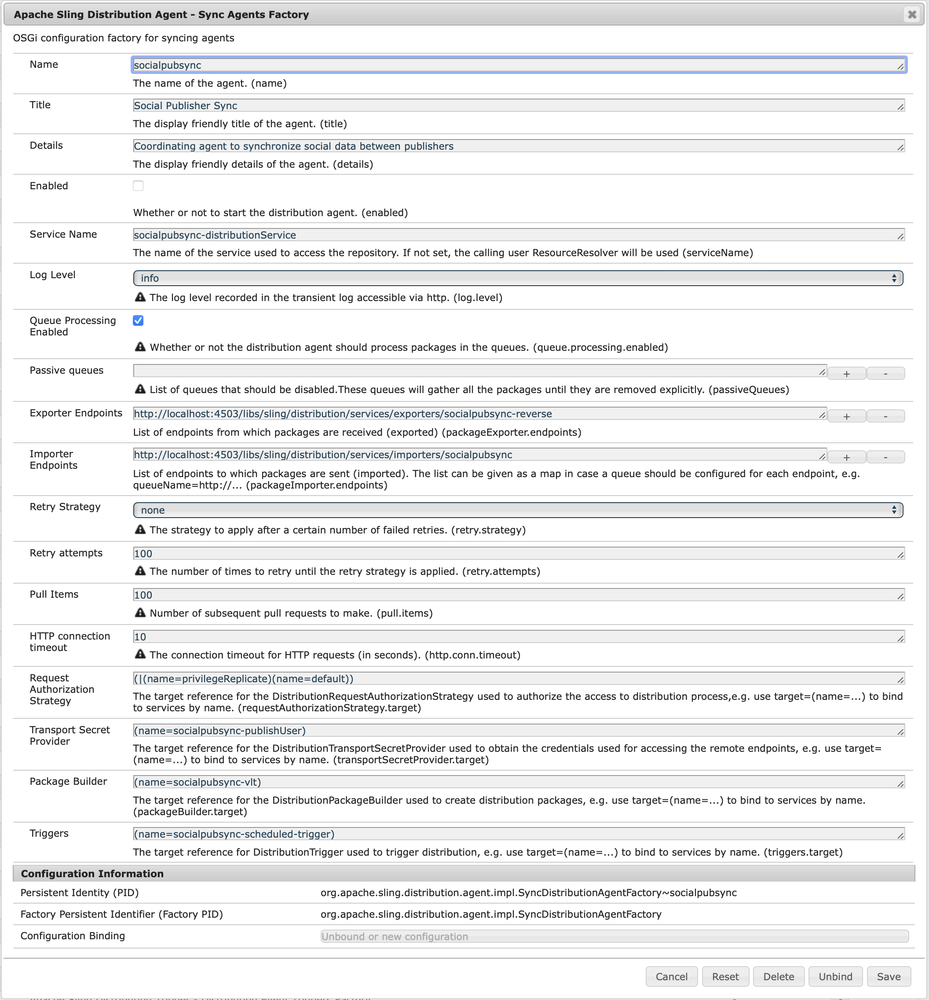

# ユーザーの同期{#user-synchronization}

## はじめに {#introduction}

デプロイメントが[パブリッシュファーム](/help/sites-deploying/recommended-deploys.md#tarmk-farm)の場合、メンバーはログインして、任意のパブリッシュノードでそのデータを確認できる必要があります。

パブリッシュ環境で作成されたユーザーとユーザーグループ（ユーザーデータ）は、オーサー環境では必要ありません。

オーサー環境で作成されたほとんどのユーザーデータはオーサー環境に残るものと想定されており、パブリッシュインスタンスにはコピーされません。

他のパブリッシュインスタンスが同じユーザーデータにアクセスするには、1 つのパブリッシュインスタンスに加えられた登録と変更をそれらのパブリッシュインスタンスに同期する必要があります。

AEM 6.1以降では、ユーザー同期が有効になっている場合、ユーザーデータはファーム内のパブリッシュインスタンス間で自動的に同期され、オーサー環境では作成されません。

## Sling 配布 {#sling-distribution}

ユーザーデータは、[ACL](/help/sites-administering/security.md)と共に、Oak JCRの下のレイヤーである[Oak Core](/help/sites-deploying/platform.md)に保存され、[Oak API](https://helpx.adobe.com/experience-manager/6-5/sites/developing/using/reference-materials/javadoc/org/apache/jackrabbit/oak/api/package-tree.html)を使用してアクセスされます。 頻繁に更新されない場合は、[Slingコンテンツ配布](https://github.com/apache/sling/blob/trunk/contrib/extensions/distribution/README.md)（Sling配布）を使用してユーザーデータを他のパブリッシュインスタンスと同期するのが適切です。

従来のレプリケーションと比較して、Sling配布を使用したユーザー同期のメリットは次のとおりです。

* パブリッシュインスタンスで作成されたユーザー&#x200B;**、ユーザープロファイル&#x200B;**&#x200B;およびユーザーグループ&#x200B;**&#x200B;がオーサー環境に作成されません

* Sling 配布により JCR イベントにプロパティが設定されることで、レプリケーションが無限に繰り返されることなく、パブリッシュ側のイベントリスナーで実行できます
* Sling 配布は派生元でないパブリッシュインスタンスにのみユーザーデータを送信するので、不要なトラフィックが発生しません
* [](/help/sites-administering/security.md) ユーザーノード内のACLssetが同期に含まれる

>[!NOTE]
>
>セッションが必要な場合は、SSOソリューションを使用するか、スティッキーセッションを使用し、別のパブリッシャーに切り替えられた場合は顧客にログインすることをお勧めします。

>[!CAUTION]
>
>ユーザー同期が有効化されている場合でも、***administrators*** グループの同期はサポートされません。代わりに、「差分をインポート」できないエラーがエラーログに記録されます。
>
>したがって、デプロイメントがパブリッシュファームの場合、ユーザーが***administrators**&#x200B;グループに追加または削除された場合は、各パブリッシュインスタンスで手動で変更をおこなう必要があります。

## ユーザー同期の有効化 {#enable-user-sync}

>[!NOTE]
>
>デフォルトでは、ユーザー同期は`disabled`です。
>
>ユーザー同期を有効にするには、OSGi の既存の&#x200B;**&#x200B;設定を変更する必要があります。
>
>ユーザー同期を有効にした結果、新しい設定が追加されることはありません。

ユーザー同期では、オーサー環境で作成されていないユーザーデータでもその配布の管理はオーサー環境に依存します。すべての設定はオーサー環境で行われるわけではありませんが、各手順で、オーサー環境とパブリッシュ環境のどちらで実行するかが明確に示されます。

次にユーザー同期の有効化に必要な手順と、[トラブルシューティング](#troubleshooting)の節を示します。

### 前提条件 {#prerequisites}

1. ユーザーとユーザーグループが既に1つのパブリッシャー上に作成されている場合は、ユーザー同期を設定して有効にする前に、[すべてのパブリッシャーに](#manually-syncing-users-and-user-groups)ユーザーデータを手動で同期することをお勧めします。

ユーザー同期を有効にすると、新規に作成されたユーザーおよびグループのみが同期されるようになります。

1. 最新のコードがインストールされていることを確認します。

* [AEM プラットフォームの更新](https://helpx.adobe.com/jp/experience-manager/kb/aem62-available-hotfixes.html)
* [AEM Communities の更新](/help/communities/deploy-communities.md#latestfeaturepack)

### 1. Apache Sling Distribution Agent - Sync Agents Factory {#apache-sling-distribution-agent-sync-agents-factory}

**ユーザー同期の有効化**

* **オーサー環境で**

   * 管理者権限でログインします
   * [Web コンソール](/help/sites-deploying/configuring-osgi.md)にアクセスします

      * 例：[https://localhost:4502/system/console/configMgr](https://localhost:4502/system/console/configMgr)
   * `Apache Sling Distribution Agent - Sync Agents Factory`を探します

      * 編集用に開く既存の設定を選択します（鉛筆アイコン）。
`name`を確認します。**`socialpubsync`**

      * `Enabled`チェックボックスを選択します。
      * `Save`を選択します。




### 2. 承認済みユーザーの作成 {#createauthuser}

**権限の設定**&#x200B;この承認済みユーザーが手順 3 のオーサー環境での Sling 配布の設定に使用されます。

* **各パブリッシュインスタンスで**

   * 管理者権限でログインします
   * [セキュリティコンソール](/help/sites-administering/security.md)にアクセスします

      * 例： [https://localhost:4503/useradmin](https://localhost:4503/useradmin)
   * 新しいユーザーを作成します

      * 例： `usersync-admin`
   * このユーザーを&#x200B;**`administrators`**&#x200B;ユーザーグループに追加します。
   * [このユーザーのACLを/homeに追加します。](#howtoaddacl)

      * `Allow jcr:all` 制限付きで  `rep:glob=*/activities/*`


>[!CAUTION]
>
>新しいユーザーを作成する必要があります。
>
>* デフォルトで割り当てられるユーザーは **`admin`** です。
>* コンテンツに `communities-user-admin user.`

>


#### ACL の追加方法 {#addacls}

* CRXDE Lite にアクセスします

   * 例： [https://localhost:4503/crx/de](https://localhost:4503/crx/de)

* `/home`ノードを選択します。
* 右側のウィンドウで、「`Access Control`」タブを選択します。
* `+`ボタンを選択して、ACLエントリを追加します。

   * **プリンシパル**：ユーザー同期用に作成されたユーザーを検索&#x200B;**
   * **型**：`Allow`
   * **権限**:  `jcr:all`
   * **** Restrictionsrep:glob:  `*/activities/*`
   * 「**OK**」を選択します。

* 「**すべて保存**」を選択します。


関連トピック

* [アクセス権限の管理](/help/sites-administering/user-group-ac-admin.md#access-right-management)
* トラブルシューティングの節[応答処理中の操作の例外の変更](#modify-operation-exception-during-response-processing)。

### 3. Adobe Granite Distribution - Encrypted Password Transport Secret Provider {#adobegraniteencpasswrd}

**権限の設定**

承認済みユーザー( **`administrators`**userグループのメンバー)がすべてのパブリッシュインスタンスで作成されたら、その承認済みユーザーは、オーサー環境でオーサー環境からパブリッシュ環境へのユーザーデータの同期権限を持つと識別される必要があります。

* **オーサー環境で**

   * 管理者権限でログインします
   * [Web コンソール](/help/sites-deploying/configuring-osgi.md)にアクセスします

      * 例：[https://localhost:4502/system/console/configMgr](https://localhost:4502/system/console/configMgr)
   * `com.adobe.granite.distribution.core.impl.CryptoDistributionTransportSecretProvider.name`を探します
   * 編集用に開く既存の設定を選択します（鉛筆アイコン）。
`property name`を確認します。**`socialpubsync-publishUser`**

   * 手順 2 でパブリッシュ環境で作成した[承認済みユーザー](#createauthuser)のユーザー名とパスワードを設定します

      * 例： `usersync-admin`


### 4. Apache Sling Distribution Agent - Queue Agents Factory {#apache-sling-distribution-agent-queue-agents-factory}

**ユーザー同期の有効化**

* **パブリッシュ環境で**:

   * 管理者権限でサインインします。
   * [Web コンソール](/help/sites-deploying/configuring-osgi.md)にアクセスします

      * 例：[https://localhost:4503/system/console/configMgr](https://localhost:4503/system/console/configMgr)
   * `Apache Sling Distribution Agent - Queue Agents Factory`を探します

      * 編集用に開く既存の設定を選択します（鉛筆アイコン）。
`Name`を確認します。`socialpubsync-reverse`

      * `Enabled`チェックボックスを選択します。
      * `Save`を選択します。
   * **繰り返し**各パブリッシュインスタンス


### 5. Adobe Social Sync  -  Diff Observer Factory {#diffobserver}

**グループ同期の有効化**

* **各パブリッシュインスタンスで**:

   * 管理者権限でサインインします。
   * [Web コンソール](/help/sites-deploying/configuring-osgi.md)にアクセスします

      * 例：[https://localhost:4503/system/console/configMgr](https://localhost:4503/system/console/configMgr)
   * **`Adobe Social Sync - Diff Observer Factory`**&#x200B;を探します

      * 編集する既存の設定を選択します（鉛筆アイコン）

         検証 `agent name`: `socialpubsync-reverse`

      * `Enabled`チェックボックスを選択します。
      * `Save`を選択します。


### 6. Apache Sling Distribution Trigger - Scheduled Triggers Factory {#apache-sling-distribution-trigger-scheduled-triggers-factory}

**（オプション）ポーリング間隔の変更**

デフォルトでは、オーサー環境では 30 秒ごとに変更をポーリングします。この間隔を変更するには：

* **オーサー環境で**

   * 管理者権限でログインします
   * [Web コンソール](/help/sites-deploying/configuring-osgi.md)にアクセスします

      * 例：[https://localhost:4502/system/console/configMgr](https://localhost:4502/system/console/configMgr)
   * `Apache Sling Distribution Trigger - Scheduled Triggers Factory`を探します

      * 編集する既存の設定を選択します（鉛筆アイコン）

         * 検証 `Name`: `socialpubsync-scheduled-trigger`
      * `Interval in Seconds`を目的の間隔に設定します。
      * `Save`を選択します。


## 複数のパブリッシュインスタンスの設定 {#configure-for-multiple-publish-instances}

デフォルトの設定は、単一のパブリッシュインスタンス用の設定です。ユーザー同期を有効にする理由は、パブリッシュファームの場合など、複数のパブリッシュインスタンスを同期するためです。追加のパブリッシュインスタンスをSync Agents Factoryに追加する必要があります。

### 7. Apache Sling Distribution Agent - Sync Agents Factory {#apache-sling-distribution-agent-sync-agents-factory-1}

**パブリッシュインスタンスを追加するには：**

* **オーサー環境で**

   * 管理者権限でログインします
   * [Web コンソール](/help/sites-deploying/configuring-osgi.md)にアクセスします

      * 例：[https://localhost:4502/system/console/configMgr](https://localhost:4502/system/console/configMgr)
   * `Apache Sling Distribution Agent - Sync Agents Factory`を探します

      * 編集用に開く既存の設定を選択します（鉛筆アイコン）。
`Name`を確認します。`socialpubsync`


* **Exporter Endpoints** 各パブリッシャーにエクスポーターエンドポイントが必要です。例えば、パブリッシャーが localhost:4503 と 4504 の 2 つの場合、次の 2 つのエントリが必要です。

   * `https://localhost:4503/libs/sling/distribution/services/exporters/socialpubsync-reverse`
   * `https://localhost:4504/libs/sling/distribution/services/exporters/socialpubsync-reverse`

* **インポー**
ターエンドポイント各パブリッシャーにインポーターエンドポイントが必要です。例えば、パブリッシャーが localhost:4503 と 4504 の 2 つの場合、次の 2 つのエントリが必要です。

   * `https://localhost:4503/libs/sling/distribution/services/importers/socialpubsync`
   * `https://localhost:4504/libs/sling/distribution/services/importers/socialpubsync`

* `Save`を選択します。

### 8. AEM Communities User Sync Listener {#aem-communities-user-sync-listener}

**（オプション）追加の JCR ノードの同期**

複数のパブリッシュインスタンス間で同期するカスタムデータがある場合は、次のようにします。

* **各パブリッシュインスタンスで**:

   * 管理者権限でサインインします。
   * [Web コンソール](/help/sites-deploying/configuring-osgi.md)にアクセスします

      * 例： `https://localhost:4503/system/console/configMgr`
   * `AEM Communities User Sync Listener`を探します
   * 編集用に開く既存の設定を選択します（鉛筆アイコン）。
`Name`を確認します。`socialpubsync-scheduled-trigger`


* **Node Types** 同期するノードタイプのリストです。sling:Folder 以外のすべてのノードタイプがここにリストされます（sling:folder は別個に処理されます）。 同期されるノードタイプのデフォルトのリストは次のとおりです。

   * rep:User
   * nt:unstructured
   * nt:resource

* **Ignorable Properties** 何らかの変更が検出された場合に無視されるプロパティのリストです。これらのプロパティに対する変更は、他の変更の副作用として同期される場合がありますが（同期は常にノードレベルでおこなわれるので）、これらのプロパティに対する変更そのものが同期をトリガーすることはありません。 無視されるデフォルトのプロパティは次のとおりです。

   * cq:lastModified

* **Ignorable Nodes** 同期中に完全に無視されるサブパスです。このサブパスの下にあるものはどのタイミングでも同期されません。 無視されるデフォルトのノードは次のとおりです。

   * .tokens
   * system

* **Distributed Folders** 同期が不要であるのでほとんどの sling:Folders は無視されます。数少ない例外を次に示します。 同期されるデフォルトのフォルダーは次のとおりです。

   * segments/scoring
   * social/relationships
   * activities

### 9. 一意の Sling ID  {#unique-sling-id}

>[!CAUTION]
>
>2 つ以上のパブリッシュインスタンスで Sling ID が一致すると、ユーザーグループの同期が失敗します。

Sling ID がパブリッシュファームの複数のパブリッシュインスタンスで同じである場合、ユーザーグループは同期されません。

すべての Sling ID の値が異なることを確認するには、各パブリッシュインスタンスで次の手順を実行します。

1. `http://<host>:<port>/system/console/status-slingsettings`を参照します。
1. **Sling ID** の値を確認する


あるパブリッシュインスタンスの Sling ID が他のパブリッシュインスタンスの Sling ID と一致する場合は、次のようにします。

1. Sling ID が一致するパブリッシュインスタンスの一方を停止する
1. crx-quickstart/launchpad/felix ディレクトリで

   * *sling.id.file* という名前のファイルを検索して削除する

      * 例えば、Linuxシステムの場合：
         `rm -i $(find . -type f -name sling.id.file)`

      * 例えば、Windowsシステムの場合は、次のようになります。
         `use windows explorer and search for *sling.id.file*`

1. パブリッシュインスタンスを起動します。

   * スタートアップ時に新しい Sling ID が割り当てられる

1. **Sling ID** が一意であることを確認する

すべてのパブリッシュインスタンスの Sling ID が一意になるまでこの手順を繰り返します。

## Vault Package Builder Factory  {#vault-package-builder-factory}

更新が適切に同期されるようにするには、ユーザー同期用に Vault Package Builder を変更する必要があります。

* 各 AEM パブリッシュインスタンスで
* [Web コンソール](/help/sites-deploying/configuring-osgi.md)にアクセスします

   * 例：[https://localhost:4503/system/console/configMgr](https://localhost:4503/system/console/configMgr)

* `Apache Sling Distribution Packaging - Vault Package Builder Factory`を探します。

   * `Builder name: socialpubsync-vlt`

* 編集アイコンを選択します。
* 2つの&lt;a0/を追加します。`Package Node Filters`

   * `/home/users|-.*/.tokens`
   * `/home/users|-.*/rep:cache`

* ポリシーの処理：

   * 既存の rep:policy ノードを新しいノードで上書きするには、3 つ目のパッケージフィルターを追加します

      * `/home/users|+.*/rep:policy`
   * ポリシーが配布されないようにするには、次のように設定します

      * `Acl Handling:` `IGNORE`


## ... {#what-happens-when}の場合の影響

### パブリッシュ環境でのユーザーの自己登録またはプロファイルの編集 {#user-self-registers-or-edits-profile-on-publish}

仕様上、パブリッシュ環境で作成されたユーザーとプロファイル（自己登録）は、オーサー環境では表示されません。

トポロジが[パブリッシュファーム](/help/sites-deploying/recommended-deploys.md#tarmk-farm)で、ユーザー同期が正しく設定されている場合、Sling配布を使用して、パブリッシュファーム全体で*user *および&#x200B;*ユーザープロファイル*&#x200B;が同期されます。

### セキュリティコンソールでのユーザーまたはユーザーグループの作成 {#users-or-user-groups-are-created-using-security-console}

仕様上、パブリッシュ環境で作成されたユーザーデータは、オーサー環境では表示されません。その反対も同様です。

[ユーザー管理およびセキュリティ](/help/sites-administering/security.md)コンソールを使用してパブリッシュ環境で新しいユーザーを追加すると、ユーザーの同期機能により、新しいユーザーとそのグループメンバーシップがその他のパブリッシュインスタンスに同期されます（必要な場合）。ユーザー同期では、セキュリティコンソールを使用して作成したユーザーグループも同期されます。

## トラブルシューティング {#troubleshooting}

### ユーザー同期をオフラインにする方法  {#how-to-take-user-sync-offline}

[パブリッシャーを削除](#how-to-remove-a-publisher)したり、[データを手動で同期](#manually-syncing-users-and-user-groups)したりするためにユーザー同期をオフラインにするには、配布キューが空であり、静止している必要があります。

配布キューの状態をチェックするには：

* オーサー環境で:

   * [CRXDE Lite](/help/sites-developing/developing-with-crxde-lite.md)を使用

      * `/var/sling/distribution/packages`内のエントリを探す

         * `distrpackage_*` _* という名前パターンを持つフォルダー名
   * [パッケージマネージャー](/help/sites-administering/package-manager.md)を使用する場合

      * （まだインストールされていない）保留中のパッケージを探します

         * パターン`socialpubsync-vlt*`で名前が付けられる
         * 作成者： `communities-user-admin`


配布キューが空である場合は、ユーザー同期を無効にします。

* オーサー環境で

   * *[Apache Sling Distribution Agent - Sync Agents Factory](#apache-sling-distribution-agent-sync-agents-factory)の`Enabled`チェックボックスをオフにします。

タスク完了後にユーザー同期を再び有効にするには：

* オーサー環境で

   * [Apache Sling Distribution Agent - Sync Agents Factory](#apache-sling-distribution-agent-sync-agents-factory)の`Enabled`チェックボックスをオンにします。

### ユーザー同期診断 {#user-sync-diagnostics}

ユーザー同期診断は、設定をチェックして問題の特定を試みるツールです。

オーサー環境では、メインコンソールから&#x200B;**ツール/運営/診断/ユーザー同期診断を実行します。**

結果はユーザー同期診断コンソールに表示されます。

ユーザー同期が有効になっていない場合は、次のように表示されます。


#### パブリッシャーに対する診断の実行方法 {#how-to-run-diagnostics-for-publishers}

オーサー環境から診断を実行すると、パス/失敗の結果には、確認用に設定されたパブリッシュインスタンスのリストを表示する[INFO]セクションが含まれます。

このリストには、診断が実行される各パブリッシュインスタンスの URL が記載されています。urlパラメーター`syncUser`が診断URLに追加され、その値が[手順2](#createauthuser)で作成した&#x200B;*許可された同期ユーザー*&#x200B;に設定されます。

**注意**：URL を起動するには、承認済み同期ユーザー&#x200B;**&#x200B;がそのパブリッシュインスタンスに既にログインしている必要があります。


### 正しく追加されていない設定 {#configuration-improperly-added}

ユーザー同期が正しく機能しないのは、主に余分な設定が追加されていることが原因です。**&#x200B;代わりに、*既存の*デフォルト設定は&#x200B;*編集*&#x200B;されているはずです。

Web コンソールに表示される、編集されたデフォルトの設定は次のとおりです。複数のインスタンスが表示される場合は、追加した設定を削除する必要があります。

#### （オーサー）Apache Sling Distribution Agent - Sync Agents Factory 1 つ{#author-one-apache-sling-distribution-agent-sync-agents-factory}


#### （オーサー）Apache Sling Distribution トランスポート認証情報 - ユーザ認証情報に基づく DistributionTransportSecretProvider 1 つ{#author-one-apache-sling-distribution-transport-credentials-user-credentials-based-distributiontransportsecretprovider}


#### （パブリッシュ）Apache Sling Distribution Agent - Queue Agents Factory 1 つ{#publish-one-apache-sling-distribution-agent-queue-agents-factory}


#### （パブリッシュ）Adobe Social Sync - Diff Observer Factory 1 つ{#publish-one-adobe-social-sync-diff-observer-factory}


#### （オーサー）Apache Sling Distribution Trigger - Scheduled Triggers Factory 1 つ{#author-one-apache-sling-distribution-trigger-scheduled-triggers-factory}


### 応答処理中の操作の例外の変更 {#modify-operation-exception-during-response-processing}

ログに次の内容が表示される場合：

`org.apache.sling.servlets.post.impl.operations.ModifyOperation Exception during response processing.`

`java.lang.IllegalStateException: This tree does not exist`

次に、セクション[2を確認します。 承認済みユーザーの作成](#createauthuser)に正しく従っていました。

この節では、すべてのパブリッシュインスタンスに存在する承認済みユーザーを作成し、それらをオーサー環境の「秘密鍵プロバイダー」OSGi 設定で特定する方法について説明します。デフォルトでは、ユーザーは`admin`です。

承認済みユーザーは **`administrators`** ユーザーグループのメンバーにして、そのグループの権限は変更しないでください。

承認済みユーザーは、すべてのパブリッシュインスタンスに対する次の権限および制限を明示的に保持している必要があります。

| **path** | **jcr:all** | **rep:glob** |
|---|---|---|
| /home | X | */activities/* |
| /home/users | X | */activities/* |
| /home/groups | X | */activities/* |

`administrators`グループのメンバーとして、許可されたユーザーは、すべてのパブリッシュインスタンスに対して次の権限を持つ必要があります。

| **パス** | **jcr:all** | **jcr:read** | **rep:write** |
|---|---|---|---|
| /etc/packages/sling/distribution |  |  | X |
| /libs/sling/distribution |  | X |  |
| /var |  |  | X |
| /var/eventing |  | X | X |
| /var/sling/distribution |  | X | X |

### ユーザーグループ同期の失敗  {#user-group-sync-failed}

2 つ以上のパブリッシュインスタンスで Sling ID が一致すると、ユーザーグループの同期が失敗します。

[9.一意の Sling ID](#unique-sling-id) の節を参照してください

### ユーザーおよびユーザーグループの手動同期  {#manually-syncing-users-and-user-groups}

* ユーザーおよびユーザーグループが存在するパブリッシャーで：

   * [ユーザー同期が有効になっている場合は無効にします](#how-to-take-user-sync-offline)
   * [パッケージを](/help/sites-administering/package-manager.md#creating-a-new-package) 作る  `/home`

      * パッケージの編集時

         * 「フィルター」タブフィルターの追加：ルートパス：`/home`
         * 「詳細」タブACの処理：`Overwrite`
   * [パッケージを書き出します](/help/sites-administering/package-manager.md#downloading-packages-to-your-file-system)


* その他のパブリッシュインスタンスで：

   * [パッケージを読み込みます](/help/sites-administering/package-manager.md#installing-packages)

ユーザー同期を設定または有効にするには、手順1に進みます。[Apache Sling Distribution Agent - Sync Agents Factory](#apache-sling-distribution-agent-sync-agents-factory)

### パブリッシャーが使用不能になった場合 {#when-a-publisher-becomes-unavailable}

パブリッシュインスタンスが使用不能になっても、今後オンラインに戻る場合は削除しないでください。変更はパブリッシャーに対してキューに入れられ、オンラインに戻ると、変更が処理されます。

パブリッシュインスタンスがオンラインに戻らない場合は、完全にオフラインの場合は、キューの構築によりオーサー環境でのディスク領域の使用が目立つため、削除する必要があります。

パブリッシャーが停止した場合、オーサー環境のログに次のような例外が記録されます。

```
28.01.2016 15:57:48.475 ERROR
 [pool-12-thread-34-org_apache_sling_distribution_queue_socialpubsync_endpoint1
 (org/apache/sling/distribution/queue/socialpubsync/endpoint1)]
 org.apache.sling.distribution.agent.impl.SimpleDistributionAgent [agent][socialpubsync] could not deliver package distrpackage_1454014575838_a2b45ec8-0400-42f3-bed8-ae09b66381cb
 org.apache.sling.distribution.packaging.DistributionPackageImportException: failed in importing package ...
```

### パブリッシャーの削除方法 {#how-to-remove-a-publisher}

[Apache Sling Distribution Agent - Sync Agents Factory](#apache-sling-distribution-agent-sync-agents-factory) からパブリッシャーを削除するには、配布キューが空であり、静止している必要があります。

* オーサー環境で:

   * [ユーザー同期をオフラインにします](#how-to-take-user-sync-offline)
   * [手順 7](#apache-sling-distribution-agent-sync-agents-factory) に従って、次の両方のサーバーリストからパブリッシャーを削除します

      * `Exporter Endpoints`
      * `Importer Endpoints`
   * ユーザー同期を再び有効にします

      * [Apache Sling Distribution Agent - Sync Agents Factory](#apache-sling-distribution-agent-sync-agents-factory)の`Enabled`チェックボックスをオンにします。
