# タグの管理 {#administering-tags}

タグは、Web サイト内のコンテンツをすばやく簡単に分類するために使用します。検索の結果としてコンテンツをよりすばやく見つけることのできるキーワードまたはラベル（メタデータ）と考えることができます。

Adobe Experience Manager（AEM）では、タグが以下のプロパティとなる場合があります。

* ページのコンテンツノード（[タグの使用](/help/sites-authoring/tags.md)を参照）。

* アセットのメタデータノード（[デジタルアセット用のメタデータの管理](/help/assets/metadata.md)を参照）。

ページやアセットに加え、AEM Communities の機能では次の場所でタグが使用されます。

* ユーザー生成コンテンツ（[UGC のタグ付け](/help/communities/tag-ugc.md)を参照）。

* イネーブルメントリソース（[イネーブルメントソースのタグ付け](/help/communities/functions.md#catalog-function)を参照）。

## タグの機能 {#tag-features}

AEM 内のタグには以下のような機能があります。

* タグは様々な名前空間にグループ分けできます。階層で分類を作成できます。この分類は、AEM 全体で使用されます。
* 新規に作成するタグの主な制限は、特定の名前空間内で一意でなければならないことです。
* タグのタイトルには、タグパスの区切り文字を含めないでください（含めても表示されません）。

   * colon `:` - delimits the namespace tag
   * forward slash `/` - delimits sub-tags

* タグは、作成者およびサイト訪問者が適用できます。すべてのフォームのタグは、作成者に関係なく、ページへの割り当て時および検索時に選択できるようになっています。
* Tags can be created and their taxonomy modified by members of the &quot;tag-administrators&quot; group and members who have modification rights to `/content/cq:tags`.

   * 子タグが含まれるタグはコンテナタグと呼ばれます
   * コンテナタグ以外のタグはリーフタグと呼ばれます
   * タグの名前空間はリーフタグかコンテナタグのいずれかです

* タグを[検索コンポーネント](https://helpx.adobe.com/experience-manager/core-components/using/quick-search.html)で使用すると、コンテンツを簡単に検索できます。
* タグは [Teaser コンポーネント](https://helpx.adobe.com/jp/experience-manager/core-components/using/teaser.html)で使用され、ユーザーのタグクラウドを監視してターゲットのコンテンツを提供できます。
* タグ付けがコンテンツの重要な側面である場合は、次のことに注意します。

   * タグとタグを使用するページを必ずパッケージ化すること
   * [タグの権限](#setting-tag-permissions)に読み取りアクセスを有効にすること

## タグ付けコンソール {#tagging-console}

タグ付けコンソールは、タグと分類の作成および管理に使用します。1つ目の目標は、基本的に同じことに関連する類似タグを多数持つのを避けることです。例えば、ページやページ、靴や靴などです。

タグは、複数の名前空間にグループ分けして、新規のタグを作成する前に既存のタグの使用状況を確認し、現在参照されているコンテンツからタグを切り離すことなく整理し直すことによって管理します。

タグ付けコンソールにアクセスするには：

* オーサー環境で
* 管理者権限でサインインします
* グローバルナビゲーションから、次の操作をおこないます

   * select **`Tools`**
   * select **`General`**
   * select **`Tagging`**

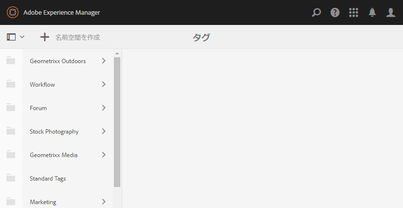

### 名前空間の作成 {#creating-a-namespace}

To create a new namespace, select the **`Create Namespace`** icon.

名前空間はそれ自体がタグです。サブタグが含まれている必要はありません。However, to continue creating a taxonomy, [create sub-tags](#creating-tags), which in turn may be either leaf tags or container tags.

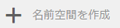 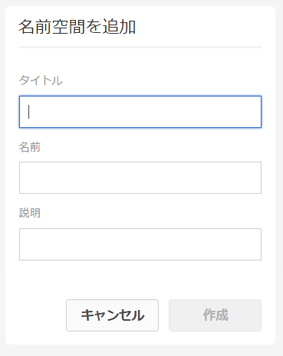

* **タイトル**

   *（必須）* 名前空間の表示タイトル。

* **名前**
   *（オプション）* 名前空間の名前。 指定しない場合、有効なノード名が「タイトル」から作成されます。See [TagID](/help/sites-developing/framework.md#tagid).

* **説明**

   *（オプション）* 名前空間の説明です。

必要な情報を入力したら

* 「**作成**」を選択します

### タグの操作 {#operations-on-tags}

名前空間または他のタグを選択すると、次の操作をおこなえるようになります。

* [プロパティを表示](#viewing-tag-properties)
* [参照](#showing-tag-references)
* [タグを作成](#creating-tags)
* [編集](#editing-tags)
* [移動](#moving-tags)
* [統合](#merging-tags)
* [公開](#publishing-tags)
* [非公開](#unpublishing-tags)
* [削除](#deleting-tags)

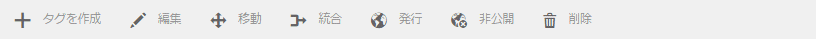

When the browser window is not wide enough to display all icons, then the right-most icons are grouped together under a **`... More`** icon, which will display a drop-down list of the hidden operation icons when selected.

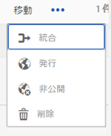

### 名前空間タグの選択 {#selecting-a-namespace-tag}

最初に選択したときに、名前空間にタグが含まれていない場合は右にプロパティが表示され、含まれている場合は子タグが表示されます。選択した各タグには、タグに含まれるタグか、子タグがない場合はそのプロパティが表示されます。

操作対象のタグを選択したり、複数選択をおこなう場合は、タイトルの横にあるアイコンを選択するだけです。タイトルを選択すると、プロパティのみが表示され、タグを開いてその内容が表示されます。

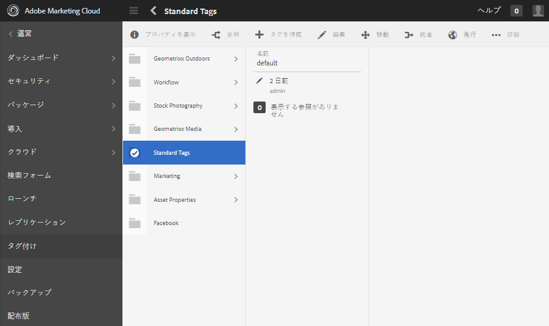 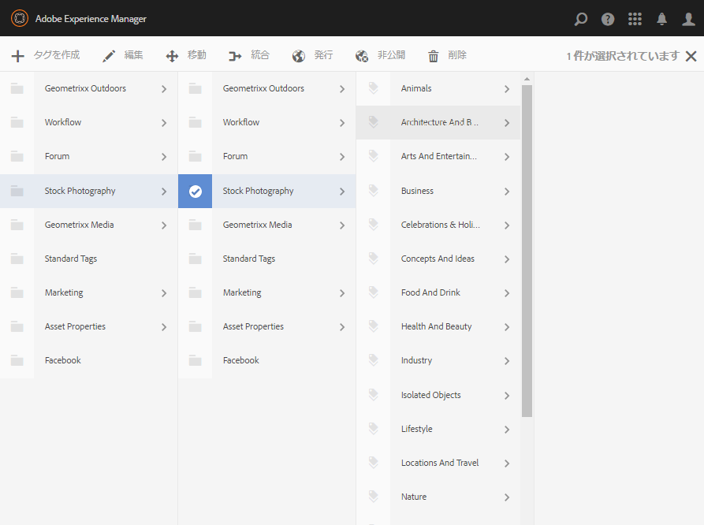

### タグプロパティの表示 {#viewing-tag-properties}

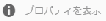

When a namespace or other tag is selected, selecting the **`View Properties`** icon results in the display of information as to the `name`, time of last edit, and number of references. 公開済みの場合は、前回公開された日時と発行者のIDが表示されます。 この情報は、タグ列の左側の列に表示されます。

### タグ参照の表示 {#showing-tag-references}

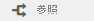

名前空間または他のタグが選択されているときに「**参照**」アイコンをクリックすると、そのタグが適用されているコンテンツが特定されます。

まず、適用されているタグの数が表示されます。

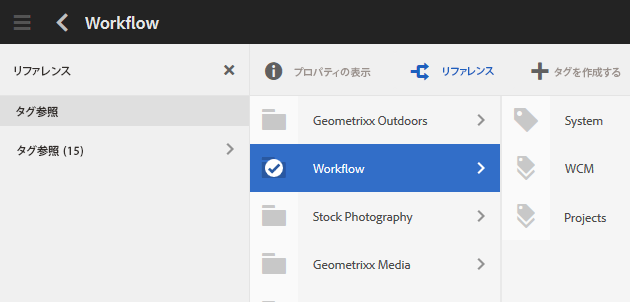

数の右にある矢印を選択すると、参照名がリストされます。

参照の上にカーソルを重ねると、その参照へのパスがツールチップとして表示されます。

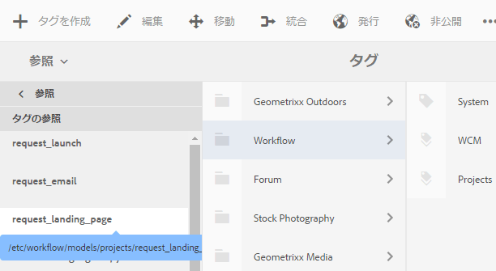

### タグの作成 {#creating-tags}

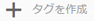

When a namespace or other tag is selected (by selecting the icon next to the title), a child tag may be created for the current tag by selecting the **`Create Tag`** icon.

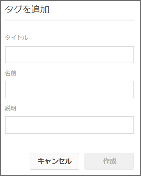

* **Title***（必須） *タグの表示タイトル。

* **Name***（オプション） *タグの名前。 指定しない場合、有効なノード名が「タイトル」から作成されます。See [TagID](/help/sites-developing/framework.md#tagid).

* **説明***（オプション） *タグの説明。

必要な情報を入力したら

* 「**作成**」を選択します

### タグの編集 {#editing-tags}

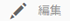

When a namespace or other tag is selected, it is possible to alter the Title, Description, and provide localizations of the Title by selecting the **`Edit`**icon.

編集が完了したら、「**保存**」を選択します。

For details about adding language translations, see the section on [Managing Tags in Different Languages](#managing-tags-in-different-languages).

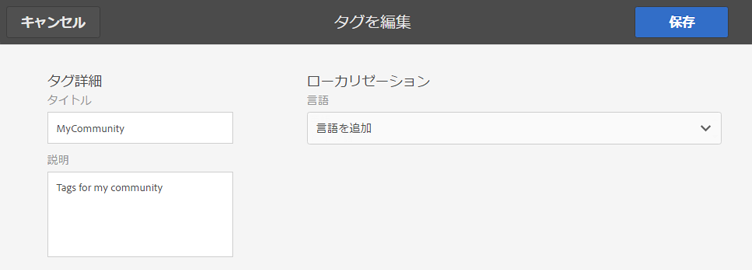

### Moving Tags {#moving-tags}

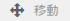

When a namespace or other tag is selected, selecting the **`Move`** icon will allow Tags Administrators and Developers to clean up the taxonomy by moving the tag to a new location or renaming it. 選択したタグがコンテナタグの場合、タグを移動すると、すべての子タグも移動します。

>[!NOTE]
>
>It is recommended that Authors only be allowed to [edit](#editing-tags) the tag&#39;s `title`, not to move or rename tags.

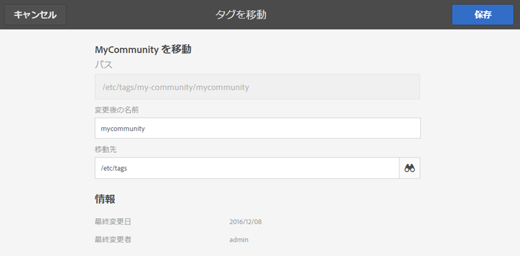

* **パス**

   *（読み取り専用）* 選択したタグの現在のパス。

* **移動先** タグの移動先の新しいパスを参照します。

* **「名前を**&#x200B;最初に変更」には、現在の 
`name`」と表示されます。 A new `name`may be entered.

* 「**保存**」を選択します

### タグの統合 {#merging-tags}

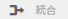

タグの統合は、分類が重複する場合に使用できます。タグ A がタグ B に統合されると、タグ A が付けられたすべてのページにタグ B が付けられ、作成者はタグ A を使用できなくなります。

When a namespace or other tag is selected, selecting the **Merge** icon will open a panel where the path to merge into may be selected.

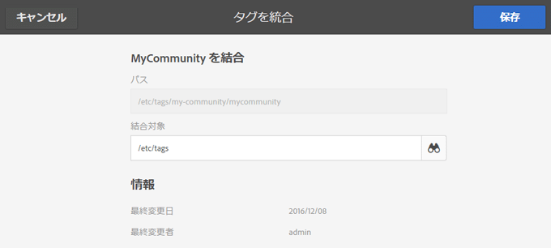

* **パス**

   *（読み取り専用）* 別のタグに結合するように選択されたタグのパス。

* **統合対象**&#x200B;統合先のタグのパスを参照して選択します。

>[!NOTE]
>
>統合すると、元から選択されていた&#x200B;**パス**&#x200B;は（実質的に）存在しなくなります。
>
>参照先のタグが移動または統合されても、タグは物理的には削除されないので、参照を維持することは可能です。

### タグの公開 {#publishing-tags}

When a namespace or other tag is selected, selecting the **Publish** icon to activate the tag in the publish environment. ページのコンテンツと同様、コンテナタグであるかどうかに関係なく、選択したタグのみが発行されます。

分類（名前空間とサブタグ）を公開するベストプラクティスとして、名前空間の[パッケージ](/help/sites-administering/package-manager.md)を作成します（[分類のルートノード](/help/sites-developing/framework.md#taxonomy-root-node)を参照）。Be sure to [apply permissions](#setting-tag-permissions) to the namespace before creating the package.

### タグを非公開にする {#unpublishing-tags}

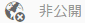

When a namespace or other tag is selected, selecting the **Unpublish** icon will deactivate the tag in the author environment and remove it from the publish environment. Similar to the `Delete`operation, if the selected tag is a container tag, all of its child tags will be deactivated in the author environment and removed from the publish environment.

### タグの削除 {#deleting-tags}

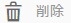

When a namespace or other tag is selected, selecting the **Delete** icon will permanently remove the tag from the author environment. タグが発行された場合は、発行環境からも削除されます。 選択したタグがコンテナタグの場合、その子タグもすべて削除されます。

## タグの権限の設定 {#setting-tag-permissions}

Tag permissions are [&#39;secure (by default)&#39;](/help/sites-administering/production-ready.md); a best practice for the publish environment that requires read permission to be explicitly allowed for tags. 基本的に、これは、作成者に対して権限が設定された後にタグ名前空間のパッケージを作成し、すべての発行インスタンスにそのパッケージをインストールすることで行います。

* オーサーインスタンスで

   * 管理者権限でサインインします
   * [セキュリティコンソール](/help/sites-administering/security.md#accessing-user-administration-with-the-security-console)にアクセスします

      * 例えば、http://localhost:4502/useradmin に移動します
   * 左側のウィンドウで、[読み取り権限](/help/sites-administering/security.md#permissions)を付与するグループ（またはユーザー）を選択します
   * 右側のウィンドウで、タグ名前空間の**Path **toを探します。

      * for example, `/content/cq:tags/mycommunity`
   * select the `checkbox`in the **Read** column
   * 「**Save**」を選択します。

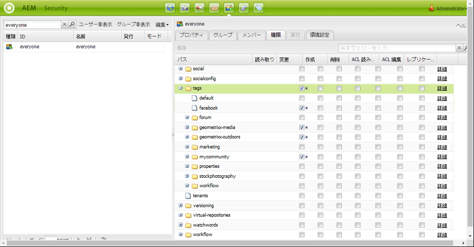

* すべてのパブリッシュインスタンスが同じ権限となるようにします

   * 1 つのアプローチは、オーサー環境で名前空間の[パッケージを作成](/help/sites-administering/package-manager.md#package-manager)することです

      * 「 `Advanced` 」タブで、「選択」 `AC Handling` に対して `Overwrite`
   * パッケージをレプリケートします

      * choose `Replicate` from package manager

## Managing Tags in Different Languages {#managing-tags-in-different-languages}

The `title`property of a tag may be translated into multiple languages. Once translated, the appropriate tag `title`may be displayed according to the user language or to the page language.

### 複数言語でのタグタイトルの定義 {#defining-tag-titles-in-multiple-languages}

The following describes how to translate the `title`of the tag **Animals** from English into German and French.

Start by selecting the tag under the **Stock Photography** namespace and selecting the **`Edit`**icon (see [Editing Tags](#editing-tags) section).

タグを編集パネルで、タグのタイトルを翻訳する言語を選択できます。

各言語を選択すると、テキスト入力ボックスが表示され、翻訳されたタイトルを入力できます。

すべての翻訳を入力したら、「**保存**」を選択して編集モードを終了します。

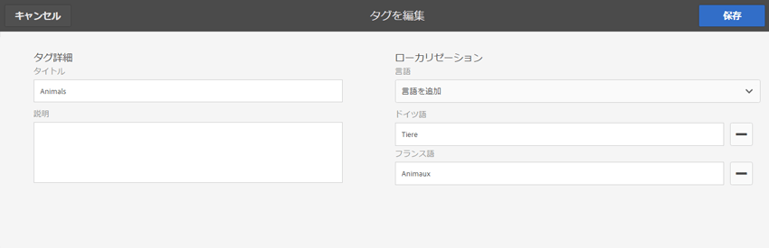

一般的に、タグに選択した言語はページの言語から取得されます。[`tag` ウィジェットが他のケース（フォームやダイアログなど）で使用されている場合、タグの言語はコンテキストによって変わります。](/help/sites-developing/building.md#tagging-on-the-client-side)

タグ付けコンソールでは、ページの言語設定の代わりに、ユーザーの言語設定が使用されます。タグ付けコンソールで、「動物」タグに対して、ユーザのプロパティで言語をフランス語に設定しているユーザに対して「Animau」が表示されます。

To add a new language to the dialog, see [Adding a New Language to the Edit Tag Dialog](/help/sites-developing/building.md#adding-a-new-language-to-the-edit-tag-dialog).

>[!NOTE]
>
>The tag cloud and the meta keywords in the standard page component use the localized tag `titles`based on the page language, if available.

## リソース {#resources}

* [開発者用タグ付け](/help/sites-developing/tags.md)

   タグ付けフレームワークに関する情報、およびカスタムアプリケーションでのタグの拡張と含める情報です。

* [クラシック UI のタグ付けコンソール](/help/sites-administering/classic-console.md)

