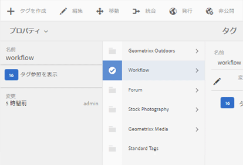

# タグの管理 {#administering-tags}

タグは、Web サイト内のコンテンツをすばやく簡単に分類するために使用します。検索の結果としてコンテンツをよりすばやく見つけることのできるキーワードまたはラベル（メタデータ）と考えることができます。

Adobe Experience Manager（AEM）では、タグが以下のプロパティとなる場合があります。

* ページのコンテンツノード（[タグの使用](/help/sites-authoring/tags.md)を参照）

* アセットのメタデータノード（[デジタルアセット用のメタデータの管理](/help/assets/metadata.md)を参照）

ページやアセットに加え、AEM Communities の機能では次の場所でタグが使用されます。

* ユーザー生成コンテンツ（[UGC のタグ付け](/help/communities/tag-ugc.md)を参照）

* イネーブルメントリソース（[イネーブルメントソースのタグ付け](/help/communities/functions.md#catalog-function)を参照）。

## タグの機能 {#tag-features}

AEM 内のタグには以下のような機能があります。

* タグは様々な名前空間にグループ分けできます。階層で分類を作成できます。この分類は、AEM 全体で使用されます。
* 新規に作成するタグの主な制限は、特定の名前空間内で一意でなければならないことです。
* タグのタイトルには、タグパスの区切り文字を含めないでください（含めても表示されません）。

   * コロン `:` - 名前空間タグを区切ります
   * スラッシュ `/` - サブタグを区切ります

* タグは、作成者およびサイト訪問者が適用できます。すべてのフォームのタグは、作成者に関係なく、ページへの割り当て時および検索時に選択できるようになっています。
* タグの作成やタグの分類の変更は、「タグ管理者」グループのメンバーおよび `/content/cq:tags` に対する変更権限を持つメンバーがおこなうことができます。

   * 子タグが含まれるタグはコンテナタグと呼ばれます
   * コンテナタグ以外のタグはリーフタグと呼ばれます
   * タグの名前空間はリーフタグかコンテナタグのいずれかです

* タグを[検索コンポーネント](https://helpx.adobe.com/jp/experience-manager/core-components/using/quick-search.html)で使用すると、コンテンツを簡単に検索できます。
* タグは [ティーザーコンポーネント](https://helpx.adobe.com/jp/experience-manager/core-components/using/teaser.html)で使用され、ユーザーのタグクラウドを監視してターゲットのコンテンツを提供できます。
* タグ付けがコンテンツの重要な側面である場合は、次のことに注意します。

   * タグとタグを使用するページを必ずパッケージ化すること
   * [タグの権限](#setting-tag-permissions)に読み取りアクセスを有効にすること

## タグ付けコンソール {#tagging-console}

タグ付けコンソールは、タグと分類の作成および管理に使用します。基本的に同じであるものに関して、類似のタグ（page と pages、footwear と shoes など）が使用されないようにすることが目的の 1 つです。

タグは、複数の名前空間にグループ分けして、新規のタグを作成する前に既存のタグの使用状況を確認し、現在参照されているコンテンツからタグを切り離すことなく整理し直すことによって管理します。

タグ付けコンソールにアクセスするには：

* オーサー環境で
* 管理者権限でサインインします
* グローバルナビゲーションから、次の操作をおこないます

   * **`Tools`**&#x200B;を選択
   * **`General`** を選択
   * **`Tagging`** を選択

### 名前空間の作成 {#creating-a-namespace}

新しい名前空間を作成するには、**`Create Namespace`** アイコンを選択します。

名前空間はそれ自体がタグです。サブタグが含まれている必要はありません。ただし、分類の作成を続行するには、[サブタグを作成](#creating-tags)します。リーフタグかコンテナタグのいずれかにすることができます。

 

* **タイトル**

   *（必須）* 名前空間の表示タイトル。

* **名前**
   *（オプション）* 名前空間の名前。指定しない場合、有効なノード名が「タイトル」から作成されます。[タグ ID](/help/sites-developing/framework.md#tagid) を参照してください。

* **説明**

   *（オプション）* 名前空間の説明。

必要な情報を入力したら

* 「**作成**」を選択します

### タグの操作 {#operations-on-tags}

名前空間または他のタグを選択すると、次の操作をおこなえるようになります。

* [プロパティを表示](#viewing-tag-properties)
* [参照](#showing-tag-references)
* [タグを作成](#creating-tags)
* [編集](#editing-tags)
* [移動](#moving-tags)
* [結合](#merging-tags)
* [公開](#publishing-tags)
* [非公開](#unpublishing-tags)
* [削除](#deleting-tags)

ブラウザー画面が狭く、すべてのアイコンが表示されていないときは、右端のアイコンが **`... More`** アイコンにグループ化され、選択すると非表示の操作アイコンのドロップダウンリストが表示されます。

### 名前空間タグの選択 {#selecting-a-namespace-tag}

最初に選択したときに、名前空間にタグが含まれていない場合は右にプロパティが表示され、含まれている場合は子タグが表示されます。選択した各タグには、それに含まれているタグか、子タグがない場合はそのプロパティが表示されます。

操作対象のタグを選択したり、複数選択をおこなう場合は、タイトルの横にあるアイコンを選択するだけです。タイトルを選択すると、単にプロパティが表示されるか、タグが開いてそのコンテンツが表示されます。

 

### タグプロパティの表示 {#viewing-tag-properties}

名前空間または他のタグが選択されているときに **`View Properties`** アイコンを選択すると、`name`、最終編集時刻、参照回数などの情報が表示されます。公開済みの場合は、最後に公開された時間と公開したユーザーの ID が表示されます。この情報は、タグ列の左の列に表示されます。

### タグ参照の表示 {#showing-tag-references}

名前空間または他のタグが選択されている場合、**参照**&#x200B;アイコンを選択すると、そのタグが適用されているコンテンツが特定されます。

最初に表示されるのは、適用されているタグの数です。

数の右にある矢印を選択すると、参照名がリストされます。

参照の上にカーソルを重ねると、その参照へのパスがツールチップとして表示されます。

### タグの作成 {#creating-tags}

（タイトルの横にあるアイコンを選択することによって）名前空間または他のタグが選択されている場合、**`Create Tag`** アイコンを選択することで、現在のタグに子タグを作成できます。

* **タイトル**
*（必須）*タグの表示タイトル。

* **名前**
*（オプション）*タグの名前。指定されていない場合は、有効なノード名が「タイトル」から作成されます。[タグ ID](/help/sites-developing/framework.md#tagid) を参照してください。

* **説明**
*（オプション）*タグの説明。

必要な情報を入力したら

* 「**作成**」を選択します

### タグの編集 {#editing-tags}

名前空間または他のタグが選択されている場合、**`Edit`**アイコンを選択すると、タイトルや説明を変更したり、タイトルのローカリゼーションを提供したりできます。

編集が完了したら、「**保存**」を選択します。

言語の翻訳を追加する方法について詳しくは、[他の言語でのタグの管理](#managing-tags-in-different-languages)の節を参照してください。

### タグの移動 {#moving-tags}

名前空間または他のタグが選択されている場合、**`Move`** アイコンを選択すると、タグ管理者や開発者がタグを新しい場所に移動したりタグの名前を変更したりすることで、分類を整理できます。選択されているタグがコンテナタグの場合、タグを移動すると、そのすべての子タグも移動されます。

>[!NOTE]
>
>作成者にはタグの `title` の[編集](#editing-tags)のみを許可し、タグの移動や名前変更は許可しないことをお勧めします。

* **パス**

   *（読み取り専用）*&#x200B;選択されたタグへの現在のパス。

* **移動先**
タグの移動先の新しいパスを参照します。

* **変更後の名前**
最初にタグの現在の 
`name` を表示します。新しい `name` を入力できます。

* 「**保存**」を選択

### タグの統合 {#merging-tags}

タグの統合は、分類が重複する場合に使用できます。タグ A がタグ B に統合されると、タグ A が付けられたすべてのページにタグ B が付けられ、作成者はタグ A を使用できなくなります。

名前空間または他のタグが選択されている場合、**結合**&#x200B;アイコンを選択すると、パネルが開いて、結合先のパスを選択できます。

* **パス**

   *（読み取り専用）*&#x200B;別のタグに結合するために選択したタグのパス。

* **結合対象**
結合先のタグのパスを参照して選択します。

>[!NOTE]
>
>結合すると、元から選択されていた&#x200B;**パス**&#x200B;は（実質的に）存在しなくなります。
>
>参照先のタグが移動または統合されても、タグは物理的には削除されないので、参照を維持することは可能です。

### タグの公開 {#publishing-tags}

名前空間または他のタグが選択されている場合、**公開**&#x200B;アイコンを選択すると、そのタグがパブリッシュ環境でアクティベートされます。ページコンテンツと同様に、コンテナタグであるかどうかに関係なく、選択されているタグのみが公開されます。

分類（名前空間とサブタグ）を公開するベストプラクティスとして、名前空間の[パッケージ](/help/sites-administering/package-manager.md)を作成します（[分類のルートノード](/help/sites-developing/framework.md#taxonomy-root-node)を参照）。パッケージを作成する前に、名前空間に[権限を適用](#setting-tag-permissions)してください。

### タグの非公開 {#unpublishing-tags}

名前空間または他のタグが選択されている場合、**非公開**&#x200B;アイコンを選択すると、オーサー環境でそのタグのアクティベートが解除され、パブリッシュ環境から削除されます。`Delete` 処理と同様に、選択されているタグがコンテナタグの場合、オーサー環境でそのすべての子タグのアクティベートが解除され、パブリッシュ環境から削除されます。

### タグの削除 {#deleting-tags}

名前空間または他のタグが選択されているときに「**削除**」アイコンを選択すると、そのタグがオーサー環境で恒久的に削除されます。タグが公開されていた場合は、パブリッシュ環境からも削除されます。選択されているタグがコンテナタグの場合、同様にその子タグもすべて削除されます。

## タグの権限の設定 {#setting-tag-permissions}

タグの権限は、[「（デフォルトで）保護」](/help/sites-administering/production-ready.md)されています。これは、明示的にタグに読み取り権限を付与する必要があるパブリッシュ環境におけるベストプラクティスです。基本的には、作成者の権限が設定された後にタグの名前空間のパッケージを作成し、そのパッケージをすべてのパブリッシュインスタンスにインストールします。

* オーサーインスタンスで

   * 管理者権限でサインインします
   * [セキュリティコンソール](/help/sites-administering/security.md#accessing-user-administration-with-the-security-console)にアクセスします

      * 例えば、http://localhost:4502/useradmin に移動します
   * 左側のペインで、[読み取り権限](/help/sites-administering/security.md#permissions)を付与するグループ（またはユーザー）を選択します
   * 右側のペインで、タグの名前空間への**パス **を見つけます

      * 例：`/content/cq:tags/mycommunity`
   * **読み取り**&#x200B;列の `checkbox` を選択します
   * 「**保存**」を選択

* すべてのパブリッシュインスタンスが同じ権限となるようにします

   * 1 つのアプローチは、オーサー環境で名前空間の[パッケージを作成](/help/sites-administering/package-manager.md#package-manager)することです

      * `Advanced` タブの `AC Handling` で、`Overwrite` を選択
   * パッケージをレプリケートします

      * パッケージマネージャから `Replicate` を選択します

## 他の言語でのタグの管理 {#managing-tags-in-different-languages}

タグの `title` プロパティは複数の言語に翻訳できます。翻訳が完了すると、タグ `title` がユーザーの言語またはページの言語に基づいて適切に表示されます。

### 複数言語でのタグタイトルの定義 {#defining-tag-titles-in-multiple-languages}

次に&#x200B;**Animals** というタグの `title` を英語からドイツ語およびフランス語に翻訳する方法を説明します。

まず、**写真を保管**&#x200B;名前空間の下のタグを選択し、**`Edit`**アイコンを選択します（[タグの編集](#editing-tags)の節を参照）。

タグを編集パネルで、タグのタイトルを翻訳する言語を選択できます。

各言語を選択すると、テキスト入力ボックスが表示され、翻訳されたタイトルを入力できます。

すべての翻訳を入力したら、「**保存**」を選択して編集モードを終了します。

一般的に、タグに選択した言語はページの言語から取得されます（利用可能な場合）。[`tag`Widget](/help/sites-developing/building.md#tagging-on-the-client-side) が他のケース（フォームやダイアログ内など）で使われる場合、タグの言語はコンテキストに依存します。

タグ付けコンソールでは、ページの言語設定の代わりに、ユーザーの言語設定が使用されます。タグ付けコンソールでは、ユーザーのプロパティで言語をフランス語に設定したユーザーには、「Animals」タグが「Animaux」と表示されます。

ダイアログに新しい言語を追加する際には、[タグの編集ダイアログに新しい言語を追加する](/help/sites-developing/building.md#adding-a-new-language-to-the-edit-tag-dialog)を参照してください。

>[!NOTE]
>
>標準ページコンポーネント内のタグクラウドおよびメタキーワードでは、ページ言語が有効な場合はそれに基づいてローカライズされたタグの `titles` が使用されます。

## リソース {#resources}

* [開発者向けタグ付け](/help/sites-developing/tags.md)

   タグ付けフレームワーク、カスタムアプリケーションの拡張やタグ付けに関する情報です。

* [クラシック UI のタグ付けコンソール](/help/sites-administering/classic-console.md)
