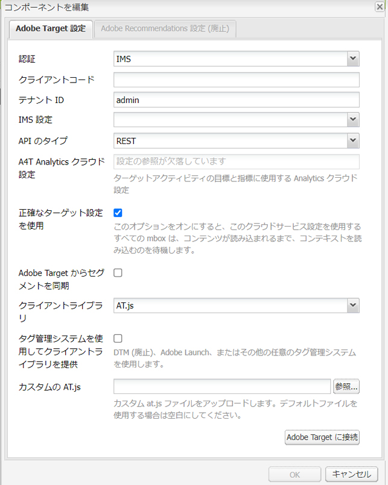

# 手動での Adobe Target との統合の設定 {#manually-configuring-the-integration-with-adobe-target}

ウィザードの使用時に行ったオプトインウィザードの設定を変更するか、ウィザードを使用せずに手動でAdobe Targetと統合できます。

## オプトインウィザードの設定の変更 {#modifying-the-opt-in-wizard-configurations}

[AEM を Adobe Target と統合](/help/sites-administering/target.md)する[オプトインウィザード](/help/sites-administering/opt-in.md)では、プロビジョニングされた Target 設定という名前の Target クラウド設定が自動的に作成されます。また、「プロビジョニングされた Target フレームワーク」という名前のクラウド設定用の Target フレームワークも作成します。 必要に応じて、クラウド設定とフレームワークのプロパティを変更できます。

A4T Analytics Cloud設定を設定して、コンテンツをターゲティングする際にAdobe Targetをレポートソースとして使用するようにAdobe Targetを設定することもできます。

クラウド設定とフレームワークの場所を特定するには、**ツール**／**デプロイメントt**／**クラウド**&#x200B;の **クラウドサービス**&#x200B;に移動します。（[http://localhost:4502/libs/cq/core/content/tools/cloudservices.html](http://localhost:4502/libs/cq/core/content/tools/cloudservices.html)）
Adobe Target の下で、「**設定を表示**」をクリックまたはタップします。

### プロビジョニングされた Target 設定のプロパティ {#provisioned-target-configuration-properties}

オプトインウィザードで作成されるプロビジョニング済み Target 設定クラウド設定では、次のプロパティ値が使用されます。

* **クライアントコード：** オプトインウィザードに入力されたとおりです。
* **電子メール：** オプトインウィザードに入力されたとおりです。
* **パスワード：** オプトインウィザードに入力されたとおりです。
* **API タイプ：** REST
* **Adobe Target からセグメントを同期：** 選択されています。

* **クライアントライブラリ：** mbox.js
* **DTM を使用してクライアントライブラリを提供：**&#x200B;選択されていません。[DTM](/help/sites-administering/dtm.md)または別のタグ管理システムを使用して mbox.js または AT.js ファイルをホストする場合は、このオプションを選択します。ライブラリの配信には AEM ではなく DTM を使用することをお勧めします。

* **カスタム mbox.js**：何も指定されておらず、デフォルトの mbox.js ファイルが使用されます。必要に応じて、使用するカスタム mbox.js ファイルを指定します。 は、mbox.js を選択した場合にのみ表示されます。
* **カスタム AT.js：**&#x200B;何も指定されておらず、デフォルトの AT.js ファイルが使用されます。必要に応じて、使用するカスタム AT.js ファイルを指定します。 AT.js を選択した場合にのみ表示されます。

>[!NOTE]
>
>AEM 6.3 では、Target ライブラリファイル [AT.JS](https://developer.adobe.com/target/implement/client-side/atjs/atjs-functions/mboxcreate-atjs/) を選択できます。このファイルは、Adobe Target 用の新しい実装ライブラリであり、通常の web 実装と単一ページアプリケーションの両方に使用できるように設計されています。
>
>AT.js は、mbox.js ライブラリに対していくつかの強化点を提供します。
>
>* Web 実装のページ読み込み時間の改善
>* セキュリティの向上
>* シングルページアプリケーション向けの実装オプションの改善
>* AT.js は、target.js に含まれるコンポーネントを含んでいるので、target を呼び出す必要がありません。


<!-- OLD URL WHICH IS 404 https://experienceleague.adobe.com/docs/target/using/implement-target/client-side/mbox-implement/mbox-download.html -->

### プロビジョニングされた Target フレームワークのプロパティ {#provisioned-target-framework-properties}

オプトインウィザードで作成されるプロビジョニング済み Target フレームワークは、プロファイルデータストアからコンテキストデータを送信するように設定されます。 ストアの年齢と性別のデータ項目は、デフォルトで Target に送信されます。 ソリューションには、追加のパラメーターの送信が必要な場合があります。


追加のコンテキスト情報を Target に送信するようにフレームワークを設定できます。詳しくは、 [Target フレームワークの追加](/help/sites-administering/target-configuring.md#adding-a-target-framework).

### A4T Analytics Cloud設定の指定 {#configuring-a-t-analytics-cloud-configuration}

コンテンツをターゲティングする際に、Adobe Analyticsをレポートソースとして使用するようにAdobe Targetを設定できます。

>[!NOTE]
>
>ユーザー資格情報認証（レガシー）は、A4T（Target と Analytics の両方）では機能しません。そのため、ユーザー資格情報認証の代わりに IMS 認証を使用する必要があります。

これをおこなうには、Adobe Targetクラウド設定を接続する A4T クラウド設定を指定します。

1. **AEM のロゴ**／**ツール**／**デプロイメント**／**クラウドサービス**&#x200B;の順に移動して&#x200B;**クラウドサービス**&#x200B;にアクセスします。
1. 「**Adobe Target**」セクションで、「**今すぐ設定**」をクリックします。
1. Adobe Target設定に再接続します。
1. 内 **A4T Analytics Cloud設定** ドロップダウンメニューから、フレームワークを選択します。

   >[!NOTE]
   >
   >A4T に対して有効になっている Analytics 設定のみを使用できます。
   >
   >AEMを使用して A4T を設定する際に、設定参照にエントリが見つからない場合があります。 分析フレームワークを選択できるようにするには、次の手順を実行します。
   >
   >1. **ツール**／**一般**／**CRXDE Lite** に移動します。
   1. [A4T Analytics 設定ダイアログ](#a4t-analytics-config-dialog)に移動します（以下を参照）。
   1. プロパティ **無効化** を **false** に設定します。
   1. 「**すべて保存**」をタップまたはクリックします。


#### A4T Analytics 設定ダイアログ {#a4t-analytics-config-dialog}

```xml
/libs/cq/analytics/components/testandtargetpage/dialog/items/tabs/items/tab1_general/items/a4tAnalyticsConfig
```



「**OK**」をクリックします。Adobe Targetでコンテンツをターゲット設定すると、 [レポートソースの選択](/help/sites-authoring/content-targeting-touch.md).

## Adobe Targetとの手動統合 {#manually-integrating-with-adobe-target}

オプトインウィザードを使用せずに、手動でAdobe Targetと統合します。

>[!NOTE]
Target ライブラリファイル [AT.JS](https://developer.adobe.com/target/implement/client-side/atjs/atjs-functions/mboxcreate-atjs/) は、Adobe Target 用の新しい実装ライブラリであり、通常の ｗeb 実装と単一ページアプリケーションの両方に使用できるように設計されています。Adobeでは、mbox.js ではなく AT.js をクライアントライブラリとして使用することをお勧めします。
AT.js は、mbox.js ライブラリに対していくつかの強化点を提供します。
* Web 実装のページ読み込み時間の改善
* セキュリティの向上
* シングルページアプリケーション向けの実装オプションの改善
* AT.js は、target.js に含まれるコンポーネントを含むので、target.js を呼び出す必要がなくなりました
>
**クライアントライブラリ**&#x200B;ドロップダウンメニューでは、AT.js または mbox.js を選択できます。

<!-- OLD URL from above was 404 https://experienceleague.adobe.com/docs/target/using/implement-target/client-side/mbox-implement/mbox-download.html -->

### Target クラウド設定の作成 {#creating-a-target-cloud-configuration}

AEMがAdobe Targetとやり取りできるようにするには、Target クラウド設定を作成します。 設定を作成するには、Adobe Targetのクライアントコードとユーザーの資格情報を指定します。

Target クラウド設定を作成するのは、1 回のみです。これは、設定を複数のAEMキャンペーンに関連付けることができるからです。 複数のAdobe Targetクライアントコードがある場合、各クライアントコードに対して 1 つの設定を作成します。

クラウド設定を設定して、Adobe Targetからセグメントを同期することができます。 同期を有効にすると、クラウド設定を保存する際に、セグメントがバックグラウンドで Target から読み込まれます。

AEMで Target クラウド設定を作成するには、以下の手順を実行します。

1. **AEM ロゴ**／**ツール**／**クラウドサービス**／**従来のクラウドサービス**&#x200B;を使用して、**クラウドサービス**&#x200B;に移動します。（[http://localhost:4502/libs/cq/core/content/tools/cloudservices.html](http://localhost:4502/libs/cq/core/content/tools/cloudservices.html)）

   **クラウドサービス**&#x200B;概要ページが開きます。

1. 「**Adobe Target**」セクションで、「**今すぐ設定**」をクリックします。
1. **設定を作成**&#x200B;ダイアログで、次の操作を実行します。

   1. 設定の「**タイトル**」を入力します。
   1. 「**Adobe Target 設定**」テンプレートを選択します。
   1. 「**作成**」をクリックします。

   編集ダイアログが開きます。

   

   >[!NOTE]
   AEMを使用して A4T を設定する際に、設定参照にエントリが見つからない場合があります。 分析フレームワークを選択できるようにするには、次の手順を実行します。
   1. **ツール**／**一般**／**CRXDE Lite** に移動します。
   1. **/libs/cq/analytics/components/testandtargetpage/dialog/items/tabs/items/tab1_general/items/a4tAnalyticsConfig** に移動します。
   1. プロパティ **無効化** を **false** に設定します。
   1. 「**すべて保存**」をタップまたはクリックします。


1. ダイアログで、次のプロパティの値を入力します。

   * **クライアントコード**：Target アカウントのクライアントコード
   * **電子メール**:Target アカウントの電子メール。
   * **パスワード**:Target アカウントのパスワード。
   * **API タイプ**:REST または XML
   * **A4T Analytics Cloud設定**:Target のアクティビティの目標と指標に使用するAnalytics Cloud設定を選択します。 コンテンツをターゲティングする際に、Adobe Analyticsをレポートソースとして使用する場合は、この設定が必要です。 クラウド設定が表示されない場合は、[A4T Analytics クラウドの設定](#configuring-a-t-analytics-cloud-configuration)のメモを参照してください。

   * **正確なターゲット設定を使用**：デフォルトでは、このチェックボックスはオンになっています。選択した場合、クラウドサービス設定は、コンテキストの読み込みを待ってから、コンテンツを読み込みます。 次の注意を参照してください。
   * **Adobe Targetからセグメントを同期：** このオプションを選択すると、Target で定義されたセグメントをダウンロードしてAEMで使用できます。 インラインセグメントはサポートされておらず、Target のセグメントを使用する必要があるので、API Type プロパティが REST の場合は、このオプションを選択します。 (「セグメント」というAEM用語は、ターゲット「オーディエンス」と同じです )。
   * **クライアントライブラリ：**&#x200B;クライアントライブラリとして mbox.js と AT.js のいずれを使用するかを選択します。
   * **DTM を使用してクライアントライブラリを提供** - DTM または他のタグ管理システムの AT.js または mbox.js を使用する場合は、このオプションを選択します。 設定 [DTM 統合](/help/sites-administering/dtm.md) をクリックして、このオプションを使用します。 ライブラリの配信には AEM ではなく DTM を使用することをお勧めします。
   * **カスタム mbox.js**:DTM ボックスをオンにした場合やデフォルトの mbox.js を使用する場合は空白のままにします。 または、カスタム mbox.js をアップロードします。 は、mbox.js を選択した場合にのみ表示されます。
   * **カスタムの AT.js**:DTM ボックスをオンにした場合やデフォルトの AT.js を使用する場合は空白のままにします。 または、カスタムの AT.js をアップロードします。 AT.js を選択した場合にのみ表示されます。

   >[!NOTE]
   デフォルトでは、Adobe Target 設定ウィザードをオプトインすると、正確なターゲット設定が有効になります。
   正確なターゲティングとは、クラウドサービスの設定が、コンテキストの読み込みを待ってからコンテンツを読み込むことを意味します。 その結果、パフォーマンスに関しては、正確なターゲティングによって、コンテンツを読み込む前に数ミリ秒の遅延が生じる場合があります。
   正確なターゲット設定は、オーサーインスタンスで常に有効になっています。 ただし、パブリッシュインスタンスでは、クラウドサービス設定の「正確なターゲティング」の横にあるチェックマークをオフにすることで、正確なターゲティングをグローバルにオフにすることができます (**http://localhost:4502/etc/cloudservices.html**) をクリックします。 また、クラウドサービス設定での設定に関係なく、個々のコンポーネントに対して正確なターゲティングのオン/オフを切り替えることもできます。
   この設定を変更しても、作成済みの対象コンポーネントには影響しません&#x200B;***。***&#x200B;これらのコンポーネントを直接変更します。

1. 「**Target に接続**」をクリックして、Target との接続を開始します。接続に成功すると、「**接続に成功しました**」というメッセージが表示されます。メッセージの「**OK**」をクリックして、ダイアログの「**OK**」をクリックします。

   Target に接続できない場合は、 [トラブルシューティング](/help/sites-administering/target-configuring.md#troubleshooting-target-connection-problems) 」セクションに入力します。

### Target フレームワークの追加 {#adding-a-target-framework}

Target クラウド設定を設定したら、Target フレームワークを追加します。このフレームワークは、使用可能な [ClientContext](/help/sites-administering/client-context.md) または [ContextHub](/help/sites-developing/ch-configuring.md) コンポーネント。 Target は、パラメーターを使用して、現在のコンテキストに適用されるセグメントを決定します。

1 つの Target 設定に対して複数のフレームワークを作成できます。 Web サイトのセクションごとに異なるパラメーターセットを Target に送信する必要がある場合は、複数のフレームワークが便利です。 送信するパラメーターのセットごとにフレームワークを作成します。 Web サイトの各セクションを適切なフレームワークに関連付けます。 Web ページは、一度に 1 つのフレームワークのみを使用できます。

1. Target 設定ページで、「使用できるフレームワーク」の横の「**+**」（プラス符号）をクリックします。
1. フレームワークを作成ダイアログで、「**タイトル**」を指定し、「**Adobe Target フレームワーク**」を選択して、「**作成**」をクリックします。

   

   フレームワークページが表示されます。サイドキックに、マッピングできる [ClientContext](/help/sites-administering/client-context.md) または [ContextHub](/help/sites-developing/ch-configuring.md) の情報を表すコンポーネントが表示されます。

   

1. マッピングに使用するデータを表す ClientContext コンポーネントをドロップターゲットにドラッグします。または、**ContextHub ストア**&#x200B;コンポーネントをフレームワークにドラッグします。

   >[!NOTE]
   マッピング時に、パラメーターは単純な文字列を使用して mbox に渡されます。 ContextHub から配列をマッピングすることはできません。

   例えば、 **プロファイルデータ** サイト訪問者について、Target キャンペーンを制御するには、 **プロファイルデータ** コンポーネントをページに追加します。 Target パラメーターへのマッピングに使用できるプロファイルデータ変数が表示されます。

   

1. 該当する列の「**共有**」チェックボックスをオンにして、Target システムで表示する変数を選択します。

   

   >[!NOTE]
   パラメーターの同期は、AEMからAdobe Targetへの 1 つの方法のみです。

フレームワークが作成されました。 フレームワークをパブリッシュインスタンスにレプリケートするには、 **フレームワークを有効化** オプションを選択します。

### アクティビティと Target クラウド設定の関連付け  {#associating-activities-with-the-target-cloud-configuration}

[AEM アクティビティ](/help/sites-authoring/activitylib.md)を Target クラウド設定に関連付け、アクティビティを [Adobe Target](https://experienceleague.adobe.com/docs/target/using/experiences/offers/manage-content.html?lang=ja) にミラーリングできるようにします。

>[!NOTE]
使用可能なアクティビティの種類は、次のオプションによって決まります。
* この **xt_only** オプションが、Adobe Targetへの接続にAEM側で使用されるAdobe Targetテナント (clientcode) で有効になっている場合、 **のみ** AEMの XT アクティビティ。
* この **xt_only** オプションは **not** Adobe Targetテナント (clientcode) で有効にした場合、 **両方** AEMの XT および A/B アクティビティ。
>
**追加の注意：** **xt_only** オプションは、特定の Target テナント (clientcode) に適用される設定で、Adobe Targetでのみ直接変更できます。 このオプションは AEM で有効および無効にすることはできません。

### Target フレームワークとサイトの関連付け {#associating-the-target-framework-with-your-site}

AEMで Target フレームワークを作成した後、Web ページをフレームワークに関連付けます。 ページ上のターゲットコンポーネントは、フレームワークで定義されたデータをAdobe Targetに送信し、トラッキングをおこないます。 （[コンテンツのターゲティング](/help/sites-authoring/content-targeting-touch.md)を参照）。

ページをフレームワークに関連付けると、子ページが関連付けを継承します。

1. **Sites** コンソールで、設定するサイトに移動します。
1. [クイックアクション](/help/sites-authoring/basic-handling.md#quick-actions)または[選択モード](/help/sites-authoring/basic-handling.md)を使用して、「**プロパティを表示**」を選択します。
1. 「**クラウドサービス**」タブを選択します。
1. 「**編集**」をタップまたはクリックします。
1. タップまたはクリック **設定を追加** under **Cloud Service設定** を選択し、 **Adobe Target**.

   

1. 以下で使用するフレームワークを選択します。 **設定リファレンス**.

   >[!NOTE]
   必ず **枠組み** 作成された Target クラウド設定ではなく、作成元のクラウド設定が含まれていることを確認します。

1. 「**完了**」をタップまたはクリックします。
1. Web サイトのルートページをアクティベートして、パブリッシュサーバーにレプリケートします。 ( [ページの公開方法](/help/sites-authoring/publishing-pages.md).)

   >[!NOTE]
   ページに関連付けたフレームワークがまだアクティベートされていない場合は、ウィザードが開き、それを公開することもできます。

## Target 接続の問題のトラブルシューティング {#troubleshooting-target-connection-problems}

Target に接続する際に発生する問題のトラブルシューティングをおこなうには、次のタスクを実行します。

* 指定したユーザー資格情報が正しいことを確認します。
* AEMインスタンスが Target サーバーに接続できることを確認します。 例えば、ファイアウォール規則が送信AEM接続をブロックしていないこと、またはAEMが必要なプロキシを使用するように設定されていることを確認します。
* AEMエラーログで役立つメッセージを探します。 error.log ファイルは **crx-quickstart/logs** AEMがインストールされているディレクトリ。
* Adobe Targetでアクティビティを編集する際、URL は localhost を指しています。 AEM Externalizer を正しい URL に設定することで、この理解を回避します。
