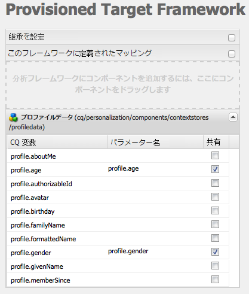
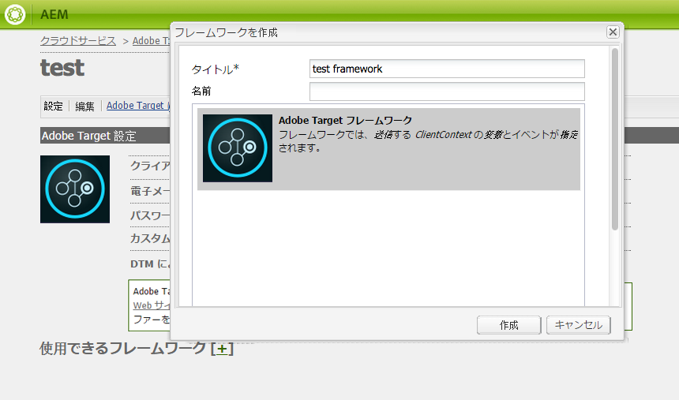
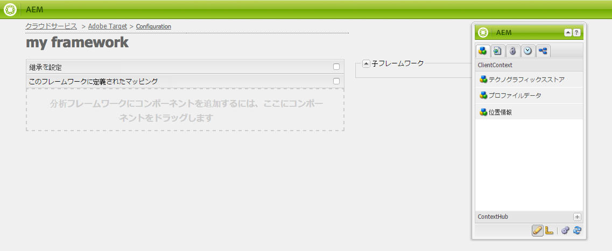
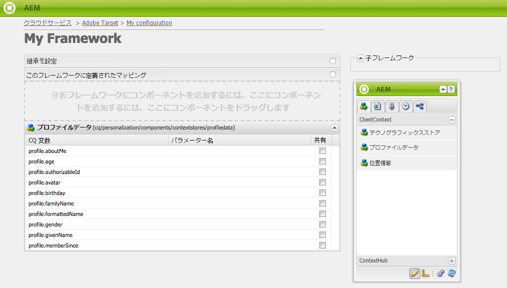
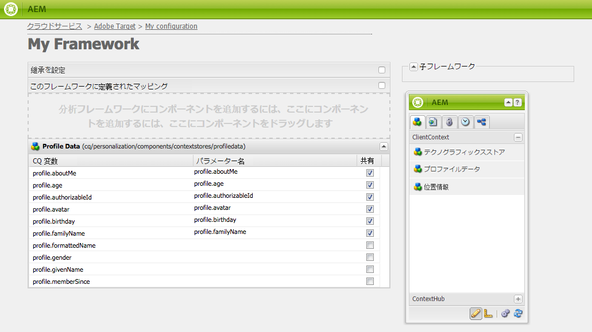
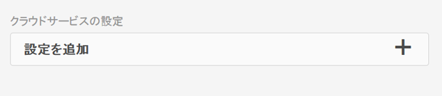

# 手動での Adobe Target との統合の設定 {#manually-configuring-the-integration-with-adobe-target}

ウィザードを使用するときに作成したオプトインウィザードの設定を変更するか、ウィザードを使用しないで手動で Adobe Target と統合できます。

## オプトインウィザードの設定の変更 {#modifying-the-opt-in-wizard-configurations}

The [Opt-in wizard](/help/sites-administering/opt-in.md) that [integrates AEM with Adobe Target](/help/sites-administering/target.md) automatically creates a Target cloud configuration named Provisioned Target Configuration. また、ウィザードではプロビジョニングされた Target フレームワークという名前のクラウド設定の Target フレームワークも作成されます。クラウド設定とフレームワークのプロパティは、必要に応じて変更できます。

また、コンテンツをターゲット化するときに、A4T Analytics クラウド設定を変更して、Adobe Analytics をレポートソースとして使用するように Adobe Target を設定できます。

To locate the cloud configuration and the framework, Navigate to **Cloud Services** via **Tools** > **Deployment** > **Cloud**. （[http://localhost:4502/libs/cq/core/content/tools/cloudservices.html](http://localhost:4502/libs/cq/core/content/tools/cloudservices.html)） Adobe Target の下で、「**設定を表示**」をクリックまたはタップします。

### プロビジョニングされた Target 設定のプロパティ {#provisioned-target-configuration-properties}

次のプロパティ値は、オプトインウィザードで作成されるプロビジョニングされた Target 設定のクラウド設定で使用されます。

* **クライアントコード：**&#x200B;オプトインウィザードに入力されている通りです。
* **電子メール：**&#x200B;オプトインウィザードに入力されている通りです。
* **パスワード：**&#x200B;オプトインウィザードに入力されている通りです。
* **API のタイプ：** REST
* **Adobe Targetからのセグメントの同期：** 選択済み。

* **クライアントライブラリ：** mbox.jsを参照してください。
* **DTMを使用したクライアントライブラリの配信：** 未選択。 Select this option if you [use DTM](/help/sites-administering/dtm.md) or another tag management system to host the mbox.js or AT.js file. ライブラリの配信には AEM ではなく DTM を使用することをお勧めします。

* **カスタム mbox.js**：何も指定されておらず、デフォルトの mbox.js ファイルが使用されます。必要に応じて、使用するカスタム mbox.js を指定します。mbox.js を選択した場合にのみ表示されます。
* **Custom AT.js:** デフォルトのAT.jsファイルが使用されるように指定しません。 必要に応じて、使用するカスタム AT.js を指定します。AT.js を選択した場合にのみ表示されます。

>[!NOTE]
>
>In AEM 6.3, you can select the Target Library file, [AT.JS](https://docs.adobe.com/content/help/en/target/using/implement-target/client-side/mbox-implement/mbox-download.html), which is a new implementation library for Adobe Target that is designed for both typical web implementations and single-page applications.
>
>AT.js は、mbox.js ライブラリと比較して、いくつかの点で改善されています。
>
>* Web 実装のページ読み込み時間が改善されています。
>* セキュリティが改善されています。
>* 単一ページアプリケーションの実装オプションが改善されています。
>* target.js に含まれていたコンポーネントが AT.js にも含まれているので、target.js への呼び出しがなくなりました。

### プロビジョニングされた Target フレームワークのプロパティ {#provisioned-target-framework-properties}

オプトインウィザードで作成されるプロビジョニングされた Target フレームワークはプロファイルデータストアからコンテキストデータを送信するように設定されています。ストアの年齢と性別のデータ項目はデフォルトで Target に送信されます。お使いのソリューションでは追加のパラメーターを送信する必要があります。

[Target フレームワークの追加](/help/sites-administering/target-configuring.md#adding-a-target-framework)で説明されているとおり、追加のコンテキスト情報を Target に送信するようにフレームワークを設定できます。

### A4T Analytics クラウド設定の設定 {#configuring-a-t-analytics-cloud-configuration}

コンテンツをターゲット化するときに、Adobe Analytics をレポートソースとして使用するように Adobe Target を設定できます。

これをおこなうには、Adobe Target クラウド設定を接続する A4T クラウド設定を指定する必要があります。

1. **AEMロゴ** / **Tools** /Deployment Tools **/Deployments nolgentCloud Serviceを使用して、** Cloud Serviceに移動します。 **AEMロゴ** /Deployment Tools/Deployments nolginations **** nortus.
1. In the **Adobe Target** section, click **Configure Now**.
1. Adobe Target 設定に再接続します。
1. **A4T Analytics クラウド設定**&#x200B;ドロップダウンメニューで、フレームワークを選択します。

   >[!NOTE]
   >
   >A4T に対して有効化されている Analytics 設定のみを使用できます。
   >
   >AEM で A4T を設定する際には、「設定の参照が欠落しています」というエントリが表示される場合があります。分析フレームワークを選択できるようにするには、次の操作をおこないます。
   >
   >1. **ツール** / **一般** / **CRXDE Liteに移動します**。
   1. Navigate to **/libs/cq/analytics/components/testandtargetpage/dialog/items/tabs/items/tab1_general/items/a4tAnalyticsConfig**
   1. Set the property **disable** to **false**.
   1. 「**すべて保存**」をタップまたはクリックします。

   

   「**OK**」をクリックします。Adobe Target でコンテンツをターゲット化すると、[レポートソースを選択](/help/sites-authoring/content-targeting-touch.md)できるようになります。

## 手動での Adobe Target との統合 {#manually-integrating-with-adobe-target}

オプトインウィザードを使用せずに手動で Adobe Target と統合します。

>[!NOTE]
The Target Library file, [AT.JS](https://docs.adobe.com/content/help/en/target/using/implement-target/client-side/mbox-implement/mbox-download.html), is a new implementation library for Adobe Target that is designed for both typical web implementations and single-page applications. mbox.js の代わりに AT.js をクライアントライブラリとして使用することをお勧めします。
AT.js は、mbox.js ライブラリと比較して、いくつかの点で改善されています。
* Web 実装のページ読み込み時間が改善されています。
* セキュリティが改善されています。
* 単一ページアプリケーションの実装オプションが改善されています。
* target.js に含まれていたコンポーネントが AT.js にも含まれているので、target.js への呼び出しがなくなりました。

**クライアントライブラリ**&#x200B;ドロップダウンメニューでは、AT.js または mbox.js を選択できます。

### Target クラウド設定の作成 {#creating-a-target-cloud-configuration}

AEM が Adobe Target とやり取りできるようにするには、Target クラウド設定を作成します。この設定を作成するために、Adobe Target のクライアントコードとユーザー資格情報を入力します。

Target クラウド設定は複数の AEM キャンペーンと関連付けることができるので、設定は一度だけ作成します。Adobe Target クライアントコードが複数ある場合は、クライアントコードごとにひとつ設定を作成します。

Adobe Target からセグメントを同期するように、クラウド設定を指定できます。同期を有効にした場合は、クラウド設定が保存されるとすぐに、バックグラウンドでセグメントが Target から読み込まれます。

次の手順を実行して、AEM に Target クラウド設定を作成します。

1. **AEMロゴ** / **Tools** /Deployment Tools **/Deployments nolgentCloud Serviceを使用して、** Cloud Serviceに移動します。 **AEMロゴ** /Deployment Tools/Deployments nolginations **** nortus. （[http://localhost:4502/libs/cq/core/content/tools/cloudservices.html](http://localhost:4502/libs/cq/core/content/tools/cloudservices.html)）。

   The **Adobe Marketing Cloud** overview page opens.

1. In the **Adobe Target** section, click **Configure Now**.
1. In the **Create Configuration** dialog:

   1. Give the configuration a **Title**.
   1. Select the **Adobe Target Configuration** template.
   1. 「**作成**」をクリックします。

   編集ダイアログが開きます。

   

   >[!NOTE]
   AEM で A4T を設定する際には、「設定の参照が欠落しています」というエントリが表示される場合があります。分析フレームワークを選択できるようにするには、次の操作をおこないます。
   1. **ツール** / **一般** / **CRXDE Liteに移動します**。
   1. Navigate to **/libs/cq/analytics/components/testandtargetpage/dialog/items/tabs/items/tab1_general/items/a4tAnalyticsConfig**
   1. Set the property **disable** to **false**.
   1. 「**すべて保存**」をタップまたはクリックします。

1. ダイアログで、次のプロパティの値を入力します。

   * **クライアントコード**：Target アカウントのクライアントコード
   * **電子メール**：Target アカウントの電子メール
   * **パスワード**：Target アカウントのパスワード
   * **API のタイプ：** REST または XML
   * **A4T Analytics クラウド設定**：ターゲットアクティビティの目標と指標に使用する Analytics クラウド設定。これは、コンテンツをターゲット化するときに、Adobe Analytics をレポートソースとして使用している場合に必要です。If you do not see your cloud configuration, see note in [Configuring A4T Analytics Cloud Configuration](#configuring-a-t-analytics-cloud-configuration).

   * **正確なターゲット設定を使用**：デフォルトでは、このチェックボックスはオンになっています。オンにすると、クラウドサービス設定はコンテンツが読み込まれるまでコンテキストの読み込みを待機します。続きのメモを確認してください。
   * **Adobe Targetからのセグメントの同期：** このオプションを選択すると、Targetで定義されたセグメントをダウンロードしてAEMで使用できます。 「API のタイプ」プロパティが REST のときは、インラインのセグメントがサポートされておらず、常に Target からセグメントを使用する必要があるので、このオプションをオンにする必要があります（AEM の用語「セグメント」は、Target の「オーディエンス」と同じです）。
   * **クライアントライブラリ：** mbox.jsまたはAT.jsクライアントライブラリのどちらにするかを選択します。
   * **DTMを使用してクライアントライブラリを提供** - DTMまたは他のタグ管理システムのAT.jsまたはmbox.jsを使用する場合は、このオプションを選択します。 You must [configure the DTM integration](/help/sites-administering/dtm.md) to use this option. ライブラリの配信には AEM ではなく DTM を使用することをお勧めします。
   * **カスタム mbox.js**：DTM ボックスをオンにした場合またはデフォルトの mbox.js を使用する場合は空にします。それ以外の場合は、カスタム mbox.js をアップロードします。mbox.js を選択した場合にのみ表示されます。
   * **カスタムの AT.js**：DTM ボックスをオンにした場合またはデフォルトの AT.js を使用する場合は空にします。それ以外の場合は、カスタム AT.js をアップロードします。AT.js を選択した場合にのみ表示されます。

   >[!NOTE]
   デフォルトでは、Adobe Target 設定ウィザードをオプトインすると、正確なターゲット設定が有効になります。
   正確なターゲット設定を有効にすると、クラウドサービス設定はコンテンツが読み込まれるまでコンテキストの読み込みを待機します。結果として、正確なターゲット設定を有効にすると、パフォーマンスの面ではコンテンツの読み込みに数ミリ秒の遅延が発生することがあります。
   正確なターゲット設定はオーサーインスタンスでは常に有効になっています。ただし、パブリッシュインスタンスではクラウドサービス設定（**http://localhost:4502/etc/cloudservices.html**）の正確なターゲット設定の横にあるチェックマークをオフにすることで、正確なターゲット設定をグローバルにオフにできます。また、クラウドサービス設定の設定に関係なく、個々のコンポーネントの正確なターゲット設定のオンとオフを切り替えることもできます。
   この設定を変更しても、作成済み&#x200B;******&#x200B;の対象コンポーネントには影響しません。これらのコンポーネントには直接変更を加える必要があります。

1. 「**Target に接続**」をクリックして、Target の接続を開始します。接続に成功すると、「**接続に成功しました**」というメッセージが表示されます。メッセージの「**OK**」をクリックして、ダイアログの「**OK**」をクリックします。

   Target に接続できない場合は、[トラブルシューティング](/help/sites-administering/target-configuring.md#troubleshooting-target-connection-problems)のセクションを参照してください。

### Target フレームワークの追加 {#adding-a-target-framework}

Target クラウド設定を設定したら、Target フレームワークを追加します。このフレームワークは、使用可能な [Client Context](/help/sites-administering/client-context.md) コンポーネントまたは [ContextHub](/help/sites-administering/contexthub-config.md) コンポーネントから Adobe Target に送信されるデフォルトのパラメーターを識別します。Target はこのパラメーターを使用して、現在のコンテキストに該当するセグメントを判別します。

ひとつの Target 設定に対して複数のフレームワークを作成できます。複数のフレームワークは、Web サイトの異なるセクション向けの異なるセットのパラメーターを Target に送信する必要があるときに便利です。送信する必要があるパラメーターのセットごとにフレームワークを作成します。Web サイトの各セクションに該当するフレームワークを関連付けます。1 つの Web ページは一度に 1 つのフレームワークしか使用できません。

1. On your Target configuration page, click the **+** (plus sign) next to Available Frameworks.
1. In the Create Framework dialog, specify a **Title**, select the **Adobe Target Framework**, and click **Create**.

   

   フレームワークページが表示されます。Sidekick provides components that represent information from the [Client Context](/help/sites-administering/client-context.md) or [ContextHub](/help/sites-administering/contexthub-config.md) that you can map.

   

1. マッピングに使用するデータを表す ClientContext コンポーネントをドロップターゲットにドラッグします。または、**ContextHub ストア**&#x200B;コンポーネントをフレームワークにドラッグします。

   >[!NOTE]
   マッピングするときに、パラメーターは単純な文字列を介して mbox に渡されます。ContextHub から配列をマッピングすることはできません。

   For example, to use **Profile Data** about your site vistors to control your Target campaign, drag the **Profile Data** component to the page. Target パラメーターへのマッピングに使用できるプロファイルデータ変数が表示されます。

   

1. 該当する列の「**共有**」チェックボックスをオンにして、Target システムで表示する変数を選択します。

   

   >[!NOTE]
   パラメーターの同期は、AEM から Adobe Target への一方向のみです。

フレームワークが作成されます。フレームワークをパブリッシュインスタンスにレプリケートするには、サイドキックで「**フレームワークをアクティベート**」オプションを使用します。

### アクティビティと Target クラウド設定の関連付け  {#associating-activities-with-the-target-cloud-configuration}

[AEMアクティビティ](/help/sites-authoring/activitylib.md) をTargetクラウド設定に関連付けて、アクティビティを [Adobe Targetでミラーリングできるようにします](https://docs.adobe.com/content/help/en/target/using/experiences/offers/manage-content.html)。

>[!NOTE]
使用可能なアクティビティの種類は、次のオプションによって決まります。
* Adobe Target の接続に AEM 側で使用される Adobe Target テナント（clientcode）で **xt_only** オプションがオンになっている場合は、XT アクティビティ&#x200B;**のみ**&#x200B;を AEM で作成できます。

* Adobe Target テナント（clientcode）で **xt_only** オプションが&#x200B;**オフ**&#x200B;になっている場合は、XT アクティビティと A/B アクティビティの&#x200B;**両方**&#x200B;を AEM で作成できます。

**追加のメモ：** **xt_only** オプションは特定の Target テナント（clientcode）に適用される設定で、Adobe Target でのみ直接編集できます。このオプションは AEM で有効および無効にすることはできません。

### Target フレームワークとサイトの関連付け {#associating-the-target-framework-with-your-site}

AEM に Target フレームワークを作成したら、Web ページとフレームワークを関連付けます。この Web ページ上のターゲット化されたコンポーネントが、フレームワークで定義されたデータを追跡のために Adobe Target に送信します（[コンテンツのターゲティング](/help/sites-authoring/content-targeting-touch.md)を参照）。

ページをフレームワークに関連付けると、子ページが関連付けを継承します。

1. In the **Sites** console, navigate to the site that you want to configure.
1. Using either [quick actions](/help/sites-authoring/basic-handling.md#quick-actions) or [selection mode](/help/sites-authoring/basic-handling.md), select **View Properties.**
1. 「**クラウドサービス**」タブを選択します。
1. 「**編集**」をタップまたはクリックします。
1. 「**クラウドサービス設定**」で「**設定を追加**」をタップまたはクリックして「**Adobe Target**」を選択します。

   

1. 「**設定の参照**」で必要なフレームワークを選択します。

   >[!NOTE]
   作成の基になった Target クラウド設定ではなく、作成した固有の&#x200B;**フレームワーク**&#x200B;を選択してください。

1. 「**完了**」をタップまたはクリックします。
1. Web サイトのルートページをアクティベートして、公開サーバーにレプリケーションします（[ページを公開する方法](/help/sites-authoring/publishing-pages.md)を参照）。

   >[!NOTE]
   ページに追加したフレームワークがまだアクティベートされていなかった場合は、ウィザードが開き、同様に公開できます。

## Target の接続の問題に関するトラブルシューティング {#troubleshooting-target-connection-problems}

次のタスクを実行して、Target に接続するときに発生する問題をトラブルシューティングします。

* 指定したユーザー資格情報を正しいことを確認します。
* AEM インスタンスが Target サーバーに接続できることを確認します。例えば、ファイアウォールのルールが AEM のアウトバウンド接続をブロックしていないこと、または AEM が正しいプロキシを使用するように設定されていることを確認します。
* AEM のエラーログで参考になるメッセージを探します。error.log ファイルは、AEM がインストールされている **crx-quickstart/logs** ディレクトリにあります。
* Adobe Target でアクティビティを編集する際には、URL は localhost を指しています。AEM Externalizer を正しい URL に設定することで、これを回避します。

