# 翻訳の機能強化{#translation-enhancements}

ここでは、AEM 翻訳管理機能に対する増分的機能強化と調整について説明します。

## 翻訳プロジェクトの自動化 {#translation-project-automation}

翻訳プロジェクトでの作業の生産性を向上させるためのオプションが追加されました。例えば、翻訳起動の自動プロモーションや削除、翻訳プロジェクトの定期実行のスケジュール設定などです。

1. 翻訳プロジェクトで、「**翻訳の概要**」タイルの下部にある省略記号をクリックまたはタップします。

   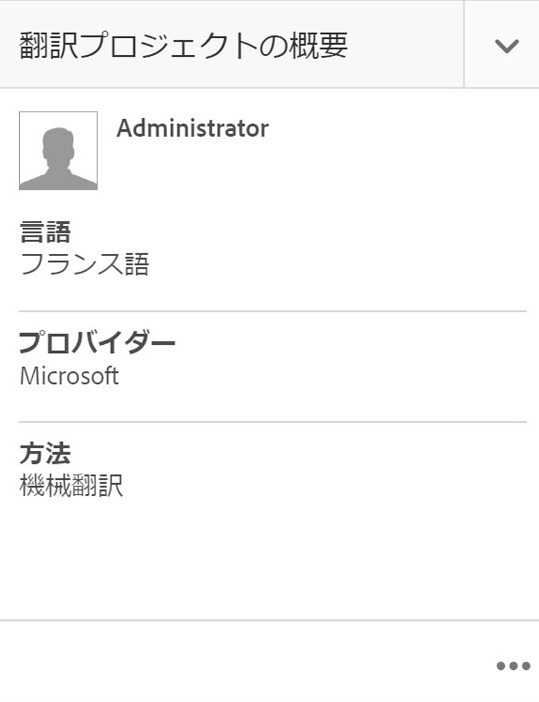

1. 「**詳細**」タブに切り替えます。下部で、「**翻訳ローンチを自動的に昇格**」を選択します。

   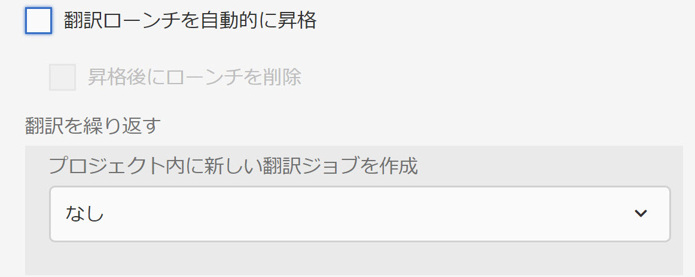

1. 必要に応じて、翻訳済みコンテンツを受け取った後に、翻訳の起動を自動的に促進および削除するかどうかを選択できます。

   

1. 翻訳プロジェクトの反復実行を選択するには、「**翻訳を繰り返す**」の下のドロップダウンで頻度を選択します。定期的なプロジェクトの実行では、指定された間隔で自動的に翻訳ジョブが作成および実行されます。

   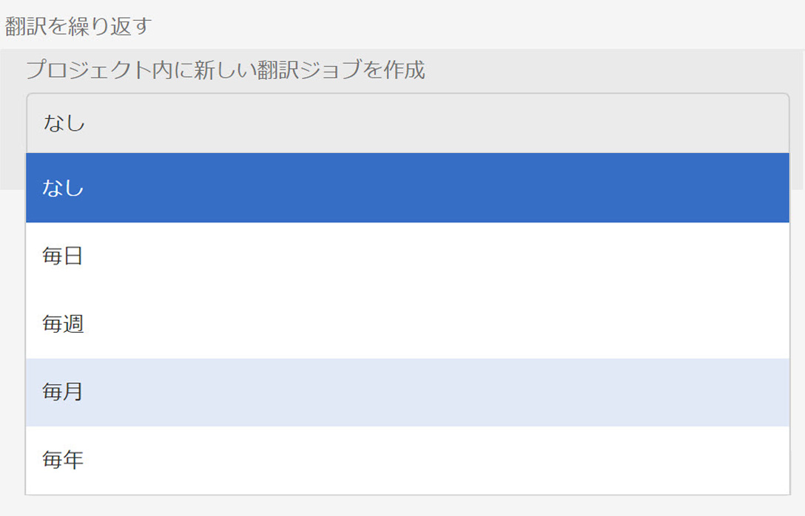

## 多言語翻訳プロジェクト {#multilingual-translation-projects}

1つの翻訳プロジェクトで複数のターゲット言語を設定して、作成する翻訳プロジェクトの総数を減らすことができます。

1. 翻訳プロジェクトで、「**翻訳の概要**」タイルの下部にある省略記号をクリックまたはタップします。

   

1. 「**詳細**」タブに切り替えます。You can add multiple languages under **Target Language**.

   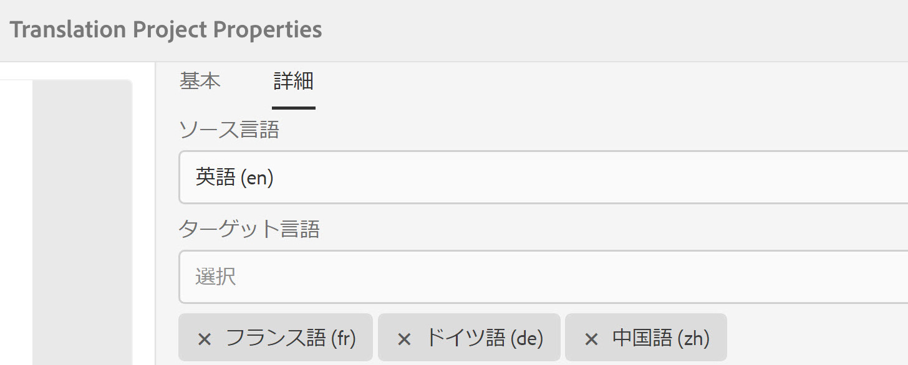

1. または、Sites の参照レールで翻訳を開始している場合、言語を追加して、「**多言語翻訳プロジェクトを作成**」を選択します。

   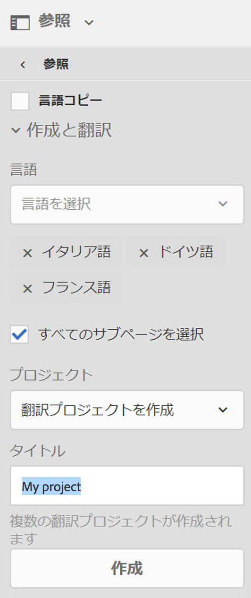

1. すべてのターゲット言語について、プロジェクトの翻訳ジョブが作成されます。プロジェクト内で 1 つずつ開始することも、プロジェクト管理でプロジェクトをグローバルに実行することで一度にすべてを開始することもできます。

   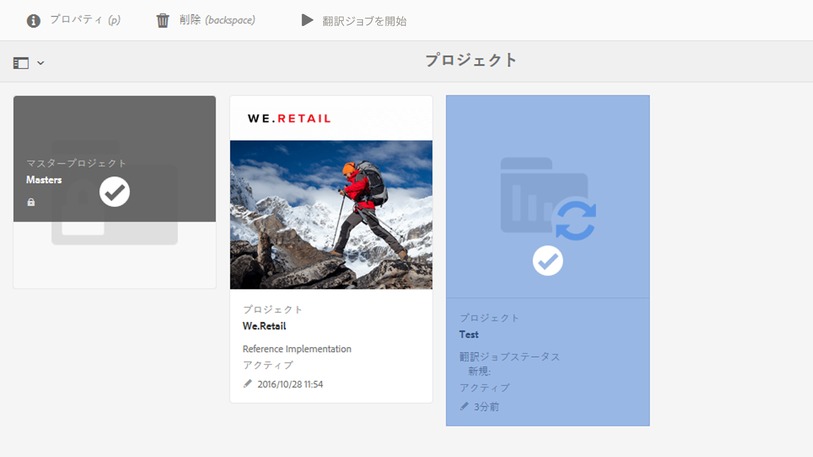

## 翻訳メモリの更新 {#translation-memory-updates}

翻訳済みコンテンツの手動の編集をTranslation Management System(TMS)に再度同期して、翻訳メモリをトレーニングできます。

1. From the Sites console, after updating text content in a translated page, select **Update Translation Memory**.

   

1. リストビューでは、編集されたすべてのテキストコンポーネントについて、ソースと翻訳が横に並んで比較表示されます。Select which translation updates should be synchronized to Translation Memory, and select **Update Memory**.

   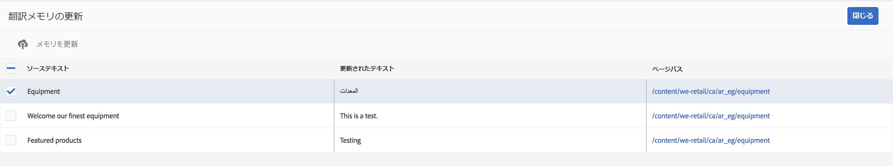

   >[!NOTE]
   >
   >AEM は、選択した文字列を翻訳管理システムに送信します。

## 複数のレベルの言語コピー {#language-copies-on-multiple-levels}

言語ルートは、言語コピーのルートを認識できる状態で、ノード（地域など）の下にグループ化できるようになりました。

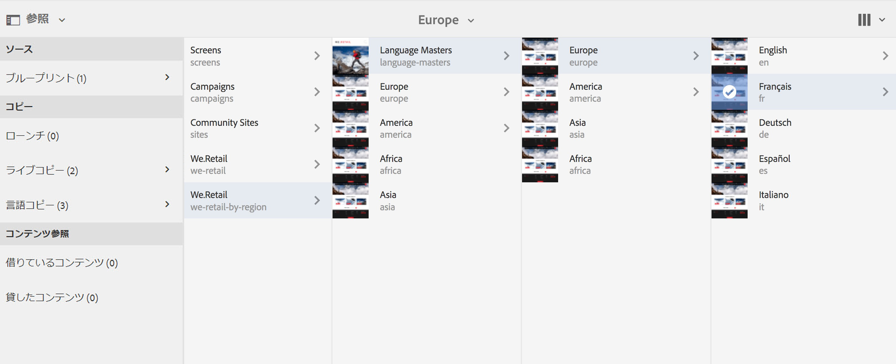

>[!CAUTION]
>
>1 レベルのみ許可されます。例えば、次の場合、「es」ページを言語コピーとして解釈できません。
>
>* `/content/we-retail/language-masters/en`
>* `/content/we-retail/language-masters/americas/central-america/es`

>
>
この `es` 言語コピーは、`en` ノードから 2 レベル離れている（americas/central-america）ので、検出されません。

>[!NOTE]
>
>言語ルートは、言語の ISO コードだけでなく、任意のページ名を持つことができます。AEM は常に最初にパスと名前を確認しますが、ページ名で言語が識別されない場合は、ページの cq:language プロパティを確認して言語を識別します。

## 翻訳ステータスのレポート {#translation-status-reporting}

ページが翻訳済みである、翻訳中である、またはまだ翻訳されていないことを示すプロパティが、Sites のリストビューで選択できるようになりました。プロパティを表示するには：

1. Sites で、**リストビュー**&#x200B;に切り替えます。

   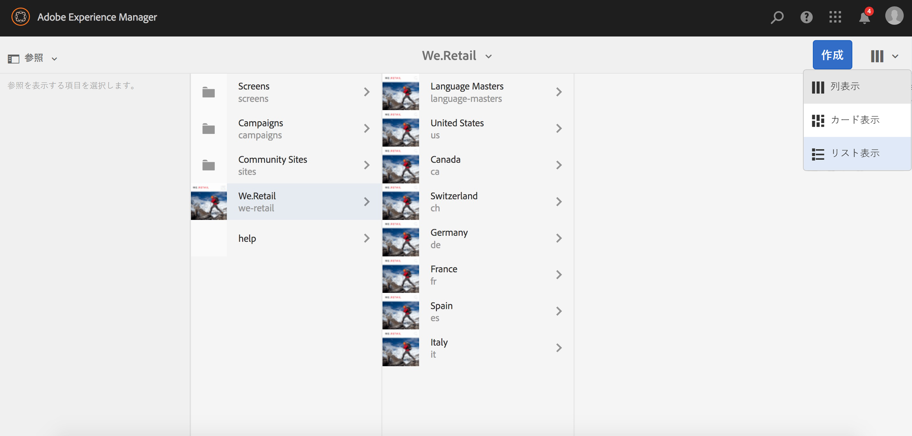

1. **設定を表示**&#x200B;をクリックまたはタップします。

   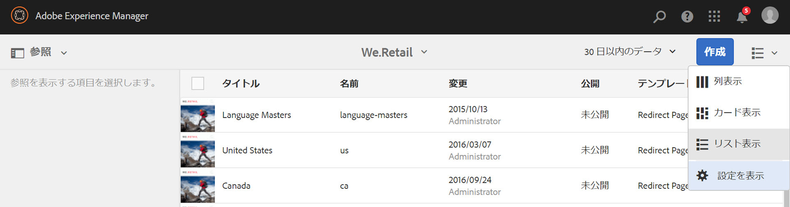

1. 「**翻訳**」の下の「**翻訳済み**」チェックボックスをオンにして、「**更新**」をタップまたはクリックします。

   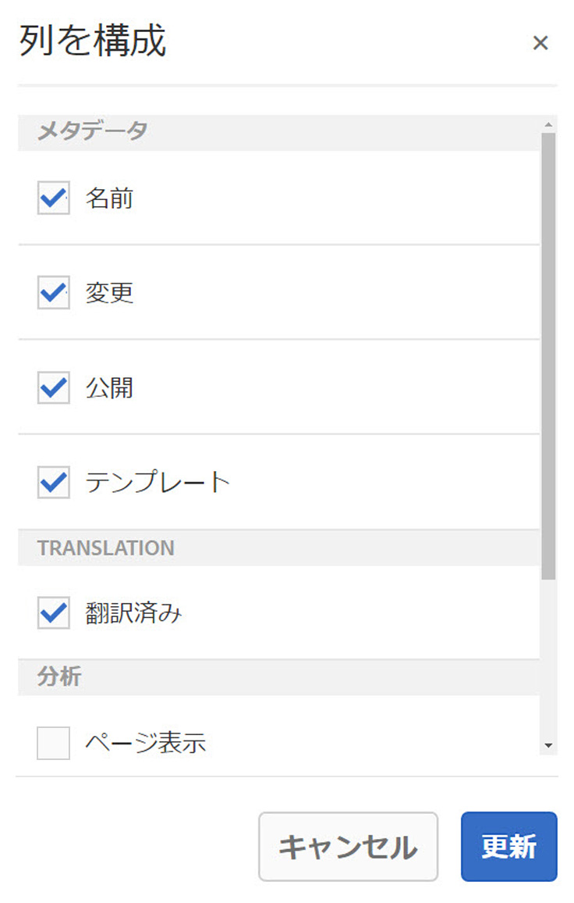

**翻訳済み**&#x200B;列にページの翻訳ステータスが表示されているのを確認できます。

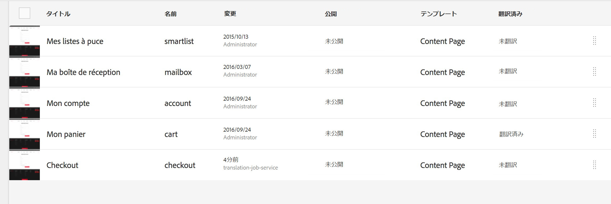

