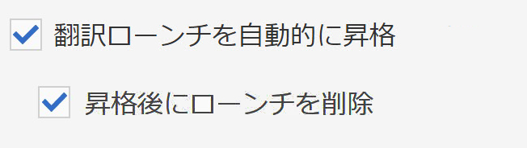

# 翻訳の機能強化{#translation-enhancements}

ここでは、AEM 翻訳管理機能に対する増分的機能強化と調整について説明します。

## 翻訳プロジェクトの自動化 {#translation-project-automation}

翻訳ローンチの自動昇格と削除、翻訳プロジェクトの繰り返し実行のスケジュール設定など、翻訳プロジェクトでの生産性を向上させるオプションが追加されました。

1. 翻訳プロジェクトで、「**翻訳の概要**」タイルの下部にある省略記号をクリックまたはタップします。

   

1. 「**詳細**」タブに切り替えます。下部で、「**翻訳ローンチを自動的に昇格**」を選択します。

   

1. オプションで、翻訳されたコンテンツを受け取った後に、翻訳ローンチを自動的に昇格および削除するかどうかを選択できます。

   

1. 翻訳プロジェクトの反復実行を選択するには、「**翻訳を繰り返す**」の下のドロップダウンで頻度を選択します。繰り返しプロジェクトの実行では、指定した間隔で翻訳ジョブが自動的に作成および実行されます。

   

## 多言語翻訳プロジェクト {#multilingual-translation-projects}

1つの翻訳プロジェクトで複数のターゲット言語を設定して、作成される翻訳プロジェクトの合計数を減らすことができます。

1. 翻訳プロジェクトで、「**翻訳の概要**」タイルの下部にある省略記号をクリックまたはタップします。

   

1. 「**詳細**」タブに切り替えます。**ターゲット言語**&#x200B;の下に複数の言語を追加できます。

   

1. または、Sites の参照レールで翻訳を開始している場合、言語を追加して、「**多言語翻訳プロジェクトを作成**」を選択します。

   

1. すべてのターゲット言語について、プロジェクトの翻訳ジョブが作成されます。プロジェクト内で 1 つずつ開始することも、プロジェクト管理でプロジェクトをグローバルに実行することで一度にすべてを開始することもできます。

   

## 翻訳メモリの更新 {#translation-memory-updates}

翻訳済みコンテンツを手動で編集すると、翻訳管理システム（TMS）に同期し直され、翻訳メモリに反映されます。

1. サイトコンソールから、翻訳されたページのテキストコンテンツを更新した後、「**翻訳メモリを更新**」を選択します。

   

1. リストビューでは、編集されたすべてのテキストコンポーネントについて、ソースと翻訳が横に並んで比較表示されます。翻訳メモリに同期する翻訳の更新を選択し、「**メモリを更新**」を選択します。

   

   >[!NOTE]
   >
   >AEM は、選択された文字列を翻訳管理システムに送信します。

## 複数のレベルの言語コピー {#language-copies-on-multiple-levels}

言語ルートは、言語コピーのルートを認識できる状態で、ノード（地域など）の下にグループ化できるようになりました。

>[!CAUTION]
>
>1 レベルのみ許可されます。例えば、次の場合、「es」ページを言語コピーとして解釈できません。
>
>* `/content/we-retail/language-masters/en`
>* `/content/we-retail/language-masters/americas/central-america/es`

>
>
この `es` 言語コピーは、`en` ノードから 2 レベル離れている（americas/central-america）ので、検出されません。

>[!NOTE]
>
>言語ルートは、言語の ISO コードだけでなく、任意のページ名を持つことができます。AEM は常に最初にパスと名前を確認しますが、ページ名で言語が識別されない場合は、ページの cq:language プロパティを確認して言語を識別します。

## 翻訳ステータスのレポート {#translation-status-reporting}

ページが翻訳済みである、翻訳中である、またはまだ翻訳されていないことを示すプロパティが、Sites のリストビューで選択できるようになりました。プロパティを表示するには：

1. Sites で、**リストビュー**&#x200B;に切り替えます。

   

1. **設定を表示**&#x200B;をクリックまたはタップします。

   

1. 「**翻訳**」の下の「**翻訳済み**」チェックボックスをオンにして、「**更新**」をタップまたはクリックします。

   

**翻訳済み**&#x200B;列にページの翻訳ステータスが表示されているのを確認できます。

