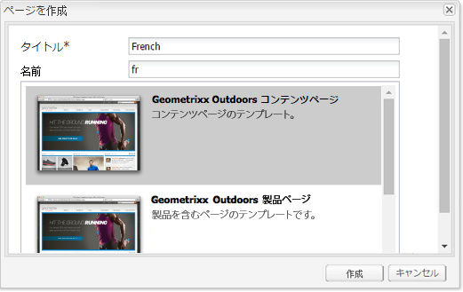
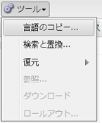
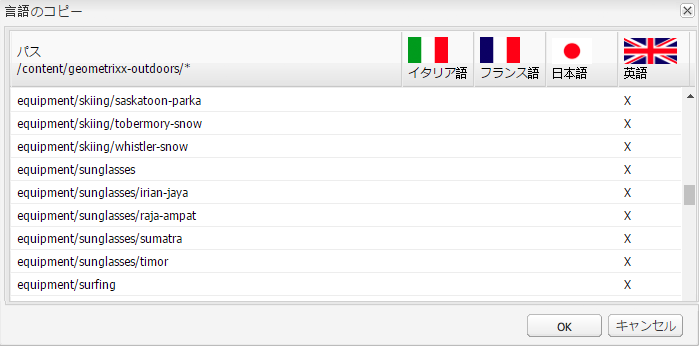
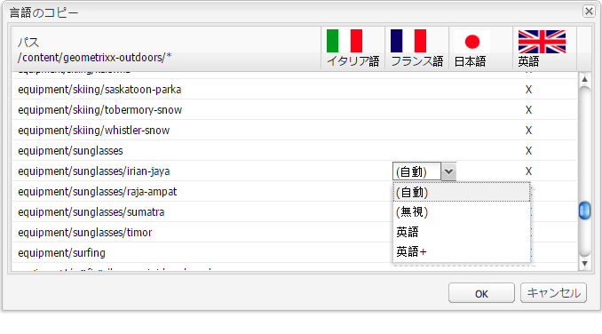

# クラシック UI による言語ルートの作成{#creating-a-language-root-using-the-classic-ui}

次の手順では、クラシック UI を使用してサイトの言語ルートを作成します。詳しくは、[言語ルートの作成](/help/sites-administering/tc-prep.md#creating-a-language-root)を参照してください。

1. Web サイトコンソールの web サイトツリーで、サイトのルートページを選択します。([http://localhost:4502/siteadmin#](http://localhost:4502/siteadmin#))
1. サイトの言語バージョンを表す新しい子ページを追加します。

   1. 新規／新しいページをクリックします。
   1. ダイアログで、「タイトル」と「名前」を指定します。名前の形式は `<language-code>` または `<language-code>_<country-code>` です（en、en_US、en_us、en_GB、en_gb など）。

      * サポートされている言語コードは、ISO-639-1 で定義されている小文字 2 文字のコードです。
      * サポートされている国コードは、ISO 3166 で定義されている小文字または大文字の 2 文字のコードです。

   1. テンプレートを選択して、「作成」をクリックします。

   

1. Web サイトコンソールの web サイトツリーで、サイトのルートページを選択します。
1. ツールメニューの「言語のコピー」を選択します。

   

   言語のコピーダイアログには、使用可能な言語バージョンと web ページの一覧が表示されます。言語列の「x」は、ページがその言語に対応していることを示します。

   

1. 既存のページまたはページツリーを言語バージョンにコピーするには、言語列でそのページのセルを選択します。矢印をクリックし、作成するコピーのタイプを選択します。

   次の例では、equipment/sunglasses/irian ページがフランス語の言語バージョンにコピーされています。

   

   | 言語コピーのタイプ | 説明 |
   |---|---|
   | auto | 親ページの動作を使用します |
   | ignore | このページとその子のコピーを作成しません |
   | `<language>+`（例：French+） | ページとそのすべての子を対象の言語からコピーします。 |
   | `<language>`（例：French） | 対象の言語からページのみをコピーします |

1. 「OK」をクリックして、ダイアログを閉じます。
1. 次のダイアログで、「はい」をクリックしてコピーを確認します。
