# 翻訳プロジェクトの管理{#managing-translation-projects}

翻訳するコンテンツの準備が完了したら、不足している言語コピーを作成して言語構造を完成し、翻訳プロジェクトを作成する必要があります。

Translation projects enable you to manage the translation of AEM content. A translation project is a type of AEM [project](/help/sites-authoring/projects.md) that contains resources that are to be translated into other languages. These resources are the pages and assets of the [language copies](/help/sites-administering/tc-prep.md) that are created from the language master.

翻訳プロジェクトにリソースが追加されると、そのリソース用の翻訳ジョブが作成されます。リソースで実行される人間による翻訳と機械翻訳のワークフローの管理に使用するコマンドとステータス情報がジョブによって提供されます。

>[!NOTE]
>
>翻訳プロジェクトには、複数の翻訳ジョブを含めることができます。

翻訳プロジェクトは、長期にわたる項目であり、グローバリゼーションに関する組織ガバナンスと合致するように言語および翻訳方法／翻訳プロバイダーによって定義されます。初期翻訳時、または手動で一度開始され、コンテンツおよび翻訳の更新アクティビティ中は有効な状態が保たれます。

翻訳プロジェクトおよびジョブは、翻訳準備ワークフローで作成されます。これらのワークフローには、初期翻訳（作成と翻訳）と更新（翻訳を更新）の両方について、次の 3 つのオプションがあります。

1. [新規プロジェクトの作成](#creating-translation-projects-using-the-references-panel)
1. [既存のプロジェクトへの追加](#adding-pages-to-a-translation-project)
1. [コンテンツ構造のみ](#creating-the-structure-of-a-language-copy)

>[!NOTE]
>
>オプション 3 は、翻訳ジョブまたは翻訳プロジェクトとは関係ありません。このオプションでは、言語マスターのコンテンツおよび構造上の変更を（未翻訳の）言語コピーにコピーできます。翻訳がない場合でも、このオプションを使用して言語マスターの同期を維持できます。

## 初期翻訳の実行と既存の翻訳の更新 {#performing-initial-translations-and-updating-existing-translations}

AEM では、翻訳プロジェクトがコンテンツの初期翻訳用に作成されたものか、翻訳済みの言語コピーを更新するためのものかを検出します。ページ用の翻訳プロジェクトを作成して、翻訳対象の言語コピーを指定すると、AEM ではターゲットの言語コピーにソースページが既に存在するかどうかを検出します。

* **言語コピーには、次のページは含まれません。** AEMは、この状況を最初の変換として扱います。 ページがすぐに言語コピーにコピーされ、プロジェクトに追加されます。翻訳されたページが AEM に読み込まれると、AEM はそのページを言語コピーに直接コピーします。
* **言語コピーには、既に次のページが含まれています。** AEMは、この状況を更新された翻訳として扱います。開始が作成され、ページのコピーが開始に追加され、プロジェクトに含まれます。起動すると、言語コピーにコミットする前に、更新された翻訳を確認できます。

   * 翻訳されたページが AEM に読み込まれると、ローンチ内のページがそのページによって上書きされます。
   * ローンチが昇格された場合にのみ、言語コピーが翻訳されたページによって上書きされます。

例えば、マスター言語 /content/geometrixx/en のフランス語の翻訳用に言語ルート /content/geometrixx/fr が作成されるとします。フランス語の言語コピーにその他のページはありません。

* フランス語の言語コピーをターゲットとした、/content/geometrixx/en/products ページおよびすべての子ページ用の翻訳プロジェクトが作成されます。言語コピーには/content/geometrixx/fr/productsページが含まれないので、AEMは即座に/content/geometrixx/en/productsページとすべての子ページをフランス語コピーにコピーします。 これらのコピーは翻訳プロジェクトにも追加されます。
* フランス語版のコピーを対象に、/content/geometrixx/enページとすべての子ページに翻訳プロジェクトが作成されます。言語コピーには/content/geometrixx/enページ（言語ルート）に対応するページが含まれているので、AEMでは/content/geometrixx/enページとすべての子ページがコピーされ、起動時に追加されます。コピーは翻訳プロジェクトにも含まれます。

## 参照パネルを使用した翻訳プロジェクトの作成 {#creating-translation-projects-using-the-references-panel}

翻訳プロジェクトを作成すると、言語マスターのリソースを翻訳するためのワークフローを実行および管理できます。プロジェクトを作成する場合は、翻訳対象の言語マスター内のページおよび翻訳を実行する対象となる言語コピーを指定します。

* 選択したページに関連付けられている翻訳統合フレームワークのクラウド設定では、翻訳プロジェクトのプロパティ（使用する翻訳ワークフローなど）の多くを指定します。
* 選択した言語コピーごとにプロジェクトが作成されます。
* 選択したページおよび関連するアセットのコピーが作成され、各プロジェクトに追加されます。これらのコピーは後で翻訳プロバイダーに翻訳用として送信されます。

選択したページの子ページも選択されるように指定できます。この場合、子ページのコピーも各プロジェクトに追加され、翻訳されます。子ページが異なる翻訳統合フレームワークの設定に関連付けられている場合、AEMは追加のプロジェクトを作成します。

You can also [manually create translation projects](#creating-a-translation-project-using-the-projects-console).

**初期翻訳と翻訳の更新**

参照パネルには、既存の言語コピーを更新するか、または言語コピーの最初のバージョンを作成するかが示されます。選択したページの言語コピーが存在する場合は、「言語コピーを更新」タブが表示されます。このタブからプロジェクト関連のコマンドにアクセスできます。

翻訳が完了したら、[翻訳をレビュー](#reviewing-and-promoting-updated-content)してから、言語コピーを上書きできます。選択したページの言語コピーが存在しない場合は、「作成と翻訳」タブが表示されます。このタブからプロジェクト関連のコマンドにアクセスできます。

### 新しい言語コピー用の翻訳プロジェクトの作成 {#create-translation-projects-for-a-new-language-copy}

1. サイトコンソールを使用して、翻訳プロジェクトに追加するページを選択します。

   例えば、Geometrixx Demo Site の英語ページを翻訳するには、Geometrixx Demo Site／English を選択します。

1. ツールバーの「参照」をクリックまたはタップします。

   

1. 言語コピーを選択して、ソースページを翻訳する言語コピーを選択します。
1. 「作成と翻訳」をクリックまたはタップして、翻訳ジョブを設定します。

   * 「言語」ドロップダウンを使用して、翻訳対象の言語コピーを選択します。必要に応じて、追加の言語を選択します。リストに表示される言語は、[作成済みの言語ルート](/help/sites-administering/tc-prep.md#creating-a-language-root)に対応します。
   * 選択したページとすべての子ページを翻訳するには、「すべてのサブページを選択」を選択します。選択したページのみを翻訳するには、このオプションをオフにします。
   * 「プロジェクト」で「新しい翻訳プロジェクトを作成」を選択します。
   * プロジェクトの名前を入力します。

   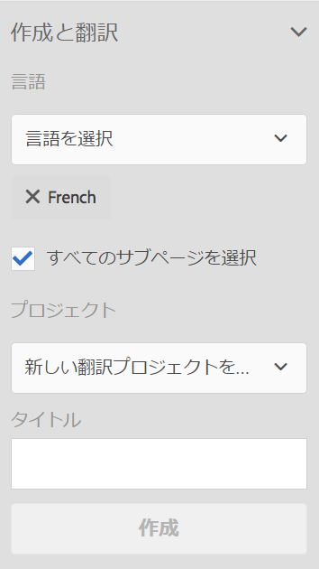

1. 「作成」をクリックまたはタップします。

### 既存の言語コピー用の翻訳プロジェクトの作成 {#create-translation-projects-for-an-existing-language-copy}

1. サイトコンソールを使用して、翻訳プロジェクトに追加するページを選択します。

   例えば、Geometrixx Demo Site の英語ページを翻訳するには、Geometrixx Demo Site／English を選択します。

1. ツールバーの「参照」をクリックまたはタップします。

   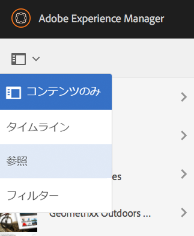

1. 言語コピーを選択して、ソースページを翻訳する言語コピーを選択します。
1. 「言語コピーを更新」をクリックまたはタップし、翻訳ジョブを設定します。

   * 選択したページとすべての子ページを翻訳するには、「すべてのサブページを選択」を選択します。選択したページのみを翻訳するには、このオプションの選択を解除します。
   * 「プロジェクト」で「新しい翻訳プロジェクトを作成」を選択します。
   * プロジェクトの名前を入力します。

   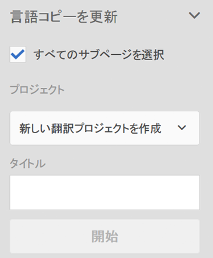

1. 「開始」をクリックまたはタップします。

## 翻訳プロジェクトへのページの追加 {#adding-pages-to-a-translation-project}

翻訳プロジェクトを作成したら、リソースウィンドウを使用してプロジェクトにページを追加します。ページの追加は、別のブランチのページを同じプロジェクトに含める場合に役立ちます。

翻訳プロジェクトにページを追加すると、そのページが新しい翻訳ジョブに含まれます。また、[既存のジョブにページを追加する](#adding-pages-assets-to-a-translation-job)こともできます。

新しいプロジェクトの作成時と同様に、ページを追加する際は、ページのコピーがローンチに追加されます（既存の言語コピーが上書きされないようにするために必要な場合）（[既存の言語コピー用の翻訳プロジェクトの作成](#performing-initial-translations-and-updating-existing-translations)を参照）。

1. サイトコンソールを使用して、翻訳プロジェクトに追加するページを選択します。

   例えば、Geometrixx Demo Site の英語ページを翻訳するには、Geometrixx Demo Site／English を選択します。

1. ツールバーの「参照」をクリックまたはタップします。

   

1. 言語コピーを選択して、ソースページを翻訳する言語コピーを選択します。

   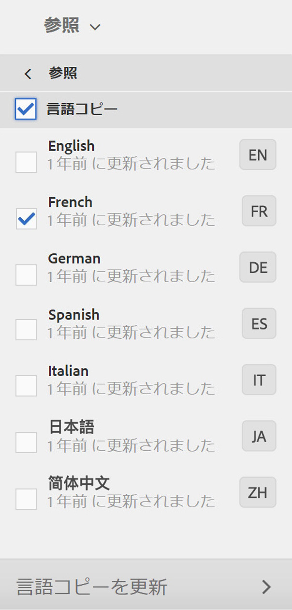

1. 「言語コピーを更新」をクリックまたはタップし、次のプロパティを設定します。

   * 選択したページとすべての子ページを翻訳するには、「すべてのサブページを選択」を選択します。選択したページのみを翻訳するには、このオプションの選択を解除します。
   * 「プロジェクト」で「既存の翻訳プロジェクトに追加」を選択します。
   * プロジェクトを選択します。

   >[!NOTE]
   >
   >翻訳プロジェクトに設定するターゲット言語は、参照パネルに表示される言語コピーのパスと一致している必要があります。

   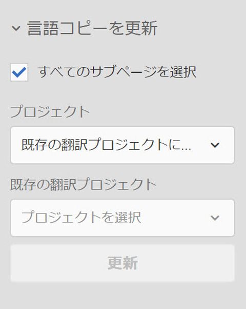

1. 「開始」をクリックまたはタップします。

## 翻訳ジョブへのページやアセットの追加 {#adding-pages-assets-to-a-translation-job}

翻訳プロジェクトの翻訳ジョブにページ、アセット、タグおよび I18N 辞書を追加できます。ページやアセットを追加するには：

1. 翻訳プロジェクトの「翻訳ジョブ」タイルの下部にある省略記号をクリックまたはタップします。

   

1. 「追加」、次に「ページ／アセット」をクリックまたはタップします。

   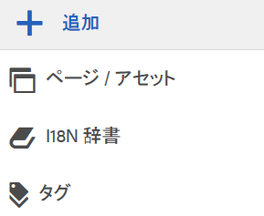

1. 追加するブランチの最上部の項目を選択し、チェックマークアイコンをクリックまたはタップします。複数選択できます。

   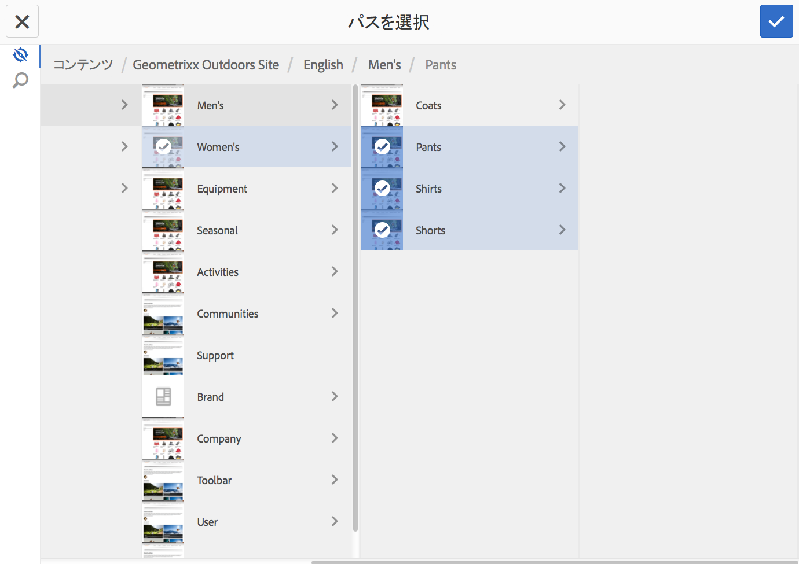

1. または、検索アイコンを選択して翻訳ジョブに追加するページやアセットを探すこともできます。

   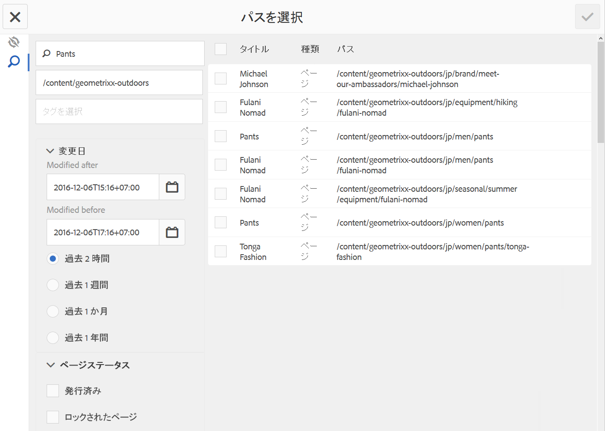

翻訳ジョブにページやアセットが追加されます。

## 翻訳ジョブへの I18N 辞書の追加 {#adding-i-n-dictionaries-to-a-translation-job}

翻訳プロジェクトの翻訳ジョブにページ、アセット、タグおよび I18N 辞書を追加できます。I18N 辞書を追加するには：

1. 翻訳プロジェクトの「翻訳ジョブ」タイルの下部にある省略記号をクリックまたはタップします。

   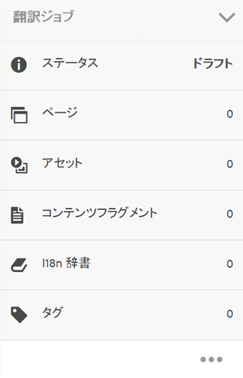

1. 「追加」、次に「I18N 辞書」をクリックまたはタップします。

   

1. 追加する辞書を選択し、追加ボタンをクリックまたはタップします。

   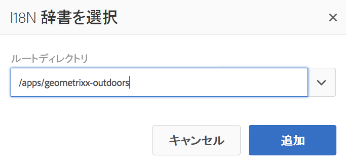

辞書が翻訳ジョブに追加されます。

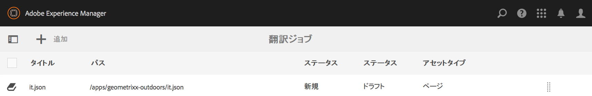

>[!NOTE]
>
>For more information about i18n dictionaries, read [Using Translator to Manage Dictionaries](/help/sites-developing/i18n-translator.md).

## 翻訳ジョブへのタグの追加 {#adding-tags-to-a-translation-job}

翻訳プロジェクトの翻訳ジョブにページ、アセット、タグおよび I18N 辞書を追加できます。タグを追加するには：

1. 翻訳プロジェクトの「翻訳ジョブ」タイルの下部にある省略記号をクリックまたはタップします。

   

1. 「追加」、次に「タグ」をクリックまたはタップします。

   

1. 追加するタグを選択し、チェックマークアイコンをクリックまたはタップします。複数選択できます。

   

タグが翻訳ジョブに追加されます。

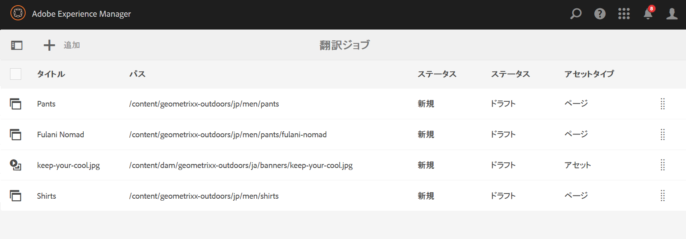

## 翻訳プロジェクトの詳細の確認 {#seeing-translation-project-details}

「翻訳の概要」タイルには、翻訳プロジェクト用に設定されるプロパティが表示されます。「翻訳」タブには、一般的な[プロジェクト情報](/help/sites-authoring/projects.md#project-info)に加えて、翻訳専用のプロパティが表示されます。

* ソース言語：翻訳対象となるページの言語です。
* ターゲット言語：ページの翻訳に使用する言語です。
* 翻訳方法：翻訳ワークフローです。人間による翻訳または機械翻訳がサポートされます。
* 翻訳プロバイダー：翻訳を実行する翻訳サービスプロバイダーです。
* コンテンツのカテゴリ：（機械翻訳）翻訳に使用するコンテンツのカテゴリです。
* クラウド設定：プロジェクトに使用する翻訳サービスコネクター用のクラウド設定です。

ページのリソースウィンドウを使用してプロジェクトが作成されると、上記のプロパティがソースページのプロパティに基づいて自動的に設定されます。

## 翻訳ジョブのステータスの監視 {#monitoring-the-status-of-a-translation-job}

翻訳プロジェクトの「翻訳ジョブ」タイルには、翻訳ジョブのステータスとジョブ内のページおよびアセットの数が表示されます。

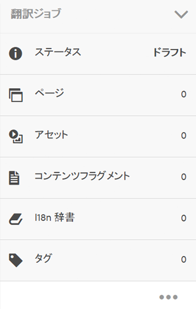

次の表は、ジョブまたはジョブ内の項目の各ステータスを示しています。

| ステータス | 説明 |
|---|---|
| ドラフト | 翻訳ジョブが開始されていません。作成時の翻訳ジョブのステータスは「ドラフト」になります。 |
| 送信済み | 翻訳ジョブ内のファイルが翻訳サービスに正常に送信されると、このステータスになります。このステータスは、Request Scopeコマンドまたは開始コマンドが発行された後に発生する場合があります。 |
| スコーピングリクエスト | 人間翻訳ワークフローで、ジョブ内のファイルがスコーピング用に翻訳ベンダーに送信されました。このステータスは、「リクエスト範囲」コマンドの実行後に表示されます。 |
| スコーピング完了 | ベンダーによる翻訳ジョブのスコーピングが完了しました。 |
| 翻訳をコミット | プロジェクトの所有者がスコーピングを受け入れました。このステータスは、翻訳ベンダーがジョブ内のファイルの翻訳を開始する必要があることを示します。 |
| 翻訳中 | （ジョブの場合）ジョブ内の 1 つ以上のファイルの翻訳がまだ完了していません。（ジョブ内の項目の場合）項目の翻訳中です。 |
| 翻訳済み | （ジョブの場合）ジョブ内のすべてのファイルの翻訳が完了しました。（ジョブ内の項目の場合）項目が翻訳されました。 |
| レビューへの準備完了 | ジョブ内の項目が翻訳され、ファイルが AEM に読み込まれました。 |
| 完了 | 翻訳の契約が完了したことがプロジェクトの所有者によって示されました。 |
| キャンセル | 翻訳ベンダーが翻訳ジョブの作業を停止する必要があることを示します。 |
| 更新エラー | AEM と翻訳サービス間でのファイルの転送中にエラーが発生しました。 |
| 不明な状態 | 不明なエラーが発生しました。 |

ジョブ内の各ファイルのステータスを確認するには、タイルの下部にある省略記号をクリックまたはタップします。

## 翻訳ジョブの期限の設定 {#setting-the-due-date-of-translation-jobs}

翻訳ベンダーが翻訳済みのファイルを戻す必要のある期限を指定します。プロジェクトの期限または特定のジョブの期限を設定できます。

* **プロジェクト：**&#x200B;プロジェクト内の翻訳ジョブが期限を継承します。
* **ジョブ：**&#x200B;ジョブに設定した期限によって、プロジェクトに設定した期限が上書きされます。

期限の設定を正しく使用できるのは、使用する翻訳ベンダーがこの機能をサポートしている場合のみです。

次の手順では、プロジェクトの期限を設定します。

1. 「翻訳の概要」タイルの下部にある省略記号をクリックまたはタップします。

   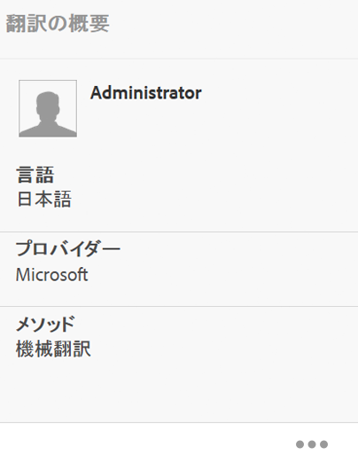

1. 「基本」タブで、「期限」プロパティの日付選択を使用して期限を選択します。

   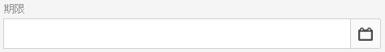

1. 「完了」をクリックまたはタップします。

次の手順では、翻訳ジョブの期限を設定します。

1. 「翻訳ジョブ」タイルで、コマンドメニューをクリックまたはタップして、「期限」をクリックまたはタップします。

   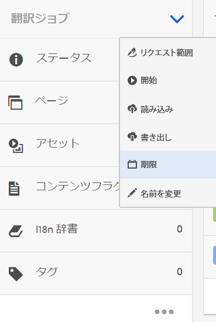

1. ダイアログボックスで、カレンダーアイコンをクリックまたはタップして、期限として使用する日時を選択します。「保存」をクリックします。

   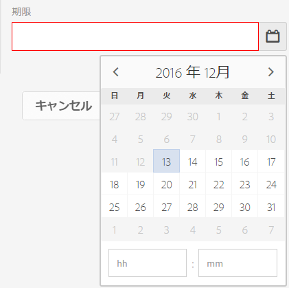

## 翻訳ジョブのスコーピング {#scoping-a-translation-job}

翻訳ジョブをスコーピングして、翻訳サービスプロバイダーから翻訳コストの見積もりを取得します。ジョブをスコーピングする場合は、ソースファイルが翻訳ベンダーに送信されます。翻訳ベンダーは、保存している翻訳のプール（翻訳メモリ）とテキストとを比較します。通常、スコープとは翻訳が必要な単語数です。

スコーピング結果の詳細を取得するには、翻訳ベンダーにお問い合わせください。

>[!NOTE]
>
>スコーピングはオプションです。スコーピングをおこなわずに翻訳ジョブを開始できます。

翻訳ジョブをスコープする場合、ジョブのステータスは `Scope Requested`です。翻訳ベンダーがスコープを返すと、ステータスがに変更され `Scope Completed`ます。 スコーピングが完了したら、「範囲を表示」コマンドを使用してスコーピング結果を確認できます。

スコーピングを正しく使用できるのは、使用する翻訳ベンダーがこの機能をサポートしている場合のみです。

1. プロジェクトコンソールで、翻訳プロジェクトを開きます。
1. 「翻訳ジョブ」タイルで、コマンドメニューをクリックまたはタップして、「リクエスト範囲」をクリックまたはタップします。

   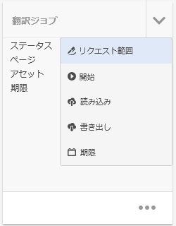

1. ジョブのステータスが「スコーピング完了」に変わったら、「翻訳ジョブ」タイルでコマンドメニューをクリックまたはタップして、「範囲を表示」をクリックまたはタップします。

## 翻訳ジョブの開始 {#starting-a-translation-job}

翻訳ジョブを開始して、ソースページをターゲット言語に翻訳します。翻訳は「翻訳の概要」タイルのプロパティ値に従って実行されます。

翻訳ジョブの開始後、「翻訳ジョブ」タイルに表示されるステータスは「翻訳中」になります。

1. プロジェクトコンソールで、翻訳プロジェクトを開きます。
1. 「翻訳ジョブ」タイルで、コマンドメニューをクリックまたはタップして、「開始」をクリックまたはタップします。

   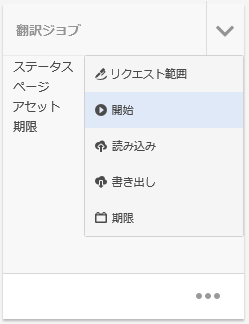

1. 翻訳の開始を確定するアクションダイアログで、「閉じる」をクリックまたはタップします。

## 翻訳ジョブのキャンセル {#canceling-a-translation-job}

翻訳ジョブをキャンセルして、翻訳プロセスを中断し、翻訳ベンダーが以降の翻訳を実行しないようにします。ジョブのステータスが `Committed For Translation` またはの場合は、ジョブをキャンセルでき `Translation In Progress` ます。

1. プロジェクトコンソールで、翻訳プロジェクトを開きます。
1. 「翻訳ジョブ」タイルで、コマンドメニューをクリックまたはタップして、「キャンセル」をクリックまたはタップします。
1. 翻訳のキャンセルを確定するアクションダイアログで、「OK」をクリックまたはタップします。

## ワークフローの承認／拒否 {#accept-reject-workflow}

コンテンツが翻訳から戻り、レビューへの準備完了ステータスになったら、翻訳ジョブに移動してコンテンツを承認または拒否できます。

「翻訳を拒否」を選択した場合はコメントを追加できます。

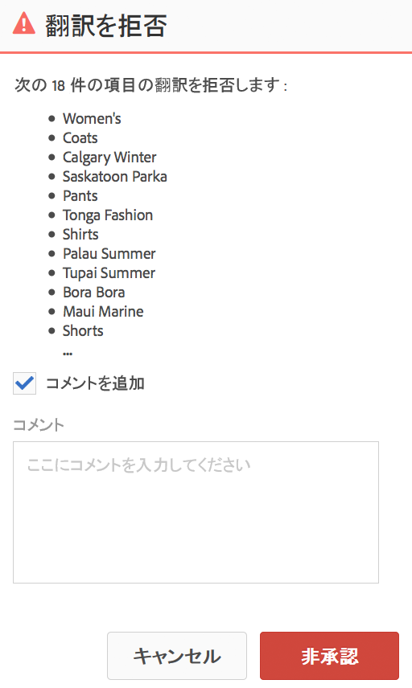

コンテンツを拒否すると、コンテンツは翻訳ベンダーに戻され、翻訳ベンダーではコメントを参照できます。

## Reviewing and Promoting Updated Content {#reviewing-and-promoting-updated-content}

既存の言語コピーのコンテンツの翻訳が完了したら、翻訳をレビューし、必要に応じて変更をおこなってから、翻訳を昇格して言語コピーに移動します。翻訳ジョブのステータスが「レビューへの準備完了」と表示されたら、翻訳済みのファイルをレビューできます。

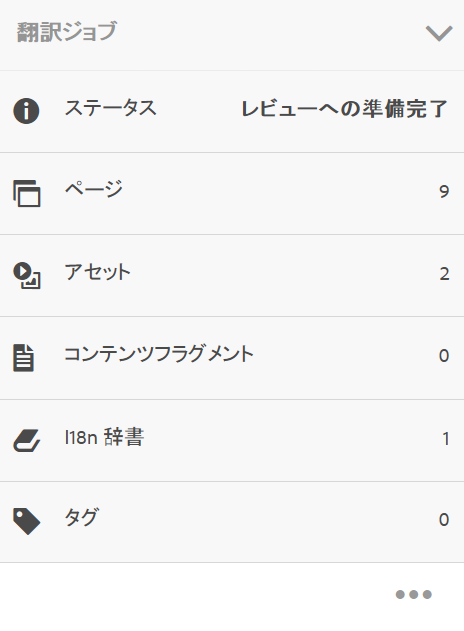

1. 言語マスター内のページを選択し、「参照」をクリックまたはタップして、「言語コピー」をクリックまたはタップします。
1. レビューする言語コピーをクリックまたはタップします。

   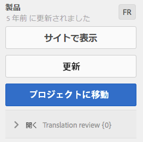

1. 「開く」をクリックまたはタップして、ローンチ関連のコマンドを表示します。

   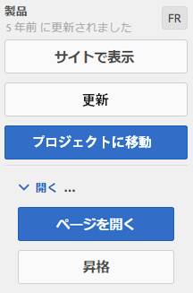

1. ページのローンチコピーを開いてコンテンツをレビューおよび編集するには、「ページを開く」をクリックします。
1. コンテンツをレビューして必要な変更をおこなったら、「昇格」をクリックしてローンチコピーを昇格します。
1. ローンチを昇格ページで、昇格するページを指定し、「昇格」をクリックまたはタップします。

## 言語コピーの比較 {#comparing-language-copies}

言語コピーを言語マスターと比較するには：

1. **サイト**&#x200B;コンソールで、比較する言語コピーに移動します。
1. **[参照](/help/sites-authoring/basic-handling.md#references)**&#x200B;パネルを開きます。
1. Under the **Copies** heading select **Language Copies.**
1. 特定の言語コピーを選択し、「**マスターと比較**」または「**前の言語と比較**」（該当する場合）をクリックします。

   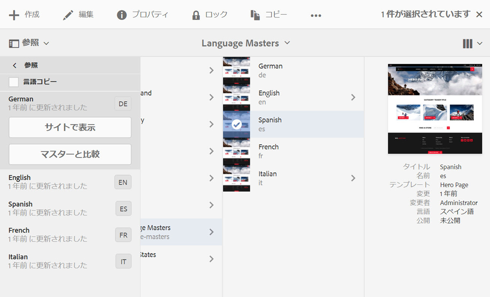

1. 2 つのページ（ローンチページとソースページ）が左右に並んで開きます。

   この機能の使用方法について詳しくは、[ページ差分](/help/sites-authoring/page-diff.md)を参照してください。

## 翻訳ジョブの完了とアーカイブ {#completing-and-archiving-translation-jobs}

ベンダーが翻訳したファイルのレビューが完了したら、翻訳ジョブを完了します。人間翻訳ワークフローの場合、翻訳の完了は、翻訳の契約が履行されたこと、およびベンダーが翻訳メモリに翻訳を保存する必要があることをベンダーに対して示します。

完了したジョブのステータスは「完了」になります。

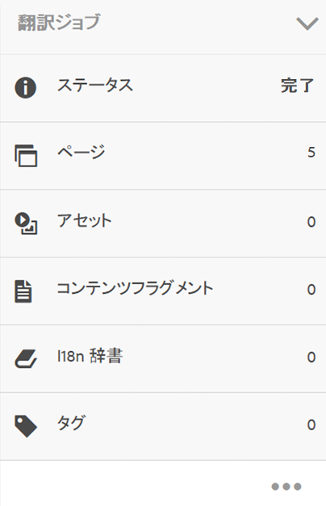

翻訳ジョブが完了し、ジョブのステータスの詳細を確認する必要がなくなった場合は、ジョブをアーカイブします。ジョブをアーカイブすると、「翻訳ジョブ」タイルがプロジェクトから削除されます。

## 言語コピーの構造の作成 {#creating-the-structure-of-a-language-copy}

言語コピーの構造を作成して、翻訳対象のマスター言語からのコンテンツが言語コピーに含まれるようにします。Before you populate your language copy, you must have [created the language root](/help/sites-administering/tc-prep.md#creating-a-language-root) of the language copy.

1. サイトコンソールを使用して、ソースとして使用するマスター言語の言語ルートを選択します。例えば、Geometrixx Demo Site の英語ページを翻訳するには、コンテンツ／Geometrixx Demo Site／English を選択します。
1. ツールバーの「参照」をクリックまたはタップします。

   

1. 言語コピーを選択して、構造を作成する言語コピーを選択します。

   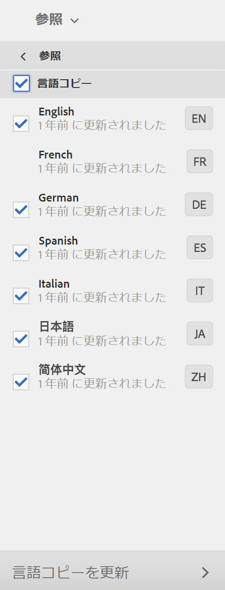

1. 「言語コピーを更新」をクリックまたはタップして翻訳ツールを表示し、以下のプロパティを設定します。

   * 「すべてのサブページを選択」オプションを選択します。
   * 「プロジェクト」で、「構造のみを作成」を選択します。

   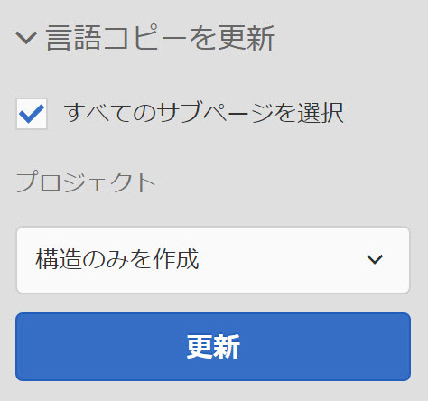

1. 「開始」をクリックまたはタップします。

## プロジェクトコンソールを使用した翻訳プロジェクトの作成 {#creating-a-translation-project-using-the-projects-console}

プロジェクトコンソールを使用する場合は、翻訳プロジェクトを手動で作成できます。

翻訳プロジェクトを手動で作成する場合は、[基本のプロパティ](/help/sites-authoring/touch-ui-managing-projects.md#creating-a-project)に加えて、翻訳に関連する以下のプロパティに値を指定する必要があります。

* **名前：**&#x200B;プロジェクト名です。
* **ソース言語：**&#x200B;ソースコンテンツの言語です。
* **ターゲット言語：**&#x200B;コンテンツの翻訳に使用する言語です。
* **翻訳方法：**「人間による翻訳」を選択すると、翻訳が手動で実行されます。

1. プロジェクトコンソールのツールバーで、「作成」をクリックまたはタップします。
1. 翻訳プロジェクトのテンプレートを選択して、「次へ」をクリックまたはタップします。
1. 基本のプロパティの値を入力します。
1. 「詳細」をクリックまたはタップして、翻訳に関連するプロパティの値を指定します。
1. 「作成」をクリックまたはタップします。確認のボックスで、「完了」をクリックまたはタップしてプロジェクトコンソールに戻ります。または「プロジェクトを開く」をクリックまたはタップしてプロジェクトを開き、管理を開始します。

## 翻訳ジョブの書き出し {#exporting-a-translation-job}

翻訳ジョブのコンテンツをダウンロードできます。この機能は、AEM と統合されていない翻訳プロバイダーにコネクターを使用して送信する場合や、コンテンツをレビューする場合などに使用します。

1. 「翻訳ジョブ」タイルのドロップダウンメニューから、「書き出し」をクリックまたはタップします。
1. 書き出しダイアログボックスで、「書き出されたファイルをダウンロード」をクリックまたはタップします。必要に応じて、Web ブラウザーのダイアログボックスを使用してファイルを保存します。
1. 書き出しダイアログボックスで、「閉じる」をクリックまたはタップします。

## 翻訳ジョブの読み込み {#importing-a-translation-job}

翻訳コンテンツを AEM に読み込むことができます。この機能は、AEM と統合されていない翻訳プロバイダーがコネクターを使用してコンテンツを送信する場合などに使用します。

1. 「翻訳ジョブ」タイルのドロップダウンメニューから、「読み込み」をクリックまたはタップします。
1. Web ブラウザーのダイアログボックスを使用して、読み込むファイルを選択します。
1. 読み込みダイアログボックスで、「閉じる」をクリックまたはタップします。

