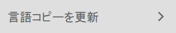
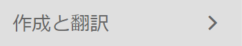
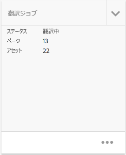

# 翻訳プロジェクトの管理 {#managing-translation-projects}

翻訳するコンテンツを準備したら、見つからない言語コピーを作成して言語構造を完了し、翻訳プロジェクトを作成する必要があります。

翻訳プロジェクトを使用すると、AEM コンテンツの翻訳を管理できます。翻訳プロジェクトは AEM [プロジェクト](/help/sites-authoring/projects.md)の一種であり、他の言語に翻訳するリソースがその中に格納されます。これらのリソースは、言語マスターから作成される[言語コピー](/help/sites-administering/tc-prep.md)のページとアセットです。

翻訳プロジェクトにリソースを追加すると、リソースに対して翻訳ジョブが作成されます。 ジョブには、リソースで実行される人間による翻訳と機械翻訳のワークフローの管理に使用するコマンドとステータス情報が含まれています。

>[!NOTE]
>
>翻訳プロジェクトには、複数の翻訳ジョブを含めることができます。

翻訳プロジェクトは、グローバル化のための組織ガバナンスに合わせて言語および翻訳方法/プロバイダーによって定義された、長時間実行される項目です。 これらは、初回の翻訳時または手動で 1 回だけ開始し、コンテンツおよび翻訳の更新アクティビティ全体で有効なままにする必要があります。

翻訳プロジェクトとジョブは、翻訳準備ワークフローを使用して作成されます。 これらのワークフローには、初期翻訳（作成と翻訳）と更新（翻訳を更新）の両方について、次の 3 つのオプションがあります。

1. [新規プロジェクトの作成](#creating-translation-projects-using-the-references-panel)
1. [既存のプロジェクトへの追加](#adding-pages-to-a-translation-project)
1. [コンテンツ構造のみ](#creating-the-structure-of-a-language-copy)

>[!NOTE]
>
>オプション 3 は、翻訳ジョブ/プロジェクトとは無関係です。 言語マスターのコンテンツおよび構造的な変更を（未翻訳の）言語コピーにコピーできます。 翻訳がない場合でも、このオプションを使用して言語マスターの同期を維持できます。

## 初期翻訳の実行と既存の翻訳の更新 {#performing-initial-translations-and-updating-existing-translations}

AEMは、コンテンツの初期翻訳用に翻訳プロジェクトが作成されているか、翻訳済みの言語コピーを更新するかを検出します。 ページの翻訳プロジェクトを作成し、翻訳する言語コピーを指定すると、AEMは、ターゲットの言語コピーにソースページが既に存在するかどうかを検出します。

* **ページが言語コピーに含まれていない場合：** AEM はこの状況を初期翻訳として処理します。ページが直ちに言語コピーにコピーされ、プロジェクトに含まれます。 翻訳済みのページがAEMに読み込まれると、AEMは翻訳済みのページを言語コピーに直接コピーします。
* **ページが言語コピーに既に含まれている場合：** AEM はこの状況を翻訳の更新として処理します。ローンチが作成され、ページのコピーがローンチとプロジェクトに追加されます。ローンチを使用すると、更新された翻訳をレビューしてから言語コピーに対してコミットできます。

   * 翻訳されたページが AEM に読み込まれると、ローンチ内のページがそのページによって上書きされます。
   * ローンチが昇格された場合にのみ、言語コピーが翻訳されたページによって上書きされます。

例えば、/content/geometrixx/en マスター言語のフランス語翻訳用に、/content/geometrixx/fr 言語ルートが作成されます。 フランス語の言語コピーにその他のページはありません。

* フランス語の言語コピーをターゲットとした、/content/geometrixx/en/products ページおよびすべての子ページ用の翻訳プロジェクトが作成されます。言語コピーには /content/geometrixx/fr/products ページが含まれていないので、AEM はすぐに /content/geometrixx/en/products ページとすべての子ページをフランス語の言語コピーにコピーします。これらのコピーは翻訳プロジェクトにも追加されます。
* フランス語の言語コピーをターゲットとした、/content/geometrixx/en ページおよびすべての子ページ用の翻訳プロジェクトが作成されます。言語コピーには /content/geometrixx/en ページ（言語ルート）に対応するページが含まれているので、AEM は /content/geometrixx/en ページとすべての子ページをコピーしてローンチに追加します。これらのコピーは翻訳プロジェクトにも追加されます。

## 参照パネルを使用した翻訳プロジェクトの作成 {#creating-translation-projects-using-the-references-panel}

翻訳プロジェクトを作成して、言語マスターのリソースを翻訳するワークフローを実行および管理できるようにします。 プロジェクトを作成する場合は、翻訳する言語マスターのページと、翻訳を実行する言語コピーを指定します。

* 選択したページに関連付けられている翻訳統合フレームワークのクラウド設定によって、使用する翻訳ワークフローなど、翻訳プロジェクトの多くのプロパティが決まります。
* 選択した言語コピーごとにプロジェクトが作成されます。
* 選択したページと関連アセットのコピーが作成され、各プロジェクトに追加されます。 これらのコピーは、翻訳のために後で翻訳プロバイダーに送信されます。

選択したページの子ページも選択するように指定できます。 この場合、子ページのコピーも各プロジェクトに追加され、翻訳されます。いずれかの子ページが別の翻訳統合フレームワーク設定に関連付けられている場合、AEM は追加のプロジェクトを作成します。

[翻訳プロジェクトを手動で作成する](#creating-a-translation-project-using-the-projects-console)こともできます。

>[!NOTE]
>
>プロジェクトを作成するには、アカウントが `project-administrators` グループのメンバーである必要があります。

**初期翻訳と翻訳の更新**

参照パネルには、既存の言語コピーを更新するか、言語コピーの最初のバージョンを作成するかが示されます。 選択したページに言語コピーが存在する場合は、「言語コピーを更新」タブが表示され、プロジェクト関連のコマンドにアクセスできます。

翻訳後、次の操作を実行できます。 [翻訳をレビュー](#reviewing-and-promoting-updated-content) 言語コピーを上書きする前に、次の手順を実行します。 選択したページに言語コピーが存在しない場合は、「作成と翻訳」タブが表示され、プロジェクト関連のコマンドにアクセスできます。

### 新しい言語コピー用の翻訳プロジェクトの作成 {#create-translation-projects-for-a-new-language-copy}

1. サイトコンソールを使用して、翻訳プロジェクトに追加するページを選択します。

   例えば、Geometrixxデモサイトの英語ページを翻訳するには、Geometrixxデモサイト/英語を選択します。

1. ツールバーの「参照」をクリックまたはタップします。

   

1. 言語コピーを選択して、ソースページを翻訳する言語コピーを選択します。
1. 「作成と翻訳」をクリックまたはタップして、翻訳ジョブを設定します。

   * 言語ドロップダウンを使用して、翻訳対象の言語コピーを選択します。必要に応じて、追加の言語を選択します。リストに表示される言語は、[作成済みの言語ルート](/help/sites-administering/tc-prep.md#creating-a-language-root)に対応します。
   * 選択したページとすべての子ページを翻訳するには、「すべてのサブページを選択」を選択します。選択したページのみを翻訳するには、このオプションの選択を解除してください。
   * 「プロジェクト」で、「新しい翻訳プロジェクトを作成」を選択します。
   * プロジェクトの名前を入力します。

   

1. 「作成」をクリックまたはタップします。

### 既存の言語コピー用の翻訳プロジェクトの作成 {#create-translation-projects-for-an-existing-language-copy}

1. サイトコンソールを使用して、翻訳プロジェクトに追加するページを選択します。

   例えば、Geometrixxデモサイトの英語ページを翻訳するには、Geometrixxデモサイト/英語を選択します。

1. ツールバーの「参照」をクリックまたはタップします。

   

1. 言語コピーを選択して、ソースページを翻訳する言語コピーを選択します。
1. 「言語コピーを更新」をクリックまたはタップして、翻訳ジョブを設定します。

   * 選択したページとすべての子ページを翻訳するには、「すべてのサブページを選択」を選択します。選択したページのみを翻訳するには、このオプションの選択を解除してください。
   * 「プロジェクト」で、「新しい翻訳プロジェクトを作成」を選択します。
   * プロジェクトの名前を入力します。

   

1. 「開始」をクリックまたはタップします。

## 翻訳プロジェクトへのページの追加 {#adding-pages-to-a-translation-project}

翻訳プロジェクトを作成したら、リソースウィンドウを使用して、プロジェクトにページを追加できます。 ページの追加は、別のブランチのページを同じプロジェクトに含める場合に役立ちます。

翻訳プロジェクトにページを追加すると、そのページは新しい翻訳ジョブに含まれます。 また、 [既存のジョブにページを追加](#adding-pages-assets-to-a-translation-job).

新しいプロジェクトを作成する場合と同様に、ページを追加する際に、既存の言語コピーが上書きされないように、必要に応じてページのコピーがローンチに追加されます。 ( [既存の言語コピー用の翻訳プロジェクトの作成](#performing-initial-translations-and-updating-existing-translations).)

1. サイトコンソールを使用して、翻訳プロジェクトに追加するページを選択します。

   例えば、Geometrixxデモサイトの英語ページを翻訳するには、Geometrixxデモサイト/英語を選択します。

1. ツールバーの「参照」をクリックまたはタップします。

   

1. 言語コピーを選択して、ソースページを翻訳する言語コピーを選択します。

   

1. 「言語コピーを更新」をクリックまたはタップして、以下のプロパティを設定します。

   * 選択したページとすべての子ページを翻訳するには、「すべてのサブページを選択」を選択します。選択したページのみを翻訳するには、このオプションの選択を解除してください。
   * 「プロジェクト」で、「既存の翻訳プロジェクトに追加」を選択します。
   * プロジェクトを選択します。

   >[!NOTE]
   >
   >翻訳プロジェクトに設定されたターゲット言語は、参照パネルに表示される言語コピーのパスと一致する必要があります。

   

1. 「開始」をクリックまたはタップします。

## 翻訳ジョブへのページ/アセットの追加 {#adding-pages-assets-to-a-translation-job}

翻訳プロジェクトの翻訳ジョブにページ、アセット、タグまたは i18n 辞書を追加できます。 ページやアセットを追加するには：

1. 翻訳プロジェクトの「翻訳ジョブ」タイルの下部にある省略記号をクリックまたはタップします。

   

1. 「追加」、次に「ページ／アセット」をクリックまたはタップします。

   

1. 追加するブランチの最上位の項目を選択し、チェックマークアイコンをクリックまたはタップします。 複数選択できます。

   

1. または、検索アイコンを選択して、翻訳ジョブに追加するページまたはアセットを簡単に検索することもできます。 

   

ページやアセットが翻訳ジョブに追加されます。

## 翻訳ジョブへの i18n 辞書の追加 {#adding-i-n-dictionaries-to-a-translation-job}

翻訳プロジェクトの翻訳ジョブにページ、アセット、タグまたは i18n 辞書を追加できます。 i18n 辞書を追加するには：

1. 翻訳プロジェクトの「翻訳ジョブ」タイルの下部にある省略記号をクリックまたはタップします。

   

1. 「追加」、次に「I18N 辞書」をクリックまたはタップします。

   

1. 追加する辞書を選択し、「追加」ボタンをクリックまたはタップします。

   

辞書が翻訳ジョブに追加されました。

>[!NOTE]
>
>I18N 辞書について詳しくは、[トランスレーターを使用した辞書の管理](/help/sites-developing/i18n-translator.md)を参照してください。

## 翻訳ジョブへのタグの追加 {#adding-tags-to-a-translation-job}

翻訳プロジェクトの翻訳ジョブにページ、アセット、タグまたは i18n 辞書を追加できます。 タグを追加するには：

1. 翻訳プロジェクトの「翻訳ジョブ」タイルの下部にある省略記号をクリックまたはタップします。

   

1. 「追加」、次に「タグ」をクリックまたはタップします。

   

1. 追加するタグを選択し、チェックマークアイコンをクリックまたはタップします。 複数選択できます。

   

タグが翻訳ジョブに追加されました。

## 翻訳プロジェクトの詳細の確認 {#seeing-translation-project-details}

「翻訳の概要」タイルには、翻訳プロジェクト用に設定されたプロパティが表示されます。 汎用に加えて [プロジェクト情報](/help/sites-authoring/projects.md#project-info)「翻訳」タブには、翻訳固有のプロパティが含まれます。

* ソース言語：翻訳するページの言語。
* ターゲット言語：ページの翻訳先の言語。
* 翻訳方法：翻訳ワークフロー。 人間による翻訳または機械翻訳がサポートされています。
* 翻訳プロバイダー：翻訳を実行している翻訳サービスプロバイダーです。
* コンテンツカテゴリ：（機械翻訳）翻訳に使用されるコンテンツカテゴリです。
* クラウド設定：プロジェクトに使用される翻訳サービスコネクタのクラウド設定です。

ページのリソースウィンドウを使用してプロジェクトを作成すると、これらのプロパティは、ソースページのプロパティに基づいて自動的に設定されます。

## 翻訳ジョブのステータスのモニタリング {#monitoring-the-status-of-a-translation-job}

翻訳プロジェクトの「翻訳ジョブ」タイルには、翻訳ジョブのステータスと、ジョブ内のページ数およびアセット数が表示されます。

次の表に、ジョブまたはジョブ内の項目に設定できる各ステータスを示します。

| ステータス | 説明 |
|---|---|
| ドラフト | 翻訳ジョブが開始されていません。翻訳ジョブは、作成時に「ドラフト」ステータスになります。 |
| 送信済み | 翻訳ジョブ内のファイルが翻訳サービスに正常に送信されると、このステータスになります。「リクエスト範囲」コマンドまたは「開始」コマンドの発行後に、このステータスになることができます。 |
| スコーピングリクエスト | 人間翻訳ワークフローで、ジョブ内のファイルがスコーピング用に翻訳ベンダーに送信されました。このステータスは、「リクエスト範囲」コマンドの実行後に表示されます。 |
| スコーピング完了 | ベンダーによる翻訳ジョブのスコーピングが完了しました。 |
| 翻訳をコミット | プロジェクト所有者が範囲を受け入れました。 このステータスは、翻訳ベンダーがジョブ内のファイルの翻訳を開始する必要があることを示します。 |
| 翻訳中 | ジョブの場合、ジョブ内の 1 つ以上のファイルの翻訳はまだ完了していません。 ジョブ内の項目の場合、その項目は翻訳中です。 |
| 翻訳済み | ジョブの場合、ジョブ内のすべてのファイルの翻訳が完了します。 ジョブ内の項目の場合、その項目は翻訳されます。 |
| レビューへの準備完了 | ジョブ内の項目が翻訳され、ファイルが AEM に読み込まれました。 |
| 完了 | 翻訳の契約が完了したことがプロジェクトの所有者によって示されました。 |
| キャンセル | 翻訳ベンダーが翻訳ジョブの作業を停止する必要があることを示しています。 |
| 更新エラー | AEM と翻訳サービス間でのファイルの転送中にエラーが発生しました。 |
| 不明な状態 | 不明なエラーが発生しました。 |

ジョブ内の各ファイルのステータスを確認するには、タイルの下部にある省略記号をクリックまたはタップします。

## 翻訳ジョブの期限の設定 {#setting-the-due-date-of-translation-jobs}

翻訳ベンダーが翻訳済みのファイルを戻す必要のある期限を指定します。プロジェクトまたは特定のジョブの期限を設定できます。

* **プロジェクト：** プロジェクト内の翻訳ジョブは期限を継承します。
* **ジョブ：** ジョブに設定した期限が、プロジェクトに設定されている期限よりも優先されます。

期限の設定を正しく使用できるのは、使用する翻訳ベンダーがこの機能をサポートしている場合のみです。

次の手順では、プロジェクトの期限を設定します。

1. 「翻訳の概要」タイルの一番下にある省略記号をクリックまたはタップします。

   

1. 「基本」タブで、「期限」プロパティの日付選択を使用して期限を選択します。

   

1. 「完了」をクリックまたはタップします。

次の手順では、翻訳ジョブの期限を設定します。

1. 「翻訳ジョブ」タイルで、コマンドメニューをクリックまたはタップし、「期限」をクリックまたはタップします。

   

1. ダイアログボックスで、カレンダーアイコンをクリックまたはタップして、期限として使用する日時を選択します。「保存」をクリックします。

   

## 翻訳ジョブのスコーピング {#scoping-a-translation-job}

翻訳ジョブをスコーピングして、翻訳サービスプロバイダーから翻訳コストの見積もりを取得します。 ジョブをスコーピングすると、ソースファイルが翻訳ベンダーに送信され、翻訳ベンダーは、テキストを保存された翻訳のプール（翻訳メモリ）と比較します。 通常、範囲は翻訳が必要な単語の数です。

スコーピング結果の詳細については、翻訳ベンダーにお問い合わせください。

>[!NOTE]
>
>スコーピングはオプションです。 スコーピングを行わずに翻訳ジョブを開始できます。

翻訳ジョブをスコーピングすると、ジョブのステータスは `Scope Requested` になります。翻訳ベンダーがスコープを返すと、ステータスは `Scope Completed` になります。スコーピングが完了したら、「範囲を表示」コマンドを使用してスコーピング結果を確認できます。

スコーピングを正しく使用できるのは、使用する翻訳ベンダーがこの機能をサポートしている場合のみです。

1. プロジェクトコンソールで、翻訳プロジェクトを開きます。
1. 「翻訳ジョブ」タイルで、コマンドメニューをクリックまたはタップし、「リクエスト範囲」をクリックまたはタップします。

   

1. ジョブのステータスが「SCOPE_COMPLETED」に変わったら、「翻訳ジョブ」タイルでコマンドメニューをクリックまたはタップし、「範囲を表示」をクリックまたはタップします。

## 翻訳ジョブの開始 {#starting-a-translation-job}

翻訳ジョブを開始して、ソースページをターゲット言語に翻訳します。翻訳は「翻訳の概要」タイルのプロパティ値に従って実行されます。

翻訳ジョブの開始後、「翻訳ジョブ」タイルに表示されるステータスは「翻訳中」になります。

1. プロジェクトコンソールで、翻訳プロジェクトを開きます。
1. 「翻訳ジョブ」タイルで、コマンドメニューをクリックまたはタップし、「開始」をクリックまたはタップします。

   

1. 翻訳の開始を確認するアクションダイアログで、「閉じる」をクリックまたはタップします。

## 翻訳ジョブのキャンセル {#canceling-a-translation-job}

翻訳ジョブをキャンセルして、翻訳プロセスを停止し、翻訳ベンダーがそれ以上の翻訳を実行しないようにします。 ジョブが `Committed For Translation` または `Translation In Progress` ステータスの場合はジョブをキャンセルできます。

1. プロジェクトコンソールで、翻訳プロジェクトを開きます。
1. 「翻訳ジョブ」タイルで、コマンドメニューをクリックまたはタップし、「キャンセル」をクリックまたはタップします。
1. 翻訳のキャンセルを確認するアクションダイアログで、「OK」をクリックまたはタップします。

## ワークフローを承認/拒否 {#accept-reject-workflow}

コンテンツが翻訳から戻り、「レビューへの準備完了」ステータスになったら、翻訳ジョブに移動してコンテンツを承認または却下できます。

「翻訳を却下」を選択した場合は、オプションでコメントを追加できます。

コンテンツを拒否すると、そのコンテンツが翻訳ベンダーに返され、翻訳ベンダーがコメントを表示できるようになります。

## 更新されたコンテンツのレビューと昇格 {#reviewing-and-promoting-updated-content}

既存の言語コピーのコンテンツの翻訳が完了したら、翻訳をレビューし、必要に応じて変更を行ってから、翻訳を昇格して言語コピーに移動してください。翻訳ジョブのステータスがレビューへの準備完了と表示されたら、翻訳済みのファイルをレビューできます。

1. 言語マスター内のページを選択し、「参照」をクリックまたはタップしたあと、「言語コピー」をクリックまたはタップします。
1. レビューする言語コピーをクリックまたはタップします。

   

1. 「ローンチ」をクリックまたはタップして、ローンチ関連のコマンドを表示します。

   

1. ページのローンチコピーを開いてコンテンツをレビューおよび編集するには、「ページを開く」をクリックします。
1. コンテンツをレビューして必要な変更を行ったら、「昇格」をクリックしてローンチコピーを昇格します。
1. ローンチを昇格ページで、昇格するページを指定してから、「昇格」をクリックまたはタップしてください。

## 言語コピーの比較 {#comparing-language-copies}

言語コピーを言語コピーと比較するには、次の手順に従います。マスター

1. 内 **サイト** コンソールで、比較する言語コピーに移動します。
1. を開きます。 **[参照](/help/sites-authoring/basic-handling.md#references)** パネル。
1. **コピー**&#x200B;見出しの下で、**言語コピー**&#x200B;を選択します。
1. 特定の言語コピーを選択し、「マスターと比較」または「前と比較」（該当する場合）をクリックできます。

   

1. 2 つのページ（ローンチとソース）が並べて開きます。

   この機能の使用方法について詳しくは、[ページの差分](/help/sites-authoring/page-diff.md)を参照してください。

## 翻訳ジョブの完了とアーカイブ {#completing-and-archiving-translation-jobs}

ベンダーが翻訳したファイルのレビューが完了したら、翻訳ジョブを完了します。人間翻訳ワークフローの場合、翻訳を完了すると、翻訳契約が履行されたこと、および翻訳を翻訳メモリに保存する必要があることをベンダーに通知します。

ジョブが完了すると、そのジョブのステータスは「完了」になります。

翻訳ジョブが完了し、ジョブのステータスの詳細を確認する必要がなくなった場合は、ジョブをアーカイブします。ジョブをアーカイブすると、「翻訳ジョブ」タイルがプロジェクトから削除されます。

## 言語コピーの構造の作成 {#creating-the-structure-of-a-language-copy}

言語コピーの構造を作成して、翻訳対象のマスター言語からのコンテンツが言語コピーに含まれるようにします。言語コピーの構造を作成する前に、言語コピーの[言語ルートを作成](/help/sites-administering/tc-prep.md#creating-a-language-root)しておく必要があります。

1. サイトコンソールを使用して、ソースとして使用するマスター言語の言語ルートを選択します。 例えば、Geometrixxデモサイトの英語ページを翻訳するには、コンテンツ/Geometrixxデモサイト/英語を選択します。
1. ツールバーの「参照」をクリックまたはタップします。

   

1. 言語コピーを選択してから、構造を作成する言語コピーを選択してください。

   

1. 「言語コピーを更新」をクリックまたはタップして翻訳ツールを表示し、以下のプロパティを設定します。

   * 「すべてのサブページを選択」オプションを選択します。
   * 「プロジェクト」で、「構造のみを作成」を選択します。

   

1. 「開始」をクリックまたはタップします。

## ソースページの移動または名前の変更 {#move-source}

翻訳済みのソースページの[名前変更または移動](/help/sites-authoring/managing-pages.md#moving-or-renaming-a-page)が必要な場合、移動後にページを再度翻訳すると、新しいページ名／場所に基づいて新しい言語コピーが作成されます。以前の名前／場所にもとづく古い言語コピーは、引き続き存在します。これを防ぐには、移行後に言語コピーを更新機能を使用できます。

1. 言語コピーが含まれるページを移動します。
1. 言語コピーのルートを選択します。
1. を開きます。 **参照** パネル。
1. 選択 **言語コピー**.
1. 更新するターゲット言語を選択します。
1. 選択 **言語コピーを更新**.
1. 「**更新**」をクリックします。A [起動](/help/sites-authoring/launches-promoting.md) が作成されます。
1. 必要な言語ルートに移動して選択します。
1. の使用 **参照** パネル、選択 **起動回数**.
1. 作成したローンチをクリックし、「 **ローンチを昇格**.

これで、ソースページと関連する言語コピーが移動されました。

## プロジェクトコンソールを使用した翻訳プロジェクトの作成 {#creating-a-translation-project-using-the-projects-console}

プロジェクトコンソールを使用する場合は、翻訳プロジェクトを手動で作成できます。

>[!NOTE]
>
>プロジェクトを作成するには、アカウントが `project-administrators` グループのメンバーである必要があります。

翻訳プロジェクトを手動で作成する場合は、[基本のプロパティ](/help/sites-authoring/touch-ui-managing-projects.md#creating-a-project)に加えて、翻訳に関連する以下のプロパティに値を指定する必要があります。

* **名前：**&#x200B;プロジェクト名です。。
* **ソース言語：** ソースコンテンツの言語。
* **ターゲット言語：** コンテンツの翻訳先の言語。
* **翻訳方法：**「人間翻訳」を選択すると、翻訳が手動で実行されます。

1. プロジェクトコンソールのツールバーで、「作成」をクリックまたはタップします。
1. 翻訳プロジェクトテンプレートを選択してから、「次へ」をクリックまたはタップしてください。
1. Basic プロパティの値を入力します。
1. 詳細をクリックまたはタップして、翻訳に関連するプロパティの値を指定します。
1. 「作成」をクリックまたはタップします。確認ボックスで、「完了」をクリックまたはタップしてプロジェクトコンソールに戻るか、「プロジェクトを開く」をクリックまたはタップしてプロジェクトを開き、管理を開始します。

## 翻訳ジョブの書き出し {#exporting-a-translation-job}

翻訳ジョブのコンテンツをダウンロードできます。この機能は、コネクタを介して AEM と統合されていない翻訳プロバイダーに送信する場合や、コンテンツをレビューする場合などに使用します。

1. 「翻訳ジョブ」タイルのドロップダウンメニューで、「書き出し」をクリックまたはタップします。
1. 書き出しダイアログボックスで、「書き出したファイルをダウンロード」をクリックまたはタップし、必要に応じて、Web ブラウザーのダイアログボックスを使用してファイルを保存します。
1. 書き出しダイアログボックスで、「閉じる」をクリックまたはタップします。

## 翻訳ジョブの読み込み {#importing-a-translation-job}

翻訳済みコンテンツを AEM に読み込むことができます。この機能は、AEM と統合されていない翻訳プロバイダーが、コネクターを使用してコンテンツを送信する場合などに使用します。

1. 「翻訳ジョブ」タイルのドロップダウンメニューで、「読み込み」をクリックまたはタップします。
1. Web ブラウザーのダイアログボックスを使用して、インポートするファイルを選択します。
1. 読み込みダイアログボックスで、「閉じる」をクリックまたはタップします。
