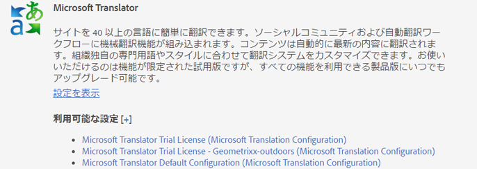
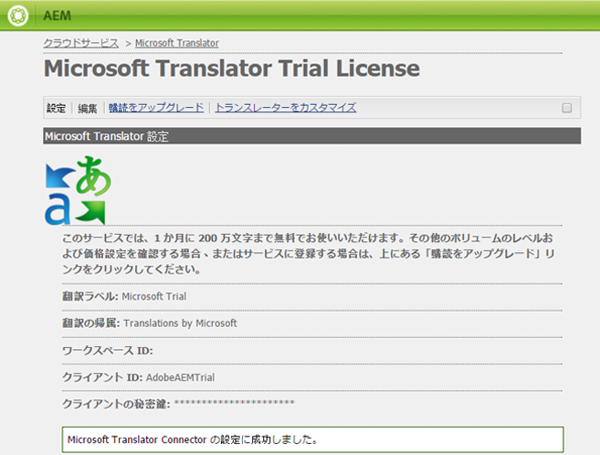

# Microsoft Translator への接続{#connecting-to-microsoft-translator}

Microsoft Translation アカウントを使用して AEM ページのコンテンツ、コミュニティのコンテンツまたはアセットを翻訳するには、Microsoft Translator クラウドサービス用の設定を作成します。

| プロパティ | 説明 |
|---|---|
| 翻訳ラベル | 翻訳サービスの表示名です。 |
| 翻訳の帰属 | （オプション）ユーザー生成コンテンツで、翻訳済みのテキストの横に表示される帰属です。例えば、「`Translations by Microsoft`」のようになります。 |
| ワークスペース ID | （オプション）使用するカスタマイズ済みの Microsoft Translator エンジンの ID です。 |
| サブスクリプションキー | Microsoft Translator 用の Microsoft サブスクリプションキー。 |

After you create the configuration, you need to [activate it](/help/sites-administering/tc-msconf.md#activating-the-translator-service-configurations).

次の手順では、タッチ操作向け UI を使用して Microsoft Translator の設定を作成します。

1. パネルで、ツール／クラウドサービスをクリックまたはタップします。
1. 「Microsoft Translator」領域で、「設定を表示」をクリックまたはタップします。
1. 「利用可能な設定」の横にある + リンクをクリックします。

   

1. 設定のタイトルを入力します。このタイトルによって、クラウドサービスコンソールおよびページプロパティのドロップダウンリストで設定が識別されます。デフォルト名はタイトルに基づいて指定されます。オプションとして、設定を格納するリポジトリノードに使用する名前を入力します。リポジトリノードのパスである「親設定」プロパティにはデフォルト値を使用する必要があります。
1. 「作成」をクリックします。
1. 表示されるダイアログボックスで、プロパティの値を入力して「OK」をクリックします。

## Microsoft Translator クラウドサービスのサンプル設定 {#sample-microsoft-translator-cloud-service-configurations}

以下のMicrosoft Translatorクラウドサービス設定が、Geometrixxサンプルと共にインストールされます。 一部のサンプル設定では、Microsoftの体験版の翻訳アカウントを使用し、1か月に最大2,000,000の無料翻訳文字を使用できます。

### Microsoft Translator 試用版ライセンス {#microsoft-translator-trial-license}

Microsoft Translator体験版ライセンスの設定は、Geometrixx Outdoorsサンプルパッケージと共にインストールされるサンプル設定です。 この設定では、無料の購読を持つMicrosoft Translatorアカウントを使用し、1か月に2000,000文字の翻訳を実行できます。

### Microsoft Translator 試用版ライセンス - Geometrixx-outdoors {#microsoft-translator-trial-license-geometrixx-outdoors}

Microsoft Translator 試用版ライセンス - Geometrixx-outdoors 設定は、Geometrixx Outdoors サンプルパッケージと共にインストールされるサンプル設定です。この設定では、Microsoft Translator 試用版ライセンス設定と同じ無料の Microsoft Translator アカウントを使用します。このアカウントには無料の購読があり、1か月に2000,000文字の翻訳が可能です。

この Microsoft Translator 設定は、Geometrixx Outdoors サンプルサイトのコンテンツのタイプで使用するために最適化されます。

### Microsoft Translator 試用版ライセンス設定のアップグレード {#upgrading-the-microsoft-translator-trial-license-configuration}

Microsoft Translation の設定ページには、実稼動システムに適したアカウントのサブスクリプションを取得する場合に役立つ、Microsoft Web サイトへのリンクが表示されます。

1. レールで、ツール／操作／クラウド／クラウドサービスをクリックまたはタップします。
1. 「Microsoft Translator」領域で、「設定を表示」をクリックまたはタップして、「Microsoft Translator 試用版ライセンス (Microsoft Translation の設定)」をクリックまたはタップします。

   

1. 設定ページで、「購読をアップグレード」をクリックします。表示された Microsoft の Web ページを使用して、アカウントを設定します。

   

### Microsoft Translator エンジンのカスタマイズ {#customizing-your-microsoft-translator-engine}

Microsoft Translation の設定ページには、Microsoft Translator エンジンをカスタマイズする場合に役立つ、Microsoft Web サイトへのリンクが表示されます（[https://hub.microsofttranslator.com](https://hub.microsofttranslator.com/)）。

1. レールで、ツール／操作／クラウド／クラウドサービスをクリックまたはタップします。
1. 「Microsoft Translator」領域で、「設定を表示」をクリックまたはタップして、カスタマイズする設定をクリックまたはタップします。
1. 設定ページで、「トランスレーターをカスタマイズ」をクリックします。表示された Microsoft の Web ページを使用して、サービスをカスタマイズします。

## 翻訳サービス設定のアクティベート {#activating-the-translator-service-configurations}

パブリッシュインスタンスでレプリケーションされる翻訳コンテンツをサポートするには、クラウドサービス設定をアクティベートする必要があります。Use the method of [activating a complete section (tree)](/help/sites-authoring/publishing-pages.md#publishing-and-unpublishing-a-tree) to activate the repository nodes that store the Microsoft Translator or third-party cloud service configurations. このノードは以下に示す親ノードの下にあります。

* Microsoft Translation Service: /libs/settings/cloudconfigs/translation/msft-translation
* サードパーティの翻訳： /etc/cloudservices/machine-translation

