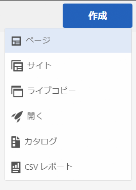
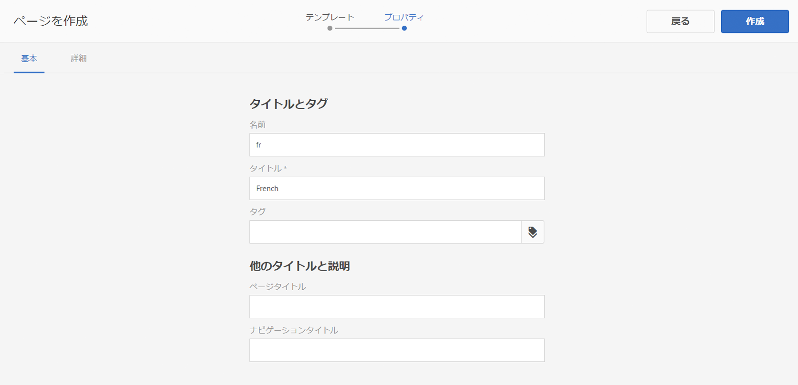
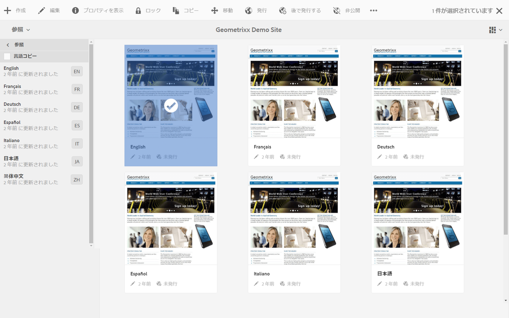

# 翻訳するコンテンツの準備{#preparing-content-for-translation}

通常、多言語の Web サイトは、ある程度の量のコンテンツを複数の言語で提供します。サイトは 1 つの言語でオーサリングされてから、他の言語に翻訳されます。通常、多言語サイトはページのブランチで構成されます。各ブランチには、異なる言語のサイトのページが含まれています。

サンプルの Geometrixx Demo Site には、複数の言語ブランチが含まれています。使用される構造は次のとおりです。

```xml
/content
    |- geometrixx
             |- en
             |- fr
             |- de
             |- es
             |- it
             |- ja
             |- zh
```

サイトの各言語ブランチは言語コピーと呼ばれます。言語コピーのルートページ（言語ルート）では、言語コピー内のコンテンツの言語を識別します。For example, `/content/geometrixx/fr` is the language root for the French language copy. Language copies must use a [correctly-configured language root](/help/sites-administering/tc-prep.md#creating-a-language-root) so that the correct language is targeted when translations of a source site are performed.

サイトのコンテンツを最初にオーサリングするための言語コピーが言語マスターです。言語マスターは、他の言語に翻訳されるソースです。

翻訳するサイトを準備するには、次の手順を使用します。

1. 言語マスターの言語ルートを作成します。例えば、英語の Geometrixx Demo Site の言語ルートは /content/geometrixx/en です。Ensure that the language root is correctly configured according to the information in [Creating a Language Root](/help/sites-administering/tc-prep.md#creating-a-language-root).
1. 言語マスターのコンテンツをオーサリングします。
1. サイトの各言語コピーの言語ルートを作成します。例えば、Geometrixx のサンプルサイトのフランス語の言語コピーは /content/geometrixx/fr です。

After you prepare your content for translation, you can automatically create missing pages in your language copies and associated translation projects. (See [Creating a Translation Project](/help/sites-administering/tc-manage.md).) For an overview of the content translation process in AEM, see [Translating Content for Multilingual Websites](/help/sites-administering/translation.md).

## 言語ルートの作成 {#creating-a-language-root}

コンテンツの言語を識別する言語コピーのルートページとして言語ルートを作成します。言語ルートを作成したら、言語コピーを含む翻訳プロジェクトを作成できます。

言語ルートを作成するには、ページを作成し、「名前」プロパティの値として ISO 言語コードを使用します。言語コードは次のどちらかの形式にしてください。

* `<language-code>`サポートされている言語コードは、ISO-639-1 で定義されている 2 文字のコード（例：`en`）です。

* `<language-code>_<country-code>` またはサポ `<language-code>-<country-code>`ートされる国コードは、ISO 3166で定義される小文字または大文字の2文字のコードです(例：、 `en_US``en_us``en_GB``en-gb`、など)。

グローバルサイト用に選択した構造に従って、どちらかの形式を使用できます。例えば、Geometrixx サイトのフランス語の言語コピーのルートページの「名前」プロパティは `fr` になります。「名前」プロパティは、リポジトリ内の page ノードの名前として使用されます。そのため、このプロパティによってページのパスが指定されます（http://localhost:4502/content/geometrixx/fr.html）。

次の手順では、タッチ操作向け UI を使用して Web サイトの言語コピーを作成します。クラシック UI を使用する手順については、[クラシック UI による言語ルートの作成](/help/sites-administering/tc-lroot-classic.md)を参照してください。

1. サイトに移動します。
1. 言語コピーを作成するサイトをクリックまたはタップします。

   例えば、Geometrixx Outdoors サイトの言語コピーを作成するには、「Geometrixx Outdoors Site」をクリックまたはタップします。

1. 「作成」をクリックまたはタップして、「ページを作成」をクリックまたはタップします。

   

1. ページテンプレートを選択して、「次へ」をクリックまたはタップします。
1. In the Name field type the country code in the format of `<language-code>` or `<language-code>_<country-code>`, for example `en`, `en_US`, `en_us`, `en_GB`, `en_gb`. ページのタイトルを入力します。

   

1. 「作成」をクリックまたはタップします。確認のダイアログボックスで、「**完了**」をクリックまたはタップしてサイトコンソールに戻ります。または「**開く**」をクリックまたはタップして言語コピーを開きます。

## 言語ルートのステータスの確認 {#seeing-the-status-of-language-roots}

タッチ操作向け UI には参照パネルがあります。このパネルには、作成された言語ルートのリストが表示されます。



次の手順では、タッチ操作向け UI を使用してページの参照パネルを開きます。

1. サイトコンソールで、サイトのページを選択し、「**参照**」をクリックまたはタップします。

   

1. 参照パネルで、「**言語コピー**」をクリックまたはタップします。Web サイトの言語コピーが言語コピーパネルに表示されます。

