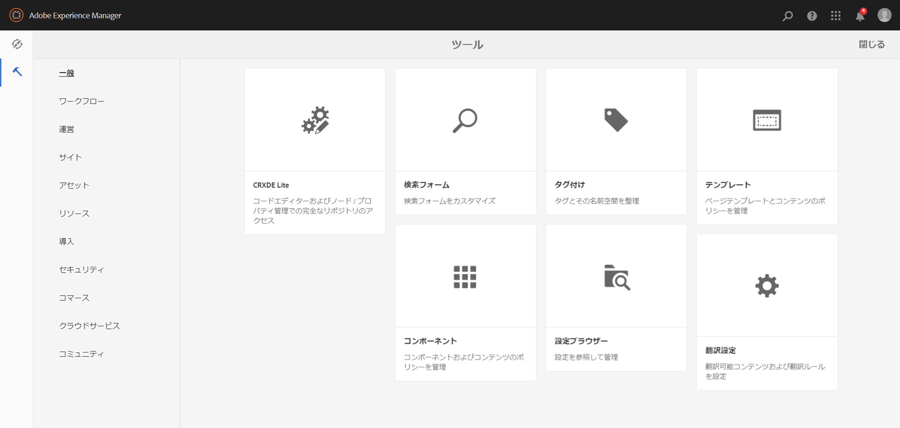
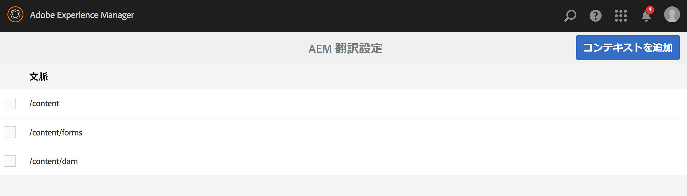
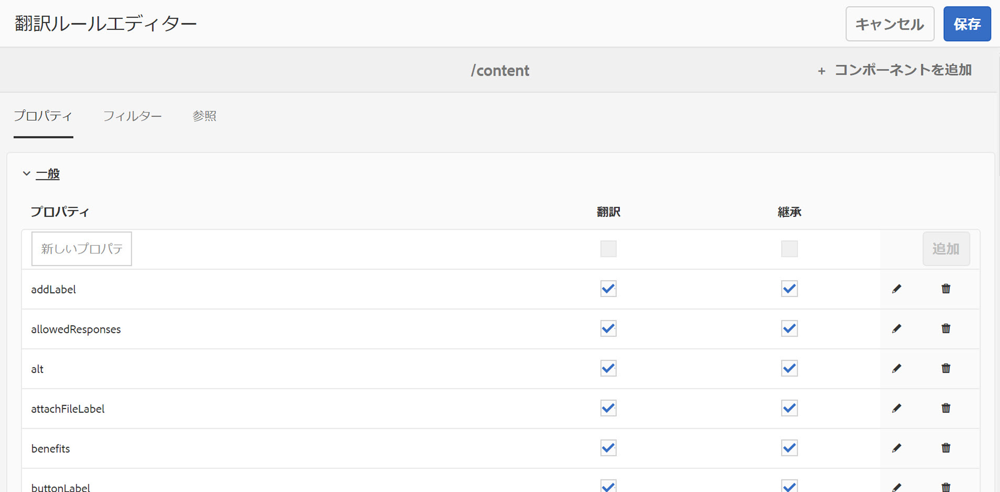
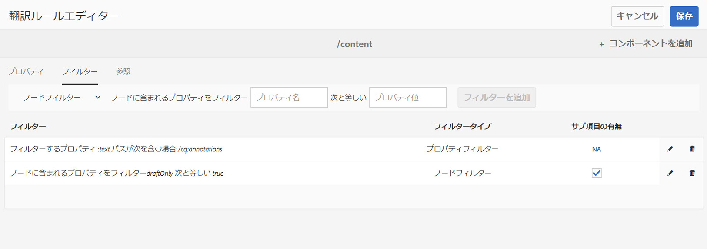
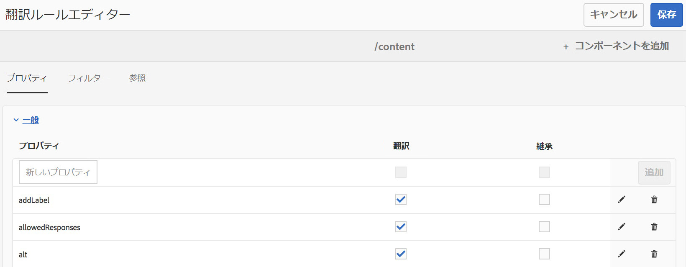
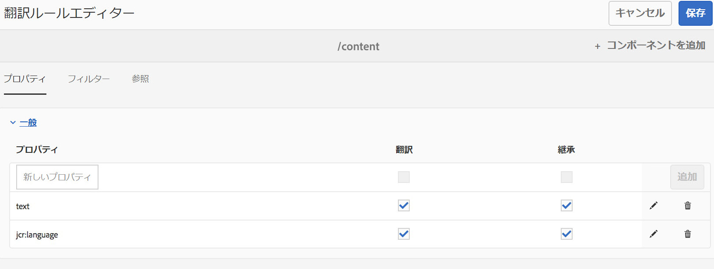

# 翻訳するコンテンツの特定{#identifying-content-to-translate}

翻訳プロジェクトに追加する、または翻訳プロジェクトから除外するページ、コンポーネントおよびアセットの翻訳対象コンテンツは翻訳ルールによって特定されます。ページまたはアセットを翻訳する場合は、AEM がそのコンテンツを抽出して、翻訳サービスに送信できるようにします。

ページとアセットは、JCR リポジトリ内のノードとして表されます。抽出されるコンテンツはノードの 1 つ以上のプロパティ値です。抽出するコンテンツを格納するプロパティは翻訳ルールによって特定されます。

翻訳ルールは XML 形式で表現され、次の場所に格納されています。

* `/libs/settings/translation/rules/translation_rules.xml`
* `/apps/settings/translation/rules/translation_rules.xml`
* `/conf/global/settings/translation/rules/translation_rules.xml`

このファイルはすべての翻訳プロジェクトに適用されます。

>[!NOTE]
>
>6.4 にアップグレードした後は、/etcからファイルを移動することをお勧めします。See [Common Repository Restructuring in AEM 6.5](/help/sites-deploying/all-repository-restructuring-in-aem-6-5.md#translation-rules) for more details.

ルールには以下の情報が含まれます。

* ルールを適用するノードのパス。この規則は、ノードの子孫にも適用されます。
* 翻訳するコンテンツを格納するノードプロパティの名前。特定のリソースタイプ専用のプロパティまたはすべてのリソースタイプに共通のプロパティがあります。

例えば、作成者がページ上のすべてのAEM foundationテキストコンポーネントに追加したコンテンツを翻訳するルールを作成できます。 ルールは、コンポー `/content` ネントのノードと `text` プロパティを識別でき `foundation/components/text` ます。

翻訳ルールの設定用に追加された[コンソール](#translation-rules-ui)があります。UI での定義の内容がファイルに自動的に入力されます。

For an overview of the content translation features in AEM, see [Translating Content for Multilingual Sites](/help/sites-administering/translation.md).

>[!NOTE]
>
>AEM は、ページ上の参照コンテンツの翻訳に関して、リソースタイプと参照属性の 1 対 1 マッピングをサポートしています。

## ページ、コンポーネントおよびアセット用のルールの構文 {#rule-syntax-for-pages-components-and-assets}

ルールとは、1 個以上の `node` 子要素と 0 個以上の `property` 子要素を含む `node` 要素です。

```xml
<node path="content path">
          <property name="property name" [translate="false"]/>
          <node resourceType="component path" >
               <property name="property name" [translate="false"]/>
          </node>
</node>
```

Each of these `node` elements has the following characteristics:

* `path` 属性には、ルールが適用されるブランチのルートノードのパスが格納されます。
* `property` 子要素は、すべてのリソースタイプについて、翻訳するノードプロパティを特定します。

   * `name` 属性には、プロパティ名が格納されます。
   * The optional `translate` attribute equals `false` if the property is not translated. デフォルト値は `true` です。この属性は、以前のルールを上書きする場合に役立ちます。

* `node` 子要素は、特定のリソースタイプについて、翻訳するノードプロパティを特定します。

   * `resourceType` 属性には、リソースタイプを実装するコンポーネントに解決されるパスが格納されます。
   * `property` 子要素は、翻訳するノードプロパティを特定します。このノードは、ノードルールの `property` 子要素と同じ方法で使用します。

次のルールの例では、ノードの下のすべてのページについて、すべての `text` プロパティの内容が変換され `/content` ます。 このルールは、基礎テキストコンポーネントや基礎イメージコンポーネントなど、 `text` プロパティにコンテンツを格納するコンポーネントに対して有効です。

```xml
<node path="/content">
          <property name="text"/>
</node>
```

次の例では、すべての `text` プロパティのコンテンツを翻訳し、基盤画像コンポーネントのその他のプロパティも翻訳します。その他のコンポーネントに同じ名前のプロパティが含まれている場合、それらのプロパティにはルールが適用されません。

```xml
<node path="/content">
      <property name="text"/>
      <node resourceType="foundation/components/textimage">
         <property name="image/alt"/>
         <property name="image/jcr:description"/>
         <property name="image/jcr:title"/>
      </node>
</node>
```

## ページからアセットを抽出するルールの構文  {#rule-syntax-for-extracting-assets-from-pages}

次に示すルールの構文を使用して、コンポーネントに埋め込むアセットまたはコンポーネントから参照するアセットを追加します。

```xml
<assetNode resourceType="path to component" assetReferenceAttribute="property that stores asset"/>
```

各 `assetNode` 要素には以下の特徴があります。

* 1 つの `resourceType` 属性は、コンポーネントに解決されるパスと等しくなります。
* 1 つの `assetReferenceAttribute` 属性は、（埋め込みアセット用の）アセットバイナリを格納するプロパティの名前または参照先のアセットのパスと等しくなります。

次の例では、基盤画像コンポーネントから画像を抽出します。

```xml
<assetNode resourceType="foundation/components/image" assetReferenceAttribute="fileReference"/>
```

## ルールの上書き {#overriding-rules}

translation_rules.xmlファイルは、複数の子要素を持つ `nodelist` 要素で構成され `node` ます。 AEMは、ノードリストを上から下に読み取ります。 複数のルールが同じノードにターゲットする場合は、ファイル内で下位のルールが使用されます。 例えば、次のルールでは、ページの分岐を除く、 `text` プロパティのすべてのコンテンツが翻訳され `/content/mysite/en` ます。

```xml
<nodelist>
     <node path="/content”>
           <property name="text" />
     </node>
     <node path=“/content/mysite/en”>
          <property name=“text” translate=“false" />
     </node>
<nodelist>
```

## プロパティのフィルタリング {#filtering-properties}

`filter`   要素を使用して、特定のプロパティを持つノードをフィルタリングできます。

例えば、次のルールを使用すると、プロパティ `text` が `draft` に設定されている場合を除き、`true` プロパティのすべてのコンテンツが翻訳されます。

```xml
<nodelist>
    <node path="/content”>
     <filter>
   <node containsProperty="draft" propertyValue="true" />
     </filter>
        <property name="text" />
    </node>
<nodelist>
```

## 翻訳ルール UI {#translation-rules-ui}

コンソールを使用して翻訳ルールを設定することもできます。

コンソールにアクセスするには：

1. **ツール**／**一般**&#x200B;に移動します。

   

1. 「**翻訳設定**」を選択します。

   

From here, you can **Add Context**. これにより、パスを追加できます。


Then you need to select your context and then click **Edit**. これにより、翻訳ルールエディターが開きます。



There are 4 attributes that you can change via the UI: `isDeep`, `inherit`, `translate` and `updateDestinationLanguage`.

**isDeep** この属性はノードのフィルターに適用され、デフォルトでtrueに設定されています。 ノード（またはその上位ノード）に、フィルターで指定されたプロパティ値を持つそのプロパティが含まれているかどうかをチェックします。false の場合は、現在のノードのみでチェックします。

For example, child nodes are getting added into a translation job even when the parent node is having property `draftOnly` set to true to flag draft content. ここで、`isDeep` が機能し、親ノードの `draftOnly` プロパティが true であるかどうかをチェックして、それらの子ノードを除外します。

In the Editor, you can check/uncheck **Is Deep** in the **Filters** tab.



次に、UI で「**サブ項目の有無**」をチェック解除した場合の結果の xml の例を示します。

```xml
 <filter>
    <node containsProperty="draftOnly" isDeep="false" propertyValue="true"/>
</filter>
```

**inherit** ：これはプロパティに適用されます。 デフォルトではすべてのプロパティが継承されますが、一部のプロパティが子で継承されないようにする場合は、その特定のノードのみで適用されるように、そのプロパティを false に指定できます。

UI では、「**プロパティ**」タブで「**継承**」をチェックまたはチェック解除できます。



**translate** :translate属性は、プロパティを変換するかどうかを指定する目的でのみ使用されます。

In the UI, you can check/uncheck **Translate** in the **Properties** tab.

**updateDestinationLanguage** この属性は、テキスト以外の言語コードを持つプロパティ（例：jcr:language）に使用されます。 ユーザーはテキストを翻訳していませんが、ソースから宛先への言語ロケールを設定します。そのようなプロパティは、翻訳用に送信されません。

In the UI, you can check/uncheck **Translate** in the **Properties** tab, but for the specific properties that have language codes as value.

`updateDestinationLanguage` と `translate` の違いを明確にするために、ルールが 2 つのみのコンテキストの単純な例を次に示します。



xml での結果は、次のようになります。

```xml
<property inherit="true" name="text" translate="true" updateDestinationLanguage="false"/>
<property inherit="true" name="jcr:language" translate="false" updateDestinationLanguage="true"/>
```

## ルールファイルの手動編集 {#editing-the-rules-file-manually}

AEM と共にインストールされる translation_rules.xml ファイルには、デフォルトの翻訳ルールセットが格納されています。翻訳プロジェクトの要件をサポートするようにこのファイルを編集できます。例えば、カスタムコンポーネントのコンテンツが翻訳されるようなルールを追加できます。

translation_rules.xml ファイルを編集する場合は、コンテンツパッケージにバックアップコピーを作成してください。現在の translation_rules.xml ファイルは、AEM サービスパックのインストールまたは特定の AEM パッケージの再インストールによって元のファイルに置き換わります。この状況でルールを復元するには、バックアップコピーを含むパッケージをインストールします。

>[!NOTE]
>
>コンテンツパッケージを作成した後は、ファイルを編集するたびにパッケージを再ビルドしてください。

## 翻訳ルールファイルのサンプル {#example-translation-rules-file}

```xml
<nodelist>
    <!-- translation rules for Geometrixx Demo site (example) -->
    <node path="/content/geometrixx">
        <!-- list all node properties that should be translated -->
        <property name="jcr:title" /> <!-- translation workflows running on content saved in /content/geometrixx, will extract jcr:title values independent of the component. -->
        <property name="jcr:description" />
        <node resourceType ="foundation/components/image"> <!-- translation workflows running on content saved in /content/geometrixx, will extract alternateText values only for Image component. -->
            <property name="alternateText"/>
        </node>
        <node resourceType ="geometrixx/components/title">
            <property name="richText"/>
            <property name="jcr:title" translate="false"/> <!-- translation workflows running on content saved in /content/geometrixx, will not extract jcr:title for Title component, but instead use richText. -->
        </node>
        <node pathContains="/cq:annotations">
            <property name="text" translate="false"/> <!-- translation workflows running on content saved in /content/geometrixx, will not extract text if part of cq:annotations node. -->
        </node>
    </node>
    <!-- translation rules for Geometrixx Outdoors site (example) -->
    <node path="/content/geometrixx-outdoors">
        <node resourceType ="foundation/components/image">
            <property name="alternateText"/>
            <property name="jcr:title" />
        </node>
        <node resourceType ="geometrixx-outdoors/components/title">
            <property name="richText"/>
        </node>
    </node>
    <!-- translation rules for ASSETS (example) -->
    <node path="/content/dam">
        <!-- configure list of metadata properties here -->
        <property name="dc:title" />
        <property name="dc:description" />
    </node>
    <!-- translation rules for extracting ASSETS from SITES content, configure all components that embed or reference assets -->
    <assetNode resourceType="foundation/components/image" assetReferenceAttribute="fileReference"/>
    <assetNode resourceType="foundation/components/video" assetReferenceAttribute="asset"/>
    <assetNode resourceType="foundation/components/download" assetReferenceAttribute="fileReference"/>
    <assetNode resourceType="foundation/components/mobileimage" assetReferenceAttribute="fileReference"/>
    <assetNode resourceType="wcm/foundation/components/image" assetReferenceAttribute="fileReference"/>
</nodelist>
```

