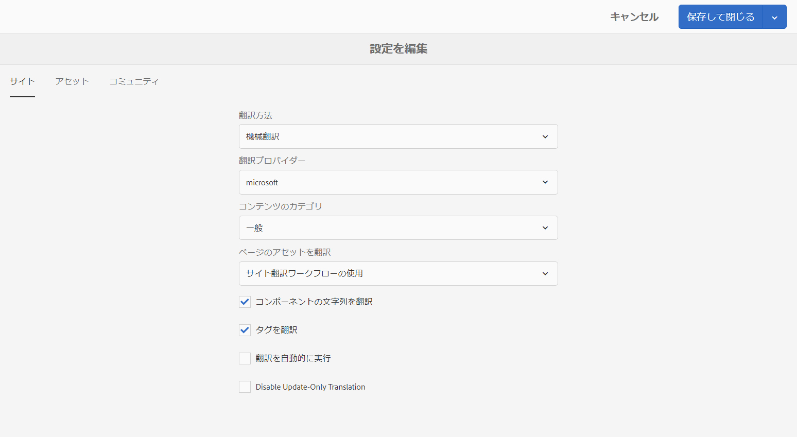

# 翻訳統合フレームワークの設定{#configuring-the-translation-integration-framework}

翻訳統合フレームワークは、AEM コンテンツの翻訳を組織化するためにサードパーティの翻訳サービスと統合されます。

* 翻訳サービスプロバイダーに接続します。
* 翻訳統合フレームワーク設定を作成します。
* クラウド設定をページに関連付けます。

For an overview of the content translation features in AEM, see [Translating Content for Multilingual Sites](/help/sites-administering/translation.md).

## 翻訳サービスプロバイダーへの接続 {#connecting-to-a-translation-service-provider}

AEM を翻訳サービスプロバイダーに接続するためのクラウド設定を作成します。AEM には、Microsoft Translator にデフォルトで接続する機能が用意されています。その他の翻訳プロバイダーについては、[パッケージ共有](/help/sites-administering/package-manager.md#package-share)からコネクターパッケージをダウンロードしてください。 次の翻訳ベンダーは翻訳プロジェクト用の新しい API の実装を提供します。統合とパッケージ共有からダウンロードする方法については、次のリンクを参照してください。

* [Translations.com](https://exchange.adobe.com/experiencecloud.details.90104.globallink-connect-plus-for-aem.html) (Adobe Exchange Premiere Partner)
* [Clay Tablet Technologies](https://marketing.adobe.com/resources/content/resources/en/exchange/marketplace/apps/clay-tablet-translation-connector-for-aem.html)（パッケージ共有にはないので、ベンダーに直接お問い合わせください）
* [Lionbridge](https://marketing.adobe.com/resources/content/resources/en/exchange/marketplace/apps/lionbridge-for-adobe-experience-manager.html)
* [Cloudwords](https://marketing.adobe.com/resources/content/resources/en/exchange/marketplace/apps/cloudwords-for-adobe-translations-connector.html)
* [CrossLang NV](https://marketing.adobe.com/resources/content/resources/en/exchange/marketplace/apps/crosslang-xtm-for-adobe-experience-manager.html)
* [Lingotek](https://marketing.adobe.com/resources/content/resources/en/exchange/marketplace/apps/lingotek-for-adobe-experience-manager.html)
* Microsoft（Microsoft Translator は AEM にプリインストールされています）
* [Smartling](https://marketing.adobe.com/resources/content/resources/en/exchange/marketplace/apps/smartling-connector-for-adobe-experience-manager.html)
* [SDL WorldServer](https://marketing.adobe.com/resources/content/resources/en/exchange/marketplace/apps/sdlworldserver-connector.html)
* [SDL TMS](https://marketing.adobe.com/resources/content/resources/en/exchange/marketplace/apps/sdl-tms-translation-connector-for-adobe-experience-manager.html)
* [Systran](https://marketing.adobe.com/resources/content/resources/en/exchange/marketplace/apps/systran-for-adobe-experience-manager.html)
* [Altlang](https://marketing.adobe.com/resources/content/resources/en/exchange/marketplace/apps/Altlang.html)

>[!NOTE]
>
>人間による翻訳と機械翻訳を提供する会社の最新のリストについては、次のページを参照してください。
>
>
>* [AEM 人間翻訳](https://www.adobe.com/go/aem-human-translation-connectors)
>* [AEM 機械翻訳](https://www.adobe.com/go/aem-machine-translation-connectors)
>

コネクターパッケージをインストールしたら、コネクター用のクラウド設定を作成できます。通常は、翻訳サービスで認証をおこなうための資格情報を指定する必要があります。Microsft Translator コネクター用のクラウド設定の追加については、[Microsoft Translator との統合](/help/sites-administering/tc-msconf.md)を参照してください。

必要に応じて、同じコネクターに対して複数のクラウド設定を作成できます。例えば、同じベンダーを使用するアカウントまたはプロジェクトごとに設定を 1 つずつ作成します。

接続の設定が完了したら、その接続を使用する翻訳統合フレームワーク設定を作成できます。

## 翻訳統合フレームワーク設定の作成 {#creating-a-translation-integration-configuration}

翻訳統合フレームワーク設定を作成して、コンテンツの翻訳方法を指定します。この設定には以下の情報が含まれます。

* 使用する翻訳サービスプロバイダー
* 人間による翻訳と機械翻訳のどちらを実行するか
* ページまたはアセットに関連付けられている他のコンテンツ（タグなど）を翻訳するかどうか

フレームワーク設定を作成したら、その設定に従って、翻訳するページにクラウド設定を関連付けます。翻訳プロセスが開始すると、関連付けられているフレームワーク設定に従って翻訳ワークフローが進行します。

Web サイトのセクションごとに翻訳要件が異なる場合は、それに応じて複数のフレームワーク設定を作成します。例えば、多言語の Web サイトに英語、スペイン語、日本語の言語コピーが含まれているとします。サイトの所有者は、スペイン語と日本語の翻訳のために 2 つの異なる翻訳サービスプロバイダーを使用します。そのため、フレームワークの設定が 2 つ指定されます。使用する翻訳サービスプロバイダーは設定ごとに異なります。

After you configure a translation integration framework, you can [associate it with the pages](/help/sites-administering/tc-prep.md) that use it.

**注意：** AEM のコンテンツ翻訳機能の概要については、[多言語サイトのコンテンツの翻訳](/help/sites-administering/translation.md)を参照してください。

フレームワークの単一の設定によって、ページのコンテンツ、コミュニティのコンテンツおよびアセットの翻訳方法が制御されます。

### 「サイト」の設定プロパティ{#sites-configuration-properties}

「サイト」のプロパティは、ページのコンテンツの翻訳を実行する方法を制御します。

<table>
 <tbody>
  <tr>
   <th>プロパティ</th>
   <th>説明</th>
  </tr>
  <tr>
   <td>翻訳ワークフロー</td>
   <td>
フレームワークがサイトコンテンツ用に実行する翻訳方法を選択します。

    <ul>
     <li>機械翻訳：翻訳プロバイダーが機械翻訳を使用してリアルタイムに翻訳を実行します。</li>
     <li>人間による翻訳：コンテンツが翻訳プロバイダーに送信され、翻訳者によって翻訳されます。 </li>
     <li>翻訳しない：コンテンツが翻訳対象として送信されません。翻訳されないものの、最新のコンテンツに更新される可能性があるコンテンツのブランチをスキップする場合に使用します。</li>
    </ul> </td>
  </tr>
  <tr>
   <td>翻訳プロバイダー</td>
   <td>翻訳を実行する翻訳プロバイダーを選択します。対応するコネクタがインストールされている場合は、プロバイダーがリストに表示されます。</td>
  </tr>
  <tr>
   <td>コンテンツのカテゴリ</td>
   <td>（機械翻訳のみ）カテゴリする内容を説明する翻訳。このカテゴリは、コンテンツの翻訳時に用語やフレーズの選択に影響を与える可能性があります。</td>
  </tr>
  <tr>
   <td>タグを翻訳</td>
   <td>ページに関連付けられているタグを翻訳する場合に選択します。</td>
  </tr>
  <tr>
   <td>ページのアセットを翻訳</td>
   <td>
ファイルシステムからコンポーネントに追加されるアセットまたはアセットから参照されるアセットを翻訳する方法を選択します。

    <ul>
     <li>翻訳しない：ページのアセットが翻訳されません。</li>
     <li>サイト翻訳ワークフローの使用：「サイト」タブの設定プロパティに従ってアセットが処理されます。</li>
     <li>アセット翻訳ワークフローの使用：「アセット」タブのプロパティの設定に従ってアセットが処理されます。</li>
    </ul> </td>
  </tr>
  <tr>
   <td>翻訳を自動実行</td>
   <td>翻訳プロジェクトの作成後に翻訳ジョブを自動的に実行する場合に選択します。このオプションを選択すると、翻訳ジョブのレビューやスコーピングをおこなう機会はなくなります。</td>
  </tr>
 </tbody>
</table>

### 「コミュニティ」の設定プロパティ {#communities-configuration-properties}

「コミュニティ」のプロパティは、ユーザー生成コンテンツの翻訳を実行する方法を制御します。ユーザー生成コンテンツの翻訳では常に機械翻訳を使用します。詳しくは、[ユーザー生成コンテンツの翻訳](/help/communities/translate-ugc.md)を参照してください。

| プロパティ | 説明 |
|---|---|
| 翻訳プロバイダー | 翻訳を実行する翻訳プロバイダーを選択します。クラウド設定の作成対象となるプロバイダーがリストに表示されます。 |
| コンテンツのカテゴリ | カテゴリする内容を説明する翻訳。このカテゴリは、コンテンツの翻訳時に用語やフレーズの選択に影響を与える可能性があります。 |
| グローバル共有ストアとして使用するロケールを選択 | (Optional) By selecting a locale for storing UGC, posts from all language copies will appear in one global conversation. By convention, choose the locale for the [base language](/help/communities/sites-console.md#translation) for the website. Choosing No Common Store will disable global translation. By default, global translation is disabled. |

### 「アセット」の設定プロパティ{#assets-configuration-properties}

Assets properties control how to configure assets. For more information about translating assets, see [Creating Language Copies for Assets](/help/assets/translation-projects.md).

<table>
 <tbody>
  <tr>
   <th>プロパティ</th>
   <th>説明</th>
  </tr>
  <tr>
   <td>翻訳ワークフロー</td>
   <td>
フレームワークがアセット用に実行する翻訳のタイプを選択します。

    <ul>
     <li>機械翻訳：翻訳プロバイダーが機械翻訳を使用してすぐに翻訳を実行します。</li>
     <li>人間による翻訳：コンテンツが自動的に翻訳プロバイダーに送信され、手動で翻訳されます。 </li>
     <li>翻訳しない：アセットが翻訳対象として送信されません。</li>
    </ul> </td>
  </tr>
  <tr>
   <td>翻訳プロバイダー</td>
   <td>翻訳を実行する翻訳プロバイダーを選択します。対応するコネクタがインストールされている場合は、プロバイダーがリストに表示されます。</td>
  </tr>
  <tr>
   <td>コンテンツのカテゴリ</td>
   <td>（機械翻訳のみ）カテゴリする内容を説明する翻訳。このカテゴリは、コンテンツの翻訳時に用語やフレーズの選択に影響を与える可能性があります。</td>
  </tr>
  <tr>
   <td>アセットを翻訳</td>
   <td>翻訳プロジェクトにアセットを追加する場合に選択します。 </td>
  </tr>
  <tr>
   <td>メタデータを翻訳</td>
   <td>アセットメタデータを翻訳する場合に選択します。</td>
  </tr>
  <tr>
   <td>タグを翻訳</td>
   <td>アセットに関連付けられているタグを翻訳する場合に選択します。</td>
  </tr>
  <tr>
   <td>翻訳を自動実行</td>
   <td>翻訳プロジェクトの作成後に翻訳ジョブを自動的に実行する場合に選択します。このオプションを選択すると、翻訳ジョブのレビューやスコーピングをおこなう機会はなくなります。</td>
  </tr>
 </tbody>
</table>

1. サイドバーで、ツール／運営／クラウド／クラウドサービスをクリックまたはタップします。
1. 「翻訳統合」領域に表示されるリンクは、作成された設定に応じて決まります。

   * 設定が作成されていない場合は、「今すぐ設定」をクリックまたはタップします。
   * 既存の設定がある場合は、「設定を表示」をクリックまたはタップして、「利用可能な設定」の横に表示される + リンクをクリックまたはタップします。

1. 設定の名前を入力して、「作成」をクリックまたはタップします。
1. 「サイト」、「コミュニティ」および「アセット」の各タブのプロパティを設定して、「OK」をクリックまたはタップします。

## 翻訳するページの設定 {#configuring-pages-for-translation}

ソースページを他の言語に翻訳するように設定するには、そのページを次のクラウド設定に関連付けます。

* AEM を翻訳サービスプロバイダーに接続するためのクラウド設定
* 翻訳の詳細を設定する翻訳統合フレームワーク

翻訳統合フレームワークのクラウド設定によって、サービスプロバイダーへの接続に使用するクラウド設定が特定されます。ソースページをフレームワークのクラウド設定に関連付ける場合は、フレームワークのクラウド設定が使用するサービスプロバイダーのクラウド設定にページを関連付ける必要があります。

ページをクラウド設定に関連付ける場合は、そのページの子ページが関連付けを継承します。例えば、/content/geometrixx/jp/productsページを翻訳統合フレームワークに関連付けた場合、製品ページとその下のすべてのページがフレームワークに従って翻訳されます。

必要に応じて、子ページの関連付けを上書きできます。例えば、Web サイトのコンテンツがほとんど衣料品に関するものだとします。しかし、ページの 1 つのブランチには企業の説明が記述されています。サイトのルートページは、「衣料品」カテゴリを使用して、機械翻訳を指定する翻訳統合フレームワークに関連付けられます。企業の説明が記述されているブランチでは、「一般」カテゴリを使用して、機械翻訳を実行するフレームワークを使用します。

Further, for any communities [SCF components](/help/communities/scf.md) on the pages, the user generated content (UGC) will include the ability for users to translate content. For more information, see [Translation of User Generated Content](/help/communities/translate-ugc.md).

### 翻訳プロバイダーへのページの関連付け {#associating-a-page-with-a-translation-provider}

ページおよび子ページの翻訳に使用する翻訳プロバイダーにページを関連付けます。

1. サイトコンソールで、設定するページを選択して、「プロパティを表示」をクリックまたはタップします。
1. 「編集」をクリックまたはタップし、「クラウドサービス」タブをクリックまたはタップします。
1. 設定を追加／翻訳統合をクリックまたはタップします。
1. 使用する翻訳プロバイダーを選択して、「完了」をクリックまたはタップします。

### 翻訳統合フレームワークへのページの関連付け {#associating-pages-with-a-translation-integration-framework}

ページおよび子ページの翻訳を実行する方法を定義する翻訳統合フレームワークにページを関連付けます。

1. サイトコンソールで、設定するページを選択して、「プロパティを表示」をクリックまたはタップします。
1. 「編集」をクリックまたはタップし、「クラウドサービス」タブをクリックまたはタップします。
1. 設定を追加／翻訳統合をクリックまたはタップします。
1. 使用する翻訳統合フレームワークを選択して、「完了」をクリックまたはタップします。

