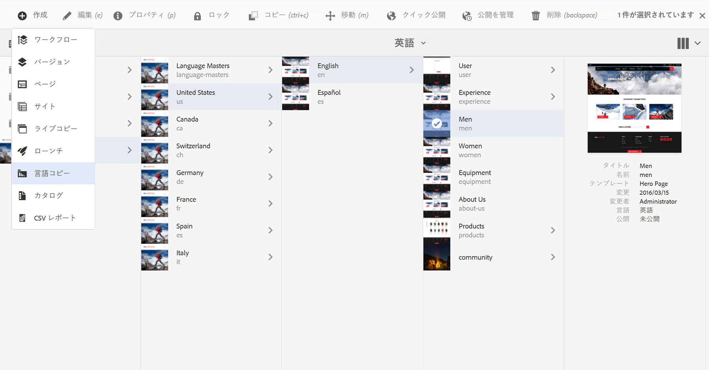
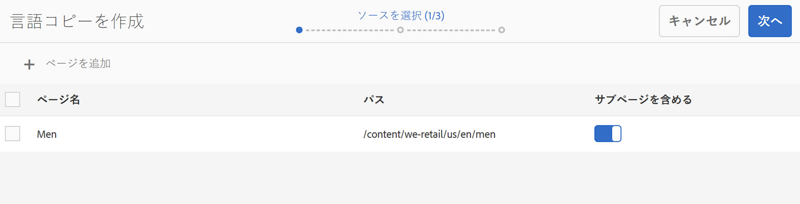
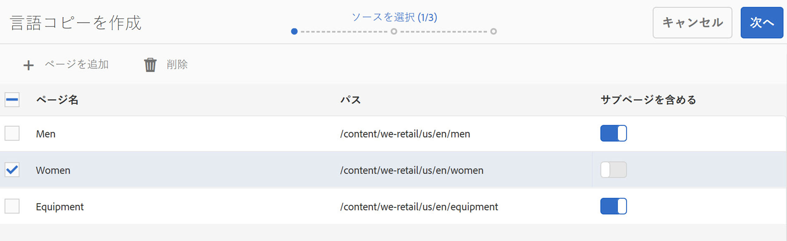
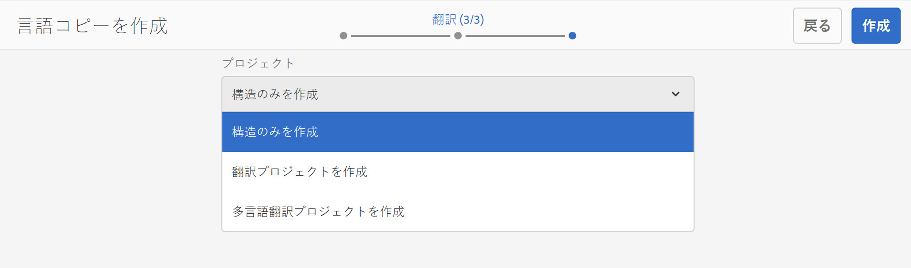
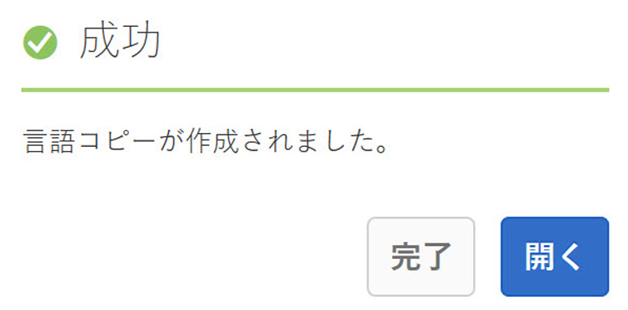

# 言語コピーウィザード{#language-copy-wizard}

言語コピーウィザードは、多言語コンテンツ構造を作成して実装するためのガイド付きエクスペリエンスです。言語コピーの作成が大幅に簡単かつ迅速になりました。

>[!NOTE]
>
>サイトの言語コピーを作成するには、ユーザーがプロジェクト管理者グループのメンバーである必要があります。

このウィザードにアクセスするには、次の手順を実行します。

1. 「サイト」で、ページを選択して「作成」をタップまたはクリックします。

   

1. 「言語コピー」を選択すると、ウィザードが開きます。

   

1. ウィザードの&#x200B;**ソースを選択**&#x200B;手順で、ページを追加または削除できます。サブページを含めるか除外するオプションもあります。

   

1. The **Next** button brings you to the **Configure** step of the wizard. ここでは、言語を追加または削除し、翻訳方法を選択できます。

   

   >[!NOTE]
   >
   >デフォルトでは、翻訳設定は 1 つのみです。他の設定を選択するには、最初にクラウド設定を設定する必要があります。[翻訳統合フレームワークの設定](/help/sites-administering/tc-tic.md)を参照してください。

1. The **Next** button brings you to the **Translate** step of the wizard. ここでは、構造のみを作成するか、新しい翻訳プロジェクトを作成するか、既存の翻訳プロジェクトに追加するかを選択できます。

   >[!NOTE]
   >
   >前の手順で複数言語を選択した場合は、複数の翻訳プロジェクトが作成されます。

   

1. 「**作成**」ボタンをクリックすると、ウィザードは終了します。

   

