# 権限管理のプリンシパルビュー{#principal-view-for-permissions-management}

## 概要 {#overview}

AEM 6.5 では、ユーザーとグループに対する権限管理が導入されました。主な機能は従来のUIと同じですが、使いやすくて効率的です。

## 使用方法 {#how-to-use}

### UI へのアクセス {#accessing-the-ui}

次に示すように、新しい UI ベースの権限管理は、セキュリティの下の権限カードからアクセスします。

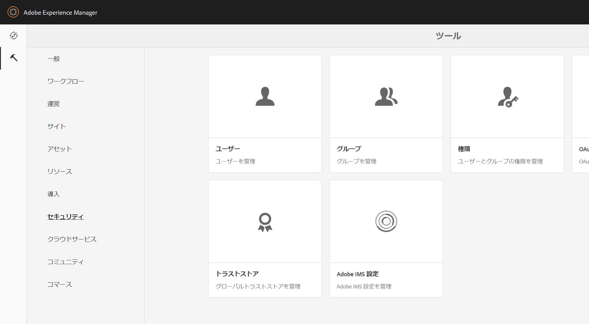

新しいビューでは、権限が明示的に付与されているすべてのパスで、特定のプリンシパルに対する特権と制限のセット全体を簡単に確認できます。高度な特権と制限を管理するのに

CRXDE に移動する必要がなくなります。同じビューに統合されました。デフォルトでは、グループ「everyone」が表示されます。

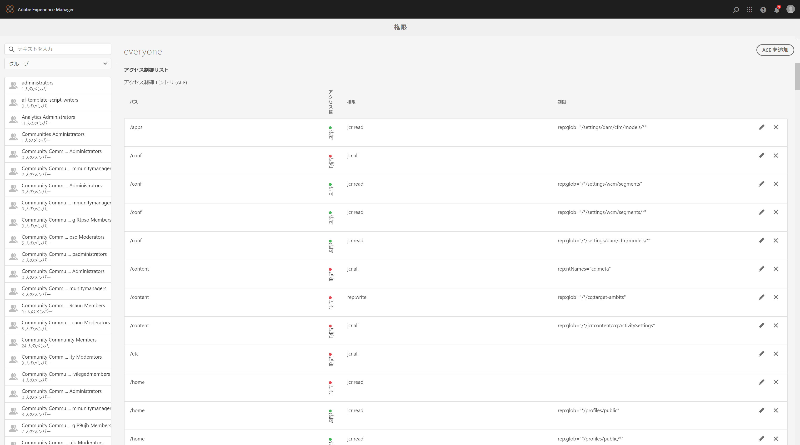

ユーザーが参照するプリンシパルの種類を、**ユーザー**、**グループ**&#x200B;または&#x200B;**すべて**&#x200B;から選択して、プリンシパルを検索できるフィルターがあります&#x200B;**。**

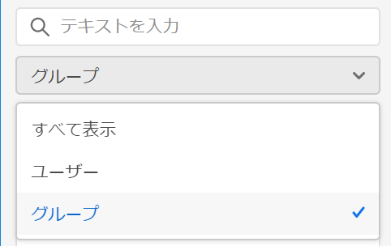

### プリンシパルの権限の表示 {#viewing-permissions-for-a-principal}

左側のフレームでは、下にスクロールしてプリンシパルを見つけるか、下に示すように、選択したフィルターに基づいてグループまたはユーザーを検索できます。

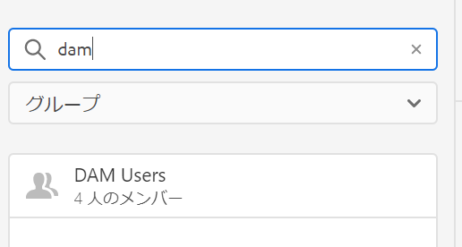

名前をクリックすると、割り当てられた権限が右側に表示されます。権限ウィンドウに、設定された制限と共に、特定のパス上のアクセス制御エントリの一覧が表示されます。

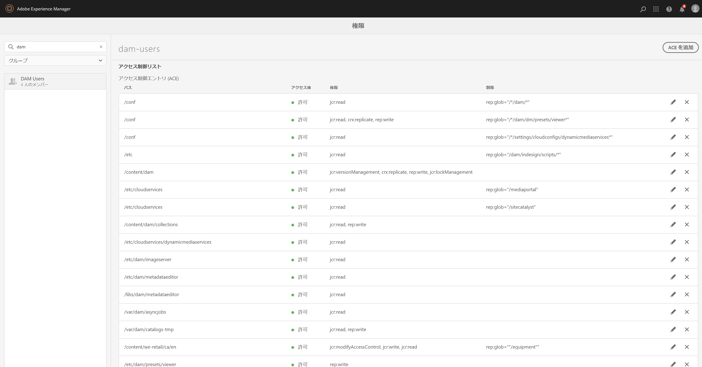

### プリンシパルへの新規アクセス制御エントリの追加 {#adding-new-access-control-entry-for-a-principal}

「ACE を追加」ボタンをクリックして新しいアクセス制御エントリを追加することで、新しい権限を追加できます。

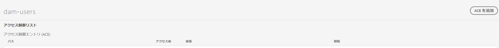

これにより、以下のウィンドウが表示されます。次の手順では、許可を設定する必要があるパスを選択します。

ここでは、**dam-users** にアクセス権を設定したいパスを選択します。

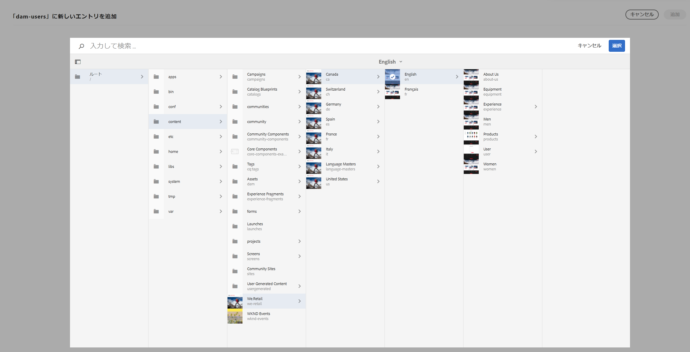

After the path is selected, the workflow goes back to this screen, where the user can then select one or more of the privileges from the available namespaces (like `jcr`, `rep` or `crx`) as shown i below.

テキストフィールドを使用して検索し、リストから選択することで権限を追加できます。

>[!NOTE]
>
>権限と説明の詳細なリストについては、[このページ](/help/sites-administering/user-group-ac-admin.md#access-right-management)を参照してください。

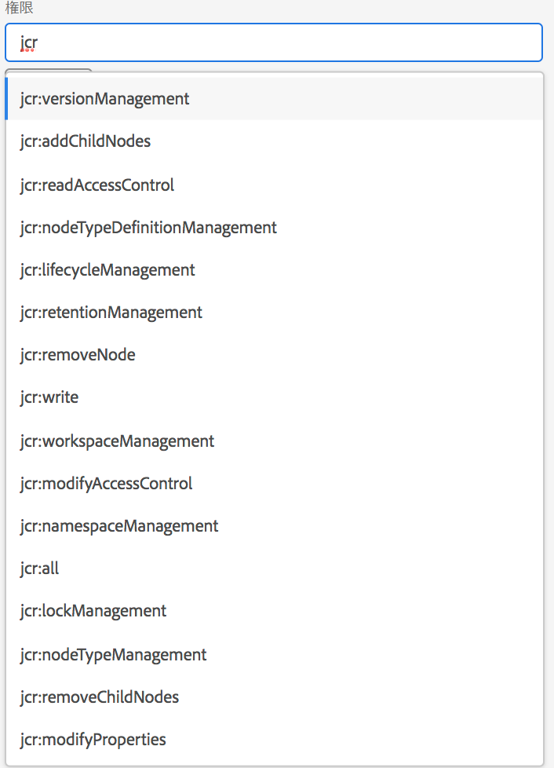 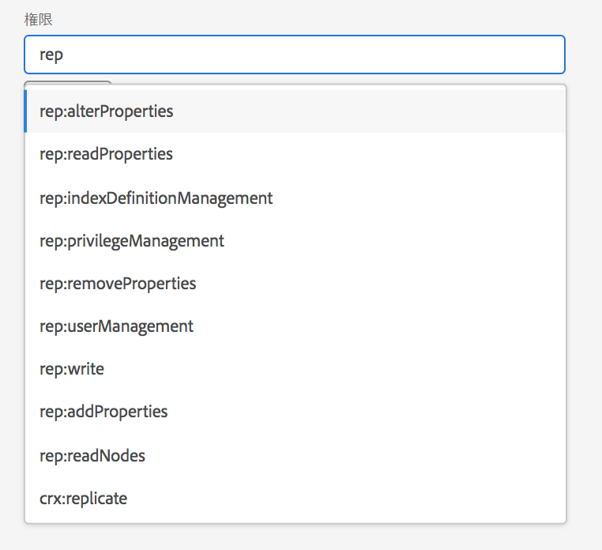

権限のリストが選択された後、以下に示すように、「拒否」または「許可」からアクセス権の種類を選択できます。

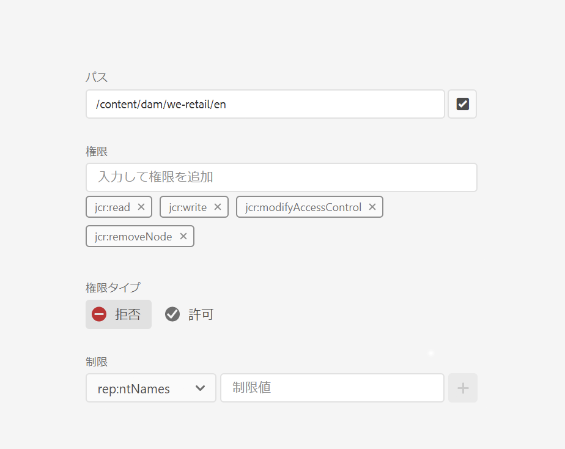 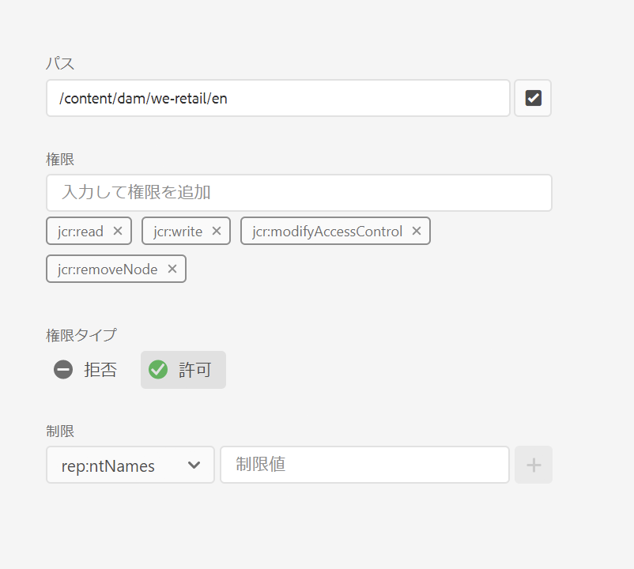

### 制限の使用 {#using-restrictions}

与えられたパス上の特権と許可の種類のリストに加えて、この画面では、以下に示すように、きめ細かいアクセス制御の制限を追加することもできます。

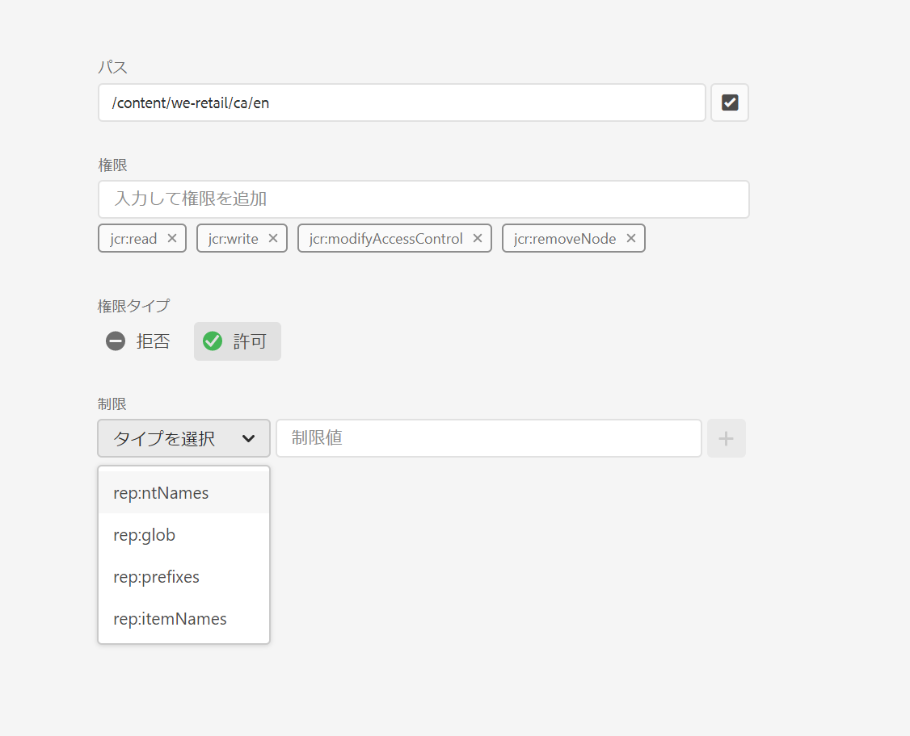

>[!NOTE]
>
>それぞれの制限の意味についての詳細は、[このページ](/help/sites-administering/user-group-ac-admin.md#restrictions)を参照してください。

以下に示すように、制限タイプを選択し、値を入力して **+** アイコンを押すと、制限を追加できます。 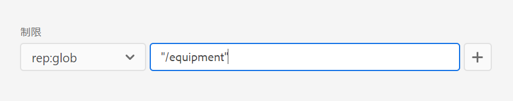 

新しい ACE がアクセス制御リストに反映されます。Note that `jcr:write` is an aggregate privilege that includes `jcr:removeNode` that was added above, but is not shown below as its covered under `jcr:write`.

### ACE の編集 {#editing-aces}

アクセス制御エントリは、プリンシパルを選択し、編集したい ACE を選択して編集できます。

例えば、ここでは **dam-users** の以下のエントリを、右側の鉛筆アイコンをクリックして編集できます。

編集画面には事前に選択された設定済み ACE が表示されます。これらは ACE の横にある × アイコンをクリックすると削除できます。また、下に示すように、指定したパスに新しい権限を追加できます。

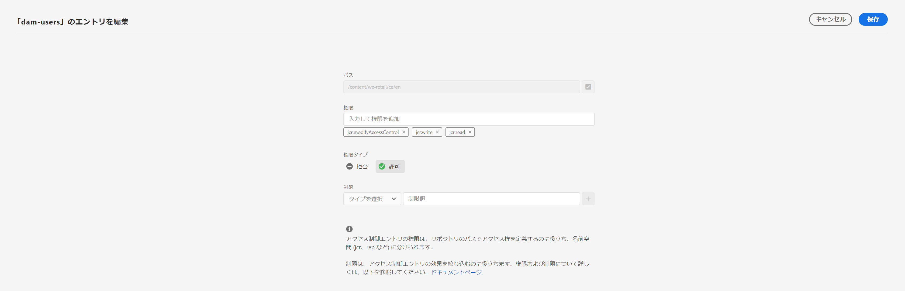

ここでは、与えられたパス上の `addChildNodes`dam-users **に** の権限を追加しています。

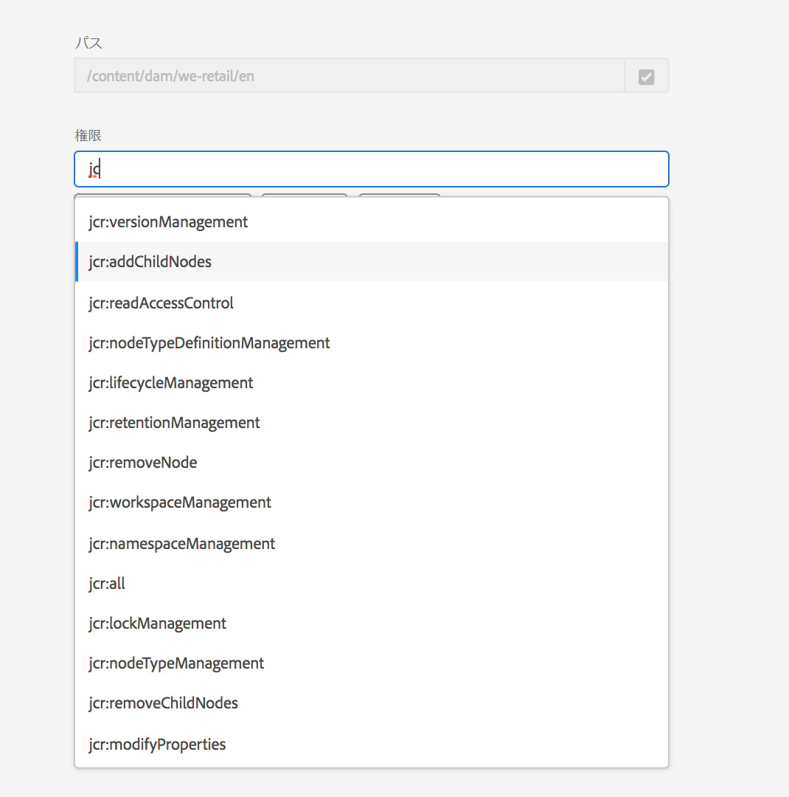

Changes can be saved by clicking the **Save** button on top right, and the changes will reflect in the new permissions for **dam-users **as shown below:

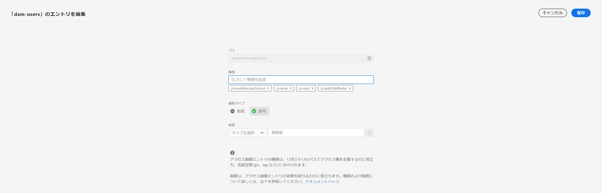

### ACE の削除 {#deleting-aces}

アクセス制御エントリを削除して、特定のパス上のプリンシパルに与えられているすべてのアクセス許可を削除できます。ACE の横にある × アイコンを使用して、下のように削除することができます。

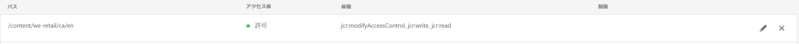 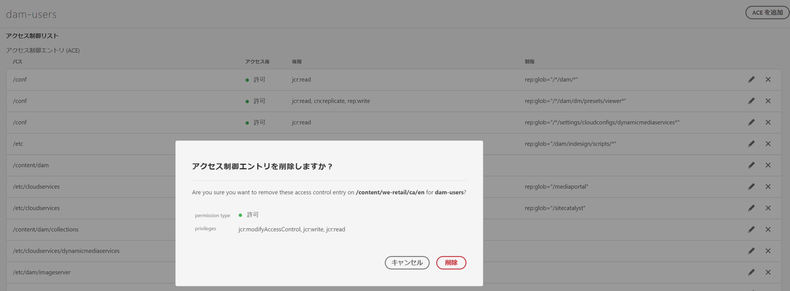

### クラシック UI 権限の組み合わせ {#classic-ui-privilege-combinations}

新しい権限 UI は、付与された基本的な特権を正確に反映しなかった定義済みの組み合わせではなく、基本的な権限セットを明示的に使用しています。

定義済みの組み合わせでは、正確に何が設定されているかについて混乱を引き起こしていました。次の表に、クラシック UI の権限の組み合わせと、それらを構成する実際の権限とのマッピングを示します。

<table>
 <tbody>
  <tr>
   <th>クラシック UI 権限の組み合わせ</th>
   <th>権限 UI の権限</th>
  </tr>
  <tr>
   <td>読み取り</td>
   <td><code>jcr:read</code></td>
  </tr>
  <tr>
   <td>変更</td>
   <td>
<code>jcr:modifyProperties</code>
 
<code>jcr:lockManagement</code>
 
<code>jcr:versionManagement</code>
 </td>
  </tr>
  <tr>
   <td>作成</td>
   <td>
<code>jcr:addChildNodes</code>
 
<code>jcr:nodeTypeManagement</code>
 </td>
  </tr>
  <tr>
   <td>削除</td>
   <td>
<code>jcr:removeNode</code>
 
<code>jcr:removeChildNodes</code>
 </td>
  </tr>
  <tr>
   <td>ACL 読み取り</td>
   <td><code>jcr:readAccessControl</code></td>
  </tr>
  <tr>
   <td>ACL 編集</td>
   <td><code>jcr:modifyAccessControl</code></td>
  </tr>
  <tr>
   <td>レプリケーション</td>
   <td><code>crx:replicate</code></td>
  </tr>
 </tbody>
</table>

