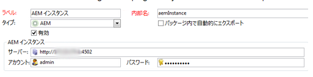

# Adobe Campaign 統合に関するトラブルシューティング{#troubleshooting-your-adobe-campaign-integration}

>[!NOTE]
>
>このページは Campaign Classic に適用されます。

次のトラブルシューティングヒントは、AEM を Adobe Campaign と統合する際に発生する最も一般的な問題を解決するのに役立ちます。

## トラブルシューティングに関する一般的なヒント {#general-troubleshooting-tips}

両方の統合において、HTTP の呼び出し（AEM から Adobe Campaign、Adobe Campaign から AEM）が送信されているかどうかをチェックできます。

* 統合でエラーが発生しているときは、それらの呼び出しがもう一方に届いていることを確認します（ファイアウォールや SSL の問題を回避するため）。
* AEM の機能では、JSON の呼び出しが AEM オーサーインターフェイスからリクエストされます。HTTP 500 のエラーは発生しません。HTTP 500 のエラーが発生した場合は、`error.log` で詳細を確認してください。
* AEM でキャンペーンクラスのデバッグレベルを上げることも問題のトラブルシューティングに役立ちます。

## 接続に失敗する場合 {#if-the-connection-fails}

Adobe Campaign で **aemserver** 演算子が設定されていることをチェックします。

## 画像が Adobe Campaign コンソールに表示されない場合 {#if-images-do-not-appear-in-the-adobe-campaign-console}

HTML ソースをチェックし、クライアントマシンから URL を開くことができることを検証します。URLにlocalhost:4503が含まれる場合は、Adobe Campaignコンソールマシンから到達できる発行インスタンスを指すように、作成者インスタンスのDay CQ Link Externalizerの設定を変更します。

See [Configuring the Externalizer.](/help/sites-administering/campaignstandard.md#configuring-the-externalizer)

## AEM から Adobe Campaign に接続できない場合 {#if-you-cannot-connect-from-aem-to-adobe-campaign}

Adobe Campaign で次のエラーメッセージを探します。

`No datasource defined in the instance 'default'.`

`Make sure the DNS alias used to access the server is correct (for example, avoid hard-coded IP addresses). (iRc=16384)`

To fix this issue, change the following in **$CAMPAIGN_HOME/conf/config-&lt;instance-name>.xml**:

`<dataStore hosts="*" lang="en_GB">`

## Adobe Campaign ダイアログにデータが表示されない場合 {#if-no-data-displays-in-the-adobe-campaign-dialog}

Adobe Campaign で、ポート番号の末尾がスラッシュ（/）で終わらないようにします。



## setlocale について警告が表示される場合 {#if-you-get-a-warning-about-your-setlocale}

If you are starting the Apache HTTPD service and see the error `"Warning: setlocale: LC_CTYPE cannot change locale"` make sure that you have your **en_CA.ISO-8859-15 locale** installed on your system.

`local -a` を使用することで、インストールされているかどうかをチェックできます。インストールされていない場合は、**/usr/local/neolane/nl6/env.sh** スクリプトをパッチして、ロケールをインストールされたロケールに変更します。

## スクリプト「get_nms_amcGetSeedMetaData_jssp」のコンパイル中にエラーが発生した場合 {#if-you-get-an-error-while-compiling-script-get-nms-amcgetseedmetadata-jssp}

AEM ログファイルに次のエラーメッセージが表示される場合：

`com.day.cq.mcm.campaign.impl.CampaignConnectorImpl Internal Adobe Campaign error: response body is Error while compiling script 'get_nms_amcGetSeedMetaData_jssp' line 45: String.prototype.toJSON called on incompatible XML.`

次の回避策を使用します。

1. **$CAMPAIGN_HOME/datakit/nms/fra/js/amcIntegration.js** ファイルを開きます。
1. メソッド amcGetSeedMetaData の 467 行目を変更します。
1. Change `label : [inclView.@label](mailto:inclView.@label)` to `label : String([inclView.@label](mailto:inclView.@label))`

1. 保存.
1. サーバーを再起動します。

## Adobe Campaign で「同期」ボタンをクリックしたときにエラーが表示される場合 {#if-adobe-campaign-displays-an-error-when-clicking-the-synchronize-button}

If when clicking the **Synchronize** button in Adobe Campaign Classic, you see the following error:

`Error while executing the method ‘aemListContent' of service [nms:delivery](https://nmsdelivery/)`

この問題を解決するには、外部アカウントで設定されている AEM の接続 URL にマシンからアクセスできることを確認してください。

**localhost** から IP アドレスに切り替えるとこの問題が解決します。

## 「Cannot parse XTK Date+Time &#39;undefined」というエラーが発生する場合 {#if-you-get-a-cannot-parse-xtk-date-time-undefined-error}

「同期」をクリックした後に、「Cannot parse XTK Date+Time &#39;undefined&#39;: not a valid XTK value」とページのスクリプトが発生した内容のエラーが発生します。

これは AEM インスタンスに期限切れの Adobe Campaign の情報が残っている場合に発生します。AEM 上にあるすべての Campaign 統合設定を削除して再構築することで、この問題を解決します。次に、新しいテンプレートを作成します。

## クラウドサービスをセットアップしているときに SSL に接続するとエラーが発生する場合 {#if-a-connection-to-ssl-displays-an-error-when-setting-up-the-cloud-service}

AEM の error.log に、次のログが表示されます。

```xml
javax.net.ssl.SSLProtocolException: handshake alert:  unrecognized_name
at sun.security.ssl.ClientHandshaker.handshakeAlert(Unknown Source)
at sun.security.ssl.SSLSocketImpl.recvAlert(Unknown Source)
at sun.security.ssl.SSLSocketImpl.readRecord(Unknown Source)
at sun.security.ssl.SSLSocketImpl.performInitialHandshake(Unknown Source)
at sun.security.ssl.SSLSocketImpl.writeRecord(Unknown Source)
at sun.security.ssl.AppOutputStream.write(Unknown Source)
```

チケットを切って Adobe Campaign のサポートチームにサポートを依頼してください。

## 同期ダイアログに想定していた https のリンクではなく http のリンクが表示される場合 {#if-you-see-http-instead-of-an-expected-https-links-in-the-synchronization-dialog}

セットアップは次のとおりです。

* AEM Author との通信に https を使用して Adobe Campaign をホストした
* リバースプロキシが SSL を終了している
* オンプレミスの AEM オーサーインスタンス

Adobe Campaign の配信でコンテンツを同期しようとすると、AEM はニュースレターのリストを返します。ただし、リスト内のニュースレターへの URL は http のアドレスです。リスト内のいずれかの項目を選択すると、エラーが発生します。

この問題を解決するには：

* 元のプロトコルをヘッダーとして渡すように、ディスパッチャーまたはリバースプロキシを設定する必要があります。
* The *Apache Felix Http Service SSL Filter* in the OSGi configuration ([https://&lt;host>:&lt;port>/system/console/configMgr](http://localhost:4502/system/console/configMgr)) needs to be configured to the respective header settings. See [https://felix.apache.org/documentation/subprojects/apache-felix-http-service.html#using-the-ssl-filter](https://felix.apache.org/documentation/subprojects/apache-felix-http-service.html#using-the-ssl-filter)

## 自身で作成したカスタムテンプレートをページのプロパティで選択できない場合 {#if-the-custom-template-i-created-cannot-be-selected-in-page-properties}

When creating a mail template for Adobe Campaign, you must include the property **acMapping** with the value **mapRecipient** in the **jcr:content** node of the template, or you will not be able to select the Adobe Campaign template in **Page Properties** of AEM (field is disabled).

## ログに「com.day.cq.mcm.campaign.servlets.util.ParameterMapper」というエラーが発生する場合 {#if-you-get-the-error-com-day-cq-mcm-campaign-servlets-util-parametermapper-in-your-logs}

カスタムテンプレートを使用すると、ログに「com.day.cq.mcm.キャンペーン.servlets.util.ParameterMapper」というエラーが表示されます。 この場合は、[パッケージ共有](/help/sites-administering/package-manager.md#package-share)からフィーチャーパック 6576 をインストールしてください。これは、acMappingプロパティを受信者.firstName以外の値に設定すると、Adobe Campaignマネージャ側に空白の値が作成される問題です。
