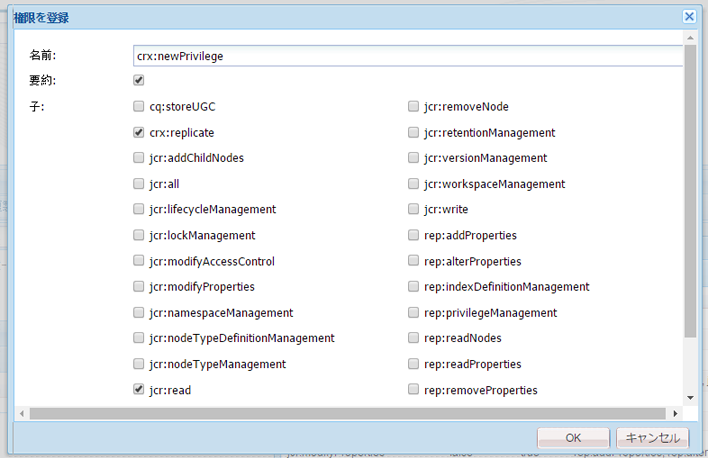

# ユーザー、グループおよびアクセス権限の管理{#user-group-and-access-rights-administration}

CRX リポジトリへのアクセスの有効化に関しては、以下のトピックがあります。

* [アクセス権限](#how-access-rights-are-evaluated) - 権限を定義および評価する方法の概念
* [ユーザー管理](#user-administration) - アクセスに使用する個々のアカウントの管理
* [グループ管理](#group-administration) - グループの作成によるユーザー管理の簡略化
* [アクセス権限の管理](#access-right-management) - ユーザーとグループがリソースにアクセスする方法を制御するポリシーの定義

基本的な要素：

**ユーザーアカウント** CRXは、ユーザーアカウントに保持されている詳細に従って、（そのユーザーまたは他のアプリケーションが）ユーザーを識別し、確認することで、アクセスを認証します。

CRX では、各ユーザーアカウントはワークスペース内のノードとなります。CRX ユーザーアカウントのプロパティには以下の特徴があります。

* CRX の 1 人のユーザーを表します。
* ユーザー名とパスワードを保持します。
* 対象のワークスペースに適用可能です。
* サブユーザーを所有することはできません。階層構造のアクセス権限の場合は、グループを使用する必要があります。

* ユーザーアカウントのアクセス権限を指定できます。

   ただし、管理を簡略化するために、（多くの場合）グループアカウントにアクセス権限を割り当てることをお勧めします。個々のユーザーにアクセス権限を割り当てると、管理が非常に困難になります（インスタンスの数が 1 つか 2 つしかない状況におけるシステムユーザーは例外です）。

**グループアカウント** ：グループアカウントは、ユーザーや他のグループの集まりです。 このアカウントは管理を簡略化するために使用します。これは、グループに割り当てられるアクセス権限の変更が、そのグループ内のすべてのユーザーに自動的に適用されるためです。ユーザーは必ずグループに属さなければならないというわけではありませんが、多くの場合は複数のグループに属しています。

CRX のグループのプロパティには以下の特徴があります。

* 共通のアクセス権限を持つユーザーのグループを表します。例えば、作成者や開発者などです。
* 対象のワークスペースに適用可能です。
* メンバー（個々のユーザーまたは他のグループ）を指定できます。
* 階層構造のグループはメンバーの関係を使用して作成されます。リポジトリ内の別のグループの直下にグループを配置することはできません。
* すべてのグループメンバーのアクセス権限を定義できます。

**アクセス権** CRXは、アクセス権を使用してリポジトリの特定の領域へのアクセスを制御します。

そのためには、リポジトリ内のリソース（ノードまたはパス）へのアクセスを許可または拒否する権限を割り当てます。割り当てることのできる権限は様々なので、権限を評価して、現在の要求に適用可能な組み合わせを判断する必要があります。

CRX では、ユーザーアカウントとグループアカウントの両方にアクセス権限を設定できます。ユーザーアカウントとグループアカウントに適用される評価の基本原則は同じです。

## アクセス権限の評価方法 {#how-access-rights-are-evaluated}

>[!NOTE]
>
>CRX は [JSR-283 で定義されているアクセス制御](https://docs.adobe.com/content/docs/en/spec/jcr/2.0/16_Access_Control_Management.html)を実装します。
>
>CRX リポジトリの標準インストールは、リソースベースのアクセス制御リストを使用するように設定されます。これは JSR-283 のアクセス制御の実行可能な 1 つの実装であり、Jackrabbit で提供される実装の 1 つです。

### サブジェクトとプリンシパル {#subjects-and-principals}

CRX では、次に示す 2 つの主要な概念を使用してアクセス権限を評価します。

* **プリンシパル**&#x200B;はアクセス権限を有するエンティティです。プリンシパルには以下のアカウントが含まれます。

   * ユーザーアカウント
   * グループアカウント

      1 つ以上のグループに属しているユーザーアカウントは、それらの各グループプリンシパルにも関連付けられます。

* サ **ブジェクト** は、リクエストのソースを表すために使用されます。

   この変数は、その要求に適用されるアクセス権を統合するために使用されます。 これらは、次の場所から取得されます。

   * ユーザープリンシパル

      ユーザーアカウントに直接割り当てる権限です。

   * そのユーザーに関連付けられているすべてのグループプリンシパル

      ユーザーが属する任意のグループに割り当てられたすべての権限。
   評価の結果は、要求されたリソースへのアクセスを許可または拒否するために使用されます。

#### サブジェクト用のアクセス権限リストの作成 {#compiling-the-list-of-access-rights-for-a-subject}

CRX では、サブジェクトは以下の項目に依存します。

* ユーザープリンシパル
* そのユーザーに関連付けられているすべてのグループプリンシパル

サブジェクトに適用可能なアクセス権限のリストは、以下の権限で構成されます。

* ユーザーアカウントに直接割り当てる権限
* ユーザーが属するいずれかのグループに割り当てられているすべての権限


>[!NOTE]
>
>* CRX では、リストの作成時にユーザー階層を考慮しません。
>* CRX でグループ階層を使用するのは、別のグループのメンバーとしてグループを追加する場合のみです。グループの権限が自動的に継承されることはありません。
>* グループを指定する順序がアクセス権限に影響を及ぼすことはありません。

>


### 要求の解決とアクセス権限 {#resolving-request-and-access-rights}

CRX が要求を処理する場合は、サブジェクトのアクセス要求とリポジトリノードのアクセス制御リストとを比較します。

So if Linda requests to update the `/features` node in the following repository structure:


### 優先順位 {#order-of-precedence}

CRX のアクセス権限は次のように評価されます。

* 以下に関係なく、ユーザープリンシパルが常にグループプリンシパルよりも優先されます。

   * アクセス制御リスト内の順序
   * ノード階層内の位置

* ある特定のプリンシパルに対して、あるノードで存在する deny エントリと allow エントリはそれぞれ 1 つまでです。冗長なエントリは常に実装によってクリアされ、allow エントリと deny エントリに同じ権限が示されることはありません。

>[!NOTE]
>
>この評価プロセスは、標準の CRX インストールのリソースベースのアクセス制御に適しています。

ユーザー `aUser` がグループ `aGroup` のメンバーである 2 つの例を次に示します。

```xml
   + parentNode
     + acl
       + ace: aUser - deny - write
     + childNode
       + acl
         + ace: aGroup - allow - write
       + grandChildNode
```

この場合、次のようになります。

* `aUser` はに対する書き込み権限が与えられてい `grandChildNode`ません。

```xml
   + parentNode
     + acl
       + ace: aUser - deny - write
     + childNode
       + acl
         + ace: aGroup - allow - write
         + ace: aUser - deny - write
       + grandChildNode
```

この場合の解決策は、次のとおりです。

* `aUser` はに対する書き込み権限が与えられてい `grandChildNode`ません。
* `aUser` の 2 つ目の ACE は冗長になります。


複数のグループプリンシパルのアクセス権限は、階層内および 1 つのアクセス制御リスト内における順序に基づいて評価されます。

### ベストプラクティス {#best-practices}

いくつかの推奨事項とベストプラクティスを次の表に示します。

<table>
 <tbody>
  <tr>
   <td>推奨事項</td>
   <td>理由...</td>
  </tr>
  <tr>
   <td><i>グループを使用する</i></td>
   <td><p>アクセス権限をユーザー単位で割り当てることは避けてください。これには以下の理由があります。</p>
    <ul>
     <li>グループ数よりもユーザー数の方がはるかに多いので、グループを使用すると構造が簡略化されます。</li>
     <li>グループはアカウント全体の概要を確認するために役立ちます。</li>
     <li>グループを使用する方が継承がシンプルになります。</li>
     <li>ユーザーは頻繁に追加／削除されます。グループは長期的に使用されます。</li>
    </ul> </td>
  </tr>
  <tr>
   <td><i>ポジティブに</i></td>
   <td><p>常に「許可」ステートメントを使用してグループプリンシパルのアクセス権限を指定します（可能な限り）。「拒否」ステートメントの使用は避けてください。</p> <p>グループプリンシパルは、階層内および 1 つのアクセス制御リスト内における順序に基づいて評価されます。</p> </td>
  </tr>
  <tr>
   <td><i>シンプルに</i></td>
   <td><p>新しいインストールの設定時に時間を費やし、入念な検討をおこなうと、効果があります。</p> <p>わかりやすい構造を適用することで、継続的なメンテナンスや管理が簡略化され、現在の担当者と今後の後任の担当者が実装されている内容を容易に把握できます。</p> </td>
  </tr>
  <tr>
   <td><i>テスト</i></td>
   <td>練習のためのテストインストールを利用して、様々なユーザーとグループ間の関係を把握してください。</td>
  </tr>
  <tr>
   <td><i>デフォルトのユーザー／グループ</i></td>
   <td>セキュリティの問題を回避するために、インストール直後にデフォルトのユーザーとグループを必ず更新してください。</td>
  </tr>
 </tbody>
</table>

## User Administration {#user-administration}

標準ダイアログは&#x200B;**ユーザー管理**&#x200B;に使用されます。

適切なワークスペースにログインする必要があります。ログイン後、次の場所からダイアログにアクセスできます。

* CRX のメインコンソールの「**ユーザー管理**」リンク
* CRX Explorer の&#x200B;**セキュリティ**&#x200B;メニュー


**プロパティ**

* **UserID**

   CRXにアクセスする際に使用される、アカウントの短い名前。

* **プリンシパル名**

   アカウントのフルテキスト名。

* **パスワード**

   このアカウントでCRXにアクセスする場合に必要です。

* **ntlmhash**

   
新しい各アカウントに自動的に割り当てられます。パスワードが変更されると更新されます。

* 名前、タイプ、値を定義して新しいプロパティを追加できます。新しいプロパティごとに「保存」（緑色のチェックマーク）をクリックします。

**グループのメンバーシップ**

アカウントが属しているすべてのグループが表示されます。「継承」列は、別のグループのメンバーシップの結果として継承されたメンバーシップを示します。

グループ ID（使用可能な場合）をクリックすると、そのグループ用の[グループ管理](#group-administration)が開きます。

**実行**

別のユーザーとして実行する機能では、ユーザーは別のユーザーに成り代わって作業をおこなうことができます。

これは、あるユーザーアカウントが操作を行うための他のアカウント（ユーザーまたはグループ）を指定できることを意味します。つまり、ユーザー B がユーザー A として実行することを許可されている場合、ユーザー B はユーザー A のアカウントの詳細（ID、名前、アクセス権限を含む）をすべて使用してアクションを実行できます。

これにより、別のユーザーのアカウントを使用しているかのようにタスクを完了できます。例えば、ユーザーの不在時や過剰な量の作業を短期間だけ分担する場合などに便利です。

あるアカウントが別のアカウントとして実行する場合、その判別は非常に困難です。ログファイルには、その機能がイベントに対して実行されたという事実に関する情報が保持されません。そのため、ユーザー B がユーザー A として実行している場合は、ユーザー A がすべてのイベントを実行しているように見えます。

### ユーザーアカウントの作成 {#creating-a-user-account}

1. **ユーザー管理**&#x200B;ダイアログを開きます。
1. 「**ユーザーを作成**」をクリックします。
1. 以下のプロパティを入力できます。

   * **ユーザー ID**：アカウント名として使用されます。
   * **パスワード**：ログイン時に必要です。
   * **プリンシパル名**：完全な名前を指定します。
   * **中間パス**：ツリー構造を作成するために使用できます。

1. 「保存」（緑色のチェックマーク）をクリックします。
1. ダイアログが展開されます。次の操作をおこなうことができます。

   1. 「**プロパティ**」を設定します。
   1. 「**グループのメンバーシップ**」を確認します。
   1. 「**実行**」を定義します。

>[!NOTE]
>
>以下の項目の数がどちらも多いインストール環境で新しいユーザーを登録する場合は、パフォーマンスが低下する可能性があります。
>
>* ユーザー
>* 多数のメンバーが存在するグループ

>


### ユーザーアカウントの更新 {#updating-a-user-account}

1. **ユーザー管理**&#x200B;ダイアログで、すべてのアカウントのリストビューを開きます。
1. ツリー構造内を確認します。
1. 必要なアカウントをクリックして編集用に開きます。
1. 対象のエントリを変更し、「保存」（緑色のチェックマーク）をクリックします。
1. 「**閉じる**」をクリックして終了するか、「**リスト**」をクリックしてすべてのユーザーアカウントのリストに戻ります。

### ユーザーアカウントの削除 {#removing-a-user-account}

1. **ユーザー管理**&#x200B;ダイアログで、すべてのアカウントのリストビューを開きます。
1. ツリー構造内を確認します。
1. 必要なアカウントを選択して「**ユーザーを削除**」をクリックします。選択したアカウントがすぐに削除されます。

>[!NOTE]
>
>これにより、対象のプリンシパルのノードがリポジトリから削除されます。
>
>アクセス権限のエントリは削除されません。これにより、履歴の整合性が確保されます。

### プロパティの定義 {#defining-properties}

新しいアカウントまたは既存のアカウントの&#x200B;**プロパティ**&#x200B;を定義できます。

1. 適切なアカウント用の&#x200B;**ユーザー管理**&#x200B;ダイアログを開きます。
1. **プロパティ**&#x200B;名を定義します。
1. ドロップダウンリストから「**種類**」を選択します。
1. 「**値**」を定義します。
1. 新しいプロパティについて「保存」（緑色のチェックマーク）をクリックします。

ごみ箱アイコンを使用すると、既存のプロパティを削除できます。

パスワード以外のプロパティは編集できません。これらは削除するか、再作成する必要があります。

#### パスワードの変更 {#changing-the-password}

**パスワード**&#x200B;は、変更が可能な特殊なプロパティです。パスワードを変更するには、「**パスワードを変更**」リンクをクリックします。

CRX Explorer の&#x200B;**セキュリティ**&#x200B;メニューから、パスワードを自分のユーザーアカウントに変更することもできます。

### 実行の定義 {#defining-an-impersonator}

新しいアカウントまたは既存のアカウントの実行を定義できます。

1. 適切なアカウント用の&#x200B;**ユーザー管理**&#x200B;ダイアログを開きます。
1. そのアカウントとして動作させることを許可するアカウントを指定します。

   「参照」を使用して、既存のアカウントを選択できます。

1. 新しいプロパティについて「保存」（緑色のチェックマーク）をクリックします。

## Group Administration {#group-administration}

標準ダイアログは&#x200B;**グループ管理**&#x200B;に使用されます。

適切なワークスペースにログインする必要があります。ログイン後、次の場所からダイアログにアクセスできます。

* CRX のメインコンソールの「**グループ管理**」リンク
* CRX Explorer の&#x200B;**セキュリティ**&#x200B;メニュー


**プロパティ**

* **GroupID**

   グループアカウントの略称。

* **プリンシパル名**

   グループアカウントのフルテキスト名。

* 名前、タイプ、値を定義して新しいプロパティを追加できます。新しいプロパティごとに「保存」（緑色のチェックマーク）をクリックします。

* **メンバー**

   ユーザーまたは他のグループを、このグループのメンバーとして追加できます。

**グループのメンバーシップ**

現在のグループアカウントが属しているすべてのグループが表示されます。「継承」列は、別のグループのメンバーシップの結果として継承されたメンバーシップを示します。

GroupIDをクリックすると、そのグループのダイアログが開きます。

**メンバー**

現在のグループのメンバーであるすべてのアカウント（ユーザーまたはグループ）が表示されます。

「**継承**」列は、別のグループのメンバーシップの結果として継承されたメンバーシップを示します。

>[!NOTE]
>
>いずれかのアセットフォルダーでユーザーに対して所有者、編集者または閲覧者の役割が割り当てられると、新しいグループが作成されます。The group name is of the format `mac-default-<foldername>` for each folder on which the roles are defined.

### グループアカウントの作成 {#creating-a-group-account}

1. **グループ管理**&#x200B;ダイアログを開きます。
1. 「**グループを作成**」をクリックします。
1. 以下のプロパティを入力できます。

   * **プリンシパル名**：完全な名前を指定します。
   * **中間パス**：ツリー構造を作成するために使用できます。

1. 「保存」（緑色のチェックマーク）をクリックします。
1. ダイアログが展開されます。次の操作をおこなうことができます。

   1. 「**プロパティ**」を設定します。
   1. 「**グループのメンバーシップ**」を確認します。
   1. 「**メンバー**」を管理します。

### グループアカウントの更新 {#updating-a-group-account}

1. **グループ管理**&#x200B;ダイアログで、すべてのアカウントのリストビューを開きます。
1. ツリー構造内を確認します。
1. 必要なアカウントをクリックして編集用に開きます。
1. 対象のエントリを変更し、「保存」（緑色のチェックマーク）をクリックします。
1. 「**閉じる**」をクリックして終了するか、「**リスト**」をクリックしてすべてのグループアカウントのリストに戻ります。

### グループアカウントの削除 {#removing-a-group-account}

1. **グループ管理**&#x200B;ダイアログで、すべてのアカウントのリストビューを開きます。
1. ツリー構造内を確認します。
1. 必要なアカウントを選択して「**グループを削除**」をクリックします。選択したアカウントがすぐに削除されます。

>[!NOTE]
>
>これにより、対象のプリンシパルのノードがリポジトリから削除されます。
>
>アクセス権限のエントリは削除されません。これにより、履歴の整合性が確保されます。

### プロパティの定義 {#defining-properties-1}

新しいアカウントまたは既存のアカウントのプロパティを定義できます。

1. 適切なアカウント用の&#x200B;**グループ管理**&#x200B;ダイアログを開きます。
1. **プロパティ**&#x200B;名を定義します。
1. ドロップダウンリストから「**種類**」を選択します。
1. 「**値**」を定義します。
1. 新しいプロパティについて「保存」（緑色のチェックマーク）をクリックします。

ごみ箱アイコンを使用すると、既存のプロパティを削除できます。

### メンバー {#members}

現在のグループにメンバーを追加できます。

1. 適切なアカウント用の&#x200B;**グループ管理**&#x200B;ダイアログを開きます。
1. 以下のどちらかの操作をおこないます。

   * 必要なメンバー（ユーザーまたはグループアカウント）の名前を入力します。
   * 「**参照**」を使用して検索を実行し、追加するプリンシパル（ユーザーまたはグループアカウント）を選択します。

1. 新しいプロパティについて「保存」（緑色のチェックマーク）をクリックします。

または、ごみ箱アイコンを使用して既存のメンバーを削除します。

## アクセス権限の管理 {#access-right-management}

With the **Access Control** tab of CRXDE Lite you can define the access control policies and assign the related privileges.

例えば、右下のウィンドウの「アクセス制御」タブにある「**現在のパス**」では、必要なリソースを左側のウィンドウで選択します。


ポリシーは次のように分類されます。

* **該当するアクセス制御ポリシー**

   これらのポリシーは適用できます。

   これらのポリシーは、ローカルポリシーの作成に使用できます。適用可能なポリシーを選択して追加すると、そのポリシーがローカルポリシーになります。

* **ローカルアクセス制御ポリシー**

   これらは、ユーザーが適用したアクセス制御ポリシーです。 このポリシーの更新、並べ替えまたは削除を行うことができます。

   親から継承したポリシーはローカルポリシーによって上書きされます。

* **効果的なアクセス制御ポリシー**

   これらは、すべてのアクセス要求に対して有効になっているアクセス制御ポリシーです。 ローカルポリシーおよび親から継承したポリシーから派生した集計ポリシーが表示されます。

### ポリシーの選択 {#policy-selection}

次の項目用のポリシーを選択できます。

* **現在のパス**

   上記の例と同様に、リポジトリ内のリソースを選択します。 この「現在のパス」用のポリシーが表示されます。

* **リポジトリ**

   リポジトリレベルのアクセス制御を選択します。 例えば、ノードではなくリポジトリにのみ関連する `jcr:namespaceManagement` 権限を設定する場合などに使用します。

* **プリンシパル**

   リポジトリに登録されているプリンシパルです。

   **プリンシパル**&#x200B;名を入力するか、フィールドの右側にあるアイコンをクリックして、**プリンシパルを選択**&#x200B;ダイアログを開きます。

   これにより、**ユーザー**&#x200B;または&#x200B;**グループ**&#x200B;を&#x200B;**検索**&#x200B;できます。表示されるリストから必要なプリンシパルを選択し、「**OK**」をクリックして値を前のダイアログに戻します。


>[!NOTE]
>
>管理を簡略化するために、個々のユーザーアカウントではなく、グループアカウントにアクセス権限を割り当てることをお勧めします。
>
>多数のユーザーアカウントではなく少数のグループを管理するほうが容易です。

### 権限 {#privileges}

アクセス制御エントリを追加する場合は、以下に示す権限を選択できます（詳しくは、[セキュリティ API](https://docs.adobe.com/docs/en/spec/javax.jcr/javadocs/jcr-2.0/javax/jcr/security/Privilege.html) に関するページを参照）。

<table>
 <tbody>
  <tr>
   <th><strong>権限名</strong></th>
   <th><strong>制御する権限</strong></th>
  </tr>
  <tr>
   <td><code>jcr:read</code></td>
   <td>ノードを取得して、そのプロパティと値を読み取ります。</td>
  </tr>
  <tr>
   <td><code>rep:write</code></td>
   <td>This is a jackrabbit specific aggregate privilege of jcr:write and jcr:nodeTypeManagement.<br /> </td>
  </tr>
  <tr>
   <td><code>jcr:all</code></td>
   <td>他の事前定義済み権限がすべて含まれる集計権限です。</td>
  </tr>
  <tr>
   <td><strong>アドバンス</strong></td>
   <td> </td>
  </tr>
  <tr>
   <td><code>crx:replicate</code></td>
   <td>ノードのレプリケーションを実行します。</td>
  </tr>
  <tr>
   <td><code>jcr:addChildNodes</code></td>
   <td>ノードの子ノードを作成します。</td>
  </tr>
  <tr>
   <td><code>jcr:lifecycleManagement</code></td>
   <td>ノード上でライフサイクル操作を実行します。</td>
  </tr>
  <tr>
   <td><code>jcr:lockManagement</code></td>
   <td>ノードをロックおよびロック解除します。ロックを更新します。</td>
  </tr>
  <tr>
   <td><code>jcr:modifyAccessControl</code></td>
   <td>ノードのアクセス制御ポリシーを変更します。</td>
  </tr>
  <tr>
   <td><code>jcr:modifyProperties</code></td>
   <td>ノードのプロパティを作成、変更および削除します。</td>
  </tr>
  <tr>
   <td><code>jcr:namespaceManagement</code></td>
   <td>名前空間の定義を登録、登録解除および変更します。</td>
  </tr>
  <tr>
   <td><code>jcr:nodeTypeDefinitionManagement</code></td>
   <td>ノードタイプ定義をリポジトリに読み込みます。</td>
  </tr>
  <tr>
   <td><code>jcr:nodeTypeManagement</code></td>
   <td>mixin ノードタイプを追加および削除し、ノードのプライマリノードタイプを変更します。変更には Node.addNode および XML 読み込みメソッドのすべての呼び出しを含めることができます。このメソッドで、新しいノードの mixin タイプまたはプライマリタイプが明示的に指定されます。</td>
  </tr>
  <tr>
   <td><code>jcr:readAccessControl</code></td>
   <td>ノードのアクセス制御ポリシーを読み取ります。</td>
  </tr>
  <tr>
   <td><code>jcr:removeChildNodes</code></td>
   <td>ノードの子ノードを削除します。</td>
  </tr>
  <tr>
   <td><code>jcr:removeNode</code></td>
   <td>ノードを削除します。</td>
  </tr>
  <tr>
   <td><code>jcr:retentionManagement</code></td>
   <td>ノード上で保持管理操作を実行します。</td>
  </tr>
  <tr>
   <td><code>jcr:versionManagement</code></td>
   <td>ノード上でバージョン管理操作を実行します。</td>
  </tr>
  <tr>
   <td><code>jcr:workspaceManagement</code></td>
   <td>JCR API によるワークスペースの作成と削除。</td>
  </tr>
  <tr>
   <td><code>jcr:write</code></td>
   <td>次の権限が含まれる集計権限です。<br />
- jcr:modifyProperties<br />
- jcr:addChildNodes<br />
- jcr:removeNode<br />
- jcr:removeChildNodes</td>
  </tr>
  <tr>
   <td><code>rep:privilegeManagement</code></td>
   <td>新しい権限を登録します。</td>
  </tr>
 </tbody>
</table>

### 新しい権限の登録 {#registering-new-privileges}

新しい権限を登録することもできます。

1. ツールバーから「**ツール**」を選択し、「**権限**」を選択して、現在登録されている権限を表示します。

   

1. **権限を登録**&#x200B;アイコン（**+**）を使用してダイアログを開き、新しい権限を定義します。

   

1. 「**OK**」をクリックして保存します。これで、権限を選択できるようになります。

### アクセス制御エントリの追加 {#adding-an-access-control-entry}

1. リソースを選択して「**アクセス制御**」タブを開きます。

1. 新しい&#x200B;**ローカルアクセス制御ポリシー**&#x200B;を追加するには、「**適用可能なアクセス制御ポリシー**」リストの右側にある **+** アイコンをクリックします。

   

1. 新しいエントリが「**「ローカルアクセス制御ポリシー**」の下に表示されます。。

   

1. **+** アイコンをクリックして新しいエントリを追加します。

   

   >[!NOTE]
   >
   >現時点では、空の文字列を指定するには対策が必要です。
   >
   >&quot;&quot; を使用してください。

1. アクセス制御ポリシーを定義し、「**OK**」をクリックして保存します。新しいポリシーは次のようになります。

   * 「**ローカルアクセス制御ポリシー**」の下に表示されます。
   * 「**有効なアクセス制御ポリシー**」に変更が反映されます。

選択項目は CRX によって検証されます。ある特定のプリンシパルに対して、あるノードで存在する deny エントリと allow エントリはそれぞれ 1 つまでです。冗長なエントリは常に実装によってクリアされ、allow エントリと deny エントリに同じ権限が示されることはありません。

### ローカルアクセス制御ポリシーの並べ替え {#ordering-local-access-control-policies}

リスト内の順序は、ポリシーの適用順序を示します。

1. 「**ローカルアクセス制御ポリシー**」のテーブルで必要なエントリを選択して、テーブル内の新しい位置にドラッグします。

   

1. 「**ローカルアクセス制御ポリシー**」と「**有効なアクセス制御ポリシー**」のテーブルの両方に変更が表示されます。

### アクセス制御ポリシーの削除 {#removing-an-access-control-policy}

1. 「**ローカルアクセス制御ポリシー**」のテーブルで、エントリの右側にある赤いアイコン（-）をクリックします。
1. 「**ローカルアクセス制御ポリシー**」と「**有効なアクセス制御ポリシー**」のテーブルの両方からエントリが削除されます。

### アクセス制御ポリシーのテスト {#testing-an-access-control-policy}

1. CRXDE Lite のツールバーから「**ツール**」、「**アクセス制御をテスト**」の順に選択します。
1. 右上のウィンドウに新しいダイアログが開きます。テストする&#x200B;**パス**&#x200B;または&#x200B;**プリンシパル**&#x200B;を選択します。
1. 「**テスト**」をクリックして選択項目の結果を確認します。

   