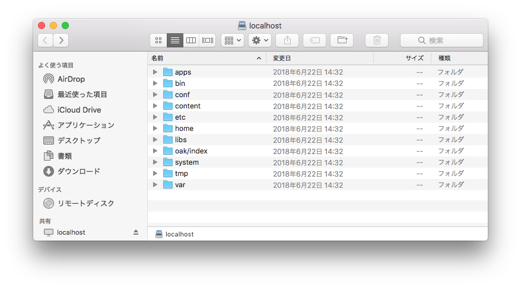
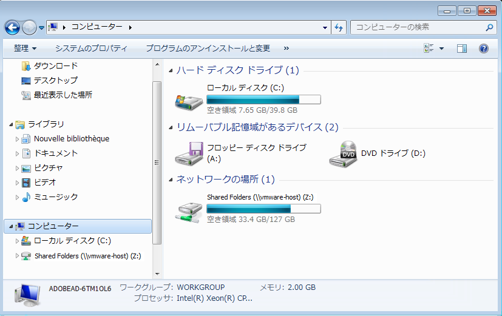
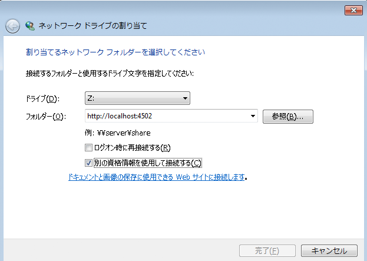
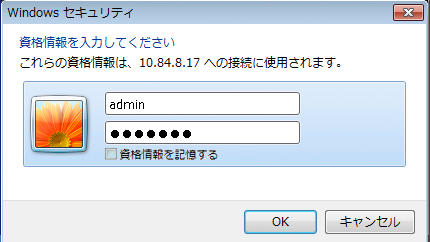
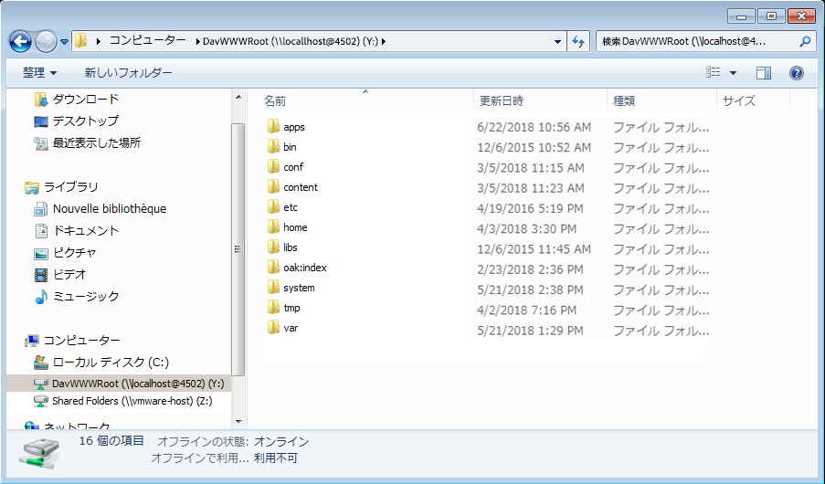

# WebDAV アクセス{#webdav-access}

KDE を使用して WebDAV を介して AEM に接続するには：

AEM では、WebDAV がサポートされており、WebDAV を使用してリポジトリコンテンツを表示および編集できます。WebDAV を介して接続すると、デスクトップからコンテンツリポジトリに直接アクセスできるようになります。WebDAV 接続を使用してテキストファイルや PDF ファイルをリポジトリに追加すると、自動的にそのファイルの全文インデックスが作成され、通常の検索インターフェイスや標準的な Java API を使用して検索できるようになります。

## 一般 {#general}

このドキュメントでは、[各オペレーティングシステムでの詳細な手順](/help/sites-administering/webdav-access.md#connecting-via-webdav)について説明していますが、WebDAV プロトコルを使用してリポジトリに接続する場合は、基本的に WebDAV クライアントから次の場所を参照します。

```xml
http://localhost:4502
```



この URL にオペレーティングシステムレベルで接続した場合には、WebDAV からデフォルトワークスペース（`crx.default`）にアクセスすることになります。ユーザーにとっては簡単ですが、この場合、[WebDAV の URL](/help/sites-administering/webdav-access.md#webdav-urls) を追加で指定してワークスペース名を柔軟に指定することはできません。

AEM ではリポジトリコンテンツが以下のように表示されます。

* このタイプのノード `nt:folder` は、フォルダーとして表示されます。 ノードの下のノード `nt:folder` は、フォルダーのコンテンツとして表示されます。

* タイプのノード `nt:file` はファイルとして表示されます。 ノードの下のノードは表示されませんが、 `nt:file` ファイルのコンテンツが形成されます。

WebDAVを使用してフォルダやファイルを作成および編集する場合、AEMは必要なノード `nt:folder``nt:file` とノードを作成および編集します。 WebDAVを使用してコンテンツの読み込みと書き出しを行う場合は、 `nt:file` および `nt:folder` ノードタイプをできる限り使用してください。

>[!NOTE]
>
>WebDAV を設定する前に、[技術要件](/help/sites-deploying/technical-requirements.md#webdav-clients)を確認してください。

## WebDAV の URL {#webdav-urls}

WebDAV サーバーの URL の構造は以下のとおりです。

<table>
 <colgroup>
  <col width="100" />
  <col width="100" />
  <col width="100" />
  <col width="100" />
  <col width="100" />
 </colgroup>
 <tbody>
  <tr>
   <td>
    <code>
     <strong>URL Component</strong>
    </code></td>
   <td><code>https://&lt;host&gt;:&lt;port&gt;</code></td>
   <td><code>/&lt;crx-webapp-path&gt;</code></td>
   <td><code>/repository</code></td>
   <td><code>/&lt;workspace&gt;</code></td>
  </tr>
  <tr>
   <td>
    <code>
     <strong>Example</strong>
    </code></td>
   <td><code>http://localhost:4502</code></td>
   <td><code>/crx</code></td>
   <td><code>/repository</code></td>
   <td><code>/crx.default</code></td>
  </tr>
  <tr>
   <td><strong>説明</strong></td>
   <td>AEMが稼働するホストとポート</td>
   <td>AEMリポジトリWebアプリケーションのパス</td>
   <td>WebDAV サーブレットのマッピング先のパス</td>
   <td>ワークスペースの名前</td>
  </tr>
 </tbody>
</table>

パスのワークスペース要素を変更することによって、デフォルト（`crx.default`）以外のワークスペースをマッピングできます。例えば、`staging` というワークスペースをマッピングするには、次の URL を使用します。

```xml
http://localhost:4502/crx/repository/staging
```

## WebDAV を介した接続 {#connecting-via-webdav}

[上述のとおり](/help/sites-administering/webdav-access.md#general)、WebDAVプロトコルを使用してリポジトリに接続するには、WebDAVクライアントをリポジトリの場所に指定します。 ただし、クライアントを接続するための手順は OS によって異なり、場合によっては OS の設定が必要になることもあります。

ここでは、次のオペレーティングシステムを接続する方法について説明します。

* [Windows](/help/sites-administering/webdav-access.md#windows)
* [macOS](/help/sites-administering/webdav-access.md#macos)
* [Linux](/help/sites-administering/webdav-access.md#linux)

### Windows {#windows}

SSL で保護されていない AEM インスタンスに Microsoft Windows 7（以降）システムを正常に接続するには、保護されていないネットワーク上で基本認証を確立するためのオプションを Windows で明示的に有効にする必要があります。そのためには、WebClient の Windows レジストリを変更する必要があります。

レジストリの更新後、AEM インスタンスをドライブとしてマッピングできます。

#### Windows 7 以降の設定 {#windows-and-greater-configuration}

保護されていないネットワーク上での基本認証を許可するようにレジストリを更新するには：

1. 次のレジストリのサブキーを探します。

   ```xml
   HKEY_LOCAL_MACHINE\SYSTEM\CurrentControlSet\Services\WebClient\Parameters
   ```

1. Set the `BasicAuthLevel` registry entry subkey to a value of `2` or greater.

   サブキーが存在しない場合は追加します。

1. レジストリの変更を有効にするには、システムを再起動する必要があります。

See [Microsoft Support KB 841215](https://support.microsoft.com/default.aspx/kb/841215) for more information on this registry change.

See [Microsoft Support KB 2445570](https://support.microsoft.com/kb/2445570) for information about improving the responsivness of the WebDav Client under Windows.

>[!NOTE]
>
>リポジトリユーザーと同じ資格情報を持つ Windows ユーザーを作成することをお勧めします。そうしないと、権限の競合が発生する可能性があります。

#### Windows 8 の設定 {#windows-configuration}

Windows 8 でも、[Windows 7 以降の場合](/help/sites-administering/webdav-access.md#windows-and-greater-configuration)と同様に、レジストリエントリを変更する必要があります。ただし、事前にデスクトップエクスペリエンスを有効にして、レジストリエントリが表示されるようにする必要があります。

To enable the Desktop Experience, open **Server Manager**, then **Features**, then **Add Features**, then **Desktop Experience**.

再起動すると、Windows 7 以降で説明したレジストリエントリが使用可能になります。変更方法は Windows 7 以降の場合と同じです。

#### Windows での接続 {#connecting-in-windows}

Windows 環境で WebDAV を介して AEM に接続するには：

1. Open **Windows Explorer** or **File Explorer** and click on **Computer** or **This PC**.

   

1. 「**ネットワークドライブの割り当て**」をクリックして、ウィザードを起動します。
1. マッピングの詳細を入力します。

   * **ドライブ**：使用可能な任意の文字を選択
   * **Folder**: `http://localhost:4502`
   * 「**別の資格情報を使用して接続する**」をオン

   「完了」をクリックします。

   

   >[!NOTE]
   >
   >AEMが別のポートに配置されている場合は、4502ではなく、そのポート番号を使用します。 また、コンテンツリポジトリをローカルマシンで実行していない場合は、`localhost` を該当するサーバー名または IP アドレスに置き換えてください。

1. Enter username `admin` and password `admin`. あらかじめ設定されている admin アカウントを使用してテストすることをお勧めします。

   

1. ウィザードが閉じ、新規にマッピングしたドライブが Windows エクスプローラーまたはエクスプローラーに開きます。

   

以上で、WebDAV を介して AEM が Windows のドライブとしてマッピングされ、他のドライブと同じように使用できるようになります。

### macOS {#macos}

macOS では、WebDAV を介して接続するために必要な設定手順は特にありません。単に WebDAV サーバーに接続するだけです。

1. 任意の **Finder** ウィンドウに移動して「**移動**」と「**サーバへ接続**」をクリックするか、**Command + K** キーを押します。
1. **サーバへ接続**&#x200B;ウィンドウで、AEM の場所を入力します。

   * `http://localhost:4502`
   >[!NOTE]
   >
   >AEMが別のポートに配置されている場合は、4502ではなく、そのポート番号を使用します。 また、コンテンツリポジトリをローカルマシンで実行していない場合は、`localhost` を該当するサーバー名または IP アドレスに置き換えてください。

1. 認証を要求する画面が表示されたら、ユーザー名として「`admin`」、パスワードとして「`admin`」と入力します。あらかじめ設定されている admin アカウントを使用してテストすることをお勧めします。

以上で、WebDAV を介して AEM に接続され、Mac 上の他のフォルダーと同じように使用できるようになります。

### Linux {#linux}

Linux では、WebDAV を介して接続するために必要な設定は特にありませんが、デスクトップ環境によっては接続を確立するためにいくつかの手順が必要になる場合があります。

#### GNOME {#gnome}

GNOME を使用して WebDAV を介して AEM に接続するには：

1. Nautilus（ファイルエクスプローラー）で、「**Places**」を選択し、「**Connect to Server**」を選択します。
1. **Connect to Server** ウィンドウの「Service Type」で「WebDAV (HTTP)」を選択します。

1. 「 **Server**」に、 `http://localhost:4502/crx/repository/crx.default`

   >[!NOTE]
   >
   >AEMが別のポートに配置されている場合は、4502ではなく、そのポート番号を使用します。 また、コンテンツリポジトリをローカルマシンで実行していない場合は、`localhost` を該当するサーバー名または IP アドレスに置き換えてください。

1. In **Folder**, enter `/dav`
1. Enter the username `admin`. あらかじめ設定されている admin アカウントを使用してテストすることをお勧めします。
1. ポートは空白のままにして、接続用の名前を入力します。
1. Click **Connect**. AEM prompts you for your password.
1. パスワードとして「`admin`」と入力し、「**Connect**」をクリックします。

GNOMEはAEMをボリュームとしてマウントし、他のボリュームと同様に使用できます。

#### KDE {#kde}

1. ネットワークフォルダーウィザードを開きます。
1. 「**WebFolder**」（webdav）を選択して「Next」をクリックします。
1. 「**Name**」に接続名を入力します。
1. 「 **Adobe**」に、事前設定済みの管理者アカウントを使用することを推奨する `admin.` ユーザーと入力します。
1. 「 **Server**」に、 `http://localhost:4502/crx/repository/crx.default`

   >[!NOTE]
   >
   >AEMが別のポートに配置されている場合は、4502ではなく、そのポート番号を使用します。 また、コンテンツリポジトリをローカルマシンで実行していない場合は、`localhost` を該当するサーバー名または IP アドレスに置き換えてください。

1. In **Folder**, enter `dav`

1. 「**Save and Connect**」をクリックします。
1. パスワードを要求する画面が表示されたら、パスワードとして「`admin`」と入力し、「**Connect**」をクリックします。

KDEはAEMをボリュームとしてマウントし、他のボリュームと同様に使用できます。
